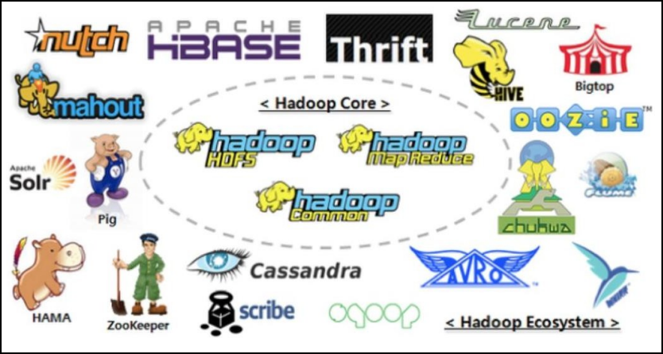
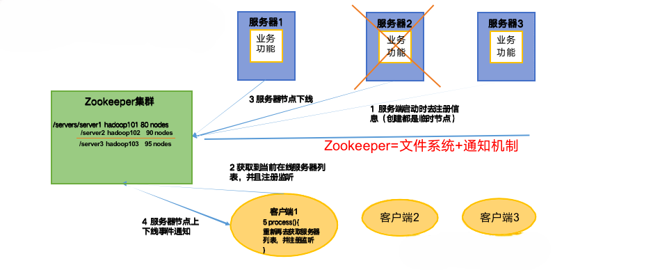
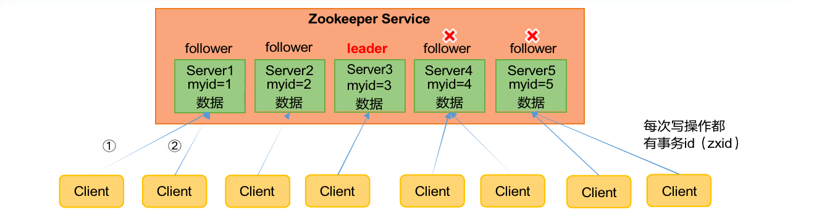
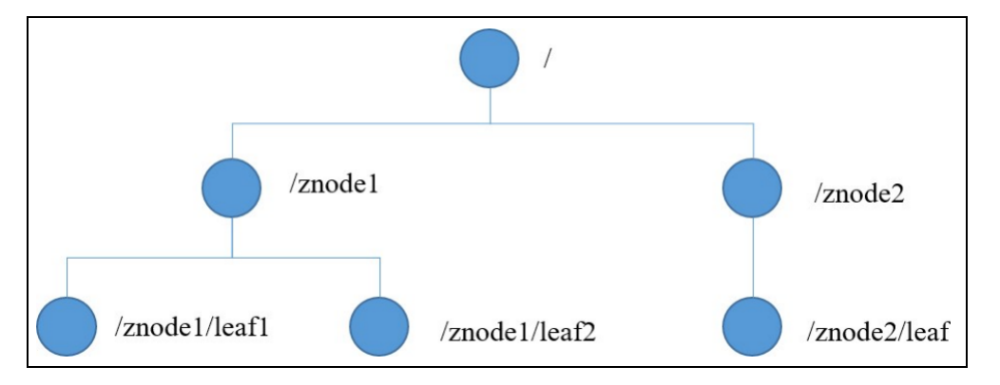
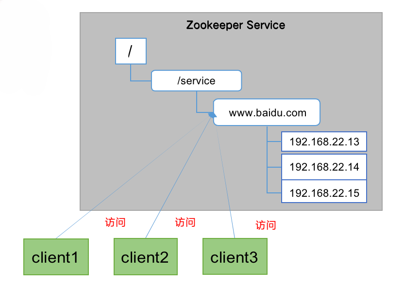
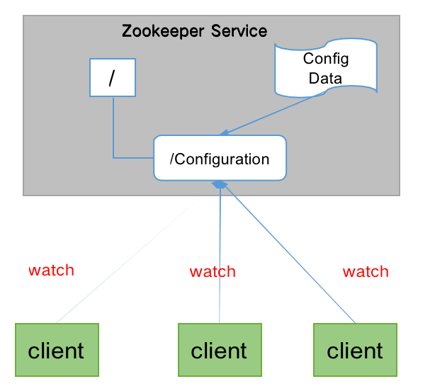
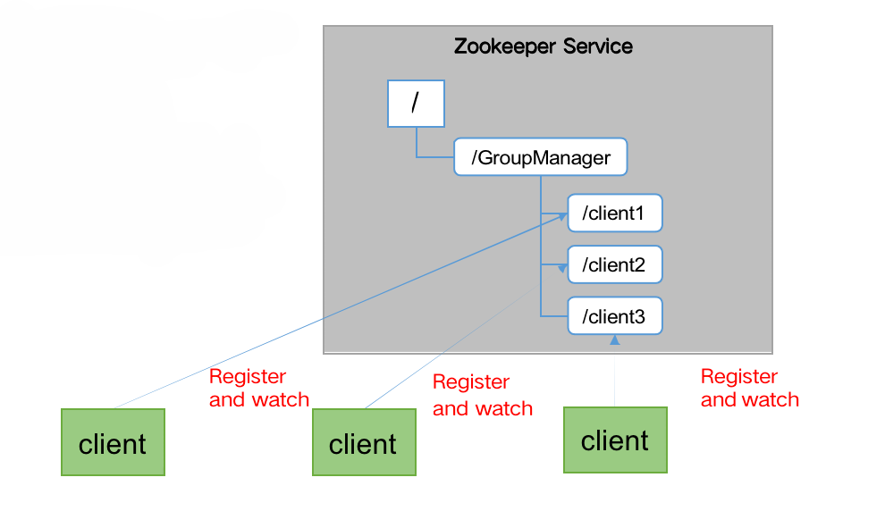
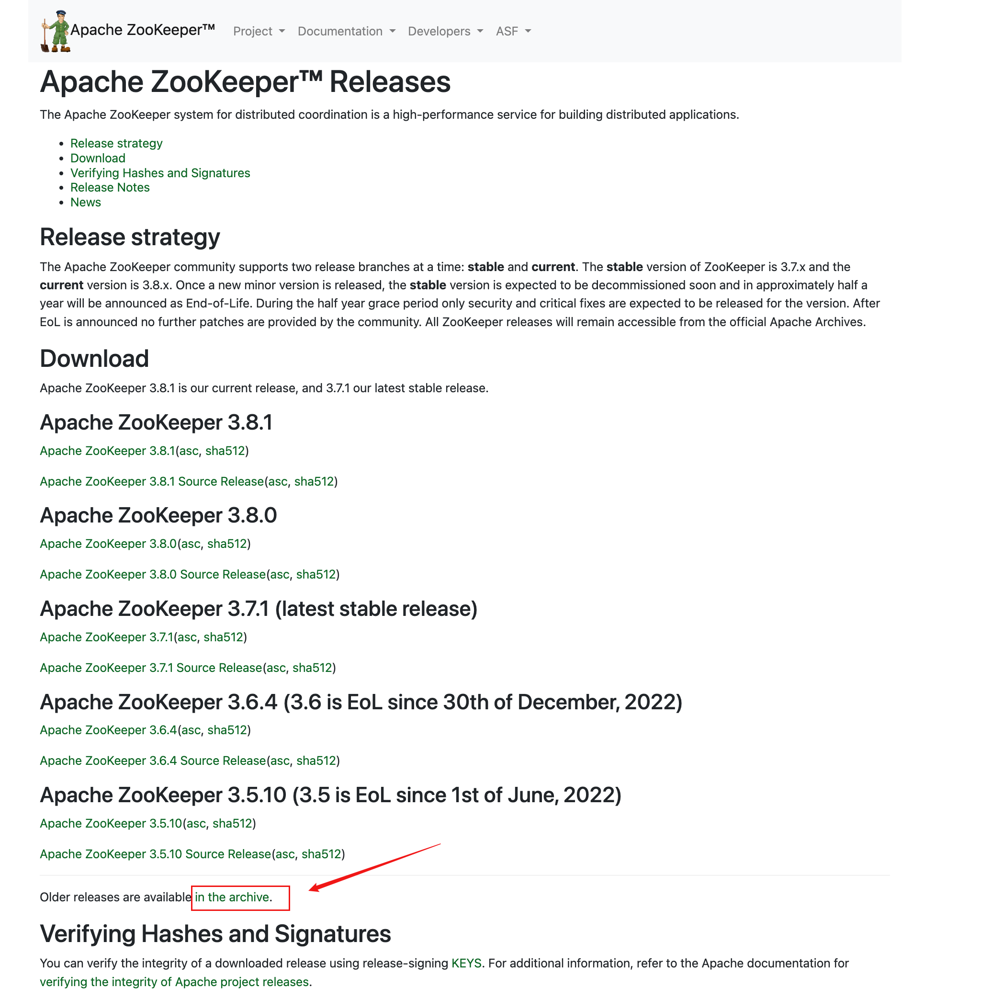
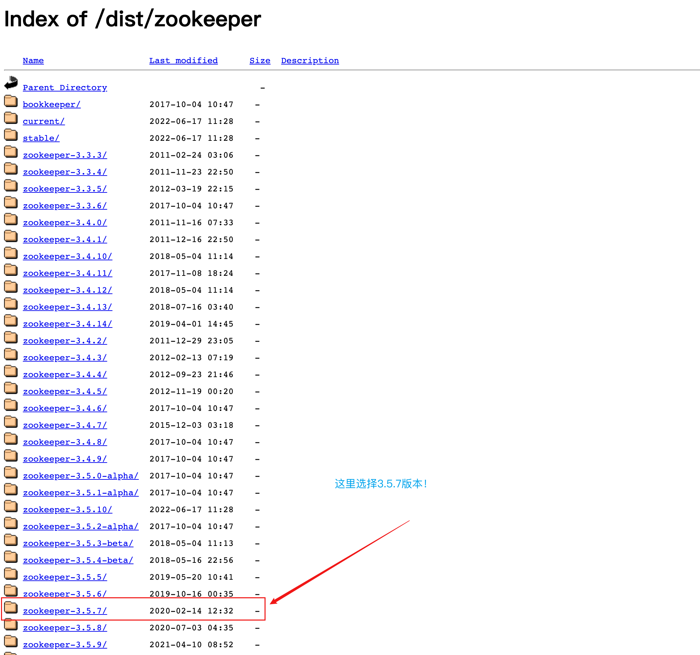
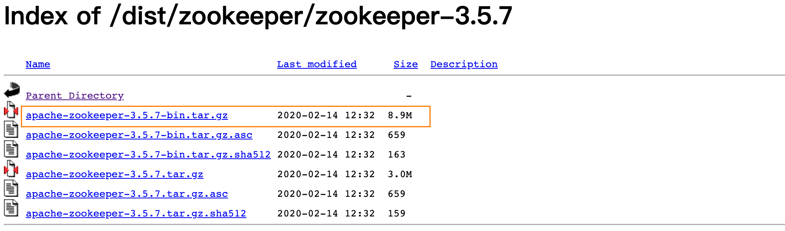

---
# 当前页面内容标题
title: 一、Zookeeper入门
# 分类
category:
  - Java
# 标签
tag:
  - Java
  - zookeeper
  - 分布式
sticky: false
# 是否收藏在博客主题的文章列表中，当填入数字时，数字越大，排名越靠前。
star: false
# 是否将该文章添加至文章列表中
article: true
# 是否将该文章添加至时间线中
timeline: true
---

## 01、概述

Zookeeper 是一个开源的分布式的，为分布式框架提供协调服务的 Apache 项目。

**Zookeeper工作机制**

Zookeeper从设计模式角度来理解：是一个基于观察者模式设计的分布式服务管理框架，**它负责存储和管理大家都关心的数据**，然后**接受观察者的 注册**，一旦这些数据的状态发生变化，Zookeeper 就将**负责通知已经在Zookeeper上注册的那些观察者**做出相应的反应。

## 02、特点

**Zookeeper特点**

1） Zookeeper：一个领导者（Leader），多个跟随者（Follower）组成的集群。

2） 集群中只要有**半数以上**节点存活，Zookeeper集群就能正常服务。所以Zookeeper适合安装奇数台服务器。

3） 全局数据一致：每个Server保存一份相同的数据副本，Client无论连接到哪个Server，数据都是一致的。

4） 更新请求顺序执行，来自同一个Client的更新请求按其发送顺序依次执行。

5） 数据更新原子性，一次数据更新要么成功，要么失败。

6） 实时性，在一定时间范围内，Client能读到最新数据。

## 03、数据结构

ZooKeeper 数据模型的结构与 **Unix 文件系统很类似**，整体上可以看作是一棵树，每个节点称做一个 ZNode。每一个 ZNode 默认能够存储 **1MB** 的数据，每个 ZNode 都可以**通过其路径唯一标识**。

## 04、应用场景

提供的服务包括：统一命名服务、统一配置管理、统一集群管理、服务器节点动态上下线、软负载均衡等。

### **统一命名服务**

在分布式环境下，经常需要对应用/服务进行统一命名，便于识别。

例如：IP不容易记住，而域名容易记住。

### **统一配置管理**

1. 分布式环境下，配置文件同步非常常见。

（1） 一般要求一个集群中，所有节点的配置信息是一致的，比如 Kafka 集群。

（2） 对配置文件修改后，希望能够快速同步到各个节点上。

2. 配置管理可交由ZooKeeper实现。

（1）可将配置信息写入ZooKeeper上的一个Znode。

（2） 各个客户端服务器监听这个Znode。

（3） 一旦Znode中的数据被修改，ZooKeeper将通知各个客户端服务器。

### **统一集群管理**

1）分布式环境中，实时掌握每个节点的状态是必要的。

（1）可根据节点实时状态做出一些调整。

2） ZooKeeper可以实现实时监控节点状态变化

（1） 可将节点信息写入ZooKeeper上的一个ZNode。

（2） 监听这个ZNode可获取它的实时状态变化。

### **服务动态上下线**

**客户端能实时洞察到服务器上下线的变化**

### 软负载均衡

在Zookeeper中记录每台服务器的访问数，让访问数最少的服务器去处理最新的客户端请求

## 05、下载地址

### **1）**官网首页：

> [Apache Zookeeper](https://zookeeper.apache.org/)

### **2）** 下载截图

### **3）** **下载** **Linux** **环境安装的** **tar** **包**

