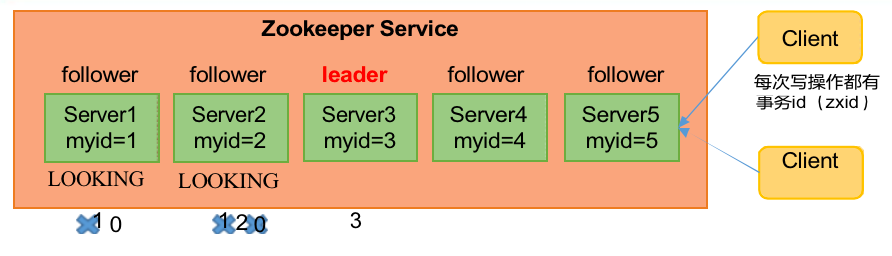
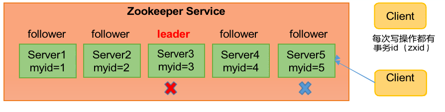
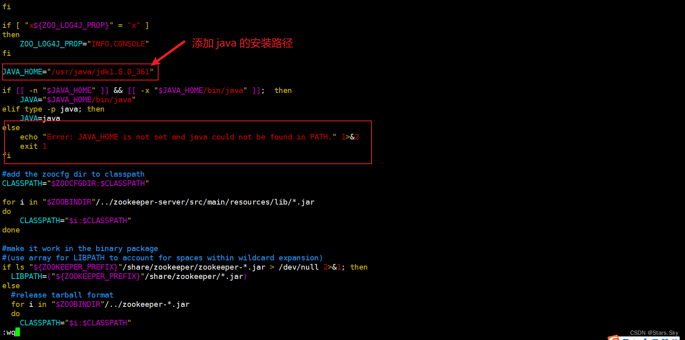
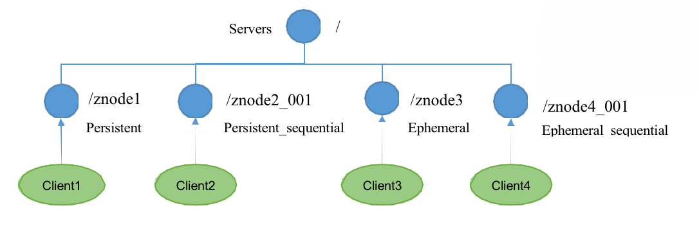
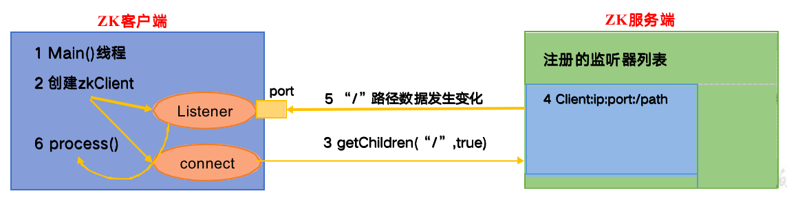
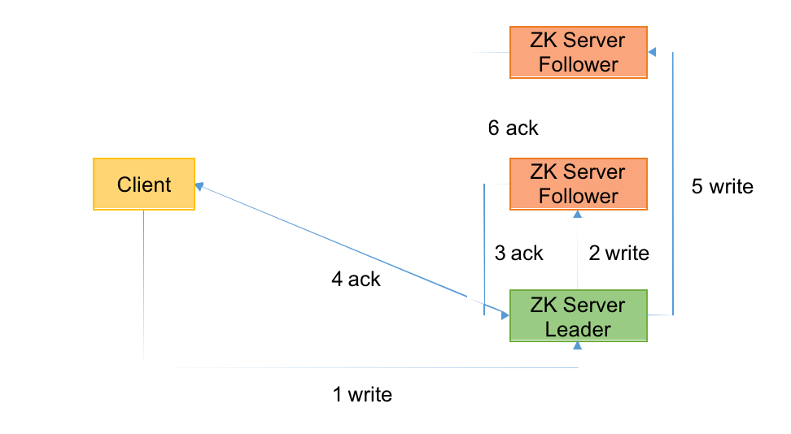
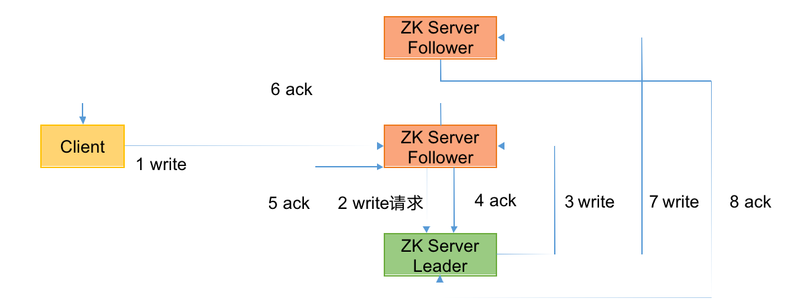

---
# 当前页面内容标题
title: 三、Zookeeper集群操作
# 分类
category:
  - Java
# 标签
tag:
  - Java
  - zookeeper
  - 分布式
sticky: false
# 是否收藏在博客主题的文章列表中，当填入数字时，数字越大，排名越靠前。
star: false
# 是否将该文章添加至文章列表中
article: true
# 是否将该文章添加至时间线中
timeline: true
---

## 01、集群安装

> 前提说明：如果你要使用zookeeper的话需要确保自己的环境是否ok？
>
> - java环境是zookeeper的必须的！
> - 配置完成使用java、javac的命令确定是否成功！
> - 这里的java环境需要检查一下jps命令是否存在，如果不存在那么你的java环境可能是Centos虚拟机自带的openjdk，需要删除关于java的所有，然后重新上官网进行重新安装！

### **1）** ***\*集群规划\****

在 hadoop102、hadoop103 和 hadoop104 三个节点上都部署 Zookeeper。

*思考：如果是* *10* *台服务器，需要部署多少台* *Zookeeper**？*

### **1）** ***\*解压安装\****

（1）在 hadoop102 解压Zookeeper 安装包到/opt/module/目录下

```sh
[root@localhost zookeeper]# tar -zxvf apache-zookeeper-3.5.7- bin.tar.gz -C /opt/module/
```

（2）修改 apache-zookeeper-3.5.7-bin 名称为 zookeeper-3.5.7

```
[root@localhost zookeeper]# mv apache-zookeeper-3.5.7-bin zookeeper-3.5.7
```

### **3）** ***\*配置服务器编号\****

（1） 在/opt/module/zookeeper-3.5.7/这个目录下创建 zkData

```sh
[root@localhost zookeeper-3.5.7]# mkdir zkData/
```

（2）在/opt/module/zookeeper-3.5.7/zkData 目录下创建一个 myid 的文件

```sh
vim myid
```

在文件中添加与 server 对应的编号（注意：上下不要有空行，左右不要有空格）

```sh
2
```

注意：添加 myid 文件，一定要在 Linux 里面创建，在 notepad++里面很可能乱码

（3）拷贝配置好的 zookeeper 到其他机器上

```sh
[root@localhost zookeeper]# xsync	zookeeper-3.5.7
```

并分别在 hadoop103、hadoop104 上修改 myid 文件中内容为 3、4

### 4） **配置zoo.cfg文件**

（1）重命名/opt/module/zookeeper-3.5.7/conf 这个目录下的 zoo_sample.cfg 为 zoo.cfg

```sh
[root@localhost conf]# mv zoo_sample.cfg zoo.cfg
```

（2） 打开zoo.cfg 文件

```sh
[root@localhost conf]# vim zoo.cfg
```

修改数据存储路径配置

```sh
dataDir=/opt/module/zookeeper-3.5.7/zkData
```

集群配置

```sh
#######################cluster##########################
server.2=hadoop102:2888:3888
server.3=hadoop103:2888:3888
server.4=hadoop104:2888:3888
```

> 注意点：这里的3888后面一定要仔细检查没有空格才可以，如果有空格会报如下的错误，总结如下：
>
> - 在集群配置后面是否有空格存在
> - 启动集群的时候是否启动的机器数量没有超过半数
> - 如果不行就参考如下：[zookeeper启动出现错误:Error contacting service. It is probably not running – 源码巴士 (code84.com)](https://code84.com/759501.html)


```sh
[root@localhost zookeeper-3.5.7]# ./bin/zkServer.sh status
ZooKeeper JMX enabled by default
Using config: /opt/zookeeper/zookeeper-3.5.7/bin/../conf/zoo.cfg
Client port found: 2181. Client address: localhost.
Error contacting service. It is probably not running.
```

（3）配置参数解读

```sh
server.A=B:C:D。
```

**A** 是一个数字，表示这个是第几号服务器；

集群模式下配置一个文件myid，这个文件在 dataDir 目录下，这个文件里面有一个数据就是 A 的值，**Zookeeper 启动时读取此文件，拿到里面的数据与 zoo.cfg 里面的配置信息比较从而判断到底是哪个 server。**

**B** 是这个服务器的地址；

**C** 是这个服务器Follower 与集群中的 Leader 服务器交换信息的端口； 

**D** 是万一集群中的 Leader 服务器挂了，需要一个端口来重新进行选举，选出一个新的Leader，而这个端口就是用来执行选举时服务器相互通信的端口。

（4）同步zoo.cfg 配置文件

```sh
[root@localhost conf]# xsync zoo.cfg
```

### **5）** ***\*集群操作\****

（1）分别启动Zookeeper

```sh
# 172.16.102.100
[root@localhost zookeeper-3.5.7]# ./bin/zkServer.sh start
# 172.16.102.135
[root@localhost zookeeper-3.5.7]# ./bin/zkServer.sh start
# 172.16.102.136
[root@localhost zookeeper-3.5.7]# ./bin/zkServer.sh start
```

（2）查看状态

```sh
[root@localhost zookeeper-3.5.7]# ./bin/zkServer.sh status
ZooKeeper JMX enabled by default
Using config: /opt/zookeeper/zookeeper-3.5.7/bin/../conf/zoo.cfg
Client port found: 2181. Client address: localhost.
Mode: follower  <---Follower（跟随者）

[root@localhost zookeeper-3.5.7]# ./bin/zkServer.sh status
ZooKeeper JMX enabled by default
Using config: /opt/zookeeper/zookeeper-3.5.7/bin/../conf/zoo.cfg
Client port found: 2181. Client address: localhost.
Mode: follower  <---Follower（跟随者）

[root@localhost zookeeper-3.5.7]# ./bin/zkServer.sh status
ZooKeeper JMX enabled by default
Using config: /opt/zookeeper/zookeeper-3.5.7/bin/../conf/zoo.cfg
Client port found: 2181. Client address: localhost.
Mode: leader  <---Leader（领导者）
```

（3）停止

```sh
[root@localhost zookeeper-3.5.7]# ./bin/zkServer.sh stop
```

## 02、选举机制（面试重点）

**Zookeeper选举机制——第一次启动**



**SID**：**服务器ID**。用来唯一标识一台ZooKeeper集群中的机器，每台机器不能重复，和myid一致。

**ZXID**：**事务ID。ZXID是一个事务ID，用来标识一次服务器状态的变更**。在某一时刻， 集群中的每台机器的ZXID值不一定完全一致，这和ZooKeeper服务器对于客户端“更 新请求”的处理逻辑有关。

**Epoch**：**每个Leader任期的代号**。没有Leader时同一轮投票过程中的逻辑时钟值是相同的。每投完一次票这个数据就会增加

（1） 服务器1启动，发起一次选举。服务器1投自己一票。此时服务器1票数一票，不够半数以上（3票），选举无法完成，服务器1状态保持为LOOKING；

（2） 服务器2启动，再发起一次选举。服务器1和2分别投自己一票并交换选票信息：**此时服务器1发现服务器2的myid比自己目前投票推举的（服务器1）  大，更改选票为推举服务器2**。此时服务器1票数0票，服务器2票数2票，没有半数以上结果，选举无法完成，服务器1，2状态保持LOOKING

 （3） 服务器3启动，发起一次选举。此时服务器1和2都会更改选票为服务器3。此次投票结果：服务器1为0票，服务器2为0票，服务器3为3票。此时服务器3的票数已经超过半数，服务器3当选Leader。服务器1，2更改状态为FOLLOWING，服务器3更改状态为LEADING；

 （4） 服务器4启动，发起一次选举。此时服务器1，2，3已经不是LOOKING状态，不会更改选票信息。交换选1票信息结果：服务器3为3票，服务器4为1票。此时服务器4服从多数，更改选票信息为服务器3，并更改状态为FOLLOWING；

（5） 服务器5启动，同4一样当小弟。

**Zookeeper选举机制——非第一次启动**



**SID**：**服务器ID**。用来唯一标识一台ZooKeeper集群中的机器，每台机器不能重复，和myid一致。

**ZXID**：**事务ID**。**ZXID是一个事务ID，用来标识一次服务器状态的变更**。在某一时刻， 集群中的每台机器的ZXID值不一定完全一致，这和ZooKeeper服务器对于客户端“更 新请求”的处理逻辑有关。

**Epoch**：**每个Leader任期的代号**。没有Leader时同一轮投票过程中的逻辑时钟值是相同的。每投完一次票这个数据就会增加

（1）当ZooKeeper集群中的一台服务器出现以下两种情况之一时，就会开始进入Leader选举：

- 服务器初始化启动。

- 服务器运行期间无法和Leader保持连接。

（2） 而当一台机器进入Leader选举流程时，当前集群也可能会处于以下两种状态：

- 集群中本来就已经存在一个Leader。

  对于第一种已经存在Leader的情况，机器试图去选举Leader时，会被告知当前服务器的Leader信息，对于该机器来说，仅仅需要和Leader机器建立连  接，并进行状态同步即可。

- **集群中确实不存在Leader。**

  假设ZooKeeper由5台服务器组成，SID分别为1、2、3、4、5，ZXID分别为8、8、8、7、7，并且此时SID为3的服务器是Leader。某一时刻，3和5服务器出现故障，因此开始进行Leader选举。


|                              | （EPOCH，ZXID，SID ） | （ EPOCH，ZXID，SID ） | （EPOCH，ZXID，SID ） |
| ---------------------------- | --------------------- | ---------------------- | --------------------- |
| SID为1、2、4的机器投票情况： | （1，8，1）           | （1，8，2）            | （1，7，4）           |

**选举Leader规则： ①EPOCH大的直接胜出	②EPOCH相同，事务id大的胜出	③事务id相同，服务器id大的胜出**

## 03、ZK集群脚本

1）在hadoop102 的/home/may/bin 目录下创建脚本

```sh
[root@localhost bin]# vim zk.sh
```

**编写ZK启停脚本**

```sh
#!/bin/bash
 
case $1 in
"start") {
    for i in hadoop01 hadoop02 hadoop03
    do
        echo -------- zookeeper $i 启动 --------
        ssh $i "/opt/zookeeper/zookeeper-3.5.7/bin/zkServer.sh start"
    done
};;
 
"stop") {
    for i in hadoop01 hadoop02 hadoop03
    do
        echo -------- zookeeper $i 停止 --------
        ssh $i "/opt/zookeeper/zookeeper-3.5.7/bin/zkServer.sh stop"
    done
};;
 
"status") {
    for i in hadoop01 hadoop02 hadoop03
    do
        echo -------- zookeeper $i 状态 --------
        ssh $i "/opt/zookeeper/zookeeper-3.5.7/bin/zkServer.sh status"
    done
};;
 
esac
```

为其设置权限

```sh
[root@localhost bin]# chmod 777 zk.sh
```

2）在hadoop102 的/home/may/bin 目录下创建脚本

```sh
[root@localhost bin]# vim jpsall
```

**编写查看集群 Java 进程脚本**

```sh
#!/bin/bash
 
for host in hadoop01 hadoop02 hadoop03
do
        echo ========= $host =========
        ssh $host /opt/java/jdk1.8.0_361/bin/jps -l
done

```

为其设置权限

```sh
[root@localhost bin]# chmod 777 jpsall
```

> **测试启停**

```sh
[root@hadoop01 /opt/module/zookeeper-3.7.1]# zk.sh start
-------- zookeeper hadoop01 启动 --------
ZooKeeper JMX enabled by default
Using config: /opt/module/zookeeper-3.7.1/bin/../conf/zoo.cfg
Starting zookeeper ... already running as process 4688.
-------- zookeeper hadoop02 启动 --------
ZooKeeper JMX enabled by default
Using config: /opt/module/zookeeper-3.7.1/bin/../conf/zoo.cfg
Starting zookeeper ... STARTED
 
[root@hadoop01 /opt/module/zookeeper-3.7.1]# jpsall 
========= hadoop01 =========
4688 org.apache.zookeeper.server.quorum.QuorumPeerMain
4992 sun.tools.jps.Jps
========= hadoop02 =========
22372 org.apache.zookeeper.server.quorum.QuorumPeerMain
22421 sun.tools.jps.Jps
 
[root@hadoop01 /opt/module/zookeeper-3.7.1]# zk.sh status
-------- zookeeper hadoop01 状态 --------
ZooKeeper JMX enabled by default
Using config: /opt/module/zookeeper-3.7.1/bin/../conf/zoo.cfg
Client port found: 2181. Client address: localhost. Client SSL: false.
Mode: follower
-------- zookeeper hadoop02 状态 --------
ZooKeeper JMX enabled by default
Using config: /opt/module/zookeeper-3.7.1/bin/../conf/zoo.cfg
Client port found: 2181. Client address: localhost. Client SSL: false.
Mode: leader
 
[root@hadoop01 /opt/module/zookeeper-3.7.1]# zk.sh stop
-------- zookeeper hadoop01 停止 --------
ZooKeeper JMX enabled by default
Using config: /opt/module/zookeeper-3.7.1/bin/../conf/zoo.cfg
Stopping zookeeper ... STOPPED
-------- zookeeper hadoop02 停止 --------
ZooKeeper JMX enabled by default
Using config: /opt/module/zookeeper-3.7.1/bin/../conf/zoo.cfg
Stopping zookeeper ... STOPPED
```

> 如出现下面报错信息：

```sh
[root@hadoop01 /opt/module/zookeeper-3.7.1]# zk.sh start
-------- zookeeper hadoop01 启动 --------
Error: JAVA_HOME is not set and java could not be found in PATH.
-------- zookeeper hadoop02 启动 --------
Error: JAVA_HOME is not set and java could not be found in PATH.
```

> 解决办法：（两台机器都需要修改）

```sh
[root@hadoop01 /opt/module/zookeeper-3.7.1]# vim /opt/module/zookeeper-3.7.1/bin/zkEnv.sh 
JAVA_HOME="/usr/java/jdk1.8.0_361"
```



**xsync 命令脚本**

> 同步数据zookeeper脚本

```sh
#1. 编写分发脚本
[root@hadoop01 /opt/module]# pwd
/opt/module
[root@hadoop01 /opt/module]# vim xsync
#!/bin/bash
 
#1. 判断参数个数
if [ $# -lt 1 ]
then
    echo Not Enough Arguement!
    exit;
fi
 
#2. 遍历集群所有机器
for host in hadoop01 hadoop02
do
    echo ====================  $host  ====================
    #3. 遍历所有目录，挨个发送
 
    for file in $@
    do
        #4. 判断文件是否存在
        if [ -e $file ]
            then
                #5. 获取父目录
                pdir=$(cd -P $(dirname $file); pwd)
 
                #6. 获取当前文件的名称
                fname=$(basename $file)
                ssh $host "mkdir -p $pdir"
                rsync -av $pdir/$fname $host:$pdir
            else
                echo $file does not exists!
        fi
    done
done
 
[root@hadoop01 /opt/module]# chmod 777 xsync 
[root@hadoop01 /opt/module]# mv xsync /usr/bin/
 
#2. 配置主机解析。两台机子都要执行
[root@hadoop01 /opt/module]# vim /etc/hosts
192.168.170.130 hadoop01
192.168.170.131 hadoop02
 
#3. 配置免密登录
# ⼀直回⻋就⾏
[root@hadoop01 /opt/module]# ssh-keygen -t rsa
 
# 等待一会，然后输入 yes，再输入各主机的密码即可
[root@hadoop01 /opt/module]# for i in hadoop01 hadoop02 hadoop03;do ssh-copy-id -i /root/.ssh/id_rsa.pub $i;done
 
#4. 分发安装包
[root@hadoop01 /opt/module]# xsync zookeeper-3.7.1/
 
#5. 在 hadoop02 上修改 myid 文件中内容为 2
[root@hadoop02 ~]# vim /opt/module/zookeeper-3.7.1/zkData/myid 
2
```

## 04、客户端API操作

### 命令行语法

| **命令基本语法** | **功能描述**                                                 |
| ---------------- | ------------------------------------------------------------ |
| help             | 显示所有操作命令                                             |
| ls path          | 使用 ls 命令来查看当前 znode 的子节点 [可监听]<br/>-w	监听子节点变化<br/>-s	附加次级信息 |
| create           | 普通创建<br/>-s	含有序列<br/>-e	临时（重启或者超时消失） |
| get path         | 获得节点的值 [可监听]-w	监听节点内容变化-s	附加次级信息 |
| set              | 设置节点的具体值                                             |
| stat             | 查看节点状态                                                 |
| delete           | 删除节点                                                     |
| deleteall        | 递归删除节点                                                 |

**1.启动客户端**

```sh
[root@localhost bin]# ./zkCli.sh -server hadoop01:2181
```

**2.显示所有操作命令**

```shell
[zk: hadoop01:2181(CONNECTED) 0] help
```

### znode节点数据信息

**1）查看当前znode中所包含的内容**

```sh
[zk: hadoop01:2181(CONNECTED) 1] ls /
[zookeeper]
```

**2）查看当前节点详细数据**

```sh
[zk: hadoop01:2181(CONNECTED) 2] ls -s /
[zookeeper]cZxid = 0x0
ctime = Thu Jan 01 08:00:00 CST 1970
mZxid = 0x0
mtime = Thu Jan 01 08:00:00 CST 1970
pZxid = 0x0
cversion = -1
dataVersion = 0
aclVersion = 0
ephemeralOwner = 0x0
dataLength = 0
numChildren = 1
```

`（1） czxid：创建节点的事务 zxid`

每次修改ZooKeeper 状态都会产生一个ZooKeeper 事务 ID。事务 ID 是ZooKeeper 中所有修改总的次序。每次修改都有唯一的 zxid，如果 zxid1 小于 zxid2，那么zxid1 在 zxid2 之前发生。

（2） ctime：znode 被创建的毫秒数（从 1970 年开始）

（3） mzxid：znode 最后更新的事务zxid 

（4） mtime：znode 最后修改的毫秒数（从 1970 年开始）

（5） pZxid：znode 最后更新的子节点zxid

（6） cversion：znode 子节点变化号，znode 子节点修改次数

（7） dataversion：znode 数据变化号

`（8） aclVersion：znode 访问控制列表的变化号`

（9） ephemeralOwner：如果是临时节点，这个是 znode 拥有者的 session id。如果不是临时节点则是 0。

`（10） dataLength：znode 的数据长度`

`（11） numChildren：znode 子节点数量`

### 节点类型（持久/短暂/有序号/无序号）

> 节点类型

持久（Persistent）：客户端和服务器端断开连接后，创建的节点不删除

短暂（Ephemeral）：客户端和服务器端断开连接后，创建的节点自己删除



说明：创建znode时设置顺序标识，znode名称后会附加一个值，顺序号是一个单调递增的计数器，由父节点维护

注意：在分布式系统中，顺序号可以被用于为所有的事件进行全局排序，这样客户端可以通过顺序号推断事件的顺序

（1）持久化目录节点

客户端与Zookeeper断开连接后，该节点依旧存在

（2）持久化顺序编号目录节点

客户端与Zookeeper断开连接后，该节点依旧存在，只是Zookeeper给该节点名称进行顺序编号

（3）临时目录节点

客户端与Zookeeper断开连接后，该节点被删除

（4）临时顺序编号目录节点

客户端与Zookeeper 断开连接后， 该节点被删除， 只是 Zookeeper给该节点名称进行顺序编号。

---

**1）分别创建2个普通节点（永久节点 + 不带序号）**

```sh
[zk: hadoop01:2181(CONNECTED) 7] create /sanguo "diaochan"
Created /sanguo
[zk: hadoop01:2181(CONNECTED) 8] create /sanguo/shuguo "liubei"
Created /sanguo/shuguo
```

> 注意：创建节点时，要赋值

**2）获取节点的值**

```sh
[zk: hadoop01:2181(CONNECTED) 9] get -s /sanguo
diaochan
cZxid = 0x700000004
ctime = Mon Apr 17 21:52:17 CST 2023
mZxid = 0x700000004
mtime = Mon Apr 17 21:52:17 CST 2023
pZxid = 0x700000005
cversion = 1
dataVersion = 0
aclVersion = 0
ephemeralOwner = 0x0
dataLength = 8
numChildren = 1
[zk: hadoop01:2181(CONNECTED) 10] get -s /sanguo/shuguo
liubei
cZxid = 0x700000005
ctime = Mon Apr 17 21:52:33 CST 2023
mZxid = 0x700000005
mtime = Mon Apr 17 21:52:33 CST 2023
pZxid = 0x700000005
cversion = 0
dataVersion = 0
aclVersion = 0
ephemeralOwner = 0x0
dataLength = 6
numChildren = 0
```

**3）创建带序号的节点（永久节点+带序号）**

1. 先创建一个普通的根节点 /sanguo/weiguo

```sh
[zk: hadoop01:2181(CONNECTED) 11] create /sanguo/weiguo "caocao"
Created /sanguo/weiguo
```

2. 创建带序号的节点

```sh
[zk: hadoop01:2181(CONNECTED) 12] create -s /sanguo/weiguo/zhangliao "zhangliao"
Created /sanguo/weiguo/zhangliao0000000000
[zk: hadoop01:2181(CONNECTED) 13] create -s /sanguo/weiguo/zhangliao "zhangliao"
Created /sanguo/weiguo/zhangliao0000000001
[zk: hadoop01:2181(CONNECTED) 14] create -s /sanguo/weiguo/xushu "xushu"
Created /sanguo/weiguo/xushu0000000002
```

如果原来没有序号节点，序号从 0 开始依次递增。如果原节点下已有 2 个节点，则再排序时从 2 开始，以此类推。

**4）创建短暂节点（短暂节点+不带序号 or 带序号）**

1. 创建短暂的不带序号的节点

```sh
[zk: hadoop01:2181(CONNECTED) 15] create -e /sanguo/wuguo "zhouyu"
Created /sanguo/wuguo
```

2. 创建短暂的带序号的节点

```sh
[zk: hadoop01:2181(CONNECTED) 16] create -e -s /sanguo/wuguo "zhouyu"
Created /sanguo/wuguo0000000003
```

3. 在当前客户端是能查看到的

```sh
[zk: hadoop01:2181(CONNECTED) 17] ls /sanguo
[shuguo, weiguo, wuguo, wuguo0000000003]
```

4. 退出当前客户端然后再重新启动客户端–>quit退出！

```sh
[root@localhost zookeeper-3.5.7]# bin/zkCli.sh
```

5. 再次查看根目录下短暂节点已经删除

```sh
[zk: localhost:2181(CONNECTED) 0] ls /sanguo
[shuguo, weiguo]
```

**5）修改节点数据值**

```sh
[zk: localhost:2181(CONNECTED) 8] set /sanguo/weiguo "simayi"
```

### **监听器原理**

客户端注册监听它关心的目录节点，当目录节点发生变化（数据改变、节点删除、子目录节点增加删除）时，ZooKeeper 会通知客户端。监听机制保证 ZooKeeper 保存的任何的数据的任何改变都能快速的响应到监听了该节点的应用程序。

> **1、监听原理详解**

1） 首先要有一个main()线程

2） 在main线程中创建Zookeeper客户端，这时就会创建两个线程，一个负责网络连接通信（connet），一个负责监听（listener）。

3） 通过connect线程将注册的监听事件发送给Zookeeper。

4） 在Zookeeper的注册监听器列表中将注册的监听事件添加到列表中。5）Zookeeper监听到有数据或路径变化，就会将这个消息发送给listener线程。6）listener线程内部调用了process()方法。

> **2、常见的监听**

1） 监听节点数据的变化

**get path [watch]**

2） 监听子节点增减的变化

**ls path [watch]**



**1）节点的值变化监听**

1. 在 hadoop104 主机上注册监听/sanguo 节点数据变化

```sh
[zk: localhost:2181(CONNECTED) 26] get -w /sanguo
```

2. 在 hadoop103 主机上修改/sanguo 节点的数据

```sh
[zk: localhost:2181(CONNECTED) 1] set /sanguo "xisi"
```

3. 观察hadoop104 主机收到数据变化的监听

| WATCHER::    |                     |                      |
| ------------ | ------------------- | -------------------- |
| WatchedEvent | state:SyncConnected | type:NodeDataChanged |
| path:/sanguo |                     |                      |

注意：在hadoop103再多次修改/sanguo的值，hadoop104上不会再收到监听。因为注册一次，只能监听一次。想再次监听，需要再次注册。

**2）节点的子节点变化监听（路径变化）**

1. 在 hadoop104 主机上注册监听/sanguo 节点的子节点变化

```sh
[shuguo, weiguo]
```

2. 在 hadoop103 主机/sanguo 节点上创建子节点

```sh
[zk: localhost:2181(CONNECTED) 2] create /sanguo/jin "simayi" Created /sanguo/jin
```

3. 观察hadoop104主机收到子节点变化的监听

| WATCHER::    |                     |                      |
| ------------ | ------------------- | -------------------- |
| WatchedEvent | state:SyncConnected | type:NodeDataChanged |
| path:/sanguo |                     |                      |

注意：节点的路径变化，也是注册一次，生效一次。想多次生效，就需要多次注册。

### 节点删除与查看

**1）删除节点**

```sh
[zk: localhost:2181(CONNECTED) 4] delete /sanguo/jin
```

**2）查看节点状态**

```sh
[zk: localhost:2181(CONNECTED) 15] deleteall /sanguo/shuguo
```

**3）查看节点状态**

```sh
[zk: localhost:2181(CONNECTED) 17] stat /sanguo cZxid = 0x100000003
ctime = Wed Aug 29 00:03:23 CST 2018 mZxid = 0x100000011
mtime = Wed Aug 29 00:21:23 CST 2018 pZxid = 0x100000014
cversion = 9
dataVersion = 1
aclVersion = 0 ephemeralOwner = 0x0 dataLength = 4
numChildren = 1
```

## 05、客户端API操作

### 1）IDEA环境搭建

1.创建一个工程：zookeeper

2.添加pom文件

```xml
    <dependencies>
        <dependency>
            <groupId>junit</groupId>
            <artifactId>junit</artifactId>
            <version>4.13.2</version>
        </dependency>
        <dependency>
            <groupId>org.apache.logging.log4j</groupId>
            <artifactId>log4j-core</artifactId>
            <version>2.8.2</version>
        </dependency>
        <dependency>
            <groupId>org.apache.zookeeper</groupId>
            <artifactId>zookeeper</artifactId>
            <version>3.5.7</version>
        </dependency>
    </dependencies>
```

3.拷贝log4j.properties文件到项目根目录

需要再项目src/main/resources 目录下，新建一个文件，命名为“log4j.properties”，在文件中填入。

```properties
log4j.rootLogger=INFO, stdout
log4j.appender.stdout=org.apache.log4j.ConsoleAppender
log4j.appender.stdout.layout=org.apache.log4j.PatternLayout
log4j.appender.stdout.layout.ConversionPattern=%d %p [%c] - %m%n
log4j.appender.logfile=org.apache.log4j.FileAppender
log4j.appender.logfile.File=target/spring.log
log4j.appender.logfile.layout=org.apache.log4j.PatternLayout
log4j.appender.logfile.layout.ConversionPattern=%d %p [%c] - %m%n
```

4.创建包名com.nakanomay.zk

5.创建类名称ZkClient

### 2）创建Zookeeper客户端

```java
    // 注意：逗号左右不能有空格
    private String connectString = "172.16.102.100:2181,172.16.102.135:2181,172.16.102.136:2181";
    private int sessionTimeout = 2000;
    private ZooKeeper zkClient = null;

	@Before
    public void init() throws IOException
    {
        zkClient = new ZooKeeper(connectString, sessionTimeout, new Watcher()
        {
            @Override
            public void process(WatchedEvent watchedEvent)
            {
                // 收到事件通知后的回调函数（用户的业务逻辑）
                System.out.println(watchedEvent.getType() + "--" + watchedEvent.getPath());

                // 再次启动监听
                try {
                    List<String> children = zkClient.getChildren("/",true);
                    for (String child : children) {
                        System.out.println(child);
                    }
                }
                catch (Exception e) {
                    e.printStackTrace();
                }
            }
        });
    }
```

### 3）创建子节点

```java
    @Test
    public void create() throws InterruptedException, KeeperException
    {
        /**
         * 参数1：要创建的节点的路径
         * 参数2：节点数据
         * 参数3：节点权限
         * 参数4：节点的类型
         */
        String nodeCreated = zkClient.create("/atguigu", "ss.avi".getBytes(), ZooDefs.Ids.OPEN_ACL_UNSAFE, CreateMode.PERSISTENT);
    }
```

测试：在 hadoop102 的 zk 客户端上查看创建节点情况

```sh
[zk: localhost:2181(CONNECTED) 1] get -s /atguigu
ss.avi
cZxid = 0x700000012
ctime = Mon Apr 17 23:10:03 CST 2023
mZxid = 0x700000012
mtime = Mon Apr 17 23:10:03 CST 2023
pZxid = 0x700000012
cversion = 0
dataVersion = 0
aclVersion = 0
ephemeralOwner = 0x0
dataLength = 6
numChildren = 0
```

### 4）监听子节点并监听节点变化

```java
    //  获取子节点
    @Test
    public void getChildren() throws Exception
    {
        List<String> children = zkClient.getChildren("/", true);
        for (String child : children)
        {
            System.out.println(child);
        }
        Thread.sleep(Long.MAX_VALUE);
    }
```

（1）在IDEA控制台上看到如下节点：

```sh
zookeeper sanguo atguigu
```

（2）在 hadoop102 的客户端上创建再创建一个节点/atguigu1，观察 IDEA 控制台

```sh
[zk: localhost:2181(CONNECTED) 3] create /atguigu1 "atguigu1"
```

（3） 在 hadoop102 的客户端上删除节点/atguigu1，观察 IDEA 控制台

```sh
[zk: localhost:2181(CONNECTED) 4] delete /atguigu1
```

### 5）判断Znode是否存在

```java
    // 判断znode是否存在
    @Test
    public void exist() throws Exception
    {
        Stat stat = zkClient.exists("/atguigu", true);
        System.out.println(stat == null ? "not exist" : "exist");
    }
```

## 06、客户端向服务端写数据流程

**写流程之写入请求直接发送给*Leader节点**



**写流程之写入请求发送给follower节点**

