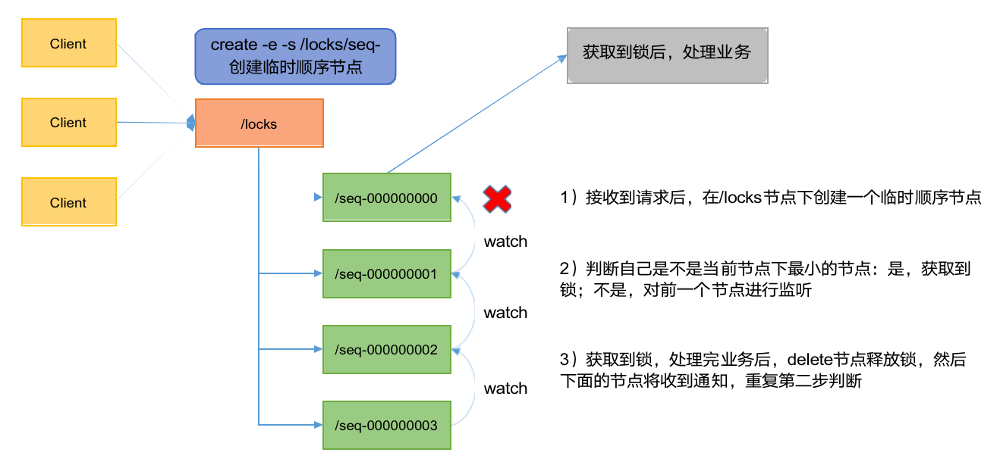

---
# 当前页面内容标题
title: 五、Zookeeper分布式锁案例
# 分类
category:
  - Java
# 标签
tag:
  - Java
  - zookeeper
  - 分布式
sticky: false
# 是否收藏在博客主题的文章列表中，当填入数字时，数字越大，排名越靠前。
star: false
# 是否将该文章添加至文章列表中
article: true
# 是否将该文章添加至时间线中
timeline: true
---

## 01、原生Zookeeper实现分布式锁案例

### **什么叫做分布式锁呢？**

比如说"进程 1"在使用该资源的时候，会先去获得锁，"进程 1"获得锁以后会对该资源保持独占，这样其他进程就无法访问该资源，"进程 1"用完该资源以后就将锁释放掉，让其他进程来获得锁，那么通过这个锁机制，我们就能保证了分布式系统中多个进程能够有序的访问该临界资源。那么我们把这个分布式环境下的这个锁叫作分布式锁。

### **分布式锁案例分析**



**1）分布式锁实现**

```java
import org.apache.zookeeper.*;
import org.apache.zookeeper.data.Stat;

import java.io.IOException;
import java.util.Collections;
import java.util.List;
import java.util.concurrent.CountDownLatch;

/**
 * Created with IntelliJ IDEA.
 *
 * @author nakano_may丶
 * @date 2023/4/18
 * @Version 1.0
 * @description zk实现分布式锁🔐
 */
public class DistributedLock
{

    private String connectString = "172.16.102.100:2181,172.16.102.135:2181,172.16.102.136:2181";
    private int sessionTimeout = 2000;
    private ZooKeeper zk;
    private CountDownLatch connectLatch = new CountDownLatch(1);
    private CountDownLatch waitLatch = new CountDownLatch(1);
    private String waitPath;
    private String currentMode;

    public DistributedLock() throws IOException, InterruptedException, KeeperException
    {
        // 获取连接
        zk = new ZooKeeper(connectString, sessionTimeout, watchedEvent -> {
            // connectLatch 如果连接上zk 可以释放
            if (watchedEvent.getState() == Watcher.Event.KeeperState.SyncConnected) {
                connectLatch.countDown();
            }

            // waitLatch 需要释放
            if (watchedEvent.getType() == Watcher.Event.EventType.NodeDeleted && watchedEvent.getPath().equals(waitPath)) {
                waitLatch.countDown();
            }
        });

        // 等待zk正常连接后，往下走程序
        connectLatch.await();

        // 判断根节点/locks是否存在？
        Stat stat = zk.exists("/locks", false);

        if (stat == null) {
            // 创建一下根节点
            zk.create("/locks", "locks".getBytes(), ZooDefs.Ids.OPEN_ACL_UNSAFE, CreateMode.PERSISTENT);
        }
    }

    public void zkLock()
    {
        try {
            // 创建对应的临时带序号的节点
            currentMode = zk.create("/locks/" + "seq-", null, ZooDefs.Ids.OPEN_ACL_UNSAFE, CreateMode.EPHEMERAL_SEQUENTIAL);

            // 判断创建的节点是否是最小的序号节点，如果是获取到锁；如果不是，监听它序号前一个节点
            List<String> children = zk.getChildren("/locks", false);

            // 如果children 只有一个值，那么就直接获取锁，如果多有个节点，需要判断，谁最小
            if (children.size() == 1) {
                return;
            }
            else {
                Collections.sort(children);

                // 获取节点名称： seq-0000000
                String thisNode = currentMode.substring("/locks/".length());
                // 通过 seq-0000000 获取到节点在children中的位置
                int index = children.indexOf(thisNode);

                // 判断
                if (index == -1) {
                    System.out.println("数据异常");
                }
                else if (index == 0) {
                    // 就一个节点，获取到锁了
                    return;
                }
                else {
                    // 需要监听，前一个节点变化
                    waitPath = "/locks/" + children.get(index - 1);
                    zk.getData(waitPath, true, new Stat());

                    // 等待监听
                    waitLatch.await();
                    return;
                }
            }
        }
        catch (KeeperException e) {
            e.printStackTrace();
        }
        catch (InterruptedException e) {
            e.printStackTrace();
        }
    }

    // 解锁方法
    public void unZkLock()
    {
        // 删除节点
        try {
            zk.delete(currentMode, -1);
        }
        catch (InterruptedException e) {
            e.printStackTrace();
        }
        catch (KeeperException e) {
            e.printStackTrace();
        }
    }
}
```

**2）分布式锁测试**

（1）创建两个线程

```java
import org.apache.zookeeper.KeeperException;

import java.io.IOException;
import java.util.concurrent.TimeUnit;

/**
 * Created with IntelliJ IDEA.
 *
 * @author nakano_may丶
 * @date 2023/4/18
 * @Version 1.0
 * @description 分布式锁测试
 */
public class DistributedLockTest
{
    public static void main(String[] args) throws IOException, InterruptedException, KeeperException
    {
        final DistributedLock lock1 = new DistributedLock();
        final DistributedLock lock2 = new DistributedLock();

        new Thread(()->{
            try {
                lock1.zkLock();
                System.out.println("线程1 启动，获取到锁");

                TimeUnit.SECONDS.sleep(5);
                lock1.unZkLock();
                System.out.println("线程1 释放锁");
            }
            catch (InterruptedException e) {
                e.printStackTrace();
            }
        }).start();

        new Thread(()->{
            try {
                lock2.zkLock();
                System.out.println("线程2 启动，获取到锁");

                TimeUnit.SECONDS.sleep(5);
                lock2.unZkLock();
                System.out.println("线程2 释放锁");
            }
            catch (InterruptedException e) {
                e.printStackTrace();
            }
        }).start();
    }
}
```

（2）观察控制台变化

```java
线程1 启动，获取到锁
线程1 释放锁
线程2 启动，获取到锁
线程2 释放锁
```


## 02、Curator框架实现分布式锁案例

**1）原生的API开发存在的问题**

（1） 会话连接是异步的，需要自己去处理。比如使用 CountDownLatch

（2） Watch 需要重复注册，不然就不能生效

（3） 开发的复杂性还是比较高的 

（4） 不支持多节点删除和创建。需要自己去递归

**2）** **Curator** **是一个专门解决分布式锁的框架，解决了原生** **Java** **API** **开发分布式遇到的问题。**

> 详情请查看官方文档：https://curator.apache.org/index.html

**3）Curator案例实操**

1.添加依赖

```xml
<dependency>
    <groupId>org.apache.curator</groupId>
    <artifactId>curator-framework</artifactId>
    <version>4.3.0</version>
</dependency>
<dependency>
    <groupId>org.apache.curator</groupId>
    <artifactId>curator-recipes</artifactId>
    <version>4.3.0</version>
</dependency>
<dependency>
    <groupId>org.apache.curator</groupId>
    <artifactId>curator-client</artifactId>
    <version>4.3.0</version>
</dependency>
```

 2.代码实现

```java
import org.apache.curator.framework.CuratorFramework;
import org.apache.curator.framework.CuratorFrameworkFactory;
import org.apache.curator.framework.recipes.locks.InterProcessMutex;
import org.apache.curator.retry.ExponentialBackoffRetry;

import java.util.concurrent.TimeUnit;

/**
 * Created with IntelliJ IDEA.
 *
 * @author nakano_may丶
 * @date 2023/4/18
 * @Version 1.0
 * @description Curator实现分布式锁
 */
public class CuratorLockTest
{
    public static void main(String[] args)
    {
        // 创建分布式锁1
        InterProcessMutex lock1 = new InterProcessMutex(getCuratorFramework(), "/locks");

        // 创建分布式锁2
        InterProcessMutex lock2 = new InterProcessMutex(getCuratorFramework(), "/locks");

        new Thread(new Runnable()
        {
            @Override
            public void run()
            {
                try {
                    lock1.acquire();
                    System.out.println("线程1获取到锁");

                    lock1.acquire();
                    System.out.println("线程1 再次获取到锁");

                    TimeUnit.SECONDS.sleep(5);

                    lock1.release();
                    System.out.println("线程1 释放锁");

                    lock1.release();
                    System.out.println("线程1 再次释放锁");

                }
                catch (Exception e) {
                    e.printStackTrace();
                }
            }
        }).start();

        new Thread(new Runnable()
        {
            @Override
            public void run()
            {
                try {
                    lock2.acquire();
                    System.out.println("线程2 获取到锁");

                    lock2.acquire();
                    System.out.println("线程2 再次获取到锁");

                    TimeUnit.SECONDS.sleep(5);

                    lock2.release();
                    System.out.println("线程2 释放锁");

                    lock2.release();
                    System.out.println("线程2 再次释放锁");

                }
                catch (Exception e) {
                    e.printStackTrace();
                }
            }
        }).start();
    }

    private static CuratorFramework getCuratorFramework()
    {

        ExponentialBackoffRetry policy = new ExponentialBackoffRetry(3000, 3);
        CuratorFramework client = CuratorFrameworkFactory.builder().
                connectString("172.16.102.100:2181,172.16.102.135:2181,172.16.102.136:2181")
                .connectionTimeoutMs(2000)
                .sessionTimeoutMs(2000)
                .retryPolicy(policy).build();

        // 启动客户端
        client.start();
        System.out.println("zookeeper 启动成功");

        return client;
    }
}
```

3.观察控制台变化

```
线程2 获取到锁
线程2 再次获取到锁
线程2 释放锁
线程2 再次释放锁
线程1获取到锁
线程1 再次获取到锁
线程1 释放锁
线程1 再次释放锁
```

