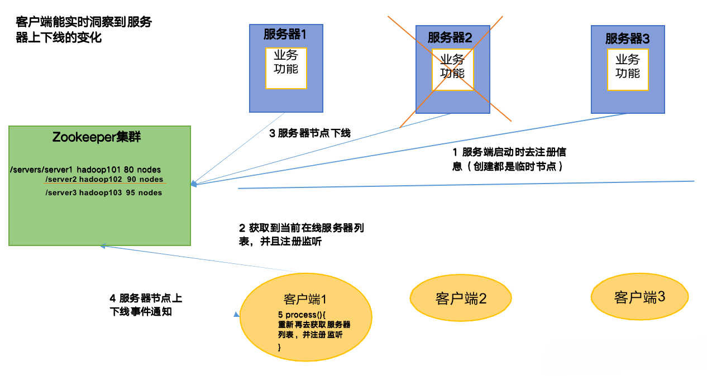
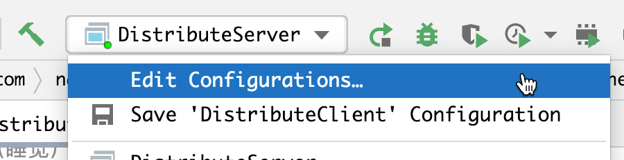
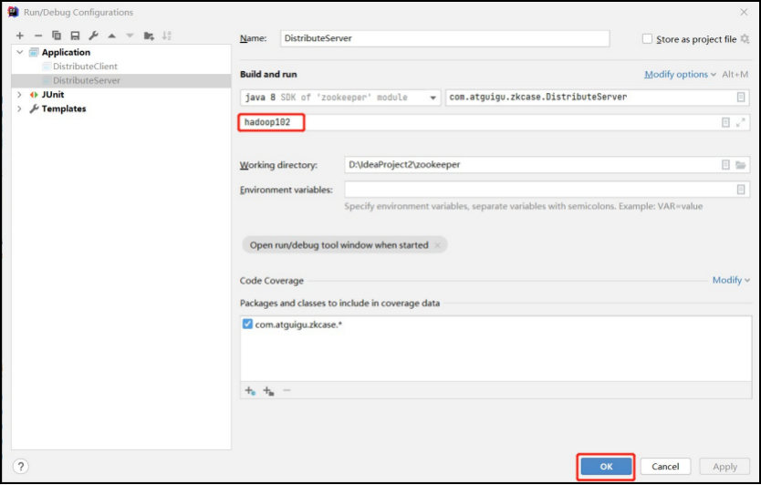
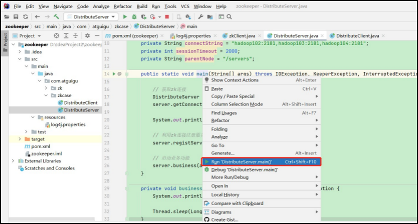

---
# 当前页面内容标题
title: 四、服务器动态上下线监听案例
# 分类
category:
  - Java
# 标签
tag:
  - Java
  - zookeeper
  - 分布式
sticky: false
# 是否收藏在博客主题的文章列表中，当填入数字时，数字越大，排名越靠前。
star: false
# 是否将该文章添加至文章列表中
article: true
# 是否将该文章添加至时间线中
timeline: true
---

## 01、需求

某分布式系统中，主节点可以有多台，可以动态上下线，任意一台客户端都能实时感知到主节点服务器的上下线。

## 02、需求分析

**服务器动态上下线**



## 03、具体实现

1.首先在集群上创建`/servers`节点

```sh
[zk: localhost:2181(CONNECTED) 2] create /servers "servers"
Created /servers
```

2.在IDEA中创建包名：com.nakanomay.zkcase1

3.服务端向zookeeper注册代码

```java
import org.apache.zookeeper.*;

import java.io.IOException;

/**
 * Created with IntelliJ IDEA.
 *
 * @author nakano_may丶
 * @date 2023/4/17
 * @Version 1.0
 * @description zk服务端代码
 */
public class DistributeServer
{
    private String connectString = "172.16.102.100:2181,172.16.102.135:2181,172.16.102.136:2181";
    private int sessionTimeout = 2000;
    private ZooKeeper zk = null;

    public static void main(String[] args) throws Exception
    {
        DistributeServer server = new DistributeServer();

        // 1 获取zk连接
        server.getConnect();

        // 2 注册服务器到zk集群
        server.registry(args[0]);

        // 3 启动业务逻辑（睡觉）
        server.business();

    }

    private void business() throws InterruptedException
    {
        Thread.sleep(Long.MAX_VALUE);
    }

    private void registry(String hostname) throws Exception
    {
        String create = zk.create("/servers/" + hostname, hostname.getBytes(), ZooDefs.Ids.OPEN_ACL_UNSAFE, CreateMode.EPHEMERAL_SEQUENTIAL);

        System.out.println(hostname + " is online");
    }

    private void getConnect() throws IOException
    {
        zk = new ZooKeeper(connectString, sessionTimeout, new Watcher()
        {
            @Override
            public void process(WatchedEvent event)
            {

            }
        });
    }
}
```

4.客户端代码

```java
import org.apache.zookeeper.KeeperException;
import org.apache.zookeeper.ZooKeeper;

import java.io.IOException;
import java.util.ArrayList;
import java.util.List;

/**
 * Created with IntelliJ IDEA.
 *
 * @author nakano_may丶
 * @date 2023/4/18
 * @Version 1.0
 * @description zk客户端代码
 */
public class DistributeClient
{
    private String connectString = "172.16.102.100:2181,172.16.102.135:2181,172.16.102.136:2181";
    private int sessionTimeout = 2000;
    private ZooKeeper zk = null;

    public static void main(String[] args) throws IOException, InterruptedException, KeeperException
    {
        DistributeClient client = new DistributeClient();
        // 1 获取zk连接
        client.getConnect();

        // 2 监听/servers下面节点的增加和删除
        client.getServerList();

        // 3 业余逻辑（睡觉）
        client.business();
    }

    private void business() throws InterruptedException
    {
        Thread.sleep(Long.MAX_VALUE);
    }

    // 获取服务器列表信息
    private void getServerList() throws InterruptedException, KeeperException
    {
        // 1 获取服务器子节点信息，并且对父节点进行监听
        List<String> children = zk.getChildren("/servers", true);

        // 2 存储服务器信息列表
        List<String> servers = new ArrayList<>();
        // 3 遍历所有接地那，获取节点中的主机名称信息
        for (String child : children) {
            byte[] data = zk.getData("/servers/" + child, false, null);
            servers.add(new String(data));
        }

        // 4 打印服务器列表信息
        System.out.println(servers);
    }

    private void getConnect() throws IOException
    {
        zk = new ZooKeeper(connectString, sessionTimeout, event -> {
            try {
                getServerList();
            }
            catch (InterruptedException e) {
                e.printStackTrace();
            }
            catch (KeeperException e) {
                e.printStackTrace();
            }
        });
    }
}
```

## 04、测试

**1）在Linux命令行上操作增加服务器**

1. 启动DistributeClient客户端

```sh
[zk: localhost:2181(CONNECTED) 10] create -e -s /servers/hadoop101 "hadoop101"
Created /servers/hadoop1010000000000
[zk: localhost:2181(CONNECTED) 11] create -e -s /servers/hadoop102 "hadoop102"
Created /servers/hadoop1020000000001
[zk: localhost:2181(CONNECTED) 12] create -e -s /servers/hadoop103 "hadoop103"
Created /servers/hadoop1030000000002
```

2. 观察idea控制台变化

```sh
[hadoop101]
[hadoop101,hadoop102]
[hadoop101,hadoop102,hadoop103]
```

**2）在idea上操作增加减少服务器**

1. 启动DistributeClient 客户端（如果已经启动过，不需要重启）

2. 启动DistributeServer 服务

①点击Edit Configurations…



②在弹出的窗口中（Program arguments）输入想启动的主机，例如，hadoop102



③回到 DistributeServer 的 main 方 法 ， 右 键 ， 在 弹 出 的 窗 口 中 点 击 Run “DistributeServer.main()”



④观察 DistributeServer 控制台，提示hadoop102 is working

⑤观察 DistributeClient 控制台，提示hadoop102 已经上线