---
# 当前页面内容标题
title: 二、Elasticsearch入门
# 分类
category:
  - ELK
# 标签
tag: 
  - ELK
  - 分布式搜索引擎
sticky: false
# 是否收藏在博客主题的文章列表中，当填入数字时，数字越大，排名越靠前。
star: false
# 是否将该文章添加至文章列表中
article: true
# 是否将该文章添加至时间线中
timeline: true
---

## 一、Elasticsearch安装

### 1.1 下载软件

Elasticsearch 的官方地址：<https://www.elastic.co/cn/>

Elasticsearch 最新的版本是 7.11.2（截止 2021.3.10），我们选择 7.8.0 版本（最新版本半年前的版本）

下载地址：<https://www.elastic.co/cn/downloads/past-releases#elasticsearch>

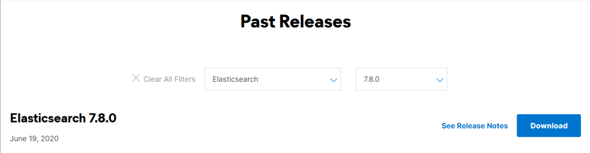

Elasticsearch 分为 Linux 和 Windows 版本，基于我们主要学习的是 Elasticsearch 的 Java客户端的使用，所以课程中使用的是安装较为简便的 Windows 版本。

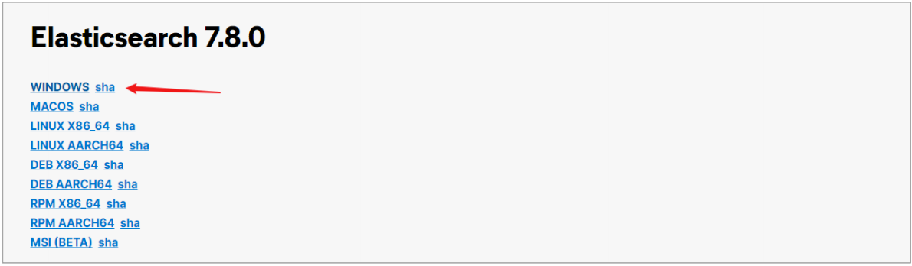

### 1.2 安装软件

Windows 版的 Elasticsearch 的安装很简单，解压即安装完毕，解压后的 Elasticsearch 的目录结构如下：


| 目录    | 含义           |
| ------- | -------------- |
| bin     | 可执行脚本目录 |
| config  | 配置目录       |
| jdk     | 内置JDK目录    |
| lib     | 类库           |
| logs    | 日志目录       |
| modules | 模块目录       |
| plugins | 插件目录       |

解压后，进入 bin 文件目录，点击 elasticsearch.bat 文件启动 ES 服务

> MAC用户可以参考Linux启动方式或者使用Homebrew来玩！

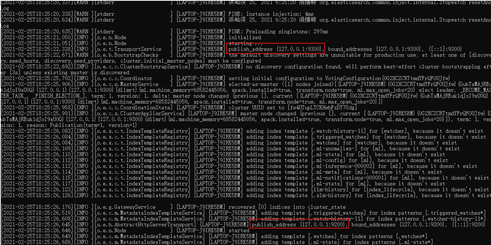

注意：`9300`端口为Elasticsearch集群间组件的通信端口，`9200`端口为浏览器访问的`http协议RESTful端口`。

打开浏览器（推荐使用谷歌浏览器），输入地址：<http://localhost:9200，测试结果>

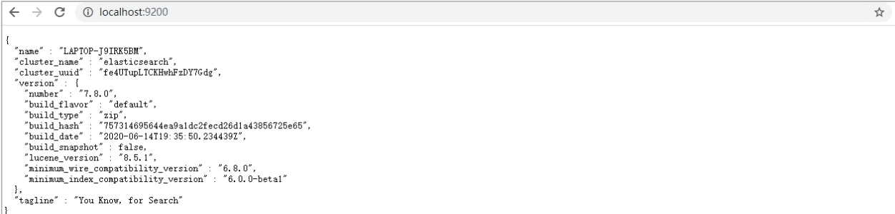

### 1.3 问题解决

- Elasticsearch 是使用 java 开发的，且 7.8 版本的 ES 需要 JDK 版本 1.8 以上，默认安装包带有 jdk 环境，如果系统配置 JAVA_HOME，那么使用系统默认的 JDK，如果没有配置使用自带的 JDK，一般建议使用系统配置的 JDK。
- 双击启动窗口闪退，通过路径访问追踪错误，如果是“空间不足”，请修改`config/jvm.options` 配置文件

```jvm.options
# 设置 JVM 初始内存为 1G。此值可以设置与-Xmx 相同，以避免每次垃圾回收完成后 JVM 重新分配内存
# Xms represents the initial size of total heap space
# 设置 JVM 最大可用内存为 1G
# Xmx represents the maximum size of total heap space
-Xms1g
-Xmx1g
```

## 二、Elasticsearch基本操作

### 2.1 RESTFUL

REST 指的是一组架构约束条件和原则。满足这些约束条件和原则的应用程序或设计就是 RESTful。Web 应用程序最重要的 REST 原则是，客户端和服务器之间的交互在请求之间是无状态的。从客户端到服务器的每个请求都必须包含理解请求所必需的信息。如果服务器在请求之间的任何时间点重启，客户端不会得到通知。此外，无状态请求可以由任何可用服务器回答，这十分适合云计算之类的环境。客户端可以缓存数据以改进性能。

在服务器端，应用程序状态和功能可以分为各种资源。资源是一个有趣的概念实体，它向客户端公开。资源的例子有：应用程序对象、数据库记录、算法等等。每个资源都使用 URI (Universal Resource Identifier) 得到一个唯一的地址。所有资源都共享统一的接口，以便在客户端和服务器之间传输状态。使用的是标准的 HTTP 方法，比如 GET、PUT、POST 和DELETE。

在 REST 样式的 Web 服务中，每个资源都有一个地址。资源本身都是方法调用的目标，方法列表对所有资源都是一样的。这些方法都是标准方法，包括 HTTP GET、POST、PUT、DELETE，还可能包括 HEAD 和 OPTIONS。简单的理解就是，如果想要访问互联网上的资源，就必须向资源所在的服务器发出请求，请求体中必须包含资源的网络路径，以及对资源进行的操作(增删改查)。

### 2.2 客户端安装

如果直接通过浏览器向 Elasticsearch 服务器发请求，那么需要在发送的请求中包含HTTP 标准的方法，而 HTTP 的大部分特性且仅支持 GET 和 POST 方法。所以为了能方便地进行客户端的访问，可以使用 Postman 软件

Postman 是一款强大的网页调试工具，提供功能强大的 Web API 和 HTTP 请求调试。软件功能强大，界面简洁明晰、操作方便快捷，设计得很人性化。Postman 中文版能够发送

任何类型的 HTTP 请求 (GET, HEAD, POST, PUT..)，不仅能够表单提交，且可以附带任意类型请求体。

Postman 官网：<https://www.getpostman.com>

Postman 下载：<https://www.getpostman.com/apps>

Apifox、Apipost等等……

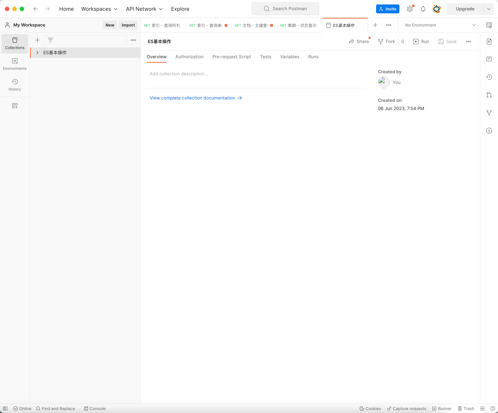

### 2.3 数据格式

Elasticsearch 是面向文档型数据库，一条数据在这里就是一个文档。为了方便大家理解，我们将 Elasticsearch 里存储文档数据和关系型数据库 MySQL 存储数据的概念进行一个类比：

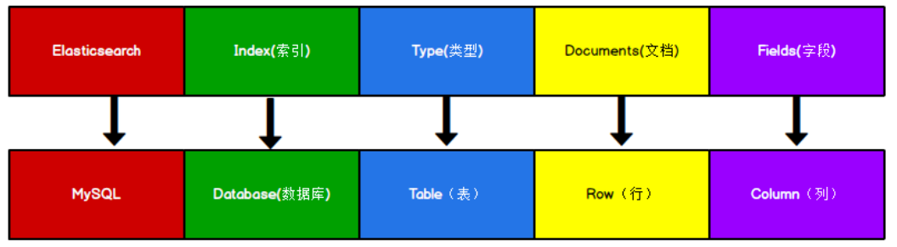

ES 里的 Index 可以看做一个库，而 Types 相当于表，Documents 则相当于表的行。

这里 Types 的概念已经被逐渐弱化，Elasticsearch 6.X 中，一个 index 下已经只能包含一个type，Elasticsearch 7.X 中, Type 的概念已经被删除了。

6 用 JSON 作为文档序列化的格式，比如一条用户信息：

```json
{
 "name" : "John",
 "sex" : "Male",
 "age" : 25,
 "birthDate": "1990/05/01",
 "about" : "I love to go rock climbing",
 "interests": [ "sports", "music" ]
}
```

### 2.4 HTTP操作

具体请参考如下进行在Postman中或者其他客户端软件进行测试：

> （1）创建索引

对比关系型数据库，创建索引就等同于创建数据库

在 Postman 中，向 ES 服务器发 **PUT** 请求 ：<http://127.0.0.1:9200/shopping>


请求后，服务器返回响应

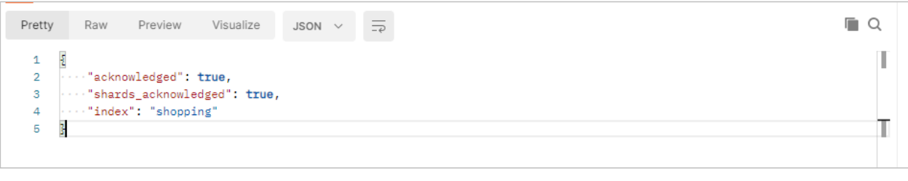

```json
{
 "acknowledged"【响应结果】: true, # true 操作成功
 "shards_acknowledged"【分片结果】: true, # 分片操作成功
 "index"【索引名称】: "shopping"
}
# 注意：创建索引库的分片数默认 1 片，在 7.0.0 之前的 Elasticsearch 版本中，默认 5 片
```

如果重复添加索引，会返回错误信息

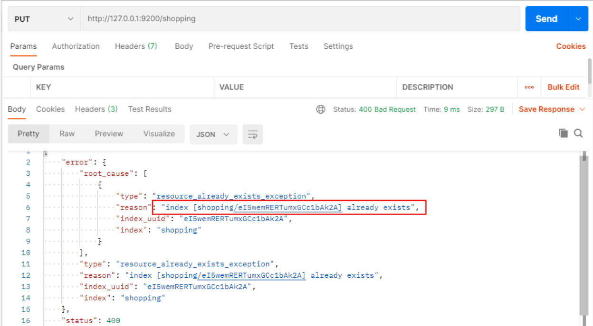

> （2）查看所有索引

在 Postman 中，向 ES 服务器发 **GET** 请求 ：<http://127.0.0.1:9200/_cat/indices?v>


这里请求路径中的_cat 表示查看的意思，indices 表示索引，所以整体含义就是查看当前 ES服务器中的所有索引，就好像 MySQL 中的 show tables 的感觉，服务器响应结果如下

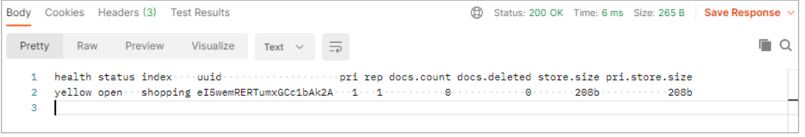

| 表头           | 含义                                                         |
| -------------- | ------------------------------------------------------------ |
| health         | 当前服务器健康状态：<br/>**green**(集群完整) **yellow**(单点正常、集群不完整) red(单点不正常) |
| status         | 索引打开、关闭状态                                           |
| index          | 索引名                                                       |
| uuid           | 索引唯一编号                                                 |
| pri            | 主分片数量                                                   |
| rep            | 副本数量                                                     |
| docs.count     | 可用文档数量                                                 |
| docs.deleted   | 文档删除状态（逻辑删除）                                     |
| store.size     | 主分片和副分片整体占空间大小                                 |
| pri.store.size | 主分片占空间大小                                             |

> （3）查看单个索引

在 Postman 中，向 ES 服务器发 **GET** 请求 ：<http://127.0.0.1:9200/shopping>


查看索引向 ES 服务器发送的请求路径和创建索引是一致的。但是 HTTP 方法不一致。这里可以体会一下 RESTful 的意义，

请求后，服务器响应结果如下：

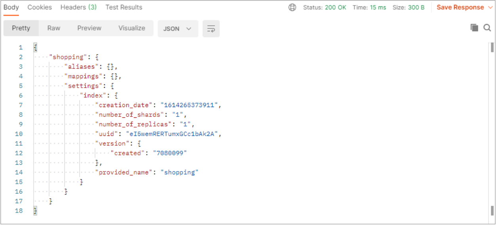

```json
{
        "shopping"【索引名】: { 
        "aliases"【别名】: {},
        "mappings"【映射】: {},
        "settings"【设置】: {
         "index"【设置 - 索引】: {
         "creation_date"【设置 - 索引 - 创建时间】: "1614265373911",
         "number_of_shards"【设置 - 索引 - 主分片数量】: "1",
            "number_of_replicas"【设置 - 索引 - 副分片数量】: "1",
            "uuid"【设置 - 索引 - 唯一标识】: "eI5wemRERTumxGCc1bAk2A",
            "version"【设置 - 索引 - 版本】: {
                "created": "7080099"
            },
            "provided_name"【设置 - 索引 - 名称】: "shopping"
         }
      }
   } 
}
```

> (4)删除索引

在 Postman 中，向 ES 服务器发 **DELETE** 请求 ：<http://127.0.0.1:9200/shopping>


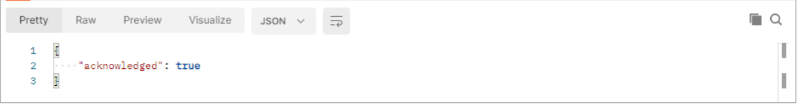

重新访问索引时，服务器返回响应：**索引不存在**


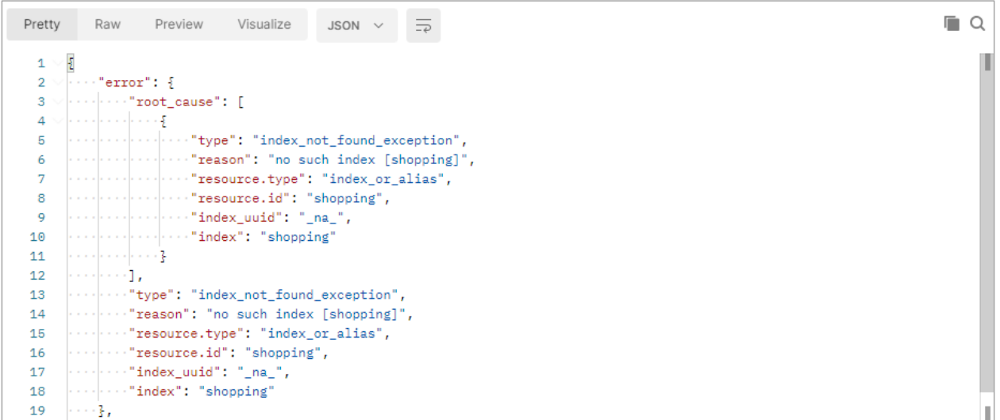

### 2.5 文档操作

> （1）创建文档

索引已经创建好了，接下来我们来创建文档，并添加数据。这里的文档可以类比为关系型数据库中的表数据，添加的数据格式为 JSON 格式

在 Postman 中，向 ES 服务器发 **POST** 请求 ：<http://127.0.0.1:9200/shopping**/_doc>**

请求体内容为：

```json
{
 "title":"小米手机",
 "category":"小米",
 "./images":"http://www.gulixueyuan.com/xm.jpg",
 "price":3999.00
}
```

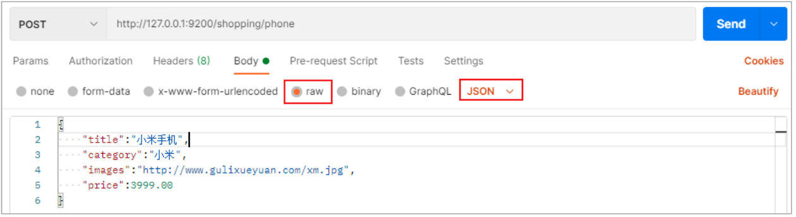

此处发送请求的方式必须为 **POST**，不能是 **PUT**，否则会发生错误

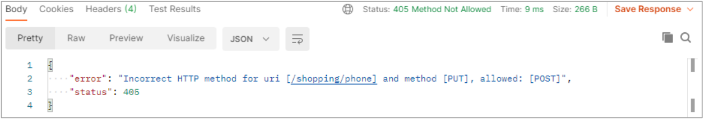

服务器响应结果如下：

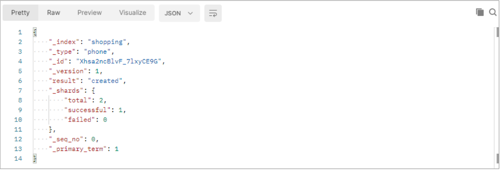

```json
{
 "_index"【索引】: "shopping",
 "_type"【类型-文档】: "_doc",
 "_id"【唯一标识】: "Xhsa2ncBlvF_7lxyCE9G", #可以类比为 MySQL 中的主键，随机生成
 "_version"【版本】: 1,
 "result"【结果】: "created", #这里的 create 表示创建成功
 "_shards"【分片】: {
 "total"【分片 - 总数】: 2,
 "successful"【分片 - 成功】: 1,
 "failed"【分片 - 失败】: 0
 },
 "_seq_no": 0,
 "_primary_term": 1
}
```

上面的数据创建后，由于没有指定数据唯一性标识（ID），默认情况下，ES 服务器会随机生成一个。

如果想要自定义唯一性标识，需要在创建时指定：<http://127.0.0.1:9200/shopping/_doc/**1>**


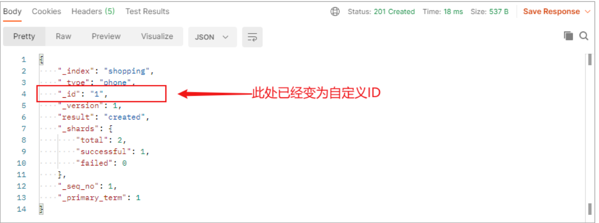

此处需要注意：如果增加数据时明确数据主键，那么请求方式也可以为 PUT

> （2）查看文档

查看文档时，需要指明文档的唯一性标识，类似于 MySQL 中数据的主键查询

在 Postman 中，向 ES 服务器发 **GET** 请求 ：<http://127.0.0.1:9200/shopping**/_doc/1>**


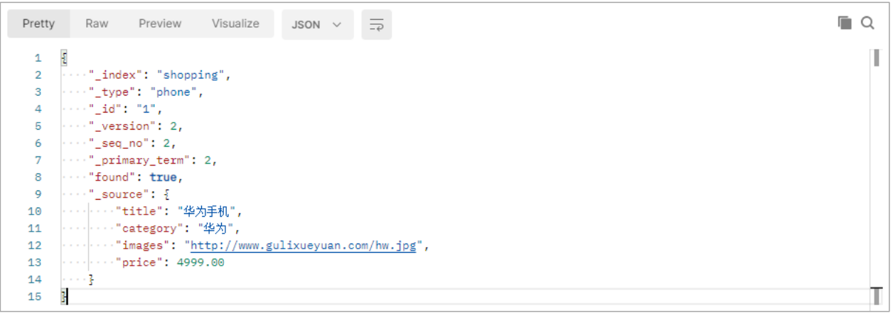

```json
{
 "_index"【索引】: "shopping",
 "_type"【文档类型】: "_doc",
 "_id": "1",
 "_version": 2,
 "_seq_no": 2,
 "_primary_term": 2,
 "found"【查询结果】: true, # true 表示查找到，false 表示未查找到
 "_source"【文档源信息】: {
 "title": "华为手机",
 "category": "华为",
 "./images": "http://www.gulixueyuan.com/hw.jpg",
 "price": 4999.00
 } 
}
```

> （3）修改文档

和新增文档一样，输入相同的 URL 地址请求，如果请求体变化，会将原有的数据内容覆盖

在 Postman 中，向 ES 服务器发 **POST** 请求 ：<http://127.0.0.1:9200/shopping**/_doc/1>**

请求体内容为：

```json
{
    "title":"华为手机",
    "category":"华为",
    "./images":"http://www.gulixueyuan.com/hw.jpg",
    "price":4999
}
```

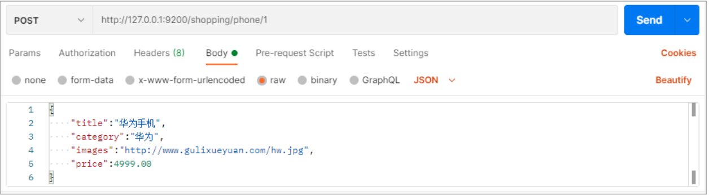

修改成功后，服务器响应结果：

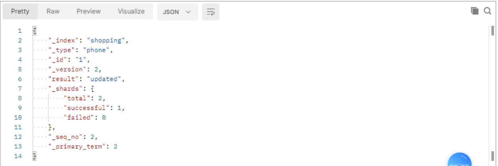

```json
{
    "_index":"shopping",
    "_type":"_doc",
    "_id":"1",
    "_version"【版本】: 2,
  "result"【结果】: "updated", # updated 表示数据被更新
    "_shards":{
        "total":2,
        "successful":1,
        "failed":0
    },
    "_seq_no":2,
    "_primary_term":2
}
```

> （4）修改字段

修改数据时，也可以只修改某一给条数据的局部信息

在 Postman 中，向 ES 服务器发 **POST** 请求 ：<http://127.0.0.1:9200/shopping/**_update/1>**

请求体内容为：

```json
{
    "doc":{
        "price":3000
    }
}
```

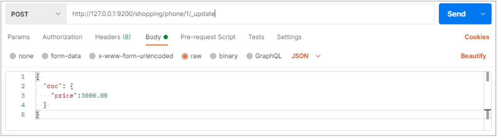

修改成功后，服务器响应结果：

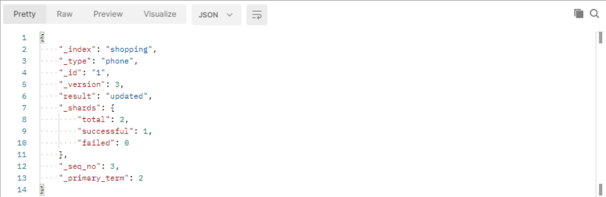

根据唯一性标识，查询文档数据，文档数据已经更新


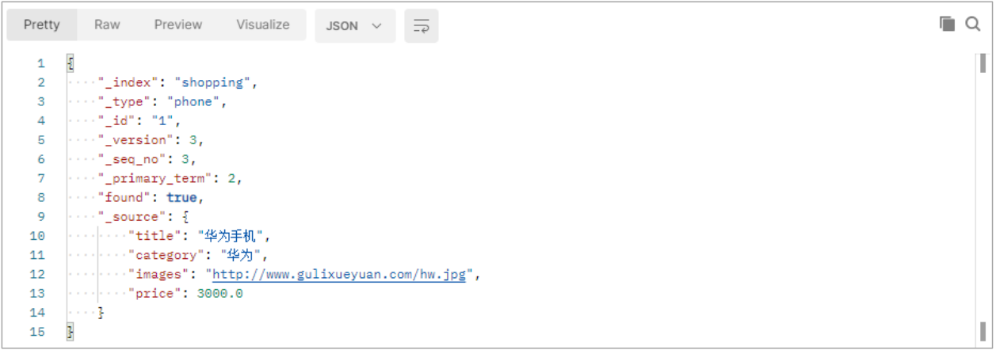

> （5）删除文档

删除一个文档不会立即从磁盘上移除，它只是被标记成已删除（逻辑删除）。

在 Postman 中，向 ES 服务器发 **DELETE** 请求 ：<http://127.0.0.1:9200/shopping**/_doc/1>**


删除成功，服务器响应结果：

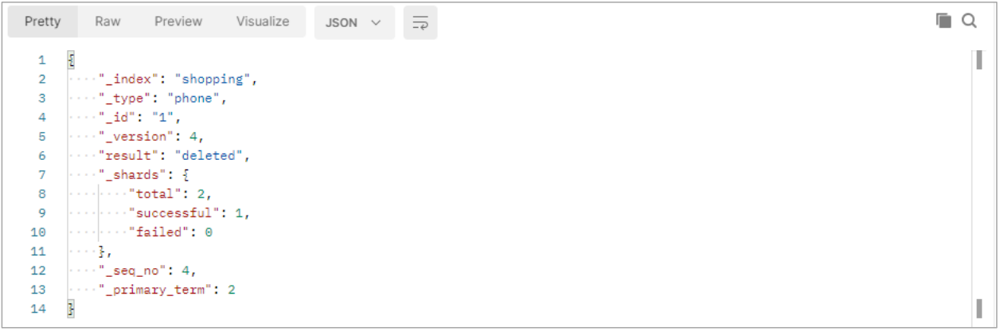

```json
{
    "_index":"shopping",
    "_type":"_doc",
    "_id":"1",
    "_version"【版本】: 4, #对数据的操作，都会更新版本
  "result"【结果】: "deleted", # deleted 表示数据被标记为删除
    "_shards":{
        "total":2,
        "successful":1,
        "failed":0
    },
    "_seq_no":4,
    "_primary_term":2
}
```

删除后再查询当前文档信息


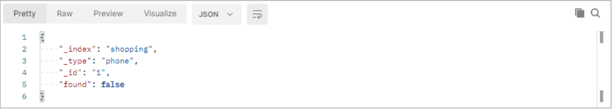

如果删除一个并不存在的文档


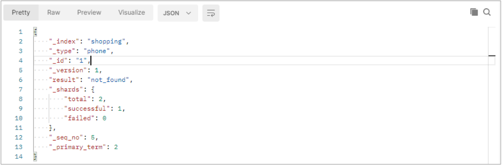

```json
{
    "_index":"shopping",
    "_type":"_doc",
    "_id":"1",
    "_version":1,
    "result"【结果】: "not_found", # not_found 表示未查找到
    "_shards":{
        "total":2,
        "successful":1,
        "failed":0
    },
    "_seq_no":5,
    "_primary_term":2
}
```

> （6）条件删除文档

一般删除数据都是根据文档的唯一性标识进行删除，实际操作时，也可以根据条件对多条数据进行删除

首先分别增加多条数据:

```json
{
    "title":"小米手机",
    "category":"小米",
    "./images":"http://www.gulixueyuan.com/xm.jpg",
    "price":4000
}
{
    "title":"华为手机",
    "category":"华为",
    "./images":"http://www.gulixueyuan.com/hw.jpg",
    "price":4000
}
```

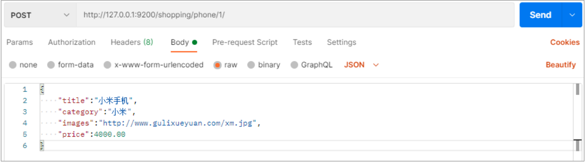

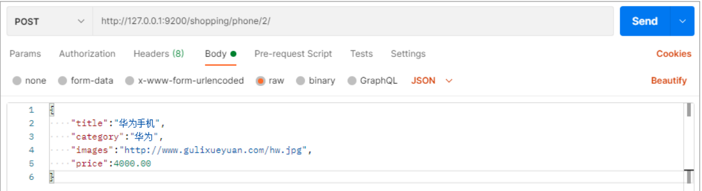

向 ES 服务器发 **POST** 请求 ：<http://127.0.0.1:9200/shopping**/_delete_by_query>**

请求体内容为：

```json
{
    "query":{
        "match":{
            "price":4000
        }
    }
}
```


删除成功后，服务器响应结果：

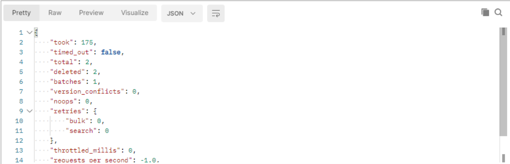

```json
{
 "took"【耗时】: 175,
  "timed_out"【是否超时】: false,
  "total"【总数】: 2,
  "deleted"【删除数量】: 2,
    "batches":1,
    "version_conflicts":0,
    "noops":0,
    "retries":{
        "bulk":0,
        "search":0
    },
    "throttled_millis":0,
    "requests_per_second":-1,
    "throttled_until_millis":0,
    "failures":[

    ]
}
```

### 2.6 映射操作

有了索引库，等于有了数据库中的 database。

接下来就需要建索引库(index)中的映射了，类似于数据库(database)中的表结构(table)。创建数据库表需要设置字段名称，类型，长度，约束等；索引库也一样，需要知道这个类型下有哪些字段，每个字段有哪些约束信息，这就叫做映射(mapping)。

> (1)创建映射

在 Postman 中，向ES 服务器发 **PUT** 请求 ：<http://127.0.0.1:9200/student**/_mapping>**

请求内容为：

```json
{
    "properties":{
        "name":{
            "type":"text",
            "index":true
        },
        "sex":{
            "type":"text",
            "index":false
        },
        "age":{
            "type":"long",
            "index":false
        }
    }
}
```

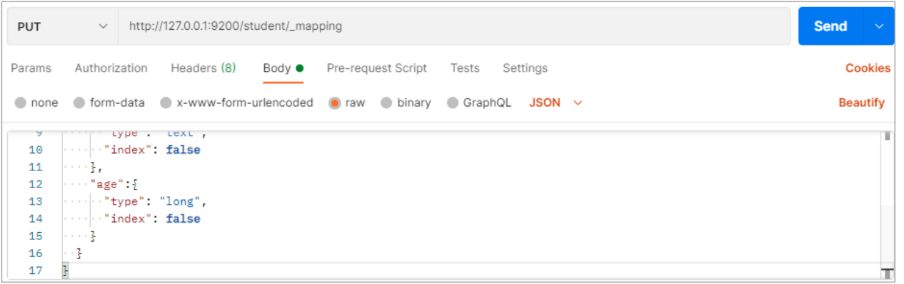

服务器响应结果如下：

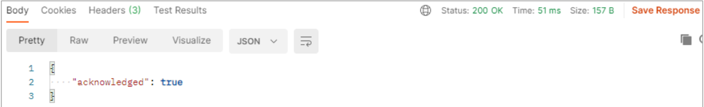

映射数据说明：

- 字段名：任意填写，下面指定许多属性，例如：title、subtitle、./images、price

- type：类型，Elasticsearch 中支持的数据类型非常丰富，说几个关键的：

  - String 类型，又分两种：

        text：可分词

        keyword：不可分词，数据会作为完整字段进行匹配

- Numerical：数值类型，分两类

  - 基本数据类型：long、integer、short、byte、double、float、half_float
  - 浮点数的高精度类型：scaled_float

- Date：日期类型

- Array：数组类型

- Object：对象

- index：是否索引，默认为 true，也就是说你不进行任何配置，所有字段都会被索引。
  - true：字段会被索引，则可以用来进行搜索
  - false：字段不会被索引，不能用来搜索

- store：是否将数据进行独立存储，默认为 false

    原始的文本会存储在_source 里面，默认情况下其他提取出来的字段都不是独立存储的，是从_source 里面提取出来的。当然你也可以独立的存储某个字段，只要设置"store": true 即可，获取独立存储的字段要比从_source 中解析快得多，但是也会占用更多的空间，所以要根据实际业务需求来设置。

- analyzer：分词器，这里的 ik_max_word 即使用 ik 分词器,后面会有专门的章节学习

> （2）查看映射

在 Postman 中，向 ES 服务器发 **GET** 请求 ：<http://127.0.0.1:9200/student**/_mapping>**


服务器响应结果如下：


> （3）索引映射关联

在 Postman 中，向 ES 服务器发 **PUT** 请求 ：<http://127.0.0.1:9200/student1>

```json
{
    "settings":{

    },
    "mappings":{
        "properties":{
            "name":{
                "type":"text",
                "index":true
            },
            "sex":{
                "type":"text",
                "index":false
            },
            "age":{
                "type":"long",
                "index":false
            }
        }
    }
}
```

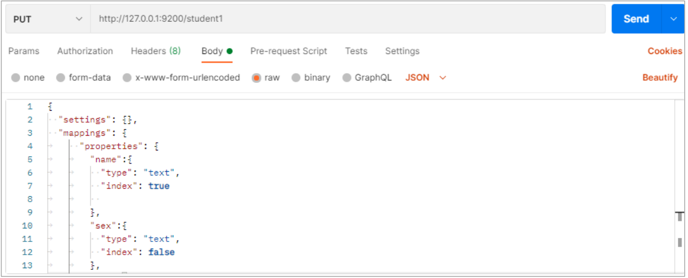

服务器响应结果如下：

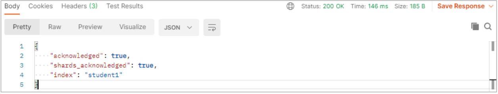

### 2.7 高级查询

Elasticsearch 提供了基于 JSON 提供完整的查询 DSL 来定义查询

定义数据 :

```json
# POST /student/_doc/1001
{
"name":"zhangsan",
"nickname":"zhangsan",
 "sex":"男",
 "age":30
}
# POST /student/_doc/1002
{
"name":"lisi",
"nickname":"lisi",
 "sex":"男",
 "age":20 }
# POST /student/_doc/1003
{
"name":"wangwu",
 "nickname":"wangwu",
 "sex":"女",
 "age":40 }
# POST /student/_doc/1004
{
"name":"zhangsan1",
"nickname":"zhangsan1",
 "sex":"女",
 "age":50 }
# POST /student/_doc/1005
{
"name":"zhangsan2",
"nickname":"zhangsan2",
 "sex":"女",
 "age":30 
 }
```

> （1）查询所有文档

在 Postman 中，向 ES 服务器发 **GET** 请求 ：<http://127.0.0.1:9200/student/_search>

```json
{
    "query":{
        "match_all":{

        }
    }
}
# "query"：这里的 query 代表一个查询对象，里面可以有不同的查询属性
# "match_all"：查询类型，例如：match_all(代表查询所有)， match，term ， range 等等
# {查询条件}：查询条件会根据类型的不同，写法也有差异
```


服务器响应结果如下：

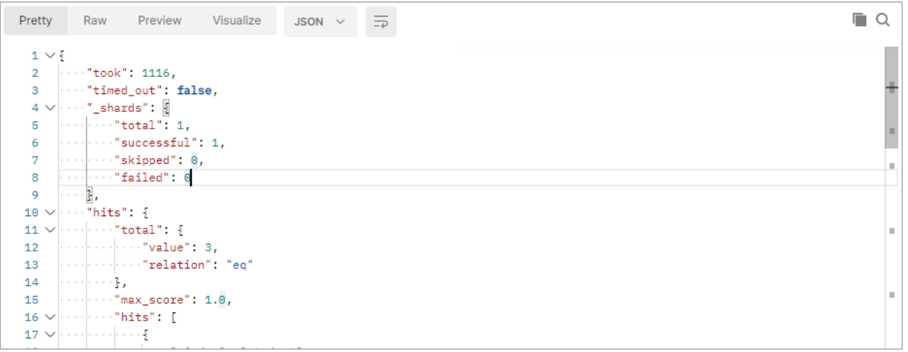

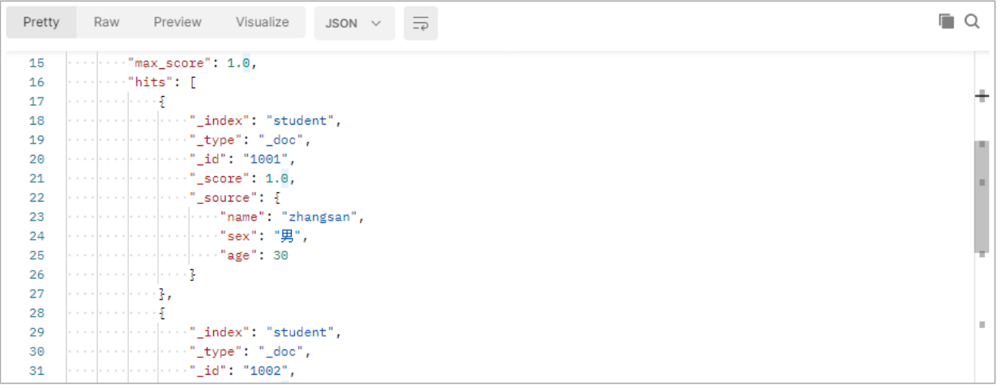

```json
{
     "took【查询花费时间，单位毫秒】" : 1116,
     "timed_out【是否超时】" : false,
     "_shards【分片信息】" : {
     "total【总数】" : 1,
     "successful【成功】" : 1,
     "skipped【忽略】" : 0,
     "failed【失败】" : 0
     },
     "hits【搜索命中结果】" : {
     "total"【搜索条件匹配的文档总数】: {
     "value"【总命中计数的值】: 3,
     "relation"【计数规则】: "eq" # eq 表示计数准确， gte 表示计数不准确
     },
     "max_score【匹配度分值】" : 1.0,
     "hits【命中结果集合】" : [
     。。。
  }
 ]
 } 
}
```

> （2）匹配查询

match 匹配类型查询，会把查询条件进行分词，然后进行查询，多个词条之间是 or 的关系

在 Postman 中，向 ES 服务器发 GET 请求 ：<http://127.0.0.1:9200/student/_search>

```json
{
    "query":{
        "match":{
            "name":"zhangsan"
        }
    }
}
```

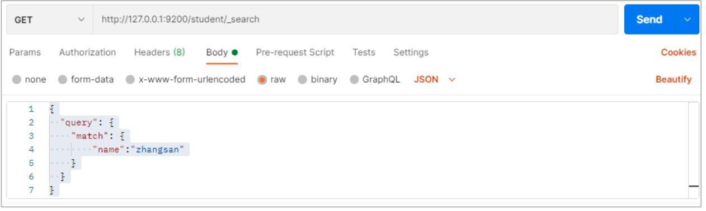

服务器响应结果为：


> (3)字段匹配查询

multi_match 与 match 类似，不同的是它可以在多个字段中查询。

在 Postman 中，向 ES 服务器发 GET 请求 ：<http://127.0.0.1:9200/student/_search>

```json
{
    "query":{
        "multi_match":{
            "query":"zhangsan",
            "fields":[
                "name",
                "nickname"
            ]
        }
    }
}
```

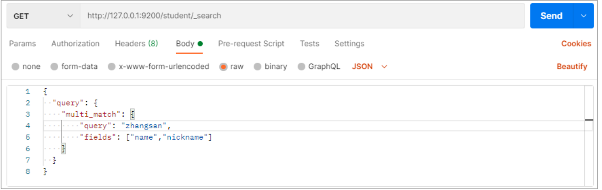

服务器响应结果：

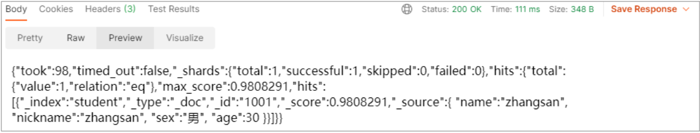

> （4）关键字精准查询

term 查询，精确的关键词匹配查询，不对查询条件进行分词。

在 Postman 中，向 ES 服务器发 GET 请求 ：<http://127.0.0.1:9200/student/_search>

```json
{
    "query":{
        "term":{
            "name":{
                "value":"zhangsan"
            }
        }
    }
}
```


服务器响应结果：

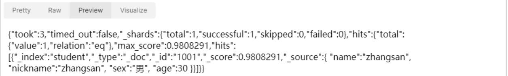

> （5）多关键字精准查询

terms 查询和 term 查询一样，但它允许你指定多值进行匹配。

如果这个字段包含了指定值中的任何一个值，那么这个文档满足条件，类似于 mysql 的 in

在 Postman 中，向 ES 服务器发 GET 请求 ：<http://127.0.0.1:9200/student/_search>

```json
{
    "query":{
        "terms":{
            "name":[
                "zhangsan",
                "lisi"
            ]
        }
    }
}
```

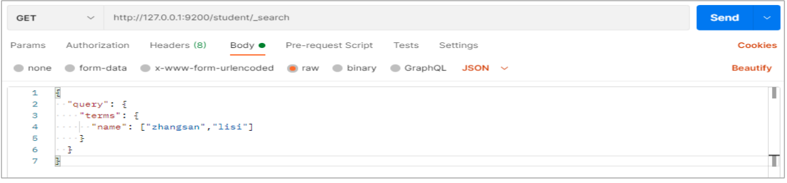

服务器响应结果：

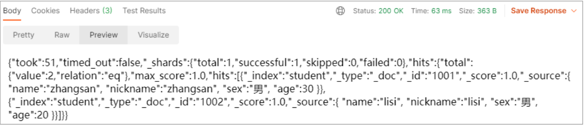

> （6）指定查询字段

默认情况下，Elasticsearch 在搜索的结果中，会把文档中保存在_source 的所有字段都返回。

如果我们只想获取其中的部分字段，我们可以添加_source 的过滤

在 Postman 中，向 ES 服务器发 GET 请求 ：<http://127.0.0.1:9200/student/_search>

```json
{
    "_source":[
        "name",
        "nickname"
    ],
    "query":{
        "terms":{
            "nickname":[
                "zhangsan"
            ]
        }
    }
}
```

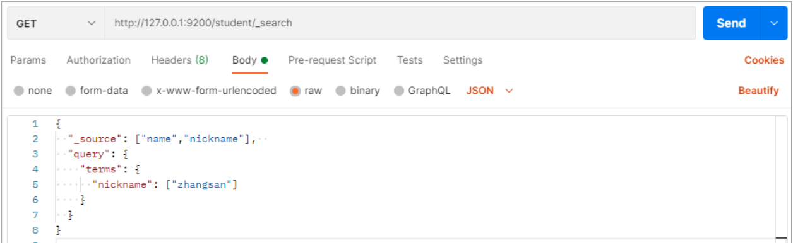

服务器响应结果：

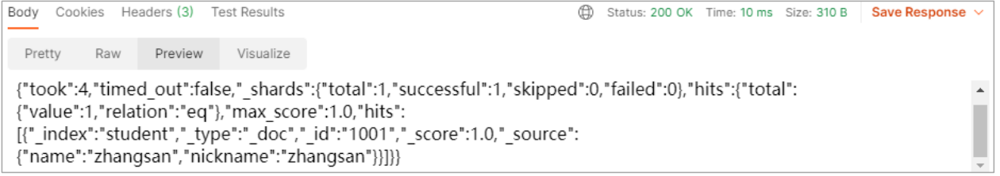

> (7)过滤字段

我们也可以通过：

- includes：来指定想要显示的字段
- excludes：来指定不想要显示的字段

在 Postman 中，向 ES 服务器发 GET 请求 ：<http://127.0.0.1:9200/student/_search>

```json
{
    "_source":{
        "includes":[
            "name",
            "nickname"
        ]
    },
    "query":{
        "terms":{
            "nickname":[
                "zhangsan"
            ]
        }
    }
}
```

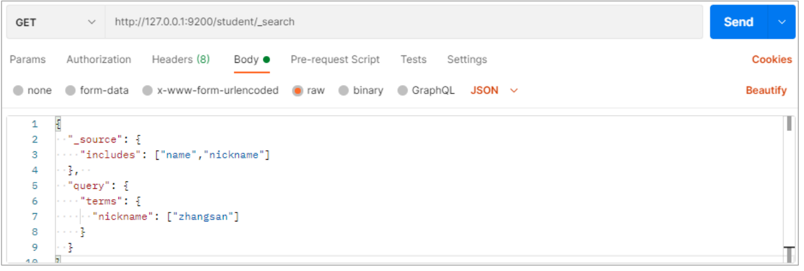

服务器响应结果：

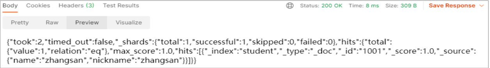

在 Postman 中，向 ES 服务器发 **GET** 请求 ：<http://127.0.0.1:9200/student/_search>

```json
{
    "_source":{
        "excludes":[
            "name",
            "nickname"
        ]
    },
    "query":{
        "terms":{
            "nickname":[
                "zhangsan"
            ]
        }
    }
}
```

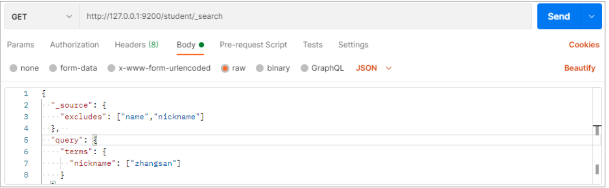

服务器响应结果:

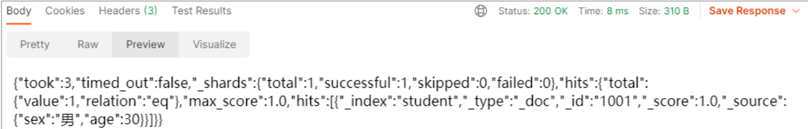

> （8）组合查询

`bool`把各种其它查询通过`must`（必须 ）、`must_not`（必须不）、`should`（应该）的方

式进行组合

在 Postman 中，向 ES 服务器发 **GET** 请求 ：<http://127.0.0.1:9200/student/_search>

```json
{
    "query":{
        "bool":{
            "must":[
                {
                    "match":{
                        "name":"zhangsan"
                    }
                }
            ],
            "must_not":[
                {
                    "match":{
                        "age":"40"
                    }
                }
            ],
            "should":[
                {
                    "match":{
                        "sex":"男"
                    }
                }
            ]
        }
    }
}
```

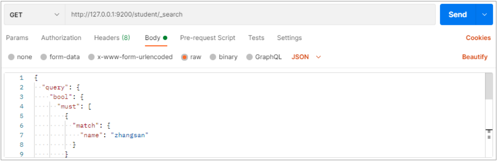

服务器响应结果：

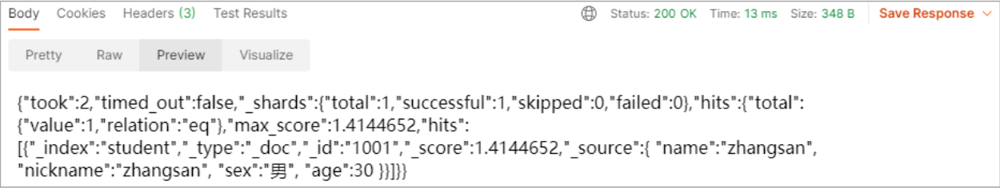

> （9）范围查询

range 查询找出那些落在指定区间内的数字或者时间。range 查询允许以下字符

| 操作符 | 说明       |
| ------ | ---------- |
| gt     | 大于>      |
| gte    | 大于等于>= |
| lt     | 小于<      |
| lte    | 小于等于<= |

在 Postman 中，向 ES 服务器发 **GET** 请求 ：<http://127.0.0.1:9200/student/_search>

```json
{
    "query":{
        "range":{
            "age":{
                "gte":30,
                "lte":35
            }
        }
    }
}
```

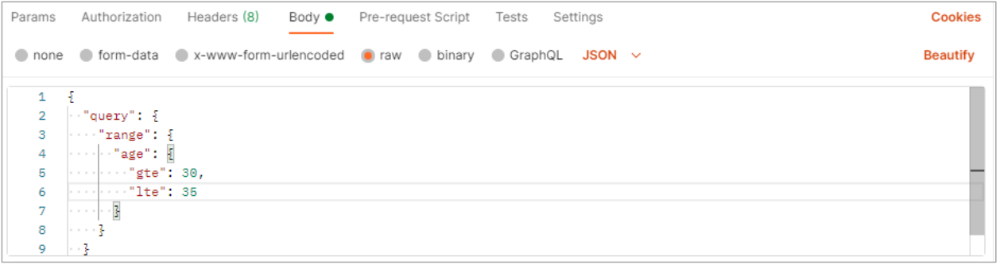

服务器响应结果：

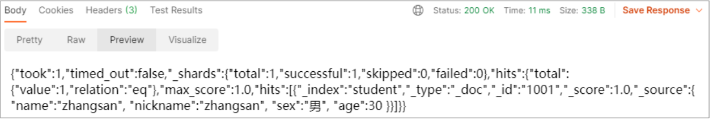

> (10)模糊查询

返回包含与搜索字词相似的字词的文档。

编辑距离是将一个术语转换为另一个术语所需的一个字符更改的次数。这些更改可以包括：

- 更改字符（box → fox）

- 删除字符（black → lack）

- 插入字符（sic → sick）

- 转置两个相邻字符（act → cat）

为了找到相似的术语，fuzzy 查询会在指定的编辑距离内创建一组搜索词的所有可能的变体或扩展。然后查询返回每个扩展的完全匹配。

通过 fuzziness 修改编辑距离。一般使用默认值 AUTO，根据术语的长度生成编辑距离。

在 Postman 中，向 ES 服务器发 **GET** 请求 ：<http://127.0.0.1:9200/student/_search>

```json
{
    "query":{
        "fuzzy":{
            "title":{
                "value":"zhangsan"
            }
        }
    }
}
```

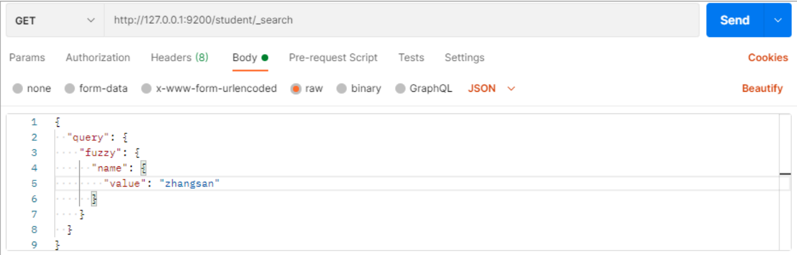

服务器响应结果：

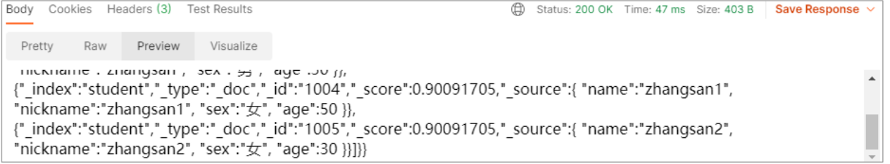

在 Postman 中，向 ES 服务器发 **GET** 请求 ：<http://127.0.0.1:9200/student/_search>

```json
{
    "query":{
        "fuzzy":{
            "title":{
                "value":"zhangsan",
                "fuzziness":2
            }
        }
    }
}
```

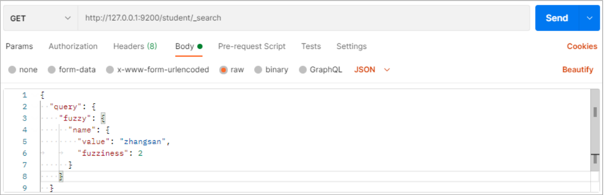

服务器响应结果：

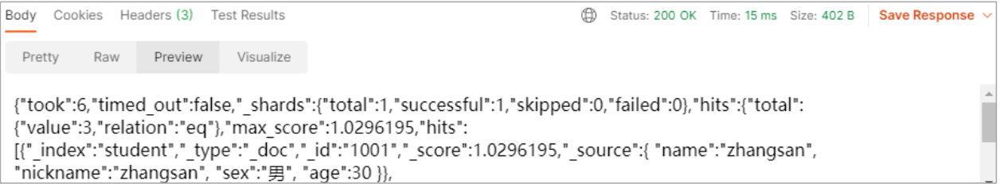

> （11）单字段排序

sort 可以让我们按照不同的字段进行排序，并且通过 order 指定排序的方式。desc 降序，asc升序。

在 Postman 中，向 ES 服务器发 GET 请求 ：<http://127.0.0.1:9200/student/_search>

```json
{
    "query":{
        "match":{
            "name":"zhangsan"
        }
    },
    "sort":[
        {
            "age":{
                "order":"desc"
            }
        }
    ]
}
```


服务器响应结果：

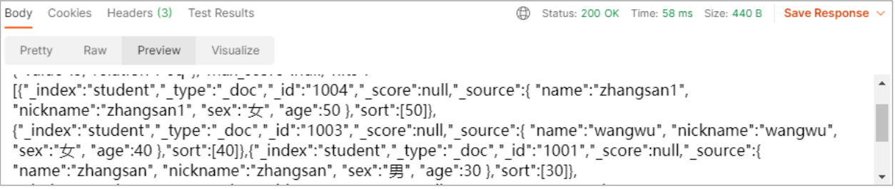

> （12）多字段排序

假定我们想要结合使用 age 和 _score 进行查询，并且匹配的结果首先按照年龄排序，然后按照相关性得分排序

在 Postman 中，向 ES 服务器发 **GET** 请求 ：<http://127.0.0.1:9200/student/_search>

```json
{
    "query":{
        "match_all":{

        }
    },
    "sort":[
        {
            "age":{
                "order":"desc"
            }
        },
        {
            "_score":{
                "order":"desc"
            }
        }
    ]
}
```

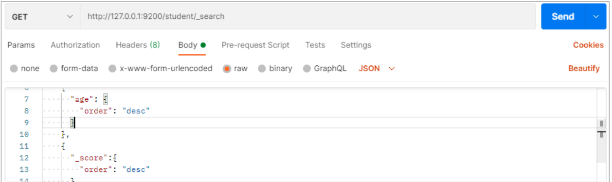

服务器响应结果：

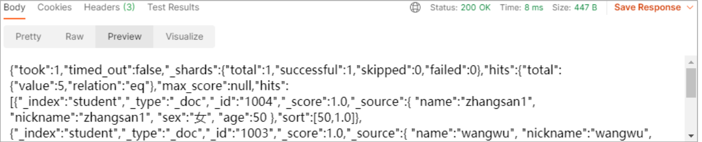

> （13）高亮查询

在进行关键字搜索时，搜索出的内容中的关键字会显示不同的颜色，称之为高亮。

- 在百度搜索“京东”


Elasticsearch 可以对查询内容中的关键字部分，进行标签和样式(高亮)的设置。

在使用 match 查询的同时，加上一个 highlight 属性：

- pre_tags：前置标签
- post_tags：后置标签
- fields：需要高亮的字段
- title：这里声明 title 字段需要高亮，后面可以为这个字段设置特有配置，也可以空

在 Postman 中，向 ES 服务器发 GET 请求 ：<http://127.0.0.1:9200/student/_search>

```json
{
    "query":{
        "match":{
            "name":"zhangsan"
        }
    },
    "highlight":{
        "pre_tags":"<font color='red'>",
        "post_tags":"</font>",
        "fields":{
            "name":{

            }
        }
    }
}
```

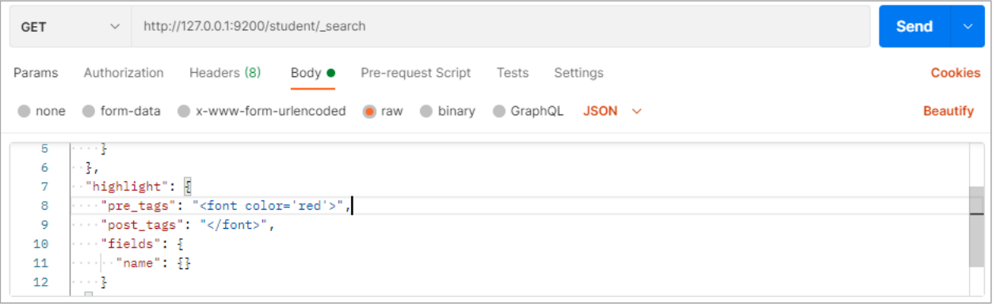

服务器响应结果：

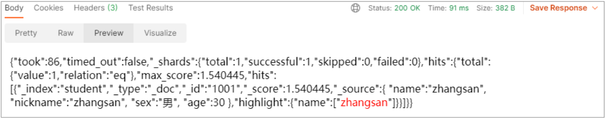

> （14）分页查询

from：当前页的起始索引，默认从 0 开始。 from = (pageNum - 1) * size

size：每页显示多少条

在 Postman 中，向 ES 服务器发 **GET** 请求 ：<http://127.0.0.1:9200/student/_search>

```json
{
    "query":{
        "match_all":{

        }
    },
    "sort":[
        {
            "age":{
                "order":"desc"
            }
        }
    ],
    "from":0,
    "size":2
}
```

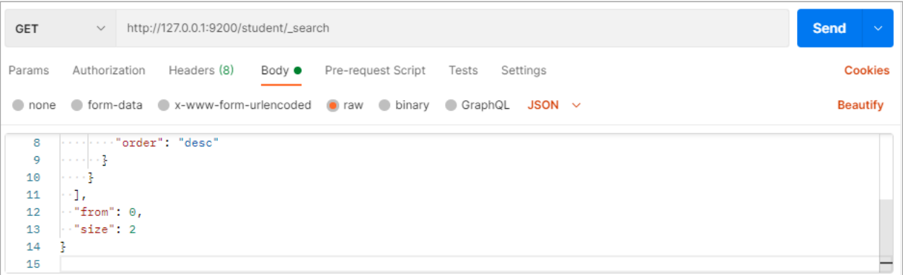

服务器响应结果：


> （15）聚合查询

聚合允许使用者对 es 文档进行统计分析，类似与关系型数据库中的 group by，当然还有很多其他的聚合，例如取最大值、平均值等等。

- 对某个字段取最大值 max

在 Postman 中，向 ES 服务器发 GET 请求 ：<http://127.0.0.1:9200/student/_search>

```json
{
    "aggs":{
        "max_age":{
            "max":{
                "field":"age"
            }
        }
    },
    "size":0
}
```

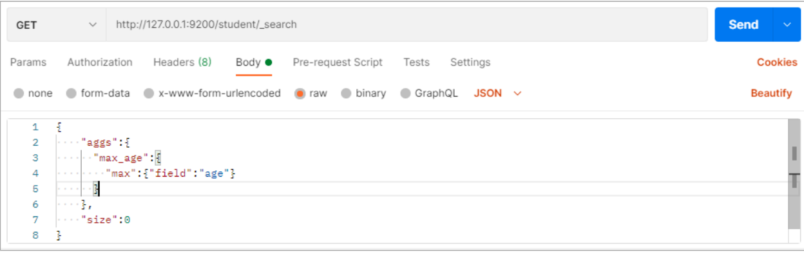

服务器响应结果：

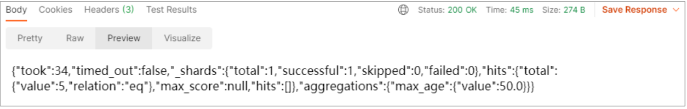

- 对某个字段取最小值 min

在 Postman 中，向 ES 服务器发 GET 请求 ：<http://127.0.0.1:9200/student/_search>

```json
{
    "aggs":{
        "min_age":{
            "min":{
                "field":"age"
            }
        }
    },
    "size":0
}
```

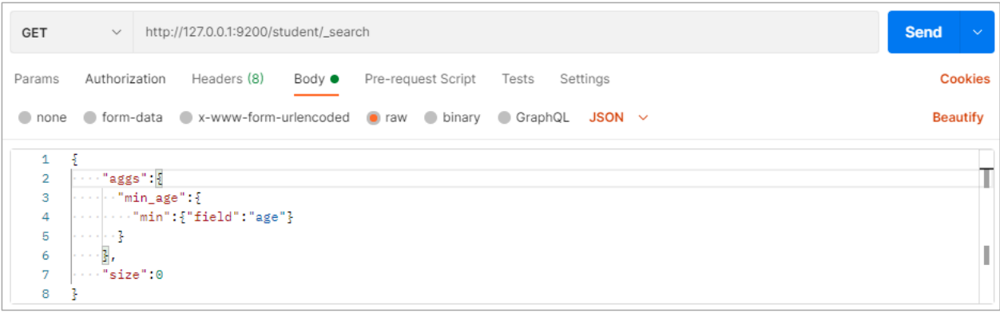

服务器响应结果：


在 Postman 中，向 ES 服务器发 GET 请求 ：<http://127.0.0.1:9200/student/_search>

```json
{
    "aggs":{
        "sum_age":{
            "sum":{
                "field":"age"
            }
        }
    },
    "size":0
}
```


服务器响应结果：

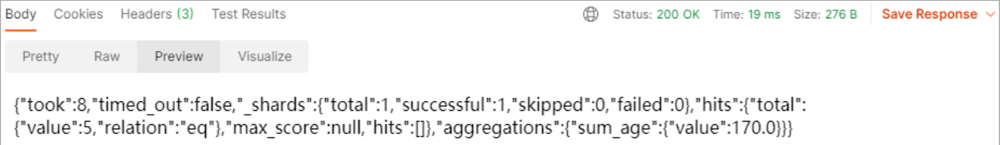

- 对某个字段取平均值 avg

在 Postman 中，向 ES 服务器发 GET 请求 ：<http://127.0.0.1:9200/student/_search>

```json
{
    "aggs":{
        "avg_age":{
            "avg":{
                "field":"age"
            }
        }
    },
    "size":0
}
```

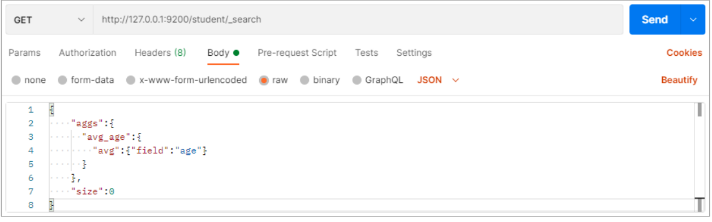

服务器响应结果：

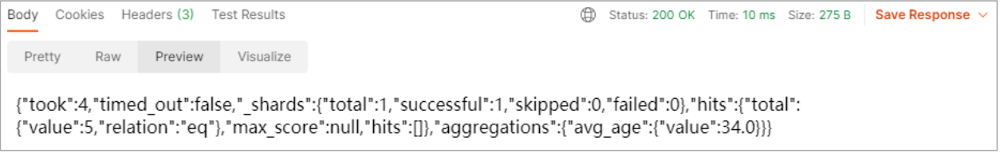

- 对某个字段的值进行去重之后再取总数

在 Postman 中，向 ES 服务器发 GET 请求 ：<http://127.0.0.1:9200/student/_search>

```json
{
    "aggs":{
        "distinct_age":{
            "cardinality":{
                "field":"age"
            }
        }
    },
    "size":0
}
```

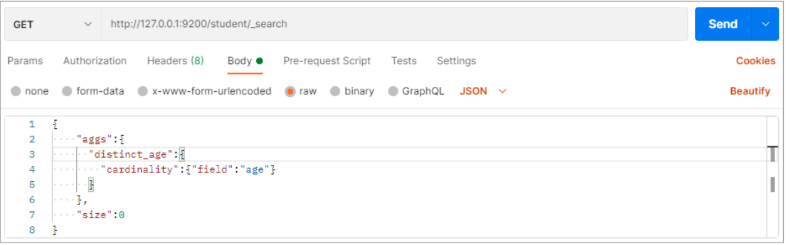

服务器响应结果：

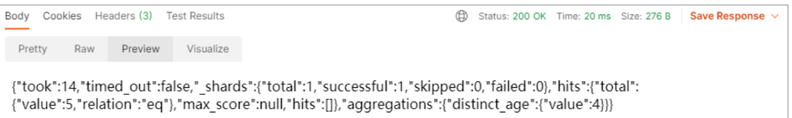

- State 聚合

stats 聚合，对某个字段一次性返回 count，max，min，avg 和 sum 五个指标

在 Postman 中，向 ES 服务器发 GET 请求 ：<http://127.0.0.1:9200/student/_search>

```json
{
    "aggs":{
        "stats_age":{
            "stats":{
                "field":"age"
            }
        }
    },
    "size":0
}
```

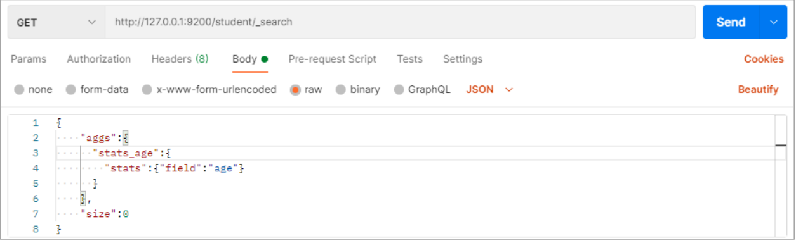

服务器响应结果：

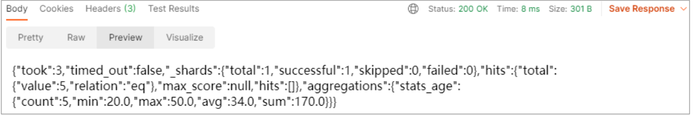

> （16）桶聚合查询

桶聚和相当于 sql 中的 group by 语句

- terms 聚合，分组统计

在 Postman 中，向 ES 服务器发 GET 请求 ：<http://127.0.0.1:9200/student/_search>

```json
{
    "aggs":{
        "age_groupby":{
            "terms":{
                "field":"age"
            }
        }
    },
    "size":0
}
```

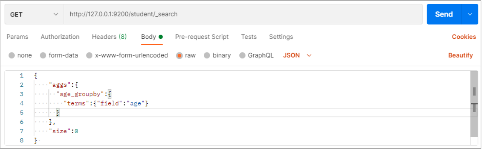

服务器响应结果：

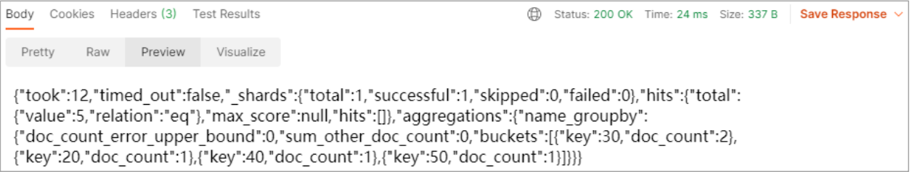

- 在 terms 分组下再进行聚合

在 Postman 中，向 ES 服务器发 GET 请求 ：<http://127.0.0.1:9200/student/_search>

```json
{
    "aggs":{
        "age_groupby":{
            "terms":{
                "field":"age"
            }
        }
    },
    "size":0
}
```

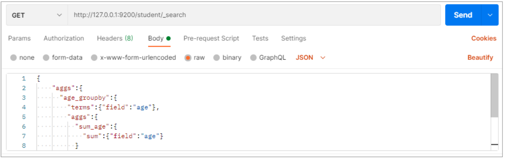

服务器响应结果：

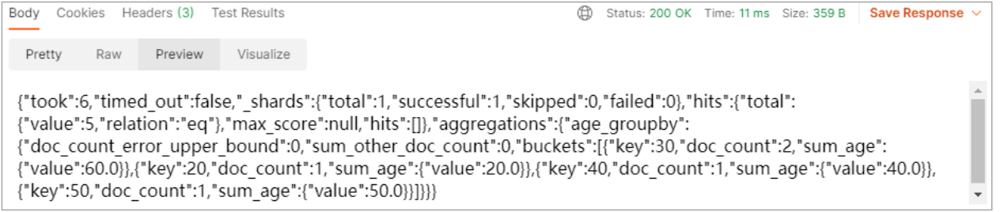

## 三、Java API操作

Elasticsearch 软件是由 Java 语言开发的，所以也可以通过 Java API 的方式对 Elasticsearch服务进行访问

### 3.1 创建Maven项目

我们在 IDEA 开发工具中创建 Maven 项目(模块也可)ES

改POM，添加maven依赖

```xml
<dependencies>
        <dependency>
            <groupId>org.elasticsearch</groupId>
            <artifactId>elasticsearch</artifactId>
            <version>7.8.0</version>
        </dependency>
        <!-- elasticsearch 的客户端 -->
        <dependency>
            <groupId>org.elasticsearch.client</groupId>
            <artifactId>elasticsearch-rest-high-level-client</artifactId>
            <version>7.8.0</version>
        </dependency>
        <!-- elasticsearch 依赖 2.x 的 log4j -->
        <dependency>
            <groupId>org.apache.logging.log4j</groupId>
            <artifactId>log4j-api</artifactId>
            <version>2.8.2</version>
        </dependency>
        <dependency>
            <groupId>org.apache.logging.log4j</groupId>
            <artifactId>log4j-core</artifactId>
            <version>2.8.2</version>
        </dependency>
        <dependency>
            <groupId>com.fasterxml.jackson.core</groupId>
            <artifactId>jackson-databind</artifactId>
            <version>2.9.9</version>
        </dependency>
        <!-- junit 单元测试 -->
        <dependency>
            <groupId>junit</groupId>
            <artifactId>junit</artifactId>
            <version>4.12</version>
        </dependency>
</dependencies>
```

### 3.2 客户端对象

创建 ESClient_Test 类，代码中创建Elasticsearch 客户端对象

 因为早期版本的客户端对象已经不再推荐使用，且在未来版本中会被删除，所以这里我们采用高级 REST 客户端对象


```java
public class ESClient_Test
{
    public static void main(String[] args) throws IOException
    {
        // 创建es客户端
        RestHighLevelClient esClient = new RestHighLevelClient(
                RestClient.builder(new HttpHost("localhost", 9200, "http")));

        // 关闭es客户端
        esClient.close();
    }
}
```

**注意：9200** 端口为Elasticsearch 的Web 通信端口**，**localhost 为启动ES 服务的主机名执行代码，查看控制台信息：

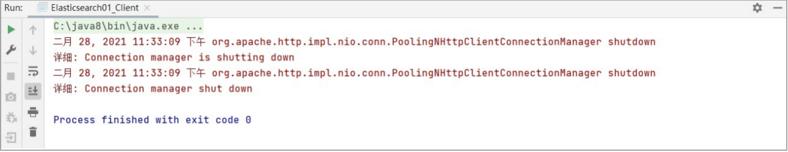

### 3.3 索引操作

#### 1.创建索引

```java
// 创建索引 - 请求对象
CreateIndexRequest request = new CreateIndexRequest("user");
// 发送请求，获取响应
CreateIndexResponse response = client.indices().create(request, RequestOptions.DEFAULT);
boolean acknowledged = response.isAcknowledged();
// 响应状态
System.out.println("操作状态 = " + acknowledged);
```

操作结果:

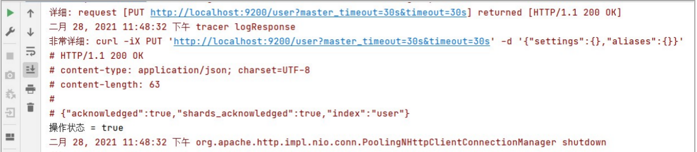

#### 2.查看索引

```java
// 查询索引 - 请求对象
GetIndexRequest request = new GetIndexRequest("user");
// 发送请求，获取响应
GetIndexResponse response = client.indices().get(request, RequestOptions.DEFAULT); 
System.out.println("aliases:"+response.getAliases()); 
System.out.println("mappings:"+response.getMappings()); 
System.out.println("settings:"+response.getSettings());
```

操作结果:

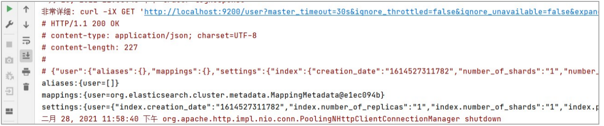

#### 3.删除索引

```java
// 删除索引 - 请求对象
DeleteIndexRequest request = new DeleteIndexRequest("user");
// 发送请求，获取响应
AcknowledgedResponse response = client.indices().delete(request, RequestOptions.DEFAULT);
// 操作结果
System.out.println("操作结果 ： " + response.isAcknowledged());
```

操作结果:


### 3.4 文档操作

#### 1.新增文档

创建数据模型

```java
public class User
{
    private String name;
    private String sex;
    private Integer age;

    public String getName()
    {
        return name;
    }

    public void setName(String name)
    {
        this.name = name;
    }

    public String getSex()
    {
        return sex;
    }

    public void setSex(String sex)
    {
        this.sex = sex;
    }

    public Integer getAge()
    {
        return age;
    }

    public void setAge(Integer age)
    {
        this.age = age;
    }
}
```

创建数据，添加到文档中

```java
// 新增文档 - 请求对象
IndexRequest request = new IndexRequest();
// 设置索引及唯一性标识
request.index("user").id("1001");
// 创建数据对象
User user = new User(); user.setName("zhangsan"); user.setAge(30); user.setSex("男");
ObjectMapper objectMapper = new ObjectMapper();
String productJson = objectMapper.writeValueAsString(user);
// 添加文档数据，数据格式为 JSON 格式
request.source(productJson,XContentType.JSON);
// 客户端发送请求，获取响应对象
IndexResponse response = client.index(request, RequestOptions.DEFAULT);
////3.打印结果信息
System.out.println("_index:" + response.getIndex()); 
System.out.println("_id:" + response.getId()); 
System.out.println("_result:" + response.getResult());
```

操作结果：

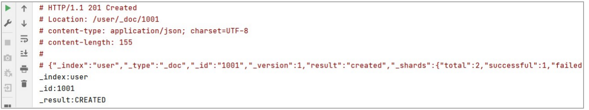

#### 2.修改索引

```java
// 修改文档 - 请求对象
UpdateRequest request = new UpdateRequest();
// 配置修改参数
request.index("user").id("1001");
// 设置请求体，对数据进行修改
request.doc(XContentType.JSON, "sex", "女");
// 客户端发送请求，获取响应对象
UpdateResponse response = client.update(request, RequestOptions.DEFAULT); 
System.out.println("_index:" + response.getIndex()); 
System.out.println("_id:" + response.getId()); 
System.out.println("_result:" + response.getResult());
```

执行结果：

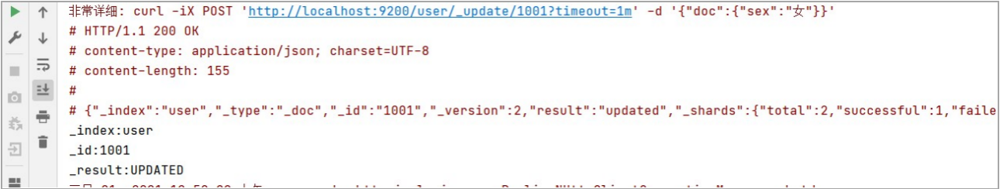

#### 3.查询文档

```java
//1.创建请求对象
GetRequest request = new GetRequest().index("user").id("1001");
//2.客户端发送请求，获取响应对象
GetResponse response = client.get(request, RequestOptions.DEFAULT);
////3.打印结果信息
System.out.println("_index:" + response.getIndex()); 
System.out.println("_type:" + response.getType()); 
System.out.println("_id:" + response.getId()); 
System.out.println("source:" + response.getSourceAsString());
```

执行结果：

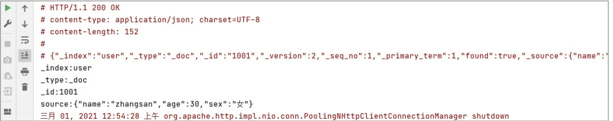

#### 4.删除文档

```java
//创建请求对象
DeleteRequest request = new DeleteRequest().index("user").id("1");
//客户端发送请求，获取响应对象
DeleteResponse response = client.delete(request, RequestOptions.DEFAULT);
//打印信息System.out.println(response.toString());
```

执行结果：

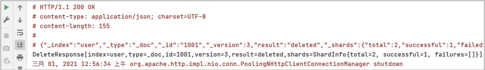

#### 5.批量操作

> 批量新增

```java
//创建批量新增请求对象
BulkRequest request = new BulkRequest(); 
request.add(new
IndexRequest().index("user").id("1001").source(XContentType.JSON, "name", "zhangsan"));
request.add(new IndexRequest().index("user").id("1002").source(XContentType.JSON, "name", "lisi"));
request.add(new IndexRequest().index("user").id("1003").source(XContentType.JSON, "name", "wangwu"));
//客户端发送请求，获取响应对象
BulkResponse responses = client.bulk(request, RequestOptions.DEFAULT);
//打印结果信息
System.out.println("took:" + responses.getTook()); 
System.out.println("items:" + responses.getItems());
```

执行结果：

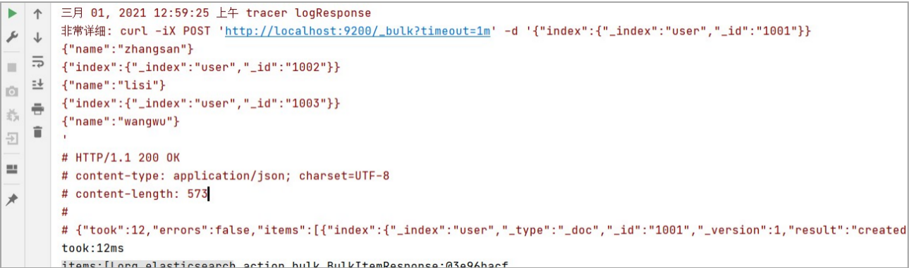

> 批量删除

```java
//创建批量删除请求对象
BulkRequest request = new BulkRequest();
request.add(new DeleteRequest().index("user").id("1001")); request.add(new DeleteRequest().index("user").id("1002")); request.add(new DeleteRequest().index("user").id("1003"));
//客户端发送请求，获取响应对象
BulkResponse responses = client.bulk(request, RequestOptions.DEFAULT);
//打印结果信息
System.out.println("took:" + responses.getTook()); System.out.println("items:" + responses.getItems());
```

执行结果：

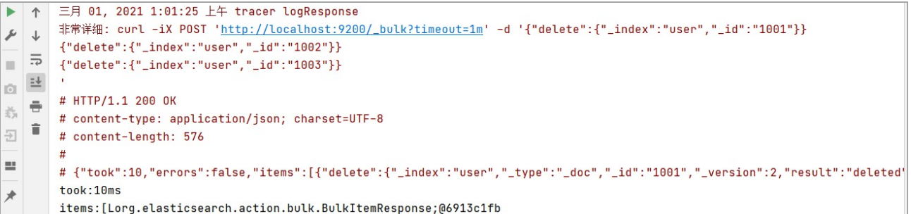

### 3.5 高级查询

> （1）请求体查询

- 查询所有索引数据

```java
// 创建搜索请求对象
SearchRequest request = new SearchRequest(); request.indices("student");

// 构建查询的请求体
SearchSourceBuilder sourceBuilder = new SearchSourceBuilder();
// 查询所有数据sourceBuilder.query(QueryBuilders.matchAllQuery()); request.source(sourceBuilder);

SearchResponse response = client.search(request, RequestOptions.DEFAULT);
// 查询匹配
SearchHits hits = response.getHits(); 
System.out.println("took:" + response.getTook()); 
System.out.println("timeout:" + response.isTimedOut()); 
System.out.println("total:" + hits.getTotalHits()); 
System.out.println("MaxScore:" + hits.getMaxScore()); 
System.out.println("hits========>>");
for (SearchHit hit : hits) {
//输出每条查询的结果信息System.out.println(hit.getSourceAsString());
}
System.out.println("<<========");
```

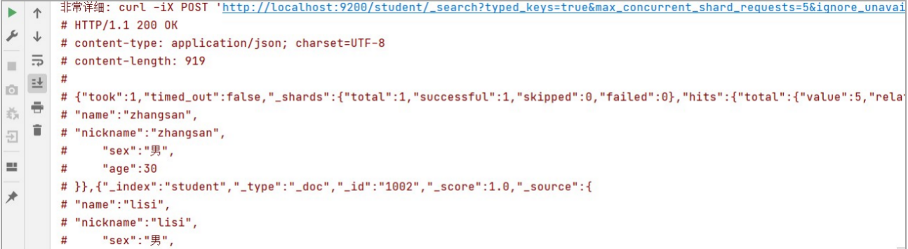

- term查询，查询条件为关键字

```java
// 创建搜索请求对象
SearchRequest request = new SearchRequest(); request.indices("student");

// 构建查询的请求体
SearchSourceBuilder sourceBuilder = new SearchSourceBuilder(); sourceBuilder.query(QueryBuilders.termQuery("age", "30")); request.source(sourceBuilder);

SearchResponse response = client.search(request, RequestOptions.DEFAULT);
// 查询匹配
SearchHits hits = response.getHits(); 
System.out.println("took:" + response.getTook()); 
System.out.println("timeout:" + response.isTimedOut()); 
System.out.println("total:" + hits.getTotalHits()); 
System.out.println("MaxScore:" + hits.getMaxScore()); 
System.out.println("hits========>>");
for (SearchHit hit : hits) {
//输出每条查询的结果信息System.out.println(hit.getSourceAsString());
}
System.out.println("<<========");
```

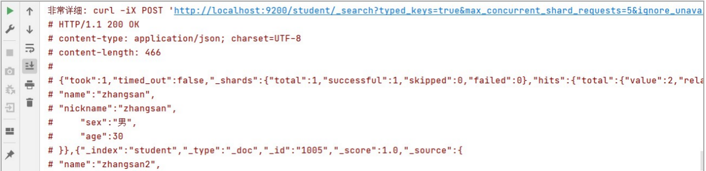

- 分页查询

```java
// 创建搜索请求对象
SearchRequest request = new SearchRequest(); request.indices("student");

// 构建查询的请求体
SearchSourceBuilder sourceBuilder = new SearchSourceBuilder(); sourceBuilder.query(QueryBuilders.matchAllQuery());

// 分页查询
// 当前页其实索引(第一条数据的顺序号)，from sourceBuilder.from(0);
// 每页显示多少条 size
sourceBuilder.size(2);

request.source(sourceBuilder);
SearchResponse response = client.search(request, RequestOptions.DEFAULT);
// 查询匹配
SearchHits hits = response.getHits(); 
System.out.println("took:" + response.getTook()); 
System.out.println("timeout:" + response.isTimedOut()); 
System.out.println("total:" + hits.getTotalHits()); 
System.out.println("MaxScore:" + hits.getMaxScore()); 
System.out.println("hits========>>");

for (SearchHit hit : hits) {
//输出每条查询的结果信息System.out.println(hit.getSourceAsString());
}
System.out.println("<<========");
```

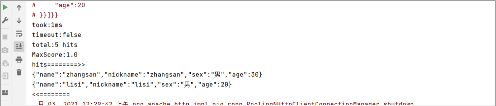

- 数据排序

```java
// 构建查询的请求体
SearchSourceBuilder sourceBuilder = new SearchSourceBuilder(); sourceBuilder.query(QueryBuilders.matchAllQuery());

// 排序
sourceBuilder.sort("age", SortOrder.ASC);

request.source(sourceBuilder);
SearchResponse response = client.search(request, RequestOptions.DEFAULT);
// 查询匹配
SearchHits hits = response.getHits();
System.out.println("took:" + response.getTook()); 
System.out.println("timeout:" + response.isTimedOut()); 
System.out.println("total:" + hits.getTotalHits()); 
System.out.println("MaxScore:" + hits.getMaxScore()); 
System.out.println("hits========>>");
for (SearchHit hit : hits) {
//输出每条查询的结果信息System.out.println(hit.getSourceAsString());
}
System.out.println("<<========");
```

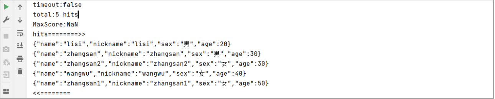

- 过滤字段

```java
// 创建搜索请求对象
SearchRequest request = new SearchRequest(); request.indices("student");

// 构建查询的请求体
SearchSourceBuilder sourceBuilder = new SearchSourceBuilder(); sourceBuilder.query(QueryBuilders.matchAllQuery());

//查询字段过滤
String[] excludes = {};
String[] includes = {"name", "age"}; 
sourceBuilder.fetchSource(includes, excludes);

request.source(sourceBuilder);
SearchResponse response = client.search(request, RequestOptions.DEFAULT);
// 查询匹配
SearchHits hits = response.getHits(); 
System.out.println("took:" + response.getTook()); 
System.out.println("timeout:" + response.isTimedOut()); 
System.out.println("total:" + hits.getTotalHits()); 
System.out.println("MaxScore:" + hits.getMaxScore()); 
System.out.println("hits========>>");
for (SearchHit hit : hits) {
//输出每条查询的结果信息System.out.println(hit.getSourceAsString());
}
System.out.println("<<========");
```

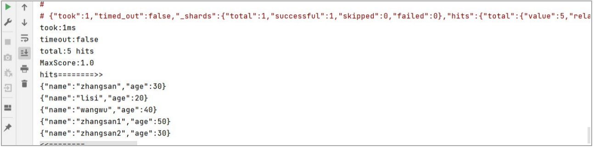

- Bool查询

```java
// 创建搜索请求对象
SearchRequest request = new SearchRequest();
request.indices("student");

// 构建查询的请求体
SearchSourceBuilder sourceBuilder = new SearchSourceBuilder();

BoolQueryBuilder boolQueryBuilder = QueryBuilders.boolQuery();
// 必须包含
boolQueryBuilder.must(QueryBuilders.matchQuery("age", "30"));
// 一定不含
boolQueryBuilder.mustNot(QueryBuilders.matchQuery("name", "zhangsan"));
// 可能包含
boolQueryBuilder.should(QueryBuilders.matchQuery("sex", "男"));

sourceBuilder.query(boolQueryBuilder); 
request.source(sourceBuilder);

SearchResponse response = client.search(request, RequestOptions.DEFAULT);
// 查询匹配
SearchHits hits = response.getHits(); 
System.out.println("took:" + response.getTook()); 
System.out.println("timeout:" + response.isTimedOut()); 
System.out.println("total:" + hits.getTotalHits()); 
System.out.println("MaxScore:" + hits.getMaxScore()); 
System.out.println("hits========>>");
for (SearchHit hit : hits) {
//输出每条查询的结果信息System.out.println(hit.getSourceAsString());
}
System.out.println("<<========");
```


- 范围查询

```java
// 创建搜索请求对象
SearchRequest request = new SearchRequest(); request.indices("student");

// 构建查询的请求体
SearchSourceBuilder sourceBuilder = new SearchSourceBuilder();

RangeQueryBuilder rangeQuery = QueryBuilders.rangeQuery("age");
// 大于等于
rangeQuery.gte("30");
// 小于等于
rangeQuery.lte("40");

sourceBuilder.query(rangeQuery);
request.source(sourceBuilder);
SearchResponse response = client.search(request, RequestOptions.DEFAULT);
// 查询匹配
SearchHits hits = response.getHits(); 
System.out.println("took:" + response.getTook()); 
System.out.println("timeout:" + response.isTimedOut()); 
System.out.println("total:" + hits.getTotalHits()); 
System.out.println("MaxScore:" + hits.getMaxScore()); 
System.out.println("hits========>>");

for (SearchHit hit : hits) {
//输出每条查询的结果信息System.out.println(hit.getSourceAsString());
}
System.out.println("<<========");
```

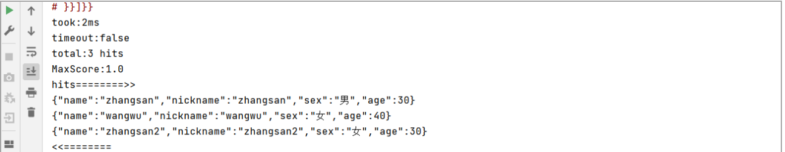

- 模糊查询

```java
// 创建搜索请求对象
SearchRequest request = new SearchRequest(); request.indices("student");

// 构建查询的请求体
SearchSourceBuilder sourceBuilder = new SearchSourceBuilder();

sourceBuilder.query(QueryBuilders.fuzzyQuery("name","zhangsan").fuzziness(Fu zziness.ONE));
request.source(sourceBuilder);
SearchResponse response = client.search(request, RequestOptions.DEFAULT);
// 查询匹配
SearchHits hits = response.getHits(); 
System.out.println("took:" + response.getTook()); 
System.out.println("timeout:" + response.isTimedOut()); 
System.out.println("total:" + hits.getTotalHits()); 
System.out.println("MaxScore:" + hits.getMaxScore()); 
System.out.println("hits========>>");
for (SearchHit hit : hits) {
//输出每条查询的结果信息System.out.println(hit.getSourceAsString());
}
System.out.println("<<========");
```

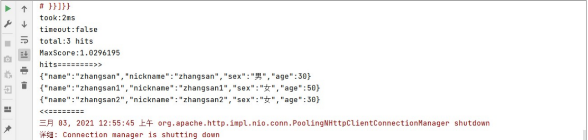

> （2）高亮查询

```java
// 高亮查询
SearchRequest request = new SearchRequest().indices("student");
//2.创建查询请求体构建器
SearchSourceBuilder sourceBuilder = new SearchSourceBuilder();
//构建查询方式：高亮查询TermsQueryBuilder termsQueryBuilder =
QueryBuilders.termsQuery("name","zhangsan");
//设置查询方式sourceBuilder.query(termsQueryBuilder);
//构建高亮字段
HighlightBuilder highlightBuilder = new HighlightBuilder(); highlightBuilder.preTags("<font color='red'>");//设置标签前缀highlightBuilder.postTags("</font>");//设置标签后缀highlightBuilder.field("name");//设置高亮字段
//设置高亮构建对象sourceBuilder.highlighter(highlightBuilder);
//设置请求体
request.source(sourceBuilder);
//3.客户端发送请求，获取响应对象
SearchResponse response = client.search(request, RequestOptions.DEFAULT);

//4.打印响应结果
SearchHits hits = response.getHits(); 
System.out.println("took::"+response.getTook()); 
System.out.println("time_out::"+response.isTimedOut()); 
System.out.println("total::"+hits.getTotalHits()); 
System.out.println("max_score::"+hits.getMaxScore()); 
System.out.println("hits::::>>");
for (SearchHit hit : hits) {
String sourceAsString = hit.getSourceAsString(); System.out.println(sourceAsString);
//打印高亮结果
Map<String, HighlightField> highlightFields = hit.getHighlightFields(); System.out.println(highlightFields);
}
System.out.println("<<::::");
```

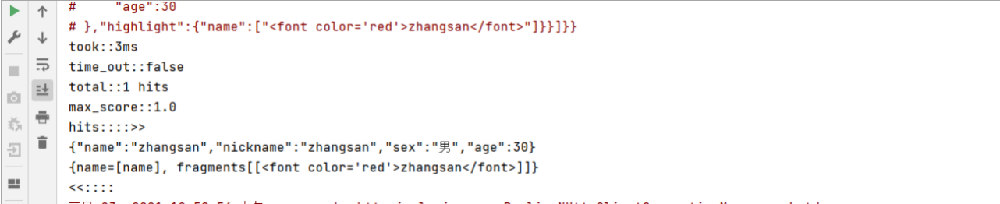

> （3）聚合查询

- 最大年龄

```java
// 高亮查询
SearchRequest request = new SearchRequest().indices("student");

SearchSourceBuilder sourceBuilder = new SearchSourceBuilder(); sourceBuilder.aggregation(AggregationBuilders.max("maxAge").field("age"));
//设置请求体
request.source(sourceBuilder);
//3.客户端发送请求，获取响应对象
SearchResponse response = client.search(request, RequestOptions.DEFAULT);

//4.打印响应结果
SearchHits hits = response.getHits(); System.out.println(response);
```

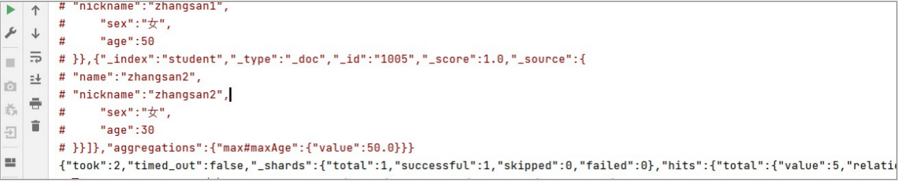

- 分组统计

```java
// 高亮查询
SearchRequest request = new SearchRequest().indices("student");

SearchSourceBuilder sourceBuilder = new SearchSourceBuilder(); sourceBuilder.aggregation(AggregationBuilders.terms("age_groupby").field("ag e"));

//设置请求体request.source(sourceBuilder);
//3.客户端发送请求，获取响应对象
SearchResponse response = client.search(request, RequestOptions.DEFAULT);

//4.打印响应结果
SearchHits hits = response.getHits(); System.out.println(response);
```

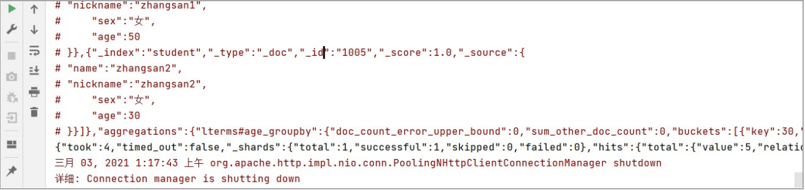
