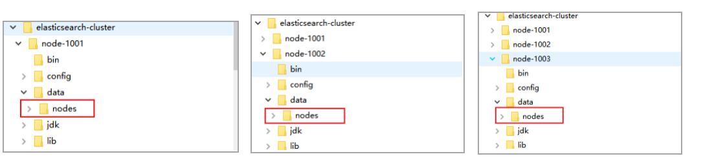
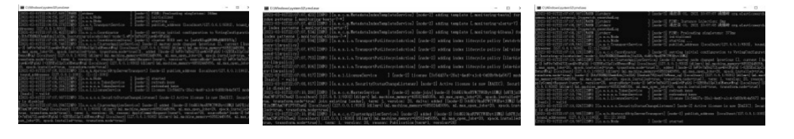
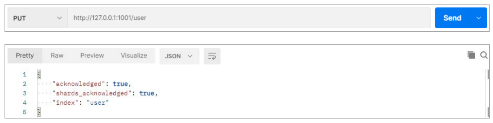
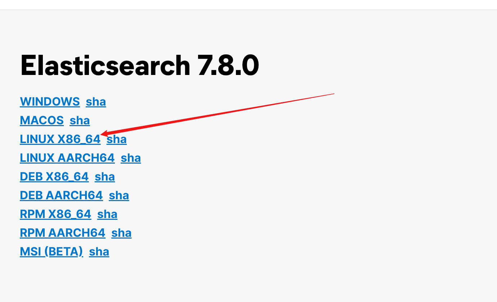
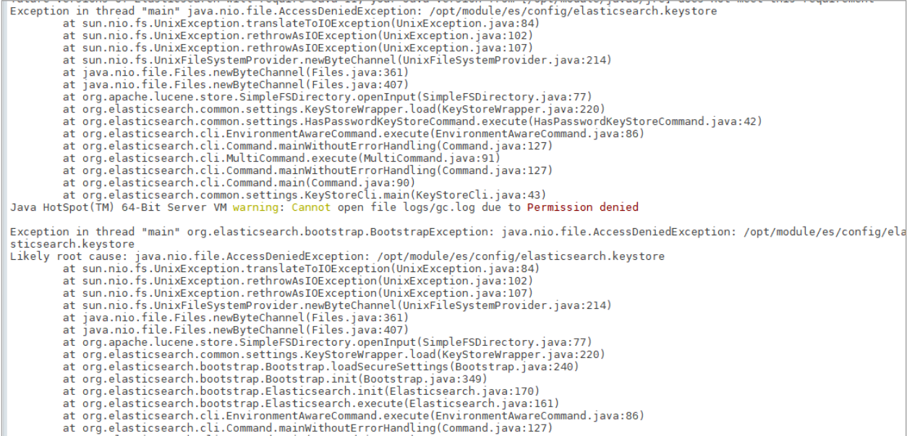
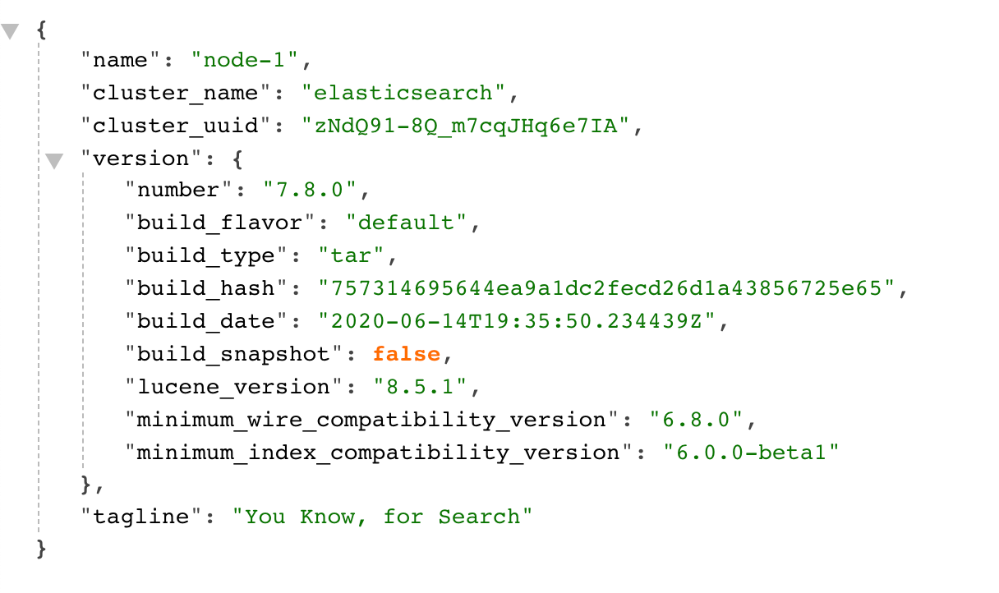

---
# 当前页面内容标题
title: 三、Elasticsearch环境
# 分类
category:
  - ELK
# 标签
tag: 
  - ELK
  - 分布式搜索引擎
sticky: false
# 是否收藏在博客主题的文章列表中，当填入数字时，数字越大，排名越靠前。
star: false
# 是否将该文章添加至文章列表中
article: true
# 是否将该文章添加至时间线中
timeline: true
---

## 一、相关概念

### 单机&集群

单台Elasticsearch 服务器提供服务，往往都有最大的负载能力，超过这个阈值，服务器性能就会大大降低甚至不可用，所以生产环境中，一般都是运行在指定服务器集群中。

除了负载能力，单点服务器也存在其他问题：

- 单台机器存储容量有限

- 单服务器容易出现单点故障，无法实现高可用

- 单服务的并发处理能力有限

配置服务器集群时，集群中节点数量没有限制，大于等于 2 个节点就可以看做是集群了。一般出于高性能及高可用方面来考虑集群中节点数量都是 3 个以上。

### 集群Cluster

一个集群就是由一个或多个服务器节点组织在一起，共同持有整个的数据，并一起提供索引和搜索功能。一个 Elasticsearch 集群有一个唯一的名字标识，这个名字默认就是”elasticsearch”。这个名字是重要的，因为一个节点只能通过指定某个集群的名字，来加入这个集群。

### 节点Node

集群中包含很多服务器，一个节点就是其中的一个服务器。作为集群的一部分，它存储数据，参与集群的索引和搜索功能。

一个节点也是由一个名字来标识的，默认情况下，这个名字是一个随机的漫威漫画角色的名字，这个名字会在启动的时候赋予节点。这个名字对于管理工作来说挺重要的，因为在这个管理过程中，你会去确定网络中的哪些服务器对应于 Elasticsearch 集群中的哪些节点。

一个节点可以通过配置集群名称的方式来加入一个指定的集群。默认情况下，每个节点都会被安排加入到一个叫做“elasticsearch”的集群中，这意味着，如果你在你的网络中启动了若干个节点，并假定它们能够相互发现彼此，它们将会自动地形成并加入到一个叫做“elasticsearch”的集群中。

在一个集群里，只要你想，可以拥有任意多个节点。而且，如果当前你的网络中没有运行任何 Elasticsearch 节点，这时启动一个节点，会默认创建并加入一个叫做“elasticsearch”的集群。

## 二、Windows集群

### 部署集群

1.创建elasticsearch-cluster文件夹，在内部复制三个elasticsearch服务


2.修改集群文件目录中每个节点的config/elasticsearch.yml配置文件

node-1001节点

```yml
#节点 1 的配置信息：
#集群名称，节点之间要保持一致cluster.name: my-elasticsearch # 节 点 名 称 ， 集 群 内 要 唯 一 node.name: node-1001 node.master: true
node.data: true

#ip 地址
network.host: localhost #http 端口
http.port: 1001 #tcp 监听端口
transport.tcp.port: 9301

#discovery.seed_hosts: ["localhost:9301", "localhost:9302","localhost:9303"] #discovery.zen.fd.ping_timeout: 1m
#discovery.zen.fd.ping_retries: 5

# 集 群 内 的 可 以 被 选 为 主 节 点 的 节 点 列 表 #cluster.initial_master_nodes: ["node-1", "node-2","node-3"]

#跨域配置#action.destructive_requires_name: true http.cors.enabled: true http.cors.allow-origin: "*"
```

node-1002节点

```yml
#节点 2 的配置信息：
#集群名称，节点之间要保持一致cluster.name: my-elasticsearch # 节 点 名 称 ， 集 群 内 要 唯 一node.name: node-1002 node.master: true
node.data: true

#ip 地址
network.host: localhost #http 端口
http.port: 1002 #tcp 监听端口
transport.tcp.port: 9302

discovery.seed_hosts: ["localhost:9301"] discovery.zen.fd.ping_timeout: 1m discovery.zen.fd.ping_retries: 5

# 集 群 内 的 可 以 被 选 为 主 节 点 的 节 点 列 表#cluster.initial_master_nodes: ["node-1", "node-2","node-3"]

#跨域配置#action.destructive_requires_name: true http.cors.enabled: true http.cors.allow-origin: "*"
```

node-1003节点

```yml
#节点 3 的配置信息：
#集群名称，节点之间要保持一致cluster.name: my-elasticsearch # 节 点 名 称 ， 集 群 内 要 唯 一 node.name: node-1003 node.master: true
node.data: true

#ip 地址
network.host: localhost #http 端口
http.port: 1003 #tcp 监听端口
transport.tcp.port: 9303
#候选主节点的地址，在开启服务后可以被选为主节点discovery.seed_hosts: ["localhost:9301", "localhost:9302"] discovery.zen.fd.ping_timeout: 1m discovery.zen.fd.ping_retries: 5

# 集 群 内 的 可 以 被 选 为 主 节 点 的 节 点 列 表 #cluster.initial_master_nodes: ["node-1", "node-2","node-3"]

#跨域配置#action.destructive_requires_name: true http.cors.enabled: true http.cors.allow-origin: "*"
```

### 启动集群

1.启动前先删除每个节点的data目录中所在内容（如果存在）



2.分别双击执行 bin/elasticsearch.bat，启动节点服务器，启动后，会自动加入指定名称的集群



### 测试集群

查看集群状态

- node-1001节点


- node-1002节点


- node-1003节点


向集群中的node-1001 节点增加索引



向集群中的node-1002 节点查询索引


## 三、Linux单机

### 软件下载

[Elasticsearch下载地址7.8.0](https://www.elastic.co/cn/downloads/past-releases/elasticsearch-7-8-0)



### 软件安装

1.下载解压软件

将下载的软件解压缩

```shell
wget https://artifacts.elastic.co/downloads/elasticsearch/elasticsearch-7.8.0-linux-x86_64.tar.gz
# 解压缩
tar -zxvf elasticsearch-7.8.0-linux-x86_64.tar.gz -C /opt/module # 改名
mv elasticsearch-7.8.0 es
```

2.创建用户

因为安全问题，Elasticsearch 不允许 root 用户直接运行，所以要创建新用户，在 root 用户中创建新用户

```shell
useradd es #新增 es 用户
passwd es #为 es 用户设置密码
userdel -r es #如果错了，可以删除再加
chown -R es:es /opt/module/es #文件夹所有者
```

3.修改配置文件

修改/opt/module/es/config/elasticsearch.yml 文件

```sh
vim /opt/module/es/config/elasticsearch.yml

# 加入如下配置
cluster.name: elasticsearch
node.name: node-1
network.host: 0.0.0.0
http.port: 9200
cluster.initial_master_nodes: ["node-1"]
```

修改/etc/security/limits.conf

```sh
vim /etc/security/limits.conf 

# 在文件末尾中增加下面内容
# 每个进程可以打开的文件数的限制
es soft nofile 65536
es hard nofile 65536
```

修改/etc/security/limits.d/20-nproc.conf

```sh
vim /etc/security/limits.d/20-nproc.conf

# 在文件末尾中增加下面内容
# 每个进程可以打开的文件数的限制
es soft nofile 65536
es hard nofile 65536
# 操作系统级别对每个用户创建的进程数的限制
* hard nproc 4096
# 注：* 带表 Linux 所有用户名称
```

修改/etc/sysctl.conf

```sh
vim /etc/sysctl.conf

# 在文件中增加下面内容
# 一个进程可以拥有的 VMA(虚拟内存区域)的数量,默认值为 65536
vm.max_map_count=655360
```

重新加载

```shell
sysctl -p
```

> 报错的一些解决方案：
>
> [(85条消息) ElasticSerach 出现 high disk watermark [90%\] exceeded on_weixiao_920的博客-CSDN博客](https://blog.csdn.net/weixiao_920/article/details/103221995?spm=1001.2101.3001.6650.1&utm_medium=distribute.pc_relevant.none-task-blog-2~default~CTRLIST~Rate-1-103221995-blog-115968267.235^v38^pc_relevant_sort&depth_1-utm_source=distribute.pc_relevant.none-task-blog-2~default~CTRLIST~Rate-1-103221995-blog-115968267.235^v38^pc_relevant_sort&utm_relevant_index=2)
>
> [(85条消息) es安装报错：[1\]: max number of threads [3796] for user [es] is too low, increase to at least [4096]_qq_44872331的博客-CSDN博客](https://blog.csdn.net/qq_44872331/article/details/127192642)

### 启动软件

使用 ES 用户启动

```sh
cd /opt/module/es/
#启动
bin/elasticsearch
#后台启动
bin/elasticsearch -d
```

启动时，会动态生成文件，如果文件所属用户不匹配，会发生错误，需要重新进行修改用户和用户组



关闭防火墙

```sh
#暂时关闭防火墙
systemctl stop firewalld
#永久关闭防火墙
systemctl enable firewalld.service #打开放货抢永久性生效，重启后不会复原
systemctl disable firewalld.service #关闭防火墙，永久性生效，重启后不会复原
```

### 测试软件

> 格式：<http://你的IP地址:9200/>

浏览器输入地址：<http://172.16.102.100:9200/>



## 四、Linux集群

### 软件下载

[Elasticsearch下载地址7.8.0](https://www.elastic.co/cn/downloads/past-releases/elasticsearch-7-8-0)


### 软件安装

1.解压软件

将下载的软件解压缩

```sh
# 解压缩
tar -zxvf elasticsearch-7.8.0-linux-x86_64.tar.gz -C /opt/module
# 改名
mv elasticsearch-7.8.0 es-cluster
```

将软件分发到其他节点：linux2, linux3

2.创建用户

因为安全问题，Elasticsearch 不允许 root 用户直接运行，所以要在每个节点中创建新用户，在 root 用户中创建新用户

```sh
useradd es #新增 es 用户
passwd es #为 es 用户设置密码
userdel -r es #如果错了，可以删除再加
chown -R es:es /opt/module/es-cluster #文件夹所有者
```

3.配置文件

修改/opt/module/es/config/elasticsearch.yml 文件，分发文件

```sh
vim /opt/module/es/config/elasticsearch.yml
```

```sh
# 加入如下配置
#集群名称
cluster.name: cluster-es
#节点名称，每个节点的名称不能重复
node.name: node-1
#ip 地址，每个节点的地址不能重复
network.host: linux1
#是不是有资格主节点
node.master: true
node.data: true
http.port: 9200
# head 插件需要这打开这两个配置
http.cors.allow-origin: "*"
http.cors.enabled: true
http.max_content_length: 200mb
#es7.x 之后新增的配置，初始化一个新的集群时需要此配置来选举 master
cluster.initial_master_nodes: ["node-1"]
#es7.x 之后新增的配置，节点发现
discovery.seed_hosts: ["linux1:9300","linux2:9300","linux3:9300"]
gateway.recover_after_nodes: 2
network.tcp.keep_alive: true
network.tcp.no_delay: true
transport.tcp.compress: true
#集群内同时启动的数据任务个数，默认是 2 个
cluster.routing.allocation.cluster_concurrent_rebalance: 16
#添加或删除节点及负载均衡时并发恢复的线程个数，默认 4 个
cluster.routing.allocation.node_concurrent_recoveries: 16
#初始化数据恢复时，并发恢复线程的个数，默认 4 个
cluster.routing.allocation.node_initial_primaries_recoveries: 16

# 用来解决磁盘空间使用率过多，无法分配副本的问题！
cluster.routing.allocation.disk.threshold_enabled: false
```

修改/etc/security/limits.conf ，分发文件

```sh
vim /etc/security/limits.conf
```

```sh
# 在文件末尾中增加下面内容
es soft nofile 65536
es hard nofile 65536
```

修改/etc/security/limits.d/20-nproc.conf，分发文件

```sh
vim /etc/security/limits.d/20-nproc.conf
```

```sh
# 在文件末尾中增加下面内容
es soft nofile 65536
es hard nofile 65536
* hard nproc 4096
# 注：* 带表 Linux 所有用户名称
```

修改/etc/sysctl.conf

```sh
vim /etc/sysctl.conf
```

```sh
# 在文件中增加下面内容
vm.max_map_count=655360
```

重新加载

```sh
sysctl -p
```

> 在启动之前的一个很重要的注意点：
>
> - 如果你搭建过windows集群或者mac上试过集群的搭配就会知道一个问题，除了上述的配置外还需要将`data`目录下的node文件删除！
> - 否则，你会看到一个那就是集群都各自跑起来了，但是无法再主节点master上面查看其他节点的信息！

### 启动软件

分别在不同节点上启动 ES 软件

```sh
cd /opt/module/es-cluster
#启动
bin/elasticsearch
#后台启动
bin/elasticsearch -d
```

### 测试集群

测试地址：<http://172.16.102.100:9200/_cat/nodes>


> 参考文章：
>
> [Linux集群搭建](https://juejin.cn/post/7148596969244459022#heading-15)
>
> [Elasticsearch学习笔记](https://blog.csdn.net/u011863024/article/details/115721328)
>
>
