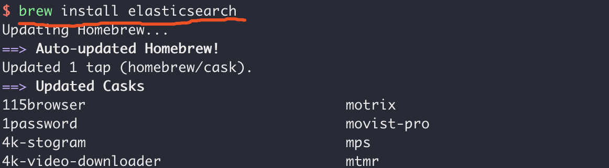
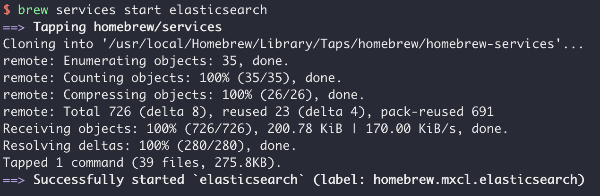
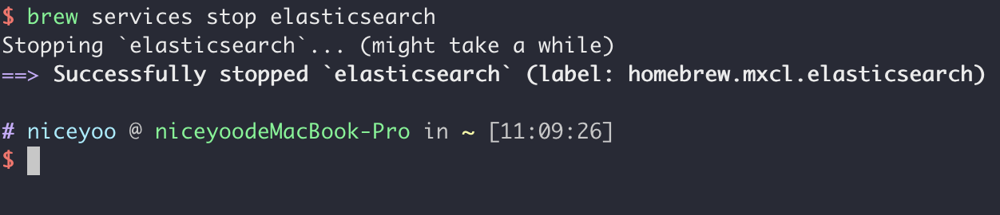
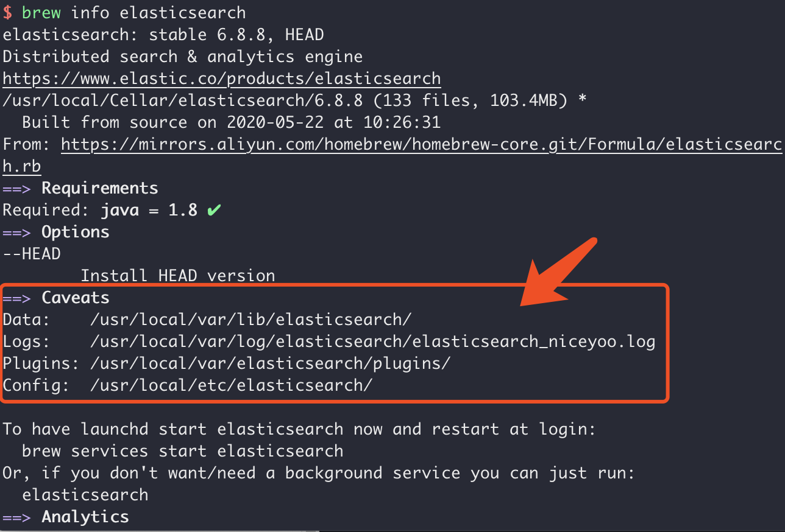
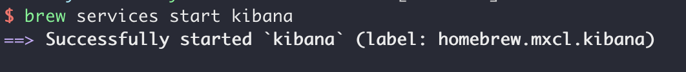
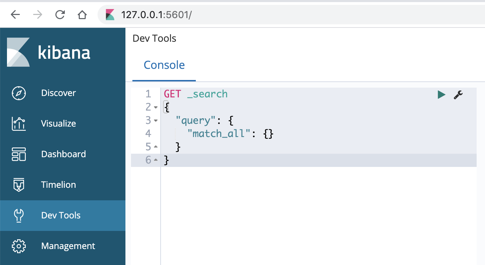
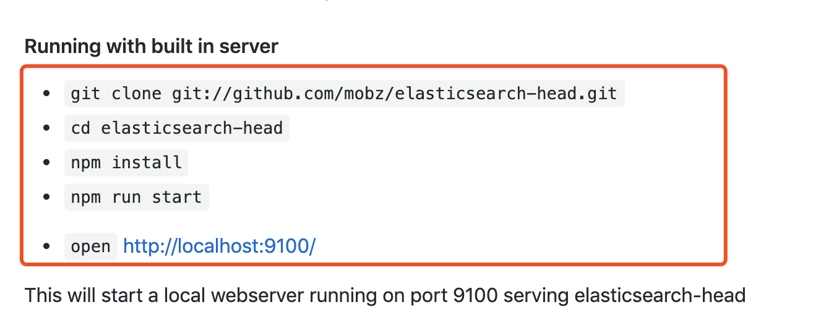
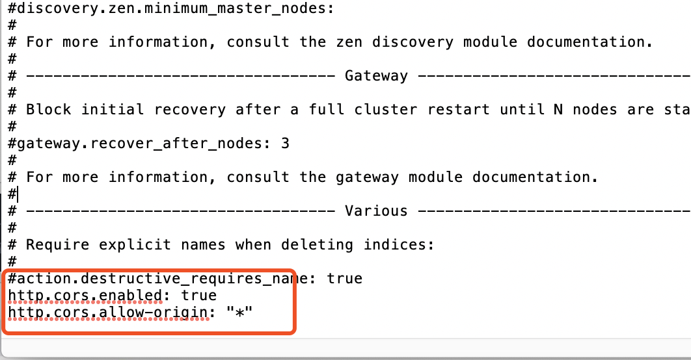
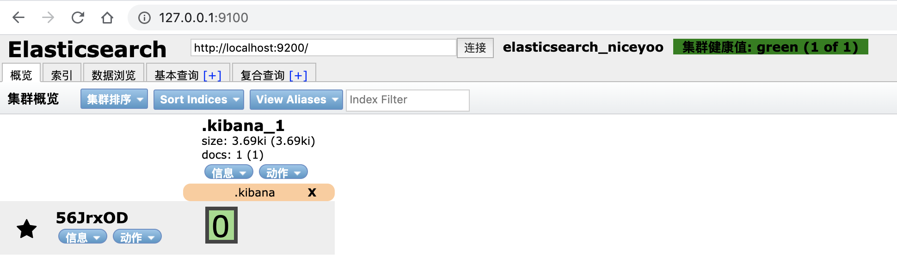
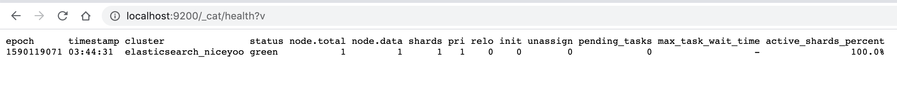

---
# 当前页面内容标题
title: MacOS中Elasticsearch的安装「借助Homebrew」
# 分类
category:
  - ELK
# 标签
tag: 
  - ELK
  - 分布式搜索引擎
sticky: false
# 是否收藏在博客主题的文章列表中，当填入数字时，数字越大，排名越靠前。
star: false
# 是否将该文章添加至文章列表中
article: true
# 是否将该文章添加至时间线中
timeline: true
---

## **1、Homebrew**

如果你已经安装过Homebrew了，那么你可以跳过这一步，直接进行Elasticsearch安装步骤；

Homebrew是一款MacOS平台下的软件包管理工具，拥有安装、卸载、更新、查看、搜索等很多实用的功能，强烈推荐安装。

请复制如下指令到命令行粘贴执行：

```sql
/usr/bin/ruby -e "$(curl -fsSL https://raw.githubusercontent.com/Homebrew/install/master/install)”
```

## **2、Elasticsearch安装**

执行命令：`brew install elasticsearch`



接下来就是漫长的等待时间了「[brew换源](https://www.baidu.com/s?ie=utf-8&f=3&rsv_bp=1&tn=02003390_43_hao_pg&wd=brew换源&oq=%E9%98%BF%E9%87%8C%E4%BA%91maven%E9%95%9C%E5%83%8F%E4%BB%93%E5%BA%93%E9%85%8D%E7%BD%AE&rsv_pq=eeef5052002b34fd&rsv_t=200bQA8JFEysxgnhigvfHN0qLaD%2B6YQNgSS%2F5ngmXxuiCIr9wZgp8zJvkI79lISrOFvRQ2QaFRPy&rqlang=cn&rsv_enter=1&rsv_dl=ts_0&rsv_btype=t&inputT=6026&rsv_sug3=31&rsv_sug1=10&rsv_sug7=100&rsv_sug2=0&prefixsug=brewhuan&rsp=0&rsv_sug4=6026)」

**浏览器输入**：[127.0.0.1:9200](http://127.0.0.1:9200/) **查看**


### 安装后的路径「可通过 brew info elasticsearch 查看 」

```shell
elasticsearch:  /usr/local/Cellar/elasticsearch/5.5.0
Data:    /usr/local/var/elasticsearch/elasticsearch_xuchen/
Logs:    /usr/local/var/log/elasticsearch/elasticsearch_xuchen.log
Plugins: /usr/local/opt/elasticsearch/libexec/plugins/
Config:  /usr/local/etc/elasticsearch/
plugin script: /usr/local/opt/elasticsearch/libexec/bin/elasticsearch-plugin
```

### 安装报错的日记记录

一开始通过brew安装：brew install elasticsearch

提示报错：

```shell
elasticsearch has been disabled because it is switching to an incompatible license. Check out `opensearch` instead!
```

跑到官网查看内容：

> 附官网地址：<https://www.elastic.co/guide/en/elasticsearch/reference/7.17/brew.html>

首先需要点击 Elastic Homebrew 存储库

```bash
brew tap elastic/tap

brew install elastic/tap/elasticsearch-full
```

> 这种下载方式（注意）：这里启动elasticsearch只能通过以下方式启动：
>
> - elasticsearch
> - elasticsearch-full

## **3、Elasticsearch相关指令**

### 3.1 运行

使用命令：`brew services start elasticsearch`

or 直接在控制台使用：`elasticsearch`



### 3.2 关闭

使用命令：`brew services stop elasticsearch`



> 凡是用`start`开启，就可以替换为`stop`尝试关闭，依次类推：`restart`重启

### 3.3 查看安装信息

使用命令：`brew info elasticsearch`



## **4、安装Kibana**

**Kibana** 是一个基于 **Node.js** 的 **Elasticsearch** 索引库数据统计工具，可以利用 **Elasticsearch** 的聚合功能，生成各种图表，如柱形图，线状图，饼图等。

**Kibana** 还提供了操作 **Elasticsearch** 索引数据的控制台，并且提供了一定的**API**提示，非常有利于我们学习 **Elasticsearch** 的语法。

安装指令：`brew install kibana`


启动指令：`brew services start kibana`



**浏览器输入**：`127.0.0.1:5601` 访问 kibana



## **5、安装elasticsearch-head插件**

**elasticsearch-head** 是用于监控 **Elasticsearch** 状态的客户端插件，包括数据可视化、执行增删改查操作等。**elasticsearch-head** 插件的安装在 **Linux** 和 **Windows** 没什么区别，安装之前确保当前系统已经安装 **nodejs** 即可。

**github地址**：<https://github.com/mobz/elasticsearch-head>



**浏览器访问**：<http://127.0.0.1:9100>


此时你会发现怎么都连不上 **es 9200**，因为我们需要修改**es**的配置文件允许**head**插件访问才可以。

**进入目录**：`cd /usr/local/etc/elasticsearch/`

**修改yml文件**：`open -e elasticsearch.yml`



**参数如下：**加入跨域访问

```bash
http.cors.enabled: true                # elasticsearch中启用CORS
http.cors.allow-origin: "*"         # 允许访问的IP地址段，* 为所有IP都
```

**重启elasticsearch：**`brew services restart elasticsearch`



## **6、查看集群健康状态**

**浏览器输入网址：**`http://127.0.0.1:9200/_cat/health?v`



> 注意看`status`字段,他有三个值含义分别如下

- green:一切都很好（集群功能齐全）
- yellow:所有数据都可用，但尚未分配一些副本（群集功能齐全）
- Red:某些数据由于某种原因不可用（群集部分功能）
