---
# 当前页面内容标题
title: 二.Elasticsearch安装&使用
# 分类
category:
  - ELK
# 标签
tag:
  - ELK
  - 分布式搜索引擎
sticky: false
# 是否收藏在博客主题的文章列表中，当填入数字时，数字越大，排名越靠前。
star: false
# 是否将该文章添加至文章列表中
article: true
# 是否将该文章添加至时间线中
timeline: true
---

## 一、Java 17下载

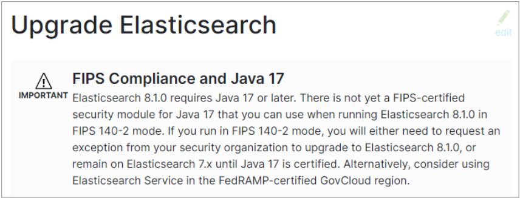

从官网截图上可以看到，Elasticsearch最新版本也终于开始拥抱号称史上最快的JDK了。所以在安装 ES 软件前，需要下载使用 Java JDK17

### 下载软件

Java 的官方地址：<https://www.oracle.com/java>

Java 最新的版本是 18.0.1.1（截止 2022.6.15），我们选择 17.0.3 版本

下载地址：<https://www.oracle.com/java/technologies/downloads>

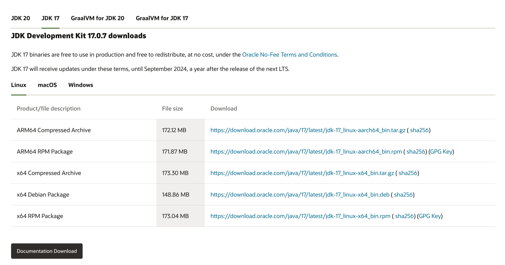

### 软件升级

对于 Java 开发人员来讲，更熟悉的开发版本应该是 JDK1.8，突然需要升级到 JDK17，其实本身会感觉有点不适应，甚至会有点排斥。担心升级后会对现有的程序代码造成影响。其实，对于 JDK1.8，最新版本的 JDK17 增加了很多的语法特性:

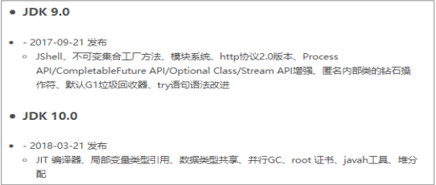

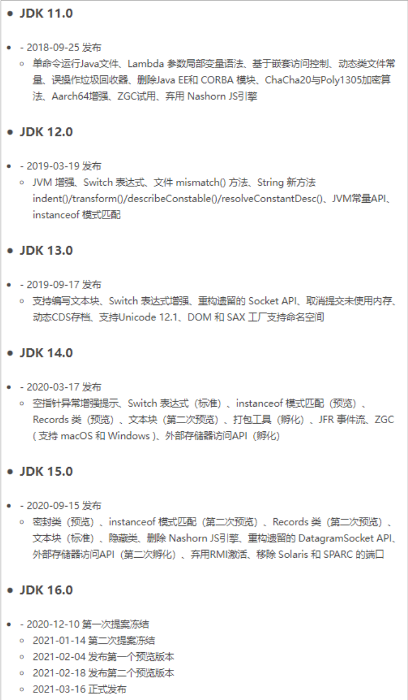

> JDK新特性一览

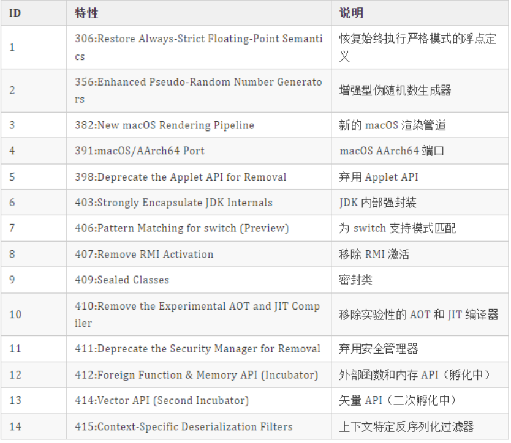

对于大多数项目而言，想要利用这些新的特性，是需要修改代码的，但性能除外。也就是说，升级 JDK 版本，现有代码即使不进行修改，也不会出现兼容问题，但性能会得到极大的提升，并且高吞吐量垃圾回收器比低延迟垃圾回收器更快，更重要的是它可以免费商用。

对于升级版本而言，如果你依然有顾虑，一个好的消息就是我们可以下载含有适配 JDK的 ES 版本，上面提到的内容基本上就不用考虑，一切就是这么顺滑，对吗？

## 二、Elasticsearch安装&使用

### 下载软件

Elasticsearch 的官方地址：<https://www.elastic.co/cn/>

Elasticsearch 最新的版本是 8.2.3（截止 2022.06.15），我们选择略早的 8.1.0 版本

下载地址：<https://www.elastic.co/cn/downloads/past-releases#elasticsearch>

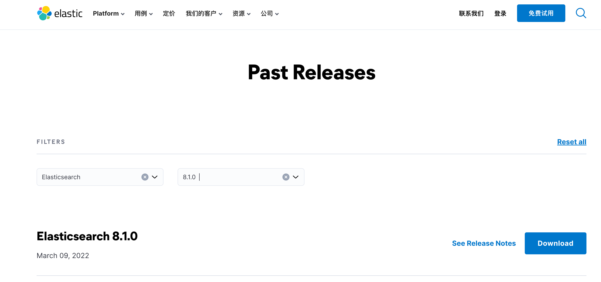

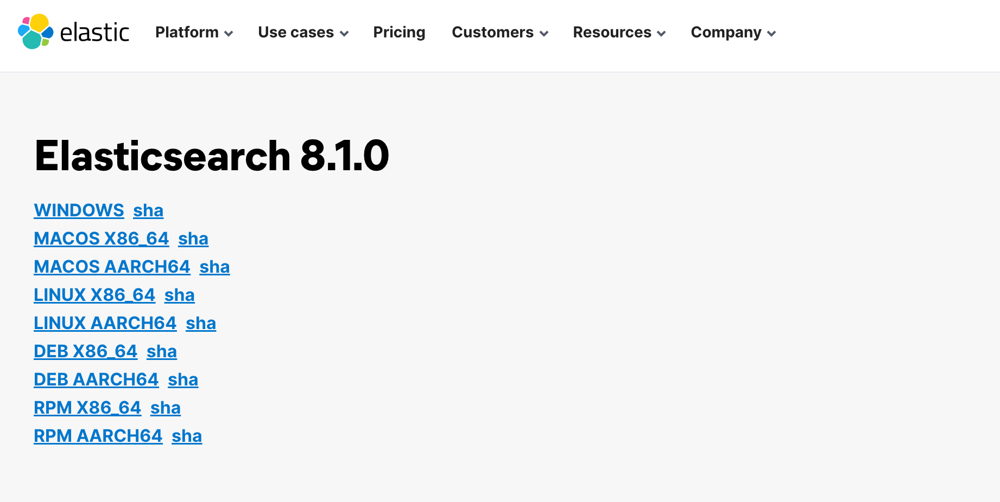

### 安装软件

本课程着重讲解新版 ES 软件的特性及应用，所以采用 linux 集群配置。

1) 集群规划

为了演示软件的使用，我们这里准备三台 linux 虚拟机，用于配置 Elasticsearch 集群。

启动集群后，每台虚拟机的进程如下：

| 主机名 | linux1                   | linux2                   | linux3                   |
| ------ | ------------------------ | ------------------------ | ------------------------ |
| 进程名 | Elasticsearch(es-node-1) | Elasticsearch(es-node-2) | Elasticsearch(es-node-3) |

Linux 系统环境配置请参考之前课程内容。这里我们给三台虚拟机搭建 ES 集群，集群中-节点名称依次为 es-node-1，es-node-2，es-node-3

2) 将压缩包 elasticsearch-8.1.0-linux-x86_64.tar.gz 上传到虚拟机中

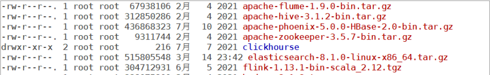

解压缩文件到自定义路径，笔者解压路径为：/opt/module,解压后，软件路径为：

```sh
/opt/module/elasticsearch-8.1.0
```

```sh
# 切换目录
cd software
# 解压缩
tar -zxvf elasticsearch-8.1.0-linux-x86_64.tar.gz -C /opt/module
```

解压后的 Elasticsearch 的目录结构如下

```sh
[root@localhost elasticsearch-8.1.0]# ll
总用量 860
drwxr-xr-x  2 root root   4096 3月   3 2022 bin
drwxr-xr-x  3 root root    210 6月  22 17:35 config
drwxr-xr-x  9 root root    121 3月   3 2022 jdk
drwxr-xr-x  3 root root   4096 3月   3 2022 lib
-rw-r--r--  1 root root   3860 3月   3 2022 LICENSE.txt
drwxr-xr-x  2 root root      6 3月   3 2022 logs
drwxr-xr-x 66 root root   4096 3月   3 2022 modules
-rw-r--r--  1 root root 858797 3月   3 2022 NOTICE.txt
drwxr-xr-x  2 root root      6 3月   3 2022 plugins
-rw-r--r--  1 root root   2710 3月   3 2022 README.asciidoc
```

| 目录    | 含义           |
| ------- | -------------- |
| bin     | 可执行脚本目录 |
| config  | 配置目录       |
| jdk     | 内置JDK目录    |
| lib     | 类库           |
| logs    | 日志目录       |
| modules | 模块目录       |
| plugins | 插件目录       |

3) 当前安装 ES 版本为 8.1.0，自带 JDK，所以当前 Linux 虚拟机节点无需配置 Java 环境    /opt/elasticsearch/elasticsearch-8.1.0

4) 创建 linux 新用户 es, 数据文件，证书目录, 并修改 Elasticsearch 文件拥有者

```sh
# 新增 es 用户
useradd es
# 为 es 用户设置密码
passwd es
# 创建数据文件目录
mkdir /opt/module/elasticsearch-8.1.0/data
# 创建证书目录
mkdir /opt/module/elasticsearch-8.1.0/config/certs
#切换目录
cd /opt/module/elasticsearch-8.1.0
# 修改文件拥有者--注意点（有时候发现配置文件报错执行一次！）
chown -R es:es /opt/module/elasticsearch-8.1.0
```

5) 在第一台服务器节点 es-node-1 设置集群多节点通信密钥

```sh
# 切换用户
su es

# 签发 ca 证书，过程中需按两次回车键
bin/elasticsearch-certutil ca

# 用 ca 证书签发节点证书，过程中需按三次回车键
bin/elasticsearch-certutil cert --ca elastic-stack-ca.p12

# 将生成的证书文件移动到 config/certs 目录中
mv elastic-stack-ca.p12 elastic-certificates.p12 config/certs
```

6) 在第一台服务器节点 es-node-1 设置集群多节点 HTTP 证书

```sh
# 签发 Https 证书
bin/elasticsearch-certutil http
# 以下是每次要求输入时，需要输入的内容
```


指定证书路径


无需输入密码


设置证书失效时间


无需每个节点配置证书


输出连接到第一个节点的所有主机名称

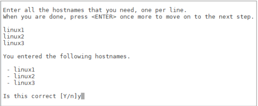

输出连接到第一个节点的所有主机 IP 地址

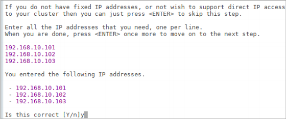

不改变证书选项配置


不给证书加密，按键输入两次回车

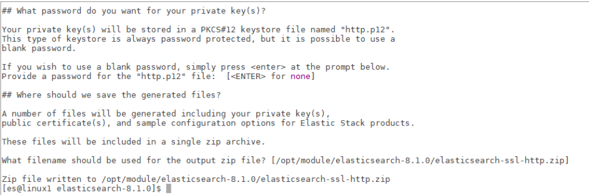

解压刚刚生成的 zip 包

```sh
# 解压文件
unzip elasticsearch-ssl-http.zip
```

将解压后的证书文件移动到 config/certs 目录中

```sh
# 移动文件
mv elasticsearch/http.p12 kibana/elasticsearch-ca.pem config/certs
```

7) 修改主配置文件：config/elasticsearch.yml

```yml
# 设置 ES 集群名称
cluster.name: es-cluster 
# 设置集群中当前节点名称
node.name: es-node-1
# 设置数据，日志文件路径
path.data: /opt/module/elasticsearch-8.1.0/data
path.logs: /opt/module/elasticsearch-8.1.0/logs
# 设置网络访问节点
network.host: linux1
# 设置网络访问端口
http.port: 9200
# 初始节点
discovery.seed_hosts: ["linux1"]
# 安全认证--如果启动后不成功，那么请将enable改为false(注意点：从节点不可以更改否则可能遇到启动不成功的情况！)
xpack.security.enabled: true
xpack.security.enrollment.enabled: true
xpack.security.http.ssl:
 enabled: true
 keystore.path: /opt/module/elasticsearch-8.1.0/config/certs/http.p12
 truststore.path: /opt/module/elasticsearch-8.1.0/config/certs/http.p12
xpack.security.transport.ssl:
 enabled: true
 verification_mode: certificate
 keystore.path: /opt/module/elasticsearch-8.1.0/config/certs/elastic-certificates.p12
 truststore.path: /opt/module/elasticsearch-8.1.0/config/certs/elastic-certificates.p12
# 此处需注意，es-node-1 为上面配置的节点名称
cluster.initial_master_nodes: ["es-node-1"]
http.host: [_local_, _site_]
ingest.geoip.downloader.enabled: false
xpack.security.http.ssl.client_authentication: none
```

8) 启动 ES 软件

```sh
# 启动 ES 软件
bin/elasticsearch
```

第一次成功启动后，会显示密码，请记住，访问时需要。只有第一次才有哟！

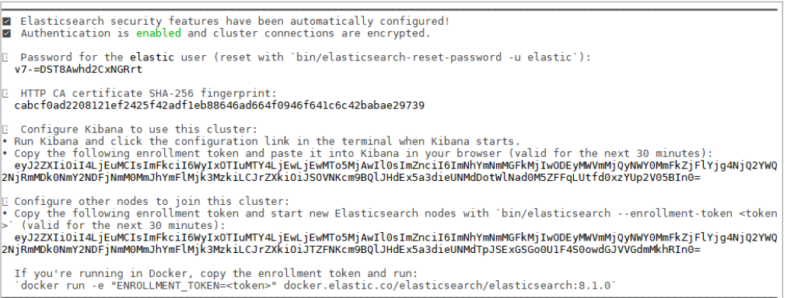

> **上面图形内容因为涉及到多节点集群配置以及** **kibana** **配置，所以极其重要！！！**
>
> **如果没有出现上面图片，出现下面图片也可以按照指定方式进行配置。**

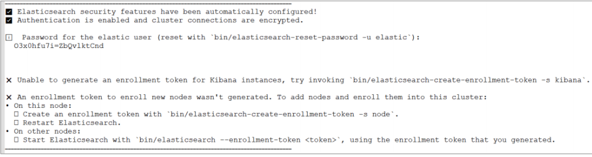

```
━━━━━━━━━━━━━━━━━━━━━━━━━━━━━━━━━━━━━━━━━━━━━━━━━━━━━━━━━━━━━━━━━━━━━━━━━━━━━━━━━━━━━━━━━━━━━━━━━━━━━━━━━━━━━━━━━━━━━━━━━━━━━━━━━━━━━━━━━━━━━━━━━
✅ Elasticsearch security features have been automatically configured!
✅ Authentication is enabled and cluster connections are encrypted.

ℹ️  Password for the elastic user (reset with `bin/elasticsearch-reset-password -u elastic`):
  CPz+1m4DlutB+xWFou=r


❌ Unable to generate an enrollment token for Kibana instances, try invoking `bin/elasticsearch-create-enrollment-token -s kibana`.

❌ An enrollment token to enroll new nodes wasn't generated. To add nodes and enroll them into this cluster:
• On this node:
  ⁃ Create an enrollment token with `bin/elasticsearch-create-enrollment-token -s node`.
  ⁃ Restart Elasticsearch.
• On other nodes:
  ⁃ Start Elasticsearch with `bin/elasticsearch --enrollment-token <token>`, using the enrollment token that you generated.
━━━━━━━━━━━━━━━━━━━━━━━━━━━━━━━━━━━━━━━━━━━━━━━━━━━━━━━━━━━━━━━━━━━━━━━━━━━━━━━━━━━━━━━━━━━━━━━━━━━━━━━━━━━━━━━━━━━━━━━━━━━━━━━━━━━━━━━━━━━━━━━━━
```

> 注意：9300 端口为 Elasticsearch 集群间组件的通信端口，9200 端口为浏览器访问的http 协议 RESTful 端口。

9) 访问服务器节点 <https://虚拟机地址:9200>

因为配置了安全协议，所以使用 https 协议进行访问，但由于证书是自己生成的，并不可靠，所以会有安全提示


选择继续即可


输入账号，密码登录即可


10) 修改集群中其他节点的配置文件：config/elasticsearch.yml

linux2: 证书直接拷贝，其他步骤完全相同，配置文件中修改如下内容即可

```yml
# 设置节点名称
node.name: es-node-2
# 设置网络访问主机
network.host: linux2
```

linux3:证书直接拷贝，其他步骤完全相同，配置文件中修改如下内容即可

```yml
# 设置节点名称
node.name: es-node-3
# 设置网络访问主机
network.host: linux3
```

11) 依次启动集群的三台服务器节点, **不要忘记切换用户后再启动**

linux1：

```sh
# 后台启动服务
bin/elasticsearch -d
```

linux2：

```shell
# 后台启动服务
bin/elasticsearch -d
```

linux3：

```sh
# 后台启动服务
bin/elasticsearch -d
```

### 问题解决

- Elasticsearch 是使用 java 开发的，8.1 版本的 ES 需要 JDK17 及以上版本。默认安装包中带有 JDK 环境，如果系统配置 **ES_JAVA_HOME** **环境变量，那么会采用系统配置的**JDK。如果没有配置该环境变量，ES 会使用自带捆绑的 JDK。虽然自带的 JDK 是 ES软件推荐的 Java 版本，但一般建议使用系统配置的 JDK。

- Windows 环境中出现下面的错误信息，是因为开启了 SSL 认证：

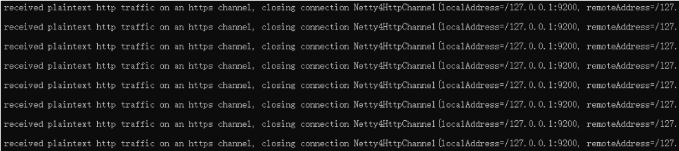

修改 config/elasticsearch.yml 文件，将 enabled 的值修改为 false

```yml
# Enable encryption for HTTP API client connections, such as Kibana, Logstash,and Agents
xpack.security.http.ssl:
 enabled: false
 keystore.path: certs/http.p12
```

- 启动成功后，如果访问 localhost:9200 地址后，弹出登录窗口


第一次启动时，因为开启了密码验证模式，在启动窗口中会显示输入账号和密码。如果没有注意到或没有找到账号密码，可以设置免密登录：

```yml
# Enable security features
xpack.security.enabled: false
```

双击启动窗口闪退，通过路径访问追踪错误，如果是“空间不足”，请修改config/jvm.options 配置文件

```sh
# 设置 JVM 初始内存为 1G。此值可以设置与-Xmx 相同，以避免每次垃圾回收完成后 JVM 重新分配
内存
# Xms represents the initial size of total heap space
# 设置 JVM 最大可用内存为 1G
# Xmx represents the maximum size of total heap space
-Xms4g
-Xmx4g
```

- 启动后，如果密码忘记了，怎么办？可以采用指令重置密码

```sh
# 使用 es 用户，执行指令，重置 elastic 用户密码
bin/elasticsearch-reset-password -u elastic
```

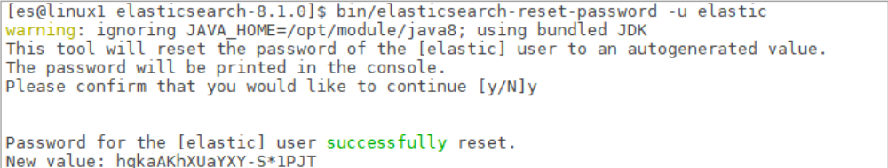

如果只启动单一节点，此操作可能会失败，至少启动 2 个节点，测试成功

## 三、Kibana安装&使用

Elasticsearch 的开源分析可视化工具，与存储在 Elasticsearch 中的数据进行交互


### **下载软件**

Elasticsearch 下载的版本是 8.1.0，这里我们选择同样的 8.1.0 版本

下载地址：<https://www.elastic.co/cn/downloads/past-releases#kibana>


### **安装软件**

本课程着重讲解新版 ES 软件的特性及应用，所以对应的 Kibana 也采用 linux 集群配置。

1) 将压缩包 kibana-8.1.0-linux-x86_64.tar.gz 上传到虚拟机中

解压缩文件到自定义路径，笔者解压路径为：/opt/module，解压后，软件路径为：

```sh
/opt/module/kibana-8.1.0
```

```sh
# 切换目录
cd software
# 解压缩
tar -zxvf kibana-8.1.0-linux-x86_64.tar.gz -C /opt/module
```

解压后的 kibana 的目录结构如下：

```sh
[root@localhost kibana-8.1.0]# ll
总用量 1436
drwxr-xr-x   2 root root     146 3月   3 2022 bin
drwxr-xr-x   2 root root      44 3月   3 2022 config
drwxr-xr-x   2 root root       6 3月   3 2022 data
-rw-r--r--   1 root root    3860 3月   3 2022 LICENSE.txt
drwxr-xr-x   2 root root       6 3月   3 2022 logs
drwxr-xr-x   6 root root     108 3月   3 2022 node
drwxr-xr-x 836 root root   24576 3月   3 2022 node_modules
-rw-r--r--   1 root root 1417101 3月   3 2022 NOTICE.txt
-rw-r--r--   1 root root     738 3月   3 2022 package.json
drwxr-xr-x   2 root root       6 3月   3 2022 plugins
-rw-r--r--   1 root root    3966 3月   3 2022 README.txt
drwxr-xr-x  11 root root     177 3月   3 2022 src
drwxr-xr-x   3 root root      79 3月   3 2022 x-pack
```

2. 给 Kibana 生成证书文件

```sh
# 在 ES 服务器中生成证书，输入回车即可
cd /opt/module/elasticsearch-8.1.0
bin/elasticsearch-certutil csr -name kibana -dns linux1
# 解压文件
unzip csr-bundle.zip
# 将解压后的文件移动到 kibana 的 config 目录中
mv kibana.csr kibana.key /opt/module/kibana-8.1.0/config/
# 生成 crt 文件
openssl x509 -req -in kibana.csr -signkey kibana.key -out kibana.crt
```

3. 修改配置文件：kibana.yml

```sh
# 服务端口
server.port: 5601
# 服务主机名
server.host: "linux1"
# 国际化 - 中文
i18n.locale: "zh-CN"
# ES 服务主机地址
elasticsearch.hosts: ["https://linux1:9200"]
# 访问 ES 服务的账号密码
elasticsearch.username: "kibana"
elasticsearch.password: "fnqIYLQGv81iyW5nWeZ-"
elasticsearch.ssl.verificationMode: none
elasticsearch.ssl.certificateAuthorities: [ "/opt/module/elasticsearch-8.1.0/config/certs/elasticsearch-ca.pem" ]
server.ssl.enabled: true
server.ssl.certificate: /opt/module/kibana-8.1.0/config/kibana.crt
server.ssl.key: /opt/module/kibana-8.1.0/config/kibana.key
```

4. 修改软件目录拥有者

```sh
# 切换目录
chown -R es:es /opt/module/kibana-8.1.0/
```

5. 切换用户，启动软件

```sh
# 切换用户
su es
# 启动软件
bin/kibana
# 也可以后台启动
nohup /opt/module/kibana-8.1.0/bin/kibana >kibana.log 2>&1 &
```

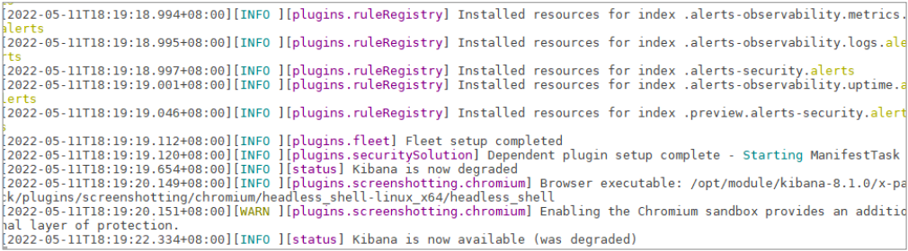

### **应用软件**

打开浏览器，输入访问地址：<https://linux1:5601>


>   浏览器访问提示：[Kibana](https://so.csdn.net/so/search?q=Kibana&spm=1001.2101.3001.7020) server is not ready yet.（服务器尚未准备就绪。）如果遇到这个问题首先说明一下，Kibana启动很慢请多等待一会，其次修改访问kibana密码！


输入 elastic 账号和密码即可访问


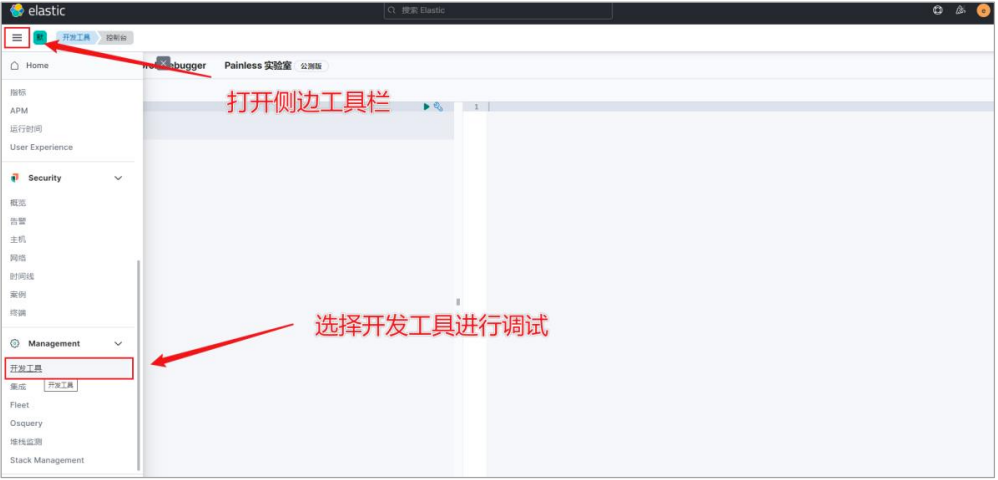


>   Kibana可能遇到的问题：
>
>   [Error: ENOENT: no such file or directory, open ‘config/kibana-server.key’](https://discuss.elastic.co/t/error-enoent-no-such-file-or-directory-open-config-kibana-server-key/272340)
>
>   [CentOS8 Kibana8.x 安装遇到的问题解决](https://developer.aliyun.com/article/1158125)
