---
# 当前页面内容标题
title: 三.Elasticsearch基础功能
# 分类
category:
  - ELK
# 标签
tag: 
  - ELK
  - 分布式搜索引擎
sticky: false
# 是否收藏在博客主题的文章列表中，当填入数字时，数字越大，排名越靠前。
star: false
# 是否将该文章添加至文章列表中
article: true
# 是否将该文章添加至时间线中
timeline: true
---

## 一、索引操作

### 创建索引

ES 软件的索引可以类比为 MySQL 中表的概念，创建一个索引，类似于创建一个表。查询完成后，Kibana 右侧会返回响应结果及请求状态。

```SHELL
PUT test_index
```

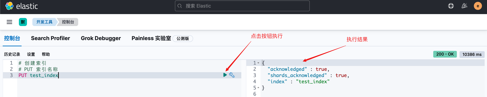

重复创建索引时，Kibana 右侧会返回响应结果，其中包含错误信息。

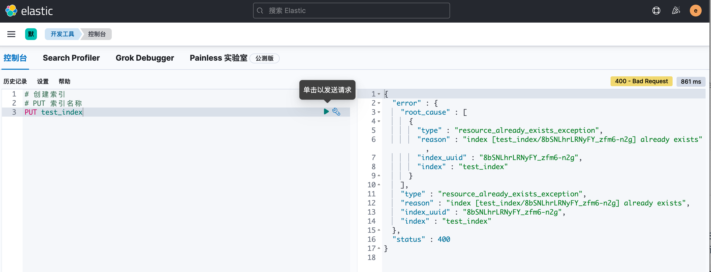

### 判断索引是否存在

```SHELL
HEAD test_index
```

- 存在

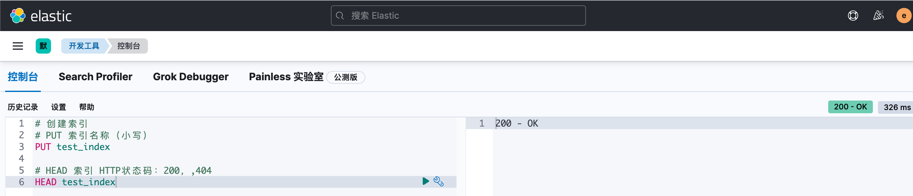

- 不存在


### 查询指定索引

根据索引名称查询指定索引，如果查询到，会返回索引的详细信息

```SHELL
GET test_index
```

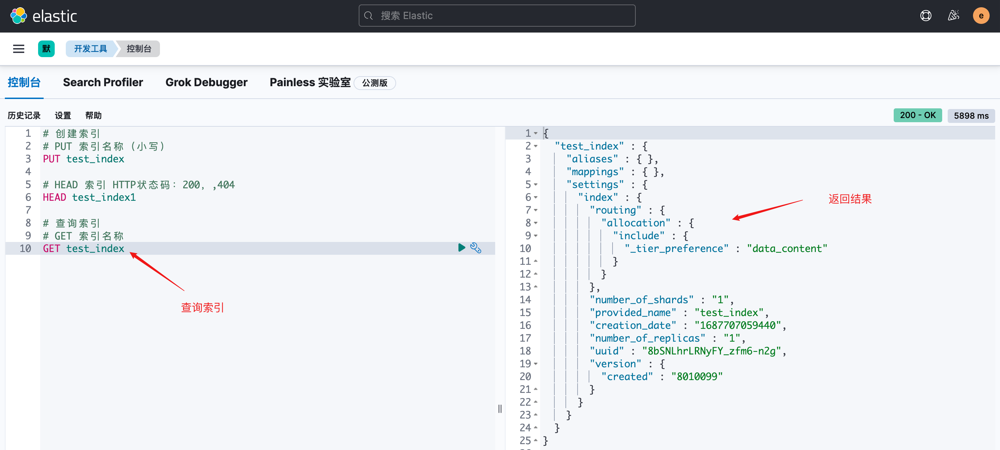

如果查询的索引未存在，会返回错误信息

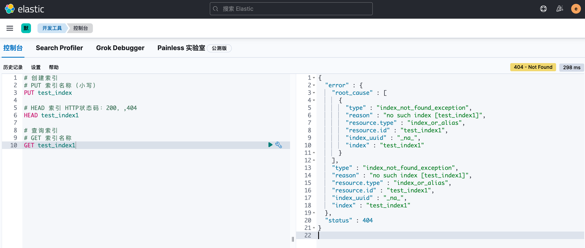

### 查询所有索引

为了方便，可以查询当前所有索引数据。这里请求路径中的_cat 表示查看的意思，indices表示索引，所以整体含义就是查看当前 ES 服务器中的所有索引，就好像 MySQL 中的 show tables 的感觉

```shell
GET _cat/indices
```

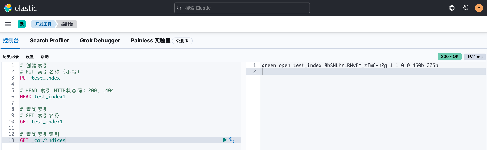

这里的查询结果表示索引的状态信息，按顺序数据表示结果如下：

| 内容                   | 含义           | 具体描述                                                     |
| ---------------------- | -------------- | ------------------------------------------------------------ |
| green                  | health         | 当前服务器健康状态：<br/>**green**(集群完整) **yellow**(单点正常、集群不完整) <br/>red(单点不正常) |
| open                   | status         | 索引打开、关闭状态                                           |
| myindex                | index          | 索引名                                                       |
| Swx2xWHLR6yv23kTrK3sAg | uuid           | 索引统一编号                                                 |
| 1                      | pri            | 主分片数量                                                   |
| 1                      | rep            | 副本数量                                                     |
| 0                      | docs.count     | 可用文档数量                                                 |
| 0                      | docs.deleted   | 文档删除状态（逻辑删除）                                     |
| 450b                   | store.size     | 主分片和副分片整体占空间大小                                 |
| 225b                   | pri.store.size | 主分片占空间大小                                             |

### 给索引增加配置


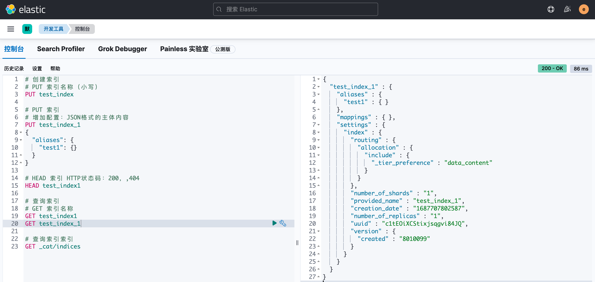

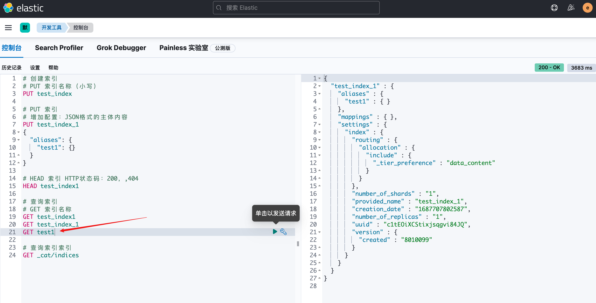

### ⚠️修改索引

这里尝试使用PUT进行修改索引

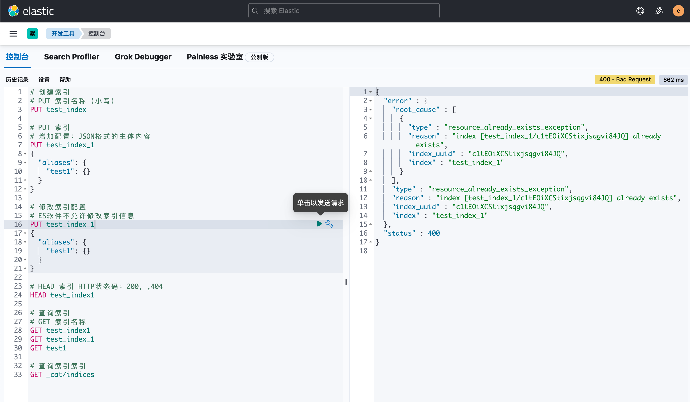

尝试以后发现并不可以修改，那么尝试POST：

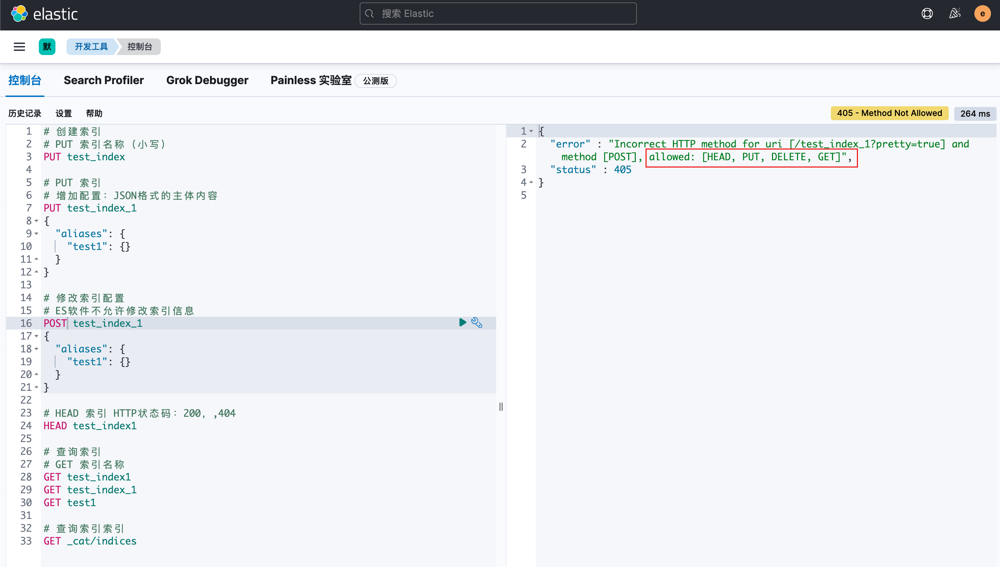

从结果可以看出来不支持POST进行修改仅支持[HEAD,PUT,DELETE,GET]请求，但是可以发现其他的请求明显不是修改的操作，所以不支持，如果想要修改的话可以尝试重新建立索引！

### 删除索引

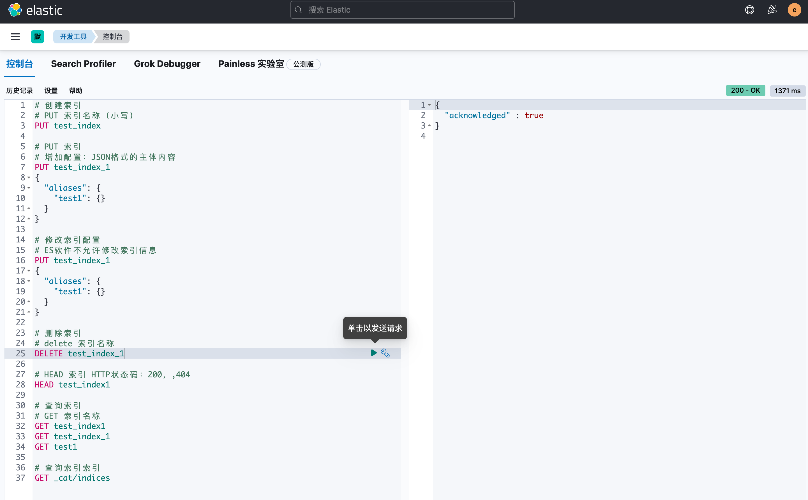

这里删除如上所示，但是如果重复删除一个索引，那么就会报错，提示索引不存在！

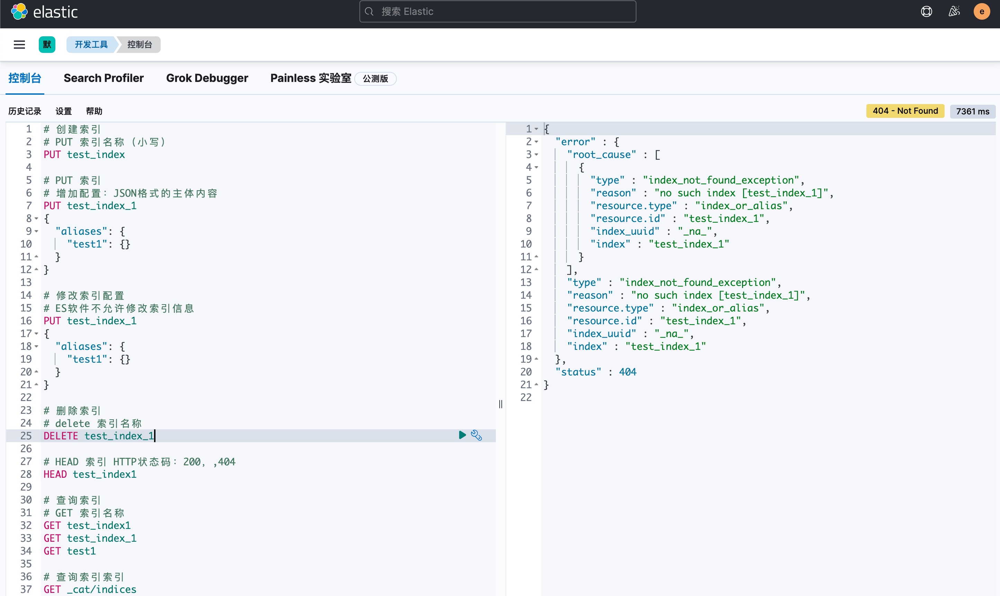

索引命令操作如下：

```shell
# 创建索引
# PUT 索引名称（小写）
PUT test_index

# PUT 索引
# 增加配置：JSON格式的主体内容
PUT test_index_1
{
  "aliases": {
    "test1": {}
  }
}

# 修改索引配置
# ES软件不允许修改索引信息
PUT test_index_1
{
  "aliases": {
    "test1": {}
  }
}

# 删除索引
# delete 索引名称
DELETE test_index_1

# HEAD 索引 HTTP状态码：200，,404
HEAD test_index1

# 查询索引
# GET 索引名称
GET test_index1
GET test_index_1
GET test1

# 查询索引索引
GET _cat/indices
```

## 二、文档操作

文档是 ES 软件搜索数据的最小单位, 不依赖预先定义的模式，所以可以将文档类比为表的一行JSON类型的数据。我们知道关系型数据库中，要提前定义字段才能使用，在Elasticsearch中，对于字段是非常灵活的，有时候，我们可以忽略该字段，或者动态的添加一个新的字段。

### 创建文档

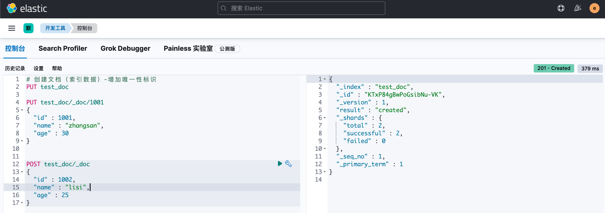

此处因为没有指定数据唯一性标识，所以无法使用 PUT 请求，只能使用 POST 请求，且对数据会生成随机的唯一性标识。否则会返回错误信息

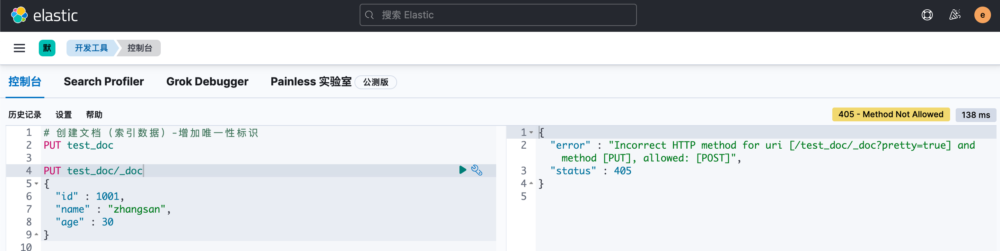

如果在创建数据时，指定唯一性标识，那么请求范式 POST，PUT 都可以

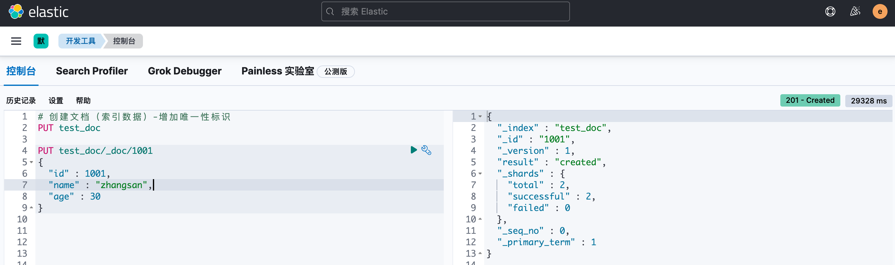

### 查询文档

根据唯一性标识可以查询对应的文档

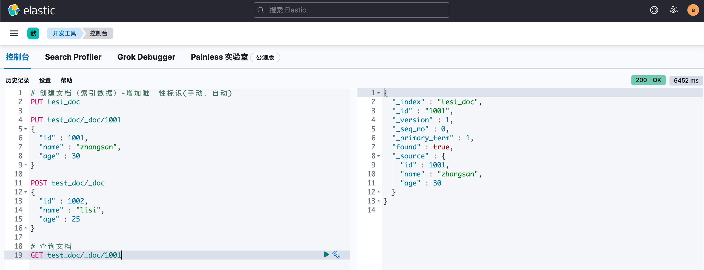

### 查询所有文档

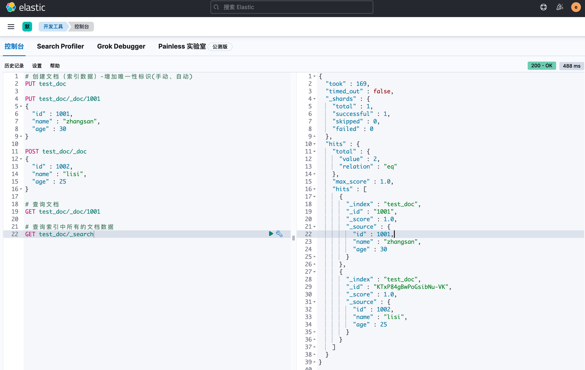

### 修改索引

修改文档本质上和新增文档是一样的，如果存在就修改，如果不存在就新增

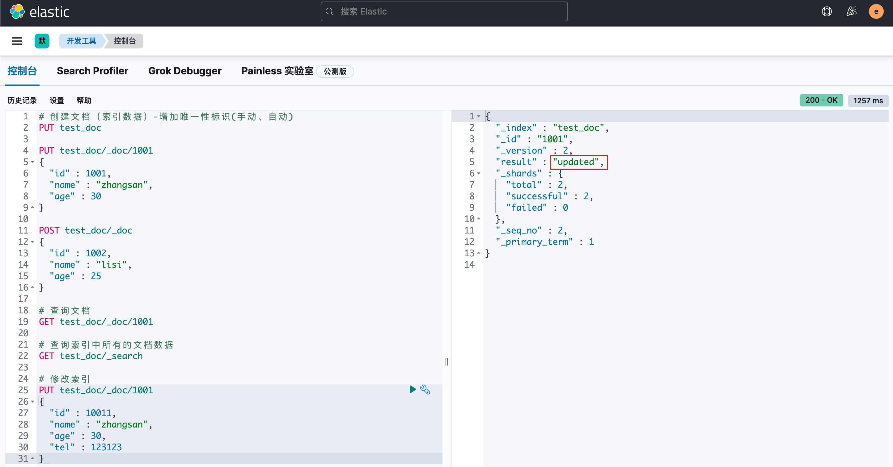

### 删除文档

删除一个文档不会立即从磁盘上移除，它只是被标记成已删除（逻辑删除）。

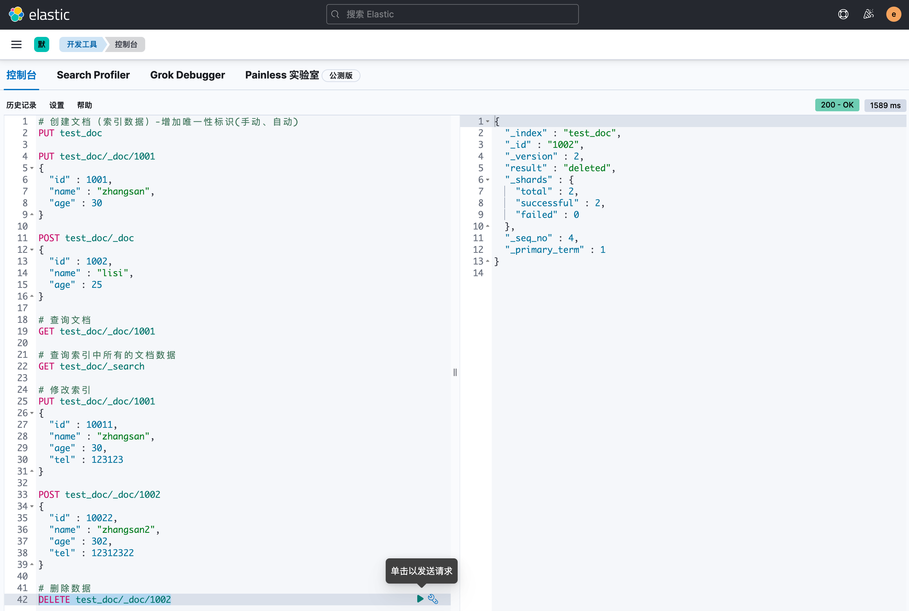

上述指令操作：

```shell
# 创建文档（索引数据）-增加唯一性标识(手动、自动)
PUT test_doc

PUT test_doc/_doc/1001
{
  "id" : 1001,
  "name" : "zhangsan",
  "age" : 30
}

POST test_doc/_doc
{
  "id" : 1002,
  "name" : "lisi",
  "age" : 25
}

# 查询文档
GET test_doc/_doc/1001

# 查询索引中所有的文档数据
GET test_doc/_search

# 修改索引
PUT test_doc/_doc/1001
{
  "id" : 10011,
  "name" : "zhangsan",
  "age" : 30,
  "tel" : 123123
}

POST test_doc/_doc/1002
{
  "id" : 10022,
  "name" : "zhangsan2",
  "age" : 302,
  "tel" : 12312322
}

# 删除数据
DELETE test_doc/_doc/1002
```

## 三、数据搜索

为了方便演示，事先准备多条数据

```shell
PUT test_query

PUT test_query/_bulk
{"index": {"_index": "test_query","_id": "1001"}}
{"id": "1001","name":"zhang san","age":30}
{"index": {"_index": "test_query","_id": "1002"}}
{"id": "1002","name":"li si","age": 40}
{"index": {"_index": "test_query","_id": "1003"}}
{"id": "1003", "name": "wang wu","age" : 50}
{"index": {"_index": "test_query","_id": "1004"}}
{"id": "1004","name": "zhangsan", "age" : 30}
{"index": {"_index": "test_query","_id": "1005"}}
{"id": "1005","name": "lisi","age":40}
{"index": {"_index": "test_query","_id": "1006"}}
{"id": "1006", "name ": "wangwu","age" : 50}
```

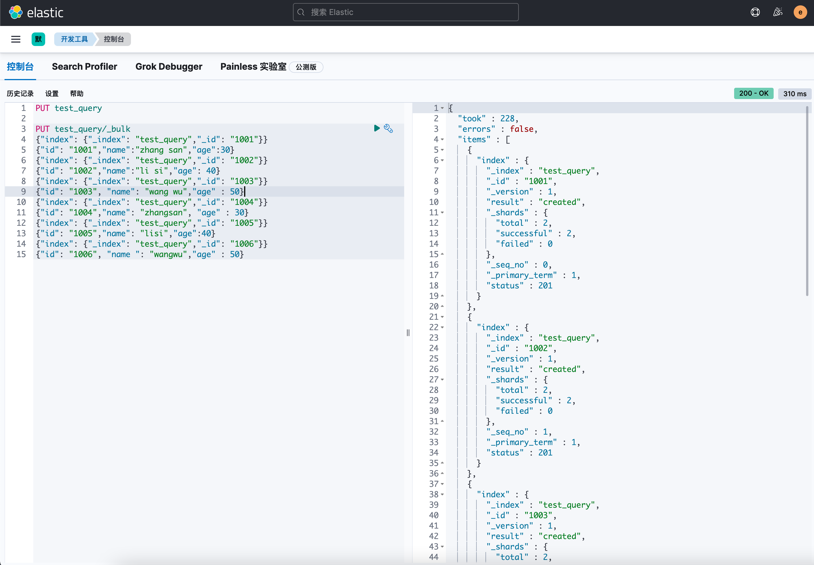

### 查询所有文档

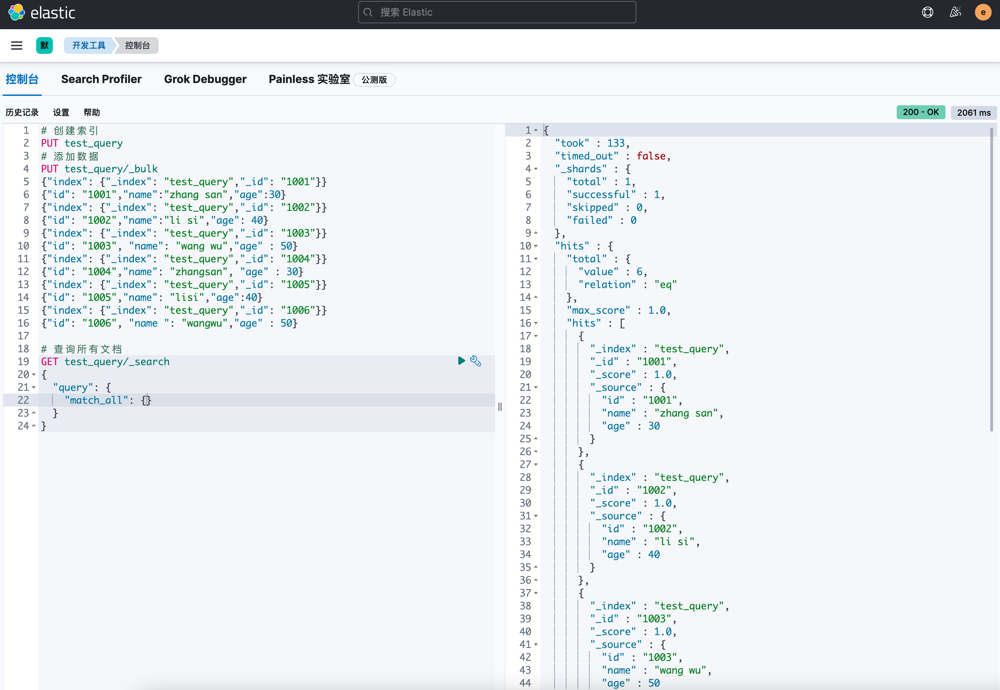

### 匹配查询文档

这里的查询表示文档数据中 JSON 对象数据中的 name 属性是 zhangsan。

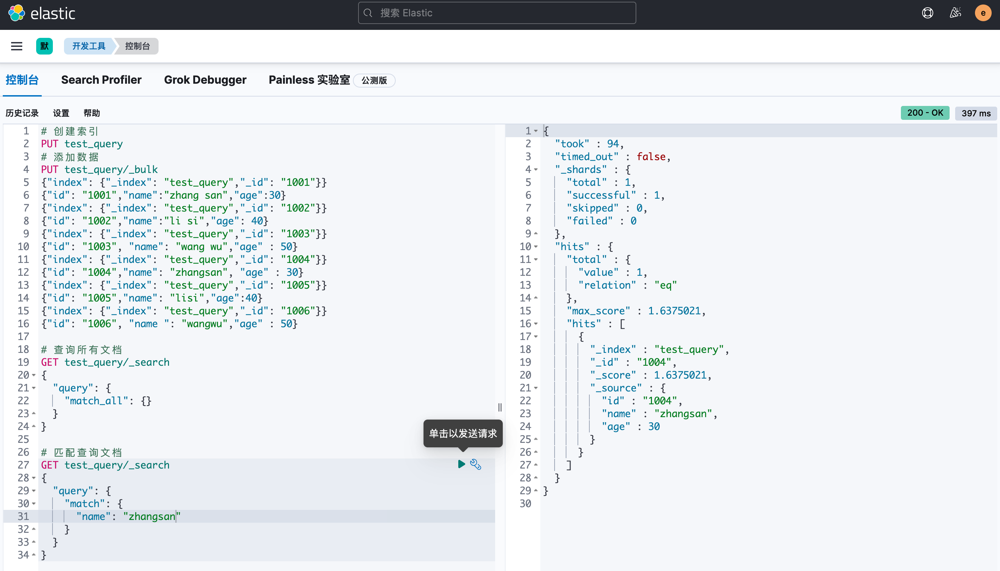

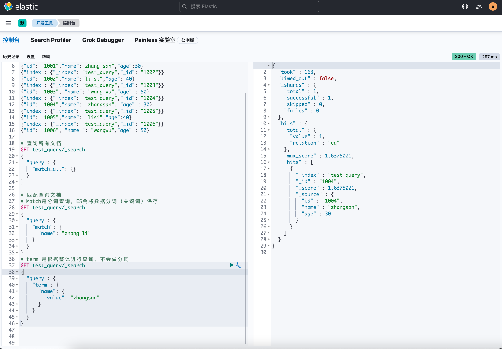

### 匹配查询字段

默认情况下，Elasticsearch 在搜索的结果中，会把文档中保存在_source 的所有字段都返回。如果我们只想获取其中的部分字段，我们可以添加_source 的过滤


操作指令：

```shell
# 创建索引
PUT test_query
# 添加数据
PUT test_query/_bulk
{"index": {"_index": "test_query","_id": "1001"}}
{"id": "1001","name":"zhang san","age":30}
{"index": {"_index": "test_query","_id": "1002"}}
{"id": "1002","name":"li si","age": 40}
{"index": {"_index": "test_query","_id": "1003"}}
{"id": "1003", "name": "wang wu","age" : 50}
{"index": {"_index": "test_query","_id": "1004"}}
{"id": "1004","name": "zhangsan", "age" : 30}
{"index": {"_index": "test_query","_id": "1005"}}
{"id": "1005","name": "lisi","age":40}
{"index": {"_index": "test_query","_id": "1006"}}
{"id": "1006", "name ": "wangwu","age" : 50}

# 查询所有文档
GET test_query/_search
{
  "query": {
    "match_all": {}
  }
}

# 匹配查询文档
# Match是分词查询，ES会将数据分词（关键词）保存
GET test_query/_search
{
  "query": {
    "match": {
      "name": "zhang li"
    }
  }
}
# term 是根据整体进行查询，不会做分词
GET test_query/_search
{
  "query": {
    "term": {
      "name": {
        "value": "zhangsan"
      }
    }
  }
}

# 对查询结果的字段进行限制
GET test_query/_search
{
  "_source": ["name","age"], 
  "query": {
    "match": {
      "name": "zhang li"
    }
  }
}
```

### 其他操作

> 组合查询 or

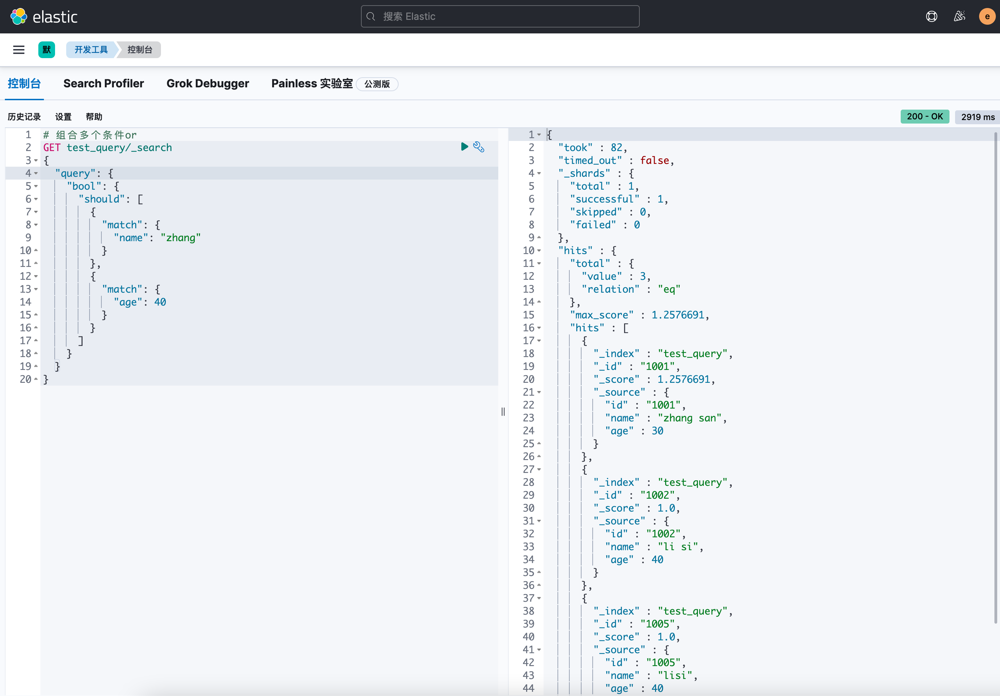

> 排序后查询

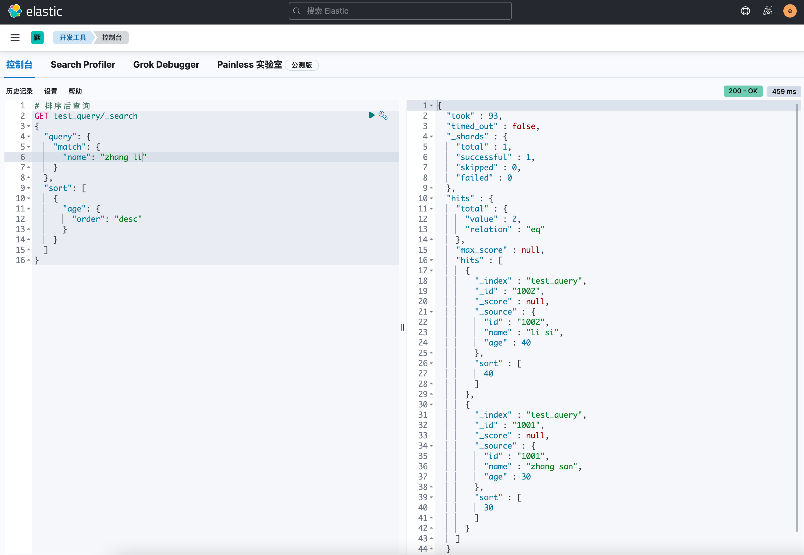

> 分页查询

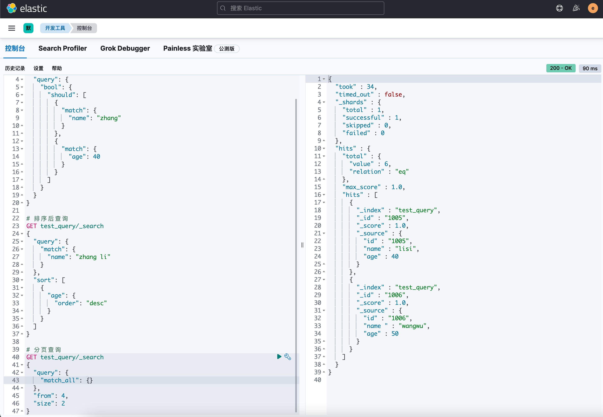

> 上述代码操作：
>
>   ```shell
>   # 组合多个条件or
>   GET test_query/_search
>   {
>     "query": {
>       "bool": {
>         "should": [
>           {
>             "match": {
>               "name": "zhang"
>             }
>           },
>           {
>             "match": {
>               "age": 40
>             }
>           }
>         ]
>       }
>     }
>   }
>   
>   # 排序后查询
>   GET test_query/_search
>   {
>     "query": {
>       "match": {
>         "name": "zhang li"
>       }
>     },
>     "sort": [
>       {
>         "age": {
>           "order": "desc"
>         }
>       }
>     ]
>   }
>   
>   # 分页查询
>   # from = (pageno -1) * size
>   # size = 每页显示的数量
>   GET test_query/_search
>   {
>     "query": {
>       "match_all": {}
>     },
>     "from": 4,
>     "size": 2
>   }
>   ```

## 四、聚合搜索

聚合允许使用者对 es 文档进行统计分析，类似与关系型数据库中的 group by，当然还有很多其他的聚合，例如取最大值、平均值等等。

> 分组查询

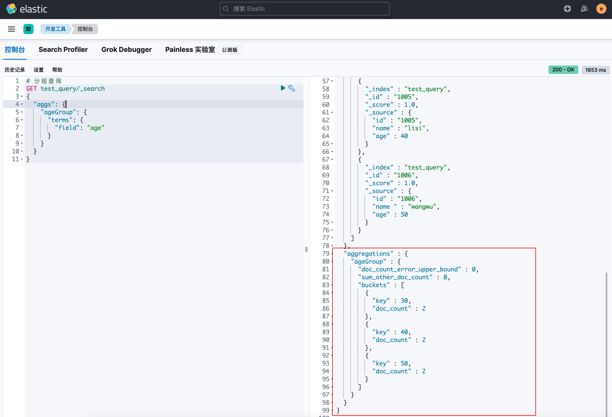

上面的数据太多余，只想要聚合的操作怎么办？

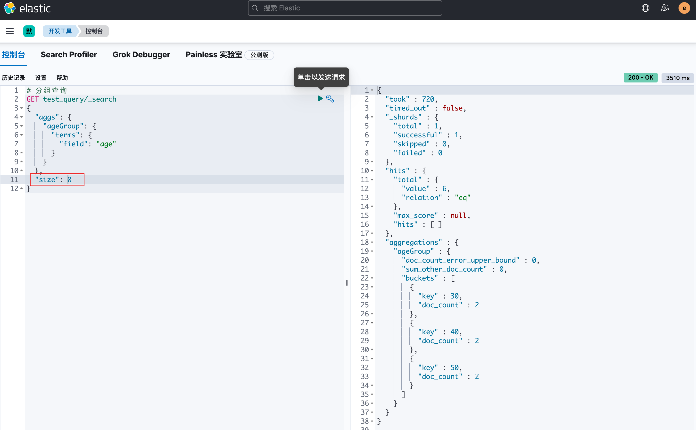

### 求和


### 平均值

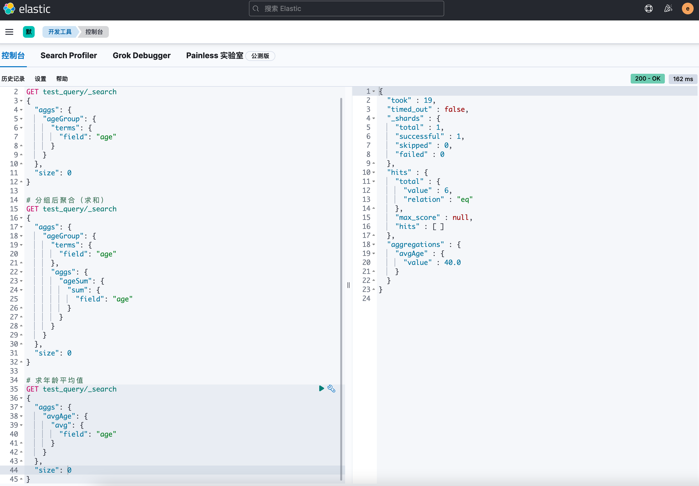

### 最大值

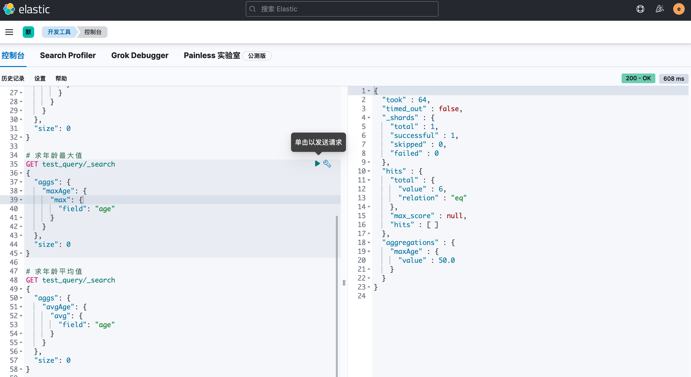

### TopN


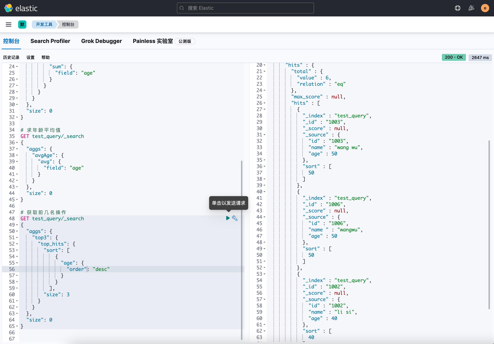

> 核心操作

```shell
# 分组查询
GET test_query/_search
{
  "aggs": {
    "ageGroup": {
      "terms": {
        "field": "age"
      }
    }
  },
  "size": 0
}

# 分组后聚合（求和）
GET test_query/_search
{
  "aggs": {
    "ageGroup": {
      "terms": {
        "field": "age"
      },
      "aggs": {
        "ageSum": {
          "sum": {
            "field": "age"
          }
        }
      }
    }
  },
  "size": 0
}

# 求年龄最大值
GET test_query/_search
{
  "aggs": {
    "maxAge": {
      "max": {
        "field": "age"
      }
    }
  },
  "size": 0
}

# 求年龄平均值
GET test_query/_search
{
  "aggs": {
    "avgAge": {
      "avg": {
        "field": "age"
      }
    }
  },
  "size": 0
}

# 获取前几名操作
GET test_query/_search
{
  "aggs": {
    "top3": {
      "top_hits": {
        "sort": [
            {
              "age": {
                "order": "desc"
              }
            }
          ], 
        "size": 3
      }
    }
  },
  "size": 0
}
```

## 五、索引模版

我们之前对索引进行一些配置信息设置，但是都是在单个索引上进行设置。在实际开发中，我们可能需要创建不止一个索引，但是每个索引或多或少都有一些共性。比如我们在设计关系型数据库时，一般都会为每个表结构设计一些常用的字段，比如：创建时间，更新时间，备注信息等。elasticsearch 在创建索引的时候，就引入了模板的概念，你可以先设置一些通用的模板，在创建索引的时候，elasticsearch 会先根据你创建的模板对索引进行设置。elasticsearch 中提供了很多的默认设置模板，这就是为什么我们在新建文档的时候，可以为你自动设置一些信息，做一些字段转换等。

索引可使用预定义的模板进行创建,这个模板称作 Index templates。模板设置包括 settings和 mappings

### 创建模版

```json
# 模板名称小写
PUT _template/mytemplate
{
    "index_patterns":[
        "my*"
    ],
    "settings":{
        "index":{
            "number_of_shards":"1"
        }
    },
    "mappings":{
        "properties":{
            "now":{
                "type":"date",
                "format":"yyyy/MM/dd"
            }
        }
    }
}
```

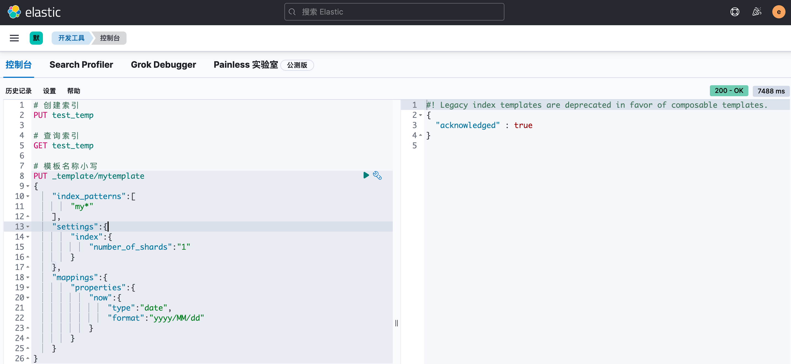

### 查看模版

```sh
# 查看模版
GET /_template/mytemplate
```

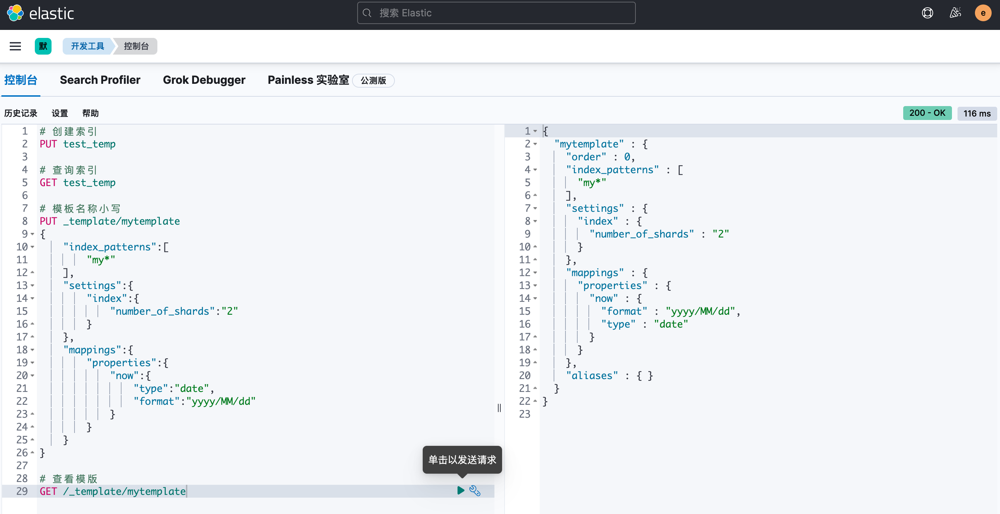

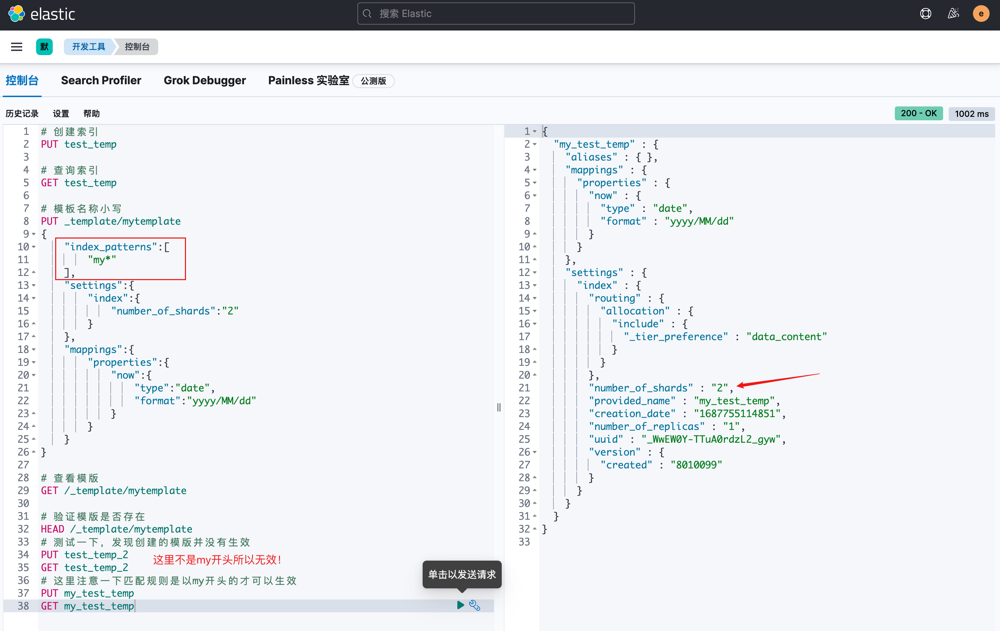

### 验证模版是否存在

```sh
# 验证模版是否存在
HEAD /_template/mytemplate
```

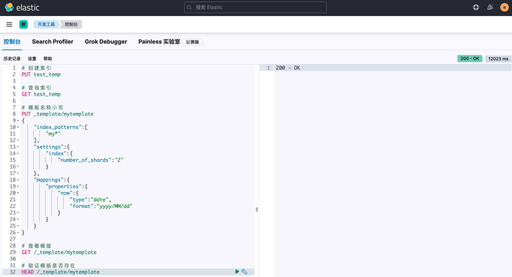

### 删除模版

```sh
# 删除模版
DELETE _template/mytemplate
```

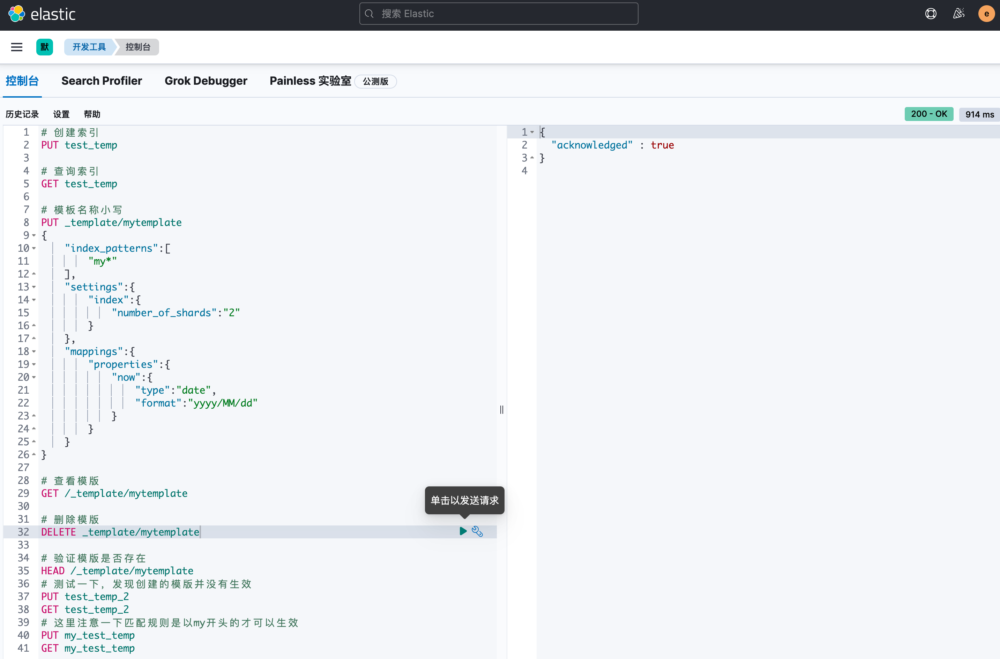

如果删除以后再次查询或者查询不存在的索引返回 { }

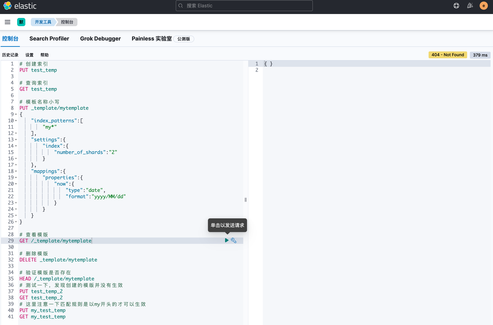

> 以上代码测试：

```sh
# 创建索引
PUT test_temp

# 查询索引
GET test_temp

# 模板名称小写
PUT _template/mytemplate
{
    "index_patterns":[
        "my*"
    ],
    "settings":{
        "index":{
            "number_of_shards":"2"
        }
    },
    "mappings":{
        "properties":{
            "now":{
                "type":"date",
                "format":"yyyy/MM/dd"
            }
        }
    }
}

# 查看模版
GET /_template/mytemplate

# 删除模版
DELETE _template/mytemplate

# 验证模版是否存在
HEAD /_template/mytemplate
# 测试一下，发现创建的模版并没有生效
PUT test_temp_2
GET test_temp_2
# 这里注意一下匹配规则是以my开头的才可以生效
PUT my_test_temp
GET my_test_temp
```

## 六、中文分词

我们在使用 Elasticsearch 官方默认的分词插件时会发现，其对中文的分词效果不佳，经常分词后得效果不是我们想要得。

```sh
# 默认分词器
GET _analyze
{
  "analyzer": "standard",
  "text": ["我是一个Java开发人员"]
}

# 默认分词器
GET _analyze
{
  "analyzer": "chinese",
  "text": ["我是一个Java开发人员"]
}
```

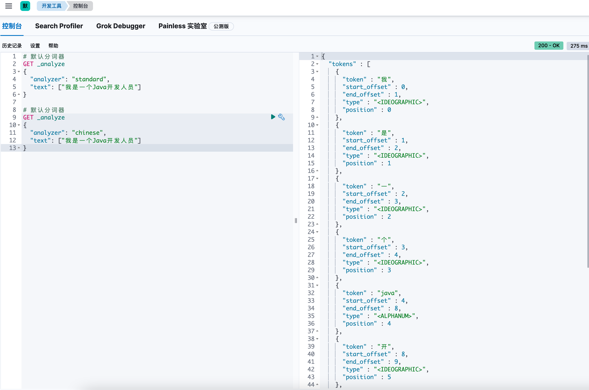

为了能够更好地对中文进行搜索和查询，就需要在Elasticsearch中集成好的分词器插件，而 IK 分词器就是用于对中文提供支持得插件。

### 集成IK分词器

#### 下载

下载地址：<https://github.com/medcl/elasticsearch-analysis-ik/releases>

注意：选择下载的版本要与 Elasticsearch 版本对应。我们这里选择 8.1.0

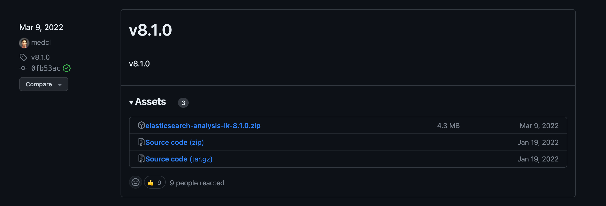

#### 安装

在安装目录得 plugins 目中，将下载得压缩包直接解压缩得里面即可

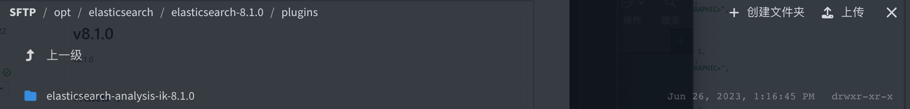

**重启** **Elasticsearch** **服务**

### 使用IK分词器

IK 分词器提供了两个分词算法：

- ik_smart: 最少切分

- ik_max_word:最细粒度划分

接下来咱们使用 ik_smart 算法对之前得中文内容进行分词，明显会发现和默认分词器得区别。

```sh
# 使用IK分词器
GET _analyze
{
  "analyzer": "ik_max_word",
  "text": ["我是一个开发人员"]
}
```

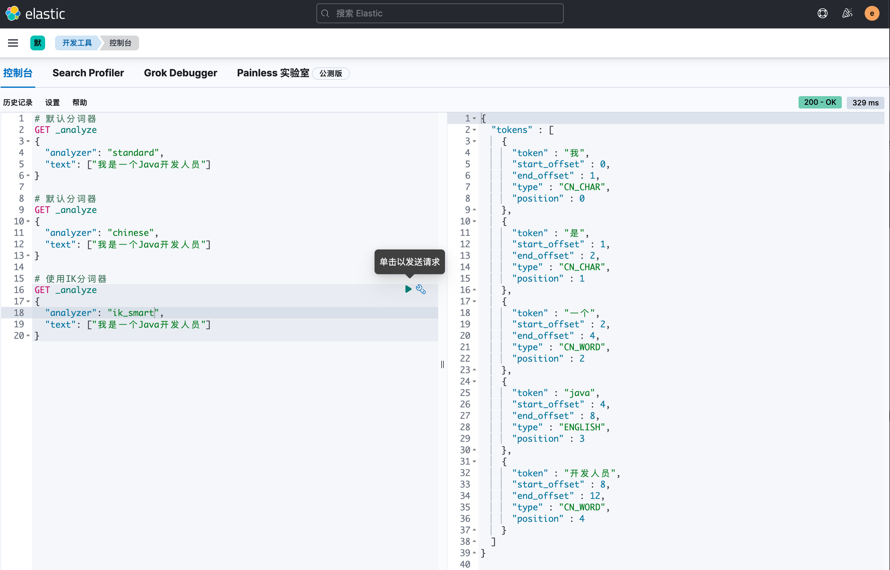

接下来，再对比 ik_max_word 算法分词后的效果

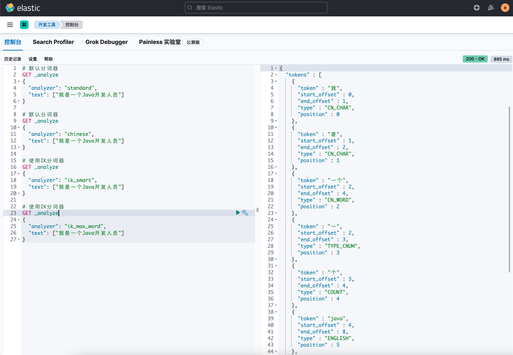

> 操作

```sh
# 默认分词器
GET _analyze
{
  "analyzer": "standard",
  "text": ["我是一个Java开发人员"]
}

# 默认分词器
GET _analyze
{
  "analyzer": "chinese",
  "text": ["我是一个Java开发人员"]
}

# 使用IK分词器
GET _analyze
{
  "analyzer": "ik_smart",
  "text": ["我是一个Java开发人员"]
}

# 使用IK分词器
GET _analyze
{
  "analyzer": "ik_max_word",
  "text": ["我是一个Java开发人员"]
}
```

### 自定义分词效果

我们在使用 IK 分词器时会发现其实有时候分词的效果也并不是我们所期待的,有时一些特殊得术语会被拆开，比如上面得中文“一个学生”希望不要拆开，怎么做呢？其实 IK 插件给我们提供了自定义分词字典，我们就可以添加自己想要保留得字了。`test.dic`

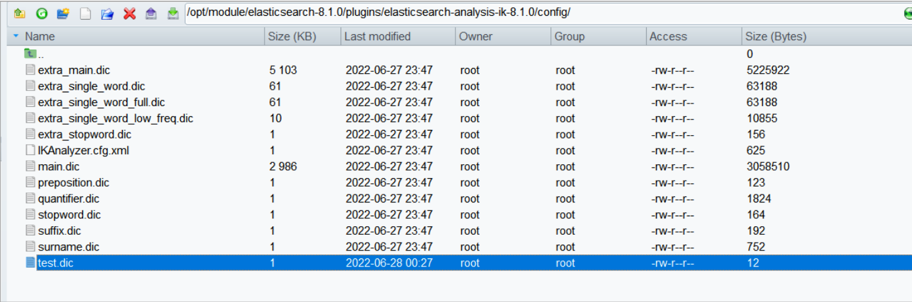

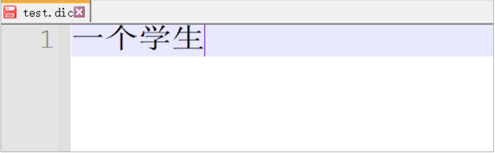

接下来我们修改配置文件：IKAnalyzer.cfg.xml

```xml
<?xml version="1.0" encoding="UTF-8"?>
<!DOCTYPE properties SYSTEM "http://java.sun.com/dtd/properties.dtd">
<properties>
    <comment>IK Analyzer 扩展配置</comment>
    <!--用户可以在这里配置自己的扩展字典 -->
    <entry key="ext_dict">test.dic</entry>
    <!--用户可以在这里配置自己的扩展停止词字典-->
    <entry key="ext_stopwords"></entry>
    <!--用户可以在这里配置远程扩展字典 -->
    <!-- <entry key="remote_ext_dict">words_location</entry> -->
    <!--用户可以在这里配置远程扩展停止词字典-->
    <!-- <entry key="remote_ext_stopwords">words_location</entry> -->
</properties>
```

重启 Elasticsearch 服务器查看效果

```sh
GET _analyze
{
 "analyzer": "ik_smart",
 "text": ["我是一个学生"]
}
```

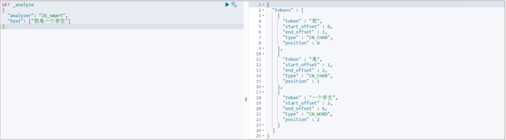

## 七、文档得分

Lucene 和 ES 的得分机制是一个基于词频和逆文档词频的公式，简称为 TF-IDF 公式

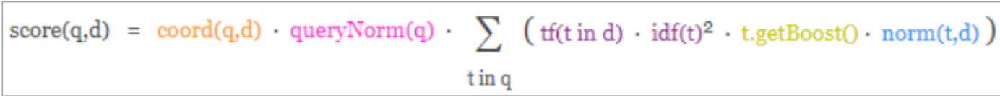

公式中将查询作为输入，使用不同的手段来确定每一篇文档的得分，将每一个因素最后通过公式综合起来，返回该文档的最终得分。这个综合考量的过程，就是我们希望相关的文档被优先返回的考量过程。在 Lucene 和 ES 中这种相关性称为得分。

考虑到查询内容和文档得关系比较复杂，所以公式中需要输入得参数和条件非常得多。但是其中比较重要得其实是两个算法机制

- TF (词频)

Term Frequency : 搜索文本中的各个词条（term）在查询文本中出现了多少次，出现次数越多，就越相关，得分会比较高

- IDF(逆文档频率)

Inverse Document Frequency : 搜索文本中的各个词条（term）在整个索引的所有文档中出现了多少次，出现的次数越多，说明越不重要，也就越不相关，得分就比较低。

### 打分机制

接下来咱们用一个例子简单分析一下文档的打分机制：

1) 首先，咱们先准备一个基础数据

```sh
# 创建索引
PUT test_source
# 增加文档数据
PUT test_source/_doc/1001
{
  "text": "zhang kai shou bui,ying jie tai yang"
}

PUT test_source/_doc/1002
{
  "text": "zhang san"
}
```

2) 查询匹配条件的文档数据

```sh
GET test_source/_search
{
  "query": {
    "match": {
      "text": "zhang"
    }
  }
}
```

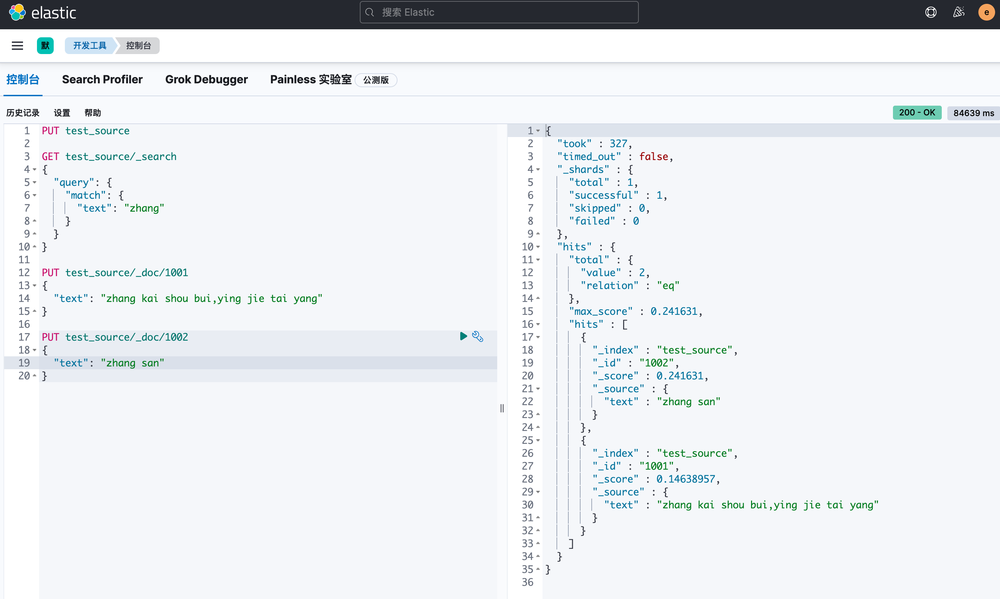

这里文档的得分为：0.14638957，很奇怪，此时索引中只有一个文档数据，且文档数据中可以直接匹配查询条件，为什么分值这么低？这就是公式的计算结果，咱们一起来看看

3) 分析文档数据打分过程

```sh
GET test_source/_search?explain=true
{
  "query": {
    "match": {
      "text": "zhang"
    }
  }
}
```

执行后，会发现打分机制中有 2 个重要阶段：计算 TF 值和 IDF 值

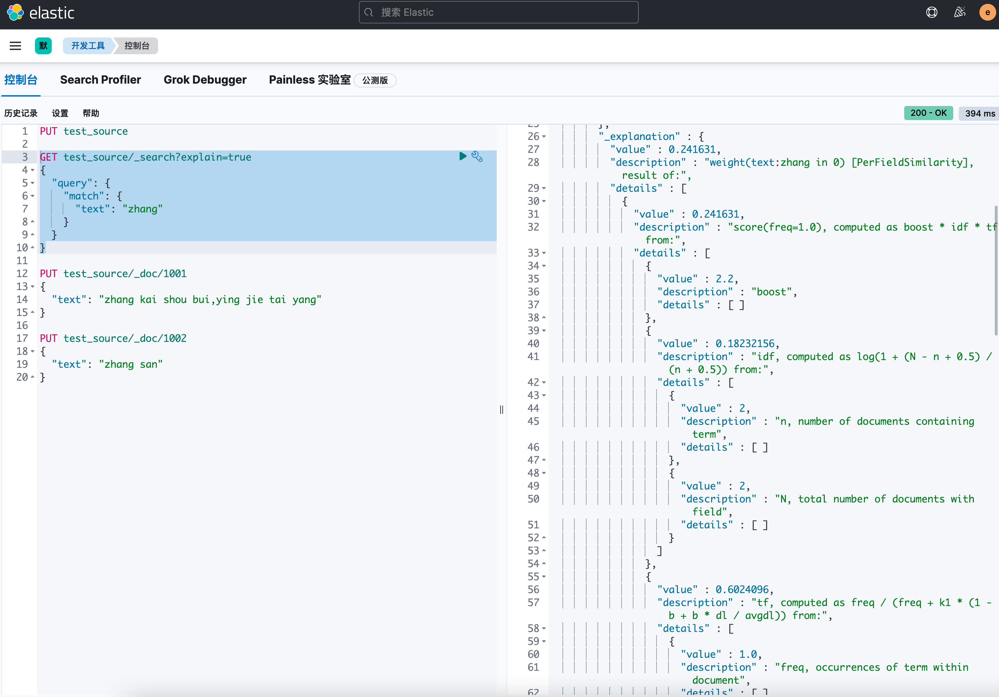

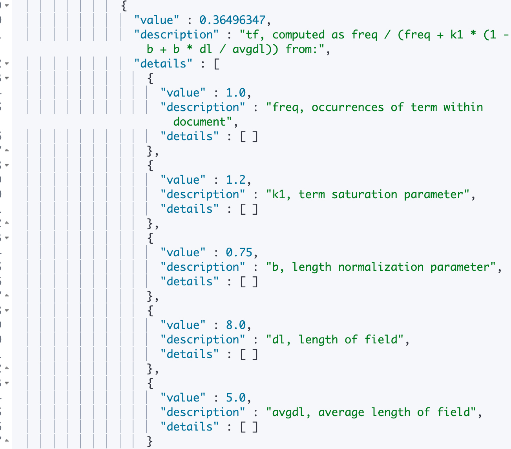

最后的分数为：

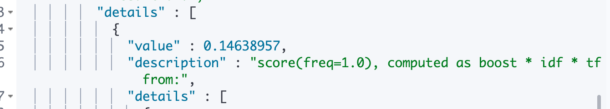

4) 计算 TF 值

```
freq / (freq + k1 * (1 - b + b *dl / avgdl))
```

| 参数           | 含义                                             | 取值           |
| -------------- | ------------------------------------------------ | -------------- |
| freq           | 文档中出现词条的次数                             | 1.0            |
| k1             | 术语饱和参数                                     | 1.2（默认值）  |
| b              | 长度规格化参数（单词长度对于整个文档的影响程度） | 0.75（默认值） |
| dl             | 当前文中分解的字段长度                           | 1.0            |
| avgdl          | 查询文档中分解字段数量/查询文档数量              | 1.0            |
| **TF（词频）** | **1.0/(1 + 1.2 \* (1 - 0.75 + 0.75\*1.0/1.0))**  | **0.454545**   |

5) 计算 IDF 值

```
log(1 + (N - n + 0.5) / (n + 0.5))
```

| 参数              | 含义                                         | 取值          |
| ----------------- | -------------------------------------------- | ------------- |
| N                 | 包含查询字段的文档总数（不一定包含查询词条） | 1             |
| n                 | 包含查询词条的文档数                         | 1             |
| IDF（逆文档频率） | **log(1 + (1 - 1 + 0.5) / (1 + 0.5))**       | **0.2876821** |

**注：这里的** **log** **是底数为** **e** **的对数**

6) 计算文档得分

```
boost * idf * tf
```

| 参数              | 含义                             | 取值                           |
| ----------------- | -------------------------------- | ------------------------------ |
| boost             | 词条权重                         | **2.2**基础值）查询权重**(1)** |
| idf               | 逆文档频率                       | **0.2876821**                  |
| tf                | 词频                             | **0.454545**                   |
| **Score（得分）** | **2.2 \* 0.2876821 \* 0.454545** | **0.2876821**                  |

7) 增加新的文档，测试得分
     - 增加一个毫无关系的文档

```sh
# 增加文档
PUT /atguigu/_doc/2
{
 "text" : "spark"
}
# 因为新文档无词条相关信息，所以匹配的文档数据得分就应该较高：
# 0.6931741
GET /atguigu/_search
{
    "query":{
        "match":{
            "text":"hello"
        }
    }
}
```


- 增加一个一模一样的文档

```sh
# 增加文档
PUT /atguigu/_doc/2
{
 "text" : "hello"
}
# 因为新文档含词条相关信息，且多个文件含有词条，所以显得不是很重要，得分会变低
# 0.18232156
GET /atguigu/_search
{
    "query":{
        "match":{
            "text":"hello"
        }
    }
}
```


- 增加一个含有词条，但是内容较多的文档

```sh
# 增加文档
PUT /atguigu/_doc/2
{
 "text" : "hello elasticsearch" 
}
# 因为新文档含词条相关信息，但只是其中一部分，所以查询文档的分数会变得更低一些。
# 0.14874382
GET /atguigu/_search
{
    "query":{
        "match":{
            "text":"hello"
        }
    }
}
```

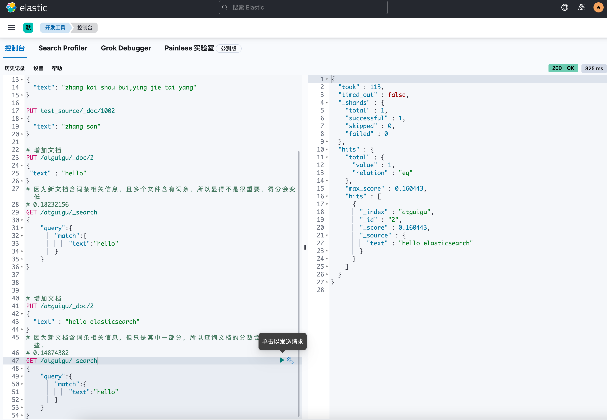

### 案例

需求：

查询文档标题中含有“Hadoop”,“Elasticsearch”,“Spark”的内容。

优先选择“Spark”的内容

1) 准备数据

```sh
# 准备数据
PUT /testscore/_doc/1001
{
    "title":"Hadoop is a Framework",
    "content":"Hadoop 是一个大数据基础框架"
}
PUT /testscore/_doc/1002
{
    "title":"Hive is a SQL Tools",
    "content":"Hive 是一个 SQL 工具"
}
PUT /testscore/_doc/1003
{
    "title":"Spark is a Framework",
    "content":"Spark 是一个分布式计算引擎"
}
```

2. 查询数据

```sh
# 查询文档标题中含有“Hadoop”,“Elasticsearch”,“Spark”的内容
GET /testscore/_search?explain=true
{
    "query":{
        "bool":{
            "should":[
                {
                    "match":{
                        "title":{
                            "query":"Hadoop",
                            "boost":1
                        }
                    }
                },
                {
                    "match":{
                        "title":{
                            "query":"Hive",
                            "boost":1
                        }
                    }
                },
                {
                    "match":{
                        "title":{
                            "query":"Spark",
                            "boost":1
                        }
                    }
                }
            ]
        }
    }
}
```

此时，你会发现，Spark 的结果并不会放置在最前面

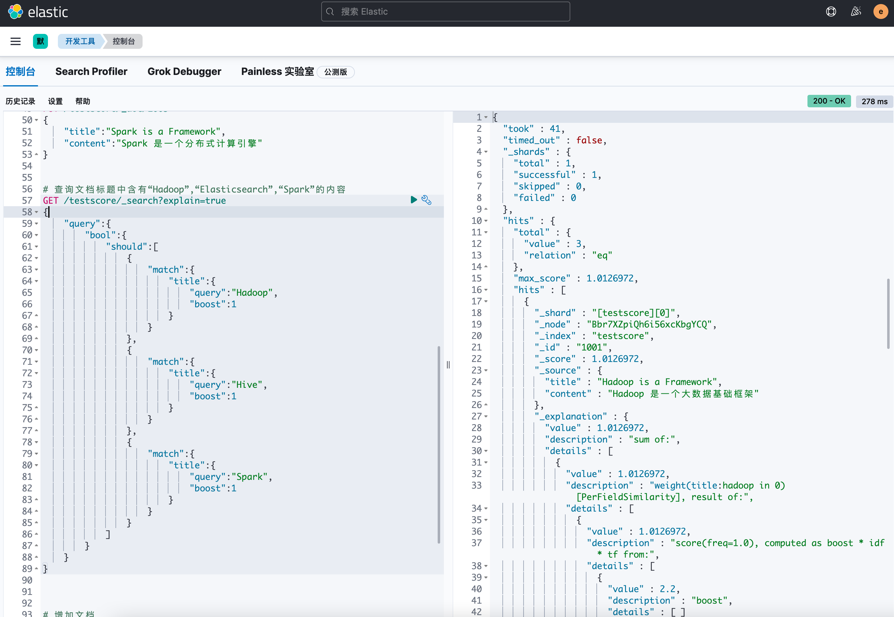

此时，咱们可以更改 Spark 查询的权重参数 boost.看看查询的结果有什么不同

```sh
# 查询文档标题中含有“Hadoop”,“Elasticsearch”,“Spark”的内容
GET /testscore/_search?explain=true
{
    "query":{
        "bool":{
            "should":[
                {
                    "match":{
                        "title":{
                            "query":"Hadoop",
                            "boost":1
                        }
                    }
                },
                {
                    "match":{
                        "title":{
                            "query":"Hive",
                            "boost":1
                        }
                    }
                },
                {
                    "match":{
                        "title":{
                            "query":"Spark",
                            "boost":2
                        }
                    }
                }
            ]
        }
    }
}
```

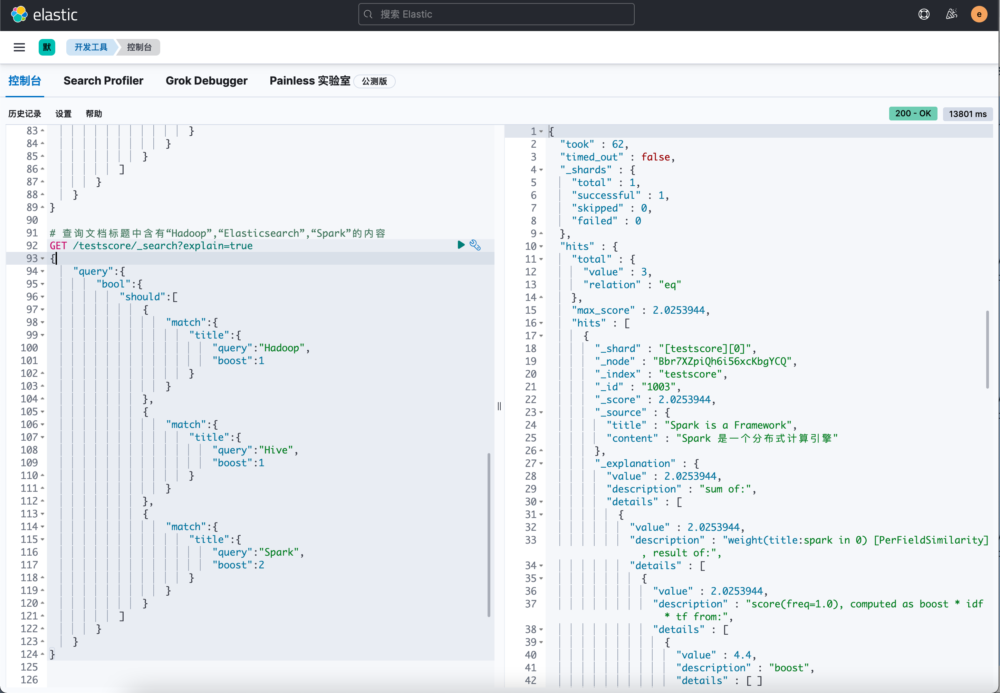
