---
# 当前页面内容标题
title: 四.Elasticsearch进阶功能
# 分类
category:
  - ELK
# 标签
tag: 
  - ELK
  - 分布式搜索引擎
sticky: false
# 是否收藏在博客主题的文章列表中，当填入数字时，数字越大，排名越靠前。
star: false
# 是否将该文章添加至文章列表中
article: true
# 是否将该文章添加至时间线中
timeline: true
---

## 一、Java API操作

随着 Elasticsearch 8.x 新版本的到来，Type 的概念被废除，为了适应这种数据结构的改变，Elasticsearch 官方从 7.15 版本开始建议使用新的 Elasticsearch Java Client。 

### 1.增加依赖关系

```xml
<?xml version="1.0" encoding="UTF-8"?>
<project xmlns="http://maven.apache.org/POM/4.0.0"
         xmlns:xsi="http://www.w3.org/2001/XMLSchema-instance"
         xsi:schemaLocation="http://maven.apache.org/POM/4.0.0 http://maven.apache.org/xsd/maven-4.0.0.xsd">
    <modelVersion>4.0.0</modelVersion>

    <groupId>com.ragnarok.es8</groupId>
    <artifactId>elasticsearch-api-8.x</artifactId>
    <version>1.0-SNAPSHOT</version>

    <properties>
        <maven.compiler.source>8</maven.compiler.source>
        <maven.compiler.target>8</maven.compiler.target>
        <elastic.version>8.1.0</elastic.version>
    </properties>
    <dependencies>
        <dependency>
            <groupId>org.elasticsearch.plugin</groupId>
            <artifactId>x-pack-sql-jdbc</artifactId>
            <version>8.1.0</version>
        </dependency>
        <dependency>
            <groupId>co.elastic.clients</groupId>
            <artifactId>elasticsearch-java</artifactId>
            <version>${elastic.version}</version>
        </dependency>
        <dependency>
            <groupId>com.fasterxml.jackson.core</groupId>
            <artifactId>jackson-databind</artifactId>
            <version>2.12.3</version>
        </dependency>
        <dependency>
            <groupId>jakarta.json</groupId>
            <artifactId>jakarta.json-api</artifactId>
            <version>2.0.1</version>
        </dependency>
    </dependencies>

</project>
```

### 2.获取客户端对象

就像连接 MySQL 数据库一样，Java 通过客户端操作 Elasticsearch 也要获取到连接后才可以。咱们现在使用的基于 https 安全的 Elasticsearch 服务，所以首先我们需要将之前的证书进行一个转换

```sh
openssl pkcs12 -in elastic-stack-ca.p12 -clcerts -nokeys -out java-ca.crt
```

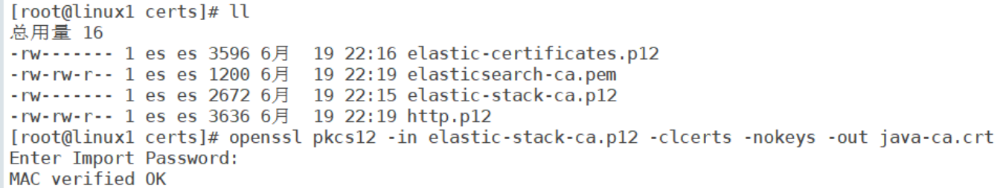

配置证书后，我们就可以采用 https 方式获取连接对象了。

```java
package com.ragnarok.elasticsearch.api;

import co.elastic.clients.elasticsearch.*;
import co.elastic.clients.json.jackson.JacksonJsonpMapper;
import co.elastic.clients.transport.ElasticsearchTransport;
import co.elastic.clients.transport.rest_client.RestClientTransport;
import org.apache.http.HttpHost;
import org.apache.http.auth.*;
import org.apache.http.client.*;
import org.apache.http.conn.ssl.NoopHostnameVerifier;
import org.apache.http.impl.client.*;
import org.apache.http.impl.nio.client.HttpAsyncClientBuilder;
import org.apache.http.ssl.*;
import org.elasticsearch.client.*;
import javax.net.ssl.SSLContext;
import java.io.InputStream;
import java.nio.file.*;
import java.security.KeyStore;
import java.security.cert.*;

/**
 * @author ragnarok
 * @version 1.0
 * @description ES客户端连接
 * @create 2023-06-27 12:24
 * @github https://github.com/Ragnarokoo
 */
public class ESClient
{
    public static void main(String[] args) throws Exception
    {
        initESConnection();
    }

    /**
    * @author: ragnarok
    * @description: 初始化ES连接
    * @param: []
    * @return: void
    * @date: 2023/6/27 12:33
    */
    private static void initESConnection() throws Exception
    {
        // 获取客户端对象
        final CredentialsProvider credentialsProvider = new BasicCredentialsProvider();
        credentialsProvider.setCredentials(AuthScope.ANY,
                new UsernamePasswordCredentials("elastic", "CPz+1m4DlutB+xWFou=r"));
        Path caCertificatePath = Paths.get("/Users/mac/Desktop/Elasticsearch-study/elasticsearch-api-8.x/certs/java-ca.crt");
        CertificateFactory factory =
                CertificateFactory.getInstance("X.509");
        Certificate trustedCa;
        try (InputStream is = Files.newInputStream(caCertificatePath)) {
            trustedCa = factory.generateCertificate(is);
        }
        KeyStore trustStore = KeyStore.getInstance("pkcs12");
        trustStore.load(null, null);
        trustStore.setCertificateEntry("ca", trustedCa);
        SSLContextBuilder sslContextBuilder = SSLContexts.custom()
                .loadTrustMaterial(trustStore, null);
        final SSLContext sslContext = sslContextBuilder.build();
        RestClientBuilder builder = RestClient.builder(
                        new HttpHost("172.16.102.135", 9200, "https"))
                .setHttpClientConfigCallback(new
                                                     RestClientBuilder.HttpClientConfigCallback() {
                                                         @Override
                                                         public HttpAsyncClientBuilder customizeHttpClient(
                                                                 HttpAsyncClientBuilder httpClientBuilder) {
                                                             return httpClientBuilder.setSSLContext(sslContext)
                                                                     .setSSLHostnameVerifier(NoopHostnameVerifier.INSTANCE)
                                                                     .setDefaultCredentialsProvider(credentialsProvider);
                                                         }
                                                     });
        RestClient restClient = builder.build();
        ElasticsearchTransport transport = new RestClientTransport(
                restClient, new JacksonJsonpMapper());
        // 同步客户端对象
        ElasticsearchClient client = new ElasticsearchClient(transport);
        // 异步客户端对象
        ElasticsearchAsyncClient asyncClient = new ElasticsearchAsyncClient(transport);

        transport.close();
    }
}
```

### 3.操作数据

>   索引操作

```java
package com.ragnarok.elasticsearch.api;

import co.elastic.clients.elasticsearch.*;
import co.elastic.clients.elasticsearch.indices.CreateIndexRequest;
import co.elastic.clients.elasticsearch.indices.CreateIndexResponse;
import co.elastic.clients.elasticsearch.indices.DeleteIndexRequest;
import co.elastic.clients.elasticsearch.indices.DeleteIndexResponse;
import co.elastic.clients.elasticsearch.indices.ElasticsearchIndicesClient;
import co.elastic.clients.elasticsearch.indices.ExistsRequest;
import co.elastic.clients.elasticsearch.indices.GetIndexRequest;
import co.elastic.clients.elasticsearch.indices.GetIndexResponse;
import co.elastic.clients.elasticsearch.indices.IndexState;
import co.elastic.clients.json.jackson.JacksonJsonpMapper;
import co.elastic.clients.transport.ElasticsearchTransport;
import co.elastic.clients.transport.rest_client.RestClientTransport;
import org.apache.http.HttpHost;
import org.apache.http.auth.*;
import org.apache.http.client.*;
import org.apache.http.conn.ssl.NoopHostnameVerifier;
import org.apache.http.impl.client.*;
import org.apache.http.impl.nio.client.HttpAsyncClientBuilder;
import org.apache.http.ssl.*;
import org.elasticsearch.client.*;

import javax.net.ssl.SSLContext;
import java.io.InputStream;
import java.nio.file.*;
import java.security.KeyStore;
import java.security.cert.*;

/**
 * @author ragnarok
 * @version 1.0
 * @description ES客户端连接
 * @create 2023-06-27 12:24
 * @github https://github.com/Ragnarokoo
 */
public class ESClient
{
    private static ElasticsearchClient client;
    private static ElasticsearchAsyncClient asyncClient;
    private static ElasticsearchTransport transport;
    private static final String INDEX_ATGUIGU = "atguigu";

    public static void main(String[] args) throws Exception
    {
        // 初始化ES服务器的连接
        initESConnection();

        // 操作索引
        operationIndex();
    }

    private static void operationIndex() throws Exception
    {
        // 获取索引客户端对象
        final ElasticsearchIndicesClient indices = client.indices();

        // 判断索引是否存在
        ExistsRequest existsRequest = new ExistsRequest.Builder().index(INDEX_ATGUIGU).build();
        final boolean flag = indices.exists(existsRequest).value();
        if (flag) {
            System.out.println("索引" + INDEX_ATGUIGU + "已经存在");
        }
        else {
            // 创建索引
            // 需要采用构建方式来构建对象,ESAPI的对象基本上都是采用这种方式
            CreateIndexRequest request = new CreateIndexRequest.Builder().index(INDEX_ATGUIGU).build();
            final CreateIndexResponse createIndexResponse = indices.create(request);
            System.out.println("创建索引的响应对象 = " + createIndexResponse);
        }

        // 查询索引
        GetIndexRequest getIndexRequest = new GetIndexRequest.Builder().index(INDEX_ATGUIGU).build();
        final GetIndexResponse getIndexResponse = indices.get(getIndexRequest);
        //final IndexState state = getIndexResponse.get("atguigu");
        System.out.println("查询的相应结果 = " + getIndexResponse);

        // 删除索引
        DeleteIndexRequest deleteIndexRequest = new DeleteIndexRequest.Builder().index(INDEX_ATGUIGU).build();
        DeleteIndexResponse delete = indices.delete(deleteIndexRequest);
        System.out.println("删除索引成功: " + delete.acknowledged());

        transport.close();
    }

    /**
     * @author: ragnarok
     * @description: 初始化ES连接
     * @param: []
     * @return: void
     * @date: 2023/6/27 12:33
     */
    private static void initESConnection() throws Exception
    {
        // 获取客户端对象
        final CredentialsProvider credentialsProvider = new BasicCredentialsProvider();
        credentialsProvider.setCredentials(AuthScope.ANY,
                new UsernamePasswordCredentials("elastic", "CPz+1m4DlutB+xWFou=r"));
        Path caCertificatePath = Paths.get("/Users/mac/Desktop/Elasticsearch-study/elasticsearch-api-8.x/certs/java-ca.crt");
        CertificateFactory factory =
                CertificateFactory.getInstance("X.509");
        Certificate trustedCa;
        try (InputStream is = Files.newInputStream(caCertificatePath)) {
            trustedCa = factory.generateCertificate(is);
        }
        KeyStore trustStore = KeyStore.getInstance("pkcs12");
        trustStore.load(null, null);
        trustStore.setCertificateEntry("ca", trustedCa);
        SSLContextBuilder sslContextBuilder = SSLContexts.custom()
                .loadTrustMaterial(trustStore, null);
        final SSLContext sslContext = sslContextBuilder.build();
        RestClientBuilder builder = RestClient.builder(
                        new HttpHost("172.16.102.135", 9200, "https"))
                .setHttpClientConfigCallback(new
                                                     RestClientBuilder.HttpClientConfigCallback()
                                                     {
                                                         @Override
                                                         public HttpAsyncClientBuilder customizeHttpClient(
                                                                 HttpAsyncClientBuilder httpClientBuilder)
                                                         {
                                                             return httpClientBuilder.setSSLContext(sslContext)
                                                                     .setSSLHostnameVerifier(NoopHostnameVerifier.INSTANCE)
                                                                     .setDefaultCredentialsProvider(credentialsProvider);
                                                         }
                                                     });
        RestClient restClient = builder.build();

        transport = new RestClientTransport(
                restClient, new JacksonJsonpMapper());
        // 同步客户端对象
        client = new ElasticsearchClient(transport);
        // 异步客户端对象
        asyncClient = new ElasticsearchAsyncClient(transport);

        //transport.close();
    }
}
```

进阶写法（改写为Lambda表达式）

```java
private static void operationIndexLambda() throws Exception
    {
        // 获取索引客户端对象
        final ElasticsearchIndicesClient indices = client.indices();

        final boolean flag = indices.exists(req -> req.index(INDEX_ATGUIGU)).value();
        if (flag) {
            System.out.println("索引" + INDEX_ATGUIGU + "已经存在");
        } else {
            // 创建索引
            // 需要采用构建方式来构建对象,ESAPI的对象基本上都是采用这种方式
            final CreateIndexResponse createIndexResponse = indices.create(req -> req.index(INDEX_ATGUIGU));
            System.out.println("创建索引的响应对象 = " + createIndexResponse);
        }

        // 查询索引
        indices.get(req-> req.index(INDEX_ATGUIGU)).get("atguigu");

        // 删除索引
        System.out.println(indices.delete(req -> req.index(INDEX_ATGUIGU)).acknowledged());

        transport.close();
    }
```

>   文档操作

```java
private static void operationDocument() throws Exception
    {
        User user = new User();
        user.setId(1001);
        user.setName("zhangsan");
        user.setAge(20);
        
        CreateRequest<User> createRequest = new CreateRequest.Builder<User>()
                .index(INDEX_ATGUIGU)
                .id("1001")
                .document(user)
                .build();

        // 增加文档
        /*final CreateResponse createResponse = client.create(createRequest);
        System.out.println("文档创建的响应对象:" + createResponse);*/

        // 批量添加数据
        List<BulkOperation> opts = new ArrayList<>();
        for (int i = 1; i <= 5; i++) {
            CreateOperation<User> optObj = new CreateOperation.Builder<User>()
                    .index(INDEX_ATGUIGU)
                    .id("200" + i)
                    .document(new User(2000 + i, "zhangsan" + i, 30 + i))
                    .build();
            BulkOperation opt = new BulkOperation.Builder().create(optObj).build();
            opts.add(opt);
        }

        BulkRequest bulkRequest = new BulkRequest.Builder()
                .operations(opts)
                .build();
        //final BulkResponse bulk = client.bulk(bulkRequest);
        //System.out.println("批量新增数据的响应:" + bulk);

        // 文档的删除
        DeleteRequest deleteRequest = new DeleteRequest.Builder()
                .index(INDEX_ATGUIGU)
                .id("2001")
                .build();

        DeleteResponse delete = client.delete(deleteRequest);
        System.out.println(delete);

        transport.close();
    }
```

进阶改造（Lambda版本）

```java
private static void operationDocumentLambda() throws Exception
    {
        User user = new User();
        user.setId(1001);
        user.setName("zhangsan");
        user.setAge(20);

        System.out.println(client.create(
                        req ->
                                req.index(INDEX_ATGUIGU)
                                        .id("1001")
                                        .document(new User(1001, "zhangsan", 30)))
                .result());

        List<User> users = new ArrayList<>();
        for (int i = 1; i <= 5; i++) {
            users.add(new User(3000 + i, "lisi" + i, 30 + i));
        }
        // 批量添加数据
        client.bulk(
                req ->
                {
                    users.forEach(
                            u ->
                            {
                                req.operations(
                                        b -> b.create(
                                                d ->
                                                        d.index(INDEX_ATGUIGU).id(u.getId().toString()).document(u)
                                        )
                                );
                            }
                    );
                    return req;
                }
        );

        // 文档的删除
        client.delete(req -> req.index(INDEX_ATGUIGU).id("3001"));

        transport.close();
    }
```


>   文档查询

```java
private static void queryDocument() throws Exception
    {
        MatchQuery matchQuery = new MatchQuery.Builder()
                .field("age").query(30)
                .build();
        Query query = new Query.Builder()
                .match(matchQuery)
                .build();
        SearchRequest searchRequest = new SearchRequest.Builder()
                .query(query)
                .build();

        SearchResponse<Object> searchResponse = client.search(searchRequest, Object.class);
        System.out.println("searchResponse = " + searchResponse);

        transport.close();
    }
```

进阶改造（Lambda表达式）

```java
private static void queryDocumentLambda() throws Exception
    {
        System.out.println(client.search(
                req ->
                {
                    req.query(
                            q -> q.match(
                                    m -> m.field("name").query("zhangsan")
                            )
                    );
                    return req;
                },
                Object.class
        ).hits());

        transport.close();
    }
```

### 4.异步客户端操作

ES Java API 提供了同步和异步的两种客户端处理。之前演示的都是同步处理，异步客户端的处理和同步客户端处理的 API 基本原理相同，不同的是需要异步对返回结果进行相应的处理。

```java
private static void asyncClientOperation() throws Exception
    {
        asyncClient.indices().create(
                req-> req.index("newindex")
        ).whenComplete(
                (Response,error) -> {
                    System.out.println("回调方法");
                    if (Response != null) {
                        System.out.println(Response.acknowledged());
                    } else {
                        error.printStackTrace();
                    }
                }
        );
        System.out.println("主线程代码....");
    }
```

```java
private static void asyncClientOperation() throws Exception
    {
        asyncClient.indices().create(
                req-> req.index("newindex")
        ).thenApply(
                resp->resp.acknowledged()
        ).whenComplete(
                (resp,error) -> {
                    System.out.println("回调方法");
                    if (resp) {
                        System.out.println(resp);
                    } else {
                        error.printStackTrace();
                    }
                }
        );
        System.out.println("主线程代码....");
    }
```

## 二、EQL操作

EQL 的全名是 Event Query Language (EQL)。事件查询语言（EQL）是一种用于基于事件的时间序列数据（例如日志，指标和跟踪）的查询语言。在 Elastic Security 平台上，当输入有效的 EQL 时，查询会在数据节点上编译，执行查询并返回结果。这一切都快速、并行地发生，让用户立即看到结果。

EQL 的优点：

-   EQL 使你可以表达事件之间的关系

许多查询语言允许您匹配单个事件。EQL 使你可以匹配不同事件类别和时间跨度的一系列事件。

-   EQL 的学习曲线很低

EQL 语法看起来像其他常见查询语言，例如 SQL。 EQL 使你可以直观地编写和读取查询，从而可以进行快速，迭代的搜索。

-   EQL 设计用于安全用例

尽管你可以将其用于任何基于事件的数据，但我们创建了 EQL 来进行威胁搜寻。 EQL不仅支持危害指标（IOC）搜索，而且可以描述超出 IOC 范围的活动。

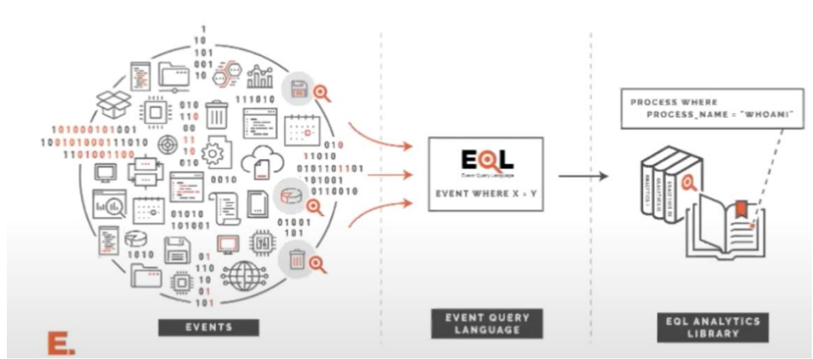

### 基础语法

#### 数据准备

要运行 EQL 搜索，搜索到的数据流或索引必须包含时间戳和事件类别字段。 默认情况下，EQL 使用 Elastic 通用模式（ECS）中的 @timestamp 和 event.category 字段。

@timestamp 表示时间戳，event.category 表示事件分类。

咱们准备一些简单的数据,用于表示电商网站页面跳转

```sh
# 创建索引
PUT /gmall

# 批量增加数据
PUT _bulk
{"index":{"_index":"gmall"}}
{"@timestamp":"2022-06-01T12:00:00.00+08:00", "event":{"category":"page"},"page" : {"session_id" : "42FC7E13-CB3E-5C05-0000-0010A0125101","last_page_id" : "","page_id" : "login","user_id" : ""}}
{"index":{"_index":"gmall"}}
{"@timestamp":"2022-06-01T12:01:00.00+08:00", "event":{"category":"page"},"page" : {"session_id" : "42FC7E13-CB3E-5C05-0000-0010A0125101","last_page_id" : "login","page_id" : "good_list","user_id" : "1"}}
{"index":{"_index":"gmall"}}
{"@timestamp":"2022-06-01T12:05:00.00+08:00", "event":{"category":"page"},"page" : {"session_id" : "42FC7E13-CB3E-5C05-0000-0010A0125101","last_page_id" : "good_list","page_id" : "good_detail","user_id" : "1"}}
{"index":{"_index":"gmall"}}
{"@timestamp":"2022-06-01T12:07:00.00+08:00", "event":{"category":"page"},"page" : {"session_id" : "42FC7E13-CB3E-5C05-0000-0010A0125101","last_page_id" : "good_detail","page_id" : "order","user_id" : "1"}}
{"index":{"_index":"gmall"}}
{"@timestamp":"2022-06-01T12:08:00.00+08:00", "event":{"category":"page"},"page" : {"session_id" : "42FC7E13-CB3E-5C05-0000-0010A0125101","last_page_id" : "order","page_id" : "payment","user_id" : "1"}}
{"index":{"_index":"gmall"}}
{"@timestamp":"2022-06-01T12:08:00.00+08:00", "event":{"category":"page"},"page" : {"session_id" : "42FC7E13-CB3E-5C05-0000-0010A0125102","last_page_id" : "","page_id" : "login","user_id" : "2"}}
{"index":{"_index":"gmall"}}
{"@timestamp":"2022-06-01T12:08:00.00+08:00", "event":{"category":"page"},"page" : {"session_id" : "42FC7E13-CB3E-5C05-0000-0010A0125102","last_page_id" : "login","page_id" : "payment","user_id" : "2"}}

```

#### 数据窗口搜索

在事件响应过程中，有很多时候，了解特定时间发生的所有事件是很有用的。使用一种名为any 的特殊事件类型，针对所有事件进行匹配，如果想要匹配特定事件，就需要指明事件分类名称

```sh
GET /gmall/_eql/search
{
 "query" : """
 any where page.user_id == "1"
 """
}
```

查询结果：

```json
{
  "is_partial" : false,
  "is_running" : false,
  "took" : 511,
  "timed_out" : false,
  "hits" : {
    "total" : {
      "value" : 4,
      "relation" : "eq"
    },
    "events" : [
      {
        "_index" : "gmall",
        "_id" : "6R14_IgBCaaR_R-J16ZD",
        "_source" : {
          "@timestamp" : "2022-06-01T12:01:00.00+08:00",
          "event" : {
            "category" : "page"
          },
          "page" : {
            "session_id" : "42FC7E13-CB3E-5C05-0000-0010A0125101",
            "last_page_id" : "login",
            "page_id" : "good_list",
            "user_id" : "1"
          }
        }
      },
      {
        "_index" : "gmall",
        "_id" : "6h14_IgBCaaR_R-J16ZD",
        "_source" : {
          "@timestamp" : "2022-06-01T12:05:00.00+08:00",
          "event" : {
            "category" : "page"
          },
          "page" : {
            "session_id" : "42FC7E13-CB3E-5C05-0000-0010A0125101",
            "last_page_id" : "good_list",
            "page_id" : "good_detail",
            "user_id" : "1"
          }
        }
      },
      {
        "_index" : "gmall",
        "_id" : "6x14_IgBCaaR_R-J16ZD",
        "_source" : {
          "@timestamp" : "2022-06-01T12:07:00.00+08:00",
          "event" : {
            "category" : "page"
          },
          "page" : {
            "session_id" : "42FC7E13-CB3E-5C05-0000-0010A0125101",
            "last_page_id" : "good_detail",
            "page_id" : "order",
            "user_id" : "1"
          }
        }
      },
      {
        "_index" : "gmall",
        "_id" : "7B14_IgBCaaR_R-J16ZD",
        "_source" : {
          "@timestamp" : "2022-06-01T12:08:00.00+08:00",
          "event" : {
            "category" : "page"
          },
          "page" : {
            "session_id" : "42FC7E13-CB3E-5C05-0000-0010A0125101",
            "last_page_id" : "order",
            "page_id" : "payment",
            "user_id" : "1"
          }
        }
      }
    ]
  }
}
```

#### 统计符合条件

```sh
GET /gmall/_eql/search
{
  "query": """
 any where true
 """,
  "filter": {
    "range": {
      "@timestamp": {
        "gte": "1654056000000",
        "lt": "1654056005000"
      }
    }
  }
}
```

查询结果：

```json
{
  "is_partial" : false,
  "is_running" : false,
  "took" : 133,
  "timed_out" : false,
  "hits" : {
    "total" : {
      "value" : 1,
      "relation" : "eq"
    },
    "events" : [
      {
        "_index" : "gmall",
        "_id" : "6B14_IgBCaaR_R-J1qan",
        "_source" : {
          "@timestamp" : "2022-06-01T12:00:00.00+08:00",
          "event" : {
            "category" : "page"
          },
          "page" : {
            "session_id" : "42FC7E13-CB3E-5C05-0000-0010A0125101",
            "last_page_id" : "",
            "page_id" : "login",
            "user_id" : ""
          }
        }
      }
    ]
  }
}
```

#### 事件序列

```sh
# 页面先访问 login,后面又访问了 good_detail 的页面
GET /gmall/_eql/search
{
  "query": """
   sequence by page.session_id
   [page where page.page_id=="login"]
   [page where page.page_id=="good_detail"]
 """
}
```

查询结果：

```json
{
  "is_partial" : false,
  "is_running" : false,
  "took" : 397,
  "timed_out" : false,
  "hits" : {
    "total" : {
      "value" : 1,
      "relation" : "eq"
    },
    "sequences" : [
      {
        "join_keys" : [
          "42FC7E13-CB3E-5C05-0000-0010A0125101"
        ],
        "events" : [
          {
            "_index" : "gmall",
            "_id" : "6B14_IgBCaaR_R-J1qan",
            "_source" : {
              "@timestamp" : "2022-06-01T12:00:00.00+08:00",
              "event" : {
                "category" : "page"
              },
              "page" : {
                "session_id" : "42FC7E13-CB3E-5C05-0000-0010A0125101",
                "last_page_id" : "",
                "page_id" : "login",
                "user_id" : ""
              }
            }
          },
          {
            "_index" : "gmall",
            "_id" : "6h14_IgBCaaR_R-J16ZD",
            "_source" : {
              "@timestamp" : "2022-06-01T12:05:00.00+08:00",
              "event" : {
                "category" : "page"
              },
              "page" : {
                "session_id" : "42FC7E13-CB3E-5C05-0000-0010A0125101",
                "last_page_id" : "good_list",
                "page_id" : "good_detail",
                "user_id" : "1"
              }
            }
          }
        ]
      }
    ]
  }
}
```

### 安全检测

EQL 在 Elastic Securit 中被广泛使用。实际应用时，我们可以使用 EQL 语言来进行检测安全威胁和其他可疑行为。

#### 1、数据准备

regsvr32.exe 是一个内置的命令行实用程序，用于在 Windows 中注册.dll 库。作为本机工具，regsvr32.exe 具有受信任的状态，从而使它可以绕过大多数允许列表软件和脚本阻止程序。 有权访问用户命令行的攻击者可以使用 regsvr32.exe 通过.dll 库运行恶意脚本，即使在其他情况下也不允许这些脚本运行。

regsvr32 滥用的一种常见变体是 Squfullydoo 攻击。在 Squfullydoo 攻击中，regsvr32.exe 命令使用 scrobj.dll 库注册并运行远程脚本。

测试数据来自 Atomic Red Team 的测试数据集，其中包括模仿 Squibledoo 攻击的事件。数据已映射到 Elastic 通用架构（ECS）字段：normalized-T1117-AtomicRed-regsvr32.json将文件内容导入到 ES 软件中：

```sh
# 创建索引
PUT my-eql-index
# 导入数据
POST my-eql-index/_bulk?pretty&refresh
```

详细数据如下：

```json
{"index":{}}
{ "process": { "parent": { "name": "powershell.exe", "entity_id": "{42FC7E13-C11D-5C05-0000-0010C6E90401}", "executable": "C:\\Windows\\System32\\WindowsPowerShell\\v1.0\\powershell.exe" }, "name": "cmd.exe", "pid": 2012, "entity_id": "{42FC7E13-CB3E-5C05-0000-0010A0125101}", "command_line": "\"C:\\WINDOWS\\system32\\cmd.exe\" /c \"for /R c: %%f in (*.docx) do copy %%f c:\\temp\\\"", "executable": "C:\\Windows\\System32\\cmd.exe", "ppid": 7036 }, "logon_id": 217055, "@timestamp": 131883571822010000, "event": { "category": "process", "type": "creation" }, "user": { "full_name": "bob", "domain": "ART-DESKTOP", "id": "ART-DESKTOP\\bob" } }
{"index":{}}
{ "process": { "name": "cmd.exe", "pid": 2012, "entity_id": "{42FC7E13-CB3E-5C05-0000-0010A0125101}", "executable": "C:\\Windows\\System32\\cmd.exe" }, "dll": { "path": "C:\\Windows\\System32\\cmd.exe", "name": "cmd.exe" }, "@timestamp": 131883571821990000, "event": { "category": "library" } }
{"index":{}}
{ "process": { "name": "cmd.exe", "pid": 2012, "entity_id": "{42FC7E13-CB3E-5C05-0000-0010A0125101}", "executable": "C:\\Windows\\System32\\cmd.exe" }, "dll": { "path": "C:\\Windows\\System32\\ntdll.dll", "name": "ntdll.dll" }, "@timestamp": 131883571821990000, "event": { "category": "library" } }
{"index":{}}
{ "process": { "name": "cmd.exe", "pid": 2012, "entity_id": "{42FC7E13-CB3E-5C05-0000-0010A0125101}", "executable": "C:\\Windows\\System32\\cmd.exe" }, "dll": { "path": "C:\\Windows\\System32\\kernel32.dll", "name": "kernel32.dll" }, "@timestamp": 131883571821990000, "event": { "category": "library" } }
{"index":{}}
{ "process": { "name": "cmd.exe", "pid": 2012, "entity_id": "{42FC7E13-CB3E-5C05-0000-0010A0125101}", "executable": "C:\\Windows\\System32\\cmd.exe" }, "dll": { "path": "C:\\Windows\\System32\\KernelBase.dll", "name": "KernelBase.dll" }, "@timestamp": 131883571821990000, "event": { "category": "library" } }
{"index":{}}
{ "process": { "name": "cmd.exe", "pid": 2012, "entity_id": "{42FC7E13-CB3E-5C05-0000-0010A0125101}", "executable": "C:\\Windows\\System32\\cmd.exe" }, "dll": { "path": "C:\\Windows\\System32\\msvcrt.dll", "name": "msvcrt.dll" }, "@timestamp": 131883571821990000, "event": { "category": "library" } }
{"index":{}}
{ "process": { "name": "cmd.exe", "pid": 2012, "entity_id": "{42FC7E13-CB3E-5C05-0000-0010A0125101}", "executable": "C:\\Windows\\System32\\cmd.exe" }, "@timestamp": 131883571822140000, "event": { "category": "process", "type": "terminate" } }
{"index":{}}
{ "process": { "parent": { "name": "cmd.exe", "entity_id": "{42FC7E13-CBCB-5C05-0000-0010AA385401}", "executable": "C:\\Windows\\System32\\cmd.exe" }, "name": "regsvr32.exe", "pid": 2012, "entity_id": "{42FC7E13-CBCB-5C05-0000-0010A0395401}", "command_line": "regsvr32.exe  /s /u /i:https://raw.githubusercontent.com/redcanaryco/atomic-red-team/master/atomics/T1117/RegSvr32.sct scrobj.dll", "executable": "C:\\Windows\\System32\\regsvr32.exe", "ppid": 2652 }, "logon_id": 217055, "@timestamp": 131883573237130000, "event": { "category": "process", "type": "creation" }, "user": { "full_name": "bob", "domain": "ART-DESKTOP", "id": "ART-DESKTOP\\bob" } }
{"index":{}}
{ "process": { "name": "regsvr32.exe", "pid": 2012, "entity_id": "{42FC7E13-CBCB-5C05-0000-0010A0395401}", "executable": "C:\\Windows\\System32\\regsvr32.exe" }, "dll": { "path": "C:\\Windows\\System32\\regsvr32.exe", "name": "regsvr32.exe" }, "@timestamp": 131883573237140000, "event": { "category": "library" } }
{"index":{}}
{ "process": { "name": "regsvr32.exe", "pid": 2012, "entity_id": "{42FC7E13-CBCB-5C05-0000-0010A0395401}", "executable": "C:\\Windows\\System32\\regsvr32.exe" }, "dll": { "path": "C:\\Windows\\System32\\ntdll.dll", "name": "ntdll.dll" }, "@timestamp": 131883573237140000, "event": { "category": "library" } }
{"index":{}}
{ "process": { "name": "regsvr32.exe", "pid": 2012, "entity_id": "{42FC7E13-CBCB-5C05-0000-0010A0395401}", "executable": "C:\\Windows\\System32\\regsvr32.exe" }, "dll": { "path": "C:\\Windows\\System32\\kernel32.dll", "name": "kernel32.dll" }, "@timestamp": 131883573237140000, "event": { "category": "library" } }
{"index":{}}
{ "process": { "name": "regsvr32.exe", "pid": 2012, "entity_id": "{42FC7E13-CBCB-5C05-0000-0010A0395401}", "executable": "C:\\Windows\\System32\\regsvr32.exe" }, "dll": { "path": "C:\\Windows\\System32\\KernelBase.dll", "name": "KernelBase.dll" }, "@timestamp": 131883573237140000, "event": { "category": "library" } }
{"index":{}}
{ "process": { "name": "regsvr32.exe", "pid": 2012, "entity_id": "{42FC7E13-CBCB-5C05-0000-0010A0395401}", "executable": "C:\\Windows\\System32\\regsvr32.exe" }, "dll": { "path": "C:\\Windows\\System32\\apphelp.dll", "name": "apphelp.dll" }, "@timestamp": 131883573237140000, "event": { "category": "library" } }
{"index":{}}
{ "process": { "name": "regsvr32.exe", "pid": 2012, "entity_id": "{42FC7E13-CBCB-5C05-0000-0010A0395401}", "executable": "C:\\Windows\\System32\\regsvr32.exe" }, "dll": { "path": "C:\\Windows\\System32\\AcLayers.dll", "name": "AcLayers.dll" }, "@timestamp": 131883573237140000, "event": { "category": "library" } }
{"index":{}}
{ "process": { "name": "regsvr32.exe", "pid": 2012, "entity_id": "{42FC7E13-CBCB-5C05-0000-0010A0395401}", "executable": "C:\\Windows\\System32\\regsvr32.exe" }, "dll": { "path": "C:\\Windows\\System32\\msvcrt.dll", "name": "msvcrt.dll" }, "@timestamp": 131883573237140000, "event": { "category": "library" } }
{"index":{}}
{ "process": { "name": "regsvr32.exe", "pid": 2012, "entity_id": "{42FC7E13-CBCB-5C05-0000-0010A0395401}", "executable": "C:\\Windows\\System32\\regsvr32.exe" }, "dll": { "path": "C:\\Windows\\System32\\user32.dll", "name": "user32.dll" }, "@timestamp": 131883573237140000, "event": { "category": "library" } }
{"index":{}}
{ "process": { "name": "regsvr32.exe", "pid": 2012, "entity_id": "{42FC7E13-CBCB-5C05-0000-0010A0395401}", "executable": "C:\\Windows\\System32\\regsvr32.exe" }, "dll": { "path": "C:\\Windows\\System32\\win32u.dll", "name": "win32u.dll" }, "@timestamp": 131883573237140000, "event": { "category": "library" } }
{"index":{}}
{ "process": { "name": "regsvr32.exe", "pid": 2012, "entity_id": "{42FC7E13-CBCB-5C05-0000-0010A0395401}", "executable": "C:\\Windows\\System32\\regsvr32.exe" }, "dll": { "path": "C:\\Windows\\System32\\gdi32.dll", "name": "gdi32.dll" }, "@timestamp": 131883573237140000, "event": { "category": "library" } }
{"index":{}}
{ "process": { "name": "regsvr32.exe", "pid": 2012, "entity_id": "{42FC7E13-CBCB-5C05-0000-0010A0395401}", "executable": "C:\\Windows\\System32\\regsvr32.exe" }, "dll": { "path": "C:\\Windows\\System32\\gdi32full.dll", "name": "gdi32full.dll" }, "@timestamp": 131883573237140000, "event": { "category": "library" } }
{"index":{}}
{ "process": { "name": "regsvr32.exe", "pid": 2012, "entity_id": "{42FC7E13-CBCB-5C05-0000-0010A0395401}", "executable": "C:\\Windows\\System32\\regsvr32.exe" }, "dll": { "path": "C:\\Windows\\System32\\msvcp_win.dll", "name": "msvcp_win.dll" }, "@timestamp": 131883573237140000, "event": { "category": "library" } }
{"index":{}}
{ "process": { "name": "regsvr32.exe", "pid": 2012, "entity_id": "{42FC7E13-CBCB-5C05-0000-0010A0395401}", "executable": "C:\\Windows\\System32\\regsvr32.exe" }, "dll": { "path": "C:\\Windows\\System32\\ucrtbase.dll", "name": "ucrtbase.dll" }, "@timestamp": 131883573237140000, "event": { "category": "library" } }
{"index":{}}
{ "process": { "name": "regsvr32.exe", "pid": 2012, "entity_id": "{42FC7E13-CBCB-5C05-0000-0010A0395401}", "executable": "C:\\Windows\\System32\\regsvr32.exe" }, "dll": { "path": "C:\\Windows\\System32\\shlwapi.dll", "name": "shlwapi.dll" }, "@timestamp": 131883573237140000, "event": { "category": "library" } }
{"index":{}}
{ "process": { "name": "regsvr32.exe", "pid": 2012, "entity_id": "{42FC7E13-CBCB-5C05-0000-0010A0395401}", "executable": "C:\\Windows\\System32\\regsvr32.exe" }, "dll": { "path": "C:\\Windows\\System32\\combase.dll", "name": "combase.dll" }, "@timestamp": 131883573237140000, "event": { "category": "library" } }
{"index":{}}
{ "process": { "name": "regsvr32.exe", "pid": 2012, "entity_id": "{42FC7E13-CBCB-5C05-0000-0010A0395401}", "executable": "C:\\Windows\\System32\\regsvr32.exe" }, "dll": { "path": "C:\\Windows\\System32\\rpcrt4.dll", "name": "rpcrt4.dll" }, "@timestamp": 131883573237140000, "event": { "category": "library" } }
{"index":{}}
{ "process": { "name": "regsvr32.exe", "pid": 2012, "entity_id": "{42FC7E13-CBCB-5C05-0000-0010A0395401}", "executable": "C:\\Windows\\System32\\regsvr32.exe" }, "dll": { "path": "C:\\Windows\\System32\\bcryptprimitives.dll", "name": "bcryptprimitives.dll" }, "@timestamp": 131883573237140000, "event": { "category": "library" } }
{"index":{}}
{ "process": { "name": "regsvr32.exe", "pid": 2012, "entity_id": "{42FC7E13-CBCB-5C05-0000-0010A0395401}", "executable": "C:\\Windows\\System32\\regsvr32.exe" }, "dll": { "path": "C:\\Windows\\System32\\sfc.dll", "name": "sfc.dll" }, "@timestamp": 131883573237140000, "event": { "category": "library" } }
{"index":{}}
{ "process": { "name": "regsvr32.exe", "pid": 2012, "entity_id": "{42FC7E13-CBCB-5C05-0000-0010A0395401}", "executable": "C:\\Windows\\System32\\regsvr32.exe" }, "dll": { "path": "C:\\Windows\\System32\\winspool.drv", "name": "winspool.drv" }, "@timestamp": 131883573237140000, "event": { "category": "library" } }
{"index":{}}
{ "process": { "name": "regsvr32.exe", "pid": 2012, "entity_id": "{42FC7E13-CBCB-5C05-0000-0010A0395401}", "executable": "C:\\Windows\\System32\\regsvr32.exe" }, "dll": { "path": "C:\\Windows\\System32\\kernel.appcore.dll", "name": "kernel.appcore.dll" }, "@timestamp": 131883573237140000, "event": { "category": "library" } }
{"index":{}}
{ "process": { "name": "regsvr32.exe", "pid": 2012, "entity_id": "{42FC7E13-CBCB-5C05-0000-0010A0395401}", "executable": "C:\\Windows\\System32\\regsvr32.exe" }, "dll": { "path": "C:\\Windows\\System32\\propsys.dll", "name": "propsys.dll" }, "@timestamp": 131883573237140000, "event": { "category": "library" } }
{"index":{}}
{ "process": { "name": "regsvr32.exe", "pid": 2012, "entity_id": "{42FC7E13-CBCB-5C05-0000-0010A0395401}", "executable": "C:\\Windows\\System32\\regsvr32.exe" }, "dll": { "path": "C:\\Windows\\System32\\oleaut32.dll", "name": "oleaut32.dll" }, "@timestamp": 131883573237140000, "event": { "category": "library" } }
{"index":{}}
{ "process": { "name": "regsvr32.exe", "pid": 2012, "entity_id": "{42FC7E13-CBCB-5C05-0000-0010A0395401}", "executable": "C:\\Windows\\System32\\regsvr32.exe" }, "dll": { "path": "C:\\Windows\\System32\\SHCore.dll", "name": "SHCore.dll" }, "@timestamp": 131883573237140000, "event": { "category": "library" } }
{"index":{}}
{ "process": { "name": "regsvr32.exe", "pid": 2012, "entity_id": "{42FC7E13-CBCB-5C05-0000-0010A0395401}", "executable": "C:\\Windows\\System32\\regsvr32.exe" }, "dll": { "path": "C:\\Windows\\System32\\sechost.dll", "name": "sechost.dll" }, "@timestamp": 131883573237300000, "event": { "category": "library" } }
{"index":{}}
{ "process": { "name": "regsvr32.exe", "pid": 2012, "entity_id": "{42FC7E13-CBCB-5C05-0000-0010A0395401}", "executable": "C:\\Windows\\System32\\regsvr32.exe" }, "dll": { "path": "C:\\Windows\\System32\\IPHLPAPI.DLL", "name": "IPHLPAPI.DLL" }, "@timestamp": 131883573237300000, "event": { "category": "library" } }
{"index":{}}
{ "process": { "name": "regsvr32.exe", "pid": 2012, "entity_id": "{42FC7E13-CBCB-5C05-0000-0010A0395401}", "executable": "C:\\Windows\\System32\\regsvr32.exe" }, "dll": { "path": "C:\\Windows\\System32\\bcrypt.dll", "name": "bcrypt.dll" }, "@timestamp": 131883573237300000, "event": { "category": "library" } }
{"index":{}}
{ "process": { "name": "regsvr32.exe", "pid": 2012, "entity_id": "{42FC7E13-CBCB-5C05-0000-0010A0395401}", "executable": "C:\\Windows\\System32\\regsvr32.exe" }, "dll": { "path": "C:\\Windows\\System32\\sfc.dll", "name": "sfc.dll" }, "@timestamp": 131883573237300000, "event": { "category": "library" } }
{"index":{}}
{ "process": { "name": "regsvr32.exe", "pid": 2012, "entity_id": "{42FC7E13-CBCB-5C05-0000-0010A0395401}", "executable": "C:\\Windows\\System32\\regsvr32.exe" }, "dll": { "path": "C:\\Windows\\System32\\sfc_os.dll", "name": "sfc_os.dll" }, "@timestamp": 131883573237300000, "event": { "category": "library" } }
{"index":{}}
{ "process": { "name": "regsvr32.exe", "pid": 2012, "entity_id": "{42FC7E13-CBCB-5C05-0000-0010A0395401}", "executable": "C:\\Windows\\System32\\regsvr32.exe" }, "dll": { "path": "C:\\Windows\\System32\\imm32.dll", "name": "imm32.dll" }, "@timestamp": 131883573237300000, "event": { "category": "library" } }
{"index":{}}
{ "process": { "name": "regsvr32.exe", "pid": 2012, "entity_id": "{42FC7E13-CBCB-5C05-0000-0010A0395401}", "executable": "C:\\Windows\\System32\\regsvr32.exe" }, "dll": { "path": "C:\\Windows\\System32\\ole32.dll", "name": "ole32.dll" }, "@timestamp": 131883573237300000, "event": { "category": "library" } }
{"index":{}}
{ "process": { "name": "regsvr32.exe", "pid": 2012, "entity_id": "{42FC7E13-CBCB-5C05-0000-0010A0395401}", "executable": "C:\\Windows\\System32\\regsvr32.exe" }, "dll": { "path": "C:\\Windows\\System32\\uxtheme.dll", "name": "uxtheme.dll" }, "@timestamp": 131883573237300000, "event": { "category": "library" } }
{"index":{}}
{ "process": { "name": "regsvr32.exe", "pid": 2012, "entity_id": "{42FC7E13-CBCB-5C05-0000-0010A0395401}", "executable": "C:\\Windows\\System32\\regsvr32.exe" }, "dll": { "path": "C:\\Windows\\System32\\scrobj.dll", "name": "scrobj.dll" }, "@timestamp": 131883573237450016, "event": { "category": "library" } }
{"index":{}}
{ "process": { "name": "regsvr32.exe", "pid": 2012, "entity_id": "{42FC7E13-CBCB-5C05-0000-0010A0395401}", "executable": "C:\\Windows\\System32\\regsvr32.exe" }, "dll": { "path": "C:\\Windows\\System32\\advapi32.dll", "name": "advapi32.dll" }, "@timestamp": 131883573237450016, "event": { "category": "library" } }
{"index":{}}
{ "process": { "name": "regsvr32.exe", "pid": 2012, "entity_id": "{42FC7E13-CBCB-5C05-0000-0010A0395401}", "executable": "C:\\Windows\\System32\\regsvr32.exe" }, "dll": { "path": "C:\\Windows\\System32\\urlmon.dll", "name": "urlmon.dll" }, "@timestamp": 131883573237450016, "event": { "category": "library" } }
{"index":{}}
{ "process": { "name": "regsvr32.exe", "pid": 2012, "entity_id": "{42FC7E13-CBCB-5C05-0000-0010A0395401}", "executable": "C:\\Windows\\System32\\regsvr32.exe" }, "dll": { "path": "C:\\Windows\\System32\\windows.storage.dll", "name": "windows.storage.dll" }, "@timestamp": 131883573237450016, "event": { "category": "library" } }
{"index":{}}
{ "process": { "name": "regsvr32.exe", "pid": 2012, "entity_id": "{42FC7E13-CBCB-5C05-0000-0010A0395401}", "executable": "C:\\Windows\\System32\\regsvr32.exe" }, "dll": { "path": "C:\\Windows\\System32\\profapi.dll", "name": "profapi.dll" }, "@timestamp": 131883573237450016, "event": { "category": "library" } }
{"index":{}}
{ "process": { "name": "regsvr32.exe", "pid": 2012, "entity_id": "{42FC7E13-CBCB-5C05-0000-0010A0395401}", "executable": "C:\\Windows\\System32\\regsvr32.exe" }, "dll": { "path": "C:\\Windows\\System32\\powrprof.dll", "name": "powrprof.dll" }, "@timestamp": 131883573237450016, "event": { "category": "library" } }
{"index":{}}
{ "process": { "name": "regsvr32.exe", "pid": 2012, "entity_id": "{42FC7E13-CBCB-5C05-0000-0010A0395401}", "executable": "C:\\Windows\\System32\\regsvr32.exe" }, "dll": { "path": "C:\\Windows\\System32\\iertutil.dll", "name": "iertutil.dll" }, "@timestamp": 131883573237450016, "event": { "category": "library" } }
{"index":{}}
{ "process": { "name": "regsvr32.exe", "pid": 2012, "entity_id": "{42FC7E13-CBCB-5C05-0000-0010A0395401}", "executable": "C:\\Windows\\System32\\regsvr32.exe" }, "dll": { "path": "C:\\Windows\\System32\\fltLib.dll", "name": "fltLib.dll" }, "@timestamp": 131883573237450016, "event": { "category": "library" } }
{"index":{}}
{ "process": { "name": "regsvr32.exe", "pid": 2012, "entity_id": "{42FC7E13-CBCB-5C05-0000-0010A0395401}", "executable": "C:\\Windows\\System32\\regsvr32.exe" }, "dll": { "path": "C:\\Windows\\System32\\cryptbase.dll", "name": "cryptbase.dll" }, "@timestamp": 131883573237450016, "event": { "category": "library" } }
{"index":{}}
{ "process": { "name": "regsvr32.exe", "pid": 2012, "entity_id": "{42FC7E13-CBCB-5C05-0000-0010A0395401}", "executable": "C:\\Windows\\System32\\regsvr32.exe" }, "dll": { "path": "C:\\Windows\\System32\\dwmapi.dll", "name": "dwmapi.dll" }, "@timestamp": 131883573237450016, "event": { "category": "library" } }
{"index":{}}
{ "process": { "name": "regsvr32.exe", "pid": 2012, "entity_id": "{42FC7E13-CBCB-5C05-0000-0010A0395401}", "executable": "C:\\Windows\\System32\\regsvr32.exe" }, "dll": { "path": "C:\\Windows\\System32\\sspicli.dll", "name": "sspicli.dll" }, "@timestamp": 131883573237930000, "event": { "category": "library" } }
{"index":{}}
{ "process": { "name": "regsvr32.exe", "pid": 2012, "entity_id": "{42FC7E13-CBCB-5C05-0000-0010A0395401}", "executable": "C:\\Windows\\System32\\regsvr32.exe" }, "dll": { "path": "C:\\Windows\\System32\\ws2_32.dll", "name": "ws2_32.dll" }, "@timestamp": 131883573237930000, "event": { "category": "library" } }
{"index":{}}
{ "process": { "name": "regsvr32.exe", "pid": 2012, "entity_id": "{42FC7E13-CBCB-5C05-0000-0010A0395401}", "executable": "C:\\Windows\\System32\\regsvr32.exe" }, "dll": { "path": "C:\\Windows\\System32\\OnDemandConnRouteHelper.dll", "name": "OnDemandConnRouteHelper.dll" }, "@timestamp": 131883573237930000, "event": { "category": "library" } }
{"index":{}}
{ "process": { "name": "regsvr32.exe", "pid": 2012, "entity_id": "{42FC7E13-CBCB-5C05-0000-0010A0395401}", "executable": "C:\\Windows\\System32\\regsvr32.exe" }, "dll": { "path": "C:\\Windows\\System32\\winhttp.dll", "name": "winhttp.dll" }, "@timestamp": 131883573237930000, "event": { "category": "library" } }
{"index":{}}
{ "registry": { "path": "HKU\\S-1-5-21-2047549730-3016700585-885829632-1000\\Software\\Microsoft\\Windows\\CurrentVersion\\Internet Settings\\ZoneMap", "value": "ZoneMap", "key": "HKU\\S-1-5-21-2047549730-3016700585-885829632-1000\\Software\\Microsoft\\Windows\\CurrentVersion\\Internet Settings" }, "process": { "name": "regsvr32.exe", "pid": 2012, "entity_id": "{42FC7E13-CBCB-5C05-0000-0010A0395401}", "executable": "C:\\WINDOWS\\system32\\regsvr32.exe" }, "@timestamp": 131883573237930000, "event": { "category": "registry" } }
{"index":{}}
{ "registry": { "path": "HKU\\S-1-5-21-2047549730-3016700585-885829632-1000\\Software\\Microsoft\\Windows\\CurrentVersion\\Internet Settings\\ZoneMap\\ProxyBypass", "value": "ProxyBypass", "key": "HKU\\S-1-5-21-2047549730-3016700585-885829632-1000\\Software\\Microsoft\\Windows\\CurrentVersion\\Internet Settings\\ZoneMap" }, "process": { "name": "regsvr32.exe", "pid": 2012, "entity_id": "{42FC7E13-CBCB-5C05-0000-0010A0395401}", "executable": "C:\\WINDOWS\\system32\\regsvr32.exe" }, "@timestamp": 131883573237930000, "event": { "category": "registry" } }
{"index":{}}
{ "registry": { "path": "HKU\\S-1-5-21-2047549730-3016700585-885829632-1000\\Software\\Microsoft\\Windows\\CurrentVersion\\Internet Settings\\ZoneMap\\IntranetName", "value": "IntranetName", "key": "HKU\\S-1-5-21-2047549730-3016700585-885829632-1000\\Software\\Microsoft\\Windows\\CurrentVersion\\Internet Settings\\ZoneMap" }, "process": { "name": "regsvr32.exe", "pid": 2012, "entity_id": "{42FC7E13-CBCB-5C05-0000-0010A0395401}", "executable": "C:\\WINDOWS\\system32\\regsvr32.exe" }, "@timestamp": 131883573237930000, "event": { "category": "registry" } }
{"index":{}}
{ "registry": { "path": "HKU\\S-1-5-21-2047549730-3016700585-885829632-1000\\Software\\Microsoft\\Windows\\CurrentVersion\\Internet Settings\\ZoneMap\\UNCAsIntranet", "value": "UNCAsIntranet", "key": "HKU\\S-1-5-21-2047549730-3016700585-885829632-1000\\Software\\Microsoft\\Windows\\CurrentVersion\\Internet Settings\\ZoneMap" }, "process": { "name": "regsvr32.exe", "pid": 2012, "entity_id": "{42FC7E13-CBCB-5C05-0000-0010A0395401}", "executable": "C:\\WINDOWS\\system32\\regsvr32.exe" }, "@timestamp": 131883573237930000, "event": { "category": "registry" } }
{"index":{}}
{ "registry": { "path": "HKU\\S-1-5-21-2047549730-3016700585-885829632-1000\\Software\\Microsoft\\Windows\\CurrentVersion\\Internet Settings\\ZoneMap\\AutoDetect", "value": "AutoDetect", "key": "HKU\\S-1-5-21-2047549730-3016700585-885829632-1000\\Software\\Microsoft\\Windows\\CurrentVersion\\Internet Settings\\ZoneMap" }, "process": { "name": "regsvr32.exe", "pid": 2012, "entity_id": "{42FC7E13-CBCB-5C05-0000-0010A0395401}", "executable": "C:\\WINDOWS\\system32\\regsvr32.exe" }, "@timestamp": 131883573237930000, "event": { "category": "registry" } }
{"index":{}}
{ "registry": { "path": "HKU\\S-1-5-21-2047549730-3016700585-885829632-1000\\Software\\Microsoft\\Windows\\CurrentVersion\\Internet Settings\\ZoneMap\\ProxyBypass", "value": "ProxyBypass", "key": "HKU\\S-1-5-21-2047549730-3016700585-885829632-1000\\Software\\Microsoft\\Windows\\CurrentVersion\\Internet Settings\\ZoneMap" }, "process": { "name": "regsvr32.exe", "pid": 2012, "entity_id": "{42FC7E13-CBCB-5C05-0000-0010A0395401}", "executable": "C:\\WINDOWS\\system32\\regsvr32.exe" }, "@timestamp": 131883573237930000, "event": { "category": "registry" } }
{"index":{}}
{ "registry": { "path": "HKU\\S-1-5-21-2047549730-3016700585-885829632-1000\\Software\\Microsoft\\Windows\\CurrentVersion\\Internet Settings\\ZoneMap\\IntranetName", "value": "IntranetName", "key": "HKU\\S-1-5-21-2047549730-3016700585-885829632-1000\\Software\\Microsoft\\Windows\\CurrentVersion\\Internet Settings\\ZoneMap" }, "process": { "name": "regsvr32.exe", "pid": 2012, "entity_id": "{42FC7E13-CBCB-5C05-0000-0010A0395401}", "executable": "C:\\WINDOWS\\system32\\regsvr32.exe" }, "@timestamp": 131883573237930000, "event": { "category": "registry" } }
{"index":{}}
{ "registry": { "path": "HKU\\S-1-5-21-2047549730-3016700585-885829632-1000\\Software\\Microsoft\\Windows\\CurrentVersion\\Internet Settings\\ZoneMap\\UNCAsIntranet", "value": "UNCAsIntranet", "key": "HKU\\S-1-5-21-2047549730-3016700585-885829632-1000\\Software\\Microsoft\\Windows\\CurrentVersion\\Internet Settings\\ZoneMap" }, "process": { "name": "regsvr32.exe", "pid": 2012, "entity_id": "{42FC7E13-CBCB-5C05-0000-0010A0395401}", "executable": "C:\\WINDOWS\\system32\\regsvr32.exe" }, "@timestamp": 131883573237930000, "event": { "category": "registry" } }
{"index":{}}
{ "registry": { "path": "HKU\\S-1-5-21-2047549730-3016700585-885829632-1000\\Software\\Microsoft\\Windows\\CurrentVersion\\Internet Settings\\ZoneMap\\AutoDetect", "value": "AutoDetect", "key": "HKU\\S-1-5-21-2047549730-3016700585-885829632-1000\\Software\\Microsoft\\Windows\\CurrentVersion\\Internet Settings\\ZoneMap" }, "process": { "name": "regsvr32.exe", "pid": 2012, "entity_id": "{42FC7E13-CBCB-5C05-0000-0010A0395401}", "executable": "C:\\WINDOWS\\system32\\regsvr32.exe" }, "@timestamp": 131883573237930000, "event": { "category": "registry" } }
{"index":{}}
{ "process": { "name": "regsvr32.exe", "pid": 2012, "entity_id": "{42FC7E13-CBCB-5C05-0000-0010A0395401}", "executable": "C:\\Windows\\System32\\regsvr32.exe" }, "dll": { "path": "C:\\Windows\\System32\\nsi.dll", "name": "nsi.dll" }, "@timestamp": 131883573238080000, "event": { "category": "library" } }
{"index":{}}
{ "process": { "name": "regsvr32.exe", "pid": 2012, "entity_id": "{42FC7E13-CBCB-5C05-0000-0010A0395401}", "executable": "C:\\Windows\\System32\\regsvr32.exe" }, "dll": { "path": "C:\\Windows\\System32\\mswsock.dll", "name": "mswsock.dll" }, "@timestamp": 131883573238080000, "event": { "category": "library" } }
{"index":{}}
{ "process": { "name": "regsvr32.exe", "pid": 2012, "entity_id": "{42FC7E13-CBCB-5C05-0000-0010A0395401}", "executable": "C:\\Windows\\System32\\regsvr32.exe" }, "dll": { "path": "C:\\Windows\\System32\\winnsi.dll", "name": "winnsi.dll" }, "@timestamp": 131883573238080000, "event": { "category": "library" } }
{"index":{}}
{ "process": { "name": "regsvr32.exe", "pid": 2012, "entity_id": "{42FC7E13-CBCB-5C05-0000-0010A0395401}", "executable": "C:\\Windows\\System32\\regsvr32.exe" }, "dll": { "path": "C:\\Windows\\System32\\crypt32.dll", "name": "crypt32.dll" }, "@timestamp": 131883573238080000, "event": { "category": "library" } }
{"index":{}}
{ "process": { "name": "regsvr32.exe", "pid": 2012, "entity_id": "{42FC7E13-CBCB-5C05-0000-0010A0395401}", "executable": "C:\\Windows\\System32\\regsvr32.exe" }, "dll": { "path": "C:\\Windows\\System32\\msasn1.dll", "name": "msasn1.dll" }, "@timestamp": 131883573238230000, "event": { "category": "library" } }
{"index":{}}
{ "process": { "name": "regsvr32.exe", "pid": 2012, "entity_id": "{42FC7E13-CBCB-5C05-0000-0010A0395401}", "executable": "C:\\Windows\\System32\\regsvr32.exe" }, "dll": { "path": "C:\\Windows\\System32\\dpapi.dll", "name": "dpapi.dll" }, "@timestamp": 131883573238230000, "event": { "category": "library" } }
{"index":{}}
{ "process": { "name": "regsvr32.exe", "pid": 2012, "entity_id": "{42FC7E13-CBCB-5C05-0000-0010A0395401}", "executable": "C:\\Windows\\System32\\regsvr32.exe" }, "dll": { "path": "C:\\Windows\\System32\\wintrust.dll", "name": "wintrust.dll" }, "@timestamp": 131883573238230000, "event": { "category": "library" } }
{"index":{}}
{ "process": { "name": "regsvr32.exe", "pid": 2012, "entity_id": "{42FC7E13-CBCB-5C05-0000-0010A0395401}", "executable": "C:\\Windows\\System32\\regsvr32.exe" }, "dll": { "path": "C:\\Windows\\System32\\cryptsp.dll", "name": "cryptsp.dll" }, "@timestamp": 131883573238230000, "event": { "category": "library" } }
{"index":{}}
{ "process": { "name": "regsvr32.exe", "pid": 2012, "entity_id": "{42FC7E13-CBCB-5C05-0000-0010A0395401}", "executable": "C:\\Windows\\System32\\regsvr32.exe" }, "dll": { "path": "C:\\Windows\\System32\\rsaenh.dll", "name": "rsaenh.dll" }, "@timestamp": 131883573238230000, "event": { "category": "library" } }
{"index":{}}
{ "registry": { "path": "HKU\\S-1-5-21-2047549730-3016700585-885829632-1000\\Software\\Microsoft\\Windows\\CurrentVersion\\WinTrust\\Trust Providers\\Software Publishing", "value": "Software Publishing", "key": "HKU\\S-1-5-21-2047549730-3016700585-885829632-1000\\Software\\Microsoft\\Windows\\CurrentVersion\\WinTrust\\Trust Providers" }, "process": { "name": "regsvr32.exe", "pid": 2012, "entity_id": "{42FC7E13-CBCB-5C05-0000-0010A0395401}", "executable": "C:\\WINDOWS\\system32\\regsvr32.exe" }, "@timestamp": 131883573238230000, "event": { "category": "registry" } }
{"index":{}}
{ "registry": { "path": "HKLM\\SOFTWARE\\Microsoft\\SystemCertificates\\ROOT", "value": "ROOT", "key": "HKLM\\SOFTWARE\\Microsoft\\SystemCertificates" }, "process": { "name": "regsvr32.exe", "pid": 2012, "entity_id": "{42FC7E13-CBCB-5C05-0000-0010A0395401}", "executable": "C:\\WINDOWS\\system32\\regsvr32.exe" }, "@timestamp": 131883573238230000, "event": { "category": "registry" } }
{"index":{}}
{ "registry": { "path": "HKLM\\SOFTWARE\\Microsoft\\SystemCertificates\\ROOT", "value": "ROOT", "key": "HKLM\\SOFTWARE\\Microsoft\\SystemCertificates" }, "process": { "name": "regsvr32.exe", "pid": 2012, "entity_id": "{42FC7E13-CBCB-5C05-0000-0010A0395401}", "executable": "C:\\WINDOWS\\system32\\regsvr32.exe" }, "@timestamp": 131883573238230000, "event": { "category": "registry" } }
{"index":{}}
{ "registry": { "path": "HKLM\\SOFTWARE\\Microsoft\\SystemCertificates\\AuthRoot", "value": "AuthRoot", "key": "HKLM\\SOFTWARE\\Microsoft\\SystemCertificates" }, "process": { "name": "regsvr32.exe", "pid": 2012, "entity_id": "{42FC7E13-CBCB-5C05-0000-0010A0395401}", "executable": "C:\\WINDOWS\\system32\\regsvr32.exe" }, "@timestamp": 131883573238230000, "event": { "category": "registry" } }
{"index":{}}
{ "registry": { "path": "HKLM\\SOFTWARE\\Microsoft\\EnterpriseCertificates\\Root", "value": "Root", "key": "HKLM\\SOFTWARE\\Microsoft\\EnterpriseCertificates" }, "process": { "name": "regsvr32.exe", "pid": 2012, "entity_id": "{42FC7E13-CBCB-5C05-0000-0010A0395401}", "executable": "C:\\WINDOWS\\system32\\regsvr32.exe" }, "@timestamp": 131883573238230000, "event": { "category": "registry" } }
{"index":{}}
{ "registry": { "path": "HKLM\\SOFTWARE\\Microsoft\\EnterpriseCertificates\\Root", "value": "Root", "key": "HKLM\\SOFTWARE\\Microsoft\\EnterpriseCertificates" }, "process": { "name": "regsvr32.exe", "pid": 2012, "entity_id": "{42FC7E13-CBCB-5C05-0000-0010A0395401}", "executable": "C:\\WINDOWS\\system32\\regsvr32.exe" }, "@timestamp": 131883573238230000, "event": { "category": "registry" } }
{"index":{}}
{ "registry": { "path": "HKLM\\SOFTWARE\\Microsoft\\SystemCertificates\\SmartCardRoot", "value": "SmartCardRoot", "key": "HKLM\\SOFTWARE\\Microsoft\\SystemCertificates" }, "process": { "name": "regsvr32.exe", "pid": 2012, "entity_id": "{42FC7E13-CBCB-5C05-0000-0010A0395401}", "executable": "C:\\WINDOWS\\system32\\regsvr32.exe" }, "@timestamp": 131883573238230000, "event": { "category": "registry" } }
{"index":{}}
{ "registry": { "path": "HKLM\\SOFTWARE\\Microsoft\\SystemCertificates\\CA", "value": "CA", "key": "HKLM\\SOFTWARE\\Microsoft\\SystemCertificates" }, "process": { "name": "regsvr32.exe", "pid": 2012, "entity_id": "{42FC7E13-CBCB-5C05-0000-0010A0395401}", "executable": "C:\\WINDOWS\\system32\\regsvr32.exe" }, "@timestamp": 131883573238230000, "event": { "category": "registry" } }
{"index":{}}
{ "registry": { "path": "HKLM\\SOFTWARE\\Microsoft\\SystemCertificates\\CA", "value": "CA", "key": "HKLM\\SOFTWARE\\Microsoft\\SystemCertificates" }, "process": { "name": "regsvr32.exe", "pid": 2012, "entity_id": "{42FC7E13-CBCB-5C05-0000-0010A0395401}", "executable": "C:\\WINDOWS\\system32\\regsvr32.exe" }, "@timestamp": 131883573238230000, "event": { "category": "registry" } }
{"index":{}}
{ "registry": { "path": "HKLM\\SOFTWARE\\Microsoft\\EnterpriseCertificates\\CA", "value": "CA", "key": "HKLM\\SOFTWARE\\Microsoft\\EnterpriseCertificates" }, "process": { "name": "regsvr32.exe", "pid": 2012, "entity_id": "{42FC7E13-CBCB-5C05-0000-0010A0395401}", "executable": "C:\\WINDOWS\\system32\\regsvr32.exe" }, "@timestamp": 131883573238230000, "event": { "category": "registry" } }
{"index":{}}
{ "registry": { "path": "HKLM\\SOFTWARE\\Microsoft\\EnterpriseCertificates\\CA", "value": "CA", "key": "HKLM\\SOFTWARE\\Microsoft\\EnterpriseCertificates" }, "process": { "name": "regsvr32.exe", "pid": 2012, "entity_id": "{42FC7E13-CBCB-5C05-0000-0010A0395401}", "executable": "C:\\WINDOWS\\system32\\regsvr32.exe" }, "@timestamp": 131883573238230000, "event": { "category": "registry" } }
{"index":{}}
{ "registry": { "path": "HKLM\\SOFTWARE\\Policies\\Microsoft\\SystemCertificates\\Root", "value": "Root", "key": "HKLM\\SOFTWARE\\Policies\\Microsoft\\SystemCertificates" }, "process": { "name": "regsvr32.exe", "pid": 2012, "entity_id": "{42FC7E13-CBCB-5C05-0000-0010A0395401}", "executable": "C:\\WINDOWS\\system32\\regsvr32.exe" }, "@timestamp": 131883573238230000, "event": { "category": "registry" } }
{"index":{}}
{ "registry": { "path": "HKLM\\SOFTWARE\\Policies\\Microsoft\\SystemCertificates\\CA", "value": "CA", "key": "HKLM\\SOFTWARE\\Policies\\Microsoft\\SystemCertificates" }, "process": { "name": "regsvr32.exe", "pid": 2012, "entity_id": "{42FC7E13-CBCB-5C05-0000-0010A0395401}", "executable": "C:\\WINDOWS\\system32\\regsvr32.exe" }, "@timestamp": 131883573238230000, "event": { "category": "registry" } }
{"index":{}}
{ "registry": { "path": "HKU\\S-1-5-21-2047549730-3016700585-885829632-1000\\Software\\Microsoft\\Windows\\CurrentVersion\\Internet Settings\\5.0\\Cache\\Content\\CachePrefix", "value": "CachePrefix", "key": "HKU\\S-1-5-21-2047549730-3016700585-885829632-1000\\Software\\Microsoft\\Windows\\CurrentVersion\\Internet Settings\\5.0\\Cache\\Content" }, "process": { "name": "regsvr32.exe", "pid": 2012, "entity_id": "{42FC7E13-CBCB-5C05-0000-0010A0395401}", "executable": "C:\\WINDOWS\\system32\\regsvr32.exe" }, "@timestamp": 131883573238230000, "event": { "category": "registry" } }
{"index":{}}
{ "registry": { "path": "HKU\\S-1-5-21-2047549730-3016700585-885829632-1000\\Software\\Microsoft\\Windows\\CurrentVersion\\Internet Settings\\5.0\\Cache\\Cookies\\CachePrefix", "value": "CachePrefix", "key": "HKU\\S-1-5-21-2047549730-3016700585-885829632-1000\\Software\\Microsoft\\Windows\\CurrentVersion\\Internet Settings\\5.0\\Cache\\Cookies" }, "process": { "name": "regsvr32.exe", "pid": 2012, "entity_id": "{42FC7E13-CBCB-5C05-0000-0010A0395401}", "executable": "C:\\WINDOWS\\system32\\regsvr32.exe" }, "@timestamp": 131883573238230000, "event": { "category": "registry" } }
{"index":{}}
{ "registry": { "path": "HKU\\S-1-5-21-2047549730-3016700585-885829632-1000\\Software\\Microsoft\\Windows\\CurrentVersion\\Internet Settings\\5.0\\Cache\\History\\CachePrefix", "value": "CachePrefix", "key": "HKU\\S-1-5-21-2047549730-3016700585-885829632-1000\\Software\\Microsoft\\Windows\\CurrentVersion\\Internet Settings\\5.0\\Cache\\History" }, "process": { "name": "regsvr32.exe", "pid": 2012, "entity_id": "{42FC7E13-CBCB-5C05-0000-0010A0395401}", "executable": "C:\\WINDOWS\\system32\\regsvr32.exe" }, "@timestamp": 131883573238230000, "event": { "category": "registry" } }
{"index":{}}
{ "process": { "name": "regsvr32.exe", "pid": 2012, "entity_id": "{42FC7E13-CBCB-5C05-0000-0010A0395401}", "executable": "C:\\Windows\\System32\\regsvr32.exe" }, "dll": { "path": "C:\\Windows\\System32\\dnsapi.dll", "name": "dnsapi.dll" }, "@timestamp": 131883573238230000, "event": { "category": "library" } }
{"index":{}}
{ "registry": { "path": "HKLM\\System\\CurrentControlSet\\Services\\Tcpip\\Parameters", "value": "Parameters", "key": "HKLM\\System\\CurrentControlSet\\Services\\Tcpip" }, "process": { "name": "regsvr32.exe", "pid": 2012, "entity_id": "{42FC7E13-CBCB-5C05-0000-0010A0395401}", "executable": "C:\\WINDOWS\\system32\\regsvr32.exe" }, "@timestamp": 131883573238230000, "event": { "category": "registry" } }
{"index":{}}
{ "registry": { "path": "HKLM\\System\\CurrentControlSet\\Services\\Tcpip\\Parameters", "value": "Parameters", "key": "HKLM\\System\\CurrentControlSet\\Services\\Tcpip" }, "process": { "name": "regsvr32.exe", "pid": 2012, "entity_id": "{42FC7E13-CBCB-5C05-0000-0010A0395401}", "executable": "C:\\WINDOWS\\system32\\regsvr32.exe" }, "@timestamp": 131883573238230000, "event": { "category": "registry" } }
{"index":{}}
{ "registry": { "path": "HKLM\\System\\CurrentControlSet\\Services\\Tcpip\\Parameters", "value": "Parameters", "key": "HKLM\\System\\CurrentControlSet\\Services\\Tcpip" }, "process": { "name": "regsvr32.exe", "pid": 2012, "entity_id": "{42FC7E13-CBCB-5C05-0000-0010A0395401}", "executable": "C:\\WINDOWS\\system32\\regsvr32.exe" }, "@timestamp": 131883573238230000, "event": { "category": "registry" } }
{"index":{}}
{ "process": { "name": "regsvr32.exe", "pid": 2012, "entity_id": "{42FC7E13-CBCB-5C05-0000-0010A0395401}", "executable": "C:\\Windows\\System32\\regsvr32.exe" }, "dll": { "path": "C:\\Windows\\System32\\rasadhlp.dll", "name": "rasadhlp.dll" }, "@timestamp": 131883573238230000, "event": { "category": "library" } }
{"index":{}}
{ "registry": { "path": "HKLM\\System\\CurrentControlSet\\Services\\Tcpip\\Parameters", "value": "Parameters", "key": "HKLM\\System\\CurrentControlSet\\Services\\Tcpip" }, "process": { "name": "regsvr32.exe", "pid": 2012, "entity_id": "{42FC7E13-CBCB-5C05-0000-0010A0395401}", "executable": "C:\\WINDOWS\\system32\\regsvr32.exe" }, "@timestamp": 131883573238230000, "event": { "category": "registry" } }
{"index":{}}
{ "registry": { "path": "HKLM\\System\\CurrentControlSet\\Services\\Tcpip\\Parameters", "value": "Parameters", "key": "HKLM\\System\\CurrentControlSet\\Services\\Tcpip" }, "process": { "name": "regsvr32.exe", "pid": 2012, "entity_id": "{42FC7E13-CBCB-5C05-0000-0010A0395401}", "executable": "C:\\WINDOWS\\system32\\regsvr32.exe" }, "@timestamp": 131883573238230000, "event": { "category": "registry" } }
{"index":{}}
{ "registry": { "path": "HKLM\\System\\CurrentControlSet\\Services\\Tcpip\\Parameters", "value": "Parameters", "key": "HKLM\\System\\CurrentControlSet\\Services\\Tcpip" }, "process": { "name": "regsvr32.exe", "pid": 2012, "entity_id": "{42FC7E13-CBCB-5C05-0000-0010A0395401}", "executable": "C:\\WINDOWS\\system32\\regsvr32.exe" }, "@timestamp": 131883573238230000, "event": { "category": "registry" } }
{"index":{}}
{ "registry": { "path": "HKLM\\System\\CurrentControlSet\\Services\\Tcpip\\Parameters", "value": "Parameters", "key": "HKLM\\System\\CurrentControlSet\\Services\\Tcpip" }, "process": { "name": "regsvr32.exe", "pid": 2012, "entity_id": "{42FC7E13-CBCB-5C05-0000-0010A0395401}", "executable": "C:\\WINDOWS\\system32\\regsvr32.exe" }, "@timestamp": 131883573238230000, "event": { "category": "registry" } }
{"index":{}}
{ "process": { "name": "regsvr32.exe", "pid": 2012, "entity_id": "{42FC7E13-CBCB-5C05-0000-0010A0395401}", "executable": "C:\\Windows\\System32\\regsvr32.exe" }, "dll": { "path": "C:\\Windows\\System32\\wininet.dll", "name": "wininet.dll" }, "@timestamp": 131883573237930000, "event": { "category": "library" } }
{"index":{}}
{ "process": { "name": "regsvr32.exe", "pid": 2012, "entity_id": "{42FC7E13-CBCB-5C05-0000-0010A0395401}", "executable": "C:\\Windows\\System32\\regsvr32.exe" }, "dll": { "path": "C:\\Windows\\System32\\FWPUCLNT.DLL", "name": "FWPUCLNT.DLL" }, "@timestamp": 131883573238400000, "event": { "category": "library" } }
{"index":{}}
{ "process": { "name": "regsvr32.exe", "pid": 2012, "entity_id": "{42FC7E13-CBCB-5C05-0000-0010A0395401}", "executable": "C:\\Windows\\System32\\regsvr32.exe" }, "dll": { "path": "C:\\Windows\\System32\\schannel.dll", "name": "schannel.dll" }, "@timestamp": 131883573238700016, "event": { "category": "library" } }
{"index":{}}
{ "registry": { "path": "HKLM\\System\\CurrentControlSet\\Control\\SecurityProviders\\SCHANNEL", "value": "SCHANNEL", "key": "HKLM\\System\\CurrentControlSet\\Control\\SecurityProviders" }, "process": { "name": "regsvr32.exe", "pid": 2012, "entity_id": "{42FC7E13-CBCB-5C05-0000-0010A0395401}", "executable": "C:\\WINDOWS\\system32\\regsvr32.exe" }, "@timestamp": 131883573238700016, "event": { "category": "registry" } }
{"index":{}}
{ "process": { "name": "regsvr32.exe", "pid": 2012, "entity_id": "{42FC7E13-CBCB-5C05-0000-0010A0395401}", "executable": "C:\\Windows\\System32\\regsvr32.exe" }, "dll": { "path": "C:\\Windows\\System32\\mskeyprotect.dll", "name": "mskeyprotect.dll" }, "@timestamp": 131883573238869984, "event": { "category": "library" } }
{"index":{}}
{ "process": { "name": "regsvr32.exe", "pid": 2012, "entity_id": "{42FC7E13-CBCB-5C05-0000-0010A0395401}", "executable": "C:\\Windows\\System32\\regsvr32.exe" }, "dll": { "path": "C:\\Windows\\System32\\ncrypt.dll", "name": "ncrypt.dll" }, "@timestamp": 131883573238869984, "event": { "category": "library" } }
{"index":{}}
{ "process": { "name": "regsvr32.exe", "pid": 2012, "entity_id": "{42FC7E13-CBCB-5C05-0000-0010A0395401}", "executable": "C:\\Windows\\System32\\regsvr32.exe" }, "dll": { "path": "C:\\Windows\\System32\\ntasn1.dll", "name": "ntasn1.dll" }, "@timestamp": 131883573238869984, "event": { "category": "library" } }
{"index":{}}
{ "registry": { "path": "HKU\\S-1-5-21-2047549730-3016700585-885829632-1000\\Software\\Microsoft\\Windows\\CurrentVersion\\WinTrust\\Trust Providers\\Software Publishing", "value": "Software Publishing", "key": "HKU\\S-1-5-21-2047549730-3016700585-885829632-1000\\Software\\Microsoft\\Windows\\CurrentVersion\\WinTrust\\Trust Providers" }, "process": { "name": "regsvr32.exe", "pid": 2012, "entity_id": "{42FC7E13-CBCB-5C05-0000-0010A0395401}", "executable": "C:\\WINDOWS\\system32\\regsvr32.exe" }, "@timestamp": 131883573238869984, "event": { "category": "registry" } }
{"index":{}}
{ "process": { "name": "regsvr32.exe", "pid": 2012, "entity_id": "{42FC7E13-CBCB-5C05-0000-0010A0395401}", "executable": "C:\\Windows\\System32\\regsvr32.exe" }, "dll": { "path": "C:\\Windows\\System32\\cryptnet.dll", "name": "cryptnet.dll" }, "@timestamp": 131883573238869984, "event": { "category": "library" } }
{"index":{}}
{ "registry": { "path": "HKU\\S-1-5-21-2047549730-3016700585-885829632-1000_Classes\\Local Settings\\MuiCache\\1\\52C64B7E\\LanguageList", "value": "LanguageList", "key": "HKU\\S-1-5-21-2047549730-3016700585-885829632-1000_Classes\\Local Settings\\MuiCache\\1\\52C64B7E" }, "process": { "name": "regsvr32.exe", "pid": 2012, "entity_id": "{42FC7E13-CBCB-5C05-0000-0010A0395401}", "executable": "C:\\WINDOWS\\system32\\regsvr32.exe" }, "@timestamp": 131883573238869984, "event": { "category": "registry" } }
{"index":{}}
{ "registry": { "path": "HKU\\S-1-5-21-2047549730-3016700585-885829632-1000_Classes\\Local Settings\\MuiCache\\1\\52C64B7E\\LanguageList", "value": "LanguageList", "key": "HKU\\S-1-5-21-2047549730-3016700585-885829632-1000_Classes\\Local Settings\\MuiCache\\1\\52C64B7E" }, "process": { "name": "regsvr32.exe", "pid": 2012, "entity_id": "{42FC7E13-CBCB-5C05-0000-0010A0395401}", "executable": "C:\\WINDOWS\\system32\\regsvr32.exe" }, "@timestamp": 131883573238869984, "event": { "category": "registry" } }
{"index":{}}
{ "registry": { "path": "HKU\\S-1-5-21-2047549730-3016700585-885829632-1000_Classes\\Local Settings\\MuiCache\\1\\52C64B7E\\LanguageList", "value": "LanguageList", "key": "HKU\\S-1-5-21-2047549730-3016700585-885829632-1000_Classes\\Local Settings\\MuiCache\\1\\52C64B7E" }, "process": { "name": "regsvr32.exe", "pid": 2012, "entity_id": "{42FC7E13-CBCB-5C05-0000-0010A0395401}", "executable": "C:\\WINDOWS\\system32\\regsvr32.exe" }, "@timestamp": 131883573238869984, "event": { "category": "registry" } }
{"index":{}}
{ "registry": { "path": "HKU\\S-1-5-21-2047549730-3016700585-885829632-1000_Classes\\Local Settings\\MuiCache\\1\\52C64B7E\\LanguageList", "value": "LanguageList", "key": "HKU\\S-1-5-21-2047549730-3016700585-885829632-1000_Classes\\Local Settings\\MuiCache\\1\\52C64B7E" }, "process": { "name": "regsvr32.exe", "pid": 2012, "entity_id": "{42FC7E13-CBCB-5C05-0000-0010A0395401}", "executable": "C:\\WINDOWS\\system32\\regsvr32.exe" }, "@timestamp": 131883573238869984, "event": { "category": "registry" } }
{"index":{}}
{ "registry": { "path": "HKU\\S-1-5-21-2047549730-3016700585-885829632-1000_Classes\\Local Settings\\MuiCache\\1\\52C64B7E\\LanguageList", "value": "LanguageList", "key": "HKU\\S-1-5-21-2047549730-3016700585-885829632-1000_Classes\\Local Settings\\MuiCache\\1\\52C64B7E" }, "process": { "name": "regsvr32.exe", "pid": 2012, "entity_id": "{42FC7E13-CBCB-5C05-0000-0010A0395401}", "executable": "C:\\WINDOWS\\system32\\regsvr32.exe" }, "@timestamp": 131883573238869984, "event": { "category": "registry" } }
{"index":{}}
{ "registry": { "path": "HKU\\S-1-5-21-2047549730-3016700585-885829632-1000_Classes\\Local Settings\\MuiCache\\1\\52C64B7E\\LanguageList", "value": "LanguageList", "key": "HKU\\S-1-5-21-2047549730-3016700585-885829632-1000_Classes\\Local Settings\\MuiCache\\1\\52C64B7E" }, "process": { "name": "regsvr32.exe", "pid": 2012, "entity_id": "{42FC7E13-CBCB-5C05-0000-0010A0395401}", "executable": "C:\\WINDOWS\\system32\\regsvr32.exe" }, "@timestamp": 131883573238869984, "event": { "category": "registry" } }
{"index":{}}
{ "registry": { "path": "HKU\\S-1-5-21-2047549730-3016700585-885829632-1000_Classes\\Local Settings\\MuiCache\\1\\52C64B7E\\LanguageList", "value": "LanguageList", "key": "HKU\\S-1-5-21-2047549730-3016700585-885829632-1000_Classes\\Local Settings\\MuiCache\\1\\52C64B7E" }, "process": { "name": "regsvr32.exe", "pid": 2012, "entity_id": "{42FC7E13-CBCB-5C05-0000-0010A0395401}", "executable": "C:\\WINDOWS\\system32\\regsvr32.exe" }, "@timestamp": 131883573238869984, "event": { "category": "registry" } }
{"index":{}}
{ "registry": { "path": "HKU\\S-1-5-21-2047549730-3016700585-885829632-1000_Classes\\Local Settings\\MuiCache\\1\\52C64B7E\\LanguageList", "value": "LanguageList", "key": "HKU\\S-1-5-21-2047549730-3016700585-885829632-1000_Classes\\Local Settings\\MuiCache\\1\\52C64B7E" }, "process": { "name": "regsvr32.exe", "pid": 2012, "entity_id": "{42FC7E13-CBCB-5C05-0000-0010A0395401}", "executable": "C:\\WINDOWS\\system32\\regsvr32.exe" }, "@timestamp": 131883573238869984, "event": { "category": "registry" } }
{"index":{}}
{ "registry": { "path": "HKU\\S-1-5-21-2047549730-3016700585-885829632-1000_Classes\\Local Settings\\MuiCache\\1\\52C64B7E\\LanguageList", "value": "LanguageList", "key": "HKU\\S-1-5-21-2047549730-3016700585-885829632-1000_Classes\\Local Settings\\MuiCache\\1\\52C64B7E" }, "process": { "name": "regsvr32.exe", "pid": 2012, "entity_id": "{42FC7E13-CBCB-5C05-0000-0010A0395401}", "executable": "C:\\WINDOWS\\system32\\regsvr32.exe" }, "@timestamp": 131883573238869984, "event": { "category": "registry" } }
{"index":{}}
{ "registry": { "path": "HKU\\S-1-5-21-2047549730-3016700585-885829632-1000_Classes\\Local Settings\\MuiCache\\1\\52C64B7E\\LanguageList", "value": "LanguageList", "key": "HKU\\S-1-5-21-2047549730-3016700585-885829632-1000_Classes\\Local Settings\\MuiCache\\1\\52C64B7E" }, "process": { "name": "regsvr32.exe", "pid": 2012, "entity_id": "{42FC7E13-CBCB-5C05-0000-0010A0395401}", "executable": "C:\\WINDOWS\\system32\\regsvr32.exe" }, "@timestamp": 131883573238869984, "event": { "category": "registry" } }
{"index":{}}
{ "registry": { "path": "HKU\\S-1-5-21-2047549730-3016700585-885829632-1000_Classes\\Local Settings\\MuiCache\\1\\52C64B7E\\LanguageList", "value": "LanguageList", "key": "HKU\\S-1-5-21-2047549730-3016700585-885829632-1000_Classes\\Local Settings\\MuiCache\\1\\52C64B7E" }, "process": { "name": "regsvr32.exe", "pid": 2012, "entity_id": "{42FC7E13-CBCB-5C05-0000-0010A0395401}", "executable": "C:\\WINDOWS\\system32\\regsvr32.exe" }, "@timestamp": 131883573238869984, "event": { "category": "registry" } }
{"index":{}}
{ "registry": { "path": "HKU\\S-1-5-21-2047549730-3016700585-885829632-1000_Classes\\Local Settings\\MuiCache\\1\\52C64B7E\\LanguageList", "value": "LanguageList", "key": "HKU\\S-1-5-21-2047549730-3016700585-885829632-1000_Classes\\Local Settings\\MuiCache\\1\\52C64B7E" }, "process": { "name": "regsvr32.exe", "pid": 2012, "entity_id": "{42FC7E13-CBCB-5C05-0000-0010A0395401}", "executable": "C:\\WINDOWS\\system32\\regsvr32.exe" }, "@timestamp": 131883573238869984, "event": { "category": "registry" } }
{"index":{}}
{ "registry": { "path": "HKU\\S-1-5-21-2047549730-3016700585-885829632-1000_Classes\\Local Settings\\MuiCache\\1\\52C64B7E\\LanguageList", "value": "LanguageList", "key": "HKU\\S-1-5-21-2047549730-3016700585-885829632-1000_Classes\\Local Settings\\MuiCache\\1\\52C64B7E" }, "process": { "name": "regsvr32.exe", "pid": 2012, "entity_id": "{42FC7E13-CBCB-5C05-0000-0010A0395401}", "executable": "C:\\WINDOWS\\system32\\regsvr32.exe" }, "@timestamp": 131883573238869984, "event": { "category": "registry" } }
{"index":{}}
{ "registry": { "path": "HKU\\S-1-5-21-2047549730-3016700585-885829632-1000_Classes\\Local Settings\\MuiCache\\1\\52C64B7E\\LanguageList", "value": "LanguageList", "key": "HKU\\S-1-5-21-2047549730-3016700585-885829632-1000_Classes\\Local Settings\\MuiCache\\1\\52C64B7E" }, "process": { "name": "regsvr32.exe", "pid": 2012, "entity_id": "{42FC7E13-CBCB-5C05-0000-0010A0395401}", "executable": "C:\\WINDOWS\\system32\\regsvr32.exe" }, "@timestamp": 131883573238869984, "event": { "category": "registry" } }
{"index":{}}
{ "registry": { "path": "HKU\\S-1-5-21-2047549730-3016700585-885829632-1000_Classes\\Local Settings\\MuiCache\\1\\52C64B7E\\LanguageList", "value": "LanguageList", "key": "HKU\\S-1-5-21-2047549730-3016700585-885829632-1000_Classes\\Local Settings\\MuiCache\\1\\52C64B7E" }, "process": { "name": "regsvr32.exe", "pid": 2012, "entity_id": "{42FC7E13-CBCB-5C05-0000-0010A0395401}", "executable": "C:\\WINDOWS\\system32\\regsvr32.exe" }, "@timestamp": 131883573238869984, "event": { "category": "registry" } }
{"index":{}}
{ "registry": { "path": "HKU\\S-1-5-21-2047549730-3016700585-885829632-1000_Classes\\Local Settings\\MuiCache\\1\\52C64B7E\\LanguageList", "value": "LanguageList", "key": "HKU\\S-1-5-21-2047549730-3016700585-885829632-1000_Classes\\Local Settings\\MuiCache\\1\\52C64B7E" }, "process": { "name": "regsvr32.exe", "pid": 2012, "entity_id": "{42FC7E13-CBCB-5C05-0000-0010A0395401}", "executable": "C:\\WINDOWS\\system32\\regsvr32.exe" }, "@timestamp": 131883573238869984, "event": { "category": "registry" } }
{"index":{}}
{ "process": { "name": "regsvr32.exe", "pid": 2012, "entity_id": "{42FC7E13-CBCB-5C05-0000-0010A0395401}", "executable": "C:\\Windows\\System32\\regsvr32.exe" }, "dll": { "path": "C:\\Windows\\System32\\ncryptsslp.dll", "name": "ncryptsslp.dll" }, "@timestamp": 131883573239170000, "event": { "category": "library" } }
{"index":{}}
{ "process": { "name": "regsvr32.exe", "pid": 2012, "entity_id": "{42FC7E13-CBCB-5C05-0000-0010A0395401}", "executable": "C:\\Windows\\System32\\regsvr32.exe" }, "dll": { "path": "C:\\Windows\\System32\\clbcatq.dll", "name": "clbcatq.dll" }, "@timestamp": 131883573240110000, "event": { "category": "library" } }
{"index":{}}
{ "process": { "name": "regsvr32.exe", "pid": 2012, "entity_id": "{42FC7E13-CBCB-5C05-0000-0010A0395401}", "executable": "C:\\Windows\\System32\\regsvr32.exe" }, "dll": { "path": "C:\\Windows\\System32\\wldp.dll", "name": "wldp.dll" }, "@timestamp": 131883573240110000, "event": { "category": "library" } }
{"index":{}}
{ "registry": { "path": "HKU\\S-1-5-21-2047549730-3016700585-885829632-1000\\Software\\Microsoft\\Windows\\CurrentVersion\\WinTrust\\Trust Providers\\Software Publishing", "value": "Software Publishing", "key": "HKU\\S-1-5-21-2047549730-3016700585-885829632-1000\\Software\\Microsoft\\Windows\\CurrentVersion\\WinTrust\\Trust Providers" }, "process": { "name": "regsvr32.exe", "pid": 2012, "entity_id": "{42FC7E13-CBCB-5C05-0000-0010A0395401}", "executable": "C:\\WINDOWS\\system32\\regsvr32.exe" }, "@timestamp": 131883573240110000, "event": { "category": "registry" } }
{"index":{}}
{ "process": { "name": "regsvr32.exe", "pid": 2012, "entity_id": "{42FC7E13-CBCB-5C05-0000-0010A0395401}", "executable": "C:\\Windows\\System32\\regsvr32.exe" }, "dll": { "path": "C:\\Windows\\System32\\userenv.dll", "name": "userenv.dll" }, "@timestamp": 131883573240270000, "event": { "category": "library" } }
{"index":{}}
{ "process": { "name": "regsvr32.exe", "pid": 2012, "entity_id": "{42FC7E13-CBCB-5C05-0000-0010A0395401}", "executable": "C:\\Windows\\System32\\regsvr32.exe" }, "dll": { "path": "C:\\Windows\\System32\\version.dll", "name": "version.dll" }, "@timestamp": 131883573240430000, "event": { "category": "library" } }
{"index":{}}
{ "process": { "name": "regsvr32.exe", "pid": 2012, "entity_id": "{42FC7E13-CBCB-5C05-0000-0010A0395401}", "executable": "C:\\Windows\\System32\\regsvr32.exe" }, "dll": { "path": "C:\\Windows\\System32\\shell32.dll", "name": "shell32.dll" }, "@timestamp": 131883573240430000, "event": { "category": "library" } }
{"index":{}}
{ "process": { "name": "regsvr32.exe", "pid": 2012, "entity_id": "{42FC7E13-CBCB-5C05-0000-0010A0395401}", "executable": "C:\\Windows\\System32\\regsvr32.exe" }, "dll": { "path": "C:\\Windows\\System32\\cfgmgr32.dll", "name": "cfgmgr32.dll" }, "@timestamp": 131883573240430000, "event": { "category": "library" } }
{"index":{}}
{ "process": { "name": "regsvr32.exe", "pid": 2012, "entity_id": "{42FC7E13-CBCB-5C05-0000-0010A0395401}", "executable": "C:\\Windows\\System32\\regsvr32.exe" }, "dll": { "path": "C:\\Windows\\System32\\mpr.dll", "name": "mpr.dll" }, "@timestamp": 131883573240430000, "event": { "category": "library" } }
{"index":{}}
{ "process": { "name": "regsvr32.exe", "pid": 2012, "entity_id": "{42FC7E13-CBCB-5C05-0000-0010A0395401}", "executable": "C:\\Windows\\System32\\regsvr32.exe" }, "dll": { "path": "C:\\Windows\\System32\\sxs.dll", "name": "sxs.dll" }, "@timestamp": 131883573240580000, "event": { "category": "library" } }
{"index":{}}
{ "process": { "name": "regsvr32.exe", "pid": 2012, "entity_id": "{42FC7E13-CBCB-5C05-0000-0010A0395401}", "executable": "C:\\Windows\\System32\\regsvr32.exe" }, "dll": { "path": "C:\\Windows\\System32\\gpapi.dll", "name": "gpapi.dll" }, "@timestamp": 131883573240580000, "event": { "category": "library" } }
{"index":{}}
{ "process": { "name": "regsvr32.exe", "pid": 2012, "entity_id": "{42FC7E13-CBCB-5C05-0000-0010A0395401}", "executable": "C:\\Windows\\System32\\regsvr32.exe" }, "dll": { "path": "C:\\Windows\\System32\\OneCoreUAPCommonProxyStub.dll", "name": "OneCoreUAPCommonProxyStub.dll" }, "@timestamp": 131883573240740000, "event": { "category": "library" } }
{"index":{}}
{ "registry": { "path": "HKLM\\SOFTWARE\\Microsoft\\Windows\\CurrentVersion\\Explorer\\Desktop\\NameSpace", "value": "NameSpace", "key": "HKLM\\SOFTWARE\\Microsoft\\Windows\\CurrentVersion\\Explorer\\Desktop" }, "process": { "name": "regsvr32.exe", "pid": 2012, "entity_id": "{42FC7E13-CBCB-5C05-0000-0010A0395401}", "executable": "C:\\WINDOWS\\system32\\regsvr32.exe" }, "@timestamp": 131883573240740000, "event": { "category": "registry" } }
{"index":{}}
{ "registry": { "path": "HKU\\S-1-5-21-2047549730-3016700585-885829632-1000\\Software\\Microsoft\\Windows\\CurrentVersion\\Explorer\\Desktop\\NameSpace", "value": "NameSpace", "key": "HKU\\S-1-5-21-2047549730-3016700585-885829632-1000\\Software\\Microsoft\\Windows\\CurrentVersion\\Explorer\\Desktop" }, "process": { "name": "regsvr32.exe", "pid": 2012, "entity_id": "{42FC7E13-CBCB-5C05-0000-0010A0395401}", "executable": "C:\\WINDOWS\\system32\\regsvr32.exe" }, "@timestamp": 131883573240740000, "event": { "category": "registry" } }
{"index":{}}
{ "registry": { "path": "HKLM\\SOFTWARE\\Microsoft\\Windows\\CurrentVersion\\Explorer\\Desktop\\NameSpace\\DelegateFolders", "value": "DelegateFolders", "key": "HKLM\\SOFTWARE\\Microsoft\\Windows\\CurrentVersion\\Explorer\\Desktop\\NameSpace" }, "process": { "name": "regsvr32.exe", "pid": 2012, "entity_id": "{42FC7E13-CBCB-5C05-0000-0010A0395401}", "executable": "C:\\WINDOWS\\system32\\regsvr32.exe" }, "@timestamp": 131883573240740000, "event": { "category": "registry" } }
{"index":{}}
{ "process": { "name": "regsvr32.exe", "pid": 2012, "entity_id": "{42FC7E13-CBCB-5C05-0000-0010A0395401}", "executable": "C:\\Windows\\System32\\regsvr32.exe" }, "dll": { "path": "C:\\Windows\\System32\\jscript.dll", "name": "jscript.dll" }, "@timestamp": 131883573240270000, "event": { "category": "library" } }
{"index":{}}
{ "process": { "name": "regsvr32.exe", "pid": 2012, "entity_id": "{42FC7E13-CBCB-5C05-0000-0010A0395401}", "executable": "C:\\Windows\\System32\\regsvr32.exe" }, "dll": { "path": "C:\\Windows\\System32\\amsi.dll", "name": "amsi.dll" }, "@timestamp": 131883573240270000, "event": { "category": "library" } }
{"index":{}}
{ "registry": { "path": "HKLM\\SOFTWARE\\Microsoft\\Windows\\CurrentVersion\\Explorer\\SyncRootManager", "value": "SyncRootManager", "key": "HKLM\\SOFTWARE\\Microsoft\\Windows\\CurrentVersion\\Explorer" }, "process": { "name": "regsvr32.exe", "pid": 2012, "entity_id": "{42FC7E13-CBCB-5C05-0000-0010A0395401}", "executable": "C:\\WINDOWS\\system32\\regsvr32.exe" }, "@timestamp": 131883573240890000, "event": { "category": "registry" } }
{"index":{}}
{ "process": { "name": "regsvr32.exe", "pid": 2012, "entity_id": "{42FC7E13-CBCB-5C05-0000-0010A0395401}", "executable": "C:\\Windows\\System32\\regsvr32.exe" }, "dll": { "path": "C:\\Windows\\System32\\edputil.dll", "name": "edputil.dll" }, "@timestamp": 131883573240890000, "event": { "category": "library" } }
{"index":{}}
{ "process": { "name": "regsvr32.exe", "pid": 2012, "entity_id": "{42FC7E13-CBCB-5C05-0000-0010A0395401}", "executable": "C:\\Windows\\System32\\regsvr32.exe" }, "dll": { "path": "C:\\Windows\\System32\\Windows.StateRepositoryPS.dll", "name": "Windows.StateRepositoryPS.dll" }, "@timestamp": 131883573240890000, "event": { "category": "library" } }
{"index":{}}
{ "process": { "name": "regsvr32.exe", "pid": 2012, "entity_id": "{42FC7E13-CBCB-5C05-0000-0010A0395401}", "executable": "C:\\Windows\\System32\\regsvr32.exe" }, "dll": { "path": "C:\\ProgramData\\Microsoft\\Windows Defender\\Platform\\4.18.1810.5-0\\MpOAV.dll", "name": "MpOAV.dll" }, "@timestamp": 131883573240430000, "event": { "category": "library" } }
{"index":{}}
{ "process": { "name": "regsvr32.exe", "pid": 2012, "entity_id": "{42FC7E13-CBCB-5C05-0000-0010A0395401}", "executable": "C:\\Windows\\System32\\regsvr32.exe" }, "dll": { "path": "C:\\Windows\\System32\\cldapi.dll", "name": "cldapi.dll" }, "@timestamp": 131883573241050000, "event": { "category": "library" } }
{"index":{}}
{ "process": { "name": "regsvr32.exe", "pid": 2012, "entity_id": "{42FC7E13-CBCB-5C05-0000-0010A0395401}", "executable": "C:\\Windows\\System32\\regsvr32.exe" }, "dll": { "path": "C:\\Windows\\System32\\WinTypes.dll", "name": "WinTypes.dll" }, "@timestamp": 131883573241050000, "event": { "category": "library" } }
{"index":{}}
{ "process": { "name": "regsvr32.exe", "pid": 2012, "entity_id": "{42FC7E13-CBCB-5C05-0000-0010A0395401}", "executable": "C:\\Windows\\System32\\regsvr32.exe" }, "dll": { "path": "C:\\Windows\\System32\\wshom.ocx", "name": "wshom.ocx" }, "@timestamp": 131883573240430000, "event": { "category": "library" } }
{"index":{}}
{ "registry": { "path": "HKLM\\SOFTWARE\\Microsoft\\Windows NT\\CurrentVersion\\Notifications\\Data\\418A073AA3BC3475", "value": "418A073AA3BC3475", "key": "HKLM\\SOFTWARE\\Microsoft\\Windows NT\\CurrentVersion\\Notifications\\Data" }, "process": { "name": "regsvr32.exe", "pid": 2012, "entity_id": "{42FC7E13-CBCB-5C05-0000-0010A0395401}", "executable": "C:\\WINDOWS\\system32\\regsvr32.exe" }, "@timestamp": 131883573241200016, "event": { "category": "registry" } }
{"index":{}}
{ "process": { "name": "regsvr32.exe", "pid": 2012, "entity_id": "{42FC7E13-CBCB-5C05-0000-0010A0395401}", "executable": "C:\\Windows\\System32\\regsvr32.exe" }, "dll": { "path": "C:\\Windows\\System32\\scrrun.dll", "name": "scrrun.dll" }, "@timestamp": 131883573240430000, "event": { "category": "library" } }
{"index":{}}
{ "process": { "name": "regsvr32.exe", "pid": 2012, "entity_id": "{42FC7E13-CBCB-5C05-0000-0010A0395401}", "executable": "C:\\Windows\\System32\\regsvr32.exe" }, "dll": { "path": "C:\\ProgramData\\Microsoft\\Windows Defender\\Platform\\4.18.1810.5-0\\MpClient.dll", "name": "MpClient.dll" }, "@timestamp": 131883573240580000, "event": { "category": "library" } }
{"index":{}}
{ "process": { "name": "regsvr32.exe", "pid": 2012, "entity_id": "{42FC7E13-CBCB-5C05-0000-0010A0395401}", "executable": "C:\\Windows\\System32\\regsvr32.exe" }, "@timestamp": 131883573241369984, "event": { "category": "process", "type": "termination" } }
{"index":{}}
{ "process": { "name": "regsvr32.exe", "pid": 2012, "entity_id": "{42FC7E13-CBCB-5C05-0000-0010A0395401}", "executable": "C:\\Windows\\System32\\regsvr32.exe" }, "destination": { "address": "151.101.48.133", "port": "443" }, "source": { "address": "192.168.162.134", "port": "50505" }, "network": { "direction": "outbound", "protocol": "tcp" }, "@timestamp": 131883573238680000, "event": { "category": "network" }, "user": { "full_name": "bob", "domain": "ART-DESKTOP", "id": "ART-DESKTOP\\bob" } }

```


```sh
# 导入数据
GET /_cat/indices/my-eql-index?v=true&h=health,status,index,docs.count
```

#### **2、获取 regsvr32 事件的计数**

```sh
# 查询数据
# ?filter_path=-hits.events 从响应中排除 hits.events 属性。 此搜索仅用于获取事件计数，
而不是匹配事件的列表
# query : 匹配任何进程名称为 regsvr32.exe 的事件
# size : 最多返回 200 个匹配事件的匹配,实际查询结果为 143 个
GET my-eql-index/_eql/search?filter_path=-hits.events
{
 "query": """
 any where process.name == "regsvr32.exe" 
 """,
 "size": 200 
}
```

#### 3、检查命令行参数

regsvr32.exe 进程与 143 个事件相关联。 但是如何首先调用 regsvr32.exe？谁调用的？

regsvr32.exe 是一个命令行实用程序。将结果缩小到使用命令行的进程

```shell
# 增加过滤条件查询数据
GET my-eql-index/_eql/search
{
 "query": """
 process where process.name == "regsvr32.exe" and 
process.command_line.keyword != null 
 """
}
```

该查询将一个事件与创建的 event.type 相匹配，指示 regsvr32.exe 进程的开始。根据事件的 process.command_line 值，regsvr32.exe 使用 scrobj.dll 注册了脚本 RegSvr32.sct.这符合 Squibledoo 攻击的行为

#### 4、检查恶意脚本加载

```sh
# 增加过滤条件查询数据
GET my-eql-index/_eql/search
{
 "query": """
 library where process.name == "regsvr32.exe" and dll.name == "scrobj.dll" 
 """ 
}
```

#### 5、检查攻击成功可能性

在许多情况下，攻击者使用恶意脚本连接到远程服务器或下载其他文件

使用 EQL 序列查询来检查以下一系列事件：

（1）regsvr32.exe 进程

（2）通过相同的进程加载 scrobj.dll 库

（3） 同一过程中的任何网络事件

根据上一个响应中看到的命令行值，你可以期望找到一个匹配项。但是，此查询并非针对该特定命令而设计。取而代之的是，它寻找一种可疑行为的模式，这种模式足以检测出相似的威胁

```sh
# 增加过滤条件查询数据
GET my-eql-index/_eql/search
{
 "query": """
 sequence by process.pid
 [process where process.name == "regsvr32.exe"]
 [library where dll.name == "scrobj.dll"]
 [network where true] 
 """ 
}
```

## 三、SQL操作


一般使用 Elasticsearch 的时候，会使用 Query DSL 来查询数据，从 Elasticsearch6.3 版本以后，Elasticsearch 已经支持 SQL 查询了。

Elasticsearch SQL 是一个 X-Pack 组件，它允许针对 Elasticsearch 实时执行类似 SQL 的查询。无论使用 REST 接口，命令行还是 JDBC，任何客户端都可以使用 SQL 对 Elasticsearch中的数据进行原生搜索和聚合数据。可以将 Elasticsearch SQL 看作是一种翻译器，它可以将SQL 翻译成 Query DSL。

Elasticsearch SQL 具有如下特性：

➢ 原生支持：Elasticsearch SQL 是专门为 Elasticsearch 打造的。

➢ 没有额外的零件：无需其他硬件，处理器，运行环境或依赖库即可查询 Elasticsearch，Elasticsearch SQL 直接在 Elasticsearch 内部运行。

➢ 轻巧高效：Elasticsearch SQL 并未抽象化其搜索功能，相反的它拥抱并接受了 SQL 来实现全文搜索，以简洁的方式实时运行全文搜索。

### **SQL** **和** **Elasticsearch** **的对应关系**

虽然 SQL 和 Elasticsearch 对数据的组织方式（以及不同的语义）有不同的术语，但它们的目的本质上是相同的。

| SQL      | **Elasticsearch** | 描述                                                         |
| -------- | ----------------- | ------------------------------------------------------------ |
| Column   | field             | 对比两个，数据都存储在命名条目中，具有多种数据类型，包含一个值。SQL 将此类条目称为列，而 Elasticsearch 称为字段。请注意，在 Elasticsearch 中，一个字段可以包含多个相同类型的值（本质上是一个列表），而在 SQL 中，一个列可以只包含一个所述类型的值。Elasticsearch SQL 将尽最大努力保留 SQL 语义，并根据查询拒绝那些返回具有多个值的字段的查询 |
| Row      | Document          | Columns 和 fields 本身不存在；它们是 row 或 a 的一部分 document。两者的语义略有不同：row 趋于严格（并且有更多的强制执行），而document 趋于更加灵活或松散（同时仍然具有结构）版权声明：本文为CSDN博主「MinggeQingchun」的原创文章，遵循CC 4.0 BY-SA版权协议，转载请附上原文出处链接及本声明。 |
| Table    | Index             | 执行查询的目标                                               |
| Schema   | Mapping           | 在 RDBMS 中，schem 主要是表的命名空间，通常用作安全边界。Elasticsearch 没有为它提供等效的概念。但是，当启用安全性时，Elasticsearch 会自动应用安全性强制，以便角色只能看到它被允许访 |
| Database | Cluster实例       | 在 SQL 中，catalog 或者 database 从概念上可以互换使用，表示一组模式，即多个表。在 Elasticsearch 中，可用的索引集被分组在一个cluster，语义也有所不同。database 本质上是另一个命名空间（可能对数据的存储方式有一些影响），而 Elasticsearch cluster 是一个运行时实例，或者更确切地说是一组至少一个 Elasticsearch 实例（通常是分布式运行）。在实践中，这意味着虽然在 SQL 中，一个实例中可能有多个目录，但在 Elasticsearch 中，一个目录仅限于一个版权声明：本文为CSDN博主「MinggeQingchun」的原创文章，遵循CC 4.0 BY-SA版权协议，转载请附上原文出处链接及本声明。 |

虽然概念之间的映射并不完全是一对一的，语义也有所不同，但共同点多于差异。事实上，SQL 的许多概念可以在 Elasticsearch 中找到对应关系，并且这两者的术语也很类似

### 数据准备

```sh
# 创建索引并增加数据，等同于创建表和数据
PUT my-sql-index/_bulk?refresh
{"index":{"_id": "JAVA"}}
{"name": "JAVA", "author": "zhangsan", "release_date": "2022-05-01", 
"page_count": 561}
{"index":{"_id": "BIGDATA"}}
{"name": "BIGDATA", "author": "lisi", "release_date": "2022-05-02", "page_count": 
482}
{"index":{"_id": "SCALA"}}
{"name": "SCALA", "author": "wangwu", "release_date": "2022-05-03", "page_count": 
604}
```

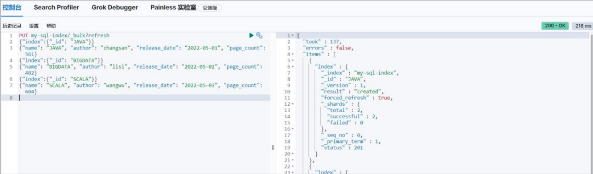

### 第一个SQL查询

现在可以使用 SQL 对数据进行查询了。

```sh
# SQL
# 这里的表就是索引
# 可以通过 format 参数控制返回结果的格式，默认为 json 格式
# txt:表示文本格式，看起来更直观点.
# csv:使用逗号隔开的数据
# json:JSON 格式数据
# tsv: 使用 tab 键隔开数据
# yaml:属性配置格式
POST _sql?format=txt
{
 "query": """
 SELECT * FROM "my-sql-index"
 """
}
```

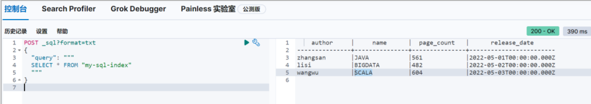

```sh
# 条件查询
POST _sql?format=txt
{
 "query": """
 SELECT * FROM "my-sql-index" where page_count > 500
 """
}
```

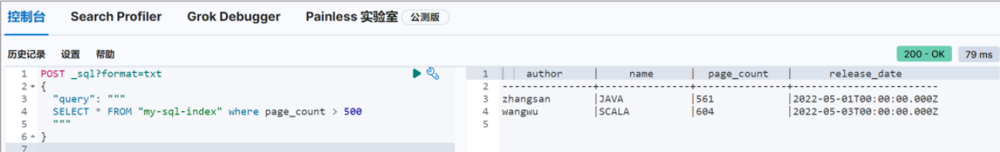

实际上会发现，和 JDBC 操作时的 SQL 语法是基本是一样的。

### SQL转换为DSL使用

当我们需要使用 Query DSL 时，也可以先使用 SQL 来查询，然后通过 Translate API 转换即可，查询的结果为 DSL 方式的结果

```sh
# 转换 SQL 为 DSL 进行操作
POST _sql/translate
{
 "query": """
 SELECT * FROM "my-sql-index" where page_count > 500
 """
}
```


### **SQL** **和** **DSL** **混合使用**

我们如果在优化 SQL 语句之后还不满足查询需求，可以拿 SQL 和 DSL 混用，ES 会先根据SQL 进行查询，然后根据 DSL 语句对 SQL 的执行结果进行二次查询

```sh
# SQL 和 DSL 混合使用
# 由于索引中含有横线，所以作为表名时需要采用双引号，且外层需要三个引号包含
POST _sql?format=txt
{
  "query": """SELECT * FROM "my-sql-index" """,
  "filter": {
    "range": {
      "page_count": {
        "gte": 400,
        "lte": 600
      }
    }
  },
  "fetch_size": 2
}
```

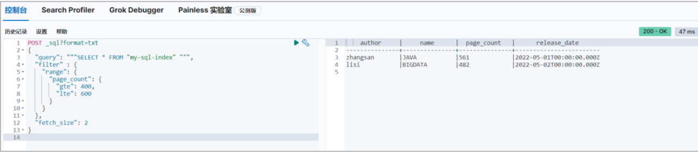

### 常用SQL操作

#### 查询所有索引

```sh
GET _sql?format=txt
{
 "query": """
 show tables
 """
}
```

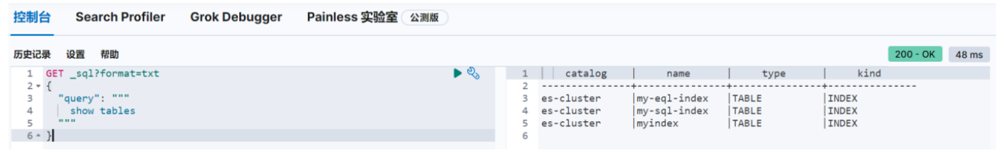

#### 查询指定索引

```sh
GET _sql?format=txt
{
 "query": """
 show tables like 'myindex'
 """
}
```

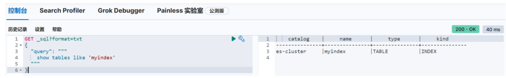

#### 模糊查询索引

```sh
GET _sql?format=txt
{
 "query": """
 show tables like 'my-%'
 """
}
```

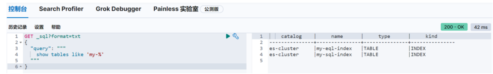

#### 查看索引结构

```sh
GET _sql?format=txt
{
 "query": """
 describe myindex
 """
}
```

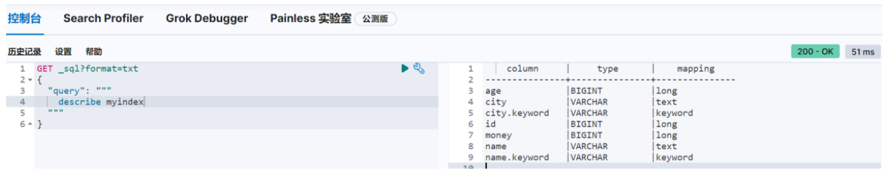

#### 基础查询操作

在 ES 中使用 SQL 查询的语法与在数据库中使用基本一致，具体格式如下:

```sh
# 基本 SQL 格式
SELECT select_expr [, ...]
[ FROM table_name ]
[ WHERE condition ]
[ GROUP BY grouping_element [, ...] ]
[ HAVING condition]
[ ORDER BY expression [ ASC | DESC ] [, ...] ]
[ LIMIT [ count ] ]
[ PIVOT ( aggregation_expr FOR column IN ( value [ [ AS ] alias ] [, ...] ) ) ]
```

-   where

```sh
# 条件过滤
POST _sql?format=txt
{
 "query": """ SELECT * FROM "my-sql-index" where name = 'JAVA' """
}
```

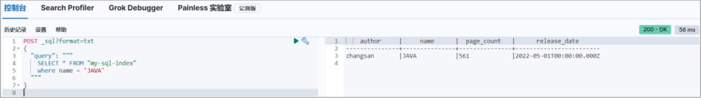

-   group by

```sh
# 查询所有数据
GET _sql?format=txt
{
 "query": """
 SELECT * FROM "my-sql-index" 
 """
}
```

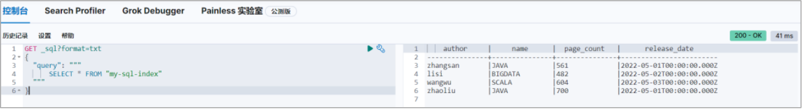

```sh
# 按照日期进行分组
GET _sql?format=txt
{
 "query": """
 SELECT release_date FROM "my-sql-index" group by release_date
 """
}
```

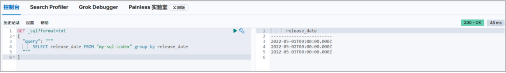

-   having

```sh
# 对分组后的数据进行过滤
GET _sql?format=txt
{
 "query": """
 SELECT sum(page_count), release_date as datacnt FROM "my-sql-index" group 
by release_date having sum(page_count) > 1000
 """
}
```

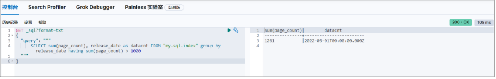

-   order by

```sh
# 对页面数量进行排序（降序）
GET _sql?format=txt
{
 "query": """
 select * from "my-sql-index" order by page_count desc
 """
}
```

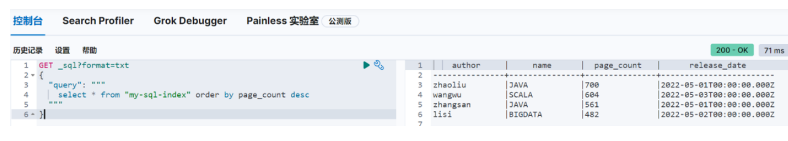

-   limit

```sh
# 限定查询数量
GET _sql?format=txt
{
 "query": """
 select * from "my-sql-index" limit 3
 """
}
```

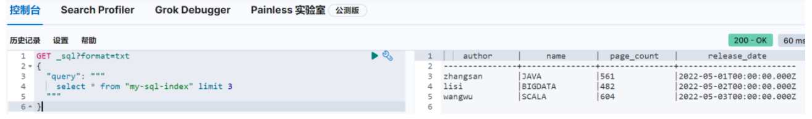

-   cursor

游标（cursor）是系统为用户开设的一个数据缓冲区，存储 sql 语句的执行结果，每个游标区都有一个名字，用户可以用 sql 语句逐一从游标中获取记录，并赋给主变量，交由主语言进一步处理。就本质而言，游标实际上是一种能从包括多条数据记录的结果集中每次提取一条或多条记录的机制

```sh
# 查询数据
# 因为查询结果较多，但是获取的数据较少，所以为了提高效果，会将数据存储到临时缓冲区中
# 此处数据展示格式为 json
POST _sql?format=json
{
 "query": """ SELECT * FROM "my-sql-index" order by page_count desc """,
 "fetch_size": 2
}
```

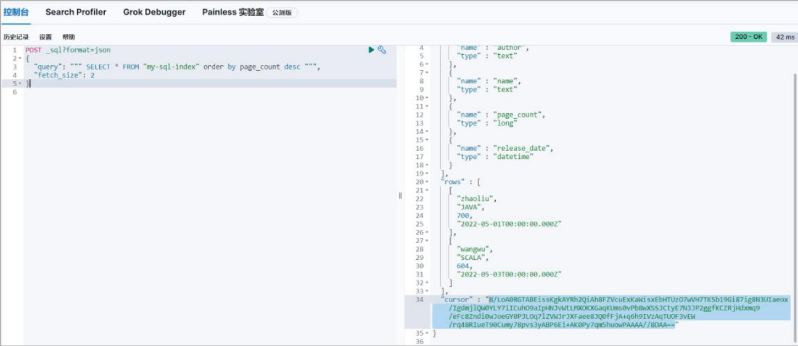

返回结果中的 cursor 就是缓冲区的标识，这就意味着可以从缓冲区中直接获取后续数据，操作上有点类似于迭代器，可多次执行。

```sh
# 此处游标 cursor 值需要根据读者执行的操作进行修改，请勿直接使用
POST /_sql?format=json
{
 "cursor": 
"8/LoA0RGTABEissKgkAYRh2QiAh8FZVcuExKaWisxEbHTUzO7wVH7TKSb19Gi87ig8N3UIaeox/
IgdmjlQW0YLY7iICuhO9aIpHNJvWtLMXOKXGaqKUms0vPb8wXSSJCtyE7N3JP2ggfKCZRjHdxmq9
/eFc8Zndi0wJoeGY0PJLOq7lZVWJrJXFaee8JQ0fFjA+q6h9IVzAqTUOF3vEW/rq48RIueT90Cum
y78pvs3yABP6Ei+AK0Py7qm5huowPAAAA//8DAA=="
}
```

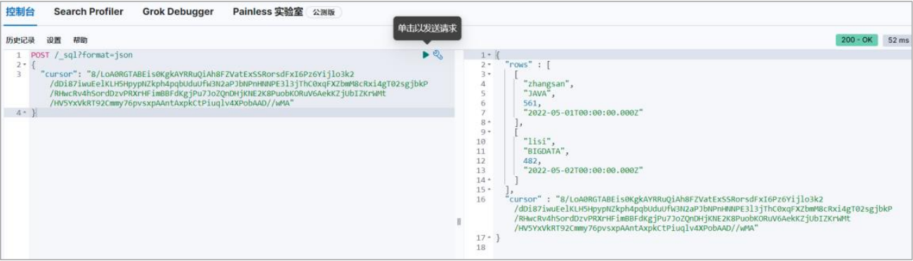

如果执行后，无任何结果返回，说明数据已经读取完毕

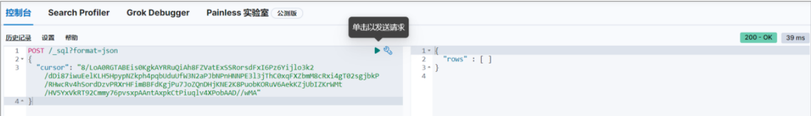

此时再次执行，会返回错误信息

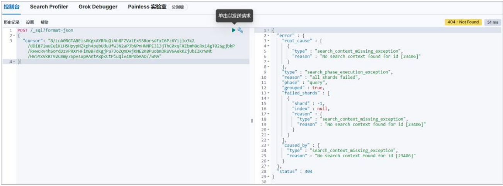

如果关闭缓冲区，执行下面指令即可

```sh
# 此处游标 cursor 值需要根据读者执行的操作进行修改，请勿直接使用
POST _sql/close
{
 "cursor": 
"8/LoA0RGTABEissKgkAYRh2QiAh8FZVcuExKaWisxEbHTUzO7wVH7TKSb19Gi87ig8N3UIaeox/
IgdmjlQW0YLY7iICuhO9aIpHNJvWtLMXOKXGaqKUms0vPb8wXSSJCtyE7N3JP2ggfKCZRjHdxmq9
/eFc8Zndi0wJoeGY0PJLOq7lZVWJrJXFaee8JQ0fFjA+q6h9IVzAqTUOF3vEW/rq48RIueT90Cum
y78pvs3yABP6Ei+AK0Py7qm5huowPAAAA//8DAA=="
}
```

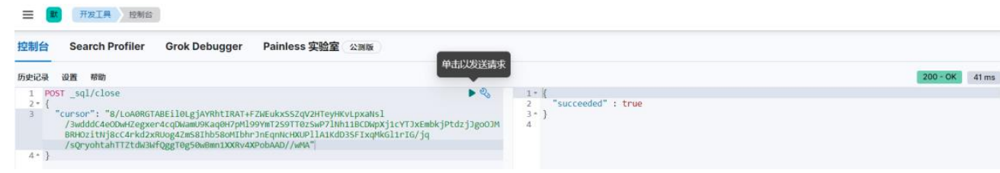

#### 基础聚合操作

在 ES 中使用 SQL 查询的聚合语法与在数据库中使用基本一致

-    Min
-    Max
-    Avg
-    Sum
-    Count(*)
-    Distinct

```sh
GET _sql?format=txt
{
  "query": """
 SELECT 
 MIN(page_count) min, 
 MAX(page_count) max, 
 AVG(page_count) avg,
 SUM(page_count) sum,
 COUNT(*) count,
 COUNT(DISTINCT name) dictinct_count 
 FROM "my-sql-index" 
 """
}
```

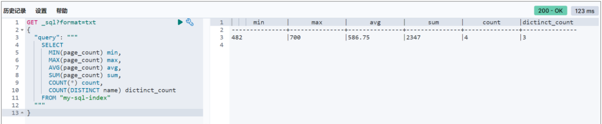

### 支持的函数和运算

#### 比较运算符

```sh
# Equality
SELECT * FROM "my-sql-index" WHERE name = 'JAVA'
# Null Safe Equality
SELECT 'elastic' <=> null AS "equals"
SELECT null <=> null AS "equals"
# Inequality
SELECT * FROM "my-sql-index" WHERE name <> 'JAVA'
SELECT * FROM "my-sql-index" WHERE name != 'JAVA'
# Comparison
SELECT * FROM "my-sql-index" WHERE page_count > 500
SELECT * FROM "my-sql-index" WHERE page_count >= 500
SELECT * FROM "my-sql-index" WHERE page_count < 500
SELECT * FROM "my-sql-index" WHERE page_count <= 500
# BETWEEN
SELECT * FROM "my-sql-index" WHERE page_count between 100 and 500
# Is Null / Is Not Null
SELECT * FROM "my-sql-index" WHERE name is not null
SELECT * FROM "my-sql-index" WHERE name is null
# IN
SELECT * FROM "my-sql-index" WHERE name in ('JAVA', 'SCALA')
```

#### 逻辑运算符

```sh
# AND
SELECT * FROM "my-sql-index" WHERE name = 'JAVA' AND page_count > 100
# OR
SELECT * FROM "my-sql-index" WHERE name = 'JAVA' OR name = 'SCALA'
# NOT
SELECT * FROM "my-sql-index" WHERE NOT name = 'JAVA'
```

#### 数学运算符

```sh
# 加减乘除
select 1 + 1 as x
select 1 - 1 as x
select - 1 as x
select 6 * 6 as x
select 30 / 5 as x
select 30 % 7 as x
```

#### 类型转换

```sh
# 类型转换
SELECT '123'::long AS long
```

#### 模糊查询

```sh
# LIKE 通配符
SELECT * FROM "my-sql-index" WHERE name like 'JAVA%'
SELECT * FROM "my-sql-index" WHERE name like 'JAVA_'
# 如果需要匹配通配符本身,使用转义字符
SELECT * FROM "my-sql-index" WHERE name like 'JAVA/%' ESCAPE '/'
# RLIKE 不要误会，这里的 R 表示的不是方向，而是正则表示式 Regex
SELECT * FROM "my-sql-index" WHERE name like 'JAV*A'
SELECT * FROM "my-sql-index" WHERE name rlike 'JAV*A'
# 尽管 LIKE在 Elasticsearch SQL 中搜索或过滤时是一个有效的选项，但全文搜索 MATCH 和 QUERY
速度更快、功能更强大，并且是首选替代方案。
```

#### 聚合分析函数

```sh
# FIRST / FIRST_VALUE : FIRST(第一个字段，排序字段)
SELECT first(name, release_date) FROM "my-sql-index"
SELECT first_value(substring(name,2,1)) FROM "my-sql-index"
# LAST / LAST_VALUE : LAST (第一个字段，排序字段)
SELECT last(name, release_date) FROM "my-sql-index"
SELECT last_value(substring(name,2,1)) FROM "my-sql-index"
# KURTOSIS 量化字段的峰值分布
SELECT KURTOSIS(page_count) FROM "my-sql-index"
# MAD
SELECT MAD(page_count) FROM "my-sql-index"
```

#### 分组函数

```sh
# HISTOGRAM : 直方矩阵
SELECT HISTOGRAM(page_count, 100) as c， count(*) FROM "my-sql-index" group by 
c
```

#### 数学通用函数

```sh
# ABS：求数字的绝对值
select ABS(page_count) from "myindex" limit 5
# CBRT：求数字的立方根，返回 double
select page_count v,CBRT(page_count) cbrt from "myindex" limit 5
# CEIL：返回大于或者等于指定表达式最小整数（double）
select page_count v,CEIL(page_count) from "myindex" limit 5
# CEILING：等同于 CEIL
select page_count v,CEILING(page_count) from "myindex" limit 5
# E：返回自然常数 e(2.718281828459045)
select page_count,E(page_count) from "myindex" limit 5
# ROUND：四舍五入精确到个位
select ROUND(-3.14)
# FLOOR：向下取整
select FLOOR(3.14)
# LOG：计算以 2 为底的自然对数
select LOG(4)
# LOG10：计算以 10 为底的自然对数
select LOG10(100)
# SQRT：求一个非负实数的平方根
select SQRT(9)
# EXP：此函数返回 e(自然对数的底)的 X 次方的值
select EXP(3)
```

#### 三角函数

```sh
# DEGREES：返回 X 从弧度转换为度值
select DEGREES(x)
# RADIANS：返回 X 从度转换成弧度的值
select RADIANS(x)
# SIN：返回 X 的正弦
select SIN(x)
# COS：返回 X，X 值是以弧度给出的余弦值
select COS(角度)
# TAN：返回参数 X，表示以弧度的切线值
select TAN(角度)
# ASIN：返回 X 的反正弦，X 的值必须在-1 至 1 范围内，返回 NULL
select ASIN(x)
# ACOS：返回 X 的反正弦，X 值必须-1 到 1 之间范围否则将返回 NULL
select ACOS(x)
# ATAN：返回 X 的反正切
select ATAN(x)
# SINH：返回 X 的双曲正弦值
select SINH(x)
# COSH：返回 X 的双曲余弦值
select COSH(x)
```

#### 日期时间函数

```sh
# YEAR：
SELECT YEAR(CAST('2022-05-01T00:00:00Z' AS TIMESTAMP)) AS year
# MONTH_OF_YEAR() or MONTH()：
SELECT MONTH(CAST('2022-05-01T00:00:00Z' AS TIMESTAMP)) AS month
# WEEK_OF_YEAR() or WEEK()：
SELECT WEEK(CAST('2022-05-01T00:00:00Z' AS TIMESTAMP)) AS week
# DAY_OF_YEAR() or DOY() ，效果等同于 EXTRACT(<datetime_function> FROM 
<expression>)：
SELECT DOY(CAST('2022-05-01T00:00:00Z' AS TIMESTAMP)) AS day
# DAY_OF_MONTH(), DOM(), or DAY()：
SELECT DAY(CAST('2022-05-01T00:00:00Z' AS TIMESTAMP)) AS day
# DAY_OF_WEEK() or DOW()：
SELECT DOW(CAST('2022-05-01T00:00:00Z' AS TIMESTAMP)) AS day
# HOUR_OF_DAY() or HOUR()：
SELECT HOUR(CAST('2022-05-01T00:00:00Z' AS TIMESTAMP)) AS hour
# MINUTE_OF_DAY()：
SELECT MINUTE_OF_DAY(CAST('2022-05-01T00:00:00Z' AS TIMESTAMP)) AS minute
# MINUTE_OF_HOUR() or MINUTE()：
SELECT MINUTE(CAST('2022-05-01T00:00:00Z' AS TIMESTAMP)) AS minute
# SECOND_OF_MINUTE() or SECOND()：
SELECT SECOND(CAST('2022-05-01T00:00:00Z' AS TIMESTAMP)) AS second
```

#### 全文搜索函数

```sh
# MATCH：MATCH(匹配字段，规则, 配置参数(可选))
SELECT * FROM "my-sql-index" where MATCH(name, 'JAVA')
SELECT * FROM "my-sql-index" where MATCH(name, 'java')
# MATCH：MATCH(('匹配字段^权重 1,匹配字段^权重 2'，规则, 配置参数(可选))
SELECT * FROM "my-sql-index" where MATCH('author^2,name^5', 'java')
# QUERY
SELECT * FROM "my-sql-index" where QUERY('name:Java')
# SCORE : 评分
SELECT *, score() FROM "my-sql-index" where QUERY('name:Java')
```

#### 字符串检索函数

```sh
# ASCII : 字符串转成 ASC 码
SELECT ASCII('Elastic')
# BIT_LENGTH ： 位长度
SELECT BIT_LENGTH('Elastic')
SELECT BIT_LENGTH('中国')
# CHAR ：转换字符
SELECT CHAR(69)
# CHAR_LENGTH ：字符长度
SELECT CHAR_LENGTH('Elastic')
# CONCAT:合并
SELECT CONCAT('Elastic', 'search')
# INSERT : INSERT(字符串，起始位置，长度，插入的内容)
SELECT INSERT('Elastic', 8, 1, 'search')
SELECT INSERT('Elastic', 7, 1, 'search')
# LCASE ：转换小写
SELECT LCASE('Elastic')
# LEFT : 获取左边最多 N 个字符
SELECT LEFT('Elastic',3)
# LENGTH
SELECT length('Elastic')
SELECT length('中国')
# LOCATE : LOCATE(表达式，字符串，起始位置)，获取满足条件的位置
SELECT LOCATE('a', 'Elasticsearch')
SELECT LOCATE('a', 'Elasticsearch', 5)
# LTRIM ：去除左边的空格
SELECT LTRIM(' Elastic')
# OCTET_LENGTH : 字节长度
SELECT OCTET_LENGTH('Elastic')
SELECT OCTET_LENGTH('中国')
# POSITION ：获取指定字符串的位置
SELECT POSITION('Elastic', 'Elasticsearch')
# REPEAT ：将字符串重复指定次数
SELECT REPEAT('Elastic', 3)
# REPLACE ：替换数据
SELECT REPLACE('Elastic','El','Fant')
# RIGHT ：从右边获取指定数量的数据
SELECT RIGHT('Elastic',3)
# RTRIM ：去除右边的空格
SELECT RTRIM('Elastic ')
# SPACE : 生成指定数量的空格
SELECT concat(SPACE(3),'abc')
# STARTS_WITH : 判断是否以指定字符串开头
SELECT STARTS_WITH('Elasticsearch', 'Elastic')
# SUBSTRING ： 截取字符串，必须传递三个参数
SELECT SUBSTRING('Elasticsearch', 0, 7)
# TRIM ：去掉首尾空格
SELECT TRIM(' Elastic ') AS trimmed
# UCASE : 转换大写
SELECT UCASE('Elastic')
```

#### 条件分支函数

```sh
# 多重分支判断
SELECT CASE 5
 WHEN 1 THEN 'elastic'
 WHEN 2 THEN 'search'
 WHEN 3 THEN 'elasticsearch'
 ELSE 'default'
 END AS "case"
SELECT CASE WHEN 1 > 2 THEN 'elastic'
 WHEN 2 > 10 THEN 'search'
 ELSE 'default'
 END AS "case"
# IFNULL
SELECT IFNULL('elastic', null) AS "ifnull"
SELECT IFNULL(null, 'search') AS "ifnull"
# IIF
SELECT IIF(1 < 2, 'TRUE', 'FALSE') AS result1, IIF(1 > 2, 'TRUE', 'FALSE') AS 
result2
# ISNULL
SELECT ISNULL('elastic', null) AS "isnull"
SELECT ISNULL(null, 'search') AS "isnull"
# LEAST:获取除 null 外的最小值
SELECT LEAST(null, 2, 11) AS "least"
SELECT LEAST(null, null, null, null) AS "least"
# NULLIF : 如果两个字符串不相同，则返回第一个字符串，如果相同，返回 null
SELECT NULLIF('elastic', 'search') AS "nullif"
SELECT NULLIF('elastic', 'elastic') AS "nullif"
# NVL : 返回第一个不是 null 的字符串，如果都是 null,那么返回 Null
SELECT NVL('elastic', null) AS "nvl"
SELECT NVL(null, null) AS "nvl"
```

#### 系统函数

```sh
# ES 集群
SELECT DATABASE()
# 用户
SELECT USER()
```

### SQL客户端-DataGrip

DataGrip 是 JetBrains 发布的多引擎数据库环境, 这里采用 DataGrip 工具连接 Elasticsearch


1.新建驱动

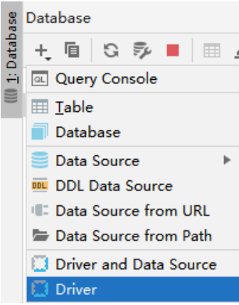

2.配置驱动

可以先通过 maven 增加依赖，下载驱动程序

```xml
<dependency>
 <groupId>org.elasticsearch.plugin</groupId>
 <artifactId>x-pack-sql-jdbc</artifactId>
 <version>8.1.0</version>
</dependency>
```

配置驱动时，选择对应的 ES 软件版本即可

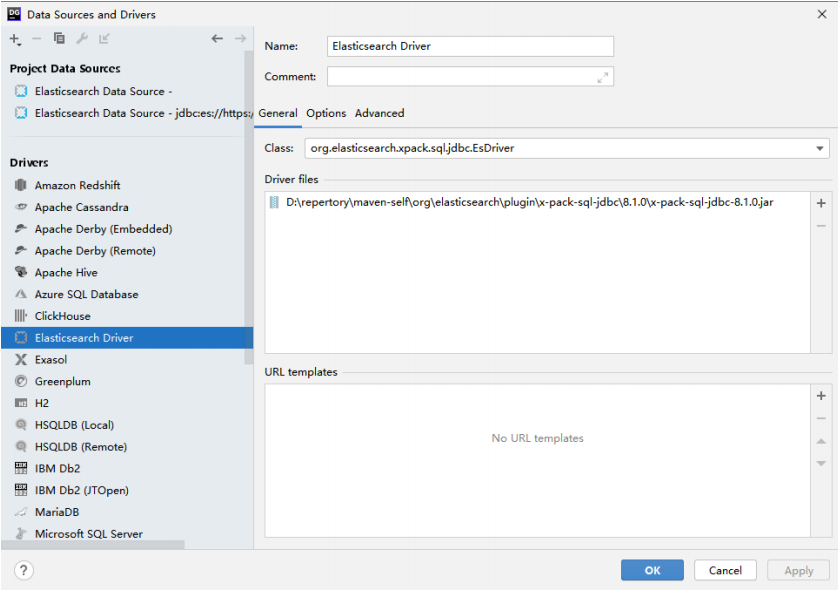

3.配置参数

```sh
# 用户名和账号采用 ES 自带的 elastic 即可
# URL 地址
jdbc:es://https://linux1:9200
```

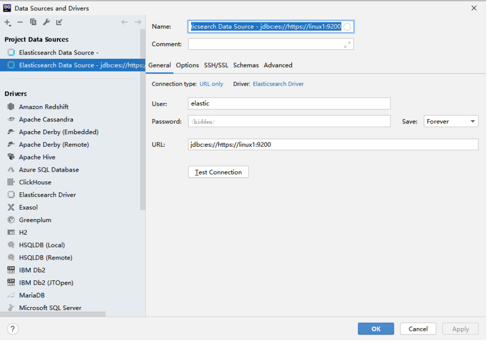

4.配置SSL连接

选择 Elasticseach 生成的证书即可


5.更改license类型

默认情况下，JDBC 客户端必须为白金级别才可以使用

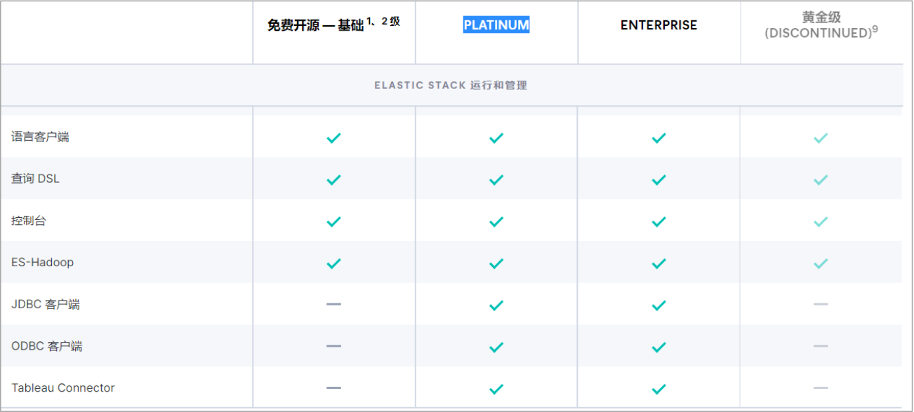

当前使用的 License 为 basic

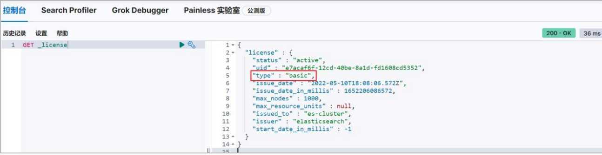

为了能够使用相关功能，这里可以将当前的 ES 软件的 License 暂时设置为试用版。测试完成后，改回 basic 版即可

```sh
# 更改 License 类型 - trial
POST _license/start_trial?acknowledge=true
# 更改 License 类型 - basic
POST _license/start_basic?acknowledge=true
```

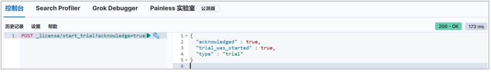

6.执行SQL操作

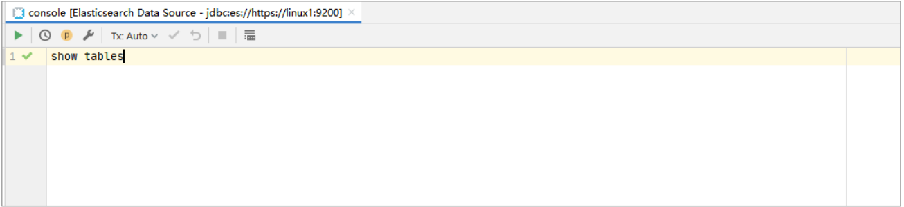

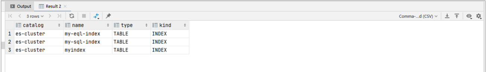

## 四、自然语言处理NLP

随着 8.0 的发布，Elastic 很高兴能够将 PyTorch 机器学习模型上传到 Elasticsearch 中，以在 Elastic Stack 中提供现代自然语言处理 (NLP)。现在，Elasticsearch 用户能够集成用于构建 NLP 模型的最流行的格式之一，并将这些模型作为 NLP 数据管道的一部分通过我们的Inference processor 整合到 Elasticsearch 中 

### 什么是自然语言处理？

NLP 是指我们可以使用软件来操作和理解口语或书面文本或自然语言的方式。 2018 年，Google 开源了一种用于 NLP 预训练的新技术，称为来自 Transformers 的双向编码器呈现，或 BERT。 BERT 通过在没有任何人工参与的情况下对互联网大小的数据集（例如，想想所有的维基百科和数字书籍）进行训练来利用 “transfer learning”。

Transfer learning 允许对 BERT 模型进行预训练以进行通用语言理解。一旦模型只经过一次预训练，它就可以被重用并针对更具体的任务进行微调，以了解语言的使用方式。为了支持类 BERT 模型（使用与 BERT 相同的标记器的模型），Elasticsearch 将首先通过 PyTorch 模型支持支持大多数最常见的 NLP 任务。 PyTorch 是最受欢迎的现代机器学习库之一，拥有大量活跃用户，它是一个支持深度神经网络的库，例如 BERT 使用的Transformer 架构。

以下是一些示例 NLP 任务：

-   情绪分析：用于识别正面与负面陈述的二元分类

-   命名实体识别 (NER)：从非结构化文本构建结构，尝试提取名称、位置或组织等细节

-   文本分类：零样本分类允许你根据你选择的类对文本进行分类，而无需进行预训练。

-   文本嵌入：用于 k 近邻 (kNN) 搜索

 

### **Elasticsearch** **中的自然语言处理**

在将 NLP 模型集成到 Elastic 平台时，我们希望为上传和管理模型提供出色的用户体验。使用用于上传 PyTorch 模型的 Eland 客户端和用于管理 Elasticsearch 集群上模型的Kibana 的 ML 模型管理用户界面，用户可以尝试不同的模型并很好地了解它们在数据上的表现。我们还希望使其可跨集群中的多个可用节点进行扩展，并提供良好的推理吞吐量性能。

为了使这一切成为可能，我们需要一个机器学习库来执行推理。在 Elasticsearch 中添加对 PyTorch 的支持需要使用原生库 libtorch，它支持 PyTorch，并且仅支持已导出或保存为 TorchScript 表示的 PyTorch 模型。这是 libtorch 需要的模型的表示，它将允许Elasticsearch 避免运行 Python 解释器。

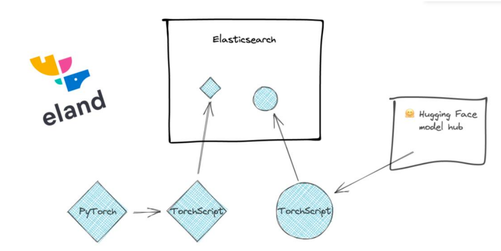

通过与在 PyTorch 模型中构建 NLP 模型的最流行的格式之一集成，Elasticsearch 可以提供一个平台，该平台可处理大量 NLP 任务和用例。许多优秀的库可用于训练 NLP 模型，因此我们暂时将其留给其他工具。无论你是使用 PyTorch NLP、Hugging Face Transformers 还 是 Facebook 的 fairseq 等库来训练模型，你都可以将模型导入 Elasticsearch 并对这些模型进行推理。 Elasticsearch 推理最初将仅在摄取时进行，未来还可以扩展以在查询时引入推理。

 

### **NLP** **在** **Elasticsearch 7.x** **和** **8.x** **中的区别**

Elasticsearch 一直是进行 NLP 的好地方，但从历史上看，它需要在 Elasticsearch 之外进行一些处理，或者编写一些非常复杂的插件。 借助 8.0，用户现在可以在 Elasticsearch 中更直接地执行命名实体识别、情感分析、文本分类等操作——无需额外的组件或编码。 不仅在 Elasticsearch 中本地计算和创建向量在水平可扩展性方面是“胜利”（通过在服务器集群中分布计算）——这一变化还为 Elasticsearch 用户节省了大量时间和精力。

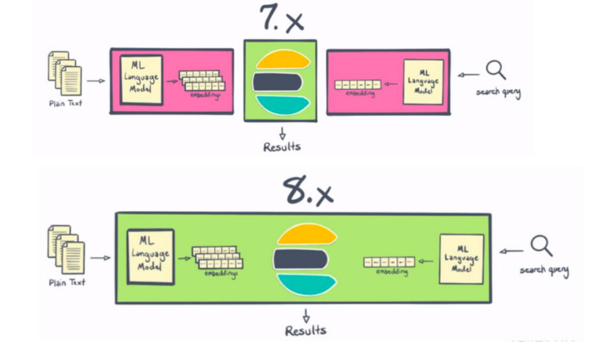

借助 Elastic 8.0，用户可以直接在 Elasticsearch 中使用 PyTorch 机器学习模型（例如 BERT），并在 Elasticsearch 中使用这些模型进行推理。通过使用户能够直接在 Elasticsearch 中执行推理，将现代 NLP 的强大功能集成到搜索应用程序和体验、本质上更高效（得益于 Elasticsearch 的分布式计算能力）和 NLP 本身比以往任何时候都更容易 变得更快，因为你不需要将数据移出到单独的进程或系统中。

### **NLP** **演示**

这里我们使用 https://github.com/spinscale/elasticsearch-ingest-opennlp/releases/tag/8.1.1.1

来进行演示。**我们必须安装和自己的** **Elasticsearch** **一致的版本。**

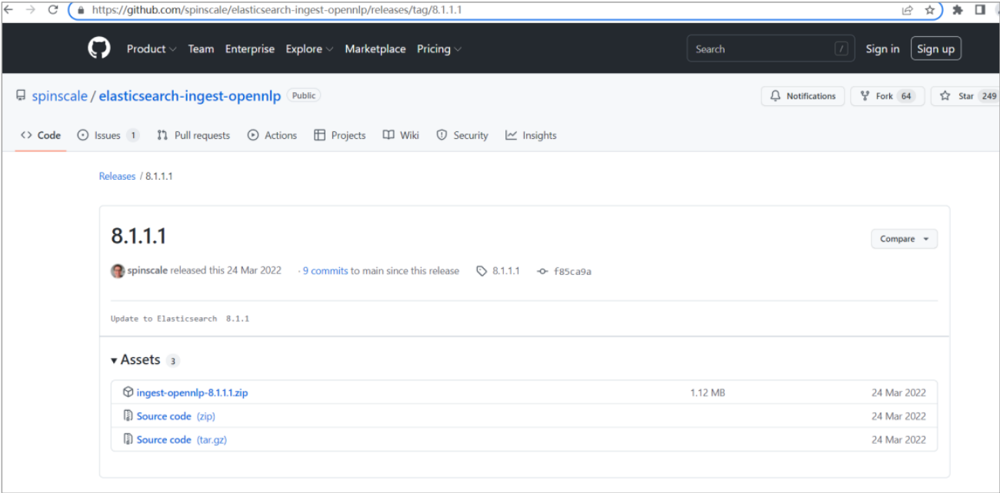

目前这个 NLP 支持检测 Date， Person， Location, POS (part of speech) 及其它。

1.安装opennlp

将下载下来的插件上传到**所有** **ES** **服务器节点**的 plugins 路径中。

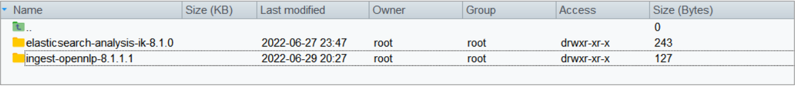

2.下载NER模型

我们需要从 sourceforge 下载最新的 NER 模型

```sh
bin/ingest-opennlp/download-models
```

执行时，可能会提示脚本路径不对等问题。直接修改脚本文件改正即可

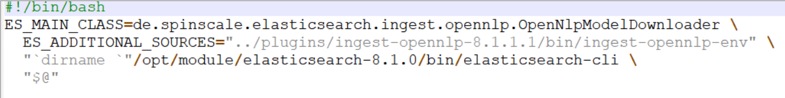

执行后，会出现如下内容

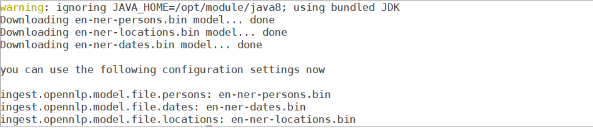

3.配置opennlp

修改配置文件：config/elasticsearch.yml 

```yml
ingest.opennlp.model.file.persons: en-ner-persons.bin
ingest.opennlp.model.file.dates: en-ner-dates.bin
ingest.opennlp.model.file.locations: en-ner-locations.bin
```

**重新启动** **Elasticsearch**

4.运用opennlp

创建一个支持 NLP 的 pipeline

```sh
PUT _ingest/pipeline/opennlp-pipeline
{
  "description": "A pipeline to do named entity extraction",
  "processors": [
    {
      "opennlp": {
        "field": "message"
      }
    }
  ]
}
```

增加数据

```sh
PUT my-nlp-index
PUT my-nlp-index/_doc/1?pipeline=opennlp-pipeline
{
 "message": "Shay Banon announced the release of Elasticsearch 6.0 in November 
2017"
}
PUT my-nlp-index/_doc/2?pipeline=opennlp-pipeline
{
 "message" : "Kobe Bryant was one of the best basketball players of all times. 
Not even Michael Jordan has ever scored 81 points in one game. Munich is really 
an awesome city, but New York is as well. Yesterday has been the hottest day of 
the year."
}
```

查看数据

```sh
GET my-nlp-index/_doc/1
GET my-nlp-index/_doc/2
```

从结果我们可以看出来，它正确地识别了 dates，persons 及 locations。

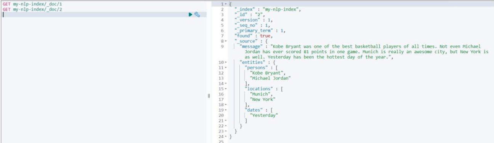
