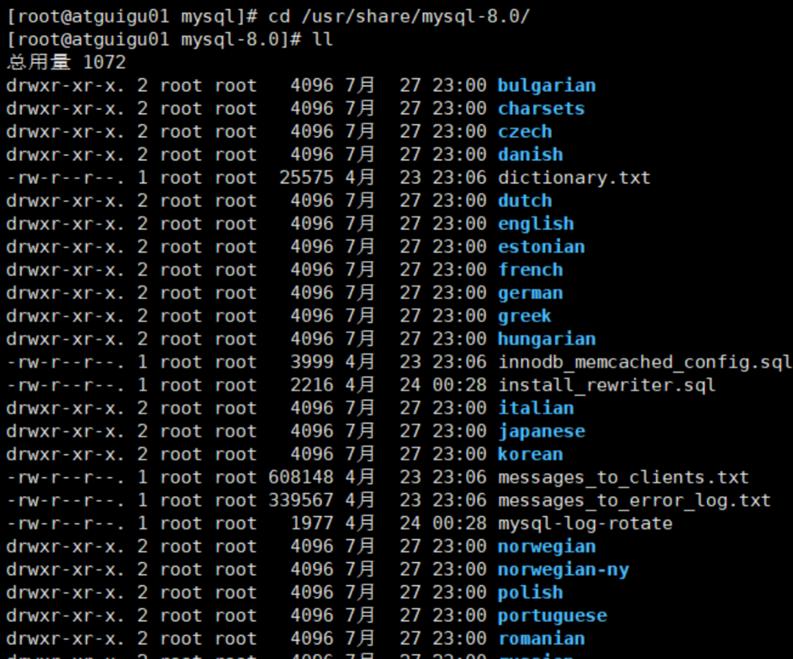

---
# 当前页面内容标题
title: 第 02 章_MySQL的数据目录
# 分类
category:
  - mysql
# 标签
tag: 
  - mysql
  - SQL
  - 关系型数据库
sticky: false
# 是否收藏在博客主题的文章列表中，当填入数字时，数字越大，排名越靠前。
star: false
# 是否将该文章添加至文章列表中
article: true
# 是否将该文章添加至时间线中
timeline: true
---

# 第 02 章_MySQL的数据目录


## 1. MySQL 8 的主要目录结构

```sh
[root@atguigu01 ~]# find / -name mysql
```

安装好MySQL 8 之后，我们查看如下的目录结构：

### 1. 1 数据库文件的存放路径

**MySQL数据库文件的存放路径：/var/lib/mysql/**

```mysql
mysql> show variables like 'datadir';
+---------------+-----------------+
| Variable_name | Value |
+---------------+-----------------+
| datadir | /var/lib/mysql/ |
+---------------+-----------------+
1 row in set (0.04 sec)
```

从结果中可以看出，在我的计算机上MySQL的数据目录就是`/var/lib/mysql/`。

### 1. 2 相关命令目录

**相关命令目录：/usr/bin（mysqladmin、mysqlbinlog、mysqldump等命令）和/usr/sbin。**


### 1. 3 配置文件目录

**配置文件目录：/usr/share/mysql-8.0（命令及配置文件），/etc/mysql（如my.cnf）**



## 2. 数据库和文件系统的关系

### 2. 1 查看默认数据库

查看一下在我的计算机上当前有哪些数据库：

```mysql
mysql> SHOW DATABASES;
```

可以看到有 4 个数据库是属于MySQL自带的系统数据库。

- `mysql`

  MySQL 系统自带的核心数据库，它存储了MySQL的用户账户和权限信息，一些存储过程、事件的定义信息，一些运行过程中产生的日志信息，一些帮助信息以及时区信息等。

- `information_schema`

  MySQL 系统自带的数据库，这个数据库保存着MySQL服务器`维护的所有其他数据库的信息`，比如有哪些表、哪些视图、哪些触发器、哪些列、哪些索引。这些信息并不是真实的用户数据，而是一些描述性信息，有时候也称之为`元数据`。在系统数据库`information_schema`中提供了一些以`innodb_sys`开头的表，用于表示内部系统表。

  ```mysql
  mysql> USE information_schema;
  Database changed
  
  mysql> SHOW TABLES LIKE 'innodb_sys%';
  +--------------------------------------------+
  | Tables_in_information_schema (innodb_sys%) |
  +--------------------------------------------+
  | INNODB_SYS_DATAFILES |
  | INNODB_SYS_VIRTUAL |
  | INNODB_SYS_INDEXES |
  | INNODB_SYS_TABLES |
  | INNODB_SYS_FIELDS |
  | INNODB_SYS_TABLESPACES |
  | INNODB_SYS_FOREIGN_COLS |
  | INNODB_SYS_COLUMNS |
  | INNODB_SYS_FOREIGN |
  | INNODB_SYS_TABLESTATS |
  +--------------------------------------------+
  10 rows in set (0.00 sec)
  ```

- `performance_schema`

  MySQL 系统自带的数据库，这个数据库里主要保存MySQL服务器运行过程中的一些状态信息，可以用来`监控 MySQL 服务的各类性能指标`。包括统计最近执行了哪些语句，在执行过程的每个阶段都花费了多长时间，内存的使用情况等信息。

- `sys`

  MySQL 系统自带的数据库，这个数据库主要是通过`视图`的形式把`information_schema`和`performance_schema`结合起来，帮助系统管理员和开发人员监控 MySQL 的技术性能。

### 2. 2 数据库在文件系统中的表示

看一下我的计算机上的数据目录下的内容：

```sh
[root@atguigu01 mysql]# cd /var/lib/mysql
[root@atguigu01 mysql]# ll
总用量 189980
-rw-r-----. 1 mysql mysql 56 7 月  28 00 :27 auto.cnf
-rw-r-----. 1 mysql mysql 179 7 月  28 00 :27 binlog.
-rw-r-----. 1 mysql mysql 820 7 月  28 01 :00 binlog.
-rw-r-----. 1 mysql mysql 179 7 月  29 14 :08 binlog.
-rw-r-----. 1 mysql mysql 582 7 月  29 16 :47 binlog.
-rw-r-----. 1 mysql mysql 179 7 月  29 16 :51 binlog.
-rw-r-----. 1 mysql mysql 179 7 月  29 16 :56 binlog.
-rw-r-----. 1 mysql mysql 179 7 月  29 17 :37 binlog.
-rw-r-----. 1 mysql mysql 24555 7 月  30 00 :28 binlog.
-rw-r-----. 1 mysql mysql 179 8 月 1 11 :57 binlog.
-rw-r-----. 1 mysql mysql 156 8 月 1 23 :21 binlog.
-rw-r-----. 1 mysql mysql 156 8 月 2 09 :25 binlog.
-rw-r-----. 1 mysql mysql 1469 8 月 4 01 :40 binlog.
-rw-r-----. 1 mysql mysql 156 8 月 6 00 :24 binlog.
-rw-r-----. 1 mysql mysql 179 8 月 6 08 :43 binlog.
-rw-r-----. 1 mysql mysql 156 8 月 6 10 :56 binlog.
-rw-r-----. 1 mysql mysql 240 8 月 6 10 :56 binlog.index
-rw-------. 1 mysql mysql 1676 7 月  28 00 :27 ca-key.pem
-rw-r--r--. 1 mysql mysql 1112 7 月  28 00 :27 ca.pem
-rw-r--r--. 1 mysql mysql 1112 7 月  28 00 :27 client-cert.pem
-rw-------. 1 mysql mysql 1676 7 月  28 00 :27 client-key.pem
drwxr-x---. 2 mysql mysql 4096 7 月  29 16 :34 dbtest
-rw-r-----. 1 mysql mysql 196608 8 月 6 10 :58 #ib_16384_0.dblwr
-rw-r-----. 1 mysql mysql 8585216 7 月  28 00 :27 #ib_16384_1.dblwr
-rw-r-----. 1 mysql mysql 3486 8 月 6 08 :43 ib_buffer_pool
-rw-r-----. 1 mysql mysql 12582912 8 月 6 10 :56 ibdata
-rw-r-----. 1 mysql mysql 50331648 8 月 6 10 :58 ib_logfile
-rw-r-----. 1 mysql mysql 50331648 7 月  28 00 :27 ib_logfile
-rw-r-----. 1 mysql mysql 12582912 8 月 6 10 :56 ibtmp
drwxr-x---. 2 mysql mysql 4096 8 月 6 10 :56 #innodb_temp
drwxr-x---. 2 mysql mysql 4096 7 月  28 00 :27 mysql
-rw-r-----. 1 mysql mysql 26214400 8 月 6 10 :56 mysql.ibd
srwxrwxrwx. 1 mysql mysql 0 8 月 6 10 :56 mysql.sock
-rw-------. 1 mysql mysql 5 8 月 6 10 :56 mysql.sock.lock
drwxr-x---. 2 mysql mysql 4096 7 月  28 00 :27 performance_schema
-rw-------. 1 mysql mysql 1680 7 月  28 00 :27 private_key.pem
-rw-r--r--. 1 mysql mysql 452 7 月  28 00 :27 public_key.pem
-rw-r--r--. 1 mysql mysql 1112 7 月  28 00 :27 server-cert.pem
-rw-------. 1 mysql mysql 1680 7 月  28 00 :27 server-key.pem
drwxr-x---. 2 mysql mysql 4096 7 月  28 00 :27 sys
drwxr-x---. 2 mysql mysql 4096 7 月  29 23 :10 temp
-rw-r-----. 1 mysql mysql 16777216 8 月 6 10 :58 undo_001
-rw-r-----. 1 mysql mysql 16777216 8 月 6 10 :58 undo_002
```

这个数据目录下的文件和子目录比较多，除了`information_schema`这个系统数据库外，其他的数据库在`数据目录`下都有对应的子目录。

 以我的`temp`数据库为例，在MySQL 5. 7 中打开：

```sh
[root@atguigu02 mysql]# cd ./temp
[root@atguigu02 temp]# ll
总用量 1144
-rw-r-----. 1 mysql mysql 8658 8 月  18 11 :32 countries.frm
-rw-r-----. 1 mysql mysql 114688 8 月  18 11 :32 countries.ibd
-rw-r-----. 1 mysql mysql 61 8 月  18 11 :32 db.opt
-rw-r-----. 1 mysql mysql 8716 8 月  18 11 :32 departments.frm
-rw-r-----. 1 mysql mysql 147456 8 月  18 11 :32 departments.ibd
-rw-r-----. 1 mysql mysql 3017 8 月  18 11 :32 emp_details_view.frm
-rw-r-----. 1 mysql mysql 8982 8 月  18 11 :32 employees.frm
-rw-r-----. 1 mysql mysql 180224 8 月  18 11 :32 employees.ibd
-rw-r-----. 1 mysql mysql 8660 8 月  18 11 :32 job_grades.frm
-rw-r-----. 1 mysql mysql 98304 8 月  18 11 :32 job_grades.ibd
-rw-r-----. 1 mysql mysql 8736 8 月  18 11 :32 job_history.frm
-rw-r-----. 1 mysql mysql 147456 8 月  18 11 :32 job_history.ibd
-rw-r-----. 1 mysql mysql 8688 8 月  18 11 :32 jobs.frm
-rw-r-----. 1 mysql mysql 114688 8 月  18 11 :32 jobs.ibd
-rw-r-----. 1 mysql mysql 8790 8 月  18 11 :32 locations.frm
-rw-r-----. 1 mysql mysql 131072 8 月  18 11 :32 locations.ibd
-rw-r-----. 1 mysql mysql 8614 8 月  18 11 :32 regions.frm
-rw-r-----. 1 mysql mysql 114688 8 月  18 11 :32 regions.ibd
```

在MySQL 8. 0 中打开：

```sh
[root@atguigu01 mysql]# cd ./temp
[root@atguigu01 temp]# ll
总用量 1080
-rw-r-----. 1 mysql mysql 131072 7 月  29 23 :10 countries.ibd
-rw-r-----. 1 mysql mysql 163840 7 月  29 23 :10 departments.ibd
-rw-r-----. 1 mysql mysql 196608 7 月  29 23 :10 employees.ibd
-rw-r-----. 1 mysql mysql 114688 7 月  29 23 :10 job_grades.ibd
-rw-r-----. 1 mysql mysql 163840 7 月  29 23 :10 job_history.ibd
-rw-r-----. 1 mysql mysql 131072 7 月  29 23 :10 jobs.ibd
-rw-r-----. 1 mysql mysql 147456 7 月  29 23 :10 locations.ibd
-rw-r-----. 1 mysql mysql 131072 7 月  29 23 :10 regions.ibd
```

### 2. 3 表在文件系统中的表示

#### 2. 3. 1 InnoDB存储引擎模式

**1.表结构**

为了保存表结构，`InnoDB`在`数据目录`下对应的数据库子目录下创建了一个专门用于`描述表结构的文件`，文件名是这样：

```sh
表名.frm
```

比方说我们在atguigu数据库下创建一个名为test的表：

```mysql
mysql> USE atguigu;
Database changed

mysql> CREATE TABLE test (
-> c1 INT
-> );
Query OK, 0 rows affected (0.03 sec)
```

那在数据库`atguigu`对应的子目录下就会创建一个名为`test.frm`的用于描述表结构的文件。.frm文件的格式在不同的平台上都是相同的。这个后缀名为.frm是以`二进制格式`存储的，我们直接打开是乱码的。

**2.表中数据和索引**

**① 系统表空间（system tablespace）**

默认情况下，InnoDB会在数据目录下创建一个名为`ibdata1`、大小为`12M`的文件，这个文件就是对应的`系统表空间`在文件系统上的表示。怎么才 12 M？注意这个文件是`自扩展文件`，当不够用的时候它会自己增加文件大小。

当然，如果你想让系统表空间对应文件系统上多个实际文件，或者仅仅觉得原来的`ibdata1`这个文件名难听，那可以在MySQL启动时配置对应的文件路径以及它们的大小，比如我们这样修改一下my.cnf 配置文件：

```mysql
[server]
innodb_data_file_path=data1:512M;data2:512M:autoextend
```

**② 独立表空间(file-per-table tablespace)**

在MySQL5.6.6以及之后的版本中，InnoDB并不会默认的把各个表的数据存储到系统表空间中，而是为`每一个表建立一个独立表空间`，也就是说我们创建了多少个表，就有多少个`独立表空间`。使用独立表空间来存储表数据的话，会在该表所属数据库对应的子目录下创建一个表示该独立表空间的文件，文件名和表名相同，只不过添加了一个`.ibd`的扩展名而已，所以完整的文件名称长这样：

```mysql
表名.ibd
```

比如：我们使用了`独立表空间`去存储`atguigu`数据库下的`test`表的话，那么在该表所在数据库对应的`atguigu`目录下会为`test`表创建这两个文件：

```mysql
test.frm
test.ibd
```

其中`test.ibd`文件就用来存储`test`表中的数据和索引。

**③ 系统表空间与独立表空间的设置**

我们可以自己指定使用`系统表空间`还是`独立表空间`来存储数据，这个功能由启动参数`innodb_file_per_table`控制，比如说我们想刻意将表数据都存储到`系统表空间`时，可以在启动

MySQL服务器的时候这样配置：

```mysql
[server]
innodb_file_per_table=0 # 0：代表使用系统表空间； 1 ：代表使用独立表空间
```

默认情况：

```mysql
mysql> show variables like 'innodb_file_per_table';
+-----------------------+-------+
| Variable_name | Value |
+-----------------------+-------+
| innodb_file_per_table | ON |
+-----------------------+-------+
1 row in set (0.01 sec)
```

**④ 其他类型的表空间**

随着MySQL的发展，除了上述两种老牌表空间之外，现在还新提出了一些不同类型的表空间，比如通用表空间（general tablespace）、临时表空间（temporary tablespace）等。

#### 2. 3. 2 MyISAM存储引擎模式

1. **表结构**

在存储表结构方面，`MyISAM`和`InnoDB`一样，也是在`数据目录`下对应的数据库子目录下创建了一个专门用于描述表结构的文件：

```mysql
表名.frm
```

2. **表中数据和索引**

在MyISAM中的索引全部都是`二级索引`，该存储引擎的`数据和索引是分开存放的`。所以在文件系统中也是使用不同的文件来存储数据文件和索引文件，同时表数据都存放在对应的数据库子目录下。假如`test`表使用`MyISAM`存储引擎的话，那么在它所在数据库对应的`atguigu`目录下会为`test`表创建这三个文件：

```mysql
test.frm 存储表结构
test.MYD 存储数据 (MYData)
test.MYI 存储索引 (MYIndex)
```

举例：创建一个`MyISAM` 表，使用`ENGINE` 选项显式指定引擎。因为`InnoDB`是默认引擎。

```mysql
CREATE TABLE `student_myisam` (
`id` bigint NOT NULL AUTO_INCREMENT,
`name` varchar( 64 ) DEFAULT NULL,
`age` int DEFAULT NULL,
`sex` varchar( 2 ) DEFAULT NULL,
PRIMARY KEY (`id`)
)ENGINE=MYISAM AUTO_INCREMENT= 0 DEFAULT CHARSET=utf8mb3;
```

### 2. 4 小结

举例：`数据库a`，`表b`。

1 、如果表b采用`InnoDB`，data\a中会产生 1 个或者 2 个文件：

- `b.frm` ：描述表结构文件，字段长度等
- 如果采用`系统表空间`模式的，数据信息和索引信息都存储在`ibdata1`中
- 如果采用`独立表空间`存储模式，data\a中还会产生`b.ibd`文件（存储数据信息和索引信息）

此外：

**① MySQL5.7 中会在data/a的目录下生成`db.opt`文件用于保存数据库的相关配置。比如：字符集、比较规则。而MySQL8.0不再提供db.opt文件。**

**② MySQL8.0中不再单独提供b.frm，而是合并在b.ibd文件中。**

2 、如果表b采用`MyISAM`，data\a中会产生 3 个文件：

- MySQL5.7 中：`b.frm`：描述表结构文件，字段长度等。

  MySQL8.0 中 `b.xxx.sdi`：描述表结构文件，字段长度等

- `b.MYD`(MYData)：数据信息文件，存储数据信息(如果采用独立表存储模式)
- `b.MYI`(MYIndex)：存放索引信息文件