---
# 当前页面内容标题
title: 第 06 章_索引的数据结构
# 分类
category:
  - mysql
# 标签
tag: 
  - mysql
  - SQL
  - 关系型数据库
sticky: false
# 是否收藏在博客主题的文章列表中，当填入数字时，数字越大，排名越靠前。
star: false
# 是否将该文章添加至文章列表中
article: true
# 是否将该文章添加至时间线中
timeline: true
---

# 第 06 章_索引的数据结构

## 1. 为什么使用索引

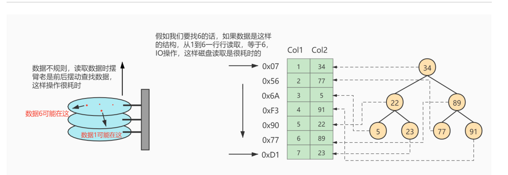

假如给数据使用`二叉树`这样的数据结构进行存储，如下图所示

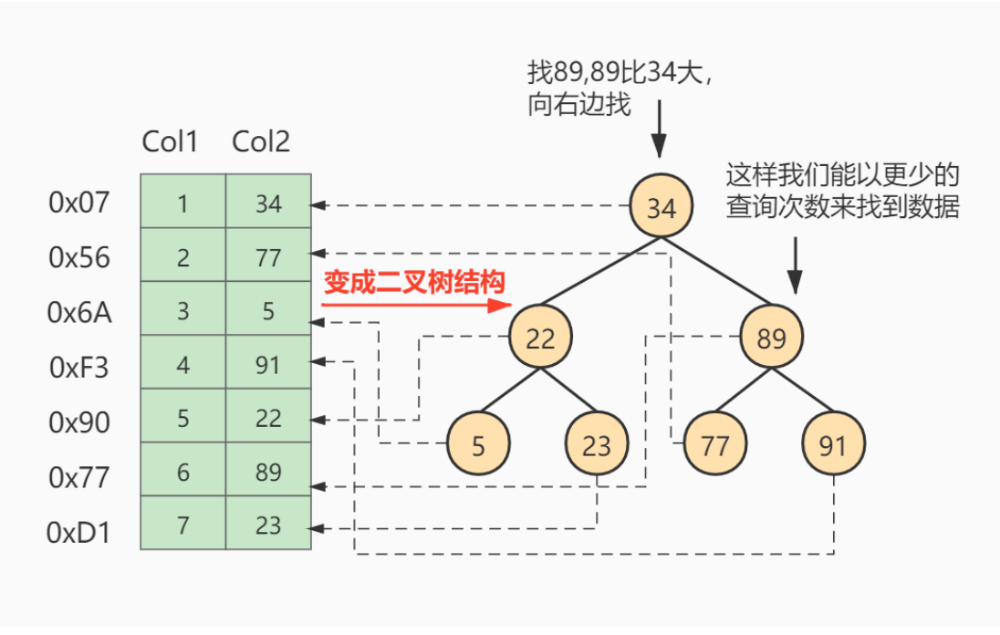

## 2. 索引及其优缺点

### 2.1索引概述

MySQL官方对索引的定义为： `索引（Index）是帮助MySQL高效获取数据的数据结构` 。

**索引的本质：** 索引是数据结构。你可以简单理解为“排好序的快速查找数据结构”，满足特定查找算法。这些数据结构以某种方式指向数据，这样就可以在这些数据结构的基础上实现`高级查找算法`。

### 2.2优点

（ 1 ）类似大学图书馆建书目索引，提高数据检索的效率，降低`数据库的IO成本`，这也是创建索引最主要的原因。

（ 2 ）通过创建唯一索引，可以保证数据库表中每一行`数据的唯一性`。

（ 3 ）在实现数据的 参考完整性方面，可以`加速表和表之间的连接`。换句话说，对于有依赖关系的子表和父表联合查询时，可以提高查询速度。

（ 4 ）在使用分组和排序子句进行数据查询时，可以显著`减少查询中分组和排序的时间`，降低了CPU的消耗。

### 2.3缺点

增加索引也有许多不利的方面，主要表现在如下几个方面：

（ 1 ）创建索引和维护索引要耗费时间，并且随着数据量的增加，所`耗费的时间`也会增加。

（ 2 ）索引需要占`磁盘空间`，除了数据表占数据空间之外，每一个索引还要占一定的物理空间，`存储在磁盘上`，如果有大量的索引，索引文件就可能比数据文件更快达到最大文件尺寸。

（ 3 ）虽然索引大大提高了查询速度，同时却会`降低更新表的速度`。当对表中的数据进行增加、删除和修改的时候，索引也要动态地维护，这样就降低了数据的维护速度。

因此，选择使用索引时，需要综合考虑索引的优点和缺点。

> 提示：在突发插入频繁的情况下，由于索引可以提高查询的速度，但是会影响插入记录的速度。这种情况下，可以先先删除表中的索引，然后插入数据，插入完成后再创建索引。

## 3.InnoDB中索引的推演


### 3. 1 索引之前的查找

先来看一个精确匹配的例子：

```mysql
SELECT [列名列表] FROM 表名 WHERE 列名 = xxx;
```

#### 1.在一个页中的查找

假设目前表中的记录比较少，所有的记录都可以被存放到一个页中，在查找记录的时候可以根据搜索条件的不同分为两种情况:。

- 以主键为搜索条件

  可以在页目录中使用二分法快速定位到对应的槽，然后再遍历该槽对应分组中的记录即可快速找到指定的记录。

- 以其他列作为搜索条件

  因为在数据页中并没有对非主键列建立所谓的页目录，所以我们无法通过二分法快速定位相应的槽。这种情况下只能从最小记录开始依次遍历单链表中的每条记录，然后对比每条记录是不是符合搜索条件。很显然，这种查找的效率是非常低的。

#### 2.在很多页中查找

大部分情况下我们表中存放的记录都是非常多的，需要好多的数据页来存储这些记录。在很多页中查找记录的话可以分为两个步骤:

1. 定位到记录所在的页。

2. 从所在的页内中查找相应的记录。

在没有索引的情况下，不论是根据主键列或者其他列的值进行查找，由于我们并不能快速的定位到记录所在的页，所以只能`从第一个页`沿着`双向链表`一直往下找，在每一个页中根据我们上面的查找方式去查找指定的记录。因为要遍历所有的数据页，所以这种方式显然是`超级耗时`的。如果一个表有一亿条记录呢？此时`索引`应运而生。


### 3. 2 设计索引

建一个表：

```mysql
mysql> CREATE TABLE index_demo(
-> c 1 INT,
-> c 2 INT,
-> c 3 CHAR( 1 ),
-> PRIMARY KEY(c 1 )
-> ) ROW_FORMAT = Compact;
```

这个新建的index_demo表中有 2 个INT类型的列， 1 个CHAR( 1 )类型的列，而且我们规定了c 1 列为主键，这个表使用Compact行格式来实际存储记录的。这里我们简化了index_demo表的行格式示意图：

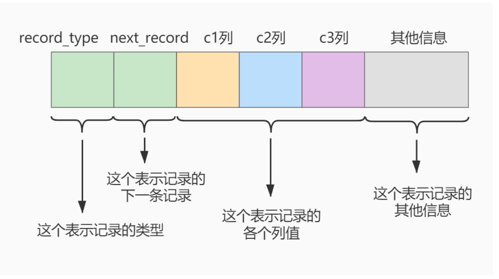

我们只在示意图里展示记录的这几个部分：

- `record_type`：记录头信息的一项属性，表示记录的类型， `0` 表示普通记录、 `2` 表示最小记录、 `3` 表示最大记录、` 1` 目录项暂时还没用过，下面讲。
- `next_record`：记录头信息的一项属性，表示下一条地址相对于本条记录的地址偏移量，我们用箭头来表明下一条记录是谁。
- `各个列的值`：这里只记录在`index_demo`表中的三个列，分别是`c1`、`c2`和`c3`。
- `其他信息`：除了上述 3 种信息以外的所有信息，包括其他隐藏列的值以及记录的额外信息。

将记录格式示意图的其他信息项暂时去掉并把它竖起来的效果就是这样：

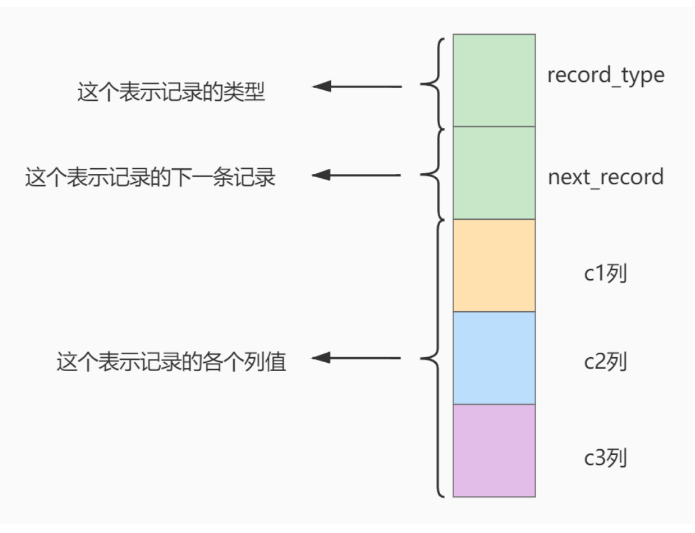

把一些记录放到页里的示意图就是：

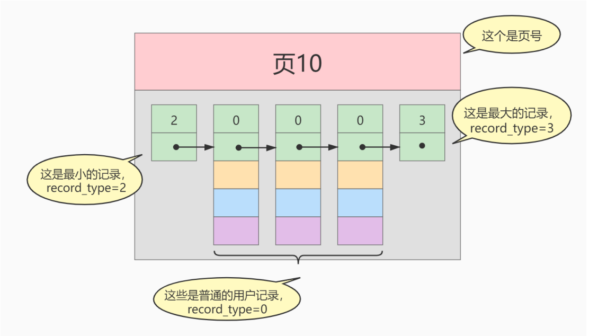


#### 1.一个简单的索引设计方案

我 们 在 根 据 某 个 搜 索 条 件 查 找 一 些 记 录 时 为 什 么 要 遍 历 所 有 的 数 据 页 呢 ？ 因 为 各 个 页 中 的 记 录 并 没 有 规 律 ， 我 们 并 不 知道 我们 的 搜索 条 件 匹 配 哪 些 页 中 的 记 录 ， 所 以 不 得 不 依 次 遍 历 所 有 的 数 据 页 。 所 以 如 果 我 们 想 快 速 的 定 位 到 需 要 查 找 的 记 录在 哪些 数 据 页 中 该 咋 办 ？ 我 们 可 以 为 快 速 定 位 记 录 所 在 的 数 据 页 而 建 立 一 个 目 录 ， 建 这 个 目 录 必 须 完 成 下 边 这 些事 ：

- `下 一 个 数 据 页 中 用 户 记 录 的 主 键 值 必 须 大 于 上 一 个 页 中 用 户 记 录 的 主 键 值 。`

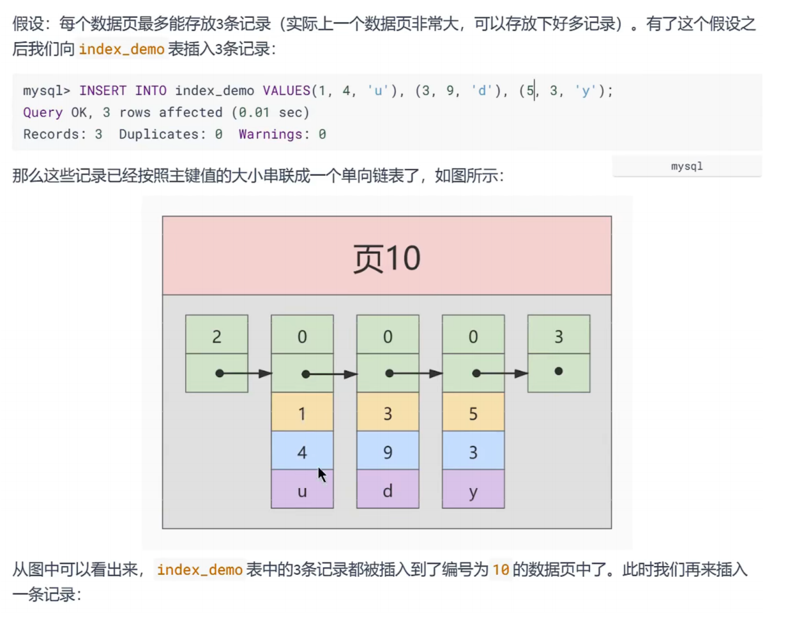

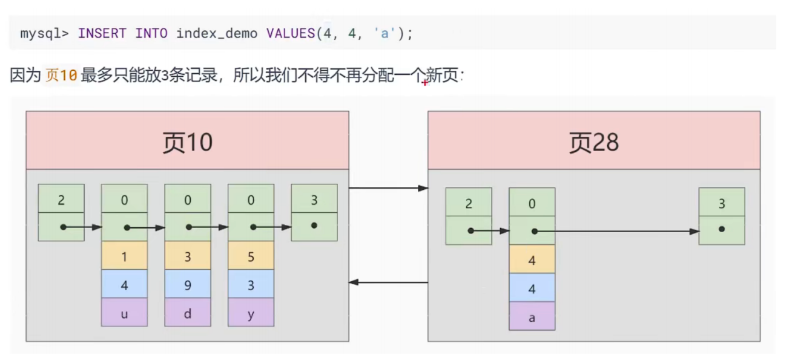

注意，新分配的`数据页编号`可能并不是连续的。它们只是通过维护着上一页和下一页的编号而建立了`链表`的关系。另外，`页10`中用户记录最大的主键值是`5`，而`页28`中有一条记录的主键值为`4`,因为`5 > 4`，所以这就不符合下一个数据页中用户记录的主键值必须大于上一个页中用户记录的主键值的要求，所以在插入主键值为4的记录的时候需要伴随着`记录移动`，也就是把主键值为5的记录移动到页28中，然后再把主键值为4的记录插入到页10中，这个过程的示意图如下：

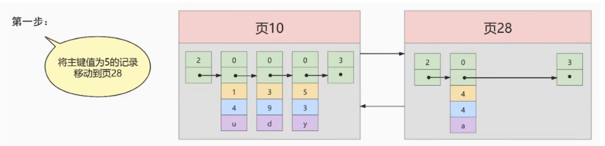

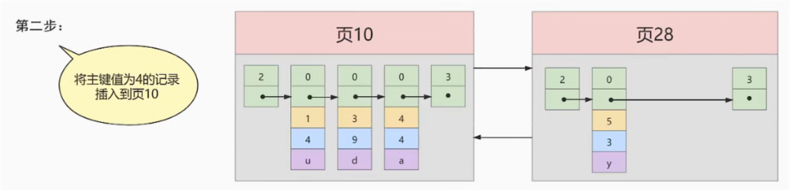

这个过程表明了对页中的记录进行增删改操作的过程中，我们必须通过一些诸如`记录移动`的操作来始终保证这个状态一直成立：下一个数据页中用户记录的主键值必须大于上一个页中用户记录的主键值。这个过程我们称之为`页分裂`。

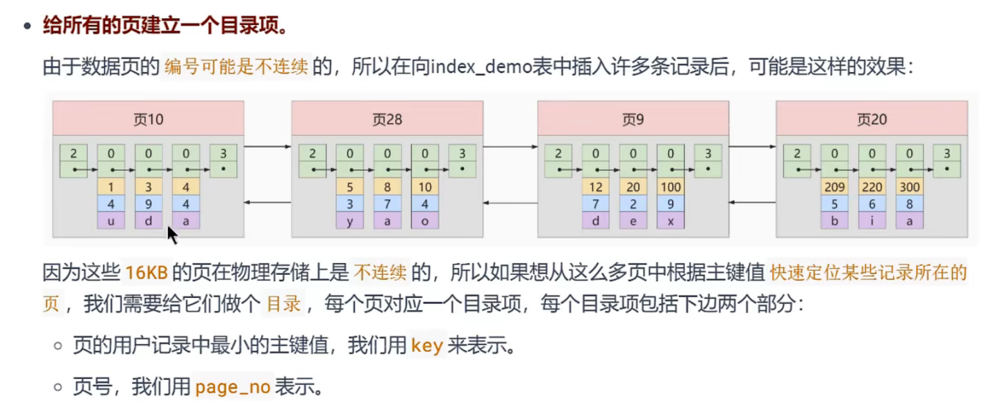

所以我们为上边几个页做好的目录就像这样子：

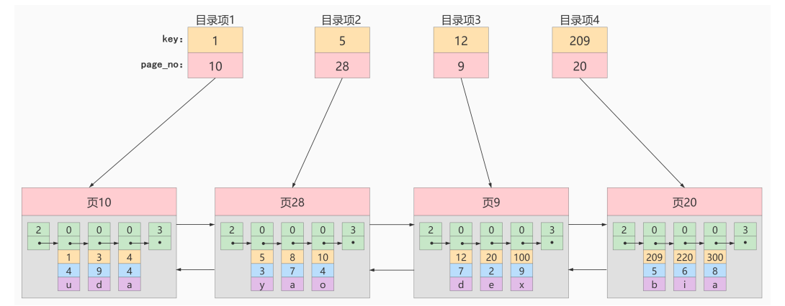

以`页 28` 为例，它对应`目录项 2 `，这个目录项中包含着该页的页号 `28` 以及该页中用户记录的最小主键值 5 。我们只需要把几个目录项在物理存储器上连续存储（比如：数组），就可以实现根据主键值快速查找某条记录的功能了。比如：查找主键值为 `20` 的记录，具体查找过程分两步：

1. 先从目录项中根据`二分法`快速确定出主键值为 `20` 的记录在`目录项 3` 中（因为 `12 < 20 <209` ），它对应的页是`页 9` 。

2. 再根据前边说的在页中查找记录的方式去`页 9` 中定位具体的记录。

至此，针对数据页做的简易目录就搞定了。这个目录有一个别名，称为`索引`。

#### 2. InnoDB中的索引方案

##### **① 迭代 1 次：目录项纪录的页**


我们把前边使用到的目录项放到数据页中的样子就是这样：

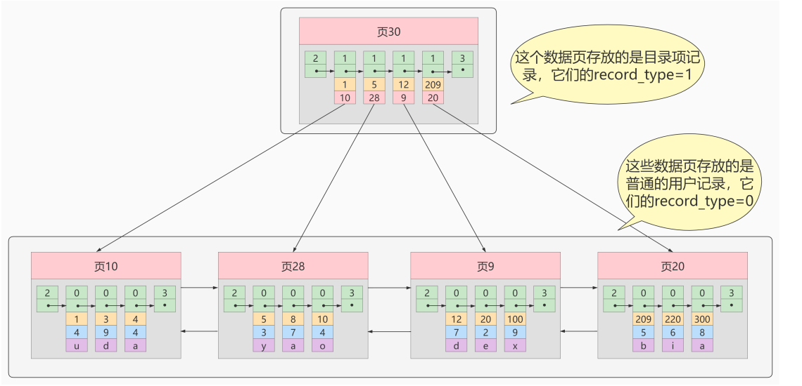

从图中可以看出来，我们新分配了一个编号为 30 的页来专门存储目录项记录。这里再次强调`目录项记录`和普通的`用户记录`的 不同点 ：

- `目录项记录`的`record_type`值是 1 ，而`普通用户记录`的`record_type`值是 0 。
- 目录项记录只有`主键值和页的编号`两个列，而普通的用户记录的列是用户自己定义的，可能包含`很多列`，另外还有InnoDB自己添加的隐藏列。
- 了解：记录头信息里还有一个叫`min_rec_mask`的属性，只有在存储`目录项记录`的页中的主键值最小的`目录项记录`的`min_rec_mask`值为 `1` ，其他别的记录的`min_rec_mask`值都是 `0` 。

**相同点**： 两者用的是一样的数据页，都会为主键值生成`Page Directory（页目录）`，从而在按照主键值进行查找时可以使用`二分法`来加快查询速度。

现在以查找主键为 20 的记录为例，根据某个主键值去查找记录的步骤就可以大致拆分成下边两步：

1. 先到存储目录项记录的页，也就是页 30 中通过二分法快速定位到对应目录项，因为 12 < 20 <
209 ，所以定位到对应的记录所在的页就是页 9 。
2. 再到存储用户记录的页 9 中根据二分法快速定位到主键值为 20 的用户记录。

##### ② 迭代 2 次：多个目录项纪录的页


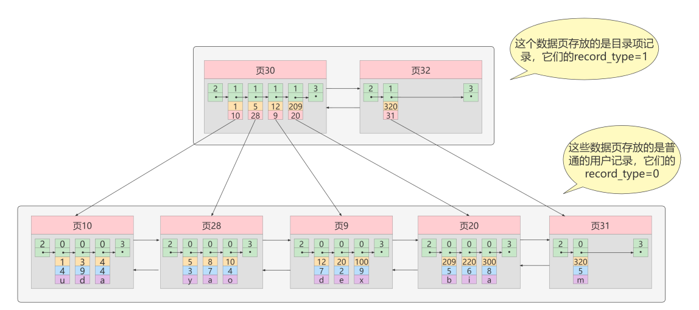

从图中可以看出，我们插入了一条主键值为 320 的用户记录之后需要两个新的数据页：

- 为存储该用户记录而新生成了`页 31` 。
- 因为原先存储目录项记录的`页 30 的容量已满`（我们前边假设只能存储 4 条目录项记录），所以不得不需要一个新的`页^32` 来存放`页^31` 对应的目录项。

现在因为存储目录项记录的页不止一个，所以如果我们想根据主键值查找一条用户记录大致需要 3 个步骤，以查找主键值为 `20` 的记录为例：

1. 确定`目录项记录页`

   我们现在的存储目录项记录的页有两个，即`页 30` 和`页 32` ，又因为页 30 表示的目录项的主键值的范围是`[ 1 , 320 )`，页 32 表示的目录项的主键值不小于 `320` ，所以主键值为 `20` 的记录对应的目录项记录在`页^30` 中。

2. 通过目录项记录页`确定用户记录真实所在的页`。

   在一个存储`目录项记录`的页中通过主键值定位一条目录项记录的方式说过了。

3. 在真实存储用户记录的页中定位到具体的记录。

##### ③迭代^3 次：目录项记录页的目录页


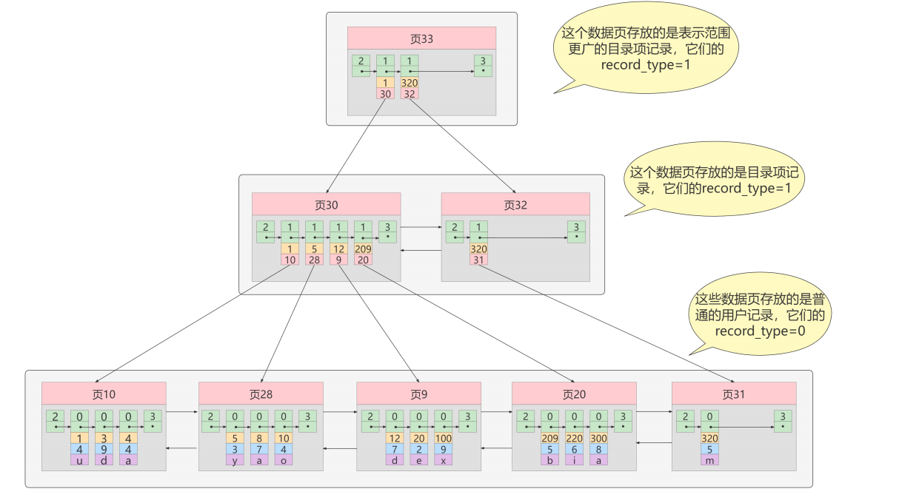

如图，我们生成了一个存储更高级目录项的页 (^33) ，这个页中的两条记录分别代表页 30 和页 32 ，如果用户记录的主键值在[1, 320)之间，则到页 30 中查找更详细的目录项记录，如果主键值不小于 320 的话，就到页 32 中查找更详细的目录项记录。

随着表中记录的增加，这个目录的层级会继续增加，如果简化一下，我们可以用下边这个图来描述它：

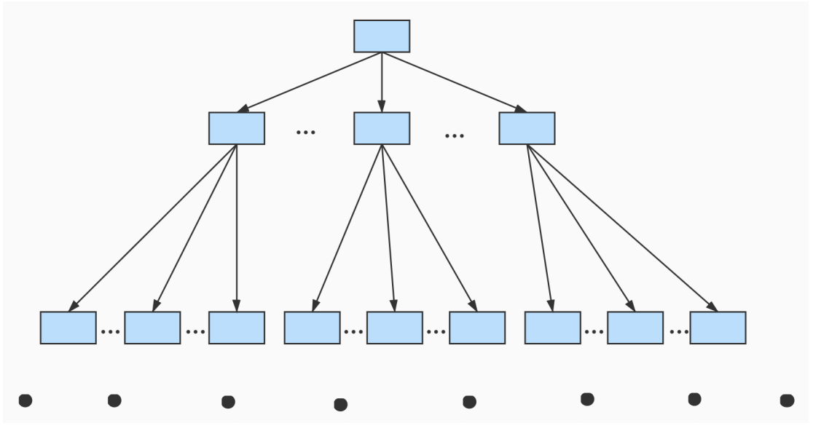

###### 这个数据结构，它的名称是`B+树`。

##### ④B+Tree


一个B+树的节点其实可以分成好多层，规定最下边的那层，也就是存放我们用户记录的那层为第`0` 层，之后依次往上加。之前我们做了一个非常极端的假设：存放用户记录的页`最多存放 (^3) 条记录`，存放目录项记录的页`最多存放 4 条记录`。其实真实环境中一个页存放的记录数量是非常大的，假设所有存放用户记录的叶子节点代表的数据页可以存放 `100 条用户记录`，所有存放目录项记录的内节点代表的数据页可以存放` 1000 条目录项记录`，那么：

- 如果B+树只有 1 层，也就是只有 1 个用于存放用户记录的节点，最多能存放 `100` 条记录。
- 如果B+树有 2 层，最多能存放`1000×100=10,0000`条记录。
- 如果B+树有 3 层，最多能存放`1000×1000×100=1,0000,0000`条记录。
- 如果B+树有 4 层，最多能存放`1000×1000×1000×100=1000,0000,0000`条记录。相当多的记录！！！

你的表里能存放 `100000000000` 条记录吗？所以一般情况下，我们`用到的B+树都不会超过 4 层`，那我们通过主键值去查找某条记录最多只需要做 4 个页面内的查找（查找 3 个目录项页和一个用户记录页），又因为在每个页面内有所谓的`PageDirectory（页目录）`，所以在页面内也可以通过`二分法`实现快速定位记录。

### 3.3常见索引概念

索引按照物理实现方式，索引可以分为 2 种：聚簇（聚集）和非聚簇（非聚集）索引。我们也把非聚集索引称为二级索引或者辅助索引。

#### 1.聚簇索引

**所有的用户记录都存在了 叶子节点，数据即索引，索引即数据**

**特点：**

1. 使用记录主键值的大小进行记录和页的排序，这包括三个方面的含义：

   - `页内`的记录是按照主键的大小顺序排成一个`单向链表`。

     各个存放用户记录的页也是根据页中用户记录的主键大小顺序排成一个双向链表。存放目录项记录的页分为不同的层次，在同一层次中的页也是根据页中目录项记录的主键大小顺序排成一个双向链表。

2. B+树的叶子节点存储的是完整的用户记录。

    所谓完整的用户记录，就是指这个记录中存储了所有列的值（包括隐藏列）。

**优点：**

- `数据访问更快`，因为聚簇索引将索引和数据保存在同一个B+树中，因此从聚簇索引中获取数据比非聚簇索引更快

- 聚簇索引对于主键的`排序查找`和`范围查找`速度非常快

  按照聚簇索引排列顺序，查询显示一定范围数据的时候，由于数据都是紧密相连，数据库不用从多个数据块中提取数据，所以节省了大量的io操作。

**缺点：**

- `插入速度严重依赖于插入顺序`，按照主键的顺序插入是最快的方式，否则将会出现页分裂，严重影响性能。因此，对于InnoDB表，我们一般都会定义一个 **自增的ID列为主键**
- `更新主键的代价很高`，因为将会导致被更新的行移动。因此，对于InnoDB表，我们一般定义 **主键为不可更新**
- `二级索引访问需要两次索引查找`，第一次找到主键值，第二次根据主键值找到行数据

#### 2.二级索引（辅助索引、非聚簇索引）


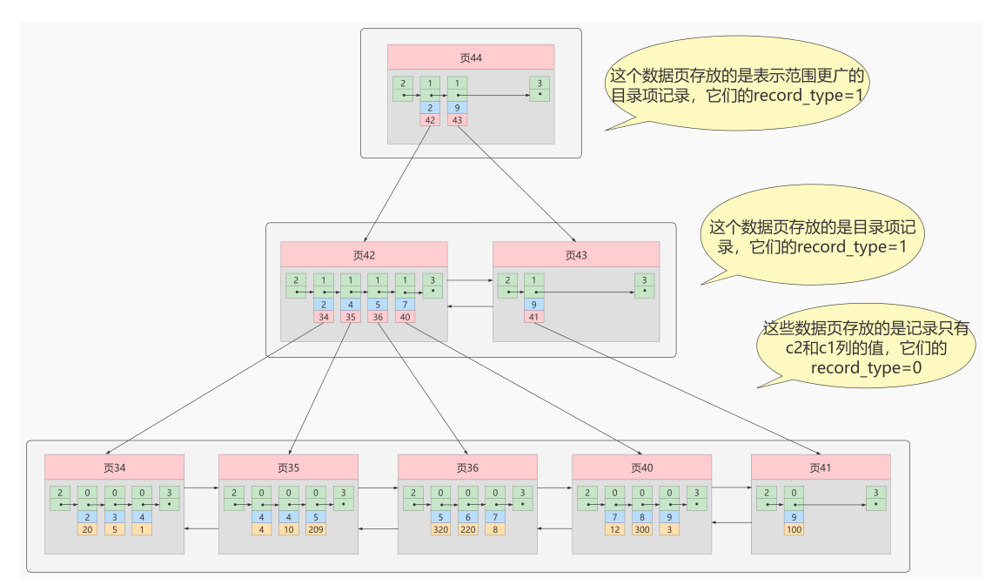

**概念：回表** 我们根据这个以c 2 列大小排序的B+树只能确定我们要查找记录的主键值，所以如果我们想根据c 2 列的值查找到完整的用户记录的话，仍然需要到`聚簇索引`中再查一遍，这个过程称为`回表`。也就是根据c 2 列的值查询一条完整的用户记录需要使用到 `2` 棵B+树！

**问题：** 为什么我们还需要一次`回表`操作呢？直接把完整的用户记录放到叶子节点不OK吗？

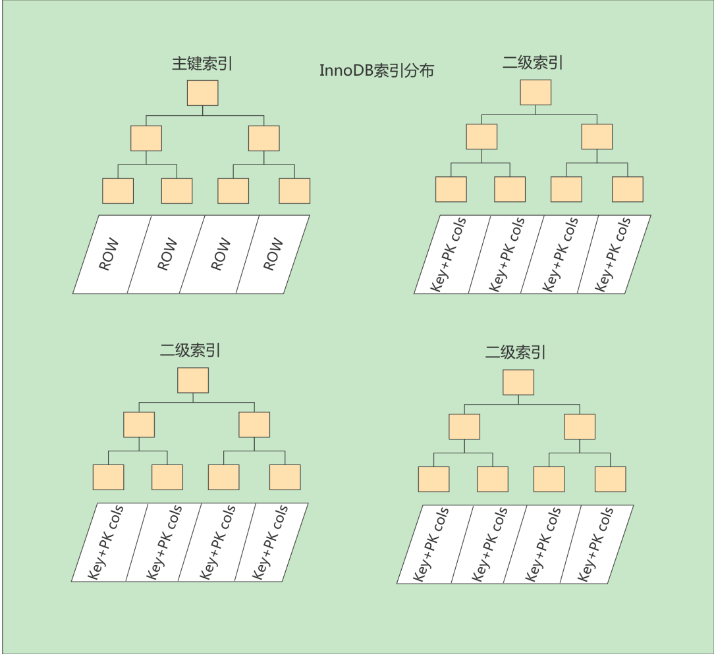

#### 3. 联合索引

我们也可以同时以多个列的大小作为排序规则，也就是同时为多个列建立索引，比方说我们想让B+树按照`c2 和c 3 列`的大小进行排序，这个包含两层含义：

- 先把各个记录和页按照c 2 列进行排序。
- 在记录的c 2 列相同的情况下，采用c 3 列进行排序

注意一点，以c 2 和c 3 列的大小为排序规则建立的B+树称为联合索引，本质上也是一个二级索引。它的意思与分别为c 2 和c 3 列分别建立索引的表述是不同的，不同点如下：

- 建立联合索引只会建立如上图一样的 1 棵B+树。
- 为c 2 和c 3 列分别建立索引会分别以c 2 和c 3 列的大小为排序规则建立 2 棵B+树。

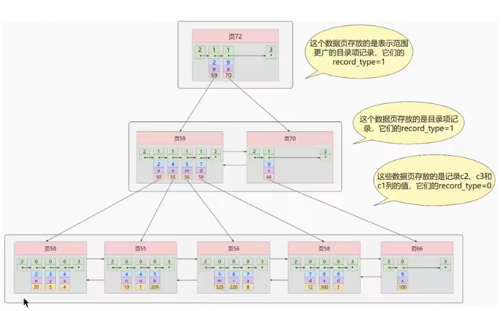

### 3. 4 InnoDB的B+树索引的注意事项

#### 1. 根页面位置万年不动


#### 2 .内节点中目录项记录的唯一性

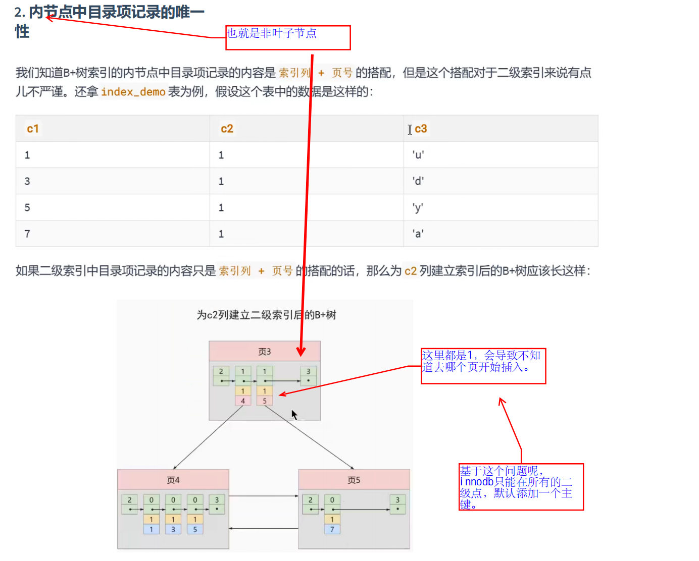


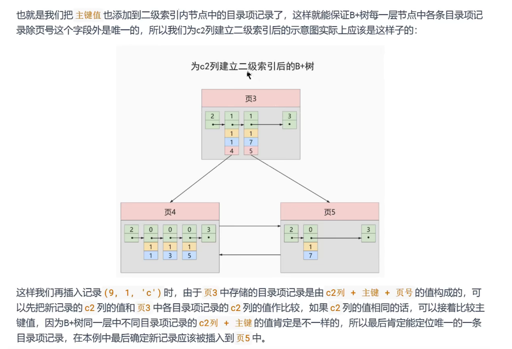

#### 3.一个页面最少存储 2 条记录

一个B+树只需要很少的层级就可以轻松存储数亿条记录，查询速度相当不错!这是因为B+树本质上就是一个大的多层级目录，每经过一个目录时都会过滤掉许多无效的子目录，直到最后访问到存储真实数据的目录。那如果一个大的目录中只存放一个子目录是个啥效果呢?那就是目录层级非常非常非常多，而且最后的那个存放真实数据的目录中只能存放一条记录。费了半天劲只能存放一条真实的用户记录?所以InnoDB的一个数据页至少可以存放两条记录。

一个B+树只需要很少的层级就可以轻松存储数亿条记录，查询速度相当不错！这是因为B+树本质上就是一个大的多层级目录，每经过一个目录时都会过滤掉许多无效的子目录，直到最后访问到存储真实数据的目录.那如果一个大的目录中只存放一个子目录是个啥效果呢？那就是目录层级非常非常非常多，而且最后的那个存放真实数据的目录中只能存放一条记录.费了半天劲只能存放一条真实的用户记录？所以InnoDB的一个数据页至少可以存放两条记录。

## 4. MyISAM中的索引方案

**B树索引适用存储引擎如表所示：**

| 索引 / 存储引擎 | MyISAM | InnoDB | Memory |
| --------------- | ------ | ------ | ------ |
| B-Tree索引      | 支持   | 支持   | 支持   |

即使多个存储引擎支持同一种类型的索引，但是他们的实现原理也是不同的。Innodb和MyISAM默认的索引是Btree索引；而Memory默认的索引是Hash索引。

MyISAM引擎使用`B+Tree`作为索引结构，叶子节点的data域存放的是`数据记录的地址`。

### 4. 2 MyISAM索引的原理


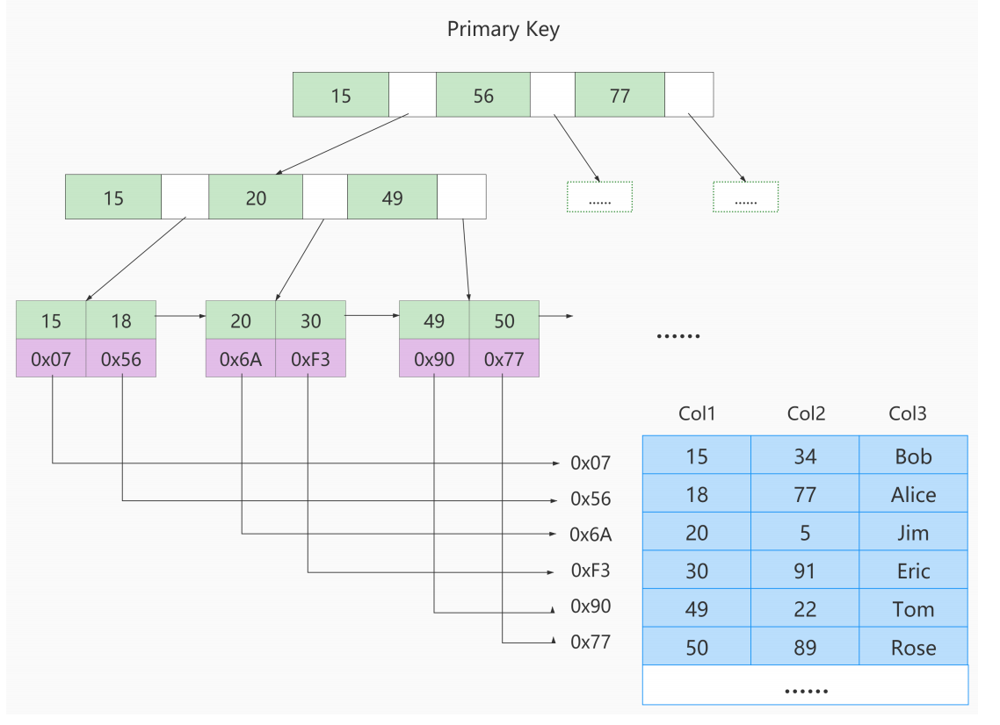

如果我们在Col 2 上建立一个二级索引，则此索引的结构如下图所示：

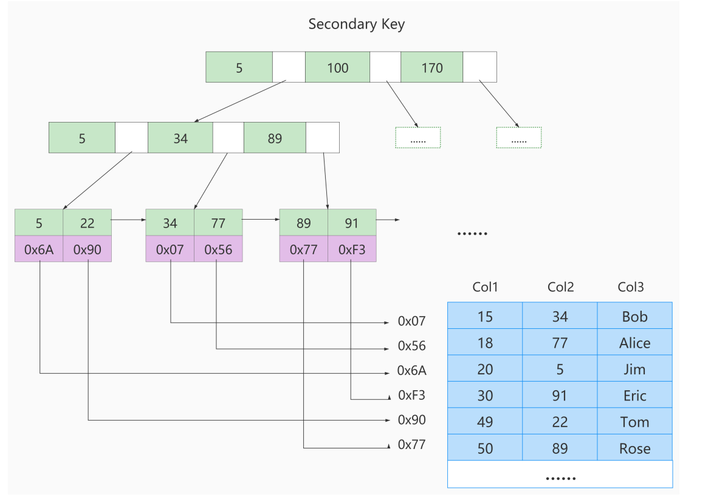

同样也是一棵B+Tree，data域保存数据记录的地址。因此，MyISAM中索引检索的算法为:首先按照B+Tree搜索算法搜索索引，如果指定的Key存在，则取出其data域的值，然后以data域的值为地址，读取相应数据记录。


### 4. 3 MyISAM 与 InnoDB对比

**MyISAM的索引方式都是“非聚簇”的，与InnoDB包含 1 个聚簇索引是不同的。小结两种引擎中索引的区别：**

① 在InnoDB存储引擎中，我们只需要根据主键值对`聚簇索引`进行一次查找就能找到对应的记录，而在`MyISAM`中却需要进行一次`回表`操作，意味着MyISAM中建立的索引相当于全部都是`二级索引`。

② InnoDB的数据文件本身就是索引文件，而MyISAM索引文件和数据文件是`分离的`，索引文件仅保存数据记录的地址。

③ InnoDB的非聚簇索引data域存储相应记录`主键的值`，而MyISAM索引记录的是`地址`。换句话说，InnoDB的所有非聚簇索引都引用主键作为data域。

④ MyISAM的回表操作是十分`快速`的，因为是拿着地址偏移量直接到文件中取数据的，反观InnoDB是通过获取主键之后再去聚簇索引里找记录，虽然说也不慢，但还是比不上直接用地址去访问。

⑤ InnoDB要求表`必须有主键`（`MyISAM可以没有`）。如果没有显式指定，则MySQL系统会自动选择一个可以非空且唯一标识数据记录的列作为主键。如果不存在这种列，则MySQL自动为InnoDB表生成一个隐含字段作为主键，这个字段长度为 6 个字节，类型为长整型。

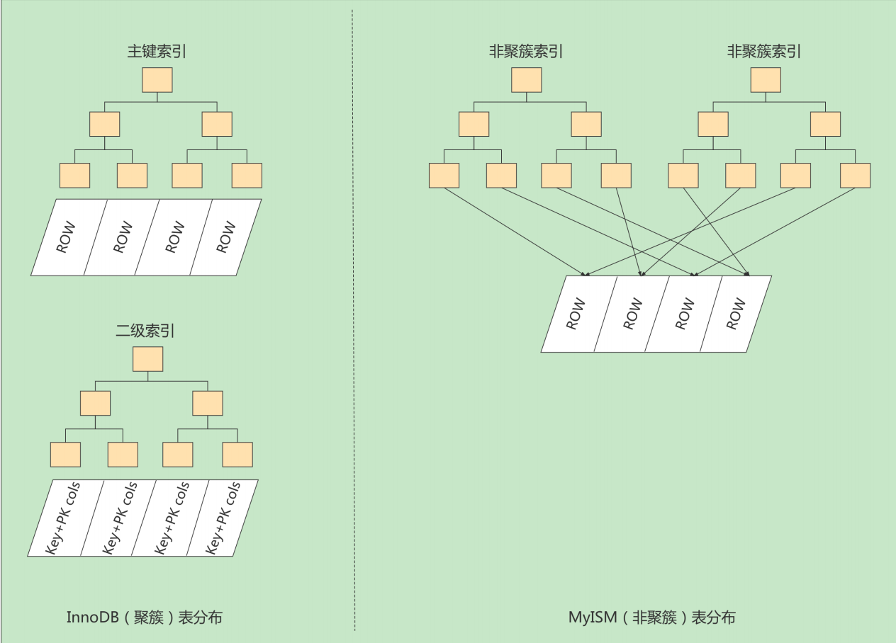

## 5. 索引的代价

索引是个好东西，可不能乱建，它在空间和时间上都会有消耗：

- 空间上的代价

  每建立一个索引都要为它建立一棵B+树，每一棵B+树的每一个节点都是一个数据页，一个页默认会占用 `16 KB`的存储空间，一棵很大的B+树由许多数据页组成，那就是很大的一片存储空间。

- 时间上的代价

  每次对表中的数据进行`增、删、改`操作时，都需要去修改各个B+树索引。而且我们讲过，B+树每层节点都是按照索引列的值`从小到大的顺序`排序而组成了`双向链表`。不论是叶子节点中的记录，还是内节点中的记录（也就是不论是用户记录还是目录项记录）都是按照索引列的值从小到大的顺序而形成了一个单向链表。而增、删、改操作可能会对节点和记录的排序造成破坏，所以存储引擎需要额外的时间进行一些`记录移位`，`页面分裂`、`页面回收`等操作来维护好节点和记录的排序。如果我们建了许多索引，每个索引对应的B+树都要进行相关的维护操作，会给性能拖后腿。

> 总结：一个表上索引建的越多，就会占用越多的存储空间，在增删改记录的时候性能就越差。为了能建立又好又少的索引，我们得学学这些索引在哪些条件下起作用的。

## 6. MySQL数据结构选择的合理性


### 6. 1 全表遍历

这里都懒得说了。

### 6. 2 Hash结构

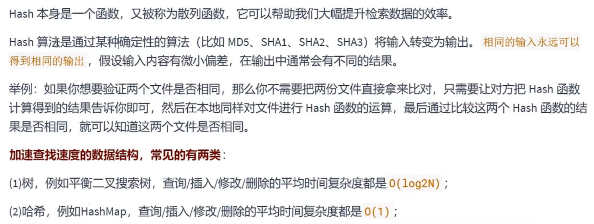

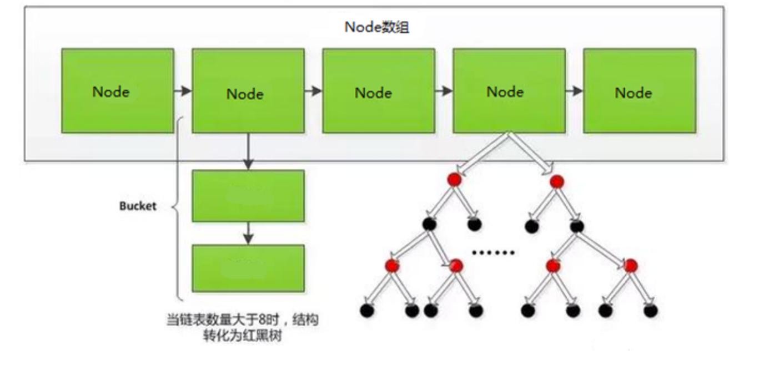


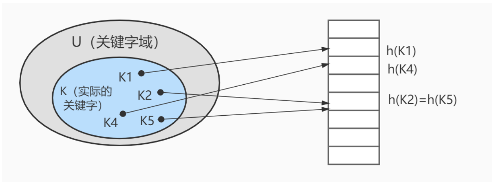

上图中哈希函数h有可能将两个不同的关键字映射到相同的位置，这叫做`碰撞`，在数据库中一般采用`链接法`来解决。在链接法中，将散列到同一槽位的元素放在一个链表中，如下图所示：

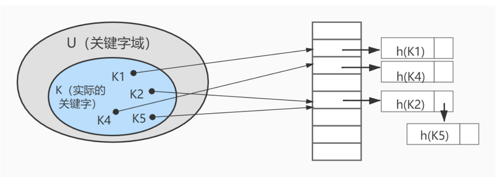

实验：体会数组和hash表的查找方面的效率区别

```java
// 算法复杂度为 O(n)
@Test
public void test1 (){
		int[] arr = new int[ 100000 ];
		for(int i = 0;i < arr.length;i++){
				arr[i] = i + 1 ;
		}
		long start = System.currentTimeMillis();
		for(int j = 1 ; j<= 100000 ;j++){
				int temp = j;
				for(int i = 0 ;i < arr.length;i++){
						if(temp == arr[i]){
								break;
								}
						}
			}
			long end = System.currentTimeMillis();
			System.out.println("time： " + (end - start)); //time： 823
}
```

```java
//算法复杂度为 O( 1 )
@Test
public void test 2 (){
		HashSet<Integer> set = new HashSet<>( 100000 );
		for(int i = 0 ;i < 100000 ;i++){
				set.add(i + 1 );
		}
  	long start = System.currentTimeMillis();
  	for(int j = 1 ; j<= 100000 ;j++) {
				int temp = j;
				boolean contains = set.contains(temp);
		}
		long end = System.currentTimeMillis();
  	System.out.println("time： " (^) + (end - start)); (^) //time： 5
}
```

**Hash结构效率高，那为什么索引结构要设计成树型呢？**

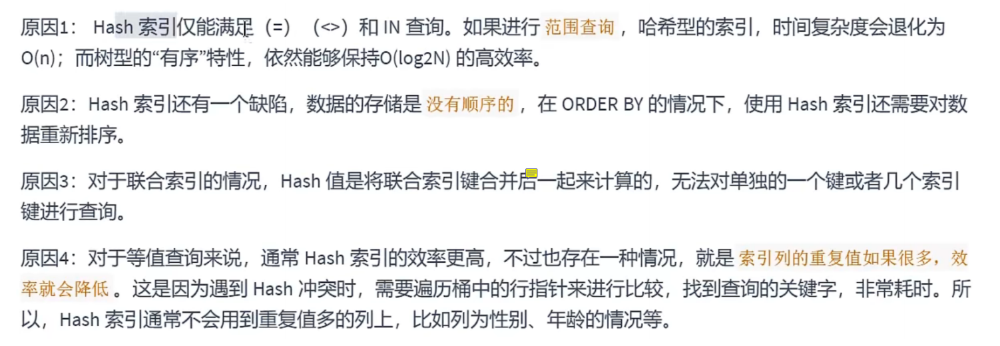

**Hash索引适用存储引擎如表所示：**

| 索引 / 存储引擎 | MyISAM | InnoDB |      |
| --------------- | ------ | ------ | ---- |
| HASH索引        | 不支持 | 不支持 | 支持 |

**Hash索引的适用性：**


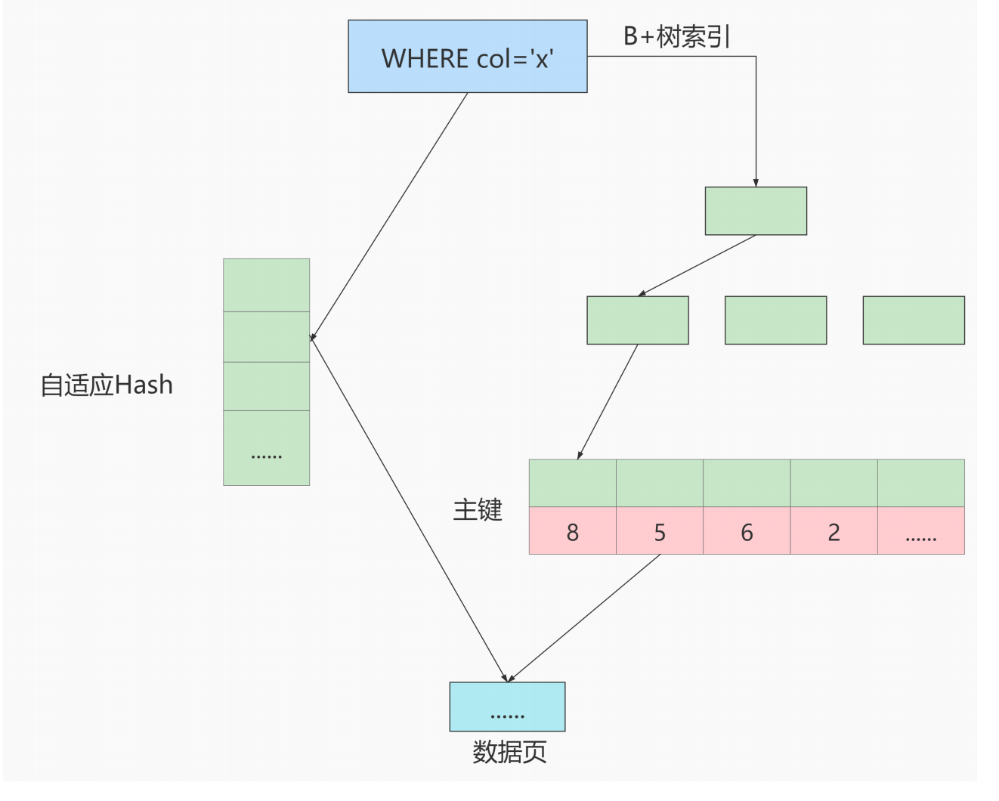

采用自适应 Hash 索引目的是方便根据 SQL 的查询条件加速定位到叶子节点，特别是当 B+ 树比较深的时候，通过自适应 Hash 索引可以明显提高数据的检索效率。

我们可以通过`innodb_adaptive_hash_index`变量来查看是否开启了自适应 Hash，比如：

```mysql
mysql> show variables like (^) '%adaptive_hash_index';
```

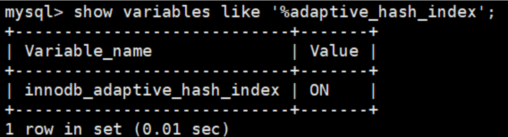


### 6. 3 二叉搜索树

如果我们利用二叉树作为索引结构，那么磁盘的IO次数和索引树的高度是相关的。

1. 二叉搜索树的特点

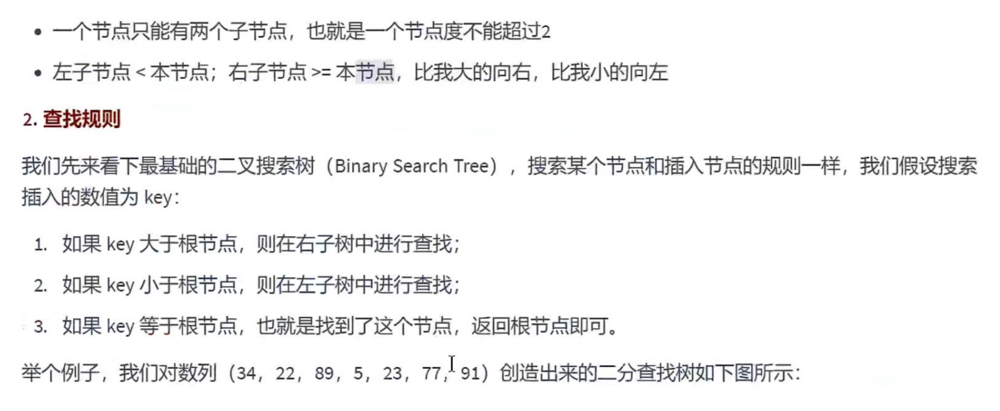

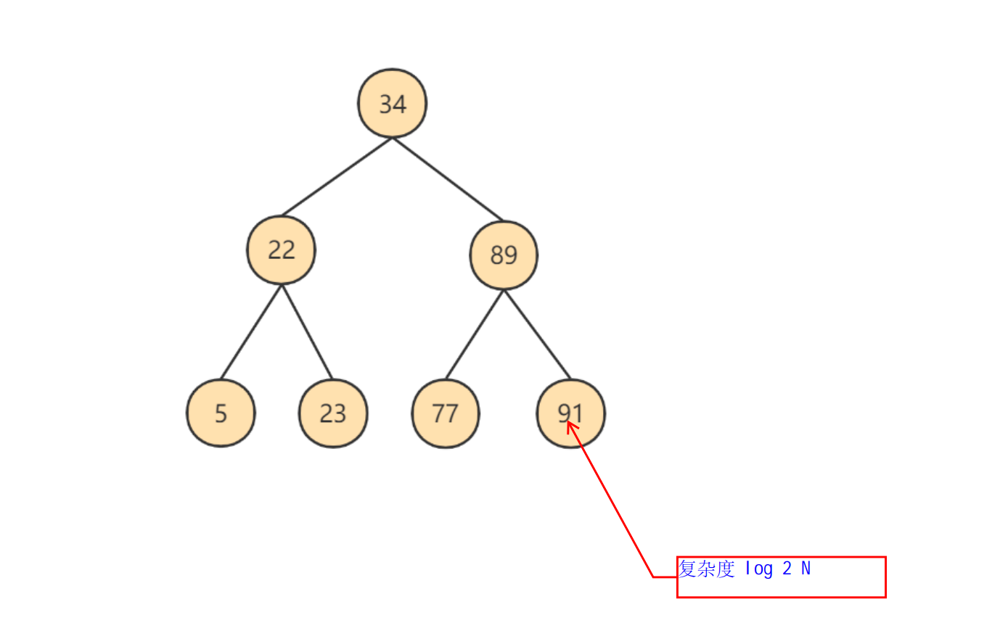

但是存在特殊的情况，就是有时候二叉树的深度非常大。比如我们给出的数据顺序是(5,22,23,34,77,89,91)，创造出来的二分搜索树如下图所示:

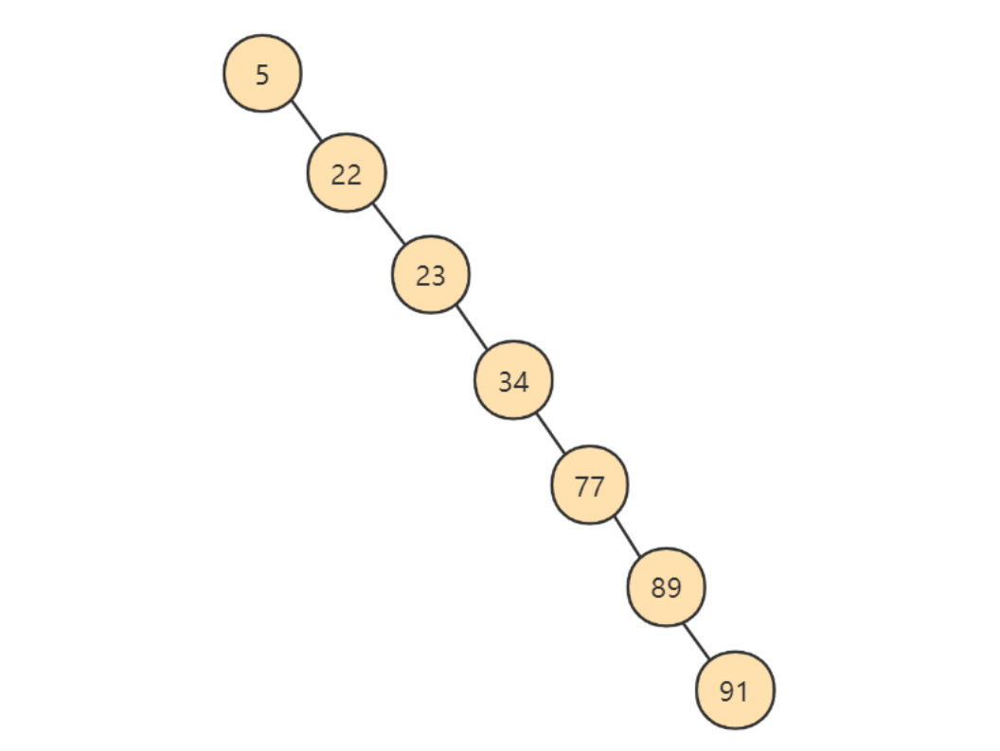


### 6. 4 AVL树


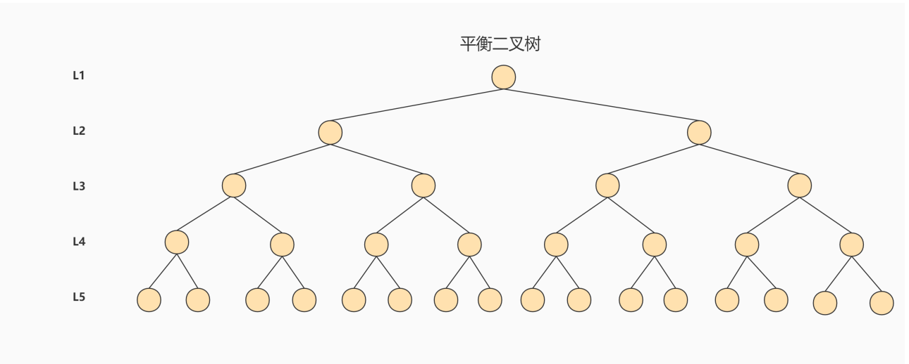


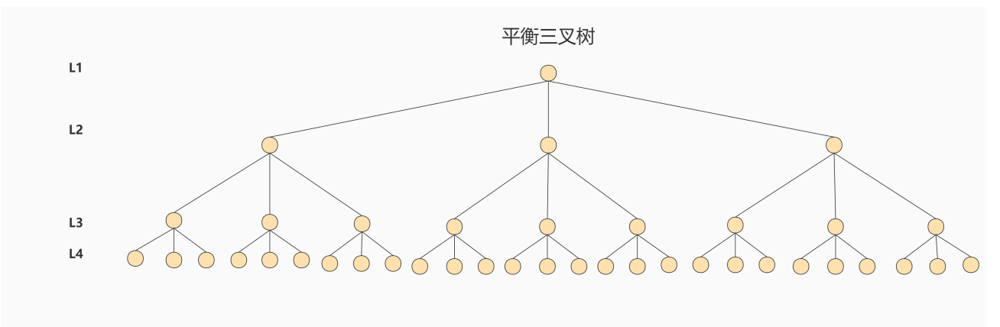


### **6.5 B-Tree**

B 树的英文是 Balance Tree，也就是`多路平衡查找树`。简写为B-Tree（注意横杠表示这两个单词连起来的意思，不是减号）。它的高度远小于平衡二叉树的高度。

B 树的结构如下图所示：

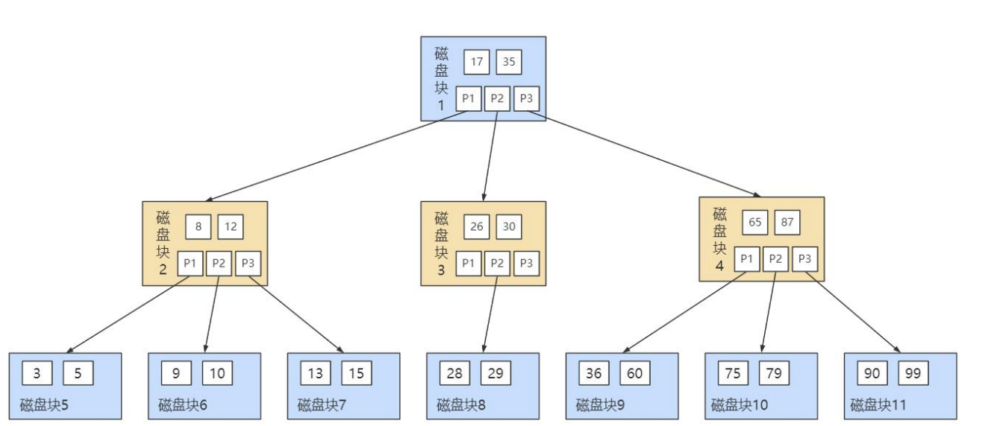


一个 M 阶的 B 树（M> 2 ）有以下的特性：

1. 根节点的儿子数的范围是 [ 2 ,M]。
2. 每个中间节点包含 k- 1 个关键字和 k 个孩子，孩子的数量 = 关键字的数量 + 1 ，k 的取值范围为[ceil(M/ 2 ), M]。
3. 叶子节点包括 k- 1 个关键字（叶子节点没有孩子），k 的取值范围为 [ceil(M/ 2 ), M]。
4. 假设中间节点节点的关键字为：Key[ 1 ], Key[ 2 ], ..., Key[k- 1 ]，且关键字按照升序排序，即 Key[i]<Key[i+ 1 ]。此时 k- 1 个关键字相当于划分了 k 个范围，也就是对应着 k 个指针，即为：P[ 1 ], P[ 2 ], ...,P[k]，其中 P[ (^1) ] 指向关键字小于 Key[ (^1) ] 的子树，P[i] 指向关键字属于 (^) (Key[i- (^1) ], Key[i]) (^) 的子树，P[k]指向关键字大于^ Key[k-^1 ]^ 的子树。

5. 所有叶子节点位于同一层。
    上面那张图所表示的 B 树就是一棵 3 阶的 B 树。我们可以看下磁盘块 2 ，里面的关键字为（ 8 ， 12 ），它有 3 个孩子 ( 3 ， 5 )，( 9 ， 10 ) 和 ( 13 ， 15 )，你能看到 ( 3 ， 5 ) 小于 8 ，( 9 ， 10 ) 在 8 和 12 之间，而 ( 13 ， 15 )大于 12 ，刚好符合刚才我们给出的特征。
    然后我们来看下如何用 B 树进行查找。假设我们想要查找的关键字是 9 ，那么步骤可以分为以下几步：
  1. 我们与根节点的关键字 ( 17 ，^35 ）进行比较，^9 小于 17 那么得到指针 P 1 ；
  2. 按照指针 P 1 找到磁盘块 2 ，关键字为（^8 ， 12 ），因为 9 在 8 和 12 之间，所以我们得到指针 P 2 ；
  3. 按照指针 P 2 找到磁盘块 6 ，关键字为（ (^9) ， 10 ），然后我们找到了关键字 9 。


你能看出来在 B 树的搜索过程中，我们比较的次数并不少，但如果把数据读取出来然后在内存中进行比较，这个时间就是可以忽略不计的。而读取磁盘块本身需要进行 I/O 操作，消耗的时间比在内存中进行比较所需要的时间要多，是数据查找用时的重要因素。B 树相比于平衡二叉树来说磁盘 I/O 操作要少，在数据查询中比平衡二叉树效率要高。所以只要树的高度足够低，IO次数足够少，就可以提高查询性能。


**再举例**  **：**

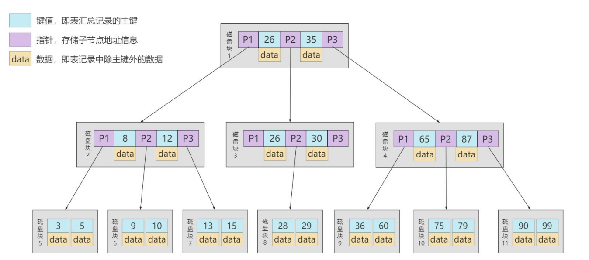


### 6. 6 B+Tree

B+树也是一种多路搜索树，基于`B树做出了改进`，主流的DBMS都支持B+树的索引方式，比如MySQL。相比于B-Tree，`B+Tree适合文件索引系统`。

- MySQL官网说明：

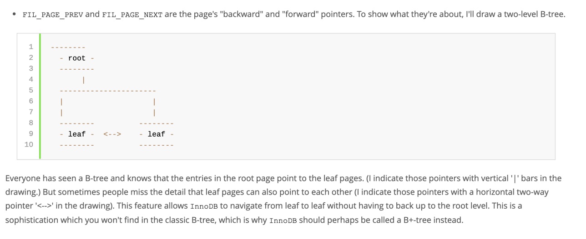

**B+树和 B 树的差异：**

1. 有 k 个孩子的节点就有 k 个关键字。也就是孩子数量 = 关键字数，而 B 树中，孩子数量 = 关键字数+1 。


2. 非叶子节点的关键字也会同时存在在子节点中，并且是在子节点中所有关键字的最大（或最

###### 小）。

3. 非叶子节点仅用于索引，不保存数据记录，跟记录有关的信息都放在叶子节点中。而 B 树中，`非叶子节点既保存索引，也保存数据记录`。

4. 所有关键字都在叶子节点出现，叶子节点构成一个有序链表，而且叶子节点本身按照关键字的大小从小到大顺序链接。

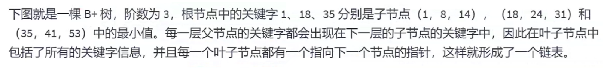

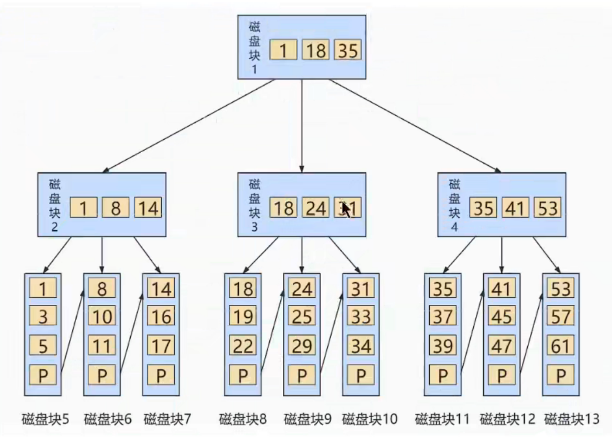

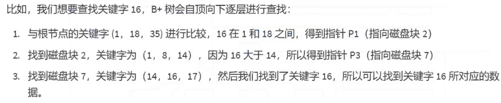


> B 树和 B+ 树都可以作为索引的数据结构，在 MySQL 中采用的是 B+ 树。
>
> 但B树和B+树各有自己的应用场景，不能说B+树完全比B树好，反之亦然。

**思考题：为了减少IO，索引树回一次性加载吗？**

> 1、数据库索引是存储在磁盘上的，如果数据量很大，必然导致索引的大小也会很大，超过几个G。
>
> 2、当我们利用索引进行查询的时候，是不可能将全部几个G的索引都加载进内存的，我们能做的只能是：逐一加载每一个磁盘页，因为磁盘页对应着索引树的节点。

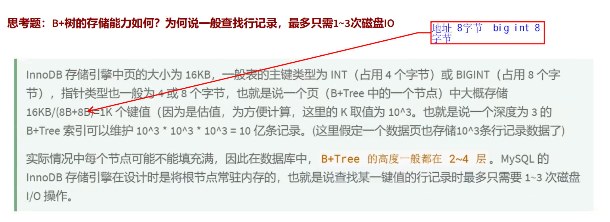

**思考题：为什么说B+树比B-树更适合实际应用中操作系统的文件索引和数据库索引？**

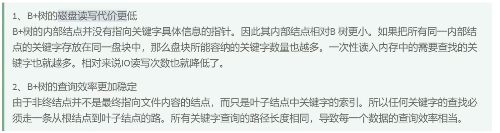

**思考题：Hash 索引与 B+ 树索引的区别**

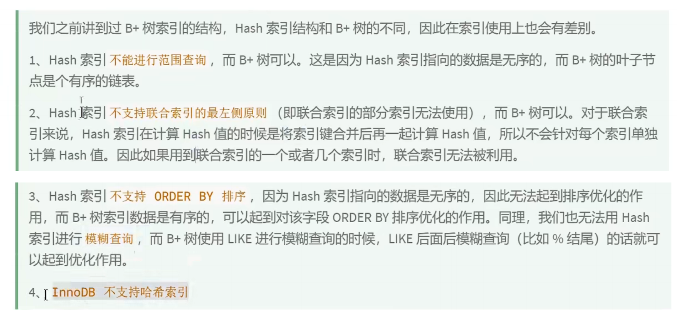

**思考题：Hash 索引与B+ 树索引是在建索引的时候手动指定的吗？**


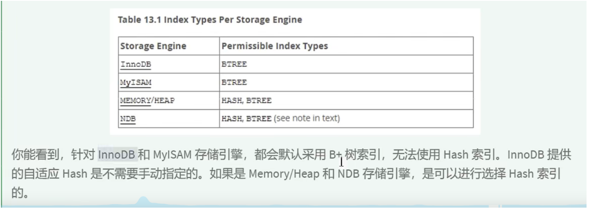


### 6. 7 R树

R-Tree在MySQL很少使用，仅支持`geometry数据类型`，支持该类型的存储引擎只有myisam、bdb、innodb、ndb、archive几种。举个R树在现实领域中能够解决的例子：查找 20 英里以内所有的餐厅。如果没有R树你会怎么解决？一般情况下我们会把餐厅的坐标(x,y)分为两个字段存放在数据库中，一个字段记录经度，另一个字段记录纬度。这样的话我们就需要遍历所有的餐厅获取其位置信息，然后计算是否满足要求。如果一个地区有 100 家餐厅的话，我们就要进行 100 次位置计算操作了，如果应用到谷歌、百度地图这种超大数据库中，这种方法便必定不可行了。R树就很好的`解决了这种高维空间搜索问题`。它把B树的思想很好的扩展到了多维空间，采用了B树分割空间的思想，并在添加、删除操作时采用合并、分解结点的方法，保证树的平衡性。因此，R树就是一棵用来`存储高维数据的平衡树`。相对于B-Tree，R-Tree的优势在于范围查找。

| 索引 / 存储引擎 | MyISAM | InnoDB | Memory |
| --------------- | ------ | ------ | ------ |
| R-Tree索引      | 支持   | 支持   | 不支持 |


### 附录：算法的时间复杂度

同一问题可用不同算法解决，而一个算法的质量优劣将影响到算法乃至程序的效率。算法分析的目的在于选择合适算法和改进算法。

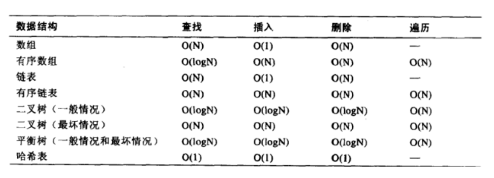