---
# 当前页面内容标题
title: 第 09 章_性能分析工具的使用
# 分类
category:
  - mysql
# 标签
tag: 
  - mysql
  - SQL
  - 关系型数据库
sticky: false
# 是否收藏在博客主题的文章列表中，当填入数字时，数字越大，排名越靠前。
star: false
# 是否将该文章添加至文章列表中
article: true
# 是否将该文章添加至时间线中
timeline: true
---

# 第 09 章_性能分析工具的使用

讲师：尚硅谷-宋红康（江湖人称：康师傅）

官网： http://www.atguigu.com

## 1. 数据库服务器的优化步骤

当我们遇到数据库调优问题的时候，该如何思考呢？这里把思考的流程整理成下面这张图。

整个流程划分成了观察（Show status）和行动（Action）两个部分。字母 S 的部分代表观察（会使用相应的分析工具），字母 A 代表的部分是行动（对应分析可以采取的行动）。


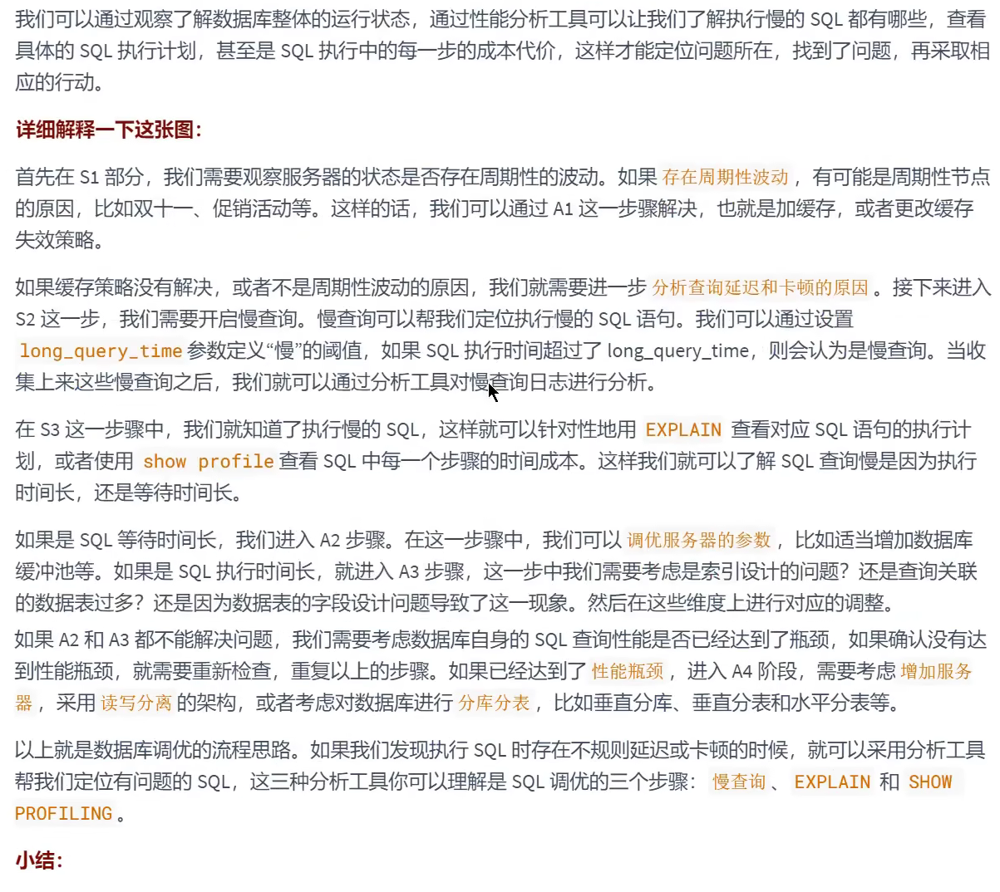


可以看到数据库调优的步骤中越往金字塔尖走，其成本越高，效果越差，因此我们在数据库调优的过程中，要重点把握金字塔底部的 ==sql 及索引调优，数据库表结构调优==，系统配置参数调优等软件层面的调优

## 2. 查看系统性能参数

可以使用 `SHOW STATUS` 语句查询一些数据库服务器的性能参数和使用频率。

其语法如下：

```mysql
SHOW [GLOBAL][SESSION] STATUES LIKE '参数';
```

一些常用的性能参数如下：

- Connections：连接MySQL服务器的次数。 
- Uptime：MySQL服务器的上线时间。 
- Slow_queries：慢查询的次数。 
- Innodb_rows_read：Select查询返回的行数 
- Innodb_rows_inserted：执行INSERT操作插入的行数 
- Innodb_rows_updated：执行UPDATE操作更新的行数
- Innodb_rows_deleted：执行DELETE操作删除的行数 
- Com_select：查询操作的次数。
- Com_insert：插入操作的次数。对于批量插入的 INSERT 操作，只累加一次。
- Com_update：更新操作的次数。 
- Com_delete：删除操作的次数。

举例：

- 若查询MYSQL服务器的连接次数，则可以执行如下语句：

```mysql
mysql> SHOW STATUS LIKE 'Connections';
+---------------+-------+
| Variable_name | Value |
+---------------+-------+
| Connections   | 34    |
+---------------+-------+
1 row in set (0.00 sec)
```

- 若查询服务器工作时间，则可以执行如下语句：

```mysql
mysql> SHOW STATUS LIKE 'Uptime';
+---------------+--------+
| Variable_name | Value  |
+---------------+--------+
| Uptime        | 332933 |
+---------------+--------+
1 row in set (0.00 sec)
```

- 若查询MySQL服务器的慢查询次数，则可以执行如下语句：

```mysql
mysql> SHOW STATUS LIKE 'Slow_queries';
+---------------+-------+
| Variable_name | Value |
+---------------+-------+
| Slow_queries  | 0     |
+---------------+-------+
1 row in set (0.00 sec)
```

注：慢查询次数参数可以结合慢查询日志找出慢查询语句，然后针对慢查询语句进行 `表结构优化` 或者`查询语句优化`

- 查看存储引擎增删改查的行数，则可以执行如下语句：

```mysql
mysql> show status like 'innodb_rows_%';
+----------------------+----------+
| Variable_name        | Value    |
+----------------------+----------+
| Innodb_rows_deleted  | 0        |
| Innodb_rows_inserted | 1000902  |
| Innodb_rows_read     | 37011100 |
| Innodb_rows_updated  | 0        |
+----------------------+----------+
4 rows in set (0.00 sec)
```

## 3. 统计SQL的查询成本：last_query_cost


我们依然使用student_info表为例（具体库表创建以及生成数据语句请参考上一篇章）

```mysql
CREATE TABLE `student_info` (
`id` INT( 11 ) NOT NULL AUTO_INCREMENT,
`student_id` INT NOT NULL ,
`name` VARCHAR( 20 ) DEFAULT NULL,
`course_id` INT NOT NULL ,
`class_id` INT( 11 ) DEFAULT NULL,
`create_time` DATETIME DEFAULT CURRENT_TIMESTAMP ON UPDATE CURRENT_TIMESTAMP,
PRIMARY KEY (`id`)
) ENGINE=INNODB AUTO_INCREMENT= 1 DEFAULT CHARSET=utf8;
```

①如果我们想要查询 id=900001 的记录，我们可以直接在聚簇索引上进行查找：

```mysql
mysql> SELECT * FROM student_info WHERE id = 900001;
+--------+------------+--------+-----------+----------+---------------------+
| id     | student_id | name   | course_id | class_id | create_time         |
+--------+------------+--------+-----------+----------+---------------------+
| 900001 |     154633 | SYnwsA |     10019 |    10134 | 2022-08-08 22:33:02 |
+--------+------------+--------+-----------+----------+---------------------+
1 row in set (0.00 sec)
```

然后再看下查询优化器的成本，实际上我们只需要检索一个页即可。`Value`表示 I/O 加载的数据页的页数

```mysql
mysql> SHOW STATUS LIKE 'last_query_cost';
+-----------------+----------+
| Variable_name   | Value    |
+-----------------+----------+
| Last_query_cost | 1.000000 |
+-----------------+----------+
1 row in set (0.01 sec)
```

②我们扩大下查询范围，student_id> 199900的学生记录呢？运行时间 0.01s，这时我们大概需要进行 232个页的查询

```mysql
mysql> SELECT * FROM student_info WHERE student_id > 199900;
+--------+------------+--------+-----------+----------+---------------------+
| id     | student_id | name   | course_id | class_id | create_time         |
+--------+------------+--------+-----------+----------+---------------------+
//...
| 523982 |     200000 | vcaUvw |     10010 |    10173 | 2022-08-08 22:32:31 |
+--------+------------+--------+-----------+----------+---------------------+
516 rows in set (0.01 sec)

mysql> SHOW STATUS LIKE 'last_query_cost';
+-----------------+------------+
| Variable_name   | Value      |
+-----------------+------------+
| Last_query_cost | 232.459000 |
+-----------------+------------+
1 row in set (0.00 sec)
```

③我们再次扩大范围，假若我们想要查询 student_id > 199000的学生记录呢？运行时间 0.02s，这时我们大概需要进行 2279个页的查询

```mysql
mysql> SELECT * FROM student_info WHERE student_id > 199000;
//...
5065 rows in set (0.02 sec)

mysql> SHOW STATUS LIKE 'last_query_cost';
+-----------------+-------------+
| Variable_name   | Value       |
+-----------------+-------------+
| Last_query_cost | 2279.509000 |
+-----------------+-------------+
1 row in set (0.00 sec)
```

不知道大家有没有发现，上面的查询页的数量是刚才的 10倍，但是查询的效率并没有明显的变化，就是因为采用了顺序读取的方式将页面一次性加载到缓冲池中，然后再进行查找。虽然页数量（last_query_cost）增加了不少，但是通过缓冲池的机制，并没有增加多少查询时间。

**使用场景：**查询 last_query_cost 对于比较开销是非常有用的，特别是我们有好几种查询方式可选的时候

> 🎈 SQL查询是一个动态的过程，从页加载的角度，我们可以得到以下两点结论：
>
> 位置决定效率：如果页就在数据库缓冲池中，那么效率是最高的，否则还需要从内存或者磁盘中进行读取，当然针对单个页的读取来说，如果页存在于内存中，会比在磁盘中读取效率高很多。即 数据库缓冲池>内存>磁盘
> 批量决定效率：如果我们从磁盘中单一页进行随机读，那么效率是很低的（差不多10ms），而采用顺序读取的方式，批量对页进行读取，平均一页的读取效率就会提升很多，甚至要快于单个页面在内存中的随机读取。即顺序读取>大于随机读取
> 所以说，遇到 I/O 并不用担心，方法找对了，效率还是很高的。我们首先要考虑数据存放的位置，如果是经常使用的数据就要尽量放到缓冲池中，其次我们可以充分利用磁盘的吞吐能力，一次性批量读取数据，这样单个页的读取效率也就得到了提升。
>
> 注：缓冲池和查询缓存并不是一个东西

## 4. 定位执行慢的 SQL：慢查询日志

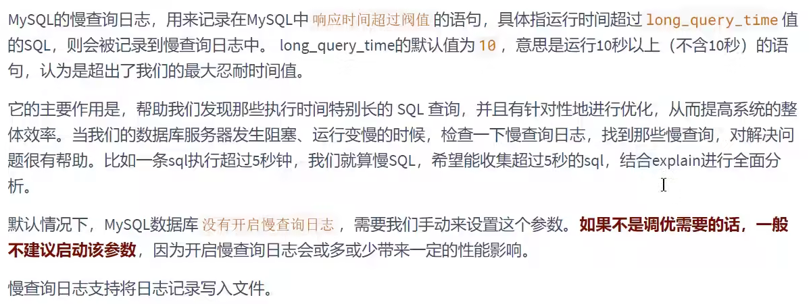

### 4. 1 开启慢查询日志参数

1. **开启slow_query_log**

查看慢查询日志是否开启，以及日志的位置

```mysql
mysql> show variables like '%slow_query_log%';
+---------------------+-----------------------------------+
| Variable_name       | Value                             |
+---------------------+-----------------------------------+
| slow_query_log      | OFF                               |
| slow_query_log_file | /var/lib/mysql/hadoop102-slow.log |
+---------------------+-----------------------------------+
2 rows in set (0.03 sec)
```

修改慢查询日志状态为开启，注意这里要加 `global`，因为它是全局系统变量，否则会报错。

```mysql
mysql> set global slow_query_log='ON';
Query OK, 0 rows affected (0.02 sec)
```

再查看

```mysql
mysql> show variables like '%slow_query_log%';
+---------------------+-----------------------------------+
| Variable_name       | Value                             |
+---------------------+-----------------------------------+
| slow_query_log      | ON                                |
| slow_query_log_file | /var/lib/mysql/hadoop102-slow.log |
+---------------------+-----------------------------------+
2 rows in set (0.01 sec)
```

2. 修改long_query_time阈值

接下来我们来看下慢查询的时间阈值设置，使用如下命令：

```mysql
mysql> show variables like '%long_query_time%';
+-----------------+-----------+
| Variable_name   | Value     |
+-----------------+-----------+
| long_query_time | 10.000000 |
+-----------------+-----------+
1 row in set (0.00 sec)
```

这里如果我们想把时间缩短，比如设置为 1 秒，可以这样设置：

```mysql
# 测试发现：设置global的方式对当前session的long_query_time失效。对新连接的客户端有效，所以可以一并执行下列语句
mysql> set global long_query_time = 1;
Query OK, 0 rows affected (0.00 sec)

mysql> set long_query_time = 1;
Query OK, 0 rows affected (0.00 sec)
```

再查看

```mysql
mysql> show global variables like '%long_query_time%';
+-----------------+----------+
| Variable_name   | Value    |
+-----------------+----------+
| long_query_time | 1.000000 |
+-----------------+----------+
1 row in set, 1 warning (0.00 sec)
```

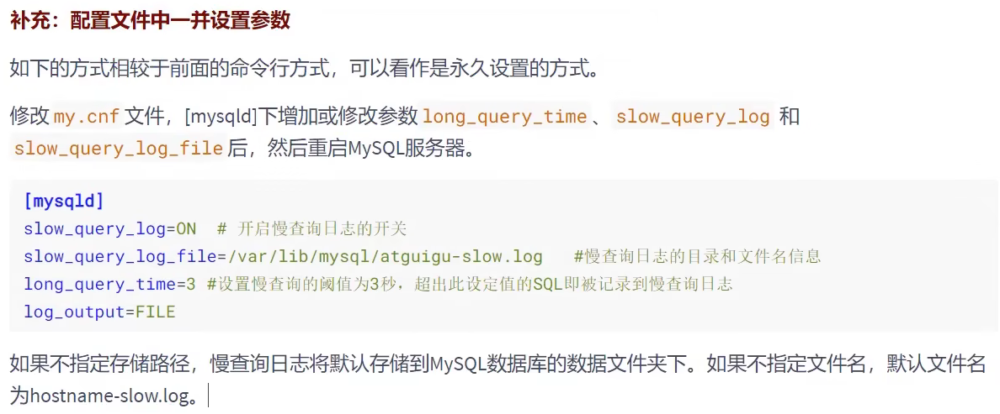

### 4. 2 查看慢查询数目

查询当前系统中有多少条慢查询记录

```mysql
SHOW GLOBAL STATUS LIKE '%Slow_queries%';
```

### 4. 3 案例演示

**步骤1. 建表**

```mysql
CREATE TABLE `student` (
`id` INT( 11 ) NOT NULL AUTO_INCREMENT,
`stuno` INT NOT NULL ,
`name` VARCHAR( 20 ) DEFAULT NULL,
`age` INT( 3 ) DEFAULT NULL,
`classId` INT( 11 ) DEFAULT NULL,
PRIMARY KEY (`id`)
) ENGINE=INNODB AUTO_INCREMENT= 1 DEFAULT CHARSET=utf8;
```

**步骤 2 ：设置参数 log_bin_trust_function_creators**

创建函数，假如报错：

```mysql
This function has none of DETERMINISTIC......
```

- 命令开启：允许创建函数设置：

```mysql
set global log_bin_trust_function_creators= 1 ;  # 不加global只是当前窗口有效。
```

**步骤 3 ：创建函数**

随机产生字符串：（同上一章）

```mysql
DELIMITER //
CREATE FUNCTION rand_string(n INT)
RETURNS VARCHAR(255) #该函数会返回一个字符串
BEGIN
DECLARE chars_str VARCHAR(100) DEFAULT
'abcdefghijklmnopqrstuvwxyzABCDEFJHIJKLMNOPQRSTUVWXYZ';
DECLARE return_str VARCHAR(255) DEFAULT '';
DECLARE i INT DEFAULT 0;
WHILE i < n DO
   SET return_str =CONCAT(return_str,SUBSTRING(chars_str,FLOOR(1+RAND()*52),1));
   SET i = i + 1;
  END WHILE;
  RETURN return_str;
END //
DELIMITER ;

#测试
SELECT rand_string(10);
```

产生随机数值：（同上一章）

```mysql
DELIMITER //
CREATE FUNCTION rand_num (from_num INT ,to_num INT) RETURNS INT(11)
BEGIN 
DECLARE i INT DEFAULT 0; 
SET i = FLOOR(from_num +RAND()*(to_num - from_num+1))  ;
RETURN i; 
END //
DELIMITER ;
#测试：
SELECT rand_num(10,100);
```
**步骤 4 ：创建存储过程**

```mysql
DELIMITER //
CREATE PROCEDURE insert_stu1(  START INT , max_num INT )
BEGIN 
DECLARE i INT DEFAULT 0; 
SET autocommit = 0;   #设置手动提交事务
REPEAT  #循环
SET i = i + 1;  #赋值
INSERT INTO student (stuno, NAME ,age ,classId ) VALUES
((START+i),rand_string(6),rand_num(10,100),rand_num(10,1000)); 
UNTIL i = max_num 
END REPEAT; 
COMMIT;  #提交事务
END //
DELIMITER ;
```

**步骤 5 ：调用存储过程**

```mysql
#调用刚刚写好的函数, 4000000条记录,从100001号开始
mysql> CALL insert_stu1(100001,4000000);
Query OK, 0 rows affected (10 min 47.03 sec)
```

注意，这个时间会比较长，请耐心等待几分钟哟。结束后可以查询下是不是插入成功了。

```mysql
mysql> select count(*) from student;
+----------+
| count(*) |
+----------+
|  4000000 |
+----------+
1 row in set (0.82 sec)
```

### 4. 4 测试及分析

**1. 执行一下下面的查询操作，进行慢查询语句的测试**

```mysql
# 注意：此时long_query_time已经设置为1了哦~
mysql> SELECT * FROM student WHERE stuno = 3455655;
+---------+---------+--------+------+---------+
| id      | stuno   | name   | age  | classId |
+---------+---------+--------+------+---------+
| 3355654 | 3455655 | ZfCwDz |   76 |     228 |
+---------+---------+--------+------+---------+
1 row in set (1.03 sec)

mysql> SELECT * FROM student WHERE name = 'ZfCwDz';
+---------+---------+--------+------+---------+
| id      | stuno   | name   | age  | classId |
+---------+---------+--------+------+---------+
|   32843 |  132844 | zfcWDZ |   32 |     304 |
|  889126 |  989127 | ZfCwDz |   77 |     249 |
| 2015535 | 2115536 | zfcWDZ |   36 |     459 |
| 3176527 | 3276528 | ZFcwdZ |   81 |     941 |
| 3355654 | 3455655 | ZfCwDz |   76 |     228 |
+---------+---------+--------+------+---------+
5 rows in set (1.09 sec)
```

从上面的结果可以看出来，查询学生编号合和姓名花费时间 都在1s以上。已经达到了秒的数量级，说明目前查询效率是非常低的，下面我们分析一下原因

**2. 先查看下慢查询的记录**

```mysql
mysql> show status like 'slow_queries';
+---------------+-------+
| Variable_name | Value |
+---------------+-------+
| Slow_queries  | 2     |
+---------------+-------+
1 row in set (0.01 sec)
```

> 🎯补充说明：
>
> 在Mysql中，除了上述变量，控制慢查询日志的还有另外一个变量 `min_examined_row_limit` 。这个变量的意思是，查询`扫描过的最少记录数`。这个变量和查询执行时间，共同组成了判别一个查询是否慢查询的条件。如果查询扫描过的记录数大于等于这个变量的值，并且查询执行时间超过 `long_query_time` 的值，那么这个查询就被记录到慢查询日志中。反之，则不被记录到慢查询日志中。另外，`min_examined_row_limit` 默认是 0，我们也一般不会去修改它。
>
> ```mysql
> mysql> SHOW VARIABLES like 'min%';
> +------------------------+-------+
> | Variable_name          | Value |
> +------------------------+-------+
> | min_examined_row_limit | 0     |
> +------------------------+-------+
> 1 row in set (0.02 sec)
> ```
>
> 当这个值为默认值0时，与 long_query_time=10合在一起，表示只要查询的执行时间超过10秒钟，哪怕一个记录也没有扫描过，都要被记录到慢查询日志中。你也可以根据需要，通过修改"my.ini"文件，来修改查询时长，或者通过SET指令，用SQL语句修改`min_examined_row_limit` 的值。

### 4. 5 慢查询日志分析工具：mysqldumpslow

在生产环境中，如果要手工分析日志，查找、分析SQL，显然是个体力活，MySQL提供了日志分析工具`mysqldumpslow`。

> 📑 注意:
> 1.该工具并不是 MySQL 内置的，不要在 MySQL 下执行，可以直接在根目录或者其他位置执行
> 2.该工具只有 Linux 下才是开箱可用的，实际上生产中mysql数据库一般也是部署在linux环境中的。如果您是windows环境下，可以参考博客https://www.cnblogs.com/-mrl/p/15770811.html。

通过 `mysqldumpslow `可以查看慢查询日志帮助

```mysql
mysqldumpslow --help
```

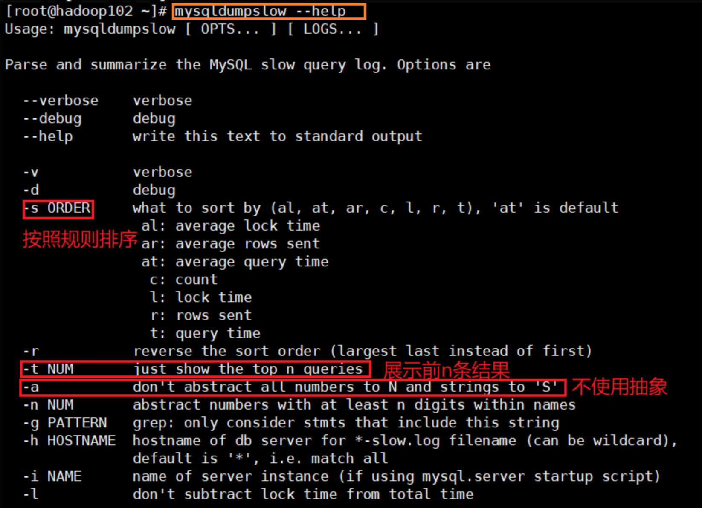

mysqldumpslow 命令的具体参数如下：

- -a: 不将数字抽象成N，字符串抽象成S
- `-s: 是表示按照何种方式排序：`
  - c: 访问次数
  - l: 锁定时间
  - r: 返回记录
  - **t: 查询时间**
  - al:平均锁定时间
  - ar:平均返回记录数
  - at:平均查询时间 （默认方式）
  - ac:平均查询次数


- `-t: 即为返回前面多少条的数据；`
- `-g: 后边搭配一个正则匹配模式，大小写不敏感的；`

接下来我们可以找到慢查询日志的位置

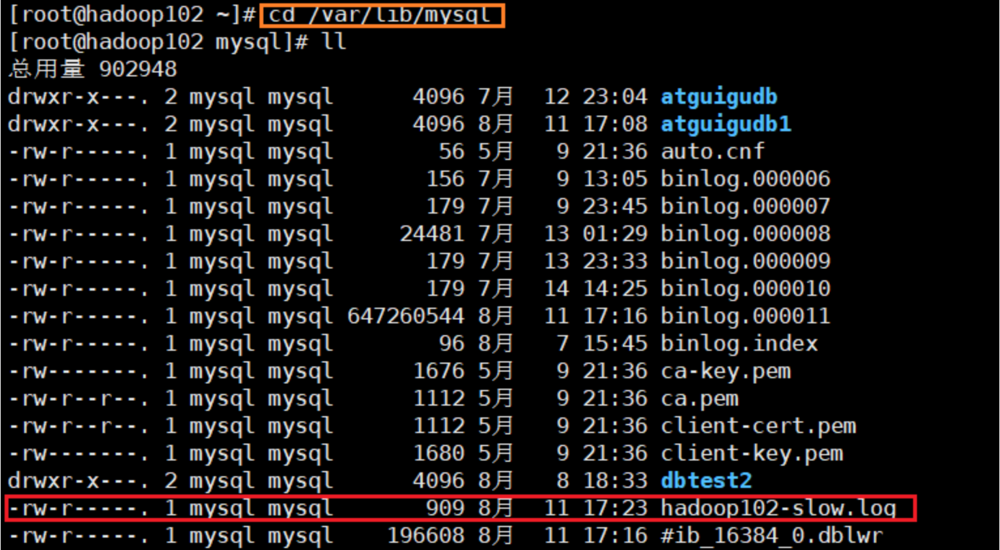

举例：我们想要按照查询时间排序，查看前五条 SQL 语句，这样写即可：

```mysql
[root@hadoop102 mysql]# mysqldumpslow -s t -t 5 /var/lib/mysql/hadoop102-slow.log 

Reading mysql slow query log from /var/lib/mysql/hadoop102-slow.log
Count: 1  Time=283.29s (283s)  Lock=0.00s (0s)  Rows=0.0 (0), root[root]@hadoop102
  CALL insert_stu1(N,N)

Count: 1  Time=1.09s (1s)  Lock=0.00s (0s)  Rows=5.0 (5), root[root]@localhost
  SELECT * FROM student WHERE name = 'S'

Count: 1  Time=1.03s (1s)  Lock=0.00s (0s)  Rows=1.0 (1), root[root]@localhost
  SELECT * FROM student WHERE stuno = N

Died at /usr/bin/mysqldumpslow line 162, <> chunk 3.
```

可以看到上面 sql 中具体的数值类都被N代替，字符串都被使用 S 代替，如果想要显示真实的数据，可以加上参数 `-a`

```mysql
[root@hadoop102 mysql]# mysqldumpslow -a -s t -t 5 /var/lib/mysql/hadoop102-slow.log 

Reading mysql slow query log from /var/lib/mysql/hadoop102-slow.log
Count: 1  Time=283.29s (283s)  Lock=0.00s (0s)  Rows=0.0 (0), root[root]@hadoop102
  CALL insert_stu1(100001,4000000)

Count: 1  Time=1.09s (1s)  Lock=0.00s (0s)  Rows=5.0 (5), root[root]@localhost
  SELECT * FROM student WHERE name = 'ZfCwDz'

Count: 1  Time=1.03s (1s)  Lock=0.00s (0s)  Rows=1.0 (1), root[root]@localhost
  SELECT * FROM student WHERE stuno = 3455655

Died at /usr/bin/mysqldumpslow line 162, <> chunk 3.
```

最后罗列下工作中常用的一些查询：

```mysql
#得到返回记录集最多的10个SQL
mysqldumpslow -s r -t 10 /var/lib/mysql/atguigu-slow.log

#得到访问次数最多的10个SQL
mysqldumpslow -s c -t 10 /var/lib/mysql/atguigu-slow.log

#得到按照时间排序的前10条里面含有左连接的查询语句
mysqldumpslow -s t -t 10 -g "left join" /var/lib/mysql/atguigu-slow.log

#另外建议在使用这些命令时结合 | 和more 使用 ，否则有可能出现爆屏情况
mysqldumpslow -s r -t 10 /var/lib/mysql/atguigu-slow.log | more
```

### 4. 6 关闭慢查询日志

MySQL 服务器停止慢查询日志功能有两种方法：

**方式一：永久性方式**

修改my.cnf或my.ini文件，把【mysqld】组下的slow_query_log值设置为OFF，修改保存后，再重启MySQL服务，即可生效。

```mysql
#配置文件
[mysqld]
slow_query_log=OFF
```

或者，把slow_query_log一项注释掉 或 删除

```mysql
[mysqld]
#slow_query_log =OFF
```

重启MySQL服务，执行如下语句查询慢日志功能。

```mysql
SHOW VARIABLES LIKE '%slow%';  #查询慢查询日志所在目录
SHOW VARIABLES LIKE '%long_query_time%';  #查询超时时长
```

可以看到，MySQL系统中的慢查询日志是关闭的。

**方式二：临时性方式**

使用 SET 语句来设置。

（1）停止 MySQL 慢查询日志功能，具体 SQL 语句如下。

```mysql
SET GLOBAL slow_query_log=off;
```

（2）重启MySQL服务，使用 SHOW 语句查询慢查询日志功能信息，具体演示如下

```mysql
[root@hadoop102 mysql]# systemctl restart mysqld;
[root@hadoop102 mysql]# mysql -hlocalhost -P3306 -uroot -p
Enter password: 
Welcome to the MySQL monitor.  Commands end with ; or \g.
Your MySQL connection id is 10
Server version: 8.0.25 MySQL Community Server - GPL

Copyright (c) 2000, 2021, Oracle and/or its affiliates.
mysql> SHOW VARIABLES LIKE '%slow%';
+---------------------------+-----------------------------------+
| Variable_name             | Value                             |
+---------------------------+-----------------------------------+
| log_slow_admin_statements | OFF                               |
| log_slow_extra            | OFF                               |
| log_slow_slave_statements | OFF                               |
| slow_launch_time          | 2                                 |
| slow_query_log            | OFF  #慢查询日志已关闭               |
| slow_query_log_file       | /var/lib/mysql/hadoop102-slow.log |
+---------------------------+-----------------------------------+
6 rows in set (0.00 sec)

mysql> SHOW VARIABLES LIKE '%long_query_time%';
+-----------------+-----------+
| Variable_name   | Value     |
+-----------------+-----------+
| long_query_time | 10.000000 | #已恢复至默认的 10s
+-----------------+-----------+
1 row in set (0.01 sec)
```

### 4. 7 删除与恢复慢查询日志

使用SHOW语句显示慢查询日志信息，具体SQL语句如下：

```mysql
mysql> SHOW VARIABLES LIKE '%slow_query_log%';
+---------------------+-----------------------------------+
| Variable_name       | Value                             |
+---------------------+-----------------------------------+
| slow_query_log      | ON                                |
| slow_query_log_file | /var/lib/mysql/hadoop102-slow.log |
+---------------------+-----------------------------------+
2 rows in set (0.00 sec)
```

调优结束可以及时删除慢查询日志节省磁盘空间哟，当然手工删除也是可以的

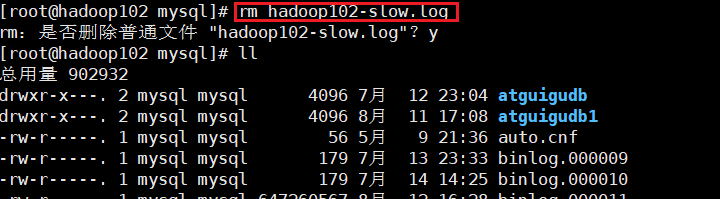

如果误删了，而且还没有了备份，可以使用下面的命令来重新恢复生成哟，执行完毕后会在数据目录下重新生成查询日志文件

```mysql
#先要打开慢查询日志
SET GLOBAL slow_query_log=ON;
#恢复慢查询日志
mysqladmin -uroot -p flush-logs slow
```

> 提示
>
> 慢查询日志都是使用`mysqladmin -uroot -p flush-logs slow` 命令来删除重建的。使用时一定要注意，一旦执行了这个命令，慢查询日志都只存在于新的日志文件中，如果需要旧的查询日志，就必须事先备份。

## 5. 查看 SQL 执行成本：SHOW PROFILE


```mysql
mysql> show variables like 'profiling';
+---------------+-------+
| Variable_name | Value |
+---------------+-------+
| profiling     | OFF   | #当前是关闭状态
+---------------+-------+
1 row in set (0.01 sec)

mysql> set profiling = 'ON';#开启
Query OK, 0 rows affected, 1 warning (0.00 sec)
```

然后执行相关的查询语句。接着看下当前会话下有哪些profiles

```mysql
mysql> SELECT * FROM student WHERE stuno = 3455655;
//...
mysql> SELECT * FROM student WHERE name = 'ZfCwDz';
//...
mysql> show profiles;
+----------+------------+---------------------------------------------+
| Query_ID | Duration   | Query                                       |
+----------+------------+---------------------------------------------+
|        1 | 0.00133475 | show variables like 'profiling'             |
|        2 | 0.00021050 | SELECT * FROM student WHERE stuno = 3455655 |
|        3 | 0.00053600 | SELECT DATABASE()                           |
|        4 | 0.01693325 | show databases                              |
|        5 | 0.00375125 | show tables                                 |
|        6 | 1.75597875 | SELECT * FROM student WHERE stuno = 3455655 |
|        7 | 1.11115150 | SELECT * FROM student WHERE name = 'ZfCwDz' |
+----------+------------+---------------------------------------------+
7 rows in set, 1 warning (0.00 sec)
```

你能看到当前会话一共有7个查询，如果我们想要查看最近一次查询的开销，可以使用

```mysql
show profile;
```

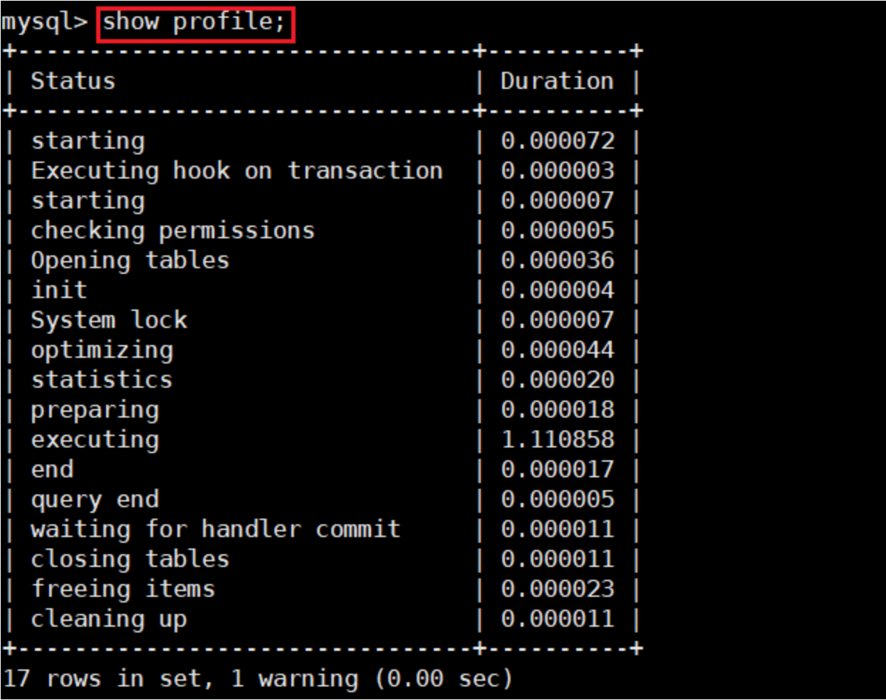

我们也可以查看指定的Query ID的开销，只需要后面跟上 `for num`。也可以查看不同部分的开销，比如CPU、block.io等

```mysql
 show profile cpu,block io for query 7;
```

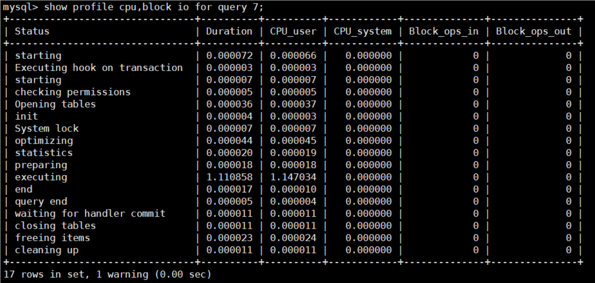

通过如果发现上一条 sql 慢的原因在于执行慢（`executing`字段耗时多），就可以接着用 `Explain` 进行分析具体的 sql 语句。等后面我们为其建立索引，就可以大大提高效率了

**🔊 show profile的常用查询参数：**

① ALL：显示所有的开销信息。

② BLOCK IO：显示块 IO 开销。

③ CONTEXT SWITCHES：上下文切换开销。

④ CPU：显示 CPU 开销信息。

⑤ IPC：显示发送和接收开销信息。

⑥ MEMORY：显示内存开销信息。

⑦ PAGE FAULTS：显示页面错误开销信息。

⑧ SOURCE：显示和 Source_function，Source_file，Source_line 相关的开销信息。

⑨ SWAPS：显示交换次数开销信息。

**🎨 日常开发需要注意的结论：**

① `Coverting Heap to MyISAM`：查询结果太大，内存不够，正在往磁盘中迁移

② `Creating tmp table`：创建临时表，先拷贝数据到临时表，用完再删除临时表

③`Coping to tmp table on disk`：把内存中临时表复制到磁盘上，警惕！

④` locked`

==如果在 show profile 的查询结果中，出现了以上4条结果中的任何一条。则sql 语句需要优化==

**最后，还需要注意：**

`SHOW PROFILE` 命令将被弃用，不过我们可以从 `information_schema` 中的 `profiling` 数据表进行查看

## 6. 分析查询语句：EXPLAIN

### 6.1 EXPLAIN 概述

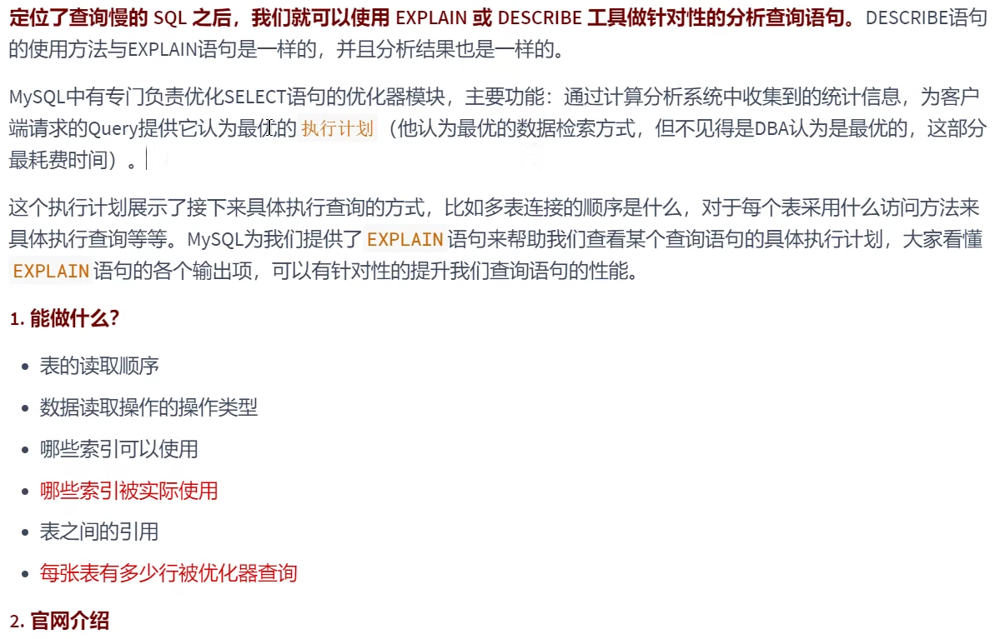

> https://dev.mysql.com/doc/refman/5.7/en/explain-output.html
>
> https://dev.mysql.com/doc/refman/8.0/en/explain-output.html

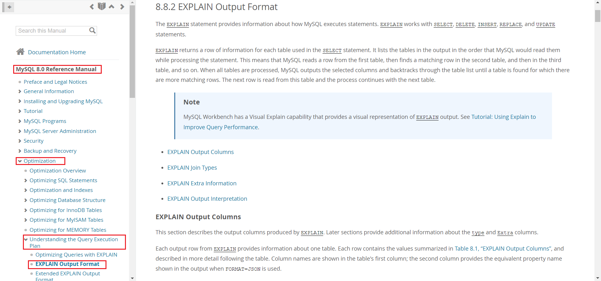

**3.版本情况**

- MySQL 5.6.3以前只能`EXPLAIN SELECT` ；MYSQL 5.6.3以后就可以`EXPLAIN SELECT`，`UPDATE`，`DELETE`


- 在5.7以前的版本中，想要显示`partitions` 需要使用`explain partitions`命令；想要显示`filtered` 需要使用`explain extended` 命令。在5.7版本后，默认explain直接显示partitions和filtered中的信息


**注意：**==EXPLAIN 仅仅是查看执行计划，不会真实的执行 sql==

### 6. 2 基本语法

EXPLAIN 或 DESCRIBE语句的语法形式如下：

```mysql
EXPLAIN SELECT select_options
或者
DESCRIBE SELECT select_options
```
如果我们想看看某个查询的执行计划的话，可以在具体的查询语句前边加一个EXPLAIN ，就像这样：

```mysql
mysql> EXPLAIN SELECT 1 ;
```

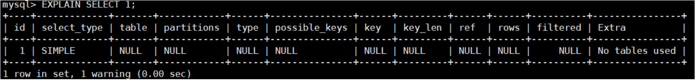


EXPLAIN 语句输出的各个列的作用如下：

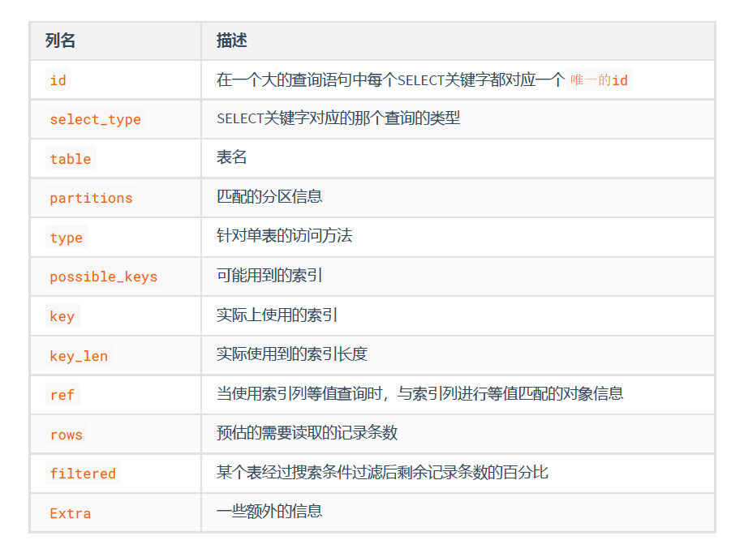

在这里把它们都列出来只是为了描述一个轮廓，让大家有一个大致的印象。

### 6. 3 数据准备

**1.建表**

```mysql
CREATE TABLE s1 (
    id INT AUTO_INCREMENT,
    key1 VARCHAR( 100 ),
    key2 INT,
    key3 VARCHAR( 100 ),
    key_part1 VARCHAR( 100 ),
    key_part2 VARCHAR( 100 ),
    key_part3 VARCHAR( 100 ),
    common_field VARCHAR( 100 ),
    PRIMARY KEY (id),
    INDEX idx_key1 (key1),
    UNIQUE INDEX idx_key2 (key2),
    INDEX idx_key3 (key3),
    INDEX idx_key_part(key_part1, key_part2, key_part3)
) ENGINE=INNODB CHARSET=utf8;
```
```mysql
CREATE TABLE s2 (
    id INT AUTO_INCREMENT,
    key1 VARCHAR( 100 ),
    key2 INT,
    key3 VARCHAR( 100 ),
    key_part1 VARCHAR( 100 ),
    key_part2 VARCHAR( 100 ),
    key_part3 VARCHAR( 100 ),
    common_field VARCHAR( 100 ),
    PRIMARY KEY (id),
    INDEX idx_key1 (key1),
    UNIQUE INDEX idx_key2 (key2),
    INDEX idx_key3 (key3),
    INDEX idx_key_part(key_part1, key_part2, key_part3)
) ENGINE=INNODB CHARSET=utf8;
```

注：建两个表方便联合查询

**2. 创建存储函数**

```mysql
DELIMITER 
CREATE FUNCTION rand_string1(n INT)
    RETURNS VARCHAR(255) #该函数会返回一个字符串
BEGIN
DECLARE chars_str VARCHAR(100) DEFAULT 'abcdefghijklmnopqrstuvwxyzABCDEFJHIJKLMNOPQRSTUVWXYZ';
    DECLARE return_str VARCHAR(255) DEFAULT '';
    DECLARE i INT DEFAULT 0;
    WHILE i < n DO
        SET return_str =CONCAT(return_str,SUBSTRING(chars_str,FLOOR(1+RAND()*52),1));
        SET i = i + 1;
    END WHILE;
    RETURN return_str;
END 
DELIMITER ;
```

创建函数，假如报错，需设置参数 `log_bin_trust_function_creators`，允许创建函数设置

```mysql
set global log_bin_trust_function_creators=1;   # 不加global只是当前窗口有效。
```

**3. 创建存储过程**

创建往 s1 表中插入数据的存储过程：

```mysql
DELIMITER //
CREATE PROCEDURE insert_s1 (IN min_num INT (10),IN max_num INT (10))
BEGIN
    DECLARE i INT DEFAULT 0;
    SET autocommit = 0;
    REPEAT
    SET i = i + 1;
    INSERT INTO s1 VALUES(
     (min_num + i),
     rand_string1(6),
     (min_num + 30 * i + 5),
     rand_string1(6),
     rand_string1(10),
     rand_string1(5),
     rand_string1(10),
     rand_string1(10));
    UNTIL i = max_num
    END REPEAT;
    COMMIT;
END //
DELIMITER ;
```

创建往 s2 表中插入数据的存储过程：

```mysql
DELIMITER //
CREATE PROCEDURE insert_s2 (IN min_num INT (10),IN max_num INT (10))
BEGIN
    DECLARE i INT DEFAULT 0;
    SET autocommit = 0;
    REPEAT
    SET i = i + 1;
    INSERT INTO s2 VALUES((min_num + i),
        rand_string1(6),
        (min_num + 30 * i + 5),
        rand_string1(6),
        rand_string1(10),
        rand_string1(5),
        rand_string1(10),
        rand_string1(10));
    UNTIL i = max_num
    END REPEAT;
    COMMIT;
END //
DELIMITER ;
```

**4. 调用存储过程**

s1 表数据的添加：加入 1 万条记录：

```mysql
CALL insert_s1(10001,10000);
```

s2 表数据的添加：加入 1 万条记录：

```mysql
CALL insert_s2(10001,10000);
```

### 6. 4 EXPLAIN各列作用

为了让大家有比较好的体验，我们调整了下`EXPLAIN`输出列的顺序。

#### 1. table

不论我们的查询语句有多复杂，里边儿包含了多少个表，到最后也是需要对每个表进行单表访问的，所以MySQL规定 EXPLAIN语句输出的每条记录都对应着某个单表的访问方法 ，该条记录的`table列代表着该表的表名`（有时不是真实的表名字，可能是简称）。

```mysql
EXPLAIN SELECT * FROM s1 INNER JOIN s2;
```

如下图，一张表对应一个记录。

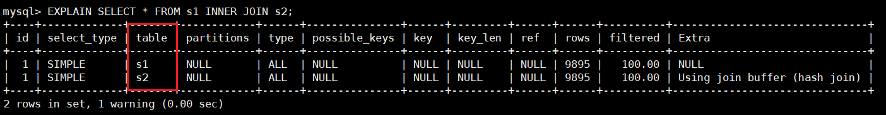

#### 2. id

例1：下面的查询结果，两个记录似乎id都是1.这是为什么呢？

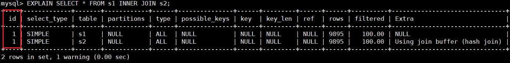

实际上，在查询语句中每出现一个SELECT关键字，MySQL就会为它分配一个唯一的id ，代表着一次查询。这个id 就是 `EXPLAIN`语句的第一列。

例2：下面的查询中只有一个SELECT，所以`EXPLAIN`的结果中也就只有一条id为 1 的记录喽~

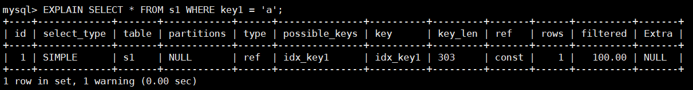

例3：下面的查询有两个SELECT，所以`EXPLAIN`的结果中 会有两条记录，且id分别就是1和2喽~ 。其中 s1被称为驱动表，s2被称为 被驱动表

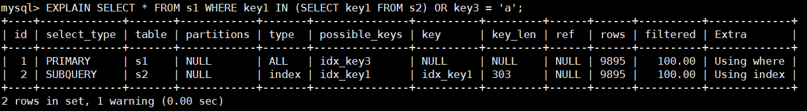

例4：下面这条SQL有一个坑，请注意！！！

```mysql
EXPLAIN SELECT * FROM s1 WHERE key1 IN (SELECT key2 FROM s2 WHERE common_field = 'a');
```

两个记录的 id 都是 1，小小的眼睛是否充满了大大的疑惑？

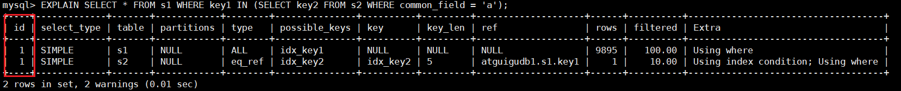

这是因为优化器会对上面的 sql 语句进行优化，将其转换为多表连接，而不是子查询。因为子查询其实是一种嵌套查询的情况，其时间复杂度是 O(n^m)，其中 m 是嵌套的层数，而多表查询的时间复杂度是 O(n*m)

例5：再看看 Union 联合查询的情况。

```mysql
EXPLAIN SELECT * FROM s1 UNION SELECT * FROM s2;
```

结果是这样，竟然会出现三张表~ Amazing！

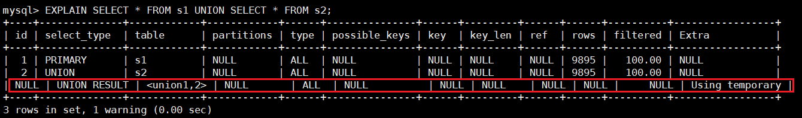

这是因为 Union 是取表的并集，需要建临时表进行去重，因此会有三条记录。可以看到第三条记录的 `Extra` 就标识了它是一张临时表哦。`临时表 id 是 Null`。

例6：再看看 Union ALL：

```mysql
EXPLAIN SELECT * FROM s1  UNION ALL SELECT * FROM s2;
```

产生两条记录，因为它不会去重~

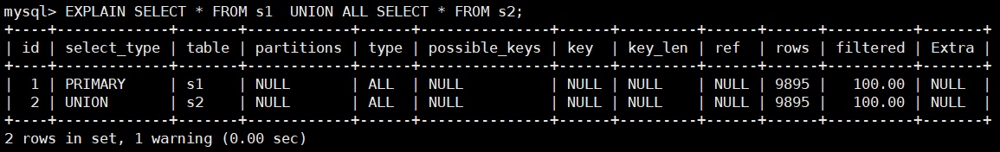

> **💌小结**
>
> 1. id如果相同，可以认为是一组，从上往下顺序执行
> 2. 在所有组中，id值越大，优先级越高，越先执行
> 3. 关注点：id号每个号码，表示一趟独立的查询, 一个sql的查询趟数越少越好

#### 3. select_type


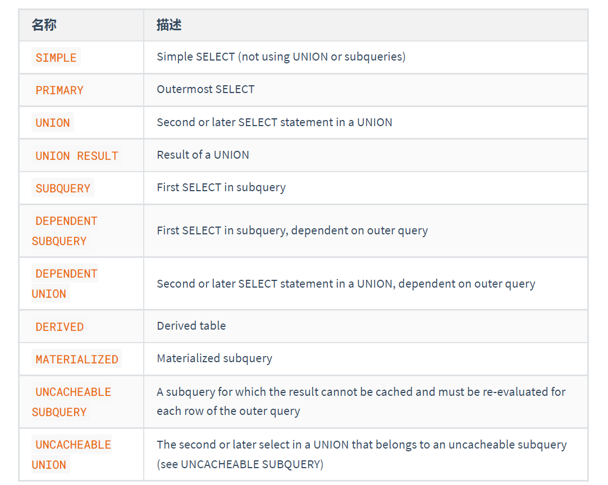

**①：查询语句中不包含`UNION`或者子查询的查询都算作是`SIMPLE`类型**


再看下连接查询，可以看到 连接查询也算是`SIMPLE`类型

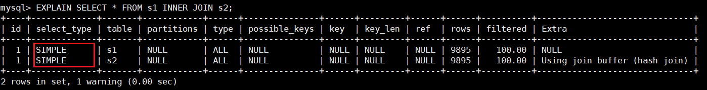

**②：Union 联合查询。其左边的查询是 `Primary`，右边的查询类型是 `Union`，去重的临时表查询类型是： `Union Result`**

- 对于包含`UNION`或者`UNION ALL`的大查询来说，它是由几个小查询组成的，其中除了最左边的那个查询的`select_type`值就是`PRIMARY`，其余的小查询的`select_type`值就是`UNION`
- `MySQL`选择使用临时表来完成`UNION`查询的去重工作，针对该临时表的查询的`select_type`就是`UNION RESULT`
- 对应子查询的大查询来说，子查询是外边的那个是`PRIMARY`

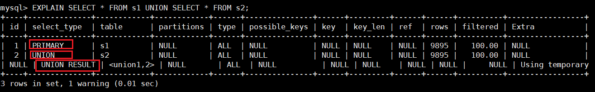

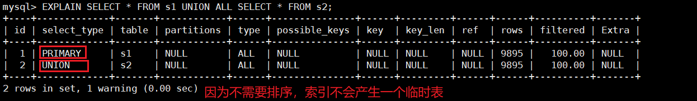

**③：不会被优化成多表连接的子查询**

如果包含子查询的查询语句不能够转为多表连接的形式(也就是不会被优化器进行自动的优化)，并且该子查询是不相关的子查询

该子查询的第一个`SELECT`关键字代表的那个查询的`select_type`就是`SUBQUERY`。也就是外层查询是 `Primary`，内层查询是 `SUBQUERY`

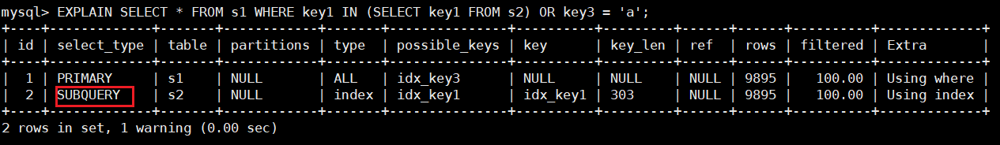

如果子查询不能被转换为多表连接的形式，并且该子查询是相关子查询。

比如下面的查询在内部子查询使用了外部的表。则该子查询的第一个`SELECT`关键字代表的那个查询的`select_type`就是`DEPENDENT SUBQUERY`。 外层查询是`Primary`，内层查询是`DEPENDENT SUBQUERY`

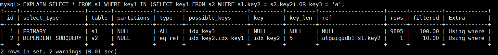

需要注意的是 `DEPENDENT SUBQUERY` 的查询语句可能会被执行多次，因为内层查询依赖于外层的查询，因此可能会是外层传一个值，内层就执行一次的模式。

> 子查询需要执行多次，即采用循环的方式，先从外部查询开始，每次都传入子查询进行查询，然后再将结果反馈给外部，这种嵌套的执行方式就称为相关子查询。
>
> 子查询从数据表中查询了数据结果，如果这个数据结果只执行一次，然后这个数据结果作为主查询的条 件进行执行，那么这样的子查询叫做不相关子查询。

**④：包含`UNION`或者`UNION ALL`的子查询**

在包含 `Union`或者 `Union All` 的子查询 sql 中，如果各个小查询都依赖于外查询，那么除了最左边的小查询外，各个小查询的类型都是 `DEPENDENT UNION`

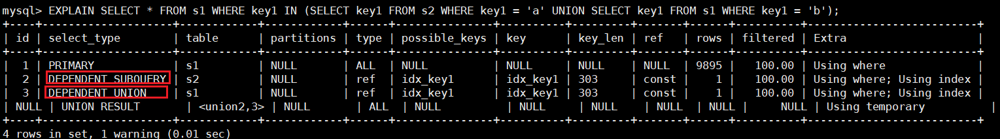

外查询是 `Primary`，最左边的子查询是 `DEPENDENT SUBQUERY`，后面的子查询是 `DEPENDENT UNION`，临时去重表的类型是 `Union Result`。这里大家可能要困惑，第一个子查询中也没有看到依赖 s1 啊。这其实也是优化器会在执行时进行优化，将 `IN` 改成 `Exist`，并且把外部的表移到内部去。这里我们了解就行，以后会有文章给大家介绍优化器的。

**⑤：关于派生表的子查询**

对于包含`派生表`的查询，该派生表对应的子查询的`select_type`就是`DERIVED`

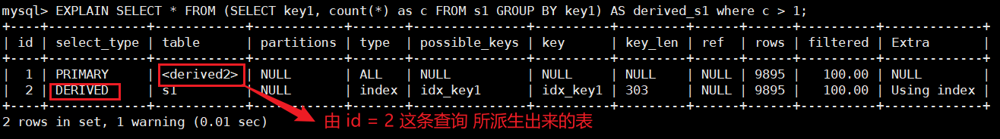

**⑥：子查询的物化后与外层连接查询**

当优化器在执行子查询时选择把子查询优化成为一张物化表，与外层查询进行连接查询时。

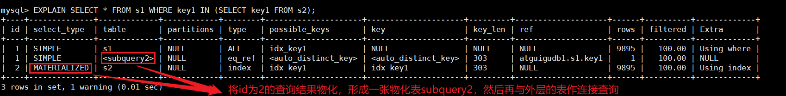

从下往上看，子查询的查询类型是 `MATERIALIZED`；物化过程是基于 id 为 2 的查询结果表进行的，其 table 是 `subquery` 2，查询类型是 `SIMPLE`，而外层也相当于是与固定的直接值进行查询，其类型也是 `SIMPLE`

> 上面的介绍都是一些基本的情况，还没有真正的介绍与索引相关的情况哦。觉得是不是晕晕的了，我们用一个表格进行下总结吧

#### 4. partitions (可略)

代表分区表中的命中情况，非分区表，该项为 `NULL`。一般情况下我们的查询语句的执行计划的`partitions` 列的值都是`NULL`

官方文档：https://dev.mysql.com/doc/refman/8.0/en/alter-table-partition-operations.html

如果想详细了解，可以如下方式测试。创建分区表：

```mysql
-- 创建分区表，
-- 按照id分区，id<100 p0分区，其他p1分区
CREATE TABLE user_partitions (id INT auto_increment,
    NAME VARCHAR(12),PRIMARY KEY(id))
    PARTITION BY RANGE(id)(
    PARTITION p0 VALUES less than(100),
    PARTITION p1 VALUES less than MAXVALUE
 );
```

查询id大于 200 （ 200 > 100 ，p 1 分区）的记录，查看执行计划，partitions是p 1 ，符合我们的分区规则

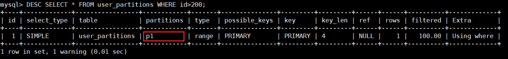

#### 5. type ☆


完整的访问方法如下： `system `、`const`、`eq_ref `、`ref `、`fulltext`、`ref_or_null`、`index_merge`、`unique_subquery`、`index_subquery`、 `range`、`index`、`ALL`。

我们详细解释一下：

**1️⃣system**

当表中只有一条记录，并且该表中存储引擎统计数据是精确的，比如 MYISAM，Memory，那么其访问方法就是`System`。这种方式几乎是性能最高的，当然我们几乎用不上。

```mysql
CREATE TABLE t(i int) Engine=MyISAM;#创建表
INSERT INTO t VALUES(1);# 插入第一条记录
EXPLAIN SELECT * FROM t;# 查看性能
```

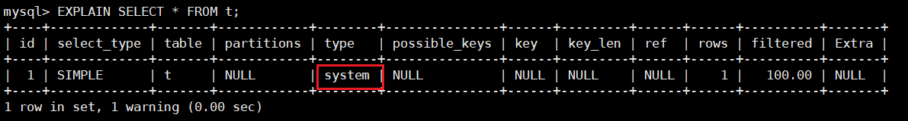

但凡我们再插入一条数据，其访问方式就变成了性能最差的全表扫描 `ALL`。

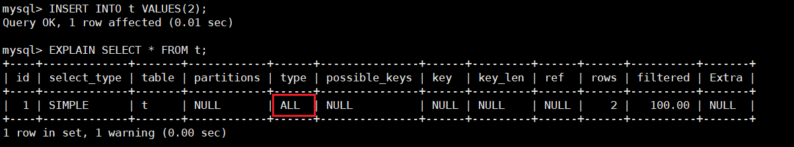

如果存储引擎是InnoDB，即使只有一条数据，其访问方式也是ALL，这是因为 InnnoDB 访问数据不是精确的

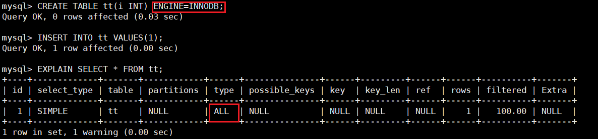

**2️⃣Const**

当我们根据主键或者唯一的二级索引，与常数进行等值匹配时，对单表的访问方法就是 `const`。这个访问方式的效率低于 `system`，但也是很高效的。

比如对主键与常数匹配，进行等值查询

```mysql
EXPLAIN SELECT * FROM s1 WHERE id = 10005;
```

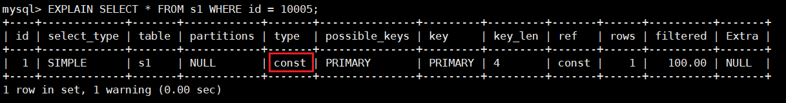

比如对Unique标识的唯一二级索引key2与常数匹配，进行等值查询。

```mysql
EXPLAIN SELECT * FROM s1 WHERE key2 = 10066;
```

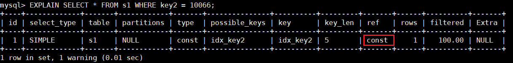

当我们把where后面的关键字改成key3 普通索引时，由于key3的字段值是可重复的。type类型就变成了 `All`，全表查询

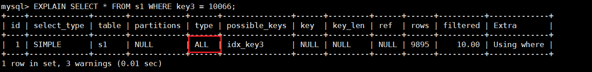

注意：此时可能有细心的小伙伴可能注意到我们的key3不是也有索引`idx_key3`，性能再查也不至于全表查询吧~ 但是忘记了一个细节，key3本身是varchar类型的， `key3 = 10066`会进行一个隐式类型转换，从而会导致 索引失效，我们也可以看到 `key`列对应的为空。

当修改成`key3 = 10066`后，结果如下图：

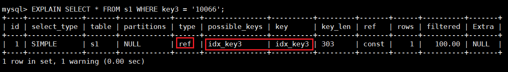

**3️⃣eq_ref**

再进行**连接查询**时，如果**被驱动表**是通过主键或者唯一二级索引等值匹配的方式进行查询的，那么被驱动表的访问方式是 `eq_ref`。这也是一种性能很不错的方式。

```mysql
EXPLAIN SELECT * FROM s1 INNER JOIN s2 ON s1.id = s2.id;
```

上面连接查询语句，对于驱动表来说，就是对s1全表进行扫描，找到符合条件的数据，因此其`type`是`All`,对被驱动表来说，相于直接访问驱动表查询到的数据进行等值查询，因此其访问方式是`eq_ref`

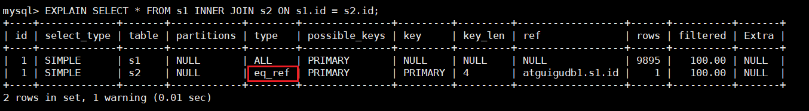

**4️⃣ref**

当使用普通的二级索引与常量进行等值匹配时，type 是 `ref`。

```mysql
EXPLAIN SELECT * FROM s1 WHERE key1 = 'a';
```

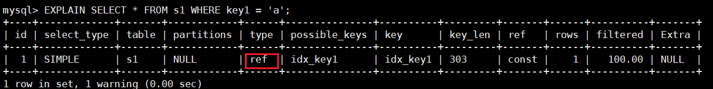

下面考考你。以下 sql 的引用类型是什么呢？

```mysql
EXPLAIN SELECT * FROM s1 WHERE key3 = 10066;
```

看看答案。你是不是猜错了。是 `All`。这是因为 key3 的字段 varchar 类型，但是我们这里常量值是整形，因此需要使用函数进行隐式的类型转换，一旦使用函数，索引就失效了，因此访问类型变成了全表扫描 `All`

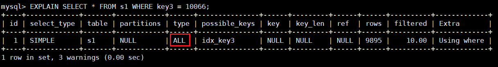

当我们常量使用对应的类型，就是期望的`ref`访问类型了

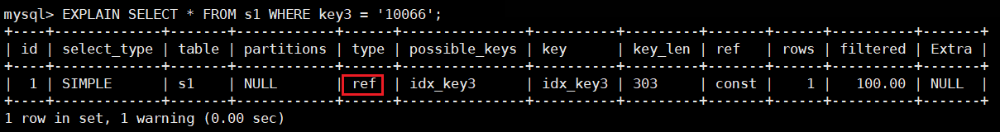

**5️⃣ref_or_null**

当使用普通的二级索引进行等值匹配时，当索引值可以是 Null 时，type 是 `ref_or_null`。

```mysql
EXPLAIN SELECT * FROM s1 WHERE key1 = 'a' OR key1 IS NULL;
```

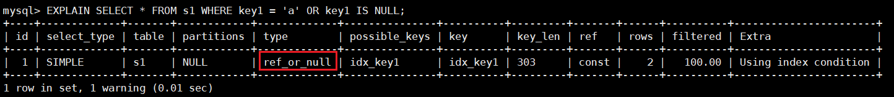

**6️⃣index_merge**

当进行单表访问时，如果多个查询字段分别建立了单列索引，使用 OR 连接，其访问类型是 `index_merge`。同时还可以看到 `key `这一字段，是使用了多个索引

```mysql
EXPLAIN SELECT * FROM s1 WHERE key1 = 'a' OR key3 = 'a';
```

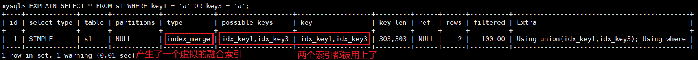

猜猜下面 sql 的引用类型

```mysql
EXPLAIN SELECT * FROM s1 WHERE key1 = 'a' AND key3 = 'a';
```

猜对了吗？答案是 `ref`，这是因为用 AND 连接两个查询时，实际上只使用了 key1 的索引。

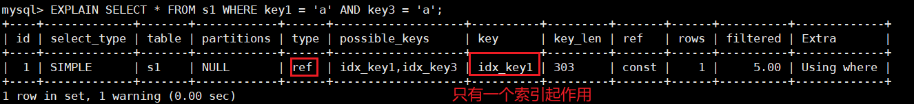

**7️⃣unique_subquery**

针对一些包含 `IN` 的 子查询的查询语句中，如果优化器决定将 IN 子查询优化为 EXIST 子查询，而且子查询可以使用主键进行等值匹配的话，那么该子查询执行计划的 `type `就是 `unique_subquery`

```mysql
EXPLAIN SELECT * FROM s1 WHERE key2 IN (SELECT id FROM s2 where s1.key1 = s2.key1) OR key3 = 'a';
```


**8️⃣range**

如果使用索引获取某些`范围区间`的记录，那么就可能使用到`range`访问方法

```mysql
EXPLAIN SELECT * FROM s1 WHERE key1 IN ('a', 'b', 'c');
EXPLAIN SELECT * FROM s1 WHERE key1 > 'a' AND key1 < 'b';
```

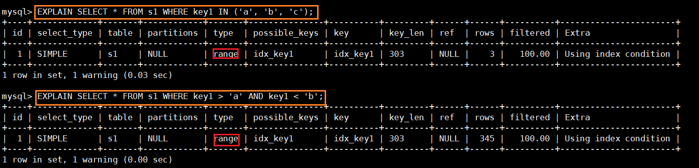

**9️⃣index**

当我们可以使用索引覆盖，但是需要扫描的全部的索引记录时，该表的访问方式就是 `index`。索引覆盖后面文章介绍优化器时会详细介绍，为了便于大家理解，先简单介绍如下。比如下面 sql 语句中，key_part2 ，key_part2 都属于联合索引 `idx_key_part(key_part1, key_part2, key_part3)` 的一部分，==在查找数据时可以用上这个联合索引，而不用进行回表操作==，这种情况即`索引覆盖`

```mysql
EXPLAIN SELECT key_part2 FROM s1 WHERE key_part2 = 'a';
```

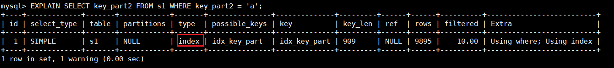

**1️⃣0️⃣ALL**

最熟悉的全表扫描 `ALL`

```mysql
EXPLAIN SELECT * FROM s1;
```

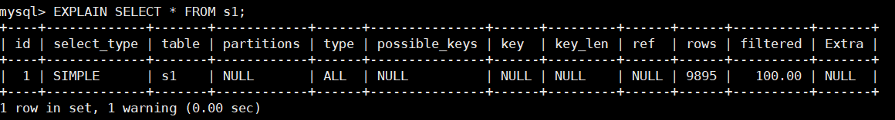

> ❤温馨提示：这里很多小伙伴会觉得记不住，其实您可以收藏这篇博客，执行 EXPLAIN 时对应结果，反向查找博文对应内容，毕竟咱们只需要能够读懂性能分析的结果

小结

- 结果值从最好到最坏依次是： system > const > eq_ref > ref > fulltext > ref_or_null > index_merge > unique_subquery > index_subquery > range > index > ALL 其中比较重要的几个提取出来（见绿色部分）

- SQL 性能优化的目标：至少要达到 range 级别，要求是 ref 级别，最好是 consts 级别（阿里巴巴开发手册要求）

#### 6. possible_keys和key


```mysql
EXPLAIN SELECT * FROM s1 WHERE key1 > 'z' AND key3 = 'a';
```

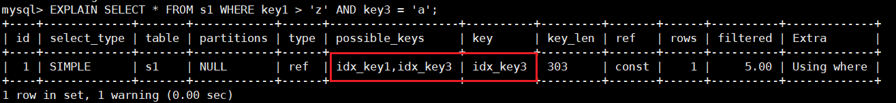

对应优化器来说，可以选择的 `possible_keys` 越少越好，因为选项越多，进行过滤花的时间也就对应更多。另外，优化器会对各个索引进行查询的效率进行评估，以此来选择实际使用的 `key`。而且由于优化器会对 sql 进行优化，完全可能会出现 `possible_keys` 是 null，但是 `key` 不为 null 的情况

#### 7. key_len ☆

实际使用的索引的长度，单位是字节。可以帮助你检查是否充分利用了索引，主要针对联合索引具有一定的参考，对同一索引来说，key_len 值越大越好（与自己比较，后面将解释）。

**① 下面SQL执行结果是 4，这个结果怎么算出来的呢？**

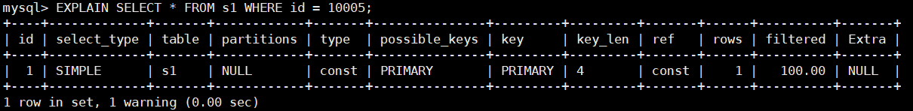

这是因为使用的是主键 id 作为索引，其类型是 int，占 4 个字节

**② 再来猜猜下面的 key_len 是多少~**

```mysql
EXPLAIN SELECT * FROM s1 WHERE key2 = 10126;
```

什么？你猜的是 4，而答案是 5~


这是因为虽然 key2 也是 int 类型，但是它被 unique 修饰，并没有标识非空（而主键都是非空的），因此加上空值标记，一共是5字节

**③ 字符类型的索引长度为多少呢**

```mysql
 EXPLAIN SELECT * FROM s1 WHERE key1 = 'a';
```

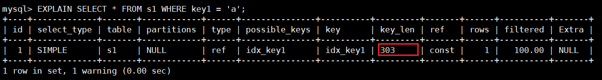

答案是 303，因为类型是 varchar(100)，100 个字符，utf-8 每个字符占 3 个字节，共 300 个字节，加上变长列表 2 个字节与一个空值标识占一个字节，共 303 字节。

**④ 看看联合索引的情况**

- 看下面的联合索引，key_len还是303，不需要解释了吧

```mysql
EXPLAIN SELECT * FROM s1 WHERE key_part1 = 'a';
```

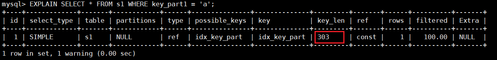

- 再看看下面这个联合索引，其结果是 606

```mysql
EXPLAIN SELECT * FROM s1 WHERE key_part1 = 'a' AND key_part2 = 'b';
```

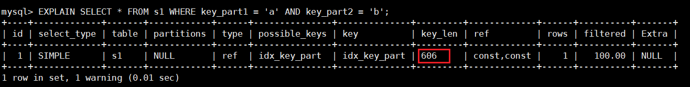

这个查询的 key-len 比上面的查询大，性能就比上面的好，怎么理解呢？其实只要你看过我之前介绍B+树的文章就很容易理解了。因为在目录页我除了考虑 key_part1 ，还会考虑 key_part2，定位到的数据就更加精准，范围更小，需要加载 I/O 的数据页数量就会更少，这样是不是性能就比较好啊~

- 猜猜下面的 sql 执行后 key_len 是多少

```mysql
EXPLAIN SELECT * FROM s1 WHERE key_part3 = 'a';
```

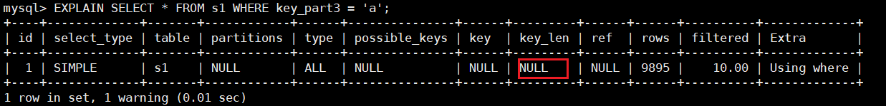

是空哦，因为都不会使用到索引，这就是我们一直在提的**最左前缀原则**，后面会详细介绍的。

**📚练习：key_len的长度计算公式：**

- varchar(10)变长字段且允许NULL = 10 *( character set：utf8=3, gbk=2, latin1=1) + 1(NULL)+2(变长字段)*
- *varchar(10)变长字段且不允许NULL = 10* ( character set：utf8=3 ,gbk=2, latin1=1) +2(变长字段)
- char(10)固定字段且允许NULL = 10 *( character set：utf8=3, gbk=2, latin1=1) +1(NULL)*
- *char(10)固定字段且不允许NULL = 10* ( character set：utf8=3,gbk=2,latin1=1)

#### 8. ref

当索引列进行等值查询时，与索引列匹配的对象信息。

① 比如只是一个常数或者是某个列，其 `ref` 是 `const`

```mysql
EXPLAIN SELECT * FROM s1 WHERE key1 = 'a';
```

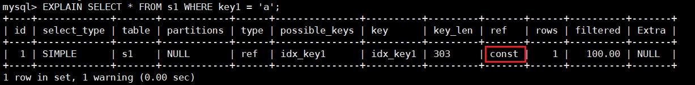

② 当进行多表连接查询时，对被驱动表s2执行的查询引用了atguigudb1.s1.id字段进行等值查询

```mysql
EXPLAIN SELECT * FROM s1 INNER JOIN s2 ON s1.id = s2.id;
```


③ 当连接条件使用函数时，其 `ref` 就是 `func`

```mysql
 EXPLAIN SELECT * FROM s1 INNER JOIN s2 ON s2.key1 = UPPER(s1.key1);
```

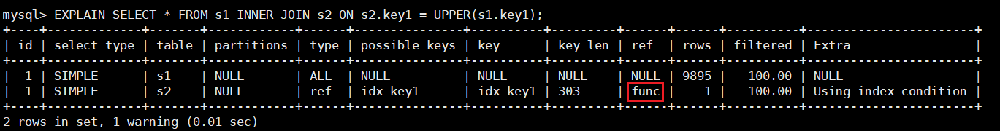


#### 9. rows ☆

① 预估的需要读取的记录条目数，条目数越小越好。这是因为值越小，加载I/O的页数就越少~

```mysql
EXPLAIN SELECT * FROM s1 WHERE key1 > 'z';
```


#### 10. filtered

==经过搜索条件后过滤剩下的记录所占的百分比。百分比越高越好==，比如同样 rows 是 40，如果 filter 是 100，则是从 40 条记录里进行查找，如果 filter 是 10，则是从 400 条记录里进行查找，相比较而言当然是前者的效率更高哦。

**① 如果执行的是单表扫描，那么计算时需要估计除了对应搜索条件外的其他搜索条件满足的记录有多少条** 晕了就看看下面的例子

```mysql
EXPLAIN SELECT * FROM s1 WHERE key1 > 'z' AND common_field = 'a';
```

结果是 10，表示有 347 条记录满足 key1 > ‘z’ 的条件，这 347 条记录的 10% 满足 common_field = ‘a’ 条件。

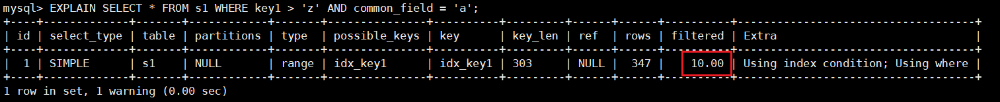

② 实际上，对于单表查询，这个字段没有太大的意义，我们更加关注连接查询时的 filtered 值，它决定了被驱动表要执行的次数。

```mysql
EXPLAIN SELECT * FROM s1 INNER JOIN s2 ON s1.key1 = s2.key1 WHERE
s1.common_field = 'a';
```

结果如下。在标明驱动表 s1 提供给被驱动表的记录数是 9895 条，其中 989.5 条满足过滤条件s1.key1 = s2.key1，那么被驱动表需要执行 990 次查询。

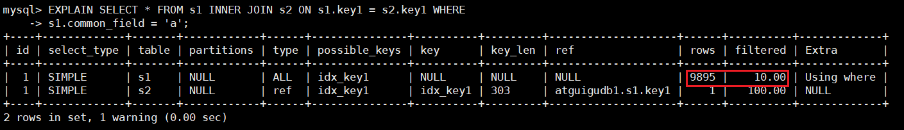

> filtered=(最终查询结果/rows列数据)*100%，越大表示过滤后的数据，越是最终结果。
>
> 相比较filtered越小，减少了数据再次过滤的性能


#### 11. Extra ☆

顾名思义，Extra 列是用来说明一些额外信息的，包含不适合在其他列中显示但十分重要的额外信息。我们可以通过这些额外信息来更准确的理解MySQL到底将如何执行给定的查询语句。MySQL提供的额外信息有好几十个，我们就不一一介绍了，所以我们只挑比较重要的额外信息介绍给大家。

① `No tables used`

当查询语句的没有FROM子句时将会提示该额外信息

```mysql
EXPLAIN SELECT 1;
```

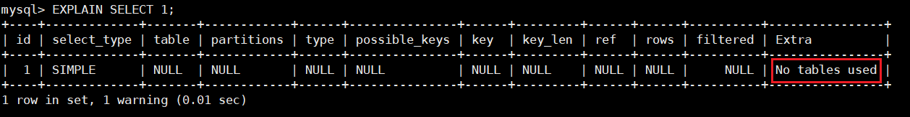

② `Impossible WHERE`

当查询条件永远不可能满足，查不到数据时会出现该信息。

```mysql
EXPLAIN SELECT * FROM s1 WHERE 1 != 1;
```

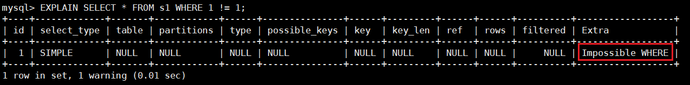

③ `Using where`

- 当没有使用索引，普通的 where 查询时，会出现该信息

```mysql
EXPLAIN SELECT * FROM s1 WHERE common_field = 'a';
```

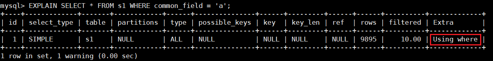

- 使用索引查询，则默默使用索引，什么额外信息也没有。

```mysql
EXPLAIN SELECT * FROM s1 WHERE key1 = 'a';
```

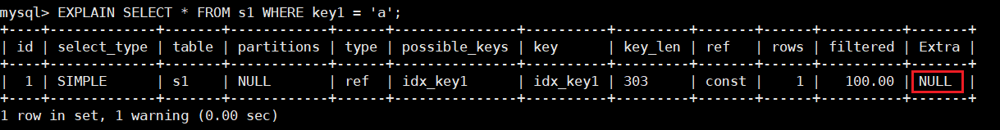

- 索引加普通 where，那还是 using where

```mysql
EXPLAIN SELECT * FROM s1 WHERE key1 = 'a' AND common_field = 'a';
```

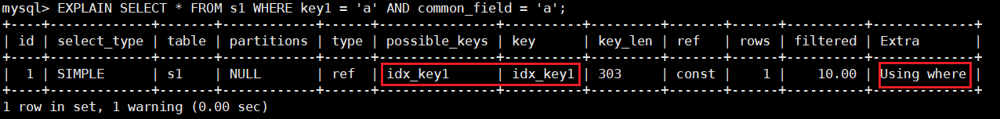

④ `No matching min/max row`

当查询语句中有 MIN、MAX 等聚合函数，但是并没有符合 where 条件的搜索记录时，会提供额外信息 `No matching min/max row`（表中根本没有满足 where 条件的字句，找 min、max 没有意义）

```mysql
EXPLAIN SELECT MIN(key1) FROM s1 WHERE key1 = 'abcdefg';
```

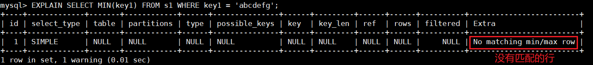

⑤ `Select tables optimized away`

当查询语句中有 MIN、MAX 等聚合函数，有符合 where 条件的搜索记录时

```mysql
EXPLAIN SELECT MIN(key1) FROM s1 WHERE key1 = 'oCUPss';
```

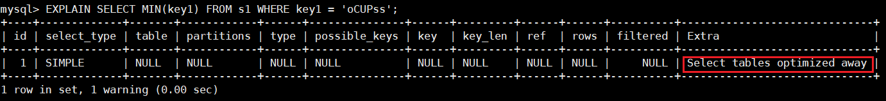

⑥ `Using index`

在使用覆盖索引的情况提示。所谓覆盖索引，就是索引中覆盖了需要查询的所有字段，不需要再使用聚簇索引进行回表查找。比如下面的例子，使用 key1 作为查找条件，该字段建立了索引，B+ 树可以查找到 key1 字段和主键，因此下面只查找 key1 字段就不用进行回表操作，这是非常棒的情况。

```mysql
EXPLAIN SELECT key1 FROM s1 WHERE key1 = 'a';
```

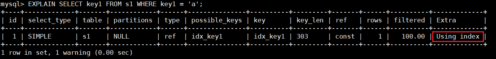

⑦ `Using index condition`

搜索列中虽然出现了索引列，但是不能够使用索引，这种情况是比较坑的~

比如下面的查询虽然出现了索引列作为查询条件，但是还是需要进行回表查找，回表操作是一个随机 I/O，比较耗时。

```mysql
EXPLAIN SELECT * FROM s1 WHERE key1 > 'z' AND key1 LIKE '%a';
```

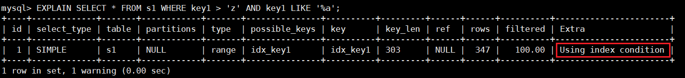

上面这种情况可以使用索引下推(可以通过配置项进行配置)，使我们使用 WHERE key1 > ‘z’ 得到的结果先进行模糊匹配 key1 LIKE ‘%a’，然后再去回表，就可以减少回表的次数了。

⑧` Using join buffer`

在连接查询中，当被驱动表不能够有效利用索引实现提升速度，数据库就使用缓存来尽可能提升一些性能。

```mysql
EXPLAIN SELECT * FROM s1 INNER JOIN s2 ON s1.common_field = s2.common_field;
```

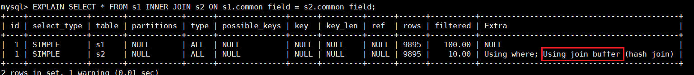

⑨ `Not exists`

当我们使用左（外）连接时，如果`WHERE`子句中包含要求被驱动表的某个列等于`NULL`值的搜索条件，而且那个列又是不允许存储`NULL`值的，那么在该表的执行计划的Extra列就会提示`Not exists`额外信息

```mysql
EXPLAIN SELECT * FROM s1 LEFT JOIN s2 ON s1.key1 = s2.key1 WHERE s2.id IS NULL;
```

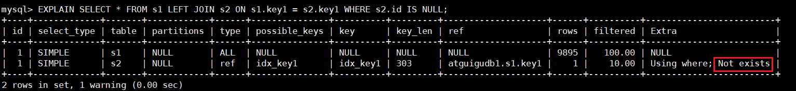

⑩ `Using intersect(…) 、 Using union(…) 和 Using sort_union(…)`

- 如果执行计划的Extra列出现了Using intersect(...)提示，说明准备使用Intersect索引 合并的方式执行查询，括号中的...表示需要进行索引合并的索引名称；
- 如果出现了Using union(...)提示，说明准备使用Union索引合并的方式执行查询；
- 如果出现了Using sort_union(...)提示，说明准备使用Sort-Union索引合并的方式执行查询

```mysql
EXPLAIN SELECT * FROM s1 WHERE key1 = 'a' OR key3 = 'a';
```

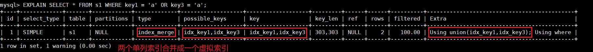

⑪ `Zero limit`

当我们的`LIMIT`子句的参数为`0`时，表示压根儿不打算从表中读出任何记录，将会提示该额外信息

```mysql
EXPLAIN SELECT * FROM s1 LIMIT 0;
```

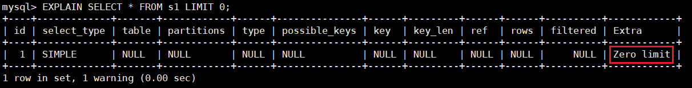

⑫ `Using filesort`

很多情况下排序操作无法使用到索引，只能在内存中（记录较少的时候）或者磁盘中（记录较多的时候）进行排序，MySQL把这种在内存中或者磁盘上进行排序的方式统称为**文件排序**（英文名：`filesort`）。这种情况时比较悲壮的~

```mysql
EXPLAIN SELECT * FROM s1 ORDER BY common_field LIMIT 10;
```

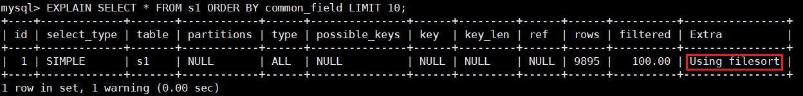

⑬ `Using temporary`

在许多查询的执行过程中，MySQL可能会借助临时表来完成一些功能，比如去重、排序之类的，比如我们在执行许多包含DISTINCT、GROUP BY、UNION等子句的查询过程中，如果不能有效利用索引来完成查询，MySQL很有可能寻求通过建立内部的临时表来执行查询。如果查询中使用到了内部的临时表，在执行计划的Extra列将会显示Using temporary提示

```mysql
EXPLAIN SELECT DISTINCT common_field FROM s1;
EXPLAIN SELECT common_field, COUNT(*) AS amount FROM s1 GROUP BY common_field;
```

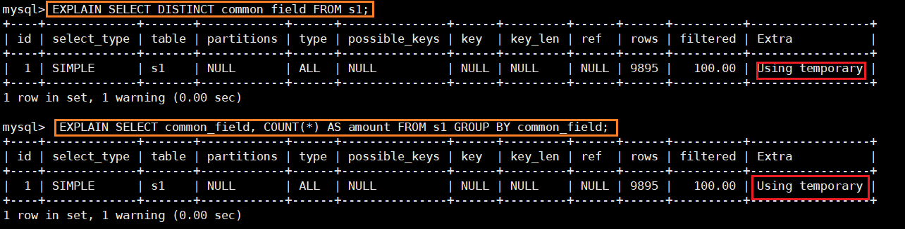

执行计划中出现`Using temporary`并不是一个好的征兆，因为建立与维护临时表要付出很大成本的，所以我们`最好能使用索引来替代掉使用临时表`。比如：扫描指定的索引idx_key1即可

```mysql
 EXPLAIN SELECT key1, COUNT(*) AS amount FROM s1 GROUP BY key1;
```

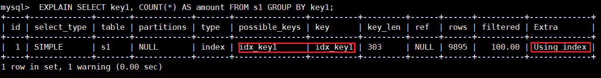


#### 12. 小结

- EXPLAIN不考虑各种Cache
- EXPLAIN不能显示MySQL在执行查询时所作的优化工作
- EXPLAIN不会告诉你关于触发器、存储过程的信息或用户自定义函数对查询的影响情况部分统计
- 信息是估算的，并非精确值

## 7. EXPLAIN的进一步使用

### 7. 1 EXPLAIN四种输出格式

这里谈谈EXPLAIN的输出格式。EXPLAIN可以输出四种格式：==传统格式，JSON格式，TREE格式以及可视化输出==。用户可以根据需要选择适用于自己的格式。

#### 1. 传统格式

传统格式简单明了，输出是一个表格形式，概要说明查询计划。

```mysql
EXPLAIN SELECT * FROM s1 INNER JOIN s2 ON s1.key1 = s2.key2 WHERE s1.common_field ='a';
```

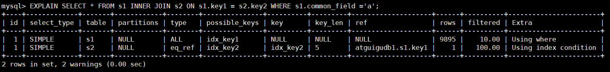

#### 2. JSON格式

第1种格式中介绍的`EXPLAIN`语句输出中缺少了一个衡量执行计划好坏的重要属性–成本。 而JSON格式是四种格式里面输出`信息最详尽`的格式，里面包含了执行的成本信息。

==JSON格式：在EXPLAIN单词和真正的查询语句中间加上FORMAT=JSON==

传统格式与json格式的各个字段存在如下表所示的对应关系(mysql5.7官方文档)。

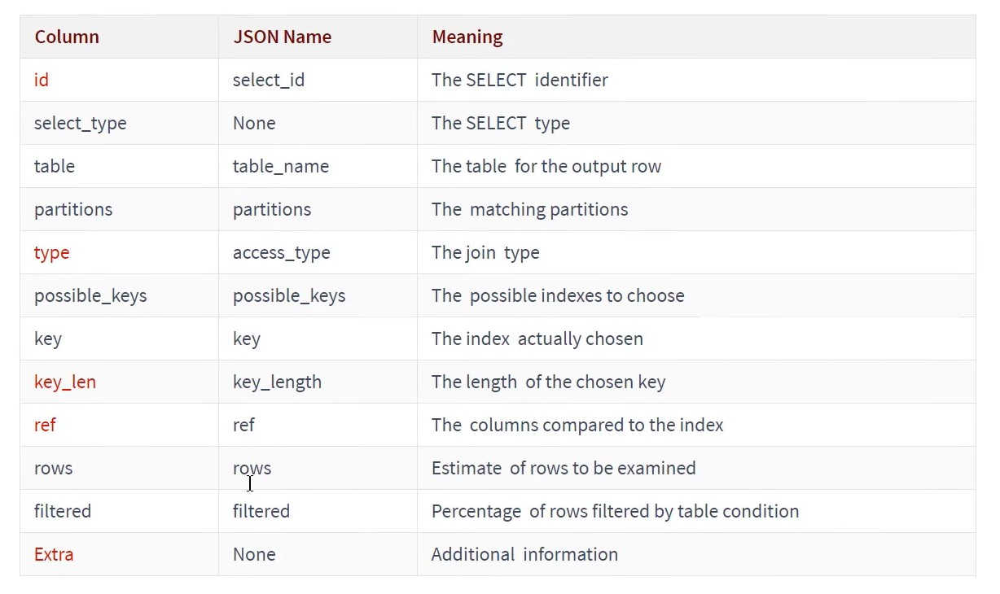

案例如下：

```mysql
EXPLAIN FORMAT=JSON SELECT s1.key1, s2.key1 FROM s1 LEFT JOIN s2 ON s1.key1 = s2.key1 WHERE s2.common_field IS NOT NULL;
```

结果如下，可以看到 json 格式的信息量会更加丰富。尤其是成本信息，是用于衡量一个执行计划的好坏的重要指标

```mysql
mysql> EXPLAIN FORMAT=JSON SELECT * FROM s1 INNER JOIN s2 ON s1.key1 = s2.key2 WHERE s1.common_field ='a'\G;
*************************** 1. row ***************************
EXPLAIN: {
  "query_block": {
    "select_id": 1,
    "cost_info": {
      "query_cost": "1360.07"
    },
    "nested_loop": [
      {
        "table": {
          "table_name": "s1",
          "access_type": "ALL",
          "possible_keys": [
            "idx_key1"
          ],
          "rows_examined_per_scan": 9895,
          "rows_produced_per_join": 989,
          "filtered": "10.00",
          "cost_info": {
            "read_cost": "914.80",
            "eval_cost": "98.95",
            "prefix_cost": "1013.75",
            "data_read_per_join": "1M"
          },
          "used_columns": [
            "id",
            "key1",
            "key2",
            "key3",
            "key_part1",
            "key_part2",
            "key_part3",
            "common_field"
          ],
          "attached_condition": "((`atguigudb1`.`s1`.`common_field` = 'a') and (`atguigudb1`.`s1`.`key1` is not null))"
        }
      },
      {
        "table": {
          "table_name": "s2",
          "access_type": "eq_ref",
          "possible_keys": [
            "idx_key2"
          ],
          "key": "idx_key2",
          "used_key_parts": [
            "key2"
          ],
          "key_length": "5",
          "ref": [
            "atguigudb1.s1.key1"
          ],
          "rows_examined_per_scan": 1,
          "rows_produced_per_join": 989,
          "filtered": "100.00",
          "index_condition": "(cast(`atguigudb1`.`s1`.`key1` as double) = cast(`atguigudb1`.`s2`.`key2` as double))",
          "cost_info": {
            "read_cost": "247.38",
            "eval_cost": "98.95",
            "prefix_cost": "1360.08",
            "data_read_per_join": "1M"
          },
          "used_columns": [
            "id",
            "key1",
            "key2",
            "key3",
            "key_part1",
            "key_part2",
            "key_part3",
            "common_field"
          ]
        }
      }
    ]
  }
}
1 row in set, 2 warnings (0.00 sec)

```

我们使用`#`后面跟随注释的形式为大家解释了 `EXPLAIN FORMAT=JSON` 语句的输出内容，但是大家有疑问 `cost_info`里边的成本看着怪怪的，它们是怎么计算出来的？

先看 s1 表的 "cost_info"部分：

```mysql
"cost_info": {
	"read_cost": "914.80",
    "eval_cost": "98.95",
    "prefix_cost": "1013.75",
    "data_read_per_join": "1M"
}
```

- `read_cost` 是由下边这两部分组成的：
  - `IO`成本
  - 检测 `rows × (1 - filter) `条记录的 `CPU `成本

> 💚 rows和filter都是我们前边介绍执行计划的输出列，在JSON格式的执行计划中，rows相当于rows_examined_per_scan，filtered名称不变

- `eval_cost`是这样计算的：
  - 检测 `rows × filter` 条记录的成本。
- `prefix_cost`就是单独查询 s1 表的成本，也就是：`read_cost + eval_cost`
- `data_read_per_join `表示在此次查询中需要读取的数据量。

对于 s2 表的 “cost_info” 部分是这样的：

```mysql
"cost_info": {
	"read_cost": "247.38",
    "eval_cost": "98.95",
    "prefix_cost": "1360.08",
    "data_read_per_join": "1M"
}
```

由于 s2 表是被驱动表，所以可能被读取多次，这里的 read_cost 和 eval_cost 是访问多次 s2 表后累加起来的值，大家主要关注里边儿的 prefix_cost 的值代表的是整个连接查询预计的成本，也就是单次查询 s1 表和多次查询 s2 表后的成本的和，也就是：

```mysql
247.38 + 98.95 + 1013.75 = 1360.08
```


#### 3. TREE格式

TREE格式是8.0.16版本之后引入的新格式，主要根据查询的各个部分之间的关系和各部分的执行顺序来描述如何查询。

```mysql
mysql> EXPLAIN FORMAT=TREE SELECT * FROM s1 INNER JOIN s2 ON s1.key1 = s2.key2 WHERE s1.common_field ='a'\G;
*************************** 1. row ***************************
EXPLAIN: -> Nested loop inner join  (cost=1360.08 rows=990)
    -> Filter: ((s1.common_field = 'a') and (s1.key1 is not null))  (cost=1013.75 rows=990)
        -> Table scan on s1  (cost=1013.75 rows=9895)
    -> Single-row index lookup on s2 using idx_key2 (key2=s1.key1), with index condition: (cast(s1.key1 as double) = cast(s2.key2 as double))  (cost=0.25 rows=1)

1 row in set, 1 warning (0.00 sec)
```

#### 4. 可视化输出

可视化输出，可以通过MySQL Workbench可视化查看MySQL的执行计划。通过点击Workbench的放大镜图标，即可生成可视化的查询计划。

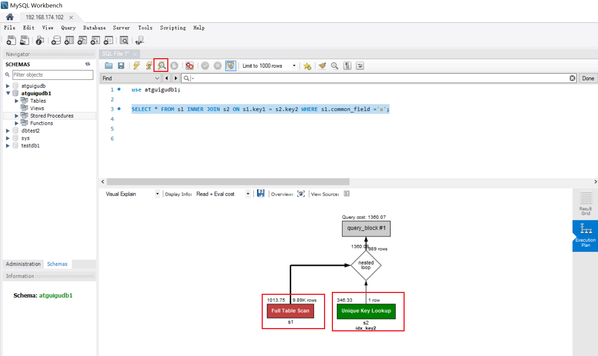


上图按从左到右的连接顺序显示表。红色框表示全表扫描，而绿色框表示使用索引查找。对于每个表，显示使用的索引。还要注意的是，每个表格的框上方是每个表访问所发现的行数的估计值以及访问该表的成本。

### 7. 2 SHOW WARNINGS的使用

可以显示数据库真正执行的 SQL ，因为有时候MySQL执行引擎会对我们的SQL进行优化~

① 先使用 `Explain`，我们写的 sql 按道理是使用 s1 作为驱动表，s2作为被驱动表

```mysql
EXPLAIN SELECT s1.key1, s2.key1 FROM s1 LEFT JOIN s2 ON s1.key1 = s2.key1 WHERE s2.common_field IS NOT NULL;*
```

但是 执行结果把 s2 作为了驱动表，s1 作为了被驱动表

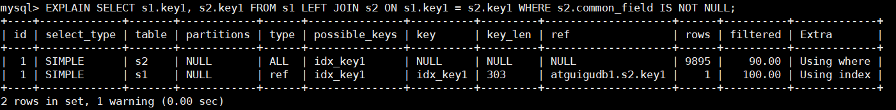

紧接着使用`SHOW WARNINGS` ，原来执行引擎将` LEFT JOIN`优化成了 `INNER JOIN`

```mysql
mysql> SHOW WARNINGS\G;
*************************** 1. row ***************************
  Level: Note
   Code: 1003
Message: /* select#1 */ select `atguigudb1`.`s1`.`key1` AS `key1`,`atguigudb1`.`s2`.`key1` AS `key1` 
from `atguigudb1`.`s1` 
join `atguigudb1`.`s2` 
where ((`atguigudb1`.`s1`.`key1` = `atguigudb1`.`s2`.`key1`) 
and (`atguigudb1`.`s2`.`common_field` is not null))
1 row in set (0.00 sec)
```

上面 message 中显示的是数据库优化、重写后真正执行的查询语句。果然它帮我们做了优化

② 再举一个例子：下面是一个 子查询SQL，应该对应着两个不同的id~

```mysql
EXPLAIN SELECT * FROM s1 WHERE key1 IN (SELECT key2 FROM s2 WHERE common_field = 'a');
```

但是真正执行后，对应着竟然是相同的id

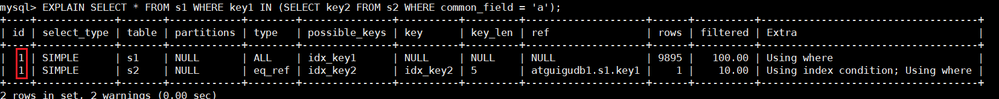

我们使用`SHOW WARNINGS\G;`进行分析，发现执行引擎将其优化成了 **多表连接查询**的方式

```mysql
mysql> SHOW WARNINGS\G;
*************************** 1. row ***************************
  Level: Warning
   Code: 1739
Message: Cannot use ref access on index 'idx_key1' due to type or collation conversion on field 'key1'
*************************** 2. row ***************************
  Level: Note
   Code: 1003
Message: /* select#1 */ select `atguigudb1`.`s1`.`id` AS `id`,`atguigudb1`.`s1`.`key1` AS `key1`,`atguigudb1`.`s1`.`key2` AS `key2`,`atguigudb1`.`s1`.`key3` AS `key3`,`atguigudb1`.`s1`.`key_part1` AS `key_part1`,`atguigudb1`.`s1`.`key_part2` AS `key_part2`,`atguigudb1`.`s1`.`key_part3` AS `key_part3`,`atguigudb1`.`s1`.`common_field` AS `common_field` 
from `atguigudb1`.`s2` 
join `atguigudb1`.`s1` 
where ((`atguigudb1`.`s2`.`common_field` = 'a') 
and (cast(`atguigudb1`.`s1`.`key1` as double) = cast(`atguigudb1`.`s2`.`key2` as double)))
2 rows in set (0.00 sec)
```

## 8. 分析优化器执行计划：trace

`OPTIMIZE_TRACE` 是 mysql 5.6 中引入的一个跟踪工具，它可以跟踪优化器做出的各种决策，比如访问表的方法，各种开销计算，各种转换，结果会被记录到`information_schema.optimizer_trace`中。

此功能默认关闭。开启trace，并设置格式为JSON，同时设置trace最大能够使用的内存大小，避免解析过程中因为默认内存过小而不能够完整展示。命令如下：

```mysql
SET optimizer_trace="enabled=on",end_markers_in_json=on;

set optimizer_trace_max_mem_size=1000000;
```

开启后，可分析如下语句：

- SELECT
- INSERT
- REPLACE
- UPDATE
- DELETE
- EXPLAIN
- SET
- DECLARE
- CASE
- IF
- RETURN
- CALL

测试：执行如下 SQL 语句

```mysql
select * from student where id < 10;
```

最后， 查询 information_schema.optimizer_trace 就可以知道 MySQL 是如何执行 SQL 的

```mysql
select * from information_schema.optimizer_trace\G;
```

结果如下

```mysql
*************************** 1. row ***************************
 //第1部分：查询语句
 QUERY: select * from student where id < 10
 //第2部分：QUERY字段对应语句的跟踪信息
 TRACE: {
 "steps": [
 {
   "join_preparation": {  //预备工作
    "select#": 1,
    "steps": [
    {
      "expanded_query": "/* select#1 */ select `student`.`id` AS
`id`,`student`.`stuno` AS `stuno`,`student`.`name` AS `name`,`student`.`age` AS
`age`,`student`.`classId` AS `classId` from `student` where (`student`.`id` < 10)"
    }
   ] /* steps */
  } /* join_preparation */
 },
 {
   "join_optimization": {  //进行优化
    "select#": 1,
    "steps": [
    {
      "condition_processing": {  //条件处理
       "condition": "WHERE",
       "original_condition": "(`student`.`id` < 10)",
       "steps": [
       {
         "transformation": "equality_propagation",
         "resulting_condition": "(`student`.`id` < 10)"
       },
       {
         "transformation": "constant_propagation",
         "resulting_condition": "(`student`.`id` < 10)"
       },
       {
         "transformation": "trivial_condition_removal",
         "resulting_condition": "(`student`.`id` < 10)"
       }
] /* steps */
     } /* condition_processing */
    },
    {
      "substitute_generated_columns": {  //替换生成的列
     } /* substitute_generated_columns */
    },
    {
      "table_dependencies": [   //表的依赖关系
      {
        "table": "`student`",
        "row_may_be_null": false,
        "map_bit": 0,
        "depends_on_map_bits": [
       ] /* depends_on_map_bits */
      }
     ] /* table_dependencies */
    },
    {
      "ref_optimizer_key_uses": [   //使用键
     ] /* ref_optimizer_key_uses */
    },
    {
      "rows_estimation": [   //行判断
      {
        "table": "`student`",
        "range_analysis": {
         "table_scan": {
          "rows": 3973767,
          "cost": 408558
        } /* table_scan */,   //扫描表
         "potential_range_indexes": [   //潜在的范围索引
         {
           "index": "PRIMARY",
           "usable": true,
           "key_parts": [
            "id"
          ] /* key_parts */
         }
        ] /* potential_range_indexes */,
         "setup_range_conditions": [   //设置范围条件
        ] /* setup_range_conditions */,
         "group_index_range": {
          "chosen": false,
          "cause": "not_group_by_or_distinct"
        } /* group_index_range */,
         "skip_scan_range": {
          "potential_skip_scan_indexes": [
          {
            "index": "PRIMARY",
            "usable": false,
            "cause": "query_references_nonkey_column"
          }
         ] /* potential_skip_scan_indexes */
        } /* skip_scan_range */,
         "analyzing_range_alternatives": {  //分析范围选项
          "range_scan_alternatives": [
          {
"index": "PRIMARY",
            "ranges": [
             "id < 10"
           ] /* ranges */,
            "index_dives_for_eq_ranges": true,
            "rowid_ordered": true,
            "using_mrr": false,
            "index_only": false,
            "rows": 9,
            "cost": 1.91986,
            "chosen": true
          }
         ] /* range_scan_alternatives */,
          "analyzing_roworder_intersect": {
           "usable": false,
           "cause": "too_few_roworder_scans"
         } /* analyzing_roworder_intersect */
        } /* analyzing_range_alternatives */,
         "chosen_range_access_summary": {   //选择范围访问摘要
          "range_access_plan": {
           "type": "range_scan",
           "index": "PRIMARY",
           "rows": 9,
           "ranges": [
            "id < 10"
          ] /* ranges */
         } /* range_access_plan */,
          "rows_for_plan": 9,
          "cost_for_plan": 1.91986,
          "chosen": true
        } /* chosen_range_access_summary */
       } /* range_analysis */
      }
     ] /* rows_estimation */
    },
    {
      "considered_execution_plans": [  //考虑执行计划
      {
        "plan_prefix": [
       ] /* plan_prefix */,
        "table": "`student`",
        "best_access_path": {  //最佳访问路径
         "considered_access_paths": [
         {
           "rows_to_scan": 9,
           "access_type": "range",
           "range_details": {
            "used_index": "PRIMARY"
          } /* range_details */,
           "resulting_rows": 9,
           "cost": 2.81986,
           "chosen": true
         }
        ] /* considered_access_paths */
       } /* best_access_path */,
        "condition_filtering_pct": 100,  //行过滤百分比
        "rows_for_plan": 9,
        "cost_for_plan": 2.81986,
        "chosen": true
      }
     ] /* considered_execution_plans */
    },
    {
      "attaching_conditions_to_tables": {  //将条件附加到表上
       "original_condition": "(`student`.`id` < 10)",
       "attached_conditions_computation": [
      ] /* attached_conditions_computation */,
       "attached_conditions_summary": [  //附加条件概要
       {
         "table": "`student`",
         "attached": "(`student`.`id` < 10)"
       }
      ] /* attached_conditions_summary */
     } /* attaching_conditions_to_tables */
    },
    {
      "finalizing_table_conditions": [
      {
        "table": "`student`",
        "original_table_condition": "(`student`.`id` < 10)",
        "final_table_condition  ": "(`student`.`id` < 10)"
      }
     ] /* finalizing_table_conditions */
    },
    {
      "refine_plan": [  //精简计划
      {
        "table": "`student`"
      }
     ] /* refine_plan */
    }
   ] /* steps */
  } /* join_optimization */
 },
 {
   "join_execution": {   //执行
    "select#": 1,
    "steps": [
   ] /* steps */
  } /* join_execution */
 }
] /* steps */
}
//第3部分：跟踪信息过长时，被截断的跟踪信息的字节数。
MISSING_BYTES_BEYOND_MAX_MEM_SIZE: 0  //丢失的超出最大容量的字节
//第4部分：执行跟踪语句的用户是否有查看对象的权限。当不具有权限时，该列信息为1且TRACE字段为空，一般在
调用带有SQL SECURITY DEFINER的视图或者是存储过程的情况下，会出现此问题。
INSUFFICIENT_PRIVILEGES: 0  //缺失权限
1 row in set (0.00 sec)
```


## 9. MySQL监控分析视图-sys schema

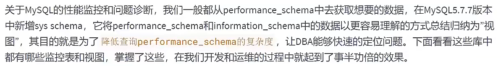

### 9.1 Sys schema视图摘要

1. 主机相关：以 host_summary 开头，主要汇总了 IO 延迟的信息。
2. Innodb 相关：以 innodb 开头，汇总了 innodb buffer 信息和事务等待 innodb 锁的信息。
3. I/O相关：以 IO 开头，汇总了等待 I/O、I/O 使用量情况。
4. 内存使用情况：以 memory 开头，从主机、线程、事件等角度展示内存的使用情况
5. 连接与会话信息：processlist 和 session 相关视图，总结了会话相关信息。
6. 表相关：以 schema_table 开头的视图，展示了表的统计信息。
7. 索引信息：统计了索引的使用情况，包含冗余索引和未使用的索引情况。
8. 语句相关：以 statement 开头，包含执行全表扫描、使用临时表、排序等的语句信息。
9. 用户相关：以 user 开头的视图，统计了用户使用的文件 I/O、执行语句统计信息。
10. 等待事件相关信息：以 wait 开头，展示等待事件的延迟情况。


### 9.2 Sys schema视图使用场景

**1.索引情况**

```mysql
#1. 查询冗余索引
select * from sys.schema_redundant_indexes;

#2. 查询未使用过的索引
select * from sys.schema_unused_indexes;

#3. 查询索引的使用情况
select index_name,rows_selected,rows_inserted,rows_updated,rows_deleted
from sys.schema_index_statistics where table_schema='dbname';
```

举例：比如我们查看下数据的的冗余索引

```mysql
select * from sys.schema_redundant_indexes;
```

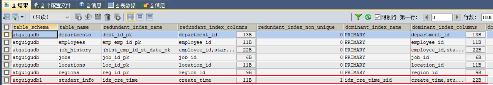

我们任意选择一条，比如最后一条，然后查看下student_info的索引情况，看看是否`idx_cre_time`冗余了

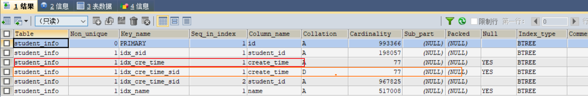

可以 看到 `idx_cre_time`和`idx_cre_time_sid`两个索引中都有 `create_time`。而且联合索引性能要高于单列索引，所以`idx_cre_time `完全可以删掉~

**2.表相关**

```mysql
# 1. 查询表的访问量
select table_schema,table_name,sum(io_read_requests+io_write_requests) as io from sys.schema_table_statistics group by table_schema,table_name order by io desc;

# 2. 查询占用bufferpool较多的表
select object_schema,object_name,allocated,data
from sys.innodb_buffer_stats_by_table order by allocated limit 10;

# 3. 查看表的全表扫描情况
select * from sys.statements_with_full_table_scans where db='dbname';
```

例如：查询表的访问量

```mysql
# 1. 查询表的访问量
select table_schema,table_name,sum(io_read_requests+io_write_requests) as io from sys.schema_table_statistics group by table_schema,table_name order by io desc;
```

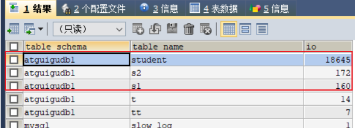


**3.语句相关**

```mysql
#1. 监控SQL执行的频率
select db,exec_count,query from sys.statement_analysis
order by exec_count desc;

#2. 监控使用了排序的SQL
select db,exec_count,first_seen,last_seen,query
from sys.statements_with_sorting limit 1;

#3. 监控使用了临时表或者磁盘临时表的SQL
select db,exec_count,tmp_tables,tmp_disk_tables,query
from sys.statement_analysis where tmp_tables>0 or tmp_disk_tables >0
order by (tmp_tables+tmp_disk_tables) desc;
```

**4.  IO相关**

```mysql
#查看消耗磁盘IO的文件
select file,avg_read,avg_write,avg_read+avg_write as avg_io
from sys.io_global_by_file_by_bytes order by avg_read  limit 10;
```
**5.Innodb 相关**

```mysql
#行锁阻塞情况
select * from sys.innodb_lock_waits;
```

> **风险提示：**
>
> 通过sys库去查询时，MySQL会消耗大量资源去收集相关信息，严重的可能会导致业务请求被阻塞，从而引起故障。建议生产上不要频繁的去查询sys或者`performance_ schema`、 `information_ schema`来完成监控、巡检等工作。

## 10. 小结

查询时数据库中最频繁的操作，提高查询速度可以有效地提高MySQL数据库的性能。通过对查询语句的分析可以了解查询语句的执行情况，找出查询语句执行的瓶颈，从而优化查询语句！