---
# 当前页面内容标题
title: 七、Redis发布订阅
# 分类
category:
  - redis
# 标签
tag: 
  - redis
  - NOSQL
  - K,V缓存数据库
  - 非关系型数据库
sticky: false
# 是否收藏在博客主题的文章列表中，当填入数字时，数字越大，排名越靠前。
star: false
# 是否将该文章添加至文章列表中
article: true
# 是否将该文章添加至时间线中
timeline: true
---

## 01、学习定位

了解即可

## 02、是什么？

### 定义

是一种消息通信模式：发送者（PUBLISH）发送消息，订阅者（SUBSCRIBE）接收消息，可以实现进程间的消息传递

### 官网

https://redis.io/docs/manual/pubsub

### 一句话

Redis可以实现消息中间件MQ的功能，通过发布订阅实现消息的引流和分流。

仅代表我个人，不推荐使用该功能，专业的事交给专业的中间件处理，redis就做好分布式缓存功能

## 03、能干嘛？

- Redis客户端可以订阅任意数量的频道，类似我们微信关注多个公众号

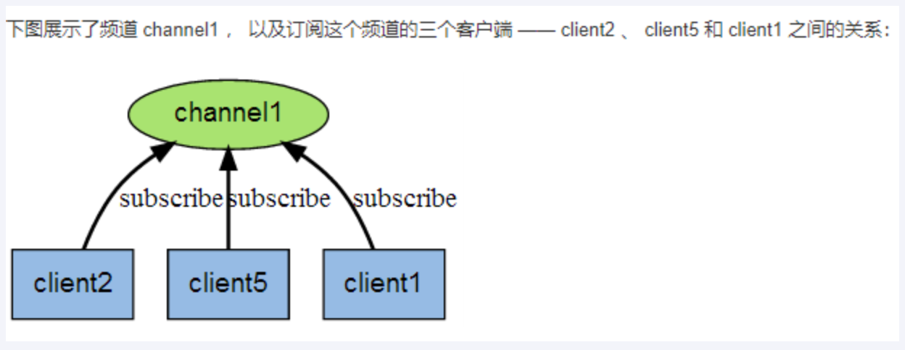

> 当有新消息通过PUBLISH命令发送给频道channel1时

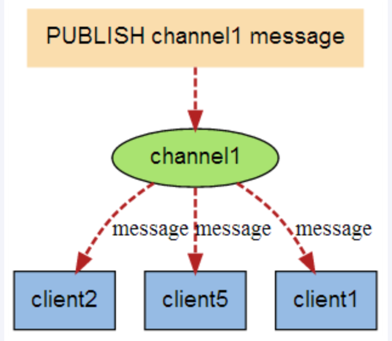

- 小总结

发布/订阅其实是一个轻量的队列，只不过数据不会被持久化，一般用来处理实时性较高的异步消息

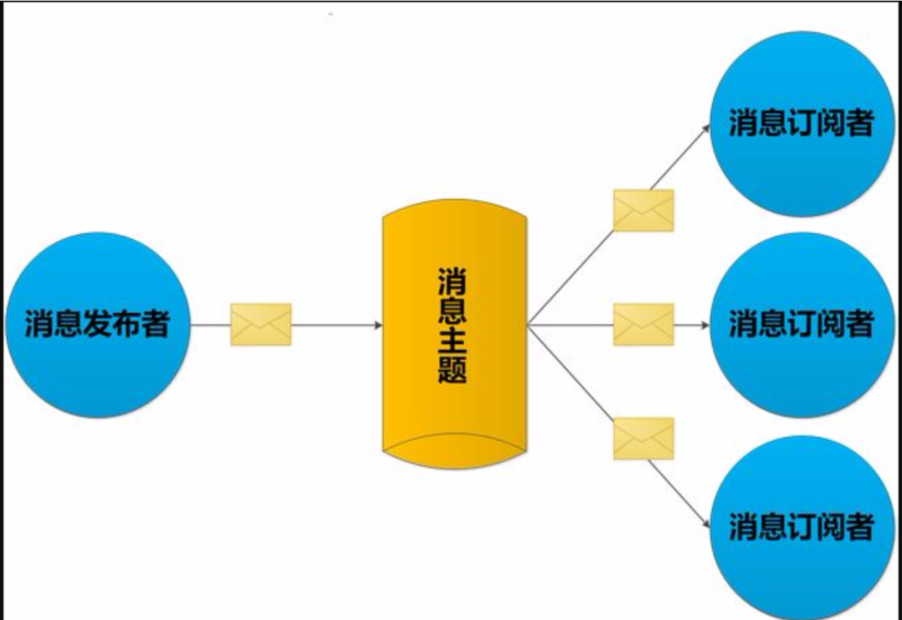

## 04、常用命令

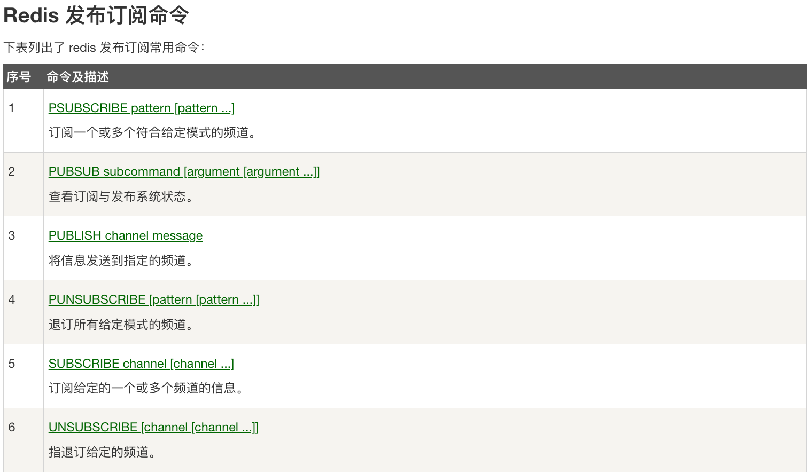

### SUBSCRIBE channel [channel ...]

- 订阅给定的一个或多个频道的信息

- `推荐先执行订阅后在发布，订阅成功之前发布的消息是收不到的`

- 订阅的客户端每次可以收到一个3个参数的信息
  
  - 消息的种类
  
  - 始发频道的名称
  
  - 实际的消息内容
  
  - 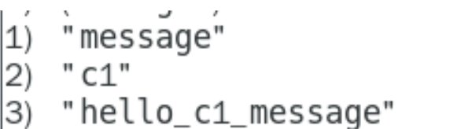

### PUBLISH channel message

- 发布消息到指定的频道

### PUBSCRIBE pattern [pattern ...]

- 按照模式批量订阅，订阅一个或多个符合给定模式（支持*号?号之类的）的频道

### PUBSUB subcommand [argument [argument ...]]

1. 查看订阅与发布系统状态

2. PUBSUB CHANNELS
- 由活跃频道组成的列表

- PUBSUB CHANNELS

- 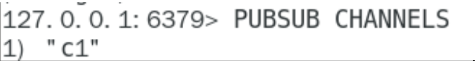
3. PUBSUB NUMSUB [channel [channel...]]
- 某个频道有几个订阅者

- 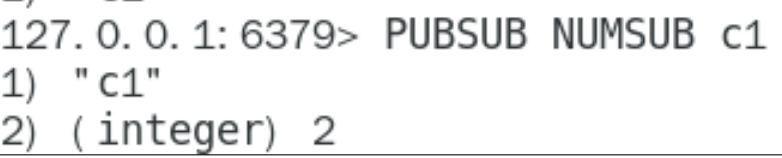
  
  4. PUBSUB NUMPAT

> 只统计使用PUBSCRIBE命令执行的，返回客户端订阅的`唯一模式的数量`

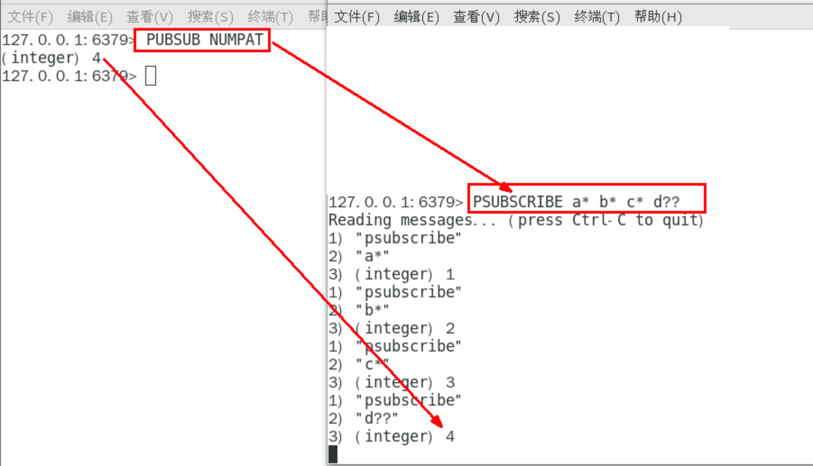

### UNSUBSCRIBE [channel [channel ...]]

> 取消订阅

### PUNSUBSCRIBE [pattern [pattern...]]

> 退订所有给定模式的频道

## 05、案例演示

### 当堂演示

- 开启3个客户端，演示客户端A、B订阅消息，客户端C发布消息

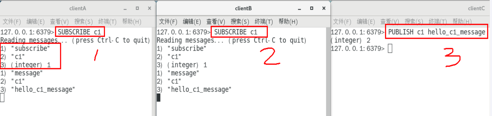

- 演示批量订阅与发布

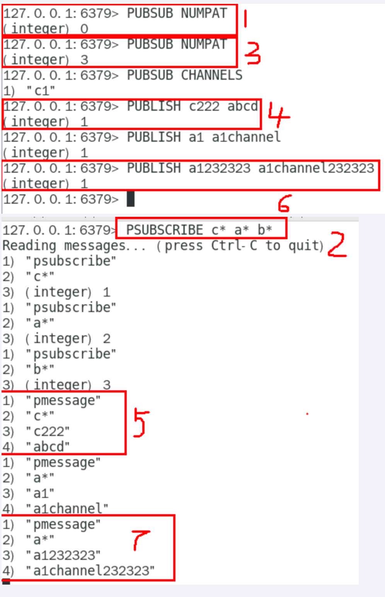

- 取消订阅

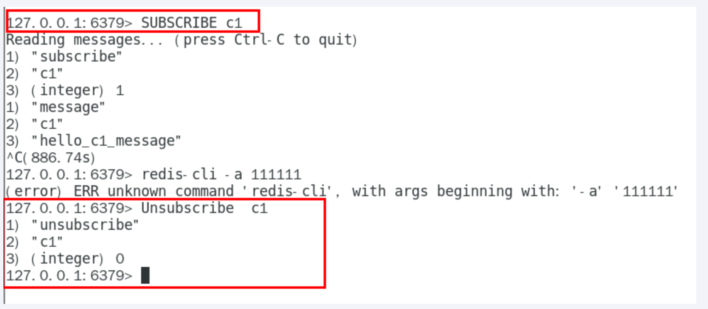

### 小总结

> `Redis可以实现消息中间件MQ的功能，通过发布订阅实现消息的引导和分流。`
> 
> `仅仅代表我个人，不推荐使用该功能，专业的事情交给专业的中间件处理，redis就做好分布式缓存功能。`

> `Pub/Sub缺点`

- 发布的消息在Redis系统重不能持久化，因此，必须先执行订阅，再等待消息发布如果先发布了消息，那么该消息就没有订阅者，消息将被直接丢弃

- 消息只能发送对于发布者而言消息是即发即失的，不管接收，也没有ACK机制，无法保证消息的消费成功。

- 以上的缺点导致Redis的Pub/Sub模式就像个小玩具，在生产环境中几乎无用武之地，为此Redis5.0新增了Stream数据结构，不但支持多播，还支持数据持久化，相比Pub/Sub更加的强大
