---
# 当前页面内容标题
title: 九、Redis哨兵（sentinel）
# 分类
category:
  - redis
# 标签
tag: 
  - redis
  - NOSQL
  - K,V缓存数据库
  - 非关系型数据库
sticky: false
# 是否收藏在博客主题的文章列表中，当填入数字时，数字越大，排名越靠前。
star: false
# 是否将该文章添加至文章列表中
article: true
# 是否将该文章添加至时间线中
timeline: true
---

## 01、是什么？

吹哨人巡逻监控后台master主机是否故障，如果故障了根据`投票数`自动将某一个从库转换为新主库，继续对外服务！

### 作用

哨兵的作用：

`1、监控redis运行状态，包括master和slave`

`2、当master down机，能自动将slave切换成新master`

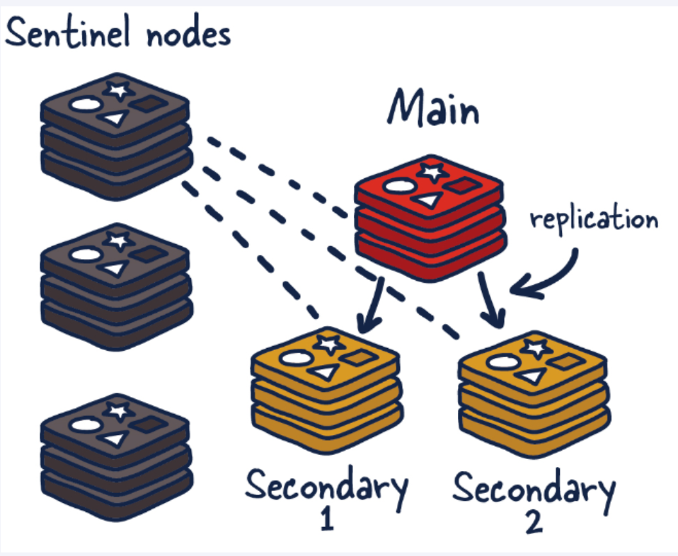

> 俗称：无人值守运维

> 官网理论：https://redis.io/docs/manual/sentinel/

## 02、能干嘛？

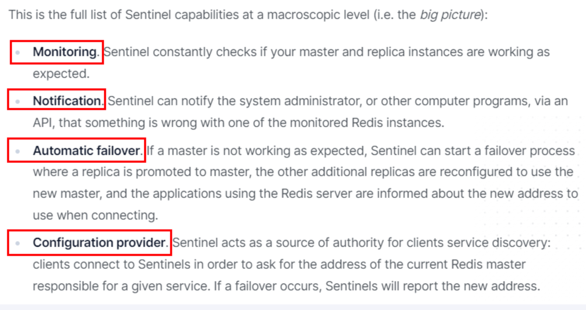

- 主从监控

监控主从redis库运行是否正常

- 消息通知

哨兵可以将故障转移的结果发送给客户端

- 故障转移

如果master异常，则会进行主从切换，将其中一个Slave作为新Master

- 配置中心

客户端连接哨兵来获得当前`redis`服务的主节点地址

## 03、怎么玩（案例演示实战步骤）

### Redis Sentinel架构，前提说明

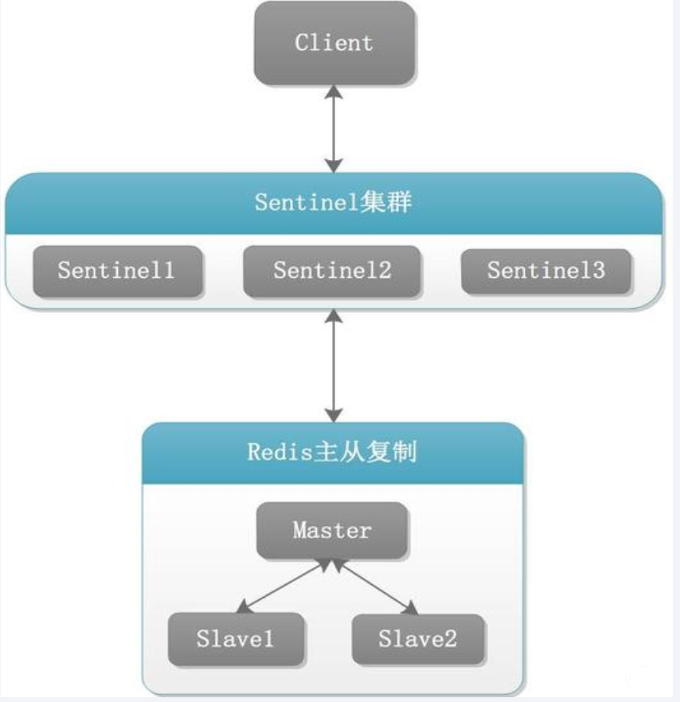

- 3个哨兵

自动监控和维护集群，不存放数据，只是吹哨人

- 1主2从

用于数据读取和存放

### 案例步骤，不服就干

#### 1、/myredis目录下新建或者拷贝sentinel.conf文件，名字绝对不能错

#### 2、先看看/opt目录下默认的sentinel.conf文件的内容

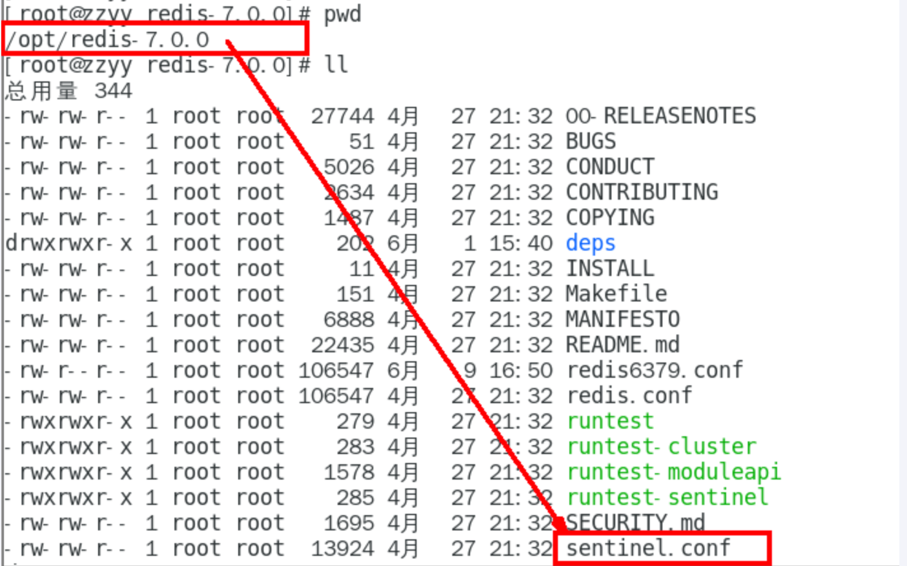

#### 3、重点参数项说明

- bind

服务监听地址，用于客户端连接，默认本机地址

- daemonize

是否以后台daemon方式运行

- port

端口

- logfile

日志文件路径

- pidfile

pid文件路径

- dir

工作目录

- `sentinel monitor < master-name > < ip > < redis-port > < quorum >`

> 设置要监控的master服务器
> 
> quorum表示最少有几个哨兵认可客观下线，同意故障迁移的法定票数

行尾最后的quorum代表什么意思呢？`quorum：确认客观下线的最少的哨兵数量`

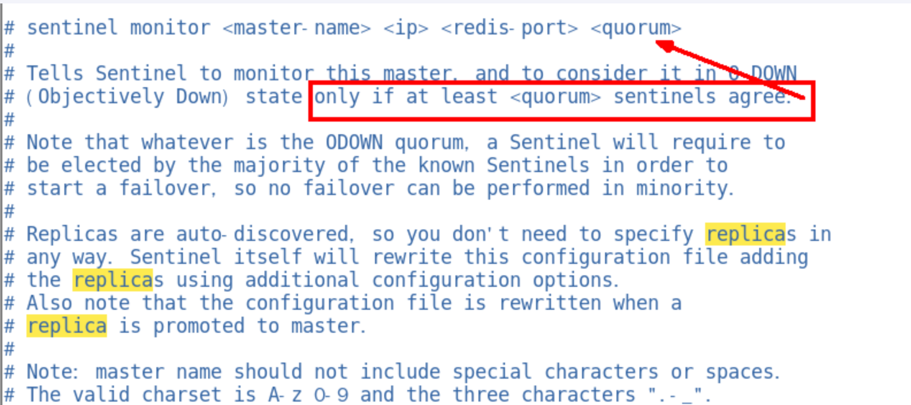

我们知道，网络是不可靠的，有时候一个sentinel会因为网络堵塞而`误以为`一个master redis已经死掉了，在sentinel集群环境下需要多个sentinel互相沟通来确认某个master`是否真的死了`，quorum这个参数是进行客观下线的一个依据，意思是至少有quorum个sentinel认为这个master有故障，才会对这个master进行下线以及故障转移。因为有的时候，某个sentinel节点可能因为自身网络原因，导致无法连接master，而此时master并没有出现故障，所以，这就需要多个sentinel都一致认为该master有问题，才可以进行下一步操作，这就保证了公平性和高可用。

- sentinel auth-pass < master-name > < password > 

master设置了密码，连接master服务的密码

- 其他

```textile
sentinel down-after-milliseconds < master-name > < milliseconds >：

指定多少毫秒之后，主节点没有应答哨兵，此时哨兵主观上认为主节点下线


sentinel parallel-syncs < master-name > < nums >：

表示允许并行同步的slave个数，当Master挂了后，哨兵会选出新的Master，此时，剩余的slave会向新的master发起同步数据


sentinel failover-timeout < master-name > < milliseconds >：

故障转移的超时时间，进行故障转移时，如果超过设置的毫秒，表示故障转移失败


sentinel notification-script < master-name > < script-path > ：

配置当某一事件发生时所需要执行的脚本


sentinel client-reconfig-script < master-name > < script-path >：

客户端重新配置主节点参数脚本
```

#### 4、`本次案例哨兵sentinel文件通用配置`

- 由于机器硬件关系，我们的3个哨兵都同时配置进192.168.111.169同一台机器

- `sentinel26379.conf`

```textile
bind 0.0.0.0
daemonize yes
protected-mode no
port 26379
logfile "/myredis/sentinel26379.log"
pidfile /var/run/redis-sentinel26379.pid
dir /myredis
sentinel monitor mymaster 192.168.111.169 6379 2
sentinel auth-pass mymaster 111111
```

- `sentinel26380.conf`

```textile
bind 0.0.0.0
daemonize yes
protected-mode no
port 26380
logfile "/myredis/sentinel26380.log"
pidfile /var/run/redis-sentinel26380.pid
dir "/myredis"
sentinel monitor mymaster 192.168.111.169 6379 2
sentinel auth-pass mymaster 111111
```

- `sentinel26381.conf`

```textile
bind 0.0.0.0
daemonize yes
protected-mode no
port 26381
logfile "/myredis/sentinel26381.log"
pidfile /var/run/redis-sentinel26381.pid
dir "/myredis"
sentinel monitor mymaster 192.168.111.169 6379 2
sentinel auth-pass mymaster 111111
```

- 请看一眼`sentinel26379.conf`、`sentinel26380.conf`、`sentinel26381.conf`我们填写的内容

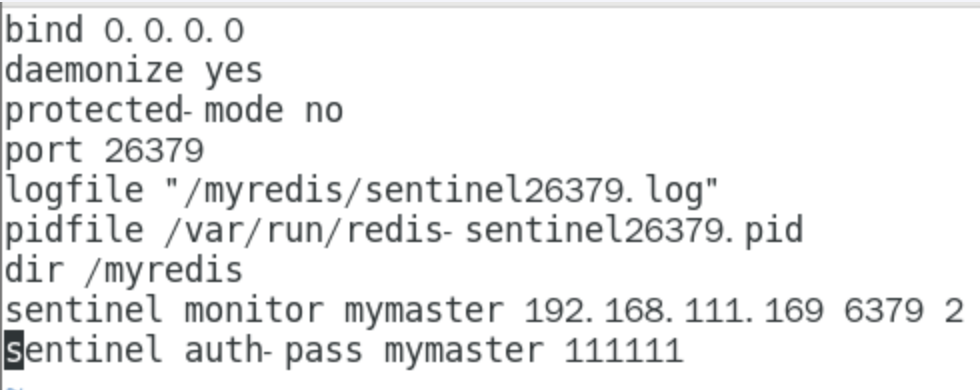

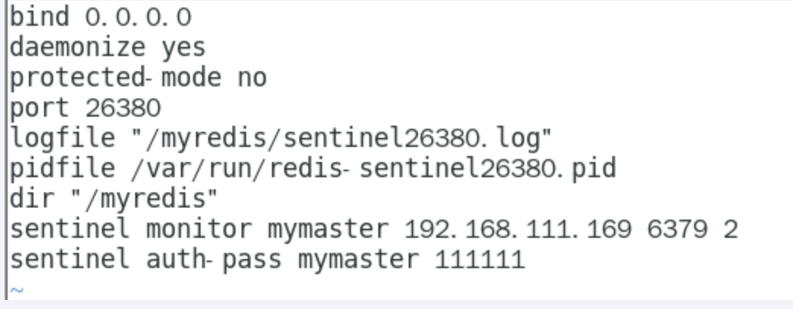

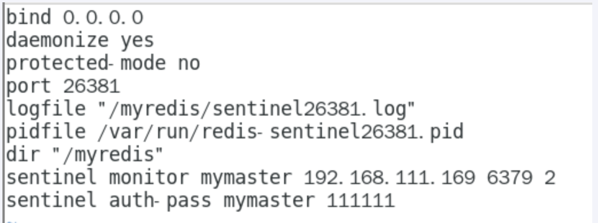

- master主机配置文件说明

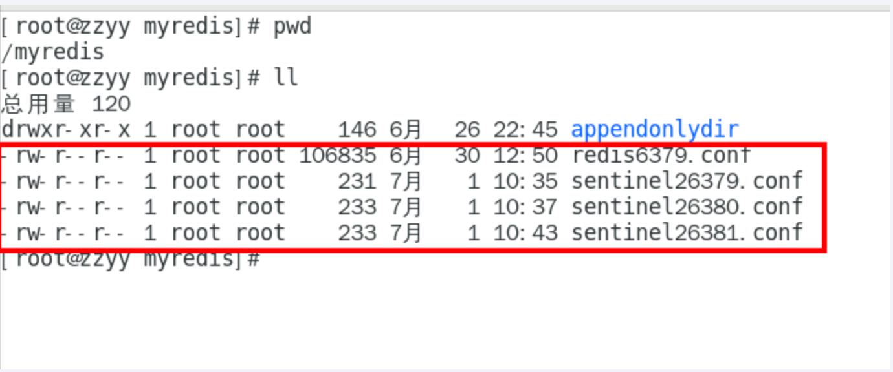

#### 5、先启动一主二从3个redis实例，测试正常的主从复制

- 架构说明

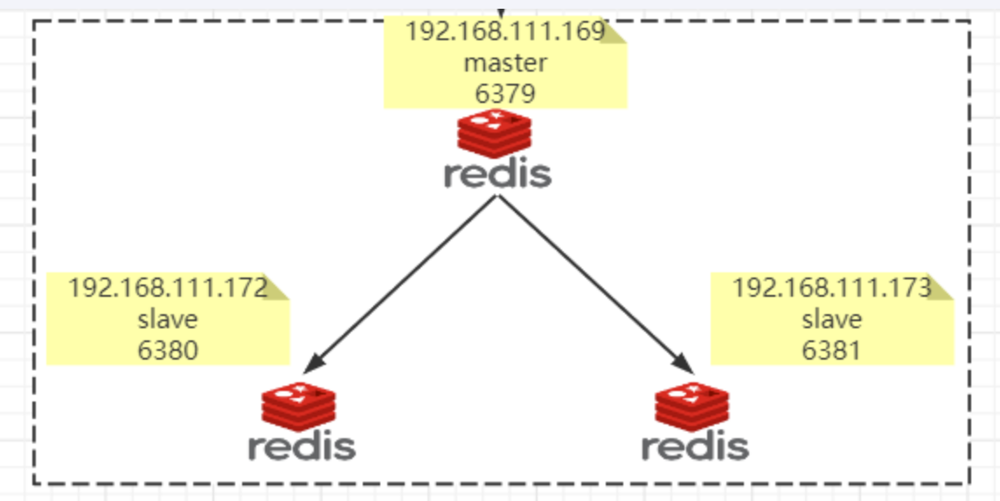

| 1   | 169机器上新建redis6379.conf配置文件，由于要配合本次案例，请设置masterauth项访问密码为111111，不然后续可能报错master_link_status:down |
| --- | ---------------------------------------------------------------------------------------------- |
| 2   | 172机器上新建redis6380.conf配置文件，设置好replicaof < masterip > < masterport >                            |
| 3   | 173机器上新建redis6381.conf配置文件，设置好replicaof < masterip > < masterport >                            |

- 请看一眼`redis6379.conf`、`redis6380.conf`、`redis6381.conf`我们自己填写主从复制相关的内容

> 主机6379

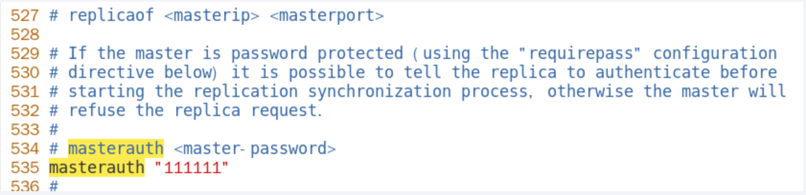

6379后续可能会变成从机，需要设置访问新主机的密码， 请设置masterauth项访问密码为111111，

`不然后续可能报错master_link_status:down`

> 6380

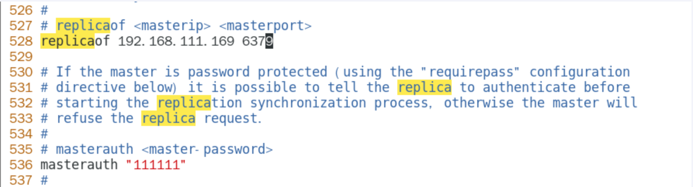

具体IP地址和密码根据你本地真实情况，酌情修改

> 6381

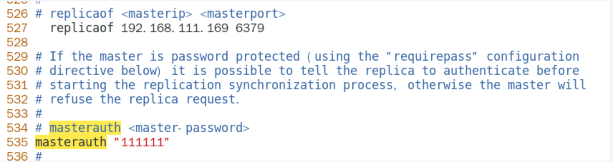

具体IP地址和密码根据你本地真实情况，酌情修改

- 3台不同的虚拟机实例，启动三部真实机器实例并连接

> redis-cli -a 111111 -p 6379

> redis-cli -a 111111 -p 6380

> redis-cli -a 111111 -p 6381

- 具体查看当堂动手案例配置并观察文件内容

#### =========以下是哨兵内容部分=========

#### 6、在启动3个哨兵，完成监控

- redis-sentinel sentinel26379.conf --sentinel

- redis-sentinel sentinel26380.conf --sentinel

- redis-sentinel sentinel26381.conf --sentinel

#### 7、启动3个哨兵监控后再测试一次主从复制

`岁月静好一切OK`

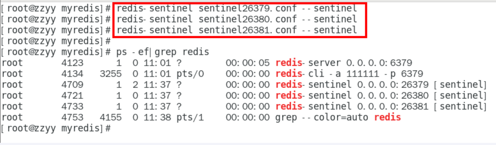

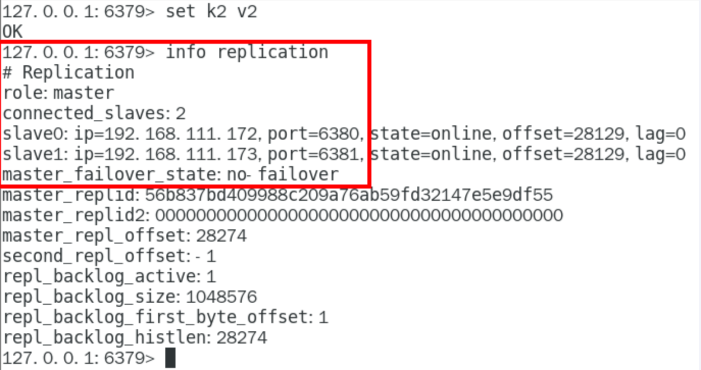

#### 8、原有的master挂了

1. 我们手动关闭6379服务器，模拟master挂了

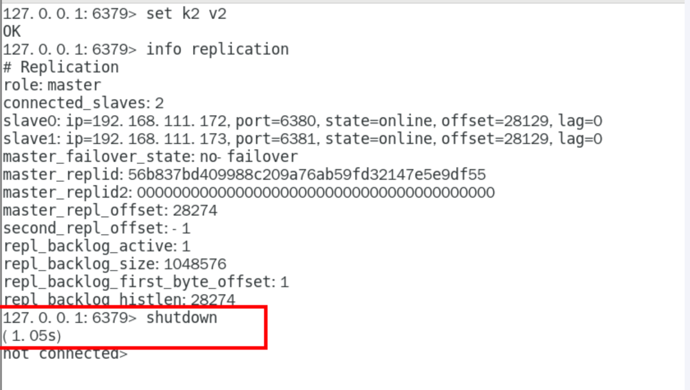

2. ❓问题思考

两台从机数据是否ok

是否会剩下的2台机器上选出新的master

之前down机的master机器重新回来，谁将是新老大？会不会双master冲突？

3. 📚揭晓答案
- 数据OK

> 两个小问题

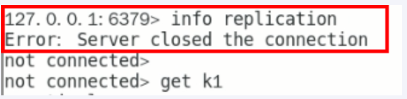

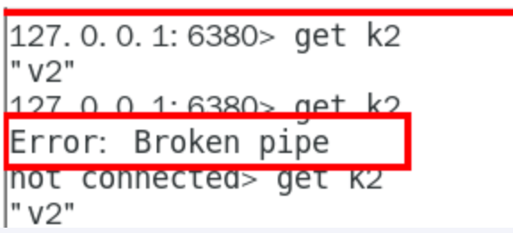

> 6380

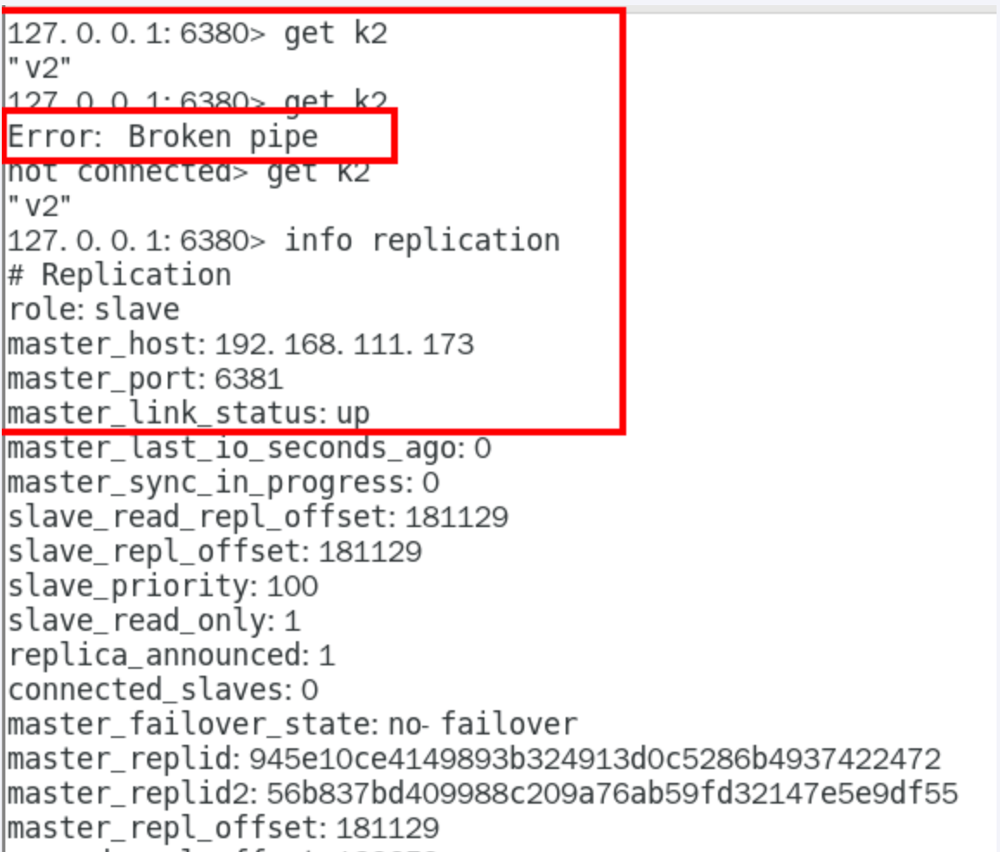

> 6381

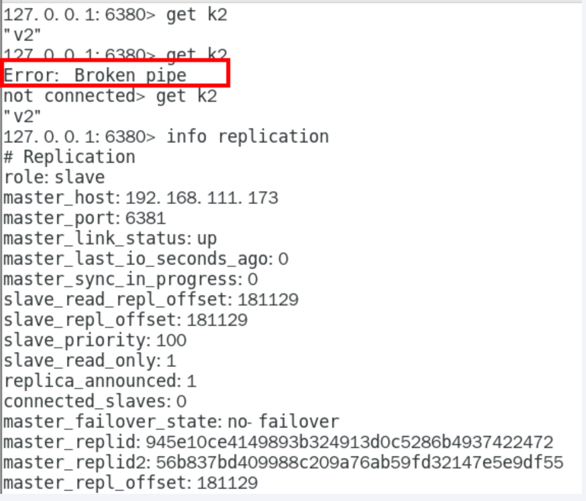

> 了解Broken pipe

| 认识broken pipe  | pipe是管道的意思，管道里面是数据流，通常是从文件或网络套接字读取的数据。当该管道从另一端突然关闭时，会发生数据突然中断，即是broken，对于socket来说，可能是网络被拔出或另一端的进程崩溃 |
| -------------- | --------------------------------------------------------------------------------------------------- |
| 解决问题           | 其实当该异常产生的时候，对于服务端来说，并没有多少影响。因为可能是某个客户端突然中止了进程导致了该错误                                                 |
| 总结 Broken Pipe | 这个异常是客户端读取超时关闭了连接,这时候服务器端再向客户端已经断开的连接写数据时就发生了broken pipe异常！                                         |

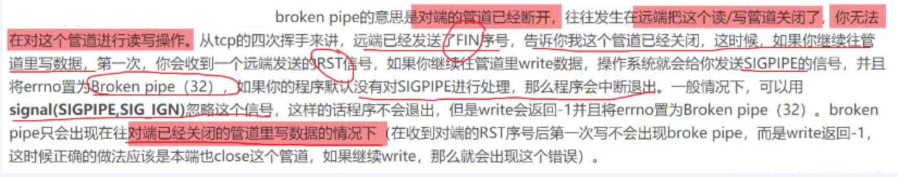

- 投票新选

> sentinel26379.log

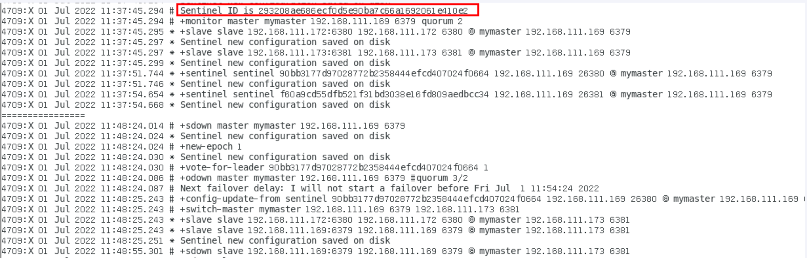

> sentinel26380.log

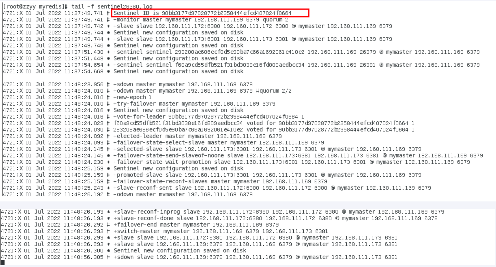

> sentinel26381.log

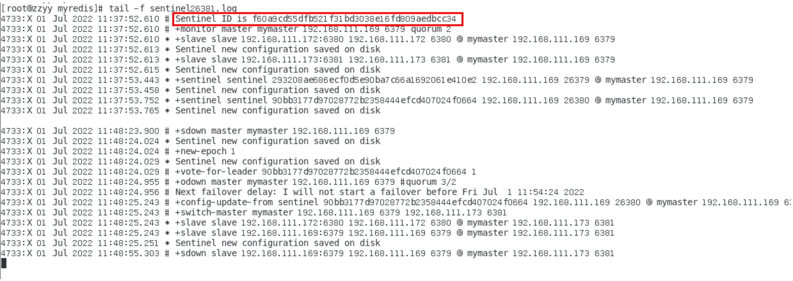

- 谁是master，限本次案例

> 6381被选为master，上位成功

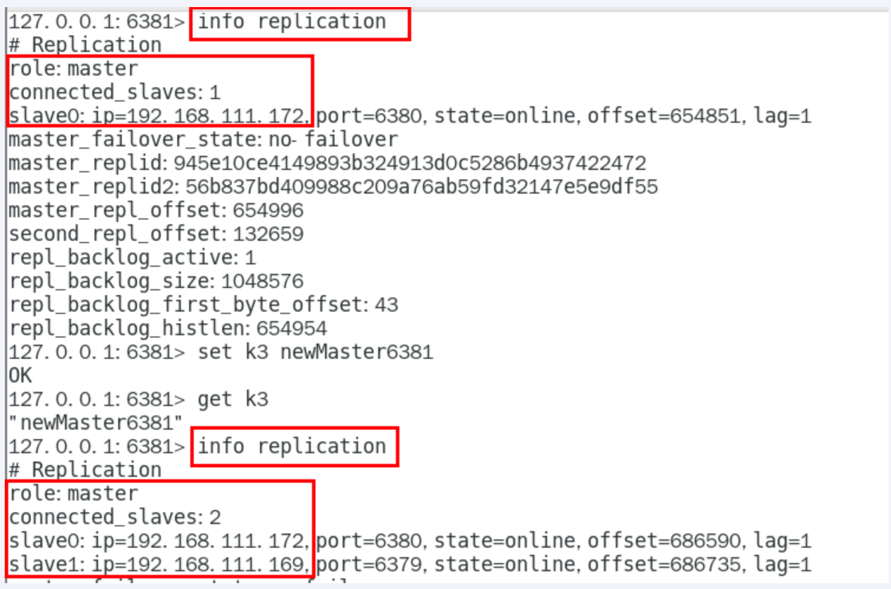

> 以前的6379从master降级为slave

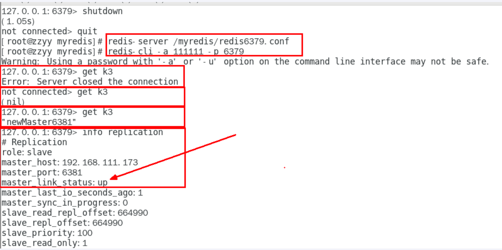

> 6380还是slave，只不过换了个新老大6381（6379变6381），6380还是slave

#### 9、对比配置文件

- vim sentinel26379.conf

- 老master，vim redis6379.conf

- 新master，vim redis6381.conf

- 结论

文件的内容，在运行期间会被sentinel动态进行修改

Master-Slave切换后，master_redis.conf、slave_redis.conf和sentinel.conf的内容都会发生改变，即master_redis.conf中会多一行slaveof的配置，sentinel.conf的监控目标会随之调换

### 其他备注

生产时不同机房不同服务器，很少出现3个哨兵全挂掉的情况

可以同时监控多个master，一行一个

## 04、哨兵运行流程和选举原理

当一个主从配置中的master失效之后，sentinel可以选举出    一个新的master

用于自动接替原mster的工作，主从配置中的其他redis服务器自动指向新的master同步数据。

一般建议sentinel采取`奇数台`，防止某一台sentinel无法连接到master导致误切换

### 运行流程，故障切换

#### 1、三个哨兵监控一主二从，正常运行中......

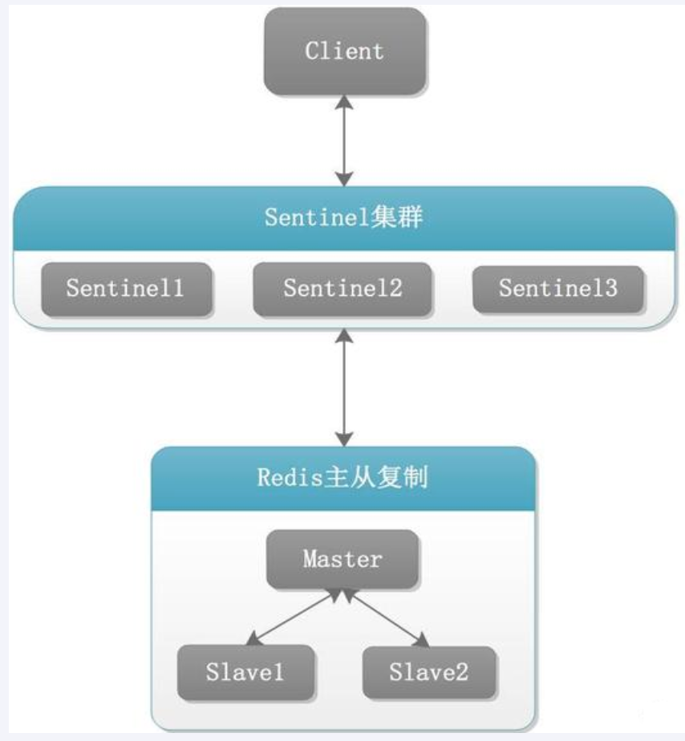

#### 2、SDown主观下线（Subjectively Down）

- SDOWN（主观不可用）是单个sentinel自己主观上检测到关于master的状态，从sentinel的角度来看，如果发送了PING心跳后，在一定时间内没有收到合法的回复，就达到了SDOWN的条件

- sentinel配置文件中的down-after-milliseconds设置了判断主观下线的时间长度

- 说明

所谓主观下线（Subjectively Down， 简称 SDOWN）指的是单个Sentinel实例对服务器做出的下线判断，即单个sentinel认为某个服务下线（有可能是接收不到订阅，之间的网络不通等等原因）。主观下线就是说如果服务器在[sentinel down-after-milliseconds]给定的毫秒数之内没有回应PING命令或者返回一个错误消息， 那么这个Sentinel会主观的(单方面的)认为这个master不可以用了，o(╥﹏╥)o

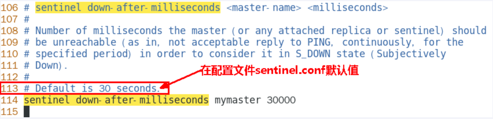

sentinel down-after-milliseconds < masterName > < timeout >

 表示master被当前sentinel实例认定为失效的间隔时间，这个配置其实就是进行主观下线的一个依据

master在多长时间内一直没有给Sentine返回有效信息，则认定该master主观下线。也就是说如果多久没联系上redis-servevr，认为这个redis-server进入到失效（SDOWN）状态。

#### 3、ODown客观下线（Objectively Down）

- ODOWN需要一定数量的sentinel，`多个哨兵打成一致意见`才能认为一个master客观上已经宕机了

- 说明

四个参数含义：

masterName是对某个master+slave组合的一个区分标识(一套sentinel可以监听多组master+slave这样的

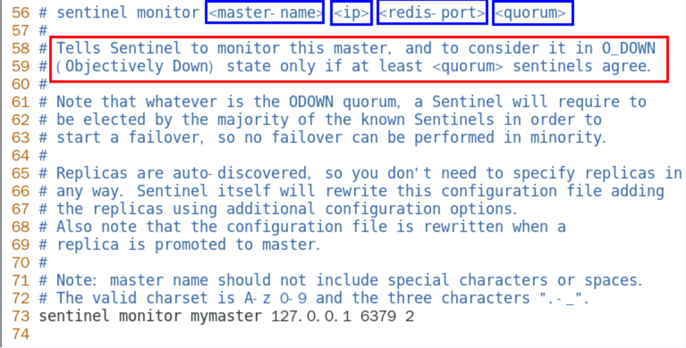

**quorum这个参数是进行客观下线的一个依据**，法定人数/法定票数

意思是至少有quorum个sentinel认为这个master有故障才会对这个master进行下线以及故障转移。因为有的时候，某个sentinel节点可能因为自身网络原因导致无法连接master，而此时master并没有出现故障，所以这就需要多个sentinel都一致认为该master有问题，才可以进行下一步操作，这就保证了公平性和高可用。

#### 4、选出领导者哨兵（哨兵中选出兵王）

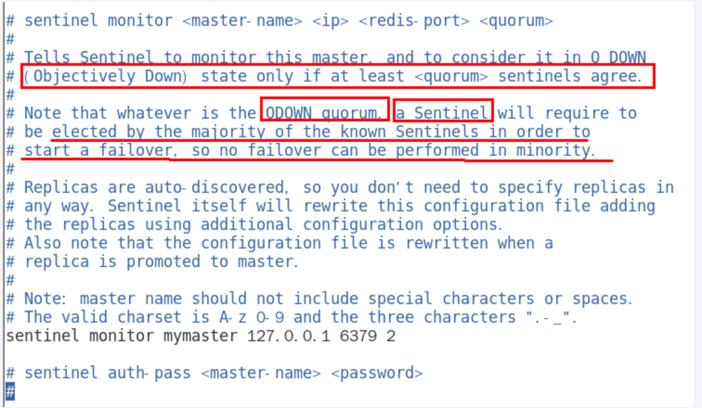

当主节点被判断客观下线以后，各个哨兵节点会进行协商，先选出一个`领导者哨兵节点（兵王）`并由该领导者节点，也即被选出的兵王进行failover（故障迁移）

> 三哨兵日志文件2次解读分析

- sentinel26379.log


- sentinel26380.log

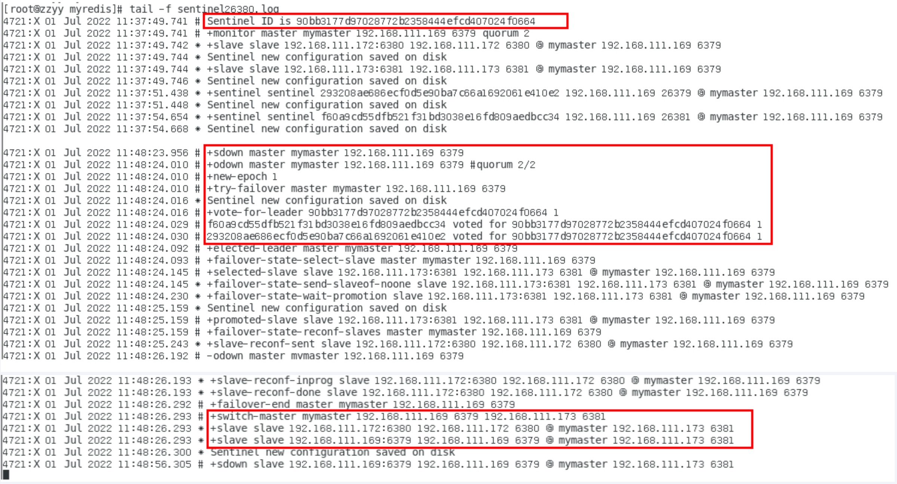

- sentinel26381.log

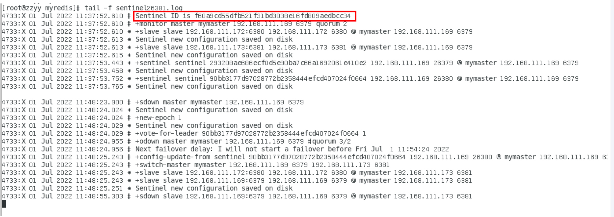

哨兵领导者，兵王如何选出来的？

- Raft算法

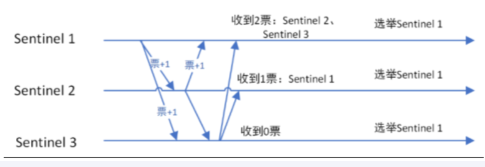

监视该主节点的所有哨兵都有可能被选为领导者，选举使用的算法是Raft算法；Raft算法的基本思路**是先到先得**：

即在一轮选举中，哨兵A向B发送成为领导者的申请，如果B没有同意过其他哨兵，则会同意A成为领导者

#### 5、由兵王开始推动故障切换流程并选出一个新master

##### 3步骤

###### 新主登基

- 某个slave被选中成为新master

- 选出新master的规则，剩余slave节点健康前提下

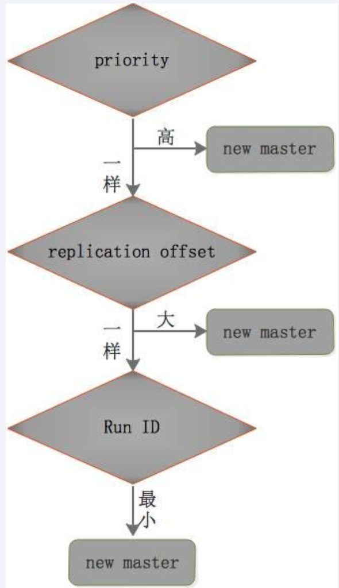

redis.conf文件中，优先级slave-priority或者replica-priority最高的从节点（数字越小优先级越高）

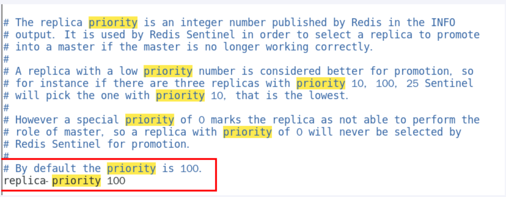

复制偏移位置offset最大的从节点

最小Run ID的从节点

> 字典顺序，ASCIII码

###### 群臣俯首

- **一朝天子一朝臣，换个码头重新拜**

- 执行那个slaveof no one命令让选出来的从节点成为新的主节点，并通过slaveof命令让其他节点成为其从节点

- Sentinel leader会对选举出的新master执行slaveof no one操作，将其提升为master节点

- Sentinel leader向其他slave发送命令，让剩下的salve成为新的master节点的slave

###### 旧主拜服

- **老master回来也认怂**

- 将之前已下线的老master设置为新选出的新master的从节点，当老master重新上线后，它会成为新master的从节点

- Sentinel leader会让原来的master降级为slave并恢复工作

##### 小总结

上述的failover操作均由sentinel自己独立完成，完全无需人工干预。

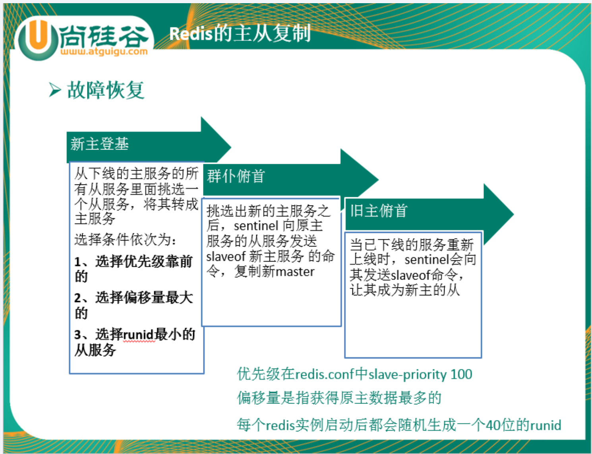

## 05、哨兵使用建议

- 哨兵节点的数量应为多个，哨兵本身应该集群，保证高可用

- 哨兵节点的数量应该是奇数

- 各个哨兵节点的配置应一致

- 如果哨兵节点部署在Docker等容器里面没有起要注意端口的正确映射

- 哨兵集群+主从复制，并不能保证数据零丢失
  
  - 承上启下引出集群
