---
# 当前页面内容标题
title: 二、Redis的安装配置
# 分类
category:
  - redis
# 标签
tag: 
  - redis
  - NOSQL
  - K,V缓存数据库
  - 非关系型数据库
sticky: false
# 是否收藏在博客主题的文章列表中，当填入数字时，数字越大，排名越靠前。
star: false
# 是否将该文章添加至文章列表中
article: true
# 是否将该文章添加至时间线中
timeline: true
---

## 01、自己购买服务器

> 自己购买阿里云、七牛云、腾讯云或华为云服务器，自带CentOS或者Ubuntu环境，直接开干！

## 02、VMware本地虚拟机

> VMware虚拟机的安装，不讲解，默认你是知道的，不知道的可以查看我的Linux学习专栏！

> 如何查看自己Linux的系统是32位还是64位的？可以通过如下命令

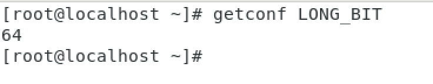

> `getconf LONG_BIT`
> 
> 返回是多少就是几位

## 03、Redis的安装

### 注意点

> 小白同学注意，日常用什么系统安装redis？

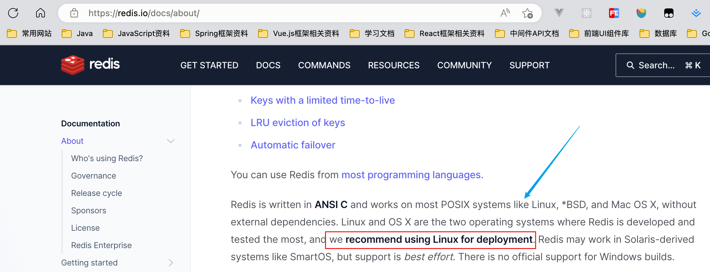

> 由于企业里面做Redis开发，99%都是Linux版的运用和安装，几乎不会涉及到Windows版本，上一步的讲解知识为了知识的完整性，Windows版本不作为重点，有兴趣的同学可以自己去玩一下，企业实战之刃一个版本：那就是<mark>Linux</mark>！

### ❌Windows版本安装

> Window 下安装
> 
> 下载地址：`https://github.com/dmajkic/redis/downloads`
> 
> 下载到的Redis支持32bit和64bit。根据自己实际情况选择，将64bit的内容cp到自定义盘符安装目录取名redis。 如 C:\reids
> 
> 打开一个cmd窗口 使用cd命令切换目录到 C:\redis 运行 `redis-server.exe redis.conf `。
> 
> 如果想方便的话，可以把redis的路径加到系统的环境变量里，这样就省得再输路径了，后面的那个redis.conf可以省略，
> 
> 如果省略，会启用默认的。输入之后，会显示如下界面：

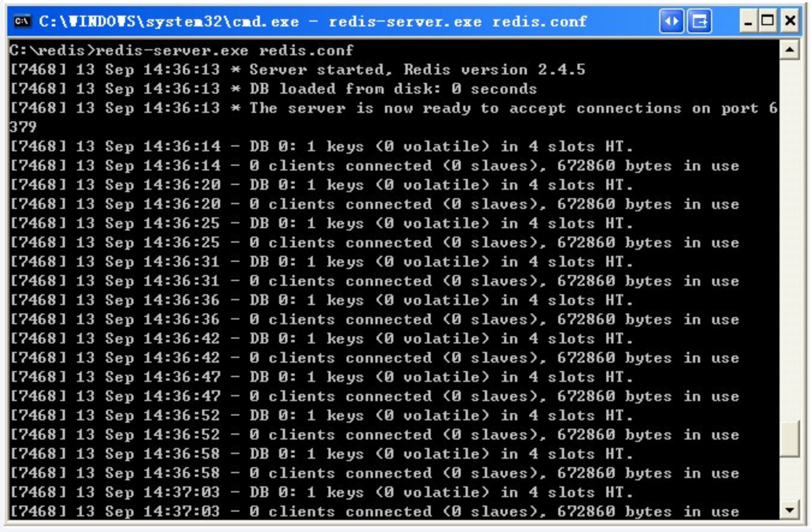

> 这时候另启一个cmd窗口，原来的不要关闭，不然就无法访问服务端了。
> 
> 切换到redis目录下运行 `redis-cli.exe -h 127.0.0.1 -p 6379 `。
> 
> 设置键值对 set myKey abc
> 
> 取出键值对 get myKey

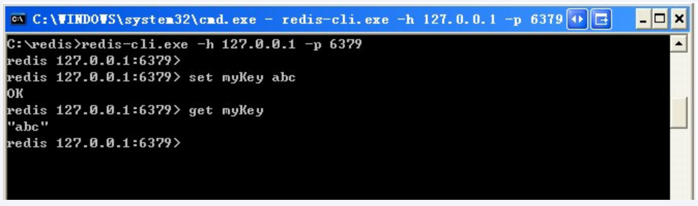

### ✅ Linux版本的安装

#### Linux环境安装Redis必须先具备gcc编译环境

> 什么是gcc？

> gcc是linux下的一个编译程序，是C程序的编译工具。
> 
> GCC(GNU Compiler Collection) 是 GNU(GNU's Not Unix) 计划提供的编译器家族，它能够支持 C, C++, Objective-C, Fortran, Java 和 Ada 等等程序设计语言前端，同时能够运行在 x86, x86-64, IA-64, PowerPC, SPARC和Alpha 等等几乎目前所有的硬件平台上。鉴于这些特征，以及 GCC 编译代码的高效性，使得 GCC 成为绝大多数自由软件开发编译的首选工具。虽然对于程序员们来说，编译器只是一个工具，除了开发和维护人员，很少有人关注编译器的发展，但是 GCC 的影响力是如此之大，它的性能提升甚至有望改善所有的自由软件的运行效率，同时它的内部结构的变化也体现出现代编译器发展的新特征。

> 查看
> 
> `gcc -v`

> 安装

- 安装redis之前需要具备c++库环境

- `yum -y install gcc-c++`

- 命令案例

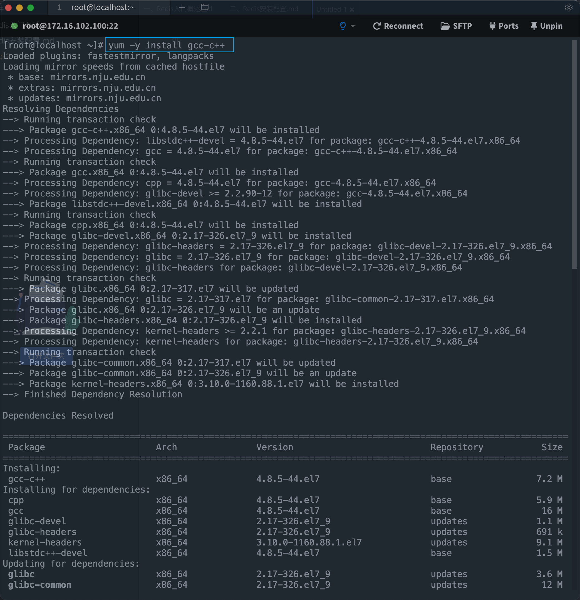

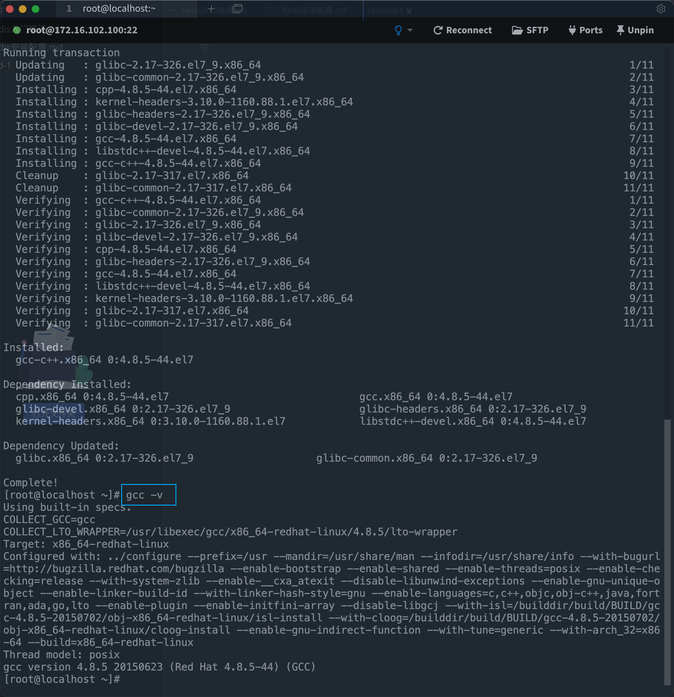

#### 版本选择

> 查看自己redis版本的命令

> 安全Bug按照官网提示，升级成为6.0.8及其以上版本

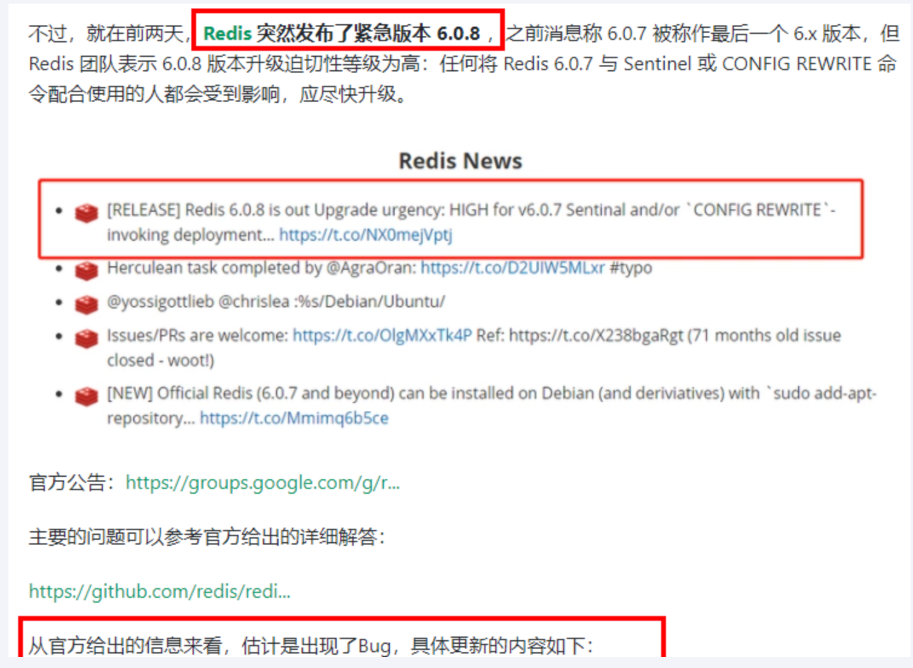

> ***<mark>目前建议都需要升级到6.0.8版本以上</mark>***

> 本次我们使用`Redis7.0`

#### Redis安装步骤

1. 下载获得redis-7.0.0.tar.gz后将它放入我们的Linux目录 `/opt`

> 方式一：下载命令:
> 
> `wget https://download.redis.io/releases/redis-7.0.0.tar.gz`

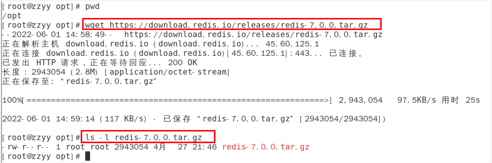

> 方式二：
> 
> 在官网下载然后上传到Linux服务器，注意点：也要放在`/opt`

2. `/opt`目录下解压redis

> tar -zxvf redis-7.0.10.tar.gz

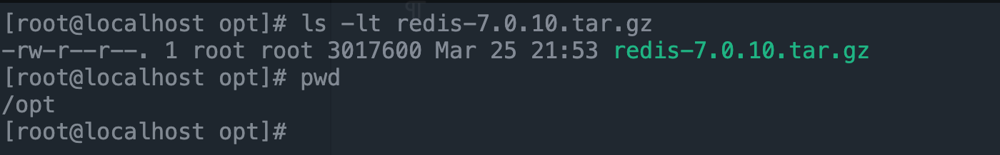

> 解压后

3. 进入目录

> `cd redis-7.0.10`

4. 在redis-7.0.10目录下执行`make`命令

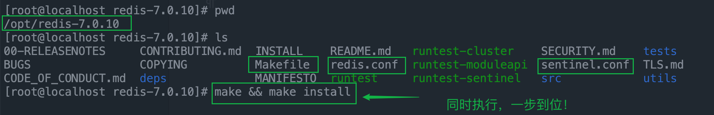

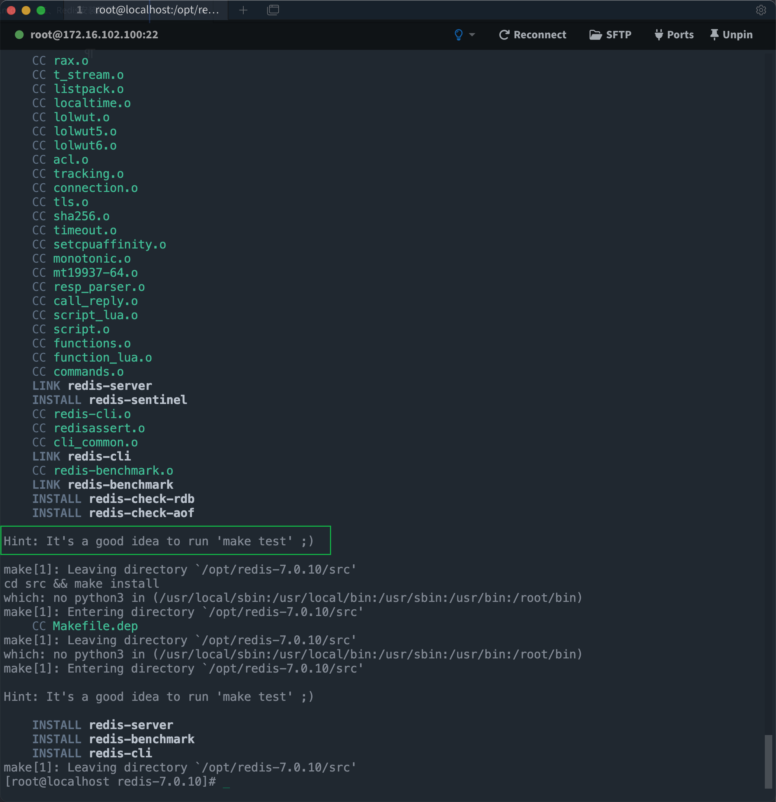

5. 查看默认安装目录： `usr/lcoal/bin`

> Linux下的`/usr/local`类似我们Windows系统的 `C:\Program Files`

> 看装完后查看

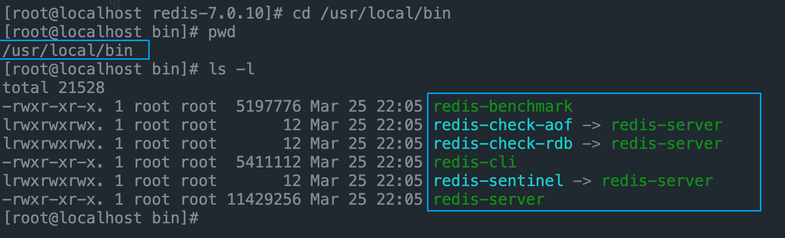

> - `redis-benchmark`：性能测试工具，服务启动后运行该命令，看看自己本子性能如何
> 
> - `redis-check-aof`：修复有问题的`AOF`文件，`rdb`和`aof`后面讲
> 
> - `redis-check-dump`：修复有问题的`dump.rdb`文件
> 
> - `redis-cli`：客户端，操作入口
> 
> - `redis-sentinel`：redis集群使用
> 
> - `redis-server`：Redis服务器启动命令

6. 将默认的`redis.conf`拷贝到自己定义好的一个路径下，比如 /myredis

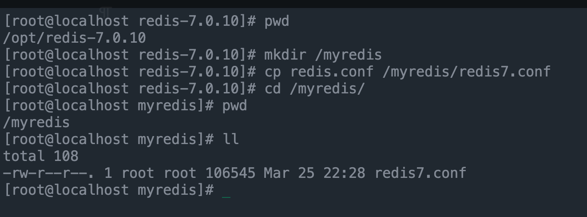

7. 修改 /myredis目录下的redis.conf配置文件做初始化配置

> redis.conf配置文件，改完后确保生效，记得重启，记得重启
> 
>    1 默认daemonize no              改为  daemonize yes
> 
>    2 默认protected-mode  yes    改为  protected-mode no
> 
>    3 默认bind 127.0.0.1             改为  直接注释掉(默认bind 127.0.0.1只能本机访问)或改成本机IP地址，否则影响远程IP连接
> 
>    4 添加redis密码                      改为 requirepass 你自己设置的密码

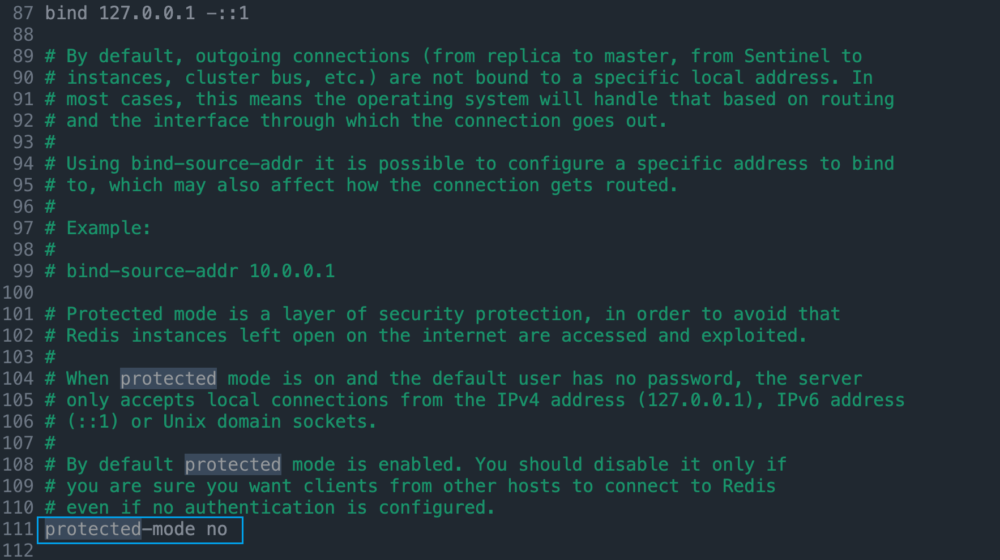

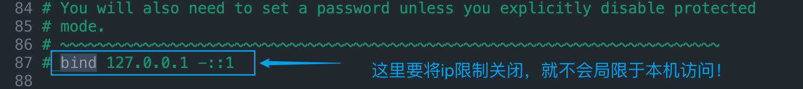

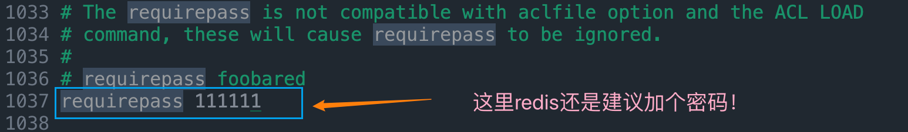

> 操作如下：
> 
> 1. `vim redis7.conf`--->这里只是我的名字更改为redis7.conf
> 
> 2. `:set nu`
> 
> 3. 可以通过`/daemonize`  `/protected-mode`进行寻找,使用n进行切换！
> 
> 4. 最后操作完成直接保存退出！   `:wq`

8. 启动服务

> `/usr/local/bin` 目录下运行`redis-server`，启用/myredis目录下的`redis.conf`文件

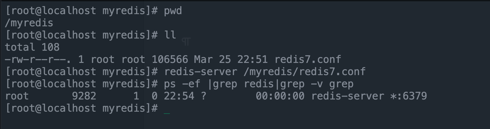

9. 连接服务

> redis-cli连接和“乒乓球”

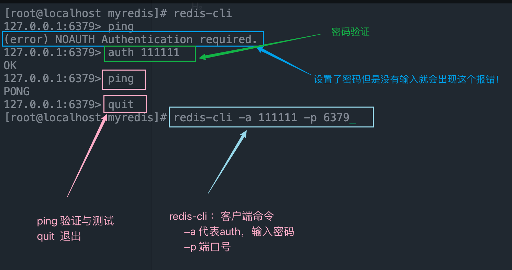

> 备注说明
> 
> Warning: Using a password with '-a' or '-u' option on the command line interface may not be safe.
> 
> 我看着不爽，怎么办？
> 
> warning 这串输出并不是普通输出，
> 
> shell的标准输出包含两种：
> 
> 1（标准输出）
> 
> 2（标准错误）我们的命令，即包含1也包含2，2即是我们想要去除的提示。
> 
> 解决办法将标准错误去除即可，追加2>/dev/null，将标准错误丢弃即可，就没有烦人的警告了。

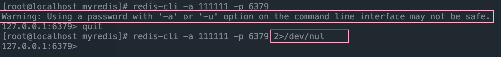

> 如果你不配置Requirepass 就不用密码这一步麻烦

10. 大家知道Redis端口为什么是6379么？

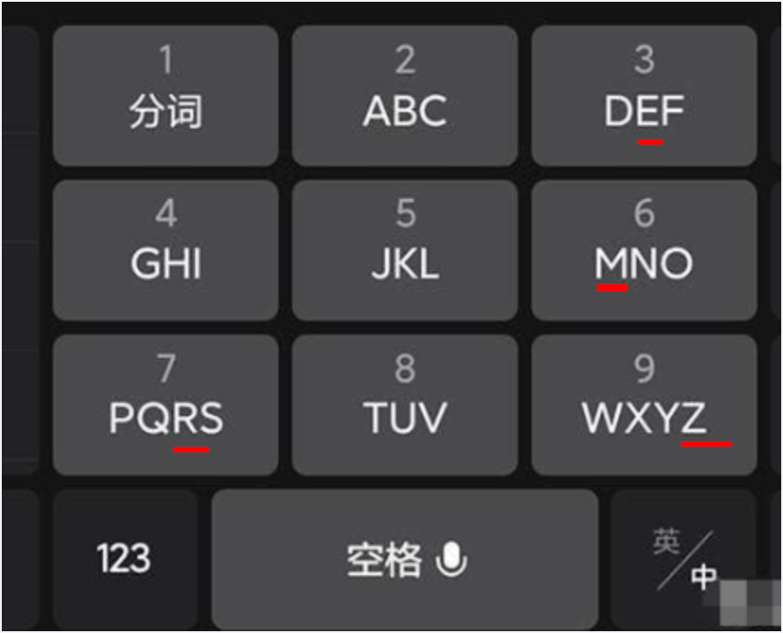

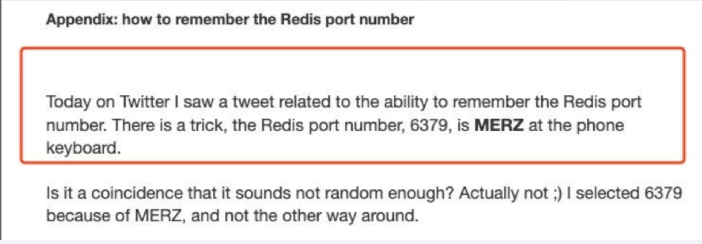

> Redis的默认端口是6379，是由手机键盘字母MERZ的位置决定的。MERZ在Antirez的朋友圈语言中是"愚蠢和傻B"的代名词，它源于意大利广告女郎Alessia Merz在电视节目上说了一堆愚蠢的话，redis之父对她有"特殊"印象，就给她弄成端口号了

11. 永远的helloword

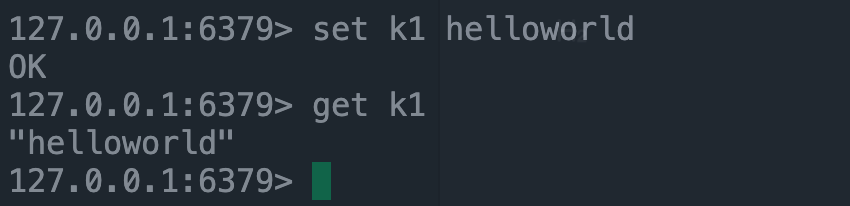

12. 关闭

> 单实例关闭：`redis-cli -a 111111 shutdown`
> 
> 多实例关闭，指定端口：`redis-cli -p 6379 shutdown`

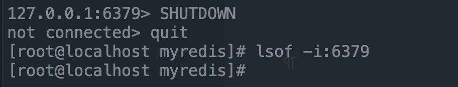

> 如果在redis客户端里面就会直接关闭，没有服务启动了！其他关闭方法如上！

#### Redis7卸载步骤

> 如果你已经下载了redis，但是不是redis7，想要重新重装

> 1. 停止redis-server 服务

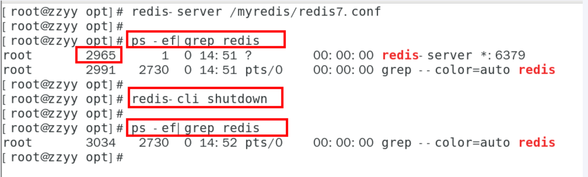

> 2. 删除/usr/local/lib目录下与redis相关的文件

> `ls -l /usr/local/bin/redis-*`
> 
> `rm -rf /usr/local/bin/redis-*`

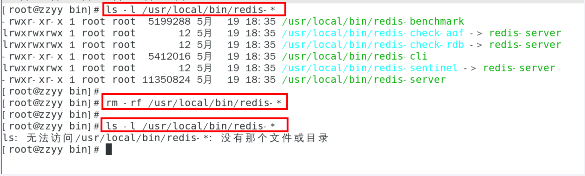

#### docker版的redis安装配置参考

> https://www.bilibili.com/video/BV1gr4y1U7CY?p=39&vd_source=f3f60f7acbef49d38b97c4d660d439fc
