---
# 当前页面内容标题
title: 十、Redis集群（cluster）
# 分类
category:
  - redis
# 标签
tag: 
  - redis
  - NOSQL
  - K,V缓存数据库
  - 非关系型数据库
sticky: false
# 是否收藏在博客主题的文章列表中，当填入数字时，数字越大，排名越靠前。
star: false
# 是否将该文章添加至文章列表中
article: true
# 是否将该文章添加至时间线中
timeline: true
---

## 01、是什么？

### 定义

**由于数据量过大**，单个Master复制集难以承担，因此需要对多个复制集进行集群，形成水平扩展每个复制集只负责存储整个数据集的一部分，这就是Redis的集群，其作用是提供在多个Redis节点间共享数据的程序集。


### 官网

> https://redis.io/docs/reference/cluster-spec/

### 一图

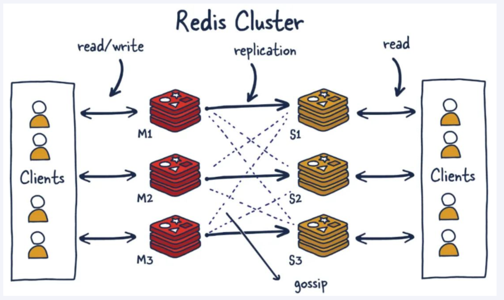

### 一句话

- Redis集群是一个提供在多个Redis节点间共享数据的程序集

- **Redis集群可以支持多个Master**

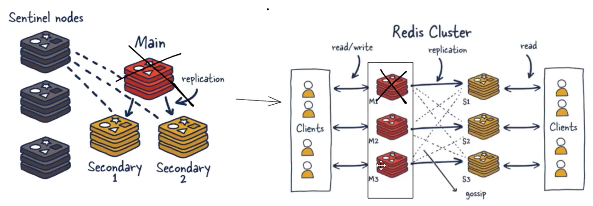

## 02、能干嘛？

Redis集群支持多个master，每个master又可以挂载多个salve

- 读写分离

- 支持数据的高可用

- 支持海量数据的读写存储操作

由于Cluster自带Sentinel的故障转移机制，内置了高可用的支持，`无需再去使用哨兵功能`

客户端与Redis的节点连接，不再需要连接集群中所有的节点，只需要任意连接集群中的一个可用节点即可！

**槽位slot**负责分配到各个物理服务节点，由对应的集群来负责维护节点、插槽和数据之间的关系

## 03、集群算法-分片-槽位slot

### 1、官网出处

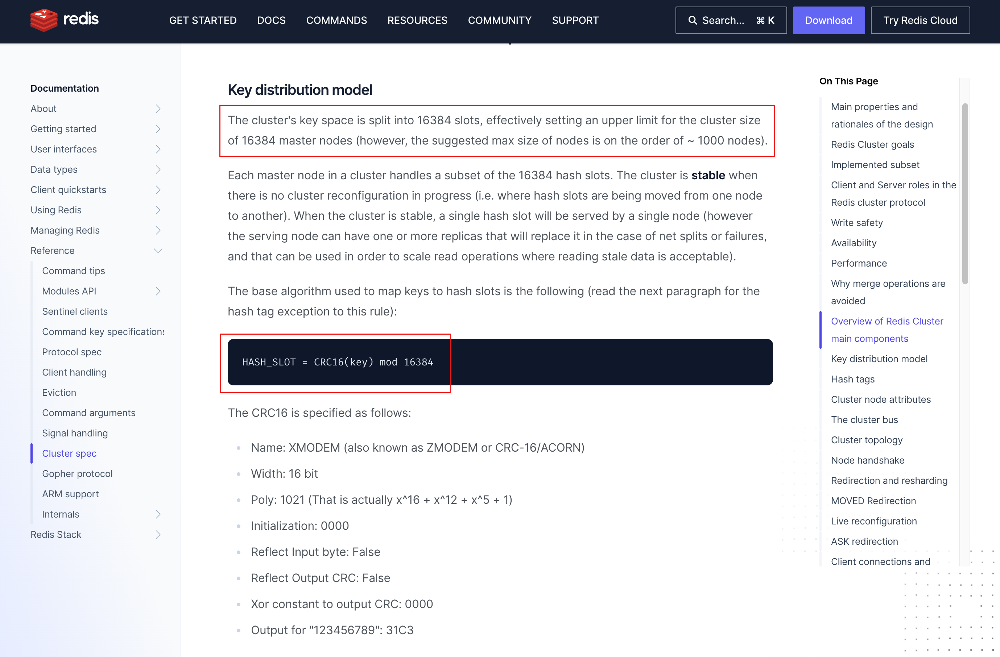

> 翻译说明

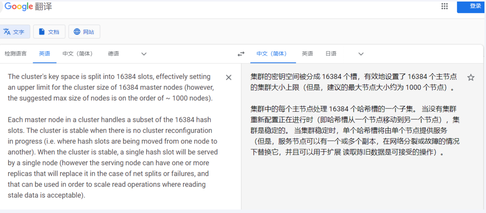

### 2、redis集群的槽位slot

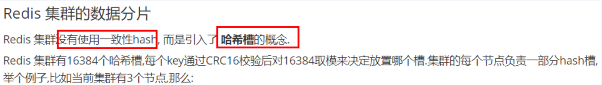

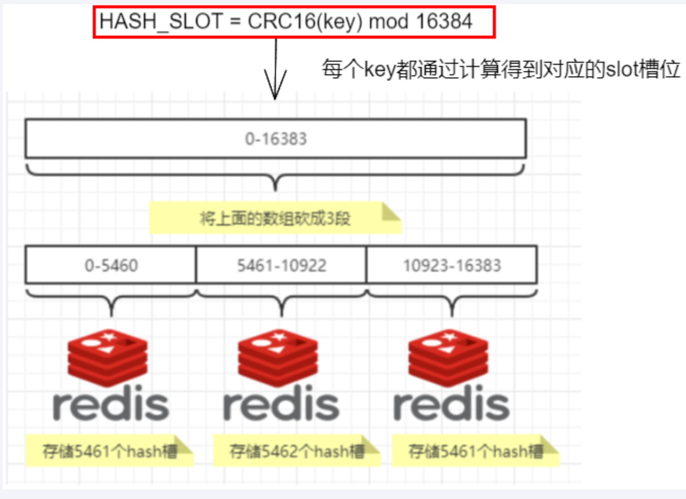

### 3、redis集群的分片

| 分片是什么        | 使用Redis集群时我们会将存储的数据分散到多台redis机器上，这称为分片。简言之，集群中的每个Redis实例都被认为是整个数据的一个分片。                                 |
| ------------ | ------------------------------------------------------------------------------------------------------- |
| 如何找到给定key的分片 | 为了找到给定key的分片，我们对key进行CRC16(key)算法处理并通过对总分片数量取模。然后，使用确定性哈希函数，这意味着给定的key将多次始终映射到同一个分片，我们可以推断将来读取特定key的位置。 |

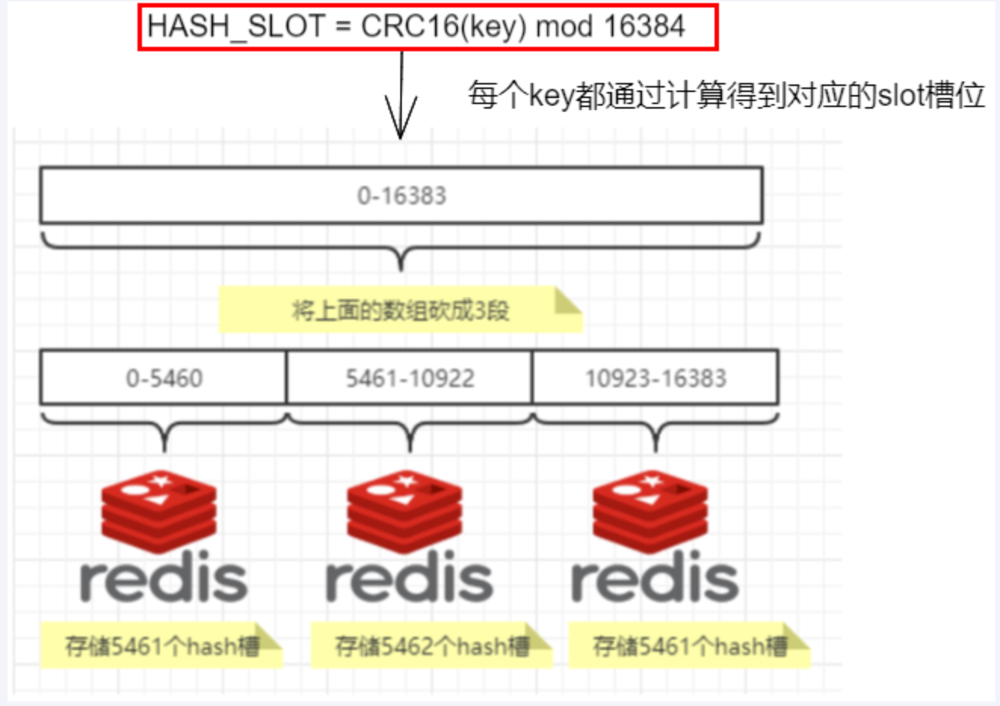

### 4、他两的优势

**最大优势，方便扩缩容和数据分派查找**


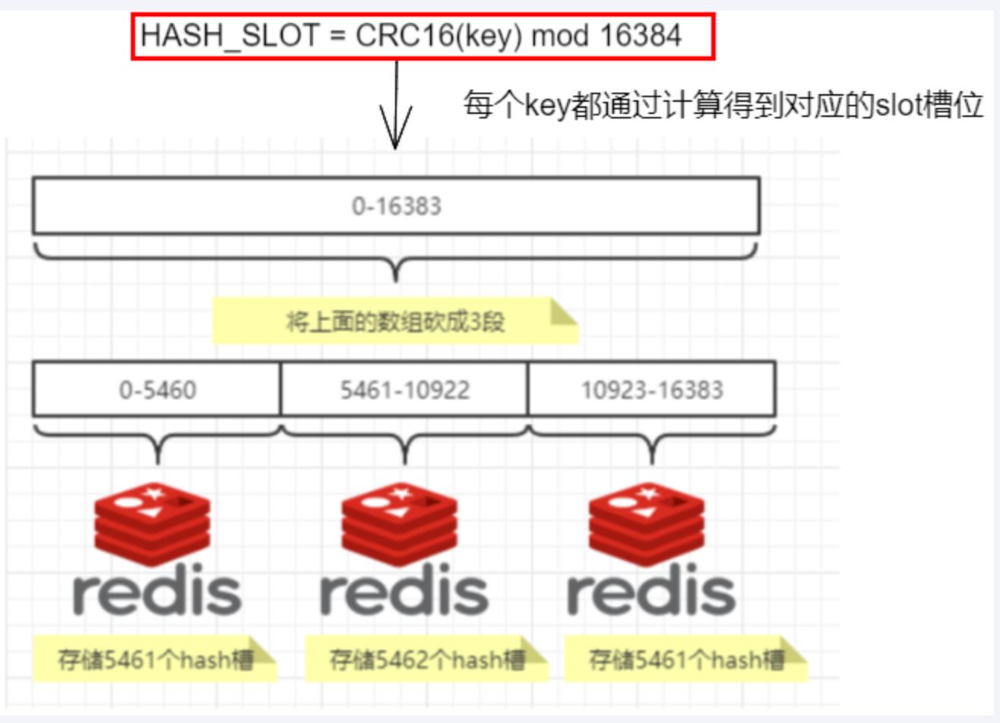

### 5、slot槽位映射，一般业界有3种解决方案

#### 哈希取余分区

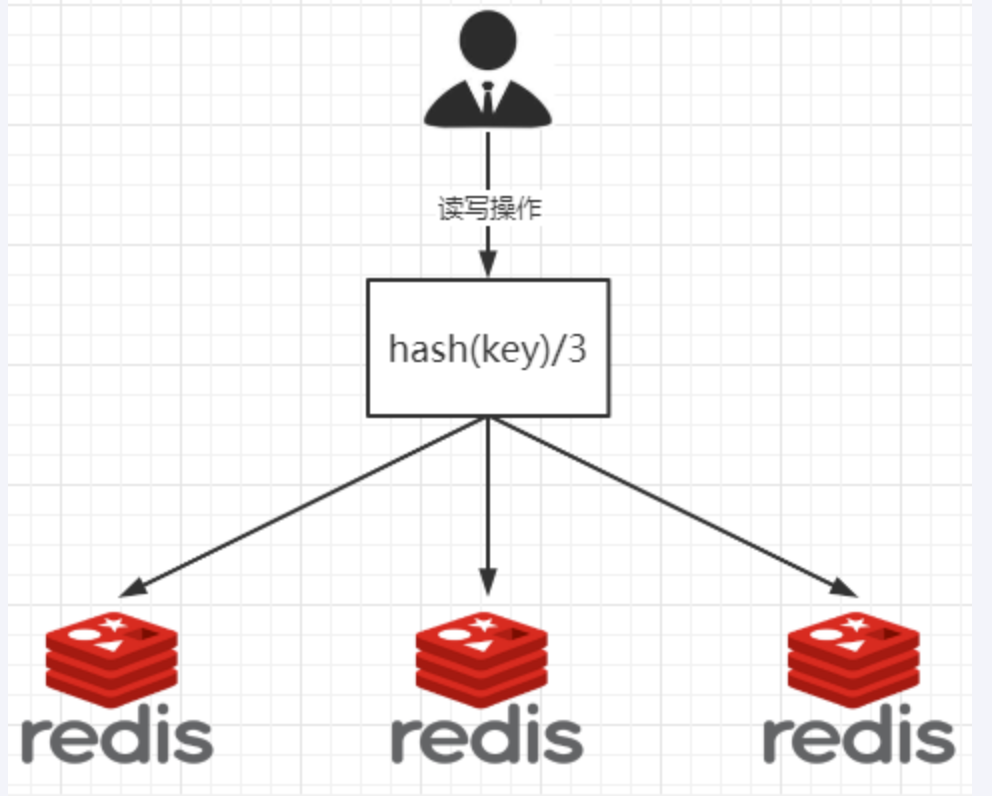

| 2亿条记录就是2亿个k,v，我们单机不行必须要分布式多机，假设有3台机器构成一个集群，用户每次读写操作都是根据公式：<br><br>hash(key) % N个机器台数，计算出哈希值，用来决定数据映射到哪一个节点上。                                                                                                                              |
| ----------------------------------------------------------------------------------------------------------------------------------------------------------------------------------------------------------------------------------------- |
| 优点：<br><br>  简单粗暴，直接有效，只需要预估好数据规划好节点，例如3台、8台、10台，就能保证一段时间的数据支撑。使用Hash算法让固定的一部分请求落到同一台服务器上，这样每台服务器固定处理一部分请求（并维护这些请求的信息），起到负载均衡+分而治之的作用。                                                                                                    |
| 缺点：<br><br>   原来规划好的节点，进行扩容或者缩容就比较麻烦了额，不管扩缩，每次数据变动导致节点有变动，映射关系需要重新进行计算，在服务器个数固定不变时没有问题，如果需要弹性扩容或故障停机的情况下，原来的取模公式就会发生变化：Hash(key)/3会变成Hash(key) /?。此时地址经过取余运算的结果将发生很大变化，根据公式获取的服务器也会变得不可控。<br><br>某个redis机器宕机了，由于台数数量变化，会导致hash取余全部数据重新洗牌。 |

缺点那？？？


| 缺点：                                                                                                                                                                                                                         |
| --------------------------------------------------------------------------------------------------------------------------------------------------------------------------------------------------------------------------- |
| 原来规划好的节点，进行扩容或者缩容就比较麻烦了额，不管扩缩，每次数据变动导致节点有变动，映射关系需要重新进行计算，在服务器个数固定不变时没有问题，如果需要弹性扩容或故障停机的情况下，原来的取模公式就会发生变化：Hash(key)/3会变成Hash(key) /?。此时地址经过取余运算的结果将发生很大变化，根据公式获取的服务器也会变得不可控。<br><br>某个redis机器宕机了，由于台数数量变化，会导致hash取余全部数据重新洗牌。 |

#### 一致性哈希算法分区

1. 是什么？

一致性Hash算法背景

一致性哈希算法在1997年由麻省理工学院中提出的，设计目标是为了解决

分布式缓存数据变动和映射问题，某个机器宕机了，分母数量改变了，自然取余数不OK了。

2. 能干嘛？

提出一致性Hash解决方案。目的是当服务器个数发生变动时，尽量减少影响客户端到服务端的映射关系

3. 3大步骤
- 算法构建一致性哈希环

**一致性哈希环**

        一致性哈希算法必然有个hash函数并按照算法产生hash值，这个算法的所有可能哈希值会构成一个全量集，这个集合可以成为一个hash空间[0,2^32-1]，这个是一个线性空间，但是在算法中，我们通过适当的逻辑控制将它首尾相连(0 = 2^32),这样让它逻辑上形成了一个环形空间。

       它也是按照使用取模的方法，`前面笔记介绍的节点取模法是对节点（服务器）的数量进行取模。而一致性Hash算法是对2^32取模`，简单来说，`一致性Hash算法将整个哈希值空间组织成一个虚拟的圆环`，如假设某哈希函数H的值空间为0-2^32-1（即哈希值是一个32位无符号整形），整个哈希环如下图：整个空间`按顺时针方向组织`，圆环的正上方的点代表0，0点右侧的第一个点代表1，以此类推，2、3、4、……直到2^32-1，也就是说0点左侧的第一个点代表2^32-1， 0和2^32-1在零点中方向重合，我们把这个由2^32个点组成的圆环称为Hash环。

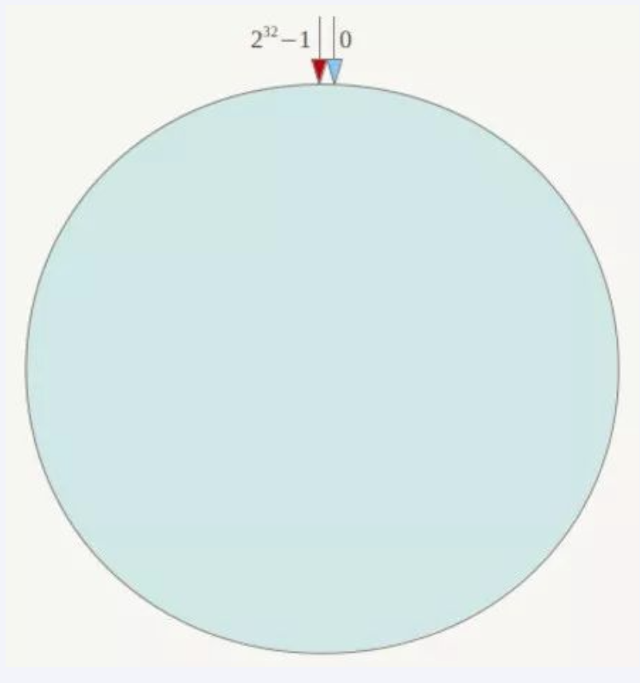


- redis服务器IP节点映射

节点映射

       将集群中各个IP节点映射到环上的某一个位置。

       将各个服务器使用Hash进行一个哈希，具体可以选择服务器的IP或主机名作为关键字进行哈希，这样每台机器就能确定其在哈希环上的位置。假如4个节点NodeA、B、C、D，经过IP地址的哈希函数计算(hash(ip))，使用IP地址哈希后在环空间的位置如下：

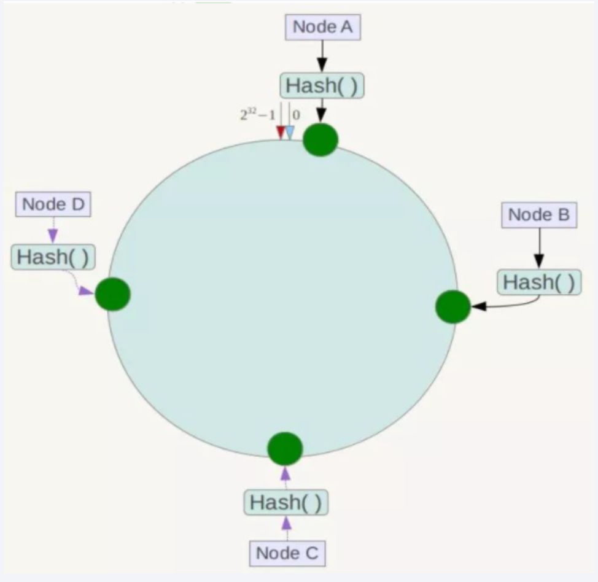

- key落到服务器的落键规则

当我们需要存储一个kv键值对时，首先计算key的hash值，hash(key)，将这个key使用相同的函数Hash计算出哈希值并确定此数据在环上的位置，**从此位置沿环顺时针“行走”**，第一台遇到的服务器就是其应该定位到的服务器，并将该键值对存储在该节点上。

如我们有Object A、Object B、Object C、Object D四个数据对象，经过哈希计算后，在环空间上的位置如下：根据一致性Hash算法，数据A会被定为到Node A上，B被定为到Node B上，C被定为到Node C上，D被定为到Node D上。

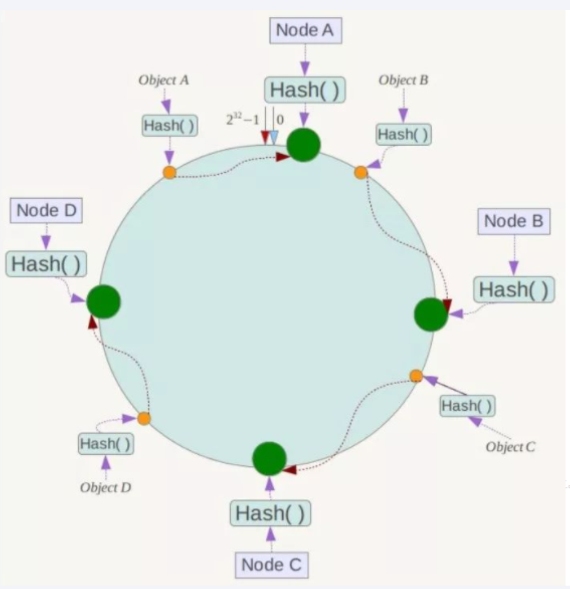

4. 优点
- 一致性哈希算法的**容错性**

**容错性**

假设Node C宕机，可以看到此时对象A、B、D不会受到影响。一般的，在一致性Hash算法中，如果一台服务器不可用，则受影响的数据仅仅是此服务器到其环空间中前一台服务器（即沿着逆时针方向行走遇到的第一台服务器）之间数据，其它不会受到影响。简单说，就是C挂了，受到影响的只是B、C之间的数据且这些数据会转移到D进行存储。

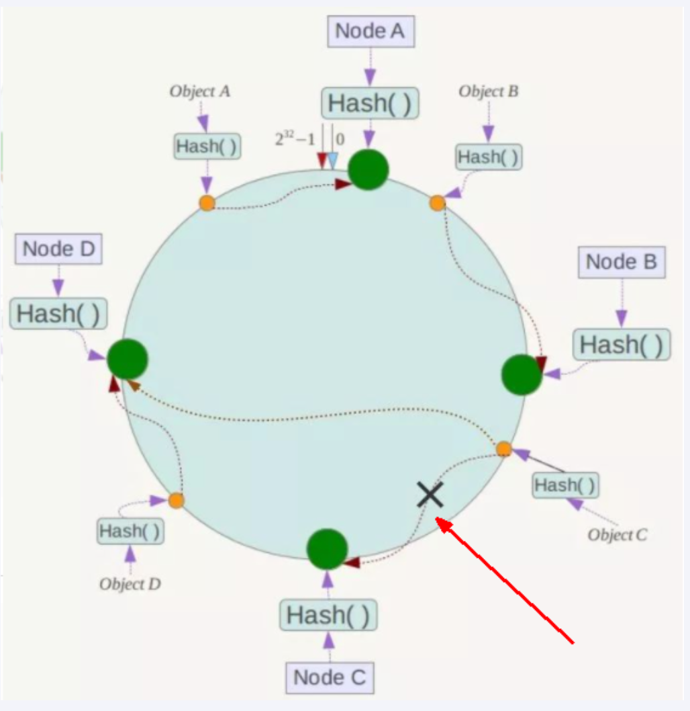

- 一致性哈希算法的**扩展性**

 扩展性

数据量增加了，需要增加一台节点NodeX，X的位置在A和B之间，那收到影响的也就是A到X之间的数据，重新把A到X的数据录入到X上即可，

不会导致hash取余全部数据重新洗牌。


5. 缺点

一致性哈希算法的数据倾斜问题

Hash环的数据倾斜问题

一致性Hash算法在服务**节点太少时**，容易因为节点分布不均匀而造成**数据倾斜**（被缓存的对象大部分集中缓存在某一台服务器上）问题，

例如系统中只有两台服务器：

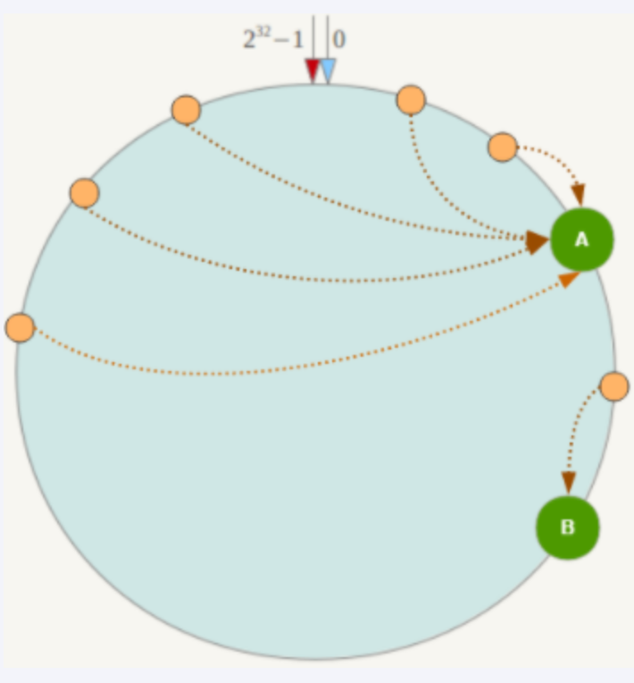

6. 小总结

为了在节点数目发生改变时尽可能少的迁移数据

将所有的存储节点排列在收尾相接的Hash环上，每个key在计算Hash后会顺时针找到临近的存储节点存放。

而当有节点加入或退出时仅影响该节点在Hash环上顺时针相邻的后续节点。  

优点

加入和删除节点只影响哈希环中顺时针方向的相邻的节点，对其他节点无影响。

缺点 

数据的分布和节点的位置有关，因为这些节点不是均匀的分布在哈希环上的，所以数据在进行存储时达不到均匀分布的效果。

#### 哈希槽分区

> 是什么？

1 为什么出现


哈希槽实质就是一个数组，数组[0,2^14 -1]形成hash slot空间。

2 能干什么

解决均匀分配的问题，在数据和节点之间又加入了一层，把这层称为哈希槽（slot），用于管理数据和节点之间的关系，现在就相当于节点上放的是槽，槽里放的是数据。

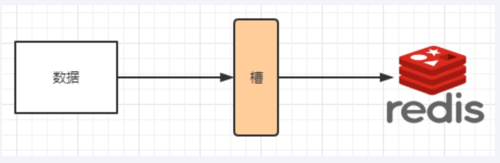

槽解决的是粒度问题，相当于把粒度变大了，这样便于数据移动。哈希解决的是映射问题，使用key的哈希值来计算所在的槽，便于数据分配

3 多少个hash槽

一个集群只能有16384个槽，编号0-16383（0-2^14-1）。这些槽会分配给集群中的所有主节点，分配策略没有要求。

集群会记录节点和槽的对应关系，解决了节点和槽的关系后，接下来就需要对key求哈希值，然后对16384取模，余数是几key就落入对应的槽里。HASH_SLOT = CRC16(key) mod 16384。以槽为单位移动数据，因为槽的数目是固定的，处理起来比较容易，这样数据移动问题就解决了。

`HASH_SLOT=CRC16(key) mod 16384`

> 哈希槽计算

Redis 集群中内置了 16384 个哈希槽，redis 会根据节点数量大致均等的将哈希槽映射到不同的节点。当需要在 Redis 集群中放置一个 key-value时，redis先对key使用crc16算法算出一个结果然后用结果对16384求余数[ CRC16(key) % 16384]，这样每个 key 都会对应一个编号在 0-16383 之间的哈希槽，也就是映射到某个节点上。如下代码，key之A 、B在Node2， key之C落在Node3上

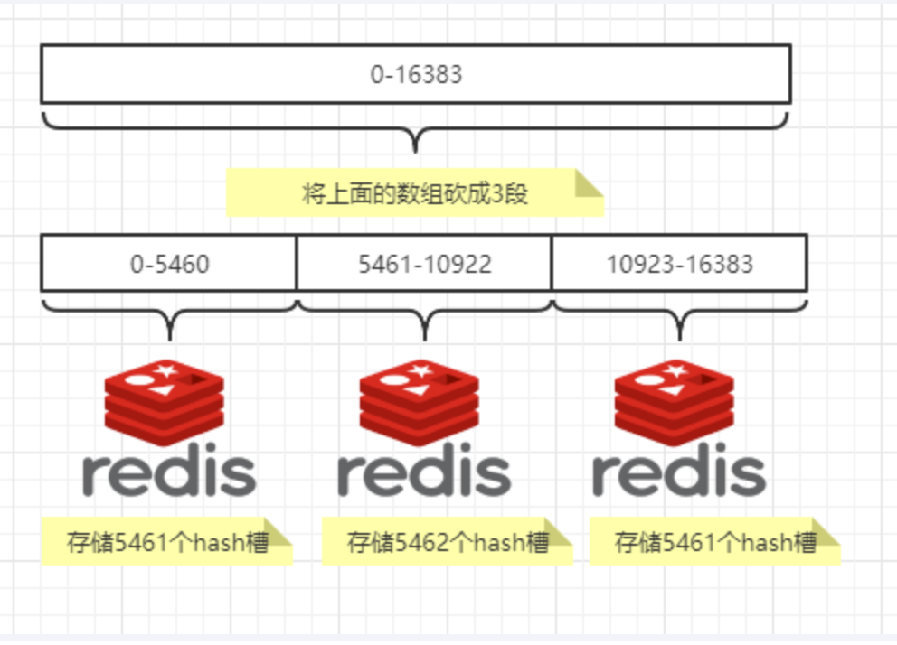

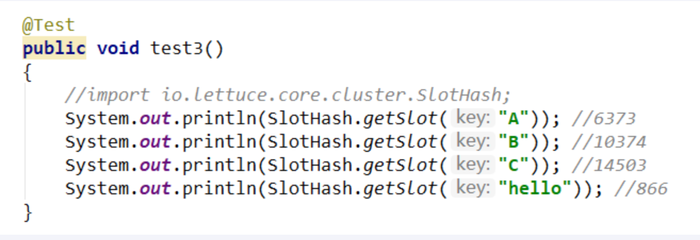

### 6、经典面试题--为什么redis集群的最大槽数是16384个？

- 为什么redis集群的最大槽数是16384个？

Redis集群并没有使用一致性hash而是引入了哈希槽的概念。Redis 集群有16384个哈希槽，每个key通过CRC16校验后对16384取模来决定放置哪个槽，集群的每个节点负责一部分hash槽。但为什么哈希槽的数量是16384（2^14）个呢？

CRC16算法产生的hash值有16bit，该算法可以产生2^16=65536个值。

换句话说值是分布在0~65535之间，有更大的65536不用为什么只用16384就够？

作者在做mod运算的时候，为什么不mod65536，而选择mod16384？  HASH_SLOT = CRC16(key) mod 65536为什么没启用

> https://github.com/redis/redis/issues/2576

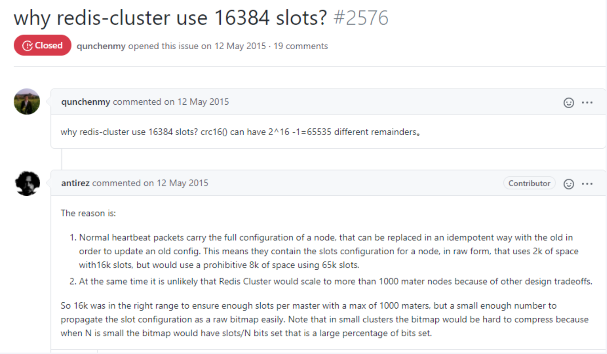

- 说明1

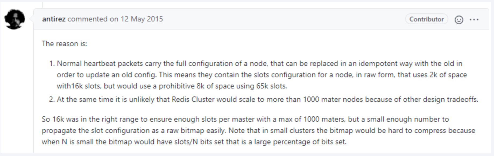

正常的心跳数据包带有节点的完整配置，可以用幂等方式用旧的节点替换旧节点，以便更新旧的配置。

这意味着它们包含原始节点的插槽配置，该节点使用2k的空间和16k的插槽，但是会使用8k的空间（使用65k的插槽）。

同时，由于其他设计折衷，Redis集群不太可能扩展到1000个以上的主节点。

因此16k处于正确的范围内，以确保每个主机具有足够的插槽，最多可容纳1000个矩阵，但数量足够少，可以轻松地将插槽配置作为原始位图传播。请注意，在小型群集中，位图将难以压缩，因为当N较小时，位图将设置的slot / N位占设置位的很大百分比。

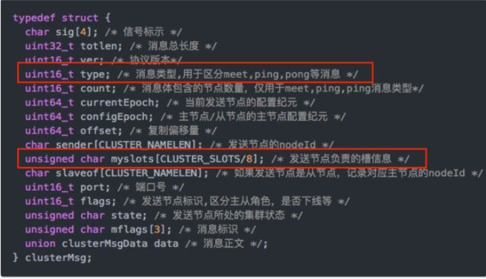

- 说明2

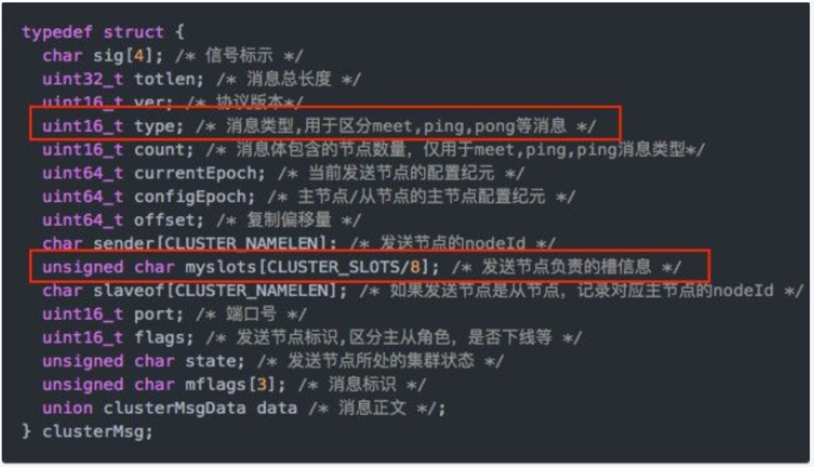

(1)如果槽位为65536，发送心跳信息的消息头达8k，发送的心跳包过于庞大。

在消息头中最占空间的是myslots[CLUSTER_SLOTS/8]。 当槽位为65536时，这块的大小是: 65536÷8÷1024=8kb 

在消息头中最占空间的是myslots[CLUSTER_SLOTS/8]。 当槽位为16384时，这块的大小是: 16384÷8÷1024=2kb 

因为每秒钟，redis节点需要发送一定数量的ping消息作为心跳包，如果槽位为65536，这个ping消息的消息头太大了，浪费带宽。

(2)redis的集群主节点数量基本不可能超过1000个。

集群节点越多，心跳包的消息体内携带的数据越多。如果节点过1000个，也会导致网络拥堵。因此redis作者不建议redis cluster节点数量超过1000个。 那么，对于节点数在1000以内的redis cluster集群，16384个槽位够用了。没有必要拓展到65536个。

(3)槽位越小，节点少的情况下，压缩比高，容易传输

Redis主节点的配置信息中它所负责的哈希槽是通过一张bitmap的形式来保存的，在传输过程中会对bitmap进行压缩，但是如果bitmap的填充率slots / N很高的话(N表示节点数)，bitmap的压缩率就很低。 如果节点数很少，而哈希槽数量很多的话，bitmap的压缩率就很低。

- 计算结论

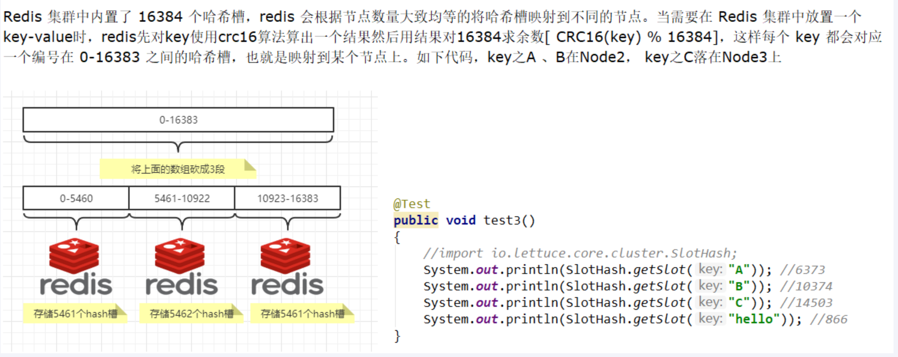

### 7、Redis集群不保证强一致性，这意味着在特定的可能丢掉一些被系统收到的写入请求命令

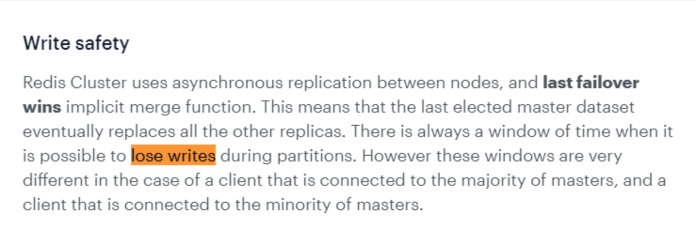

## 04、集群环境案例步骤

### 1、3主3从redis集群配置

#### 找3台真实虚拟机，各自新建

`mkdir -p /myredis/cluster`

#### 新建6个独立的redis实例服务

1. 本次案例设计说明（ip会有变化）

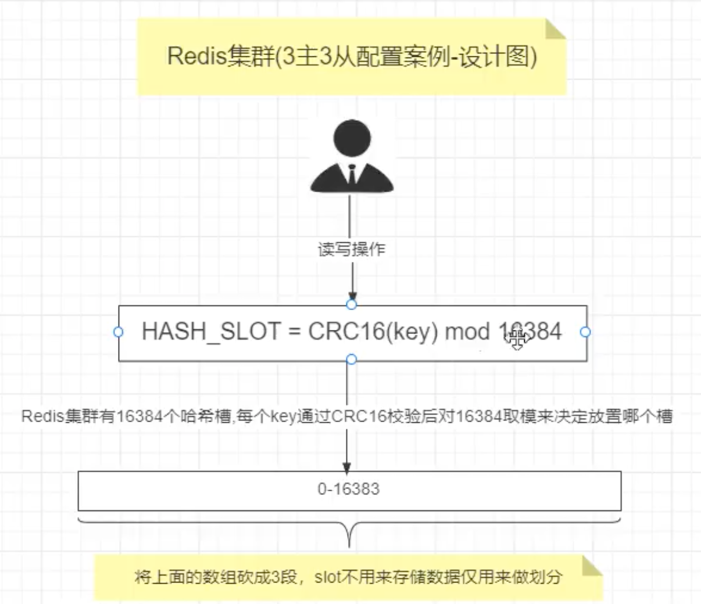

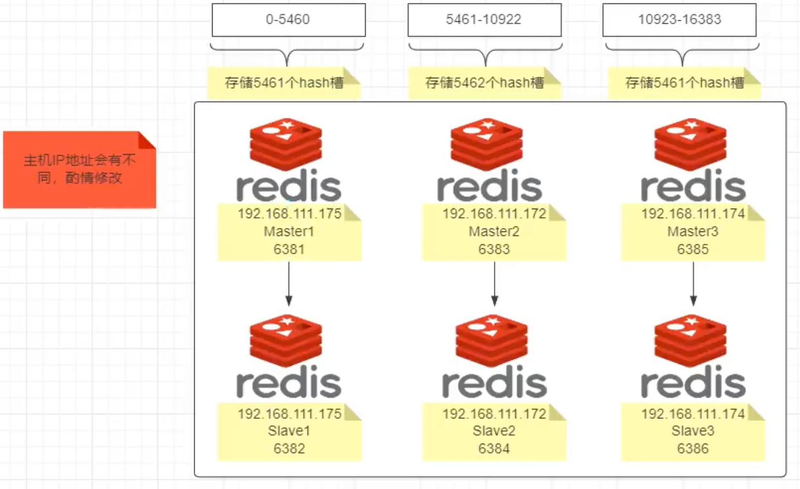

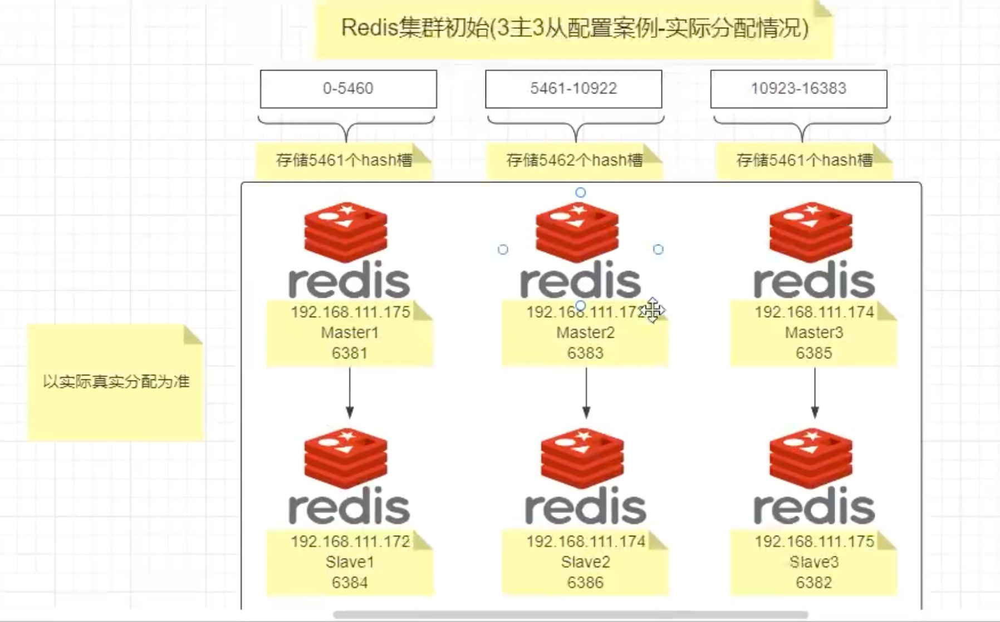

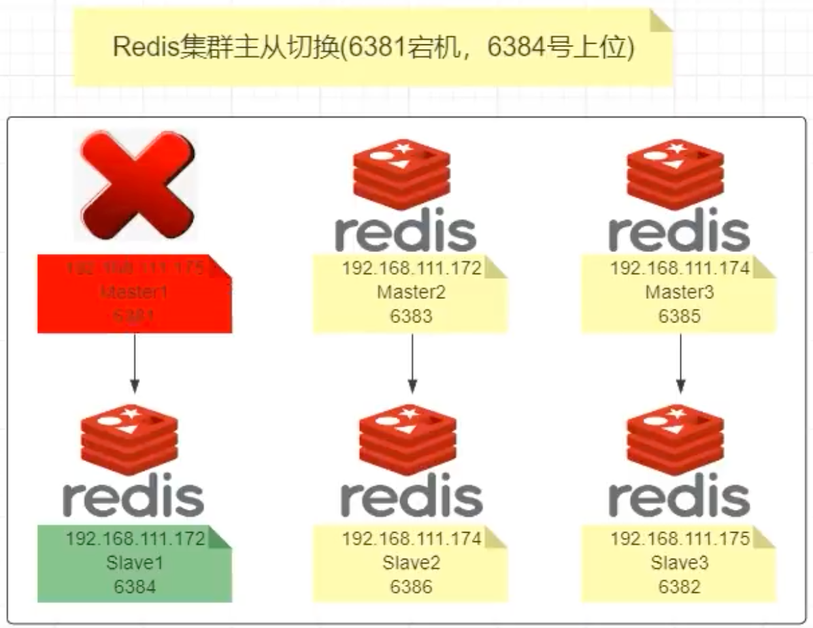

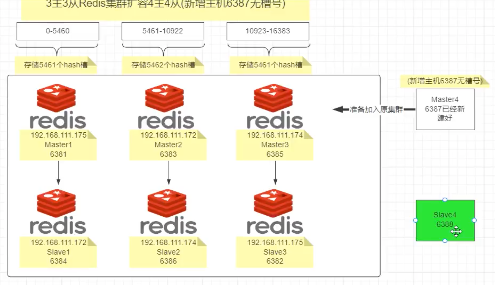

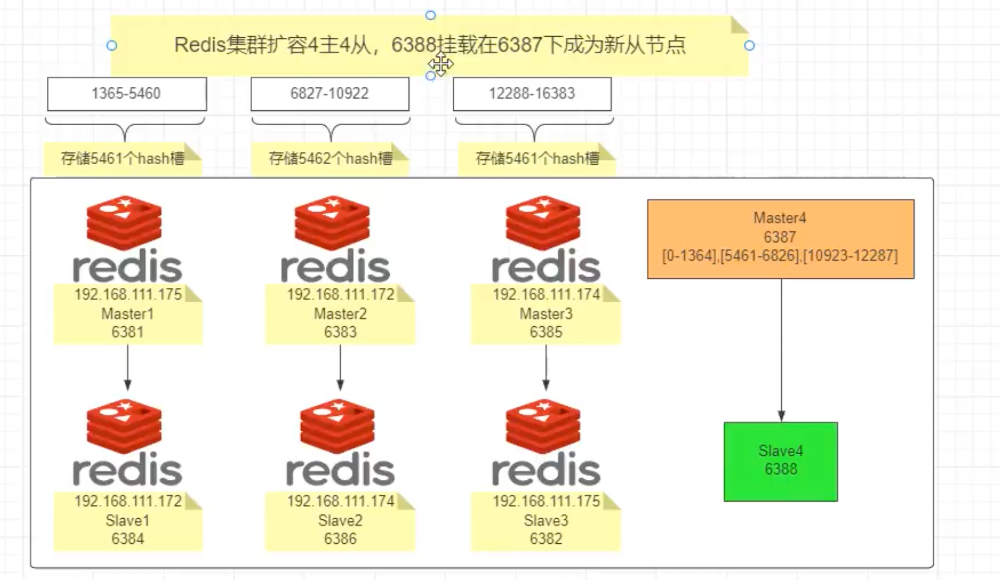


2. IP：192.168.111.175+端口6381/端口6382

> vim /myredis/cluster/redisCluster6381.conf

```textile
bind 0.0.0.0
daemonize yes
protected-mode no
port 6381
logfile "/myredis/cluster/cluster6381.log"
pidfile /myredis/cluster6381.pid
dir /myredis/cluster
dbfilename dump6381.rdb
appendonly yes
appendfilename "appendonly6381.aof"
requirepass 111111
masterauth 111111
 
cluster-enabled yes
cluster-config-file nodes-6381.conf
cluster-node-timeout 5000
```

> vim /myredis/cluster/redisCluster6382.conf

```textile
bind 0.0.0.0
daemonize yes
protected-mode no
port 6382
logfile "/myredis/cluster/cluster6382.log"
pidfile /myredis/cluster6382.pid
dir /myredis/cluster
dbfilename dump6382.rdb
appendonly yes
appendfilename "appendonly6382.aof"
requirepass 111111
masterauth 111111
 
cluster-enabled yes
cluster-config-file nodes-6382.conf
cluster-node-timeout 5000
```

3. IP：192.168.111.172+端口6383/端口6384

> vim /myredis/cluster/redisCluster6383.conf

```textile
bind 0.0.0.0
daemonize yes
protected-mode no
port 6383
logfile "/myredis/cluster/cluster6383.log"
pidfile /myredis/cluster6383.pid
dir /myredis/cluster
dbfilename dump6383.rdb
appendonly yes
appendfilename "appendonly6383.aof"
requirepass 111111
masterauth 111111

cluster-enabled yes
cluster-config-file nodes-6383.conf
cluster-node-timeout 5000
```

> vim /myredis/cluster/redisCluster6384.conf

```textile
bind 0.0.0.0
daemonize yes
protected-mode no
port 6384
logfile "/myredis/cluster/cluster6384.log"
pidfile /myredis/cluster6384.pid
dir /myredis/cluster
dbfilename dump6384.rdb
appendonly yes
appendfilename "appendonly6384.aof"
requirepass 111111
masterauth 111111
 
cluster-enabled yes
cluster-config-file nodes-6384.conf
cluster-node-timeout 5000
```

4. IP：192.168.111.174+端口6385/端口6386

> vim /myredis/cluster/redisCluster6385.conf

```textile
bind 0.0.0.0
daemonize yes
protected-mode no
port 6385
logfile "/myredis/cluster/cluster6385.log"
pidfile /myredis/cluster6385.pid
dir /myredis/cluster
dbfilename dump6385.rdb
appendonly yes
appendfilename "appendonly6385.aof"
requirepass 111111
masterauth 111111
 
cluster-enabled yes
cluster-config-file nodes-6385.conf
cluster-node-timeout 5000
```

> vim /myredis/cluster/redisCluster6386.conf

```textile
bind 0.0.0.0
daemonize yes
protected-mode no
port 6385
logfile "/myredis/cluster/cluster6385.log"
pidfile /myredis/cluster6385.pid
dir /myredis/cluster
dbfilename dump6385.rdb
appendonly yes
appendfilename "appendonly6385.aof"
requirepass 111111
masterauth 111111
 
cluster-enabled yes
cluster-config-file nodes-6385.conf
cluster-node-timeout 5000
```

5. 启动6台redis主机实例
- `redis-server /myredis/cluster/redisCluster6381.conf`

- 。。。。。。

- `redis-server /myredis/cluster/redisCluster6386.conf`

#### 通过redis-cli命令为6台机器构建集群关系

> `构建主从关系命令`

//注意，注意，注意自己的真实IP地址     //注意，注意，注意自己的真实IP地址

**redis-cli -a 111111** **--cluster create** **--cluster-replicas 1** **192.168.111.175:6381 192.168.111.175:6382 192.168.111.172:6383 192.168.111.172:6384 192.168.111.174:6385 192.168.111.174:6386**

--cluster-replicas 1 表示为每个master创建一个slave节点

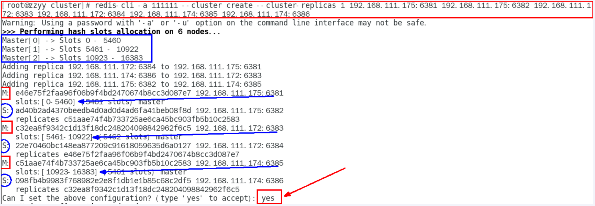

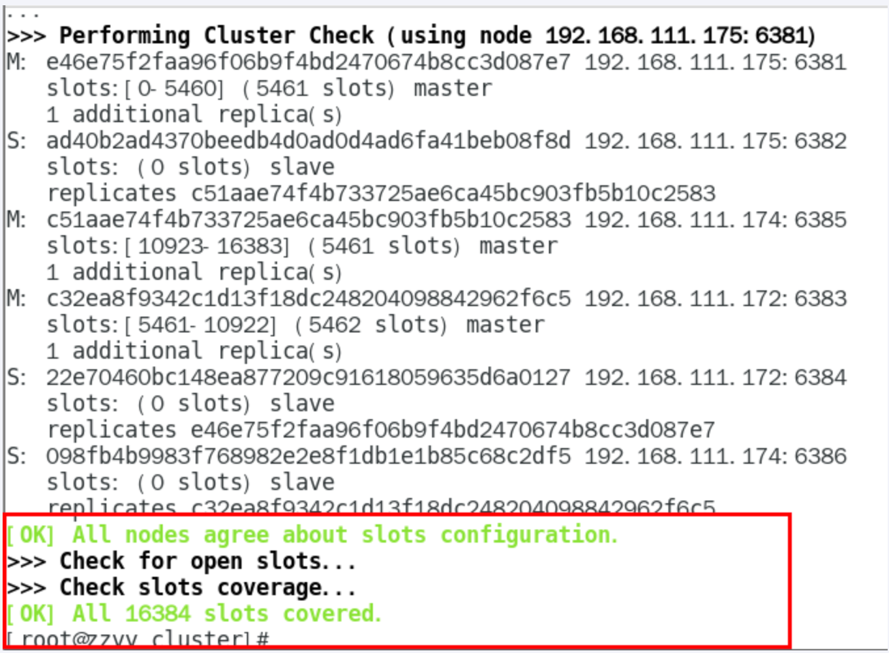

> 一切OK的话，3主3从搞定

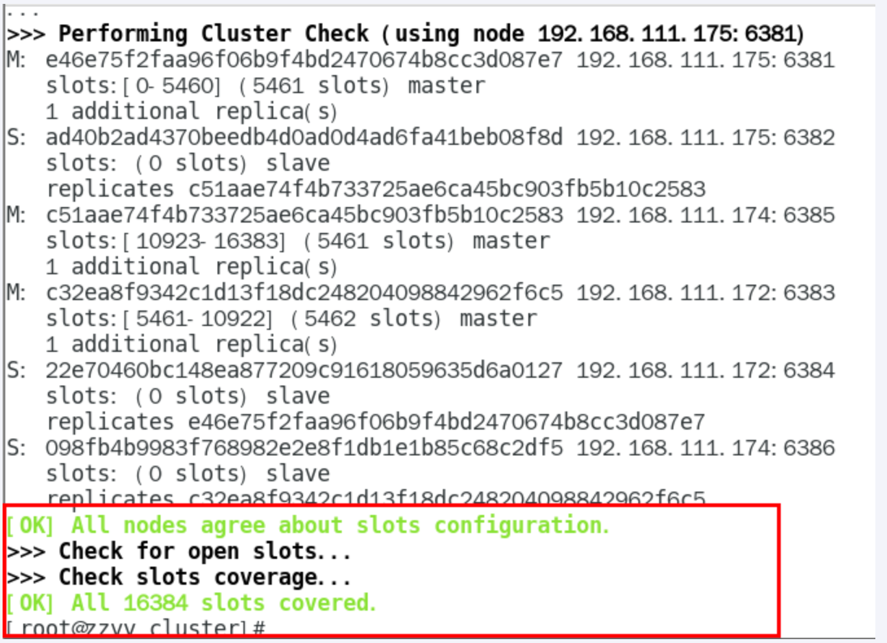

#### 连接进入6381作为切入点，**查看并检验集群状态**

- 连接进入6381作为切入点，**查看节点状态**

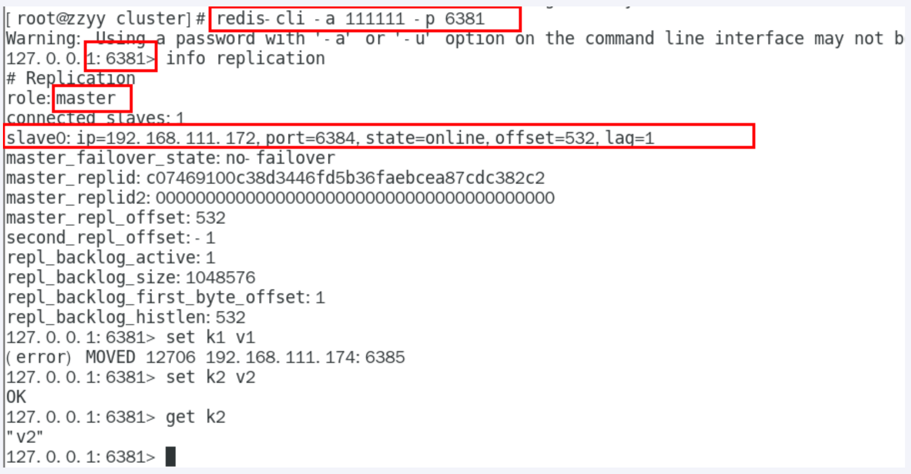


- info replication

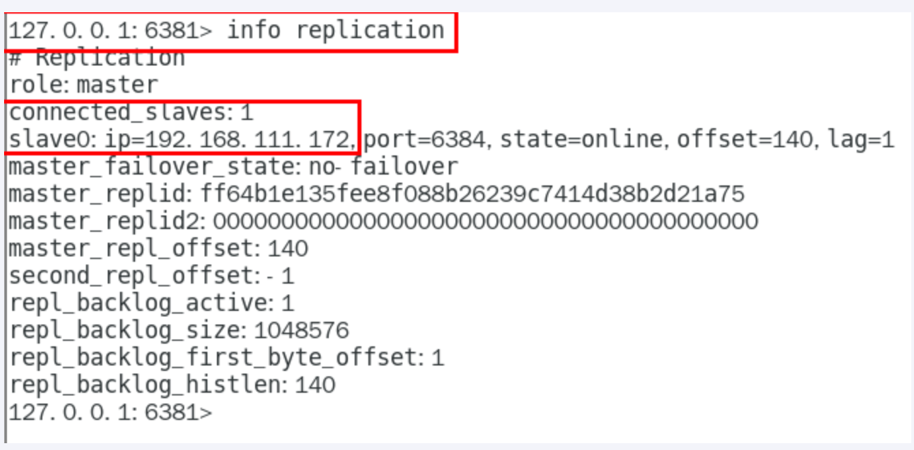

- cluster info

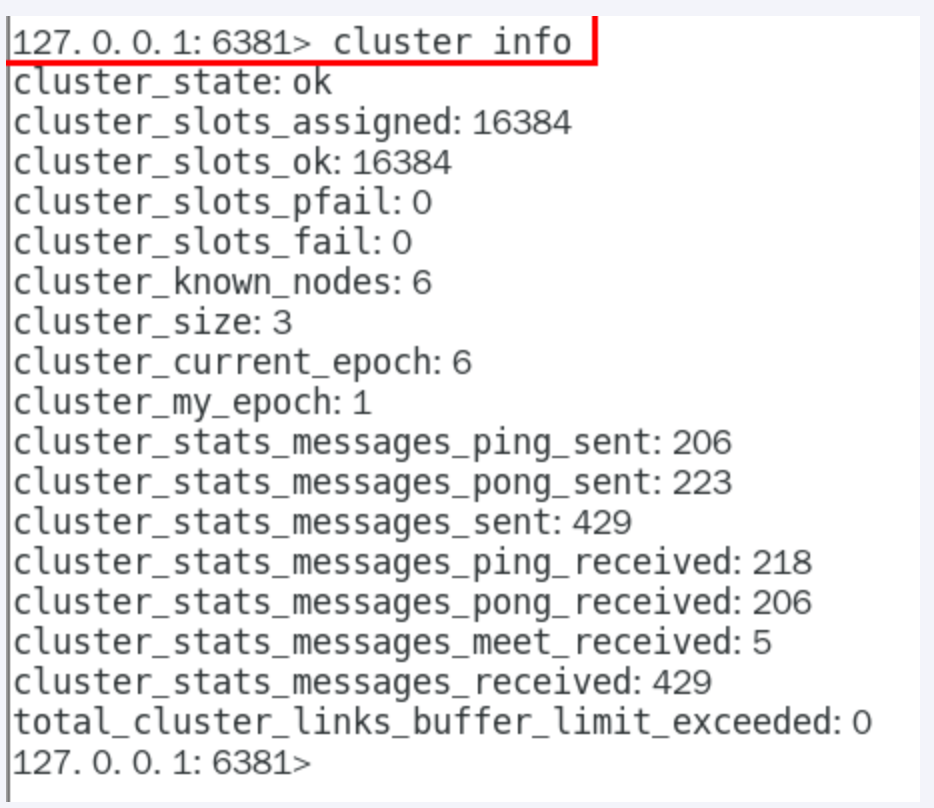

- cluster nodes


### 2、3主3从redis集群读写

- 对6381新增两个key，看看效果如何

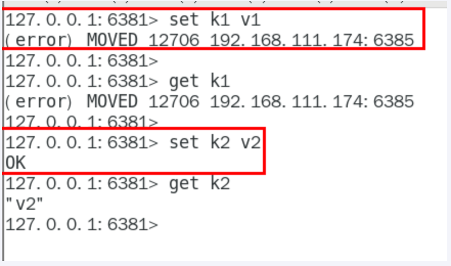

- 为什么报错

**一定注意槽位的范围区间，需要路由到位，路由到位，路由到位，路由到位**

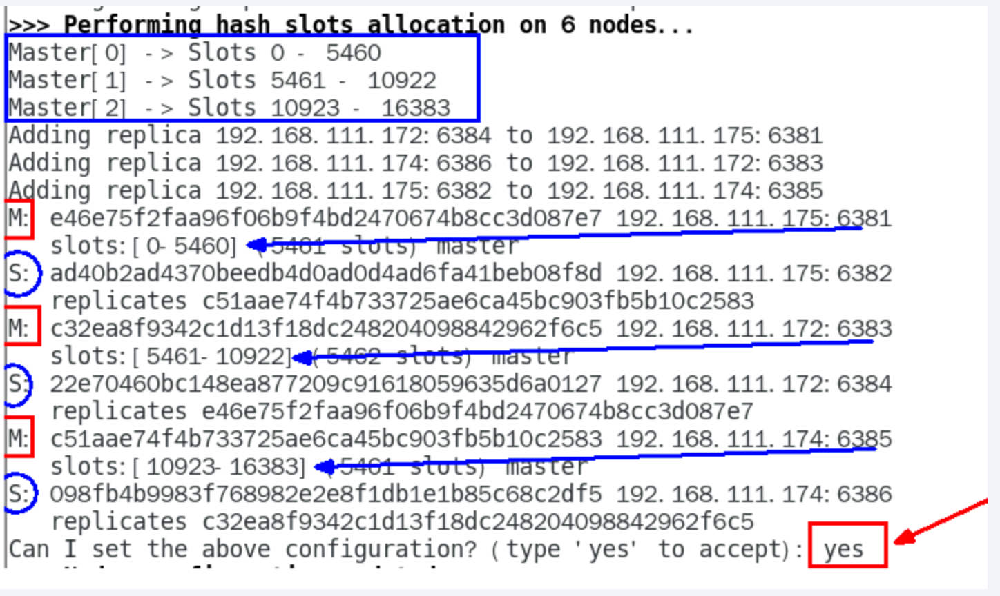

- 如何解决？

防止路由失效加参数`-c`并新增两个key

`加入参数-c，优化路由`

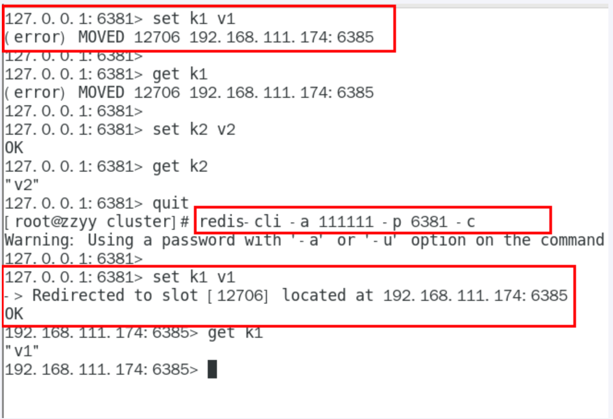

- 查看集群信息

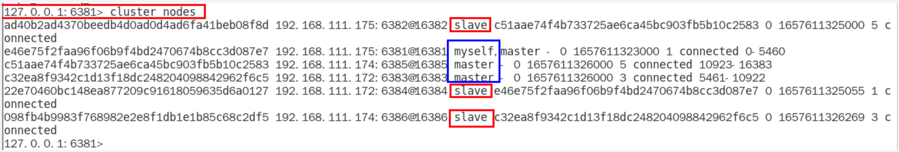

- 查看某个key该属于对应的槽位值    CLUSTER KEYSLOT 键名称

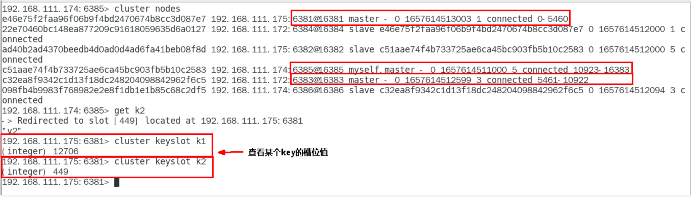

### 3、主从容错切换迁移案例

1. 容错切换迁移
- 主6381和从机切换，先停止主机6381

6381主机停了，对应的真实从机上位

6381作为1号主机分配的从机以实际情况为准，具体是几号机器就是几号

- 再次查看集群信息，本次6381主6384从

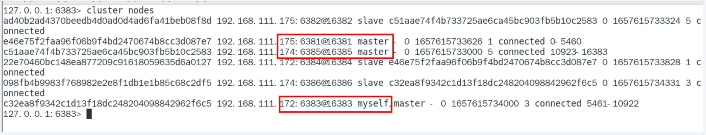

6381master假如宕机了，6384是否会上位成为了新的master?

- 停止主机6381，再次查看集群信息

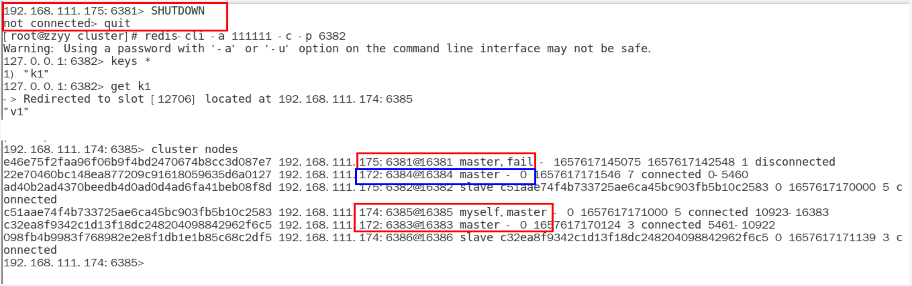

6381宕机了，6384上位成为了新的master。

`备注：本次脑图笔记6381为主下面挂从6384。每次案例下面挂的从机以实际情况为准，具体是几号机器就是几号`

> 6384成功上位并正常使用

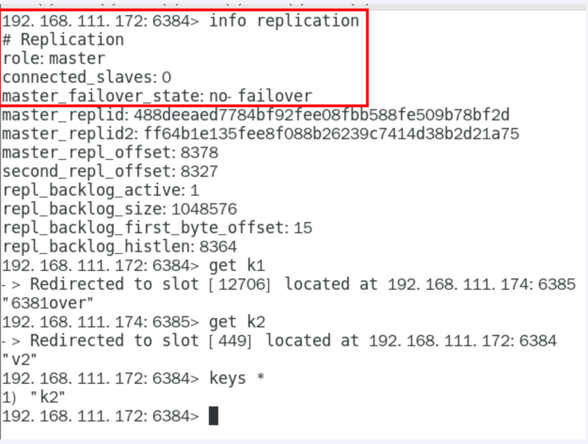

- 随后，6381原来的主机回来了，是否会上位？

> 恢复前

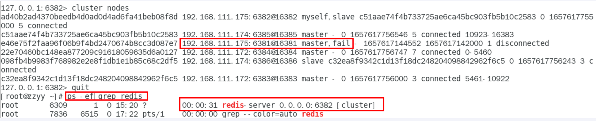

> 恢复后

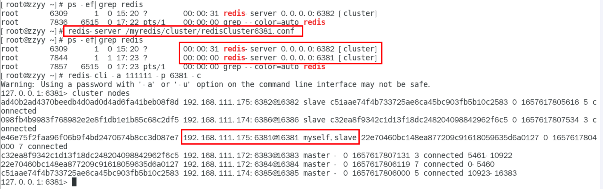

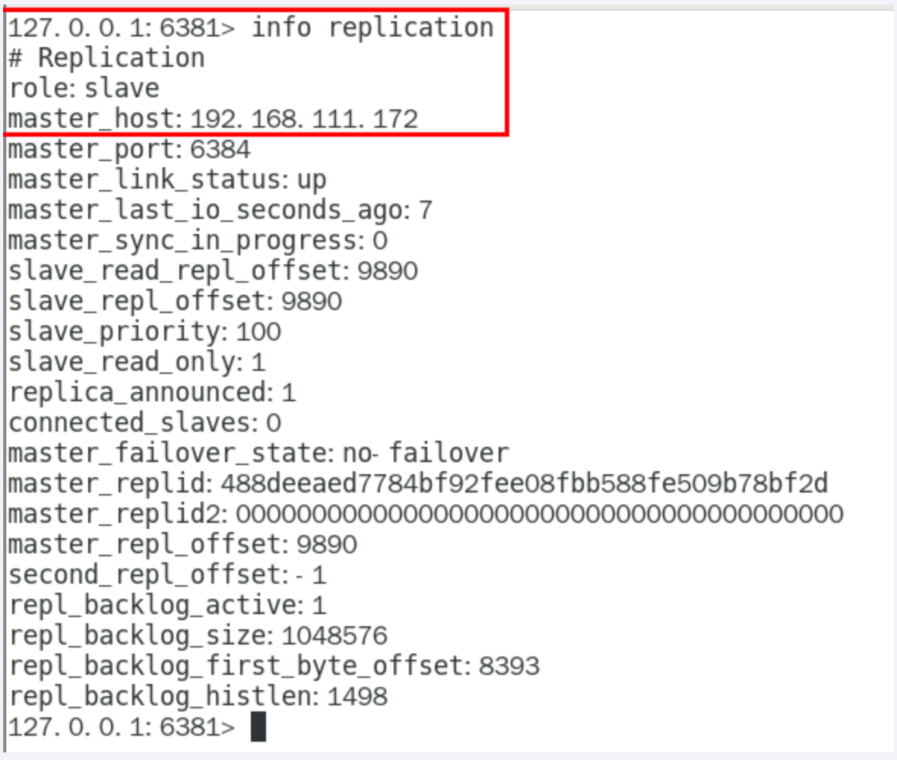

> 6381不会上位并以从节点形式回归

2. 集群不保证数据一致性100%OK，一定会有数据丢失情况

Redis集群不保证强一致性，这意味着在特定的条件下，Redis集群可能会丢掉一些被系统收到的写入请求命令

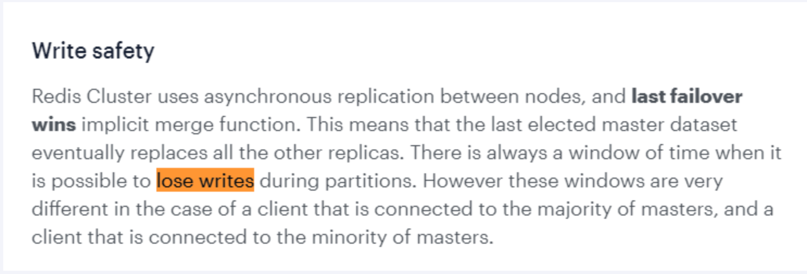

3. 手动故障转移or节点从属调整该如何处理
- 上面一换后6381、6384主从对调了，和原来设计图不一样了，该如何

- 重新登录6381机器

- 常用命令

> `CLUSTER FAILOVER`

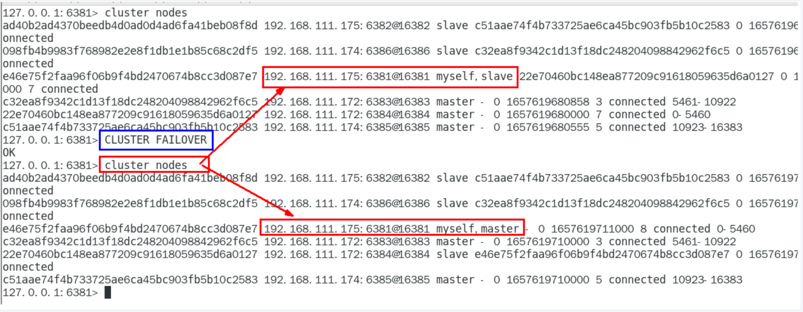

### 4、主从扩容案例

1. 新建6387/6388两个服务实例配置文件+新建后启动
- IP：192.168.111.174+端口6387/端口6388

> vim /myredis/cluster/redisCluster6387.conf

```textile
bind 0.0.0.0
daemonize yes
protected-mode no
port 6387
logfile "/myredis/cluster/cluster6387.log"
pidfile /myredis/cluster6387.pid
dir /myredis/cluster
dbfilename dump6387.rdb
appendonly yes
appendfilename "appendonly6387.aof"
requirepass 111111
masterauth 111111

cluster-enabled yes
cluster-config-file nodes-6387.conf
cluster-node-timeout 5000
```

> vim /myredis/cluster/redisCluster6388.conf

```textile
bind 0.0.0.0
daemonize yes
protected-mode no
port 6388
logfile "/myredis/cluster/cluster6388.log"
pidfile /myredis/cluster6388.pid
dir /myredis/cluster
dbfilename dump6388.rdb
appendonly yes
appendfilename "appendonly6388.aof"
requirepass 111111
masterauth 111111
 
cluster-enabled yes
cluster-config-file nodes-6388.conf
cluster-node-timeout 5000
```

2. 启动87/88两个新的节点实例，此时他们自己都是master


- redis-server /myredis/cluster/redisCluster6387.conf

- redis-server /myredis/cluster/redisCluster6388.conf
3. 将新增的6387节点（空槽号）作为master节点加入原集群

```textile
将新增的6387作为master节点加入原有集群

redis-cli -a 密码 --cluster add-node 自己实际IP地址:6387 自己实际IP地址:6381

6387 就是将要作为master新增节点

6381 就是原来集群节点里面的领路人，相当于6387拜拜6381的码头从而找到组织加入集群

redis-cli -a 111111  --cluster add-node 192.168.111.174:6387 192.168.111.175:6381

```

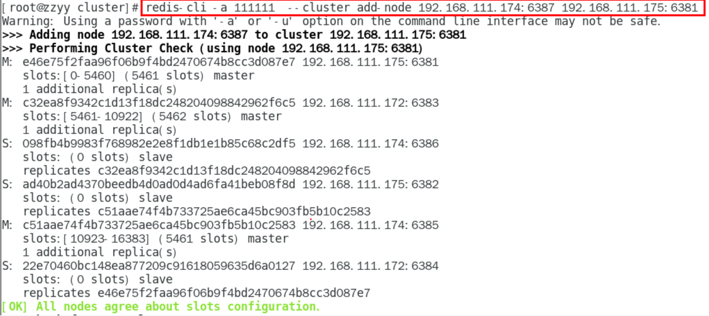

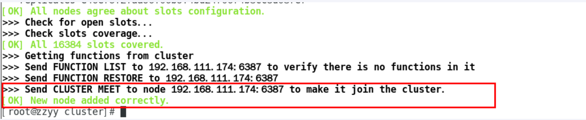

4. 检查集群情况第1次

```shell
redis-cli -a 密码 --cluster check 真实ip地址:6381

redis-cli -a 111111 --cluster check 192.168.111.175:6381
```


5. 重新分配槽号（`reshard`）

```textile
重新分派槽号
命令:redis-cli -a 密码 --cluster reshard IP地址:端口号
redis-cli -a 密码 --cluster reshard 192.168.111.175:6381
```


6. 检查集群情况第2次

```shell
redis-cli --cluster check 真实ip地址:6381
 
redis-cli -a 111111 --cluster check 192.168.111.175:6381
```


> 槽号分派说明

为什么6387是3个新的区间，以前的还是连续？

重新分配成本太高，所以前3家各自匀出来一部分，从6381/6383/6385三个旧节点分别匀出1364个坑位给新节点6387


7. 为主节点6387分配从节点6388

```shell
命令：redis-cli -a 密码 --cluster add-node ip:新slave端口 ip:新master端口 --cluster-slave --cluster-master-id 新主机节点ID
 
redis-cli -a 111111 --cluster add-node 192.168.111.174:6388 192.168.111.174:6387 --cluster-slave --cluster-master-id 4feb6a7ee0ed2b39ff86474cf4189ab2a554a40f-------这个是6387的编号，按照自己实际情况
```


8. 检查集群情况第3次

```shell
redis-cli --cluster check 真实ip地址:6381
 
redis-cli -a 111111 --cluster check 192.168.111.175:6381
```


### 5、主从缩容案例

1. 目的：6387和6388下线


2. 检查集群情况第一次，先获得从节点6388的节点ID

```shell
redis-cli -a 密码 --cluster check 192.168.111.174:6388
```


3. 从集群中删除4号从节点6388

```shell
命令：redis-cli -a 密码 --cluster del-node ip:从机端口 从机6388节点ID
 
redis-cli -a 111111 --cluster del-node 192.168.111.174:6388 218e7b8b4f81be54ff173e4776b4f4faaf7c13da
```


```shell
redis-cli -a 111111 --cluster check 192.168.111.174:6385
```

 **检查一下发现，6388被删除了，只剩下7台机器了。**


4. 将6387的槽号清空，重新分配，本例将清出来的槽号都给6381

```shell
redis-cli -a 111111 --cluster reshard 192.168.111.175:6381
```


5. 检查集群情况第二次

```shell
redis-cli -a 111111 --cluster check 192.168.111.175:6381
 
4096个槽位都指给6381，它变成了8192个槽位，相当于全部都给6381了，不然要输入3次，一锅端
```


6. 将6387删除

```shell
命令：redis-cli -a 密码 --cluster del-node ip:端口 6387节点ID
 
redis-cli -a 111111 --cluster del-node 192.168.111.174:6387 4feb6a7ee0ed2b39ff86474cf4189ab2a554a40f
```


7. 检查集群情况第三次，6387/6388被彻底祛除

```shell
redis-cli -a 111111 --cluster check 192.168.111.175:6381
```


## 05、集群常用操作命令和CRC16算法分析

不在同一个slot槽位下的多键操作支持不好，通过占位符登场


| 不在同一个slot槽位下的键值无法使用mset、mget等多键操作                                     |
| --------------------------------------------------------------------- |
| 可以通过{}来定义同一个组的概念，使key中{}内相同内容的键值对放到一个slot槽位去，对照下图类似k1k2k3都映射为x，自然槽位一样 |


Redis集群有16384个哈希槽，每个key通过CRC16校验后对16384取模来决定防置哪个槽。

集群的每个节点负责一部分hash槽

> CRC16源码浅谈

**cluster.c源码分析一下看看**


### 常用命令

- 集群是否完整才能对外提供服务


| 默认YES，现在集群架构是3主3从的redis cluster由3个master平分16384个slot，每个master的小集群负责1/3的slot，对应一部分数据。<br><br>cluster-require-full-coverage： 默认值 yes , 即需要集群完整性，方可对外提供服务 通常情况，如果这3个小集群中，任何一个（1主1从）挂了，你这个集群对外可提供的数据只有2/3了， 整个集群是不完整的， redis 默认在这种情况下，是不会对外提供服务的。 |
| --------------------------------------------------------------------------------------------------------------------------------------------------------------------------------------------------------------------------------------------- |
| 如果你的诉求是，集群不完整的话也需要对外提供服务，需要将该参数设置为no ，这样的话你挂了的那个小集群是不行了，但是其他的小集群仍然可以对外提供服务。                                                                                                                                                                   |

> cluster-require-full-coverage

- CLUSTER COUNTKEYSINSLOT 槽位数字编号

> 1，该槽位被占用
> 
> 0，该槽位没占用

- CLUSTER KEYSLOT 键名称

> 该键应该存在哪个槽位上


