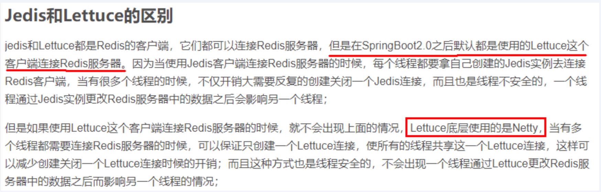
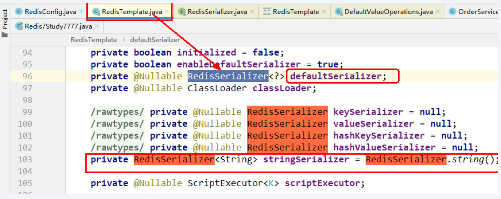
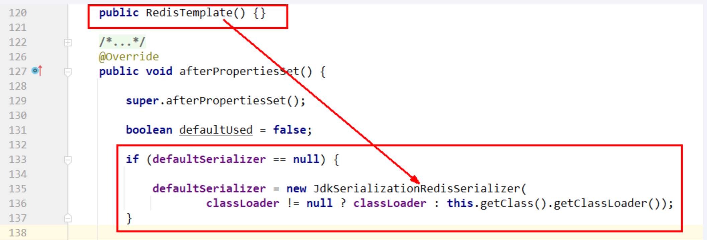
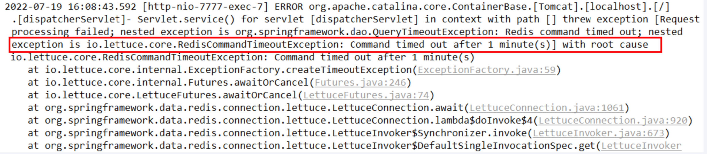
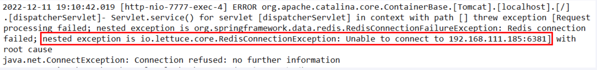
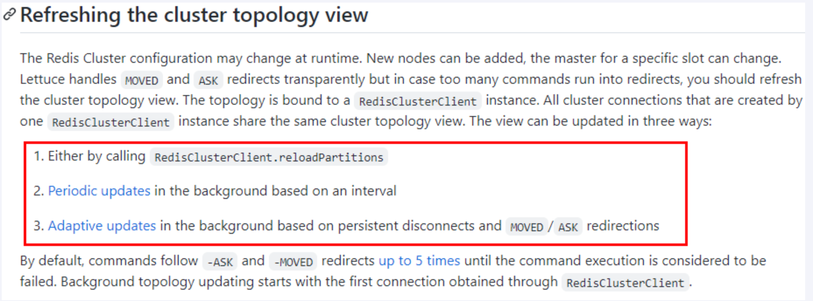
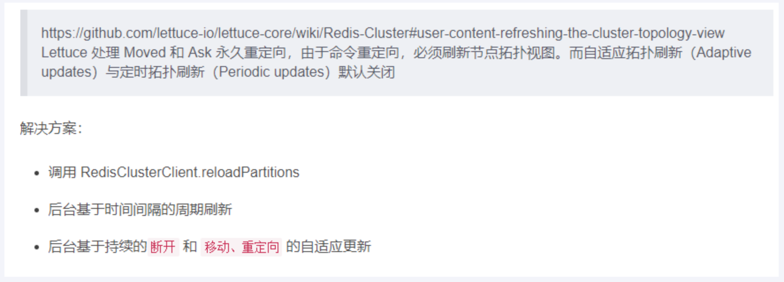

---
# 当前页面内容标题
title: 十一、SpringBoot集成Redis
# 分类
category:
  - redis
# 标签
tag: 
  - redis
  - NOSQL
  - K,V缓存数据库
  - 非关系型数据库
sticky: false
# 是否收藏在博客主题的文章列表中，当填入数字时，数字越大，排名越靠前。
star: false
# 是否将该文章添加至文章列表中
article: true
# 是否将该文章添加至时间线中
timeline: true
---

## 01、总体概述

jedis-lettuce-RedisTemplate三者之间的关系

## 02、本地Java连接Redis常见问题，小白注意

- bind配置请注释掉

- 保护模式设置为no

- Linux系统的防火墙设置

- redis服务器的IP地址和密码是否正确

- 忘记写访问redis的服务端口号和auth密码

## 03、集成Jedis

### 是什么？

Jedis Client是Redis官网推荐的一个面向java客户端，库文件实现了对各类API进行封装调用

### 步骤

1. 建Module

redis7_study

2. 改POM

```xml
<?xml version="1.0" encoding="UTF-8"?>
<project xmlns="http://maven.apache.org/POM/4.0.0"
         xmlns:xsi="http://www.w3.org/2001/XMLSchema-instance"
         xsi:schemaLocation="http://maven.apache.org/POM/4.0.0 http://maven.apache.org/xsd/maven-4.0.0.xsd">
    <modelVersion>4.0.0</modelVersion>

    <groupId>com.atguigu.redis7</groupId>
    <artifactId>redis7_study</artifactId>
    <version>1.0-SNAPSHOT</version>

    <parent>
        <groupId>org.springframework.boot</groupId>
        <artifactId>spring-boot-starter-parent</artifactId>
        <version>2.6.10</version>
        <relativePath/>
    </parent>

    <properties>
        <project.build.sourceEncoding>UTF-8</project.build.sourceEncoding>
        <maven.compiler.source>1.8</maven.compiler.source>
        <maven.compiler.target>1.8</maven.compiler.target>
        <junit.version>4.12</junit.version>
        <log4j.version>1.2.17</log4j.version>
        <lombok.version>1.16.18</lombok.version>
    </properties>

    <dependencies>
        <!--SpringBoot通用依赖模块-->
        <dependency>
            <groupId>org.springframework.boot</groupId>
            <artifactId>spring-boot-starter-web</artifactId>
        </dependency>
        <!--jedis-->
        <dependency>
            <groupId>redis.clients</groupId>
            <artifactId>jedis</artifactId>
            <version>4.3.1</version>
        </dependency>
        <!--通用基础配置-->
        <dependency>
            <groupId>junit</groupId>
            <artifactId>junit</artifactId>
            <version>${junit.version}</version>
        </dependency>
        <dependency>
            <groupId>org.springframework.boot</groupId>
            <artifactId>spring-boot-starter-test</artifactId>
            <scope>test</scope>
        </dependency>
        <dependency>
            <groupId>log4j</groupId>
            <artifactId>log4j</artifactId>
            <version>${log4j.version}</version>
        </dependency>
        <dependency>
            <groupId>org.projectlombok</groupId>
            <artifactId>lombok</artifactId>
            <version>${lombok.version}</version>
            <optional>true</optional>
        </dependency>
    </dependencies>

    <build>
        <plugins>
            <plugin>
                <groupId>org.springframework.boot</groupId>
                <artifactId>spring-boot-maven-plugin</artifactId>
            </plugin>
        </plugins>
    </build>

</project>
```

3. 写YAML（或properties）

```properties
server.port=7777

spring.application.name=redis7_study
```

4. 主启动类

```java
package com.atguigu.redis7;

import org.springframework.boot.SpringApplication;
import org.springframework.boot.autoconfigure.SpringBootApplication;

/**
 * @auther zzyy
 * @create 2022-11-17 16:36
 */
@SpringBootApplication
public class Redis7Study7777
{
    public static void main(String[] args)
    {
        SpringApplication.run(Redis7Study7777.class,args);
    }
}
```

5. 业务类

> 入门案例

```java
@Slf4j
public class JedisDemo
{
    public static void main(String[] args)
    {
        Jedis jedis = new Jedis("192.168.111.185",6379);

        jedis.auth("111111");

        log.info("redis conn status:{}","连接成功");
        log.info("redis ping retvalue:{}",jedis.ping());

        jedis.set("k1","jedis");
        log.info("k1 value:{}",jedis.get("k1"));
    }
}
```

> 家庭作业5+1

```java
package com.atguigu.redis7.test;

import redis.clients.jedis.Jedis;

import java.util.*;

/**
 * @auther zzyy
 * @create 2022-11-17 16:39
 */
public class JedisDemo
{
    public static void main(String[] args)
    {
        //连接本地的 Redis 服务，自己的ip和端口和密码
        Jedis jedis = new Jedis("192.168.111.181",6379);
        // 如果 Redis 服务设置了密码，需要下面这行，没有就不需要
        jedis.auth("111111");

        //key
        Set<String> keys = jedis.keys("*");
        for (Iterator iterator = keys.iterator(); iterator.hasNext();) {
            String key = (String) iterator.next();
            System.out.println(key);
        }
        System.out.println("jedis.exists====>"+jedis.exists("k2"));
        System.out.println(jedis.ttl("k1"));
        //String
        //jedis.append("k1","myreids");
        System.out.println(jedis.get("k1"));
        jedis.set("k4","k4_redis");
        System.out.println("----------------------------------------");
        jedis.mset("str1","v1","str2","v2","str3","v3");
        System.out.println(jedis.mget("str1","str2","str3"));
        //list
        System.out.println("----------------------------------------");
        //jedis.lpush("mylist","v1","v2","v3","v4","v5");
        List<String> list = jedis.lrange("mylist",0,-1);
        for (String element : list) {
            System.out.println(element);
        }
        //set
        jedis.sadd("orders","jd001");
        jedis.sadd("orders","jd002");
        jedis.sadd("orders","jd003");
        Set<String> set1 = jedis.smembers("orders");
        for (Iterator iterator = set1.iterator(); iterator.hasNext();) {
            String string = (String) iterator.next();
            System.out.println(string);
        }
        jedis.srem("orders","jd002");
        System.out.println(jedis.smembers("orders").size());
        //hash
        jedis.hset("hash1","userName","lisi");
        System.out.println(jedis.hget("hash1","userName"));
        Map<String,String> map = new HashMap<String,String>();
        map.put("telphone","138xxxxxxxx");
        map.put("address","atguigu");
        map.put("email","zzyybs@126.com");//课后有问题请给我发邮件
        jedis.hmset("hash2",map);
        List<String> result = jedis.hmget("hash2", "telphone","email");
        for (String element : result) {
            System.out.println(element);
        }

        //zset
        jedis.zadd("zset01",60d,"v1");
        jedis.zadd("zset01",70d,"v2");
        jedis.zadd("zset01",80d,"v3");
        jedis.zadd("zset01",90d,"v4");

        List<String> zset01 = jedis.zrange("zset01", 0, -1);
        zset01.forEach(System.out::println);
    }
}
```

- 一个key

- 常用五大数据类型

## 04、集成lettuce

### 是什么？

Lettuce是一个Redis的Java驱动包，Lettuce翻译为生菜，没错，就是吃的那种生菜，所以它的Logo长这样


### lettuce VS Jedis



### 案例

- 改POM

```xml
<?xml version="1.0" encoding="UTF-8"?>
<project xmlns="http://maven.apache.org/POM/4.0.0"
         xmlns:xsi="http://www.w3.org/2001/XMLSchema-instance"
         xsi:schemaLocation="http://maven.apache.org/POM/4.0.0 http://maven.apache.org/xsd/maven-4.0.0.xsd">
    <modelVersion>4.0.0</modelVersion>

    <groupId>com.atguigu.redis7</groupId>
    <artifactId>redis7_study</artifactId>
    <version>1.0-SNAPSHOT</version>

    <parent>
        <groupId>org.springframework.boot</groupId>
        <artifactId>spring-boot-starter-parent</artifactId>
        <version>2.6.10</version>
        <relativePath/>
    </parent>

    <properties>
        <project.build.sourceEncoding>UTF-8</project.build.sourceEncoding>
        <maven.compiler.source>1.8</maven.compiler.source>
        <maven.compiler.target>1.8</maven.compiler.target>
        <junit.version>4.12</junit.version>
        <log4j.version>1.2.17</log4j.version>
        <lombok.version>1.16.18</lombok.version>
    </properties>

    <dependencies>
        <!--SpringBoot通用依赖模块-->
        <dependency>
            <groupId>org.springframework.boot</groupId>
            <artifactId>spring-boot-starter-web</artifactId>
        </dependency>
        <!--jedis-->
        <dependency>
            <groupId>redis.clients</groupId>
            <artifactId>jedis</artifactId>
            <version>4.3.1</version>
        </dependency>
        <!--lettuce-->
        <dependency>
            <groupId>io.lettuce</groupId>
            <artifactId>lettuce-core</artifactId>
            <version>6.2.1.RELEASE</version>
        </dependency>
        <!--通用基础配置-->
        <dependency>
            <groupId>junit</groupId>
            <artifactId>junit</artifactId>
            <version>${junit.version}</version>
        </dependency>
        <dependency>
            <groupId>org.springframework.boot</groupId>
            <artifactId>spring-boot-starter-test</artifactId>
            <scope>test</scope>
        </dependency>
        <dependency>
            <groupId>log4j</groupId>
            <artifactId>log4j</artifactId>
            <version>${log4j.version}</version>
        </dependency>
        <dependency>
            <groupId>org.projectlombok</groupId>
            <artifactId>lombok</artifactId>
            <version>${lombok.version}</version>
            <optional>true</optional>
        </dependency>
    </dependencies>

    <build>
        <plugins>
            <plugin>
                <groupId>org.springframework.boot</groupId>
                <artifactId>spring-boot-maven-plugin</artifactId>
            </plugin>
        </plugins>
    </build>

</project>
```

- 业务类

```java
package com.atguigu.redis7.test;

import io.lettuce.core.RedisClient;
import io.lettuce.core.RedisFuture;
import io.lettuce.core.RedisURI;
import io.lettuce.core.SortArgs;
import io.lettuce.core.api.StatefulRedisConnection;
import io.lettuce.core.api.async.RedisAsyncCommands;
import io.lettuce.core.api.sync.RedisCommands;
import lombok.extern.slf4j.Slf4j;

import java.util.HashMap;
import java.util.List;
import java.util.Map;
import java.util.Set;
import java.util.concurrent.ExecutionException;

/**
 * @auther zzyy
 * @create 2022-11-17 17:05
 */
@Slf4j
public class LettuceDemo
{
    public static void main(String[] args)
    {
        //使用构建器 RedisURI.builder
        RedisURI uri = RedisURI.builder()
                .redis("192.168.111.181")
                .withPort(6379)
                .withAuthentication("default","111111")
                .build();
        //创建连接客户端
        RedisClient client = RedisClient.create(uri);
        StatefulRedisConnection conn = client.connect();
        //操作命令api
        RedisCommands<String,String> commands = conn.sync();

        //keys
        List<String> list = commands.keys("*");
        for(String s : list) {
            log.info("key:{}",s);
        }
        //String
    commands.set("k1","1111");
    String s1 = commands.get("k1");
    System.out.println("String s ==="+s1);

        //list
    commands.lpush("myList2", "v1","v2","v3");
    List<String> list2 = commands.lrange("myList2", 0, -1);
    for(String s : list2) {
     System.out.println("list ssss==="+s);
    }
    //set
    commands.sadd("mySet2", "v1","v2","v3");
    Set<String> set = commands.smembers("mySet2");
    for(String s : set) {
     System.out.println("set ssss==="+s);
    }
    //hash
    Map<String,String> map = new HashMap<>();
        map.put("k1","138xxxxxxxx");
        map.put("k2","atguigu");
        map.put("k3","zzyybs@126.com");//课后有问题请给我发邮件

    commands.hmset("myHash2", map);
    Map<String,String> retMap = commands.hgetall("myHash2");
    for(String k : retMap.keySet()) {
     System.out.println("hash  k="+k+" , v=="+retMap.get(k));
    }

    //zset
    commands.zadd("myZset2", 100.0,"s1",110.0,"s2",90.0,"s3");
    List<String> list3 = commands.zrange("myZset2",0,10);
    for(String s : list3) {
     System.out.println("zset ssss==="+s);
    }

    //sort
    SortArgs sortArgs = new SortArgs();
    sortArgs.alpha();
    sortArgs.desc();

    List<String> list4 = commands.sort("myList2",sortArgs);
    for(String s : list4) {
     System.out.println("sort ssss==="+s);
    }

        //关闭
        conn.close();
        client.shutdown();
    }
}

```

## 05、集成RedisTemplate-推荐使用

### 连接单机

> boot整合redis基础演示

1. 建Module

redis7_study

2. 改POM

```java
<?xml version="1.0" encoding="UTF-8"?>
<project xmlns="http://maven.apache.org/POM/4.0.0"
         xmlns:xsi="http://www.w3.org/2001/XMLSchema-instance"
         xsi:schemaLocation="http://maven.apache.org/POM/4.0.0 http://maven.apache.org/xsd/maven-4.0.0.xsd">
    <modelVersion>4.0.0</modelVersion>

    <groupId>com.atguigu.redis7</groupId>
    <artifactId>redis7_study</artifactId>
    <version>1.0-SNAPSHOT</version>

    <parent>
        <groupId>org.springframework.boot</groupId>
        <artifactId>spring-boot-starter-parent</artifactId>
        <version>2.6.10</version>
        <relativePath/>
    </parent>

    <properties>
        <project.build.sourceEncoding>UTF-8</project.build.sourceEncoding>
        <maven.compiler.source>1.8</maven.compiler.source>
        <maven.compiler.target>1.8</maven.compiler.target>
        <junit.version>4.12</junit.version>
        <log4j.version>1.2.17</log4j.version>
        <lombok.version>1.16.18</lombok.version>
    </properties>


    <dependencies>
        <!--SpringBoot通用依赖模块-->
        <dependency>
            <groupId>org.springframework.boot</groupId>
            <artifactId>spring-boot-starter-web</artifactId>
        </dependency>
        <!--jedis-->
        <dependency>
            <groupId>redis.clients</groupId>
            <artifactId>jedis</artifactId>
            <version>4.3.1</version>
        </dependency>
        <!--lettuce-->
        <dependency>
            <groupId>io.lettuce</groupId>
            <artifactId>lettuce-core</artifactId>
            <version>6.2.1.RELEASE</version>
        </dependency>
        <!--SpringBoot与Redis整合依赖-->
        <dependency>
            <groupId>org.springframework.boot</groupId>
            <artifactId>spring-boot-starter-data-redis</artifactId>
        </dependency>
        <dependency>
            <groupId>org.apache.commons</groupId>
            <artifactId>commons-pool2</artifactId>
        </dependency>
        <!--swagger2-->
        <dependency>
            <groupId>io.springfox</groupId>
            <artifactId>springfox-swagger2</artifactId>
            <version>2.9.2</version>
        </dependency>
        <dependency>
            <groupId>io.springfox</groupId>
            <artifactId>springfox-swagger-ui</artifactId>
            <version>2.9.2</version>
        </dependency>
        <!--通用基础配置junit/devtools/test/log4j/lombok/hutool-->
        <dependency>
            <groupId>junit</groupId>
            <artifactId>junit</artifactId>
            <version>${junit.version}</version>
        </dependency>
        <dependency>
            <groupId>org.springframework.boot</groupId>
            <artifactId>spring-boot-starter-test</artifactId>
            <scope>test</scope>
        </dependency>
        <dependency>
            <groupId>log4j</groupId>
            <artifactId>log4j</artifactId>
            <version>${log4j.version}</version>
        </dependency>
        <dependency>
            <groupId>org.projectlombok</groupId>
            <artifactId>lombok</artifactId>
            <version>${lombok.version}</version>
            <optional>true</optional>
        </dependency>
    </dependencies>

    <build>
        <plugins>
            <plugin>
                <groupId>org.springframework.boot</groupId>
                <artifactId>spring-boot-maven-plugin</artifactId>
            </plugin>
        </plugins>
    </build>

</project>
```

3. 写YML（properties）

```properties
server.port=7777

spring.application.name=redis7_study

# ========================logging=====================
logging.level.root=info
logging.level.com.atguigu.redis7=info
logging.pattern.console=%d{yyyy-MM-dd HH:mm:ss.SSS} [%thread] %-5level %logger- %msg%n 

logging.file.name=D:/mylogs2023/redis7_study.log
logging.pattern.file=%d{yyyy-MM-dd HH:mm:ss.SSS} [%thread] %-5level %logger- %msg%n

# ========================swagger=====================
spring.swagger2.enabled=true
#在springboot2.6.X结合swagger2.9.X会提示documentationPluginsBootstrapper空指针异常，
#原因是在springboot2.6.X中将SpringMVC默认路径匹配策略从AntPathMatcher更改为PathPatternParser，
# 导致出错，解决办法是matching-strategy切换回之前ant_path_matcher
spring.mvc.pathmatch.matching-strategy=ant_path_matcher

# ========================redis单机=====================
spring.redis.database=0
# 修改为自己真实IP
spring.redis.host=192.168.111.185
spring.redis.port=6379
spring.redis.password=111111
spring.redis.lettuce.pool.max-active=8
spring.redis.lettuce.pool.max-wait=-1ms
spring.redis.lettuce.pool.max-idle=8
spring.redis.lettuce.pool.min-idle=0
```

4. 主启动

```java
package com.atguigu.redis7;

import org.springframework.boot.SpringApplication;
import org.springframework.boot.autoconfigure.SpringBootApplication;

/**
 * @auther zzyy
 * @create 2022-11-17 16:36
 */
@SpringBootApplication
public class Redis7Study7777
{
    public static void main(String[] args)
    {
        SpringApplication.run(Redis7Study7777.class,args);
    }
}
```

5. 业务类
- 配置类

RedisConfig

```java
package com.atguigu.redis7.config;

import org.springframework.context.annotation.Bean;
import org.springframework.context.annotation.Configuration;
import org.springframework.data.redis.connection.lettuce.LettuceConnectionFactory;
import org.springframework.data.redis.core.RedisTemplate;
import org.springframework.data.redis.serializer.GenericJackson2JsonRedisSerializer;
import org.springframework.data.redis.serializer.StringRedisSerializer;

/**
 * @auther zzyy
 * @create 2022-11-17 17:34
 */
@Configuration
public class RedisConfig
{
    /**
     * redis序列化的工具配置类，下面这个请一定开启配置
     * 127.0.0.1:6379> keys *
     * 1) "ord:102"  序列化过
     * 2) "\xac\xed\x00\x05t\x00\aord:102"   野生，没有序列化过
     * this.redisTemplate.opsForValue(); //提供了操作string类型的所有方法
     * this.redisTemplate.opsForList(); // 提供了操作list类型的所有方法
     * this.redisTemplate.opsForSet(); //提供了操作set的所有方法
     * this.redisTemplate.opsForHash(); //提供了操作hash表的所有方法
     * this.redisTemplate.opsForZSet(); //提供了操作zset的所有方法
     * @param lettuceConnectionFactory
     * @return
     */
    @Bean
    public RedisTemplate<String, Object> redisTemplate(LettuceConnectionFactory lettuceConnectionFactory)
    {
        RedisTemplate<String,Object> redisTemplate = new RedisTemplate<>();

        redisTemplate.setConnectionFactory(lettuceConnectionFactory);
        //设置key序列化方式string
        redisTemplate.setKeySerializer(new StringRedisSerializer());
        //设置value的序列化方式json，使用GenericJackson2JsonRedisSerializer替换默认序列化
        redisTemplate.setValueSerializer(new GenericJackson2JsonRedisSerializer());

        redisTemplate.setHashKeySerializer(new StringRedisSerializer());
        redisTemplate.setHashValueSerializer(new GenericJackson2JsonRedisSerializer());

        redisTemplate.afterPropertiesSet();

        return redisTemplate;
    }
}


```

SwaggerConfig

```java
package com.atguigu.redis7.config;

import org.springframework.beans.factory.annotation.Value;
import org.springframework.context.annotation.Bean;
import org.springframework.context.annotation.Configuration;
import springfox.documentation.builders.ApiInfoBuilder;
import springfox.documentation.builders.PathSelectors;
import springfox.documentation.builders.RequestHandlerSelectors;
import springfox.documentation.service.ApiInfo;
import springfox.documentation.spi.DocumentationType;
import springfox.documentation.spring.web.plugins.Docket;
import springfox.documentation.swagger2.annotations.EnableSwagger2;

import java.time.LocalDateTime;
import java.time.format.DateTimeFormatter;

/**
 * @auther zzyy
 * @create 2022-11-17 17:44
 */
@Configuration
@EnableSwagger2
public class SwaggerConfig
{
    @Value("${spring.swagger2.enabled}")
    private Boolean enabled;

    @Bean
    public Docket createRestApi() {
        return new Docket(DocumentationType.SWAGGER_2)
                .apiInfo(apiInfo())
                .enable(enabled)
                .select()
                .apis(RequestHandlerSelectors.basePackage("com.atguigu.redis7")) //你自己的package
                .paths(PathSelectors.any())
                .build();
    }
    public ApiInfo apiInfo() {
        return new ApiInfoBuilder()
                .title("springboot利用swagger2构建api接口文档 "+"\t"+ DateTimeFormatter.ofPattern("yyyy-MM-dd").format(LocalDateTime.now()))
                .description("springboot+redis整合,有问题给管理员阳哥邮件:zzyybs@126.com")
                .version("1.0")
                .termsOfServiceUrl("https://www.atguigu.com/")
                .build();
    }
}


```

- service

```java
package com.atguigu.redis7.service;

import lombok.extern.slf4j.Slf4j;
import org.springframework.data.redis.core.RedisTemplate;
import org.springframework.stereotype.Service;

import javax.annotation.Resource;
import java.util.UUID;
import java.util.concurrent.ThreadLocalRandom;

/**
 * @auther zzyy
 * @create 2022-07-14 15:11
 */
@Service
@Slf4j
public class OrderService
{
    public static final String ORDER_KEY = "order:";

    @Resource
    private RedisTemplate redisTemplate;

    public void addOrder()
    {
        int keyId = ThreadLocalRandom.current().nextInt(1000)+1;
        String orderNo = UUID.randomUUID().toString();
        redisTemplate.opsForValue().set(ORDER_KEY+keyId,"京东订单"+ orderNo);
        log.info("=====>编号"+keyId+"的订单流水生成:{}",orderNo);
    }

    public String getOrderById(Integer id)
    {
        return (String)redisTemplate.opsForValue().get(ORDER_KEY + id);
    }
}

```

- controller

```java
package com.atguigu.redis7.controller;

import com.atguigu.redis7.service.OrderService;

import io.swagger.annotations.Api;
import io.swagger.annotations.ApiOperation;
import lombok.extern.slf4j.Slf4j;
import org.springframework.web.bind.annotation.PathVariable;
import org.springframework.web.bind.annotation.RequestMapping;
import org.springframework.web.bind.annotation.RequestMethod;
import org.springframework.web.bind.annotation.RestController;

import javax.annotation.Resource;
import java.util.concurrent.ThreadLocalRandom;

/**
 * @auther zzyy
 * @create 2022-07-14 15:08
 */
@Api(tags = "订单接口")
@RestController
@Slf4j
public class OrderController
{
    @Resource
    private OrderService orderService;

    @ApiOperation("新增订单")
    @RequestMapping(value = "/order/add",method = RequestMethod.POST)
    public void addOrder()
    {
        orderService.addOrder();
    }


    @ApiOperation("按orderId查订单信息")
    @RequestMapping(value = "/order/{id}", method = RequestMethod.GET)
    public String findUserById(@PathVariable Integer id)
    {
        return orderService.getOrderById(id);
    }
}
```

6. 测试

> swagger：http://localhost:7777/swagger-ui.html#/

> 序列化问题


- why



- JDK序列化方式（默认）惹的祸

>  JDK 序列化方式 （默认）

`org.springframework.data.redis.serializer.JdkSerializationRedisSerializer` ，

默认情况下，RedisTemplate 使用该数据列化方式，我们来看下源码 `RedisTemplate#afterPropertiesSet()`



其他api调用命令，各位就自己手动多练习喽！（家庭作业）

### 连接集群

1. 启动redis集群6台实例

2. 第一次改写YML

```properties
server.port=7777

spring.application.name=redis7_study

# ========================logging=====================
logging.level.root=info
logging.level.com.atguigu.redis7=info
logging.pattern.console=%d{yyyy-MM-dd HH:mm:ss.SSS} [%thread] %-5level %logger- %msg%n 

logging.file.name=D:/mylogs2023/redis7_study.log
logging.pattern.file=%d{yyyy-MM-dd HH:mm:ss.SSS} [%thread] %-5level %logger- %msg%n

# ========================swagger=====================
spring.swagger2.enabled=true
#在springboot2.6.X结合swagger2.9.X会提示documentationPluginsBootstrapper空指针异常，
#原因是在springboot2.6.X中将SpringMVC默认路径匹配策略从AntPathMatcher更改为PathPatternParser，
# 导致出错，解决办法是matching-strategy切换回之前ant_path_matcher
spring.mvc.pathmatch.matching-strategy=ant_path_matcher


# ========================redis集群=====================
spring.redis.password=111111
# 获取失败 最大重定向次数
spring.redis.cluster.max-redirects=3
spring.redis.lettuce.pool.max-active=8
spring.redis.lettuce.pool.max-wait=-1ms
spring.redis.lettuce.pool.max-idle=8
spring.redis.lettuce.pool.min-idle=0
spring.redis.cluster.nodes=192.168.111.175:6381,192.168.111.175:6382,192.168.111.172:6383,192.168.111.172:6384,192.168.111.174:6385,192.168.111.174:6386
```

3. 直接通过微服务访问redis集群
- 一切OK

- http://localhost:7777/swagger-ui.html#/
4. ⚠️问题来了
- 人为模拟，master-6381机器意外宕机，手动shutdown

- 先对redis集群命令方式，手动验证各种读写命令，看看6384是否上位

- Redis Cluster集群能自动感知并自动完成主备切换，对应的slave6384会被选举为新的master节点

- 🚩微服务客户端再次读写访问试试

> 故障现象

SpringBoot客户端没有动态感知到RedisCluster的最新集群信息

经典故障

【故障演练】 Redis Cluster集群部署采用了3主3从拓扑结构，数据读写访问master节点， slave节点负责备份。**当master宕机主从切换成功，redis手动OK，but 2个经典故障**





> 导致原因

SpringBoot 2.X版本，Redis默认的连接池采用Lettuce

当Redis集群节点发生变化后，Lettuce默认是不会刷新节点拓扑

> 解决方案

1 排除lettuce采用jedis（不推荐）


2 重写连接工厂实例（极度不推荐）

```java
//仅做参考，不写，不写，不写。

@Bean

public DefaultClientResources lettuceClientResources() {

    return DefaultClientResources.create();

}


@Bean

public LettuceConnectionFactory lettuceConnectionFactory(RedisProperties redisProperties, ClientResources clientResources) {

 

    ClusterTopologyRefreshOptions topologyRefreshOptions = ClusterTopologyRefreshOptions.builder()

            .enablePeriodicRefresh(Duration.ofSeconds(30)) //按照周期刷新拓扑

            .enableAllAdaptiveRefreshTriggers() //根据事件刷新拓扑

            .build();

 

    ClusterClientOptions clusterClientOptions = ClusterClientOptions.builder()

            //redis命令超时时间,超时后才会使用新的拓扑信息重新建立连接

            .timeoutOptions(TimeoutOptions.enabled(Duration.ofSeconds(10)))

            .topologyRefreshOptions(topologyRefreshOptions)

            .build();

 

    LettuceClientConfiguration clientConfiguration = LettuceClientConfiguration.builder()

            .clientResources(clientResources)

            .clientOptions(clusterClientOptions)

            .build();

 

    RedisClusterConfiguration clusterConfig = new RedisClusterConfiguration(redisProperties.getCluster().getNodes());

    clusterConfig.setMaxRedirects(redisProperties.getCluster().getMaxRedirects());

    clusterConfig.setPassword(RedisPassword.of(redisProperties.getPassword()));

 

    LettuceConnectionFactory lettuceConnectionFactory = new LettuceConnectionFactory(clusterConfig, clientConfiguration);

 

    return lettuceConnectionFactory;

}
```

3 刷新节点集群拓扑动态感应

> 官网：https://github.com/lettuce-io/lettuce-core/wiki/Redis-Cluster#user-content-refreshing-the-cluster-topology-view





4 第二次改写YML

```properties
server.port=7777

spring.application.name=redis7_study

# ========================logging=====================
logging.level.root=info
logging.level.com.atguigu.redis7=info
logging.pattern.console=%d{yyyy-MM-dd HH:mm:ss.SSS} [%thread] %-5level %logger- %msg%n 

logging.file.name=D:/mylogs2023/redis7_study.log
logging.pattern.file=%d{yyyy-MM-dd HH:mm:ss.SSS} [%thread] %-5level %logger- %msg%n

# ========================swagger=====================
spring.swagger2.enabled=true
#在springboot2.6.X结合swagger2.9.X会提示documentationPluginsBootstrapper空指针异常，
#原因是在springboot2.6.X中将SpringMVC默认路径匹配策略从AntPathMatcher更改为PathPatternParser，
# 导致出错，解决办法是matching-strategy切换回之前ant_path_matcher
spring.mvc.pathmatch.matching-strategy=ant_path_matcher


# ========================redis集群=====================
spring.redis.password=111111
# 获取失败 最大重定向次数
spring.redis.cluster.max-redirects=3
spring.redis.lettuce.pool.max-active=8
spring.redis.lettuce.pool.max-wait=-1ms
spring.redis.lettuce.pool.max-idle=8
spring.redis.lettuce.pool.min-idle=0
#支持集群拓扑动态感应刷新,自适应拓扑刷新是否使用所有可用的更新，默认false关闭
spring.redis.lettuce.cluster.refresh.adaptive=true
#定时刷新
spring.redis.lettuce.cluster.refresh.period=2000
spring.redis.cluster.nodes=192.168.111.175:6381,192.168.111.175:6382,192.168.111.172:6383,192.168.111.172:6384,192.168.111.174:6385,192.168.111.174:6386
```

`两次的修改对比成就了最完美的配置优化！`


