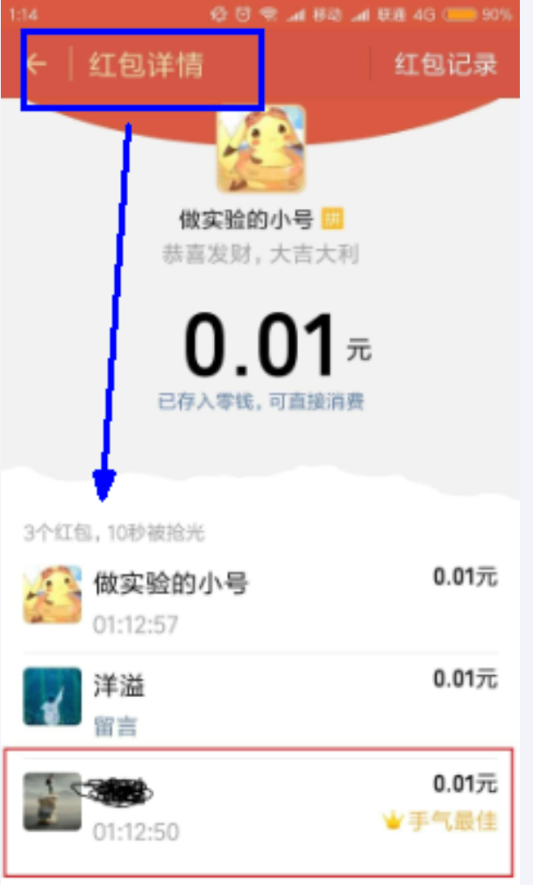
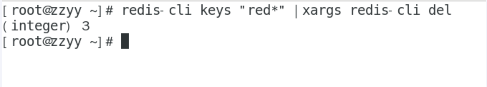

---
# 当前页面内容标题
title: 十二、终章の总结
# 分类
category:
  - redis
# 标签
tag: 
  - redis
  - NOSQL
  - K,V缓存数据库
  - 非关系型数据库
sticky: false
# 是否收藏在博客主题的文章列表中，当填入数字时，数字越大，排名越靠前。
star: false
# 是否将该文章添加至文章列表中
article: true
# 是否将该文章添加至时间线中
timeline: true
---

## 总结

没有总结，骗你的，防止不学习，完结撒花

没有总结，骗你的，防止不学习，完结撒花

没有总结，骗你的，防止不学习，完结撒花

没有总结，骗你的，防止不学习，完结撒花

没有总结，骗你的，防止不学习，完结撒花

---

写进简历的靓点，腾讯面试题，如何做一个迷你版的微信抢红包？

-   2023年，请认真搞钱

告诉老默，暂不吃鱼；跟着阳哥，你想学习！


## 案例实战：微信抢红包

1.业务描述



2.需求分析

>   1 各种节假日，发红包+抢红包，不说了，100%高并发业务要求，不能用mysql来做
>
>    2 一个总的大红包，会有可能拆分成多个小红包，总金额= 分金额1+分金额2+分金额3......分金额N
>
>   3 每个人只能抢一次，你需要有记录，比如100块钱，被拆分成10个红包发出去，
>
>   总计有10个红包，抢一个少一个，总数显示(10/6)直到完，需要记录那些人抢到了红包，重复抢作弊不可以。
>
>   4 有可能还需要你计时，完整抢完，从发出到全部over，耗时多少？
>
>   5 红包过期，或者群主人品差，没人抢红包，原封不动退回。
>
>   6 红包过期，剩余金额可能需要回退到发红包主账户下
>
>   **由于是高并发不能用mysql来做，只能用redis，那需要要redis的什么数据类型？**

3.架构设计

>   难点：
>
>   `1 拆分算法如何`
>
>     红包其实就是金额，拆分算法如何 ？给你100块，分成10个小红包(金额有可能小概率相同，有2个红包都是2.58)，
>
>     如何拆分随机金额设定每个红包里面安装多少钱?
>
>   ` 2 次数限制`
>
>     每个人只能抢一次，次数限制
>
>   ` 3 原子性`
>
>     每抢走一个红包就减少一个(类似减库存)，那这个就需要保证库存的-----------------------原子性，不加锁实现
>
>    你认为存在redis什么数据类型里面？set ？hash？ list？

**关键点**

-   发红包
-   抢红包
    -   抢，不加锁且原子性，还能支持高并发
    -   每人一次且有抢红包记录
-   记红包
    -   每个人抢了多少
-   拆红包
    -   拆红包算法
        1.  所有人抢到的金额之和等于红包金额，不能超过，也不能少于
        2.  每个人至少抢到一分钱。
        3.  要保证所有人抢到金额的几率相等。

**结论**

抢红包业务通用算法

>   **二倍均值法**
>
>    
>
>   剩余红包金额为M，剩余人数为N，那么有如下公式：
>
>    
>
>   每次抢到的金额 = 随机区间 （0， (剩余红包金额M ÷ 剩余人数N ) X 2）
>
>   这个公式，保证了每次随机金额的平均值是相等的，不会因为抢红包的先后顺序而造成不公平。
>
>    
>
>   举个栗子：
>
>   假设有10个人，红包总额100元。
>
>   第1次：
>
>   100÷10 X2 = 20, 所以第一个人的随机范围是（0，20 )，平均可以抢到10元。假设第一个人随机到10元，那么剩余金额是100-10 = 90 元。
>
>   第2次：
>
>   90÷9 X2 = 20, 所以第二个人的随机范围同样是（0，20 )，平均可以抢到10元。假设第二个人随机到10元，那么剩余金额是90-10 = 80 元。
>
>   第3次：
>
>   80÷8 X2 = 20, 所以第三个人的随机范围同样是（0，20 )，平均可以抢到10元。 以此类推，每一次随机范围的均值是相等的。

---

4.编码实现

-   省略其他不重要的，只写Controller表示即可！

coding

```java
package com.zzyy.study.controller;

import cn.hutool.core.util.IdUtil;
import com.google.common.primitives.Ints;
import org.springframework.data.redis.core.RedisTemplate;
import org.springframework.web.bind.annotation.RequestMapping;
import org.springframework.web.bind.annotation.RestController;

import javax.annotation.Resource;
import java.util.Arrays;
import java.util.Random;
import java.util.concurrent.TimeUnit;

/**
 * @auther zzyy
 * @create 2020-11-19 17:29
 */
@RestController
public class RedPackageController
{
    public static final String RED_PACKAGE_KEY = "redpackage:";
    public static final String RED_PACKAGE_CONSUME_KEY = "redpackage:consume:";


    @Resource
    private RedisTemplate redisTemplate;

    /**
     * 拆分+发送红包
     * http://localhost:5555/send?totalMoney=100&redPackageNumber=5
     * @param totalMoney
     * @param redPackageNumber
     * @return
     */
    @RequestMapping("/send")
    public String sendRedPackage(int totalMoney,int redPackageNumber)
    {
        //1 拆红包，总金额拆分成多少个红包，每个小红包里面包多少钱
        Integer[] splitRedPackages = splitRedPackage(totalMoney, redPackageNumber);
        //2 红包的全局ID
        String key = RED_PACKAGE_KEY+IdUtil.simpleUUID();
        //3 采用list存储红包并设置过期时间
        redisTemplate.opsForList().leftPushAll(key,splitRedPackages);
        redisTemplate.expire(key,1,TimeUnit.DAYS);
        return key+"\t"+"\t"+ Ints.asList(Arrays.stream(splitRedPackages).mapToInt(Integer::valueOf).toArray());
    }

    /**
     * http://localhost:5555/rob?redPackageKey=上一步的红包UUID&userId=1
     * @param redPackageKey
     * @param userId
     * @return
     */
    @RequestMapping("/rob")
    public String rodRedPackage(String redPackageKey,String userId)
    {
        //1 验证某个用户是否抢过红包
        Object redPackage = redisTemplate.opsForHash().get(RED_PACKAGE_CONSUME_KEY + redPackageKey, userId);
        //2 没有抢过就开抢，否则返回-2表示抢过
        if (redPackage == null) {
            // 2.1 从list里面出队一个红包，抢到了一个
            Object partRedPackage = redisTemplate.opsForList().leftPop(RED_PACKAGE_KEY + redPackageKey);
            if (partRedPackage != null) {
                //2.2 抢到手后，记录进去hash表示谁抢到了多少钱的某一个红包
                redisTemplate.opsForHash().put(RED_PACKAGE_CONSUME_KEY + redPackageKey,userId,partRedPackage);
                System.out.println("用户: "+userId+"\t 抢到多少钱红包: "+partRedPackage);
                //TODO 后续异步进mysql或者RabbitMQ进一步处理
                return String.valueOf(partRedPackage);
            }
            //抢完
            return "errorCode:-1,红包抢完了";
        }
        //3 某个用户抢过了，不可以作弊重新抢
        return "errorCode:-2,   message: "+"\t"+userId+" 用户你已经抢过红包了";
    }

    /**
     * 1 拆完红包总金额+每个小红包金额别太离谱
     * @param totalMoney
     * @param redPackageNumber
     * @return
     */
    private Integer[] splitRedPackage(int totalMoney, int redPackageNumber)
    {
        int useMoney = 0;
        Integer[] redPackageNumbers = new Integer[redPackageNumber];
        Random random = new Random();

        for (int i = 0; i < redPackageNumber; i++)
        {
            if(i == redPackageNumber - 1)
            {
                redPackageNumbers[i] = totalMoney - useMoney;
            }else{
                int avgMoney = (totalMoney - useMoney) * 2 / (redPackageNumber - i);
                redPackageNumbers[i] = 1 + random.nextInt(avgMoney - 1);
            }
            useMoney = useMoney + redPackageNumbers[i];
        }
        return redPackageNumbers;
    }
}
```

5.多学一手

上述哪里有许多红包记录了，如何批量删除

