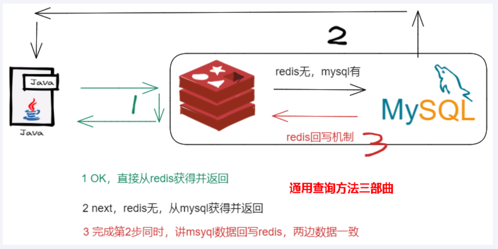
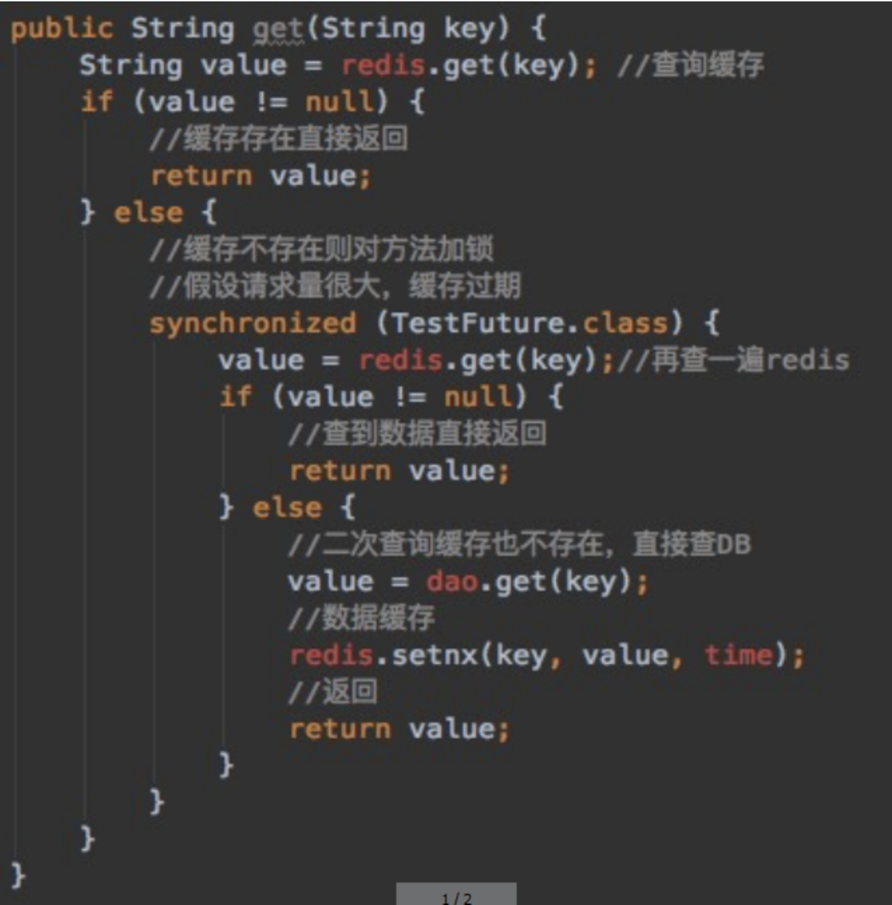
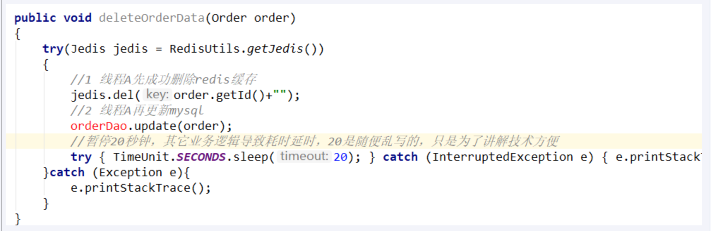
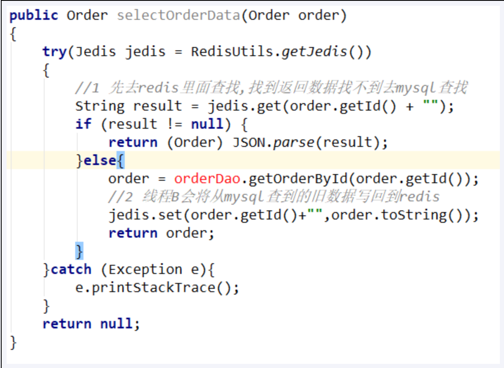
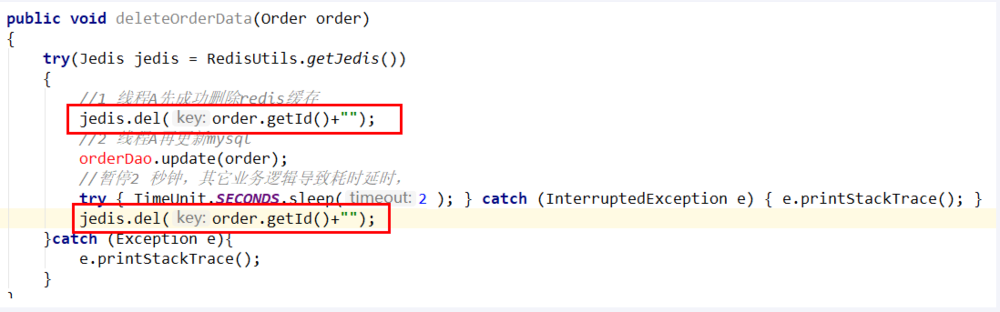
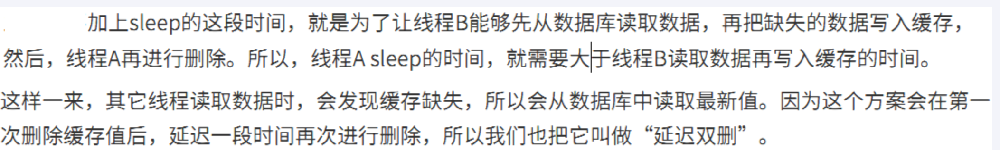
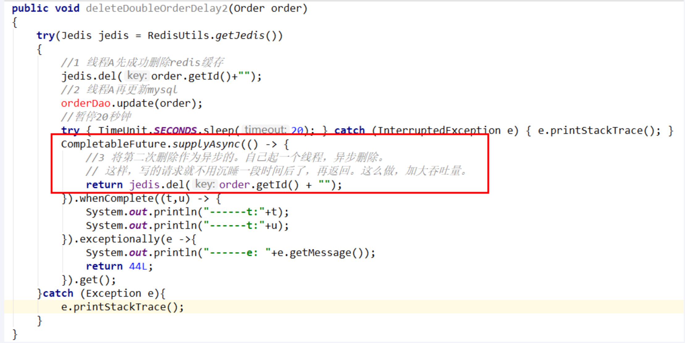
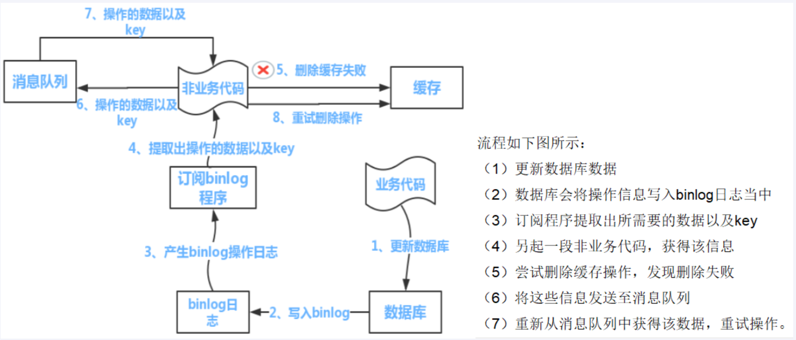

---
# 当前页面内容标题
title: 三、缓存双写一致性之更新策略探讨
# 分类
category:
  - redis
# 标签
tag: 
  - redis
  - NOSQL
  - K,V缓存数据库
  - 非关系型数据库
sticky: false
# 是否收藏在博客主题的文章列表中，当填入数字时，数字越大，排名越靠前。
star: false
# 是否将该文章添加至文章列表中
article: true
# 是否将该文章添加至时间线中
timeline: true
---

## 01、反馈回来的面试题

**一图**


- 问题，上面业务逻辑你用java代码如何写？

- 你只要用缓存，就可能会涉及到redis缓存与数据库双存储双写，你只要是双写，就一定会有数据一致性问题，那么你如何解决一致性问题？

- 双写一致性，你先动缓存redis还是数据库mysql哪一个？why？

- **延时双删**你做过吗？会有哪些问题？

- 有这么一种情况，微服务查询redis无mysql有，为保证数据双写一致性回写redis你需要注意什么？**双检加锁**策略你了解过吗？如何尽量避免缓存击穿？

- redis和mysql双写100%会出纰漏，做不到强一致性，你如何保证**最终一致性**？

- 。。。。。。

## 02、缓存双写一致性，谈谈你的理解

如果redis中**有数据**：需要和数据库中的值相同

如果reids中**无数据**：数据库中的值要是最新值，且准备回写redis

> 缓存按照步骤来分，细分2种

- 只读缓存

- 读写缓存
1. 同步直写策略

写数据库后也同步到redis缓存，缓存和数据库中的数据一致；

对于读写缓存来说，要想保证缓存和数据库中的数据一致，就要采用同步直写策略

2. 异步缓写策略

正常情况下，mysql数据发生变动，但是可以在业务上容许出现一定时间后才作用于redis，比如仓库，物流系统

异常情况出现了，不得不将失败的动作重新修补，有可能需啊哟借助kafka或者RabbitMQ等消息中间件，实现重试重写

**一图代码你如何写？**

> 问题》》？



**问题，上面业务逻辑你用java代码如何写？**

> 采用双检加锁策略

多个线程同时去查询数据库的这条数据，那么我们可以在第一个查询数据的请求上**使用一个 互斥锁来锁住它**。

其他的线程走到这一步拿不到锁就等着，等第一个线程查询到了数据，然后做缓存。

后面的线程进来发现已经有缓存了，就直接走缓存。 

```java
public String get(String key) {
    String value  = redis.get(key); // 查询缓存
    if (value != null) {
        // 缓存存在直接返回
        return value;
    } else {
        // 缓存不存在则对方法加锁
        // 假设请求量很大，缓存过期
        synchronized (TestFuture.class) {
            value = redis.get(key); // 在查一遍redis
            if (value != null) {
                // 查到数据直接返回
                return value;
            } else {
                // 二次查询缓存不存在，直接插DB
                value = dao.get(key);
                // 数据缓存
                redis.setnx(key , value);
                // 返回
                return value;
            }
        }
    }
}
```



> Code编码

```java
package com.atguigu.redis.service;

import com.atguigu.redis.entities.User;
import com.atguigu.redis.mapper.UserMapper;
import io.swagger.models.auth.In;
import lombok.extern.slf4j.Slf4j;
import org.slf4j.Logger;
import org.slf4j.LoggerFactory;
import org.springframework.beans.factory.annotation.Autowired;
import org.springframework.data.redis.core.RedisTemplate;
import org.springframework.data.redis.core.ValueOperations;
import org.springframework.stereotype.Service;
import org.springframework.web.bind.annotation.PathVariable;

import javax.annotation.Resource;
import java.util.concurrent.TimeUnit;

/**
 * @auther zzyy
 * @create 2021-05-01 14:58
 */
@Service
@Slf4j
public class UserService {
    public static final String CACHE_KEY_USER = "user:";
    @Resource
    private UserMapper userMapper;
    @Resource
    private RedisTemplate redisTemplate;

    /**
     * 业务逻辑没有写错，对于小厂中厂(QPS《=1000)可以使用，但是大厂不行
     * @param id
     * @return
     */
    public User findUserById(Integer id)
    {
        User user = null;
        String key = CACHE_KEY_USER+id;

        //1 先从redis里面查询，如果有直接返回结果，如果没有再去查询mysql
        user = (User) redisTemplate.opsForValue().get(key);

        if(user == null)
        {
            //2 redis里面无，继续查询mysql
            user = userMapper.selectByPrimaryKey(id);
            if(user == null)
            {
                //3.1 redis+mysql 都无数据
                //你具体细化，防止多次穿透，我们业务规定，记录下导致穿透的这个key回写redis
                return user;
            }else{
                //3.2 mysql有，需要将数据写回redis，保证下一次的缓存命中率
                redisTemplate.opsForValue().set(key,user);
            }
        }
        return user;
    }


    /**
     * 加强补充，避免突然key失效了，打爆mysql，做一下预防，尽量不出现击穿的情况。
     * @param id
     * @return
     */
    public User findUserById2(Integer id)
    {
        User user = null;
        String key = CACHE_KEY_USER+id;

        //1 先从redis里面查询，如果有直接返回结果，如果没有再去查询mysql，
        // 第1次查询redis，加锁前
        user = (User) redisTemplate.opsForValue().get(key);
        if(user == null) {
            //2 大厂用，对于高QPS的优化，进来就先加锁，保证一个请求操作，让外面的redis等待一下，避免击穿mysql
            synchronized (UserService.class){
                //第2次查询redis，加锁后
                user = (User) redisTemplate.opsForValue().get(key);
                //3 二次查redis还是null，可以去查mysql了(mysql默认有数据)
                if (user == null) {
                    //4 查询mysql拿数据(mysql默认有数据)
                    user = userMapper.selectByPrimaryKey(id);
                    if (user == null) {
                        return null;
                    }else{
                        //5 mysql里面有数据的，需要回写redis，完成数据一致性的同步工作
                        redisTemplate.opsForValue().setIfAbsent(key,user,7L,TimeUnit.DAYS);
                    }
                }
            }
        }
        return user;
    }

}
```

## 03、数据库和缓存一致性的几种更新策略

### 目的

**总之，我们要达到最终一致性！**

**给缓存设置过期时间，定期清理缓存并回写，是保证最终一致性的解决方案。**

我们可以对存入缓存的数据设置过期时间，所有的**写操作以数据库为准**，对缓存操作只是尽最大努力即可。也就是说如果数据库写成功，缓存更新失败，那么只要到达过期时间，则后面的读请求自然会从数据库中读取新值然后回填缓存，达到一致性，**切记，要以mysql的数据库写入库为准。**

上述方案和后续落地案例是调研后的主流+成熟的做法，但是考虑到各个公司业务系统的差距，

`不是100%绝对正确，不保证绝对适配全部情况`，请同学们自行酌情选择打法，合适自己的最好。

### 可以停机的情况，^ _ ^

挂牌报错，凌晨升级，温馨提示，服务降级

单线程，这样重量级的数据库操作最好不要多线程

### 我们讨论4中更新策略

- ❌先更新数据库，在更新缓存

**异常情况1：**

 1 先更新mysql的某商品的库存，当前商品的库存是100，更新为99个。

 2 先更新mysql修改为99成功，然后更新redis。

 3 `此时假设异常出现`，更新redis失败了，这导致mysql里面的库存是99而redis里面的还是100 。 

 4 上述发生，会让数据库里面和缓存redis里面数据不一致，`读到redis脏数据`

**异常情况2：**

【先更新数据库，再更新缓存】，A、B两个线程发起调用

**【正常逻辑】**

1 A update mysql 100

2 A update redis 100

3 B update mysql 80

4 B update redis 80

`============================`

**【异常逻辑】多线程环境下，A、B两个线程有快有慢，有前有后有并行**

1 A update mysql 100

3 B update mysql 80

4 B update redis 80

2 A update redis 100

 `=============================`

最终结果，mysql和redis数据不一致，o(╥﹏╥)o，

mysql80,redis100

- ❌先更新缓存，在更新数据库

❌不太推荐：业务上一般把mysql作物`底单数据库`，保证最后解释

异常情况2：

【先更新缓存，再更新数据库】，A、B两个线程发起调用

**【正常逻辑】**

1 A update redis 100

2 A update mysql 100

3 B update redis 80

4 B update mysql 80

`====================================`

**【异常逻辑】多线程环境下，A、B两个线程有快有慢有并行**

A update redis  100

B update redis  80

B update mysql 80

A update mysql 100

----mysql100,redis80

- ❌先删除缓存，在更新数据库

> 异常问题

1. 步骤分析1：先删除缓存，在更新数据库

**阳哥自己这里写20秒，是自己故意乱写的，表示更新数据库可能失败，实际中不可能...O(∩_∩)O哈哈~**

1 A线程先成功删除了redis里面的数据，然后去更新mysql，此时mysql正在更新中，还没有结束。（比如网络延时）

**B突然出现要来读取缓存数据。**



2. 步骤分析2：先删除缓存，在更新数据库

2 此时redis里面的数据是空的，B线程来读取，先去读redis里数据(已经被A线程delete掉了)，此处出来2个问题：

 **2.1   B从mysql获得了旧值**

​    B线程发现redis里没有(缓存缺失)马上去mysql里面读取，**从数据库里面读取来的是旧值。**

 **2.2   B会把获得的旧值写回redis** 

   **获得旧值数据后返回前台并回写进redis(刚被A线程删除的旧数据有极大可能又被写回了)。**



3. 步骤分析3：先删除缓存，在更新数据库

3  A线程更新完mysql，发现redis里面的缓存是脏数据，A线程直接懵逼了，o(╥﹏╥)o

两个并发操作，一个是更新操作，另一个是查询操作，

A删除缓存后，B查询操作没有命中缓存，B先把老数据读出来后放到缓存中，然后A更新操作更新了数据库。 

于是，在缓存中的数据还是老的数据，导致缓存中的数据是脏的，而且还一直这样脏下去了。

4. 上面3步骤串讲梳理

4 总结流程：

（1）请求A进行写操作，删除redis缓存后，工作正在进行中，更新mysql......A还么有彻底更新完mysql，还没commit

（2）请求B开工查询，查询redis发现缓存不存在(被A从redis中删除了)

（3）请求B继续，去数据库查询得到了mysql中的旧值(A还没有更新完)

（4）请求B将旧值写回redis缓存

（5）请求A将新值写入mysql数据库 

**上述情况就会导致不一致的情形出现。** 

| 时间  | 线程A                                 | 线程B                                                                | 出现的问题                                                              |
| --- | ----------------------------------- | ------------------------------------------------------------------ | ------------------------------------------------------------------ |
| t1  | 请求A进行写操作，删除缓存成功后，工作正在mysql进行中...... |                                                                    |                                                                    |
| t2  |                                     | 1 缓存中读取不到，立刻读mysql，由于A还没有对mysql更新完，读到的是旧值 2 还把从mysql读取的旧值，写回了redis | 1 A还没有更新完mysql，导致B读到了旧值 2 线程B遵守回写机制，把旧值写回redis，导致其它请求读取的还是旧值，A白干了。 |
| t3  | A更新完mysql数据库的值，over                 |                                                                    | **redis是被B写回的旧值，mysql是被A更新的新值。出现了，数据不一致问题。**                       |

总结一下：

| 先删除缓存，再更新数据库 | 如果数据库更新失败或超时或返回不及时，导致B线程请求访问缓存时发现redis里面没数据，缓存缺失，B再去读取mysql时，**从数据库中读取到旧值，还写回redis，导致A白干了，o(╥﹏╥)o** |
| ------------ | --------------------------------------------------------------------------------------------------- |

> 解决方案

- **采用延时双删策略**





- 双删方案面试题

**这个删除该休眠多久呢？**

线程A sleep的时间，就需要大于线程B读取数据再写入缓存的时间。

`这个时间怎么确定呢？`

 `第一种方法：`

在业务程序运行的时候，统计下线程读数据和写缓存的操作时间，自行评估自己的项目的读数据业务逻辑的耗时，

以此为基础来进行估算。然后写数据的休眠时间则在读数据业务逻辑的耗时基础上加`百毫秒`即可。

这么做的目的，就是确保读请求结束，写请求可以删除读请求造成的缓存脏数据。 

` 第二种方法： `

`新启动一个后台监控程序，比如后面要讲解的WatchDog监控程序，会加时`

**这种同步淘汰策略，吞吐量降低怎么办？**



**后续看门狗WatchDog源码分析**

- ⚠️先更新数据库，在删除缓存

> 异常问题

**先更新数据库，再删除缓存**

| 时间  | 线程A            | 线程B                  | 出现的问题                      |
| --- | -------------- | -------------------- | -------------------------- |
| t1  | 更新数据库中的值...... |                      |                            |
| t2  |                | 缓存中立刻命中，此时B读取的是缓存旧值。 | A还没有来得及删除缓存的值，导致B缓存命中读到旧值。 |
| t3  | 更新缓存的数据，over   |                      |                            |

| 先更新数据库，再删除缓存 | 假如缓存删除失败或者来不及，导致请求再次访问redis时缓存命中，`读取到的是缓存旧值`。 |
| ------------ | --------------------------------------------- |

> 业务指导思想

[微软云](https://docs.microsoft.com/en-us/azure/architecture/patterns/cache-aside)

我们后面的阿里巴巴canal也是类似的思想

上面的订阅binlog程序在mysql中有现成的中间件canal，可以完成订阅binlog日志的功能。

> 解决方案



1 可以把要删除的缓存值或者是要更新的数据库值暂存到消息队列中（例如使用Kafka/RabbitMQ等）。

2 当程序没有能够成功地删除缓存值或者是更新数据库值时，可以从消息队列中重新读取这些值，然后再次进行删除或更新。

3 如果能够成功地删除或更新，我们就要把这些值从消息队列中去除，以免重复操作，此时，我们也可以保证数据库和缓存的数据一致了，否则还需要再次进行重试

4 如果重试超过的一定次数后还是没有成功，我们就需要向业务层发送报错信息了，通知运维人员。

> 类似经典的分布式事务问题，只有一个权威答案

**最终一致性**

流量充值，先下发短信实际充值可能滞后5分钟，可以接收

电商发货，短信下单但是物流明天见

## 04、小总结

> **如何选择方案？利弊如何？**

在大多数业务场景下， 

阳哥个人建议是(仅代表我个人，不权威)，优先**使用先更新数据库，再删除缓存的方案(先更库→后删存)**。理由如下：

1 先删除缓存值再更新数据库，有可能导致请求因缓存缺失而访问数据库，给数据库带来压力导致打满mysql。 

2 如果业务应用中读取数据库和写缓存的时间不好估算，那么，延迟双删中的等待时间就不好设置。

 多补充一句：如果**使用先更新数据库，再删除缓存的方案**

| 如果业务层要求必须读取一致性的数据，那么我们就需要在更新数据库时，先在Redis缓存客户端暂停并发读请求，等数据库更新完、缓存值删除后，再读取数据，从而保证数据一致性，这是理论可以达到的效果，但实际，不推荐，因为真实生产环境中，分布式下很难做到实时一致性，`一般都是最终一致性，请大家参考。` |
| -------------------------------------------------------------------------------------------------------------------------------------------------- |

> **一图总结** 

| 策略                      | 高并发多线程条件下 | 问题                        | 现象                                      | 解决方案                         |
| ----------------------- | --------- | ------------------------- | --------------------------------------- | ---------------------------- |
| 先删除redis缓存，再更新mysql     | 无         | 缓存删除成功但数据库更新失败            | Java程序从数据库中读到旧值                         | 再次更新数据库，重试                   |
|                         | 有         | 缓存删除成功但数据库更新中......有并发读请求 | 并发请求从数据库读到旧值并回写到redis，导致后续都是从redis读取到旧值 | 延迟双删                         |
| **先更新mysql，再删除redis缓存** | 无         | 数据库更新成功，但缓存删除失败           | Java程序从redis中读到旧值                       | 再次删除缓存，重试                    |
|                         | 有         | 数据库更新成功但缓存删除中......有并发读请求 | 并发请求从缓存读到旧值                             | 等待redis删除完成，这段时间有数据不一致，短暂存在。 |