---
# 当前页面内容标题
title: 四、Redis与MYSQL数据双写一致性工程落地案例
# 分类
category:
  - redis
# 标签
tag: 
  - redis
  - NOSQL
  - K,V缓存数据库
  - 非关系型数据库
sticky: false
# 是否收藏在博客主题的文章列表中，当填入数字时，数字越大，排名越靠前。
star: false
# 是否将该文章添加至文章列表中
article: true
# 是否将该文章添加至时间线中
timeline: true
---

## 01、复习＋面试题


**采用双检加锁策略**

多个线程同时去查询数据库的这条数据，那么我们可以在第一个查询数据的请求上`使用一个 互斥锁来锁住它`。

其他的线程走到这一步拿不到锁就等着，等第一个线程查询到了数据，然后做缓存。

后面的线程进来发现已经有缓存了，就直接走缓存。 

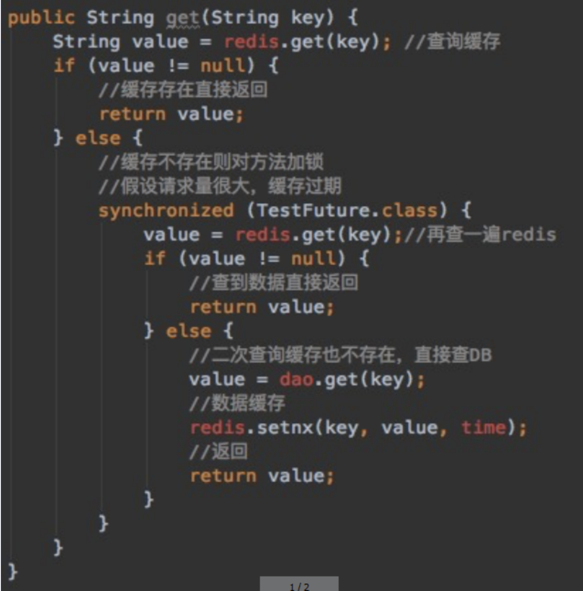

## 02、canal

### 是什么？

canal [kə'næl]，中文翻译为 水道/管道/沟渠/运河，主要用途是用于 MySQL 数据库增量日志数据的订阅、消费和解析，是阿里巴巴开发并开源的，采用Java语言开发；

历史背景是早期阿里巴巴因为杭州和美国双机房部署，存在跨机房数据同步的业务需求，实现方式主要是基于业务 trigger（触发器） 获取增量变更。从2010年开始，阿里巴巴逐步尝试采用解析数据库日志获取增量变更进行同步，由此衍生出了canal项目；

[官网地址](https://github.com/alibaba/canal/wiki)

一句话：

canal [kə'næl]，译意为水管/管道/沟渠，主要用途是基于MYSQL数据库增量日志解析，提供增量数据订阅和消费

### 能干嘛？

- 数据库镜像
- 数据库实时备份
- 索引构建和实时维护（拆分异构索引、倒排索引等）
- 业务cache刷新
- 带业务逻辑的增量数据处理

### 去哪下？

[下载地址](https://github.com/alibaba/canal/releases/tag/canal-1.1.6)

## 03、工作原理，面试回答

**传统MYSQL主从复制工作原理**

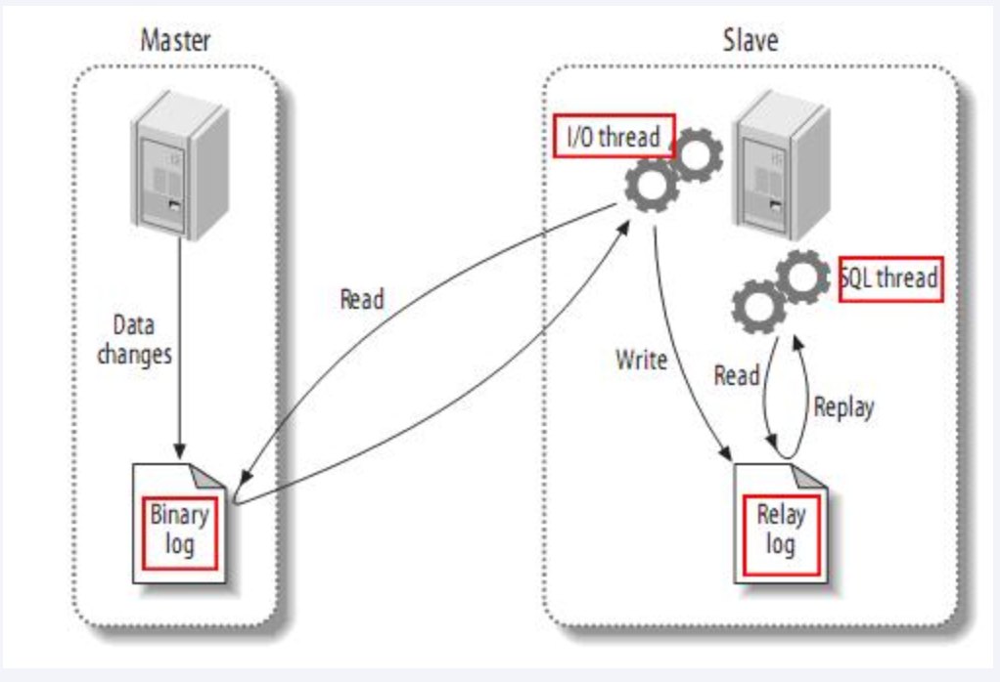

MySQL的主从复制将经过如下步骤：

1、当 master 主服务器上的数据发生改变时，则将其改变写入二进制事件日志文件中；

2、salve 从服务器会在一定时间间隔内对 master 主服务器上的二进制日志进行探测，探测其是否发生过改变，

如果探测到 master 主服务器的二进制事件日志发生了改变，则开始一个 I/O Thread 请求 master 二进制事件日志；

3、同时 master 主服务器为每个 I/O Thread 启动一个dump Thread，用于向其发送二进制事件日志；

4、slave 从服务器将接收到的二进制事件日志保存至自己本地的中继日志文件中；

5、salve 从服务器将启动 SQL Thread 从中继日志中读取二进制日志，在本地重放，使得其数据和主服务器保持一致；

6、最后 I/O Thread 和 SQL Thread 将进入睡眠状态，等待下一次被唤醒；

**canal工作原理**

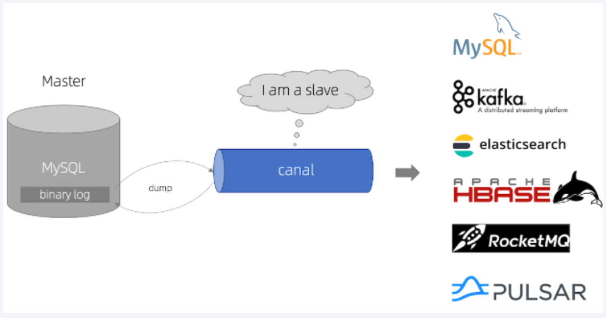

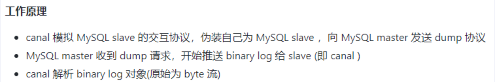

## 04、mysql-canal-redis双写一致性Coding

> **java案例，来源出处：https://github.com/alibaba/canal/wiki/ClientExample**

> **mysql**

- 查看mysql版本

```sql
SELECT VERSION();
```

- 查看当前的主机二进制日志

```sql
show master status;
```

- 查看 SHOW VARIABLES LIKE ‘log_bin’;

```sql
SHOW VARIABLES LIKE 'log_bin';
```

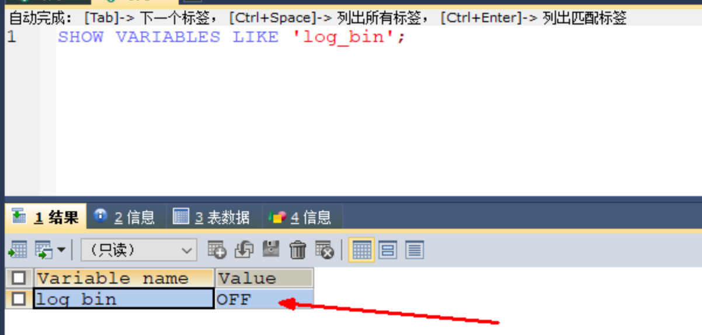

- 开启MYSQL的binlog写入功能

提完做好备份

mysql

```my.cnf
log-bin=mysql-bin #开启 binlog
binlog-format=ROW #选择 ROW 模式
server_id=1    #配置MySQL replaction需要定义，不要和canal的 slaveId重复
```

- ROW模式 除了记录sql语句之外，还会记录每个字段的变化情况，能够清楚的记录每行数据的变化历史，但会占用较多的空间。

- STATEMENT模式只记录了sql语句，但是没有记录上下文信息，在进行数据恢复的时候可能会导致数据的丢失情况；

- MIX模式比较灵活的记录，理论上说当遇到了表结构变更的时候，就会记录为statement模式。当遇到了数据更新或者删除情况下就会变为row模式；

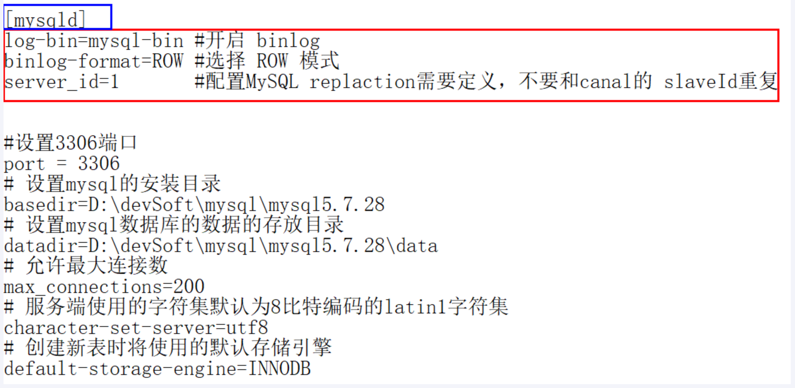

window     my.ini

linux       my.cnf

- 重启MYSQL

```sh
# Mac
sudo /usr/local/mysql/support-files/mysql.server restart
```

- 再次查看 `SHOW VARIABLES LIKE 'log_bin';`

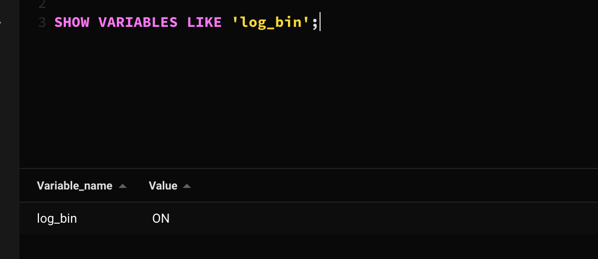

- 授权canal连接MySQL账号

mysql默认的用户在mysql库的user表中

```sql
SELECT * FROM mysql.`user`
```

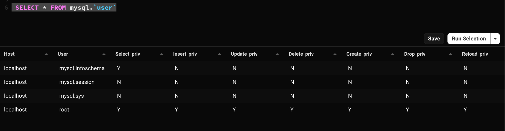

默认没有canal账户，此处新建+授权

```sql
DROP USER IF EXISTS 'canal'@'%';
CREATE USER 'canal'@'%' IDENTIFIED BY 'canal';  
GRANT ALL PRIVILEGES ON *.* TO 'canal'@'%' IDENTIFIED BY 'canal';  
FLUSH PRIVILEGES;

SELECT * FROM mysql.user;
```

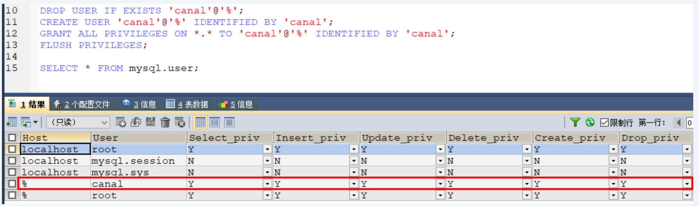

这里有一个问题：（mac可以试试下面的）

```sql
CREATE USER canal IDENTIFIED BY 'canal';  
GRANT SELECT, REPLICATION SLAVE, REPLICATION CLIENT ON *.* TO 'canal'@'%';
-- GRANT ALL PRIVILEGES ON *.* TO 'canal'@'%' ;
FLUSH PRIVILEGES;
```

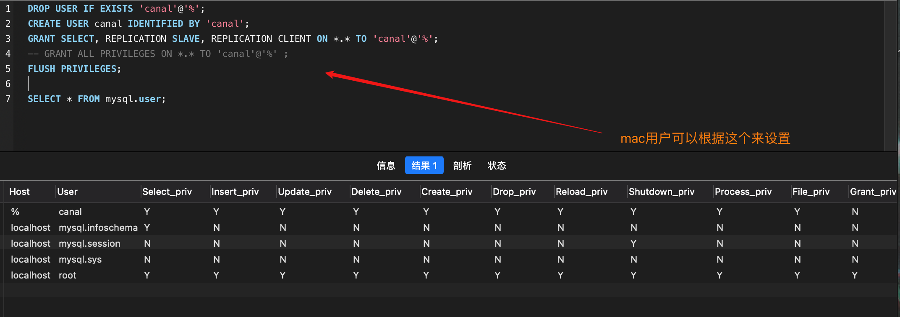

> canal服务端

1.下载

下载地址[Release v1.1.6 · alibaba/canal (github.com)](https://github.com/alibaba/canal/releases/tag/canal-1.1.6)

下载Linux版本：[canal.deployer-1.1.6.tar.gz (github.com)](https://github.com/alibaba/canal/releases/download/canal-1.1.6/canal.deployer-1.1.6.tar.gz)

2.解压

解压后整体放在/mycanal路径下

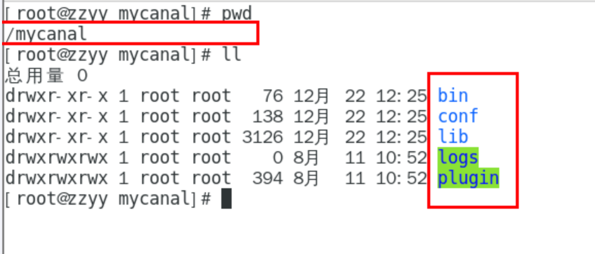

3.配置

修改/mycanal/conf/example路径下instance.properties文件

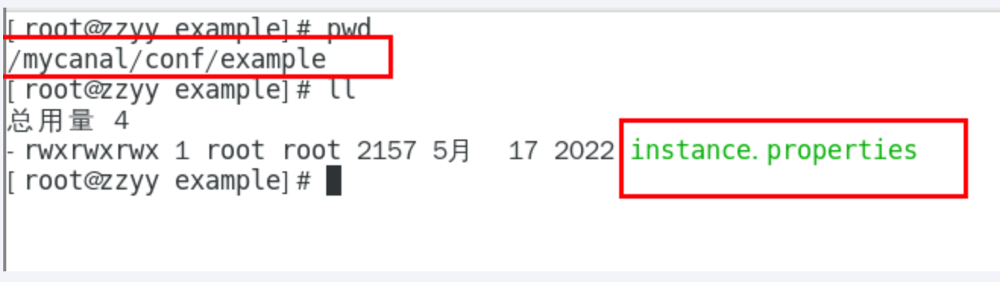

**instance.properties**

换成自己的mysql主机master的IP地址

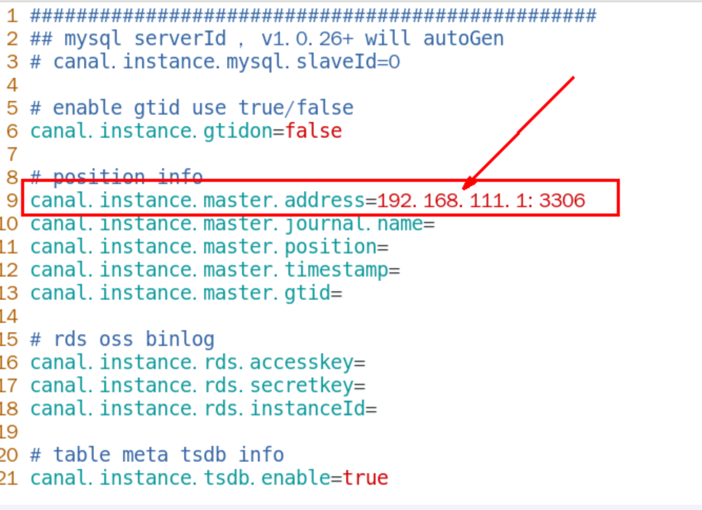

换成自己的在mysql上新建的canal账户

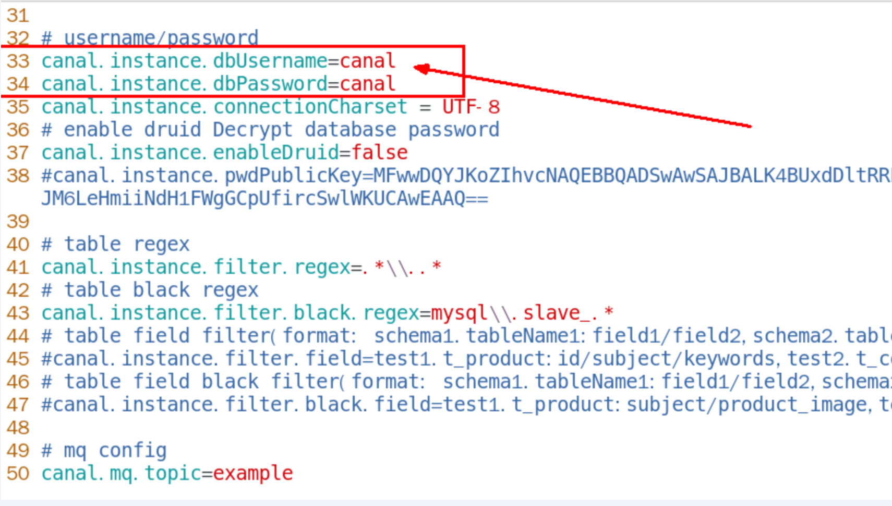

4.启动

/opt/mycanal/bin目录下执行

```sh
./startup.sh
```

5.查看

判断canal是否启动成功

- 查看server日志

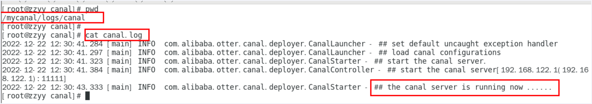

- 查看样例example的日志

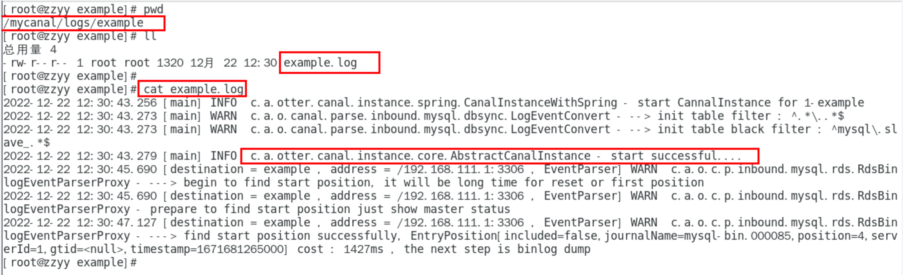

记录：[解决Canal Cannot allocate memory服务器内存不足问题，闪退]([Canal startup启动内存不足问题](https://blog.csdn.net/weixin_43495317/article/details/104618660))

> canal客户端（Java编写业务程序）

1.SQL脚本

随便选个数据库，以你自己为主，本例bigdata，按照下面建表

```sql
CREATE TABLE `t_user` (

  `id` bigint(20) NOT NULL AUTO_INCREMENT,

  `userName` varchar(100) NOT NULL,

  PRIMARY KEY (`id`)

) ENGINE=InnoDB AUTO_INCREMENT=10 DEFAULT CHARSET=utf8mb4;
```

2.建module

canal_demo02

3.写POM

```xml
<?xml version="1.0" encoding="UTF-8"?>
<project xmlns="http://maven.apache.org/POM/4.0.0" xmlns:xsi="http://www.w3.org/2001/XMLSchema-instance"
         xsi:schemaLocation="http://maven.apache.org/POM/4.0.0 https://maven.apache.org/xsd/maven-4.0.0.xsd">
    <modelVersion>4.0.0</modelVersion>

    <groupId>com.atguigu.canal</groupId>
    <artifactId>canal_demo02</artifactId>
    <version>1.0-SNAPSHOT</version>

    <parent>
        <groupId>org.springframework.boot</groupId>
        <artifactId>spring-boot-starter-parent</artifactId>
        <version>2.5.14</version>
        <relativePath/>
    </parent>

    <properties>
        <project.build.sourceEncoding>UTF-8</project.build.sourceEncoding>
        <maven.compiler.source>1.8</maven.compiler.source>
        <maven.compiler.target>1.8</maven.compiler.target>
        <junit.version>4.12</junit.version>
        <log4j.version>1.2.17</log4j.version>
        <lombok.version>1.16.18</lombok.version>
        <mysql.version>5.1.47</mysql.version>
        <druid.version>1.1.16</druid.version>
        <mapper.version>4.1.5</mapper.version>
        <mybatis.spring.boot.version>1.3.0</mybatis.spring.boot.version>
    </properties>

    <dependencies>
        <!--canal-->
        <dependency>
            <groupId>com.alibaba.otter</groupId>
            <artifactId>canal.client</artifactId>
            <version>1.1.0</version>
        </dependency>
        <!--SpringBoot通用依赖模块-->
        <dependency>
            <groupId>org.springframework.boot</groupId>
            <artifactId>spring-boot-starter-web</artifactId>
        </dependency>
        <dependency>
            <groupId>org.springframework.boot</groupId>
            <artifactId>spring-boot-starter-actuator</artifactId>
        </dependency>
        <!--swagger2-->
        <dependency>
            <groupId>io.springfox</groupId>
            <artifactId>springfox-swagger2</artifactId>
            <version>2.9.2</version>
        </dependency>
        <dependency>
            <groupId>io.springfox</groupId>
            <artifactId>springfox-swagger-ui</artifactId>
            <version>2.9.2</version>
        </dependency>
        <!--SpringBoot与Redis整合依赖-->
        <dependency>
            <groupId>org.springframework.boot</groupId>
            <artifactId>spring-boot-starter-data-redis</artifactId>
        </dependency>
        <dependency>
            <groupId>org.apache.commons</groupId>
            <artifactId>commons-pool2</artifactId>
        </dependency>
        <!--SpringBoot与AOP-->
        <dependency>
            <groupId>org.springframework.boot</groupId>
            <artifactId>spring-boot-starter-aop</artifactId>
        </dependency>
        <dependency>
            <groupId>org.aspectj</groupId>
            <artifactId>aspectjweaver</artifactId>
        </dependency>
        <!--Mysql数据库驱动-->
        <dependency>
            <groupId>mysql</groupId>
            <artifactId>mysql-connector-java</artifactId>
            <version>5.1.47</version>
        </dependency>
        <!--SpringBoot集成druid连接池-->
        <dependency>
            <groupId>com.alibaba</groupId>
            <artifactId>druid-spring-boot-starter</artifactId>
            <version>1.1.10</version>
        </dependency>
        <dependency>
            <groupId>com.alibaba</groupId>
            <artifactId>druid</artifactId>
            <version>${druid.version}</version>
        </dependency>
        <!--mybatis和springboot整合-->
        <dependency>
            <groupId>org.mybatis.spring.boot</groupId>
            <artifactId>mybatis-spring-boot-starter</artifactId>
            <version>${mybatis.spring.boot.version}</version>
        </dependency>
        <!--通用基础配置junit/devtools/test/log4j/lombok/hutool-->
        <!--hutool-->
        <dependency>
            <groupId>cn.hutool</groupId>
            <artifactId>hutool-all</artifactId>
            <version>5.2.3</version>
        </dependency>
        <dependency>
            <groupId>junit</groupId>
            <artifactId>junit</artifactId>
            <version>${junit.version}</version>
        </dependency>
        <dependency>
            <groupId>org.springframework.boot</groupId>
            <artifactId>spring-boot-starter-test</artifactId>
            <scope>test</scope>
        </dependency>
        <dependency>
            <groupId>log4j</groupId>
            <artifactId>log4j</artifactId>
            <version>${log4j.version}</version>
        </dependency>
        <dependency>
            <groupId>org.projectlombok</groupId>
            <artifactId>lombok</artifactId>
            <version>${lombok.version}</version>
            <optional>true</optional>
        </dependency>
        <!--persistence-->
        <dependency>
            <groupId>javax.persistence</groupId>
            <artifactId>persistence-api</artifactId>
            <version>1.0.2</version>
        </dependency>
        <!--通用Mapper-->
        <dependency>
            <groupId>tk.mybatis</groupId>
            <artifactId>mapper</artifactId>
            <version>${mapper.version}</version>
        </dependency>
        <dependency>
            <groupId>org.springframework.boot</groupId>
            <artifactId>spring-boot-autoconfigure</artifactId>
        </dependency>
        <dependency>
            <groupId>redis.clients</groupId>
            <artifactId>jedis</artifactId>
            <version>3.8.0</version>
        </dependency>
    </dependencies>

    <build>
        <plugins>
            <plugin>
                <groupId>org.springframework.boot</groupId>
                <artifactId>spring-boot-maven-plugin</artifactId>
            </plugin>
        </plugins>
    </build>

</project>
```

4.写YML

```properties
server.port=5555

# ========================alibaba.druid=====================
spring.datasource.type=com.alibaba.druid.pool.DruidDataSource
spring.datasource.driver-class-name=com.mysql.jdbc.Driver
spring.datasource.url=jdbc:mysql://localhost:3306/bigdata?useUnicode=true&characterEncoding=utf-8&useSSL=false
spring.datasource.username=root
spring.datasource.password=123456
spring.datasource.druid.test-while-idle=false
```

5.主启动

```java
import com.alibaba.druid.spring.boot.autoconfigure.DruidDataSourceAutoConfigure;
import org.springframework.boot.SpringApplication;
import org.springframework.boot.autoconfigure.SpringBootApplication;

@SpringBootApplication
public class CanalDemo02App
{

     //本例不要启动CanalDemo02App实例
}
```

6.业务类

RedisUtils

```java
import redis.clients.jedis.Jedis;
import redis.clients.jedis.JedisPool;
import redis.clients.jedis.JedisPoolConfig;

/**
 * @auther zzyy
 * @create 2022-12-22 12:42
 */
public class RedisUtils
{
    public static final String  REDIS_IP_ADDR = "192.168.111.185";
    public static final String  REDIS_pwd = "111111";
    public static JedisPool jedisPool;

    static {
        JedisPoolConfig jedisPoolConfig=new JedisPoolConfig();
        jedisPoolConfig.setMaxTotal(20);
        jedisPoolConfig.setMaxIdle(10);
        jedisPool=new JedisPool(jedisPoolConfig,REDIS_IP_ADDR,6379,10000,REDIS_pwd);
    }

    public static Jedis getJedis() throws Exception {
        if(null!=jedisPool){
            return jedisPool.getResource();
        }
        throw new Exception("Jedispool is not ok");
    }

}
```

RedisCanalClientExample

```java
import com.alibaba.fastjson.JSONObject;
import com.alibaba.otter.canal.client.CanalConnector;
import com.alibaba.otter.canal.client.CanalConnectors;
import com.alibaba.otter.canal.protocol.CanalEntry.*;
import com.alibaba.otter.canal.protocol.Message;
import com.atguigu.canal.util.RedisUtils;
import redis.clients.jedis.Jedis;
import java.net.InetSocketAddress;
import java.util.List;
import java.util.UUID;
import java.util.concurrent.TimeUnit;

public class RedisCanalClientExample
{
    public static final Integer _60SECONDS = 60;
    public static final String  REDIS_IP_ADDR = "192.168.111.185";

    private static void redisInsert(List<Column> columns)
    {
        JSONObject jsonObject = new JSONObject();
        for (Column column : columns)
        {
            System.out.println(column.getName() + " : " + column.getValue() + "    update=" + column.getUpdated());
            jsonObject.put(column.getName(),column.getValue());
        }
        if(columns.size() > 0)
        {
            try(Jedis jedis = RedisUtils.getJedis())
            {
                jedis.set(columns.get(0).getValue(),jsonObject.toJSONString());
            }catch (Exception e){
                e.printStackTrace();
            }
        }
    }


    private static void redisDelete(List<Column> columns)
    {
        JSONObject jsonObject = new JSONObject();
        for (Column column : columns)
        {
            jsonObject.put(column.getName(),column.getValue());
        }
        if(columns.size() > 0)
        {
            try(Jedis jedis = RedisUtils.getJedis())
            {
                jedis.del(columns.get(0).getValue());
            }catch (Exception e){
                e.printStackTrace();
            }
        }
    }

    private static void redisUpdate(List<Column> columns)
    {
        JSONObject jsonObject = new JSONObject();
        for (Column column : columns)
        {
            System.out.println(column.getName() + " : " + column.getValue() + "    update=" + column.getUpdated());
            jsonObject.put(column.getName(),column.getValue());
        }
        if(columns.size() > 0)
        {
            try(Jedis jedis = RedisUtils.getJedis())
            {
                jedis.set(columns.get(0).getValue(),jsonObject.toJSONString());
                System.out.println("---------update after: "+jedis.get(columns.get(0).getValue()));
            }catch (Exception e){
                e.printStackTrace();
            }
        }
    }

    public static void printEntry(List<Entry> entrys) {
        for (Entry entry : entrys) {
            if (entry.getEntryType() == EntryType.TRANSACTIONBEGIN || entry.getEntryType() == EntryType.TRANSACTIONEND) {
                continue;
            }

            RowChange rowChage = null;
            try {
                //获取变更的row数据
                rowChage = RowChange.parseFrom(entry.getStoreValue());
            } catch (Exception e) {
                throw new RuntimeException("ERROR ## parser of eromanga-event has an error,data:" + entry.toString(),e);
            }
            //获取变动类型
            EventType eventType = rowChage.getEventType();
            System.out.println(String.format("================&gt; binlog[%s:%s] , name[%s,%s] , eventType : %s",
                    entry.getHeader().getLogfileName(), entry.getHeader().getLogfileOffset(),
                    entry.getHeader().getSchemaName(), entry.getHeader().getTableName(), eventType));

            for (RowData rowData : rowChage.getRowDatasList()) {
                if (eventType == EventType.INSERT) {
                    redisInsert(rowData.getAfterColumnsList());
                } else if (eventType == EventType.DELETE) {
                    redisDelete(rowData.getBeforeColumnsList());
                } else {//EventType.UPDATE
                    redisUpdate(rowData.getAfterColumnsList());
                }
            }
        }
    }


    public static void main(String[] args)
    {
        System.out.println("---------O(∩_∩)O哈哈~ initCanal() main方法-----------");

        //=================================
        // 创建链接canal服务端
        CanalConnector connector = CanalConnectors.newSingleConnector(new InetSocketAddress(REDIS_IP_ADDR,
                11111), "example", "", "");
        int batchSize = 1000;
        //空闲空转计数器
        int emptyCount = 0;
        System.out.println("---------------------canal init OK，开始监听mysql变化------");
        try {
            connector.connect();
            //connector.subscribe(".*\\..*");
            connector.subscribe("bigdata.t_user");
            connector.rollback();
            int totalEmptyCount = 10 * _60SECONDS;
            while (emptyCount < totalEmptyCount) {
                System.out.println("我是canal，每秒一次正在监听:"+ UUID.randomUUID().toString());
                Message message = connector.getWithoutAck(batchSize); // 获取指定数量的数据
                long batchId = message.getId();
                int size = message.getEntries().size();
                if (batchId == -1 || size == 0) {
                    emptyCount++;
                    try { TimeUnit.SECONDS.sleep(1); } catch (InterruptedException e) { e.printStackTrace(); }
                } else {
                    //计数器重新置零
                    emptyCount = 0;
                    printEntry(message.getEntries());
                }
                connector.ack(batchId); // 提交确认
                // connector.rollback(batchId); // 处理失败, 回滚数据
            }
            System.out.println("已经监听了"+totalEmptyCount+"秒，无任何消息，请重启重试......");
        } finally {
            connector.disconnect();
        }
    }
}
```

题外话

java程序下connector.subscribe配置的过滤正则

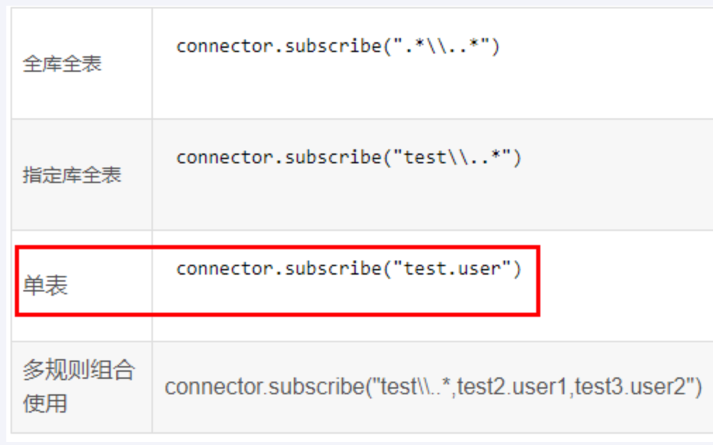

关闭资源代码简写

try-with-resources释放资源

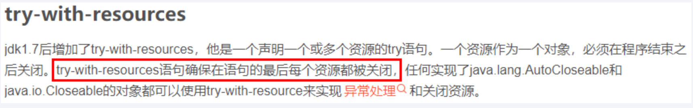
