---
# 当前页面内容标题
title: 五、案例落地实战bitmap:hyperloglog:GEO
# 分类
category:
  - redis
# 标签
tag: 
  - redis
  - NOSQL
  - K,V缓存数据库
  - 非关系型数据库
sticky: false
# 是否收藏在博客主题的文章列表中，当填入数字时，数字越大，排名越靠前。
star: false
# 是否将该文章添加至文章列表中
article: true
# 是否将该文章添加至时间线中
timeline: true
---

## 01、先看看大厂真实需求+面试题反馈

**面试题1**

- 抖音电商直播，主播介绍的商品有评论，1个商品对应1系列的评论，排序+展现+取前10条记录
- 用户在手机APP上的签到打卡信息：1天对应1系列用户的签到记录，新浪微博、钉钉打卡签到，来没来如何设计？
- 应用网站上的网页访问信息：1个网页对应1系列的访问点击，淘宝网首页，每天有多少人浏览首页？
- 你们公司系统上线后，说一下UV、PV、DAU分别是多少？
- 。。。。。。

**面试题2**

面试问

> 记录对集合中的数据进行统计

- 在移动应用中，需要统计每天的新增用户数和第2天的留存用户数；
- 在电商网站的商品评论中，需要统计评论列表中的最新评论；
- 在签到打卡中，需要统计一个月内连续打卡的用户数；
- 在网页访问记录中，需要统计独立访客（Unique Visitor，UV）量。
- 。。。。。。

痛点：

 类似今日头条、抖音、淘宝这样的额用户访问级别都是亿级的，请问如何处理？

**需求痛点**

- 亿级数据的手机+清洗+统计+展现
- 一句话：`存的进+取的快+多维度`
- 真正有价值的是统计。。。

## 02、统计的类型有哪些？

> 亿级系统中常见的四种统计

**聚合统计**

- 统计多个集合元素的聚合结果，就是前面的`交差并等集合统计`
- 复习命令

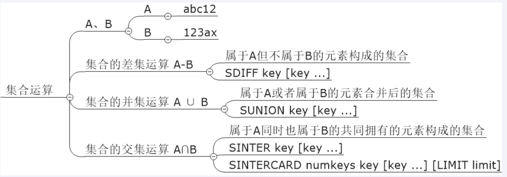

- 交并差集和聚合函数的应用

**排序统计**

- 抖音短视频最新评论留言的场景，请你设计一个展现列表。
  
  考察你的数据结构和设计思路

- 设计案例和回答思路

**以抖音vcr最新的留言评价为案例，所有评论需要两个功能，按照时间排序(正序、反序)+分页显示**

 **能够排序+分页显示的redis数据结构是什么合适？**


`answer`

zset

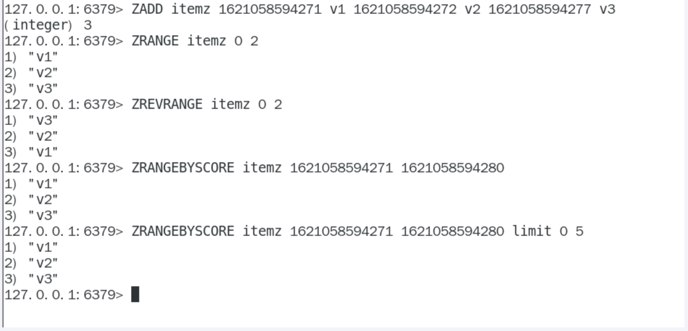

在面对需要展示最新列表、排行榜等场景时，如果数据更新频繁或者需要分页显示，建议使用`Zset`

**二值统计**

- 在集合元素的取值只有0和1两种。
  
  在钉钉上班签到打卡的场景中，我们只用记录有签到(1)或没有签到(0)

- 使用bitmap

**基数统计**

- 指统计一个集合中不重复元素个数
- 使用hyperloglog

## 03、hyperloglog

### 说名词，谈谈行资

> 什么是UV

Unique Visitor，独立访客，一般理解为客户端IP

**需要考虑去重**

> 什么是PV

Page View，页面浏览量

不用去重

> 什么是DAU

**Daily Active User**

- 日活跃用户量：登录或者使用了某个产品的用户数（去重复登录的用户）
- 常用于反映网站、互联网应用或者网络游戏的运营状态

> 什么是MAU

Monthly Active User

- 月活跃用户量

假如上述术语，你不知道o(╥﹏╥)o

### 看需求

很多计数类场景，比如 每日注册 IP 数、每日访问 IP 数、页面实时访问数 PV、访问用户数 UV等。

因为主要的目标高效、巨量地进行计数，所以对存储的数据的内容并不太关心。

也就是说它只能用于统计巨量数量，不太涉及具体的统计对象的内容和精准性。

统计单日一个页面的访问量(PV)，单次访问就算一次。

统计单日一个页面的用户访问量(UV)，即按照用户为维度计算，单个用户一天内多次访问也只算一次。

多个key的合并统计，某个门户网站的所有模块的PV聚合统计就是整个网站的总PV。

### 是什么（基础篇讲过，快速复习一下）

**基数**

- 是一种数据集，去重后的真实个数
- 案例Case

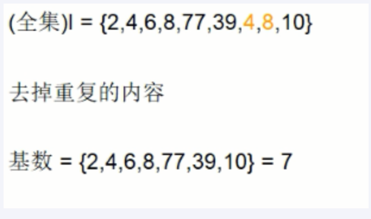

**去重复统计功能的基数估计算法-就是Hyperloglog**

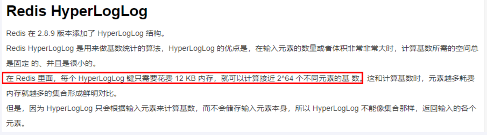

基数统计：用于同一一个集合中不重复的元素个数，就是对集合去重复后剩余元素的计算

一句话：去重脱水后的真实数据

基本命令


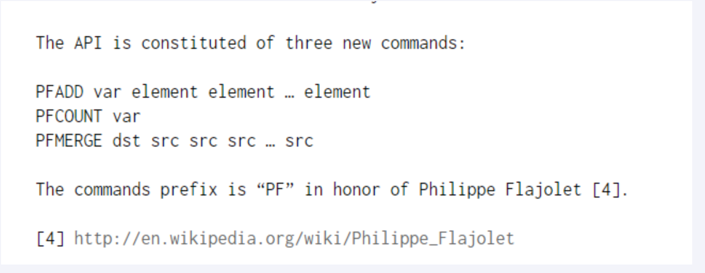

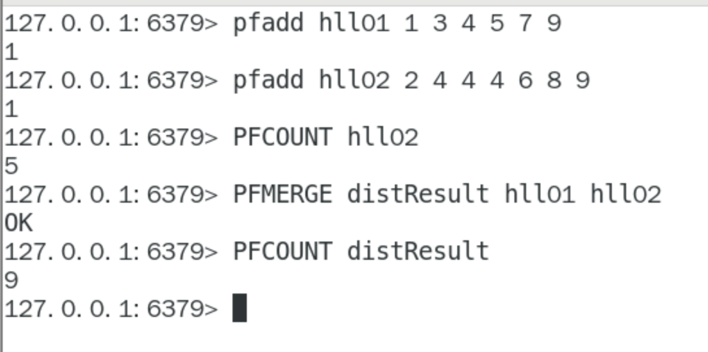

### HyperLoglog如何做的？如何演化而来的？

基数统计就是HyperLoglog

去重复统计你会先想到哪些方式？

- HashSet

- bitmap

如果数据显较大亿级统计,使用bitmaps同样会有这个问题。

bitmap是通过用位bit数组来表示各元素是否出现，每个元素对应一位，所需的总内存为N个bit。

基数计数则将每一个元素对应到bit数组中的其中一位，比如bit数组010010101(按照从零开始下标，有的就是1、4、6、8)。

新进入的元素只需要将已经有的bit数组和新加入的元素进行按位或计算就行。这个方式能大大减少内存占用且位操作迅速。

But，假设一个样本案例就是一亿个基数位值数据，一个样本就是一亿

如果要统计1亿个数据的基数位值,`大约需要内存100000000/8/1024/1024约等于12M`,内存减少占用的效果显著。

这样得到统计一个对象样本的基数值需要12M。

如果统计10000个对象样本(1w个亿级),就需要117.1875G将近120G，可见使用bitmaps还是不适用大数据量下(亿级)的基数计数场景，

`但是bitmaps方法是精确计算的。`

>   结论

样本元素越多内存消耗急剧增大，难以管控+各种慢，对于亿级统计不太合适，大数据害死人，o(╥﹏╥)o

量变引起质变

>   办法

**概率算法**

`通过牺牲准确率来换取空间`，对于不要求`绝对准确率`的场景下可以使用，因为`概率算法不直接存储数据本身`，

通过一定的概率统计方法预估基数值，同时保证误差在一定范围内，由于又不储存数据故此可以大大节约内存。

`HyperLogLog就是一种概率算法的实现。`

>   `原理说明`

- `只是进行不重复的基数统计，不是集合也不保存数据，只是记录数量而不是具体内容。`
- 有误差
  - HyperLoglog提供不精确的去重计数方案
  - `牺牲准确率来换取空间，该误差仅仅只是0.81%左右`
- 这个误差如何来的？论文地址和出处
  - http://antirez.com/news/75
  - `Redis之父安特雷兹回答：`

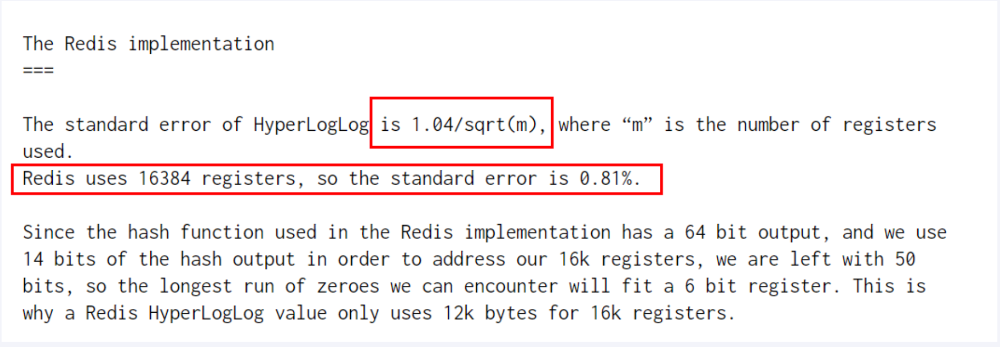

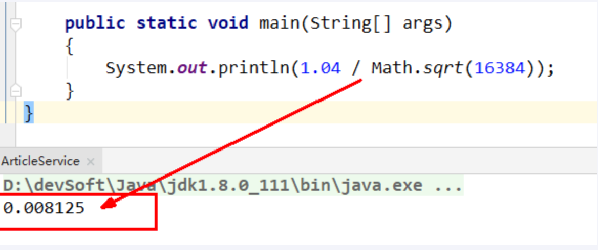

### 淘宝网首页亿级UV的Redis统计方案

>   需求

- UV统计需要去重，一个用户一天内的多次访问只能算作一次
- 淘宝，天猫首页的UV，平均每天是1~1.5亿左右
- 每天存1.5亿的IP，访问者来了后先去查看是否存在，不存在加入

>   方案讨论

- 用mysql：傻X，o(╥﹏╥)o，不解释
- 用redis的hash数据存储

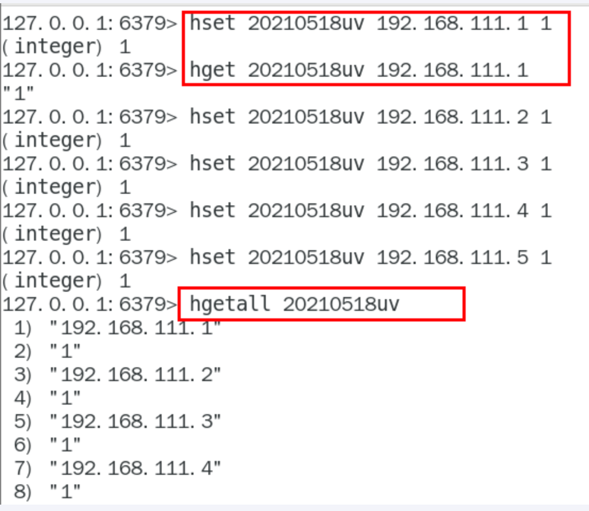

**说明**

redis——hash = <keyDay,<ip,1>>

按照ipv4的结构来说明，每个ipv4的地址最多是15个字节(ip = "192.168.111.1"，最多xxx.xxx.xxx.xxx)

某一天的1.5亿 * 15个字节= 2G，一个月60G，redis死定了。o(╥﹏╥)o

- hyperloglog

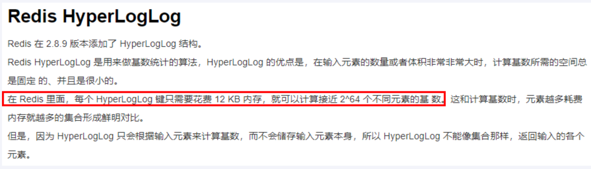

**为什么是只需要花费12Kb？**

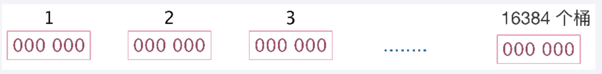

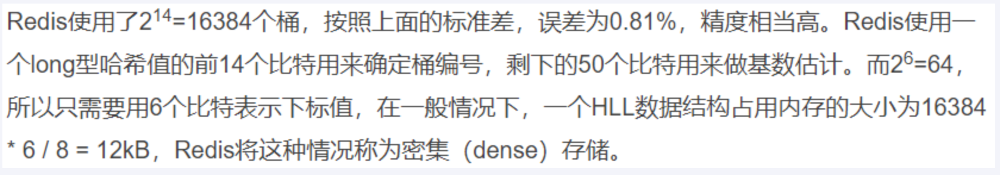

>   HyperLoglogService

```java
import lombok.extern.slf4j.Slf4j;
import org.springframework.data.redis.core.RedisTemplate;
import org.springframework.stereotype.Service;

import javax.annotation.PostConstruct;
import javax.annotation.Resource;
import java.util.Random;
import java.util.concurrent.TimeUnit;

/**
 * @auther zzyy
 * @create 2021-05-02 18:16
 */
@Service
@Slf4j
public class HyperLogLogService
{
    @Resource
    private RedisTemplate redisTemplate;

    /**
     * 模拟后台有用户点击首页，每个用户来自不同ip地址
     */
    @PostConstruct
    public void init()
    {
        log.info("------模拟后台有用户点击首页，每个用户来自不同ip地址");
        new Thread(() -> {
            String ip = null;
            for (int i = 1; i <=200; i++) {
                Random r = new Random();
                ip = r.nextInt(256) + "." + r.nextInt(256) + "." + r.nextInt(256) + "." + r.nextInt(256);

                Long hll = redisTemplate.opsForHyperLogLog().add("hll", ip);
                log.info("ip={},该ip地址访问首页的次数={}",ip,hll);
                //暂停几秒钟线程
                try { TimeUnit.SECONDS.sleep(3); } catch (InterruptedException e) { e.printStackTrace(); }
            }
        },"t1").start();
    }

}
```

>   HyperLoglogController

```java
import io.swagger.annotations.Api;
import io.swagger.annotations.ApiOperation;
import lombok.extern.slf4j.Slf4j;
import org.springframework.data.redis.core.RedisTemplate;
import org.springframework.web.bind.annotation.RequestMapping;
import org.springframework.web.bind.annotation.RequestMethod;
import org.springframework.web.bind.annotation.RestController;

import javax.annotation.Resource;

/**
 * @auther zzyy
 * @create 2021-05-02 18:16
 */
@Api(description = "淘宝亿级UV的Redis统计方案")
@RestController
@Slf4j
public class HyperLogLogController
{
    @Resource
    private RedisTemplate redisTemplate;

    @ApiOperation("获得IP去重后的首页访问量")
    @RequestMapping(value = "/uv",method = RequestMethod.GET)
    public long uv()
    {
        //pfcount
        return redisTemplate.opsForHyperLogLog().size("hll");
    }

}
```

## 04、GEO

### Redis之GEO

>   大厂面试题简介

**面试题说明：**

移动互联网时代LBS应用越来越多，交友软件中附近的小姐姐、外卖软件中附近的美食店铺、打车软件附近的车辆等等。

那这种附近各种形形色色的XXX地址位置选择是如何实现的？

会有什么问题呢？

1.查询性能问题，如果并发高，数据量大这种查询是要搞垮mysql数据库的

2.一般mysql查询的是一个平面矩形访问，而叫车服务要以我为中心N公里为半径的圆形覆盖。

3.精准度的问题，我们知道地球不是平面坐标系，而是一个圆球，这种矩形计算在长距离计算时会有很大误差，mysql不合适

>   地址只是说明

**经纬度**

经度与纬度的合称组成一个坐标系统。又称为地理坐标系统，它是一种利用三度空间的球面来定义地球上的空间的球面坐标系统，能够标示地球上的任何一个位置。

**经线和纬线**

是人们为了在地球上确定位置和方向的，在地球仪和地图上画出来的，地面上并线。

`和经线相垂直的线叫做纬线(纬线指示东西方向)。纬线是一条条长度不等的圆圈。最长的纬线就是赤道。 `

因为经线指示南北方向，所以经线又叫子午线。 国际上规定，把通过英国格林尼治天文台原址的经线叫做0°所以经线也叫本初子午线。`在地球上经线指示南北方向，纬线指示东西方向。`

东西半球分界线：东经160° 西经20°

**经度和维度**

`经度(longitude)：东经为正数，西经为负数。东西经`

`纬度(latitude)：北纬为正数，南纬为负数。南北纬`

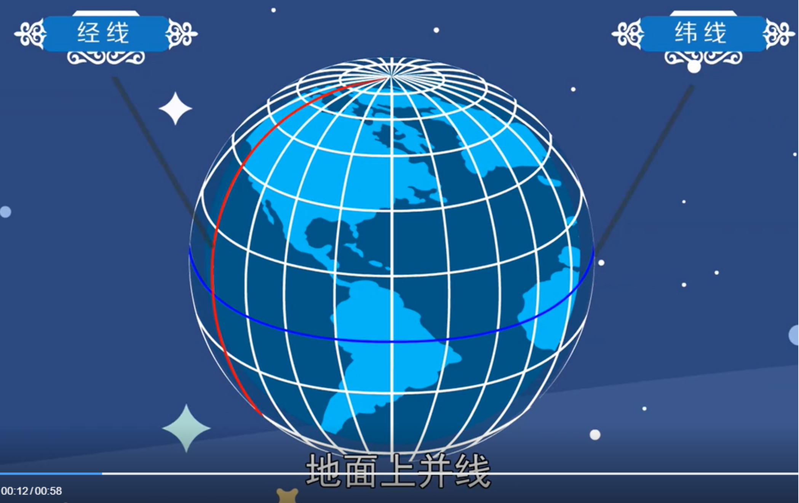

>    如何获得某个地址的经纬度？
> 
>   [拾取坐标系统 (baidu.com)](http://api.map.baidu.com/lbsapi/getpoint/)

>   命令复习，第二次

- GEOADD添加经纬度坐标

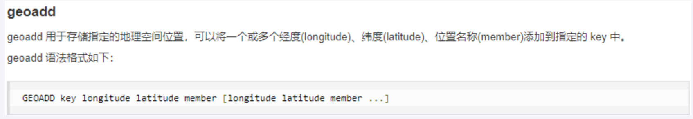


命令如下：

```sh
GEOADD city 116.403963 39.915119 "天安门" 116.403414 39.924091 "故宫" 116.024067 40.362639 "长城"
```

中文乱码如何处理

```sh
[root@localhost ~]# redis-cli --raw
127.0.0.1:6379> 
```

- GEOPOS返回经纬度

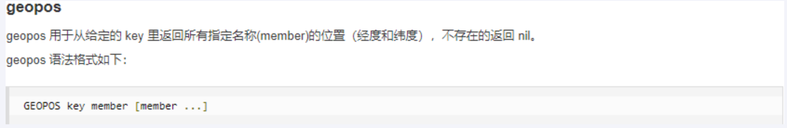

```sh
GEOPOS city 天安门 故宫
```

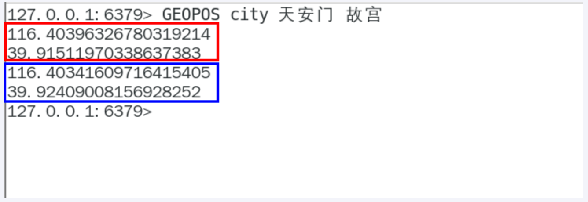

- GEOHASH返回坐标的geohash表示

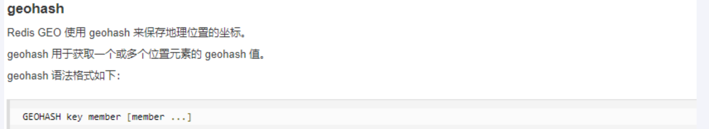

```sh
GEOHASH city 天安门 故宫 长城
```

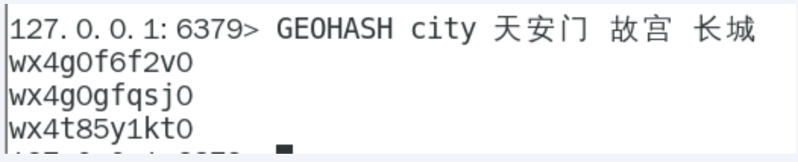

geohash算法生成的base32编码值

三维变二维变一维

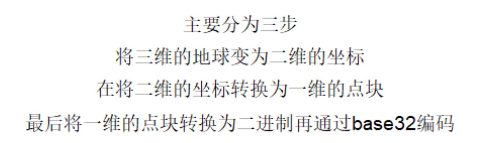

- GEODIST两个位置之间的距离


```sh
GEODIST city 天安门 长城 km
```

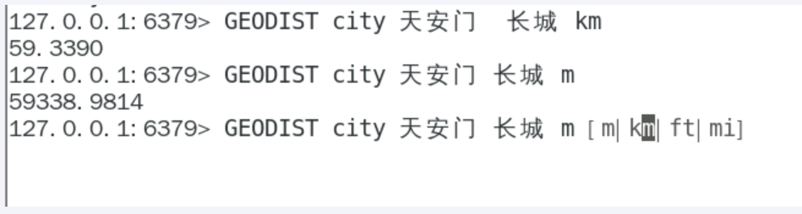

后面参数是距离单位：

- m 米
- km 千米
- ft 英尺
- mi 英里

---

- GEORADIUS

georadius 以给定的经纬度为中心， 返回键包含的位置元素当中， 与中心的距离不超过给定最大距离的所有位置元素。

GEORADIUS city 116.418017 39.914402 10 km withdist withcoord count 10 withhash desc

GEORADIUS city 116.418017 39.914402 10 km withdist withcoord count 10 desc

```
WITHDIST: 在返回位置元素的同时， 将位置元素与中心之间的距离也一并返回。 距离的单位和用户给定的范围单位保持一致。

WITHCOORD: 将位置元素的经度和维度也一并返回。

WITHHASH: 以 52 位有符号整数的形式， 返回位置元素经过原始 geohash 编码的有序集合分值。 这个选项主要用于底层应用或者调试， 实际中的作用并不大

COUNT 限定返回的记录数。
```

 `当前位置(116.418017 39.914402),阳哥在王府井`

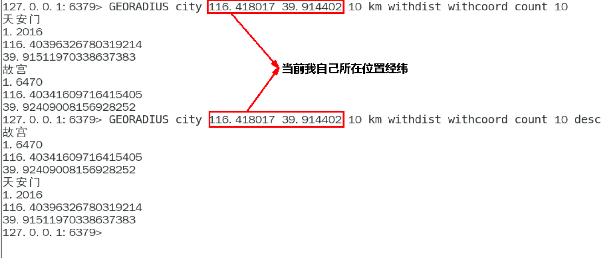

以半径为中心，查找附近的XXX

- GEORADIUSBYMEMBER

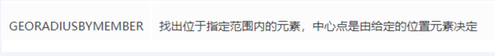

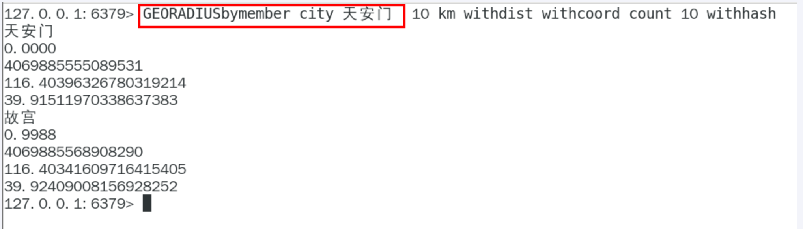

### 美团地图位置附近的酒店推送

>   需求分析

- 美团app附近的酒店


- 摇个妹子，附近的妹子


- 高德地图附近的人或者一公里以内的各种营业厅、加油站、理发店、超市……

- 找个单车

- ……

>   架构设计

- Redis的新类型GEO

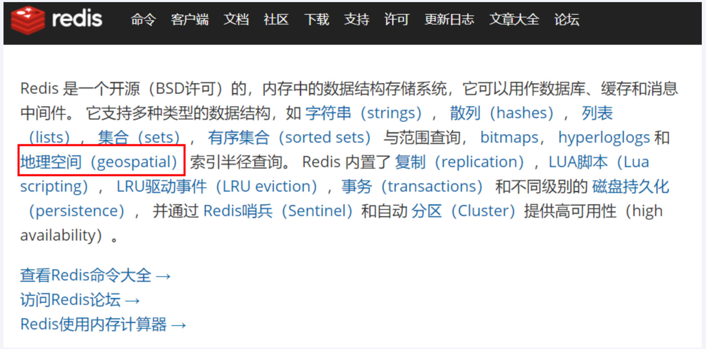

- [命令](http://www.redis.cn/commands/geoadd.html)

>   编码实现

**关键点**

GEORADIUS：以给定的经纬度为中心，找出某一半径内的元素

**GeoController**

```java
import com.atguigu.redis7.service.GeoService;
import io.swagger.annotations.Api;
import io.swagger.annotations.ApiOperation;
import lombok.extern.slf4j.Slf4j;
import org.springframework.data.geo.*;
import org.springframework.data.redis.connection.RedisGeoCommands;
import org.springframework.web.bind.annotation.GetMapping;
import org.springframework.web.bind.annotation.RequestMapping;
import org.springframework.web.bind.annotation.RequestMethod;
import org.springframework.web.bind.annotation.RestController;

import javax.annotation.Resource;
import java.util.HashMap;
import java.util.List;
import java.util.Map;

/**
 * @auther zzyy
 * @create 2022-12-25 12:12
 */
@Api(tags = "美团地图位置附近的酒店推送GEO")
@RestController
@Slf4j
public class GeoController
{
    @Resource
    private GeoService geoService;

    @ApiOperation("添加坐标geoadd")
    @RequestMapping(value = "/geoadd",method = RequestMethod.GET)
    public String geoAdd()
    {
        return geoService.geoAdd();
    }

    @ApiOperation("获取经纬度坐标geopos")
    @RequestMapping(value = "/geopos",method = RequestMethod.GET)
    public Point position(String member)
    {
        return geoService.position(member);
    }

    @ApiOperation("获取经纬度生成的base32编码值geohash")
    @RequestMapping(value = "/geohash",method = RequestMethod.GET)
    public String hash(String member)
    {
        return geoService.hash(member);
    }

    @ApiOperation("获取两个给定位置之间的距离")
    @RequestMapping(value = "/geodist",method = RequestMethod.GET)
    public Distance distance(String member1, String member2)
    {
        return geoService.distance(member1,member2);
    }

    @ApiOperation("通过经度纬度查找北京王府井附近的")
    @RequestMapping(value = "/georadius",method = RequestMethod.GET)
    public GeoResults radiusByxy()
    {
        return geoService.radiusByxy();
    }

    @ApiOperation("通过地方查找附近,本例写死天安门作为地址")
    @RequestMapping(value = "/georadiusByMember",method = RequestMethod.GET)
    public GeoResults radiusByMember()
    {
        return geoService.radiusByMember();
    }

}
```

**GeoService**

```java
import lombok.extern.slf4j.Slf4j;
import org.springframework.beans.factory.annotation.Autowired;
import org.springframework.data.geo.Distance;
import org.springframework.data.geo.GeoResults;
import org.springframework.data.geo.Metrics;
import org.springframework.data.geo.Point;
import org.springframework.data.geo.Circle;
import org.springframework.data.redis.connection.RedisGeoCommands;
import org.springframework.data.redis.core.RedisTemplate;
import org.springframework.stereotype.Service;
import org.springframework.web.bind.annotation.GetMapping;
import org.springframework.web.bind.annotation.RequestMapping;

import java.util.HashMap;
import java.util.List;
import java.util.Map;

/**
 * @auther zzyy
 * @create 2022-12-25 12:11
 */
@Service
@Slf4j
public class GeoService
{
    public static final String CITY ="city";

    @Autowired
    private RedisTemplate redisTemplate;

    public String geoAdd()
    {
        Map<String, Point> map= new HashMap<>();
        map.put("天安门",new Point(116.403963,39.915119));
        map.put("故宫",new Point(116.403414 ,39.924091));
        map.put("长城" ,new Point(116.024067,40.362639));

        redisTemplate.opsForGeo().add(CITY,map);

        return map.toString();
    }

    public Point position(String member) {
        //获取经纬度坐标
        List<Point> list= this.redisTemplate.opsForGeo().position(CITY,member);
        return list.get(0);
    }


    public String hash(String member) {
        //geohash算法生成的base32编码值
        List<String> list= this.redisTemplate.opsForGeo().hash(CITY,member);
        return list.get(0);
    }


    public Distance distance(String member1, String member2) {
        //获取两个给定位置之间的距离
        Distance distance= this.redisTemplate.opsForGeo().distance(CITY,member1,member2, RedisGeoCommands.DistanceUnit.KILOMETERS);
        return distance;
    }

    public GeoResults radiusByxy() {
        //通过经度，纬度查找附近的,北京王府井位置116.418017,39.914402
        Circle circle = new Circle(116.418017, 39.914402, Metrics.KILOMETERS.getMultiplier());
        //返回50条
        RedisGeoCommands.GeoRadiusCommandArgs args = RedisGeoCommands.GeoRadiusCommandArgs.newGeoRadiusArgs().includeDistance().includeCoordinates().sortAscending().limit(50);
        GeoResults<RedisGeoCommands.GeoLocation<String>> geoResults= this.redisTemplate.opsForGeo().radius(CITY,circle, args);
        return geoResults;
    }

    public GeoResults radiusByMember() {
        //通过地方查找附近
        String member="天安门";
        //返回50条
        RedisGeoCommands.GeoRadiusCommandArgs args = RedisGeoCommands.GeoRadiusCommandArgs.newGeoRadiusArgs().includeDistance().includeCoordinates().sortAscending().limit(50);
        //半径10公里内
        Distance distance=new Distance(10, Metrics.KILOMETERS);
        GeoResults<RedisGeoCommands.GeoLocation<String>> geoResults= this.redisTemplate.opsForGeo().radius(CITY,member, distance,args);
        return geoResults;
    }
}
```

## 05、bitmap

>   大厂真实面试题案例

- 日活统计
- 连续签到打卡
- 最近一周的活跃用户
- 统计指定用户一年之中的登录天数
- 某用户按照一年365天，哪几天登录过？哪几天没有登录？全年中登录的天数总计多少？

>   是什么？

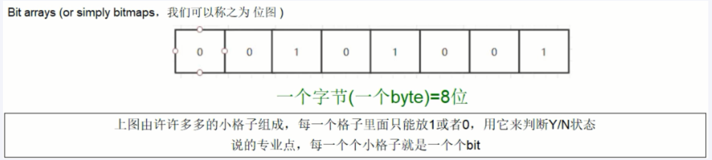

说明：`用String类型作为底层数据结构实现的一种统计二值状态的数据类型`

位图本质是数组，它是基于String数据类型的按位的操作。该数组由多个二进制位组成，每个二进制位都对应一个偏移量(我们可以称之为一个索引或者位格)。Bitmap支持的最大位数是2^32位，它可以极大的节约存储空间，使用512M内存就可以存储多大42.9亿的字节信息(2^32 = 4294967296)

一句话：由0和1状态表现的二进制位的bit数组

>    能干嘛？

**用于状态统计 **

Y、N，类似AtomicBoolean

**看需求**

- 用户是否登录过Y、N，比如京东每日签到送京豆
- 电影、广告是否被点击播放过
- 钉钉打卡上下班，签到统计
- ……

>   京东签到送京豆

**需求说明**


```text
签到日历仅展示当月签到数据
签到日历需展示最近连续签到天数
假设当前日期是20210618，且20210616未签到
若20210617已签到且0618未签到，则连续签到天数为1
若20210617已签到且0618已签到，则连续签到天数为2
连续签到天数越多，奖励越大
所有用户均可签到
截至2020年3月31日的12个月，京东年度活跃用户数3.87亿，同比增长24.8%，环比增长超2500万，此外，2020年3月移动端日均活跃用户数同比增长46%假设10%左右的用户参与签到，签到用户也高达3千万。。。。。。o(╥﹏╥)o
```

**小厂方法，传统mysql方式**

- 建表SQL

```sql
CREATE TABLE user_sign
(
  keyid BIGINT NOT NULL PRIMARY KEY AUTO_INCREMENT,
  user_key VARCHAR(200),#京东用户ID
  sign_date DATETIME,#签到日期(20210618)
  sign_count INT #连续签到天数
)

--------------------------

INSERT INTO user_sign(user_key,sign_date,sign_count)
VALUES ('20210618-xxxx-xxxx-xxxx-xxxxxxxxxxxx','2020-06-18 15:11:12',1);

--------------------------

SELECT
    sign_count
FROM
    user_sign
WHERE
    user_key = '20210618-xxxx-xxxx-xxxx-xxxxxxxxxxxx'
    AND sign_date BETWEEN '2020-06-17 00:00:00' AND '2020-06-18 23:59:59'
ORDER BY
    sign_date DESC
    LIMIT 1;
```

- 困难和解决思路

方法正确但是难以落地实现，o(╥﹏╥)o。 

签到用户量较小时这么设计能行，但京东这个体量的用户（估算3000W签到用户，一天一条数据，一个月就是9亿数据）

对于京东这样的体量，如果一条签到记录对应着当日用记录，那会很恐怖......

`如何解决这个痛点？ `

1 一条签到记录对应一条记录，会占据越来越大的空间。

2 一个月最多31天，刚好我们的int类型是32位，那这样一个int类型就可以搞定一个月，32位大于31天，当天来了位是1没来就是0。

3 一条数据直接存储一个月的签到记录，不再是存储一天的签到记录。

**大厂方法，基于Redis的Bitmap实现签到日历**

- 建表-按位-redis bitmap

在签到统计时，每个用户一天的签到用1个bit位就能表示，

一个月（假设是31天）的签到情况用31个bit位就可以，一年的签到也只需要用365个bit位，根本不用太复杂的集合类型

>   命令复习，第二次

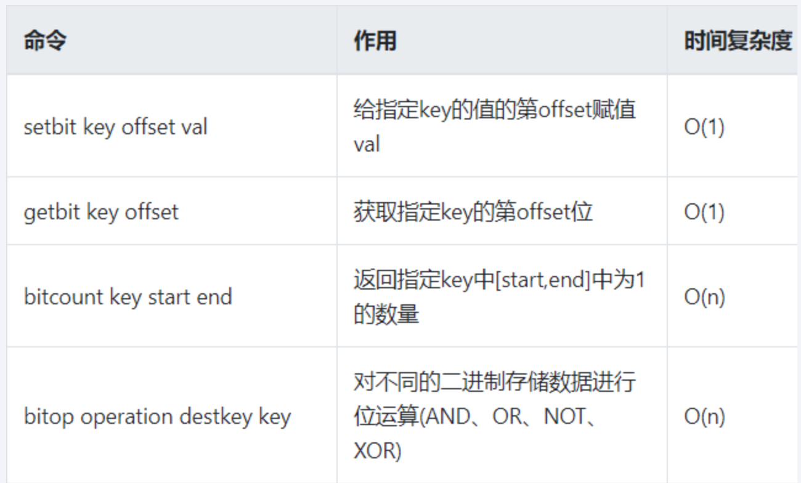

**setbit**

- setbit key offset value

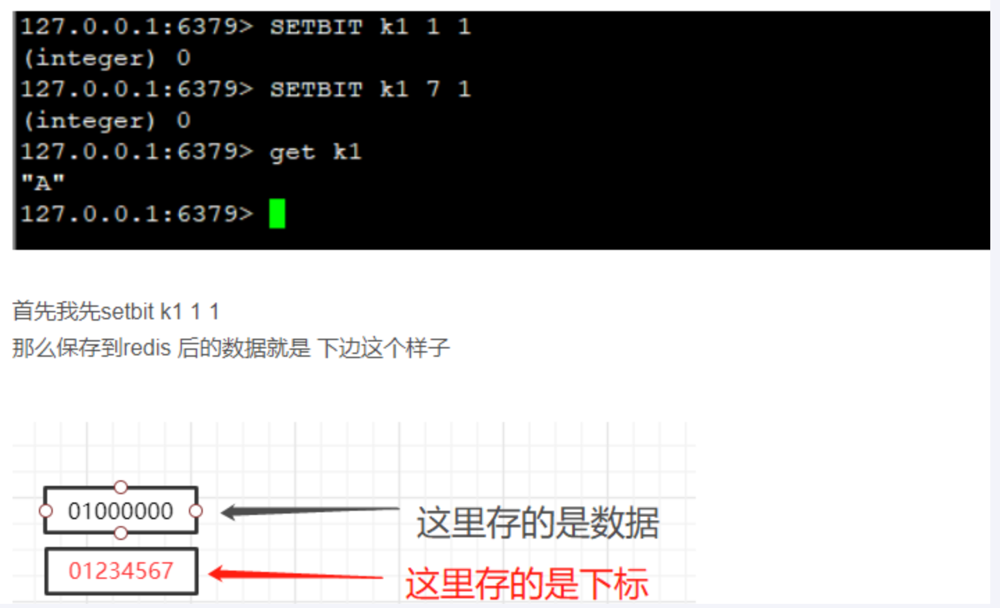

- setbit 键 偏移量 只能零或者1
- **Bitmap的偏移量是从零开始算的**

---

**getbit**

- getbit key offset

---

**setbit和getbit案例说明**

- 按照天

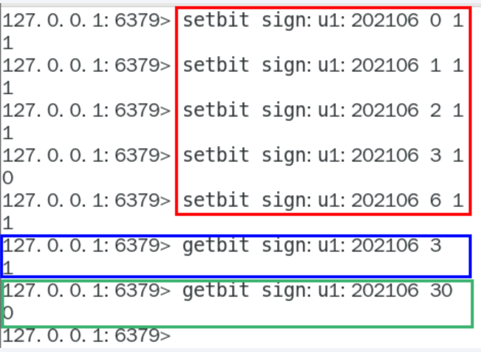

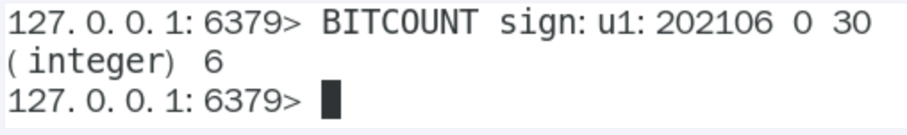

- 按照年

按年去存储一个用户的签到情况，365 天只需要 365 / 8 ≈ 46 Byte，1000W 用户量一年也只需要 44 MB 就足够了。

假如是亿级的系统，

每天使用1个`1亿位的Bitmap约占12MB的内存`（10^8/8/1024/1024），10天的Bitmap的内存开销约为120MB，内存压力不算太高。在实际使用时，最好对Bitmap设置过期时间，让Redis自动删除不再需要的签到记录以节省内存开销。

---

**bitmap的底层编码说明，get命令操作如何**

- 实质是二进制的ascii编码对应
- redis里用type命令看看bitmap实质是什么类型？？？
- man ascii

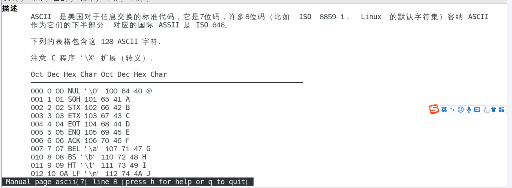

- 设置命令

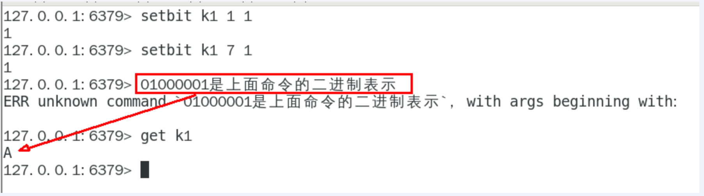

| 两个setbit命令对k1进行设置后，对应的二进制串就是0100 0001 |
| ------------------------------------- |
| 二进制串就是0100 0001对应的10进制就是65，所以见下图：     |

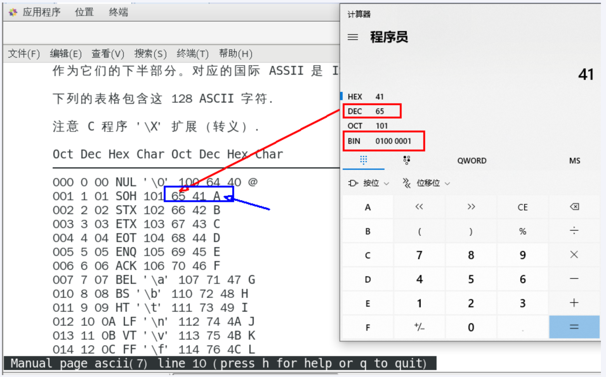

---

**strlen**

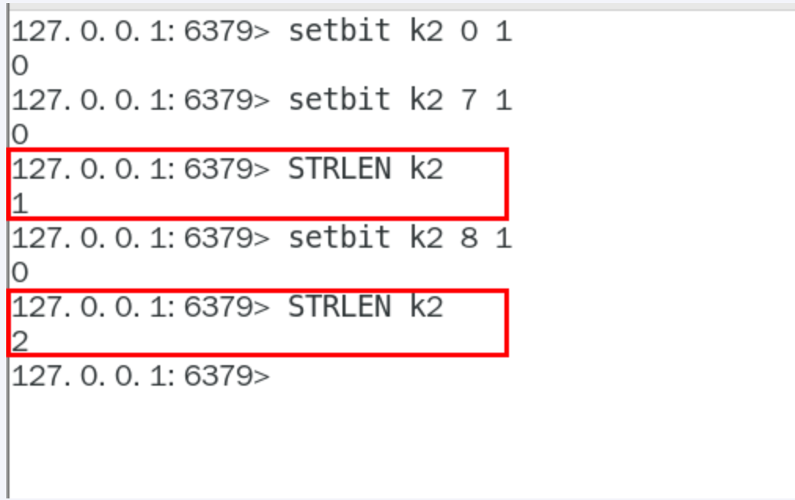

不是字符串长度而是占据几个字节，超过8位后自己按照8位一组一`byte`再扩容

`统计字节数占用多少`

---

**bitcount**

- 全部键里面包含1的有多少个？

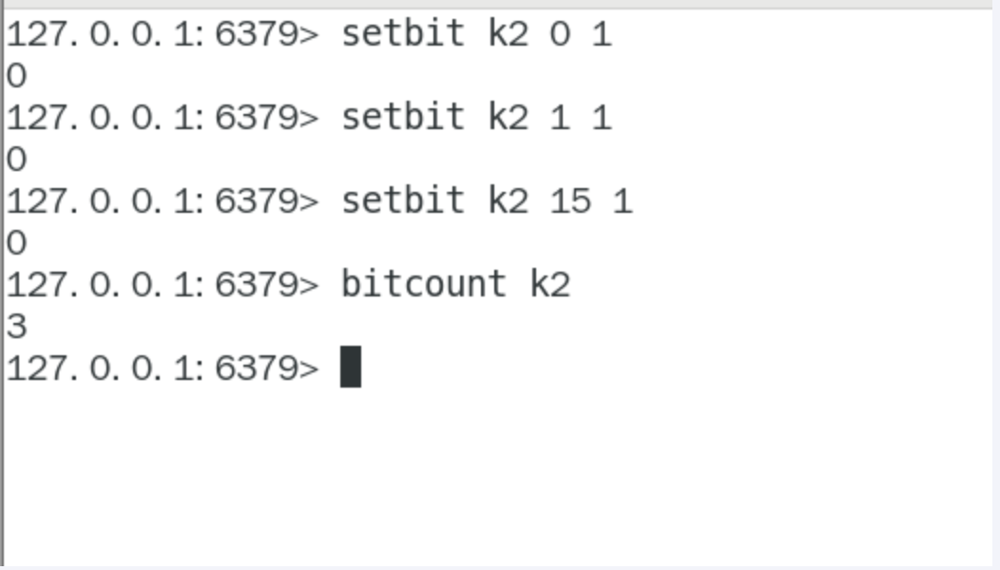

- 一年365缇娜，全年天天登录占用多少字节

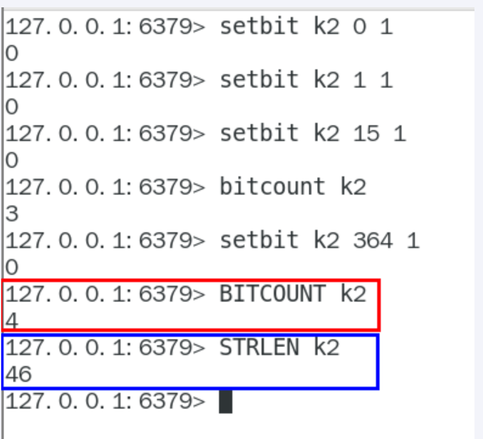

---

**bitop**

`连续2天都签到的用户`

加入某个网站或者系统，它的用户有1000W，做个用户id和位置的映射

比如0号位对应用户id：uid-092iok-lkj

比如1号位对应用户id：uid-7388c-xxx

。。。。。。 


>   案例实战见下一章，bitmap类型签到+结合布隆过滤器，案例升级
