---
# 当前页面内容标题
title: 六、布隆过滤器BloomFilter
# 分类
category:
  - redis
# 标签
tag: 
  - redis
  - NOSQL
  - K,V缓存数据库
  - 非关系型数据库
sticky: false
# 是否收藏在博客主题的文章列表中，当填入数字时，数字越大，排名越靠前。
star: false
# 是否将该文章添加至文章列表中
article: true
# 是否将该文章添加至时间线中
timeline: true
---

## 01、先看看大厂真实需求+面试题反馈

- 现有50亿个电话号码，现有10万个电话号码，如何要快速准确的判断这些号码**是否已经存在**？
- 判断是否存在，布隆过滤器了解过吗？
- 安全连接网址，全球数10亿的网址判断
- 黑名单校验，识别垃圾邮件
- 白名单校验，识别出合法用户进行后续处理
- ……

## 02、是什么？

>   一句话

由一个初值都是零的bit数组和多个哈希函数构成，用来快速判断集合中是否存在某个元素

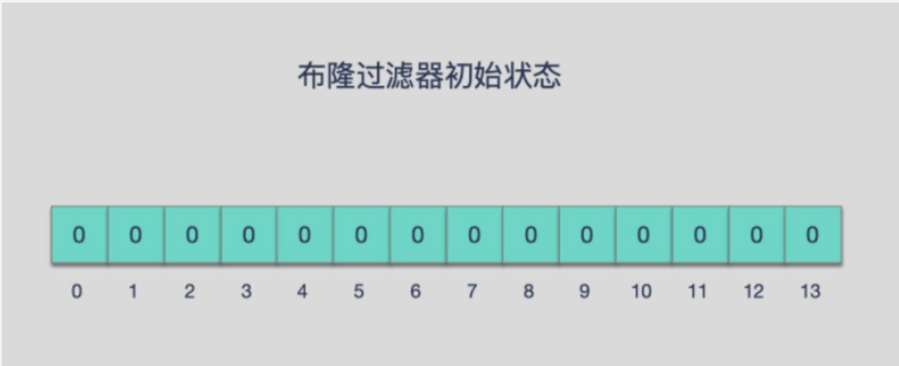

**设计思想**

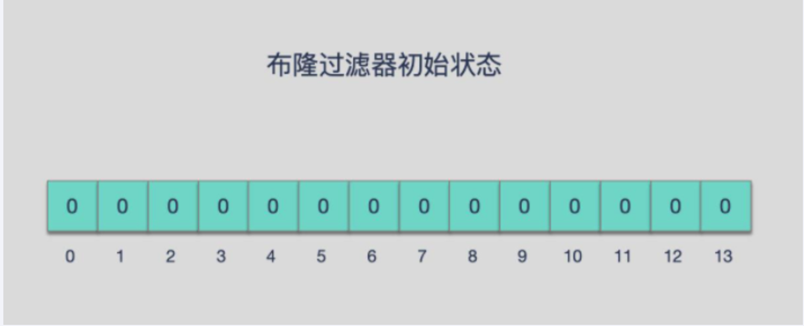

| 目的  | 减少内存占用                       |
| --- | ---------------------------- |
| 方式  | 不保存数据信息，只是在内存中做一个是否存在的标记flag |

本质就是判断具体数据是否存在于一个大的集合中

>   备注

布隆过滤器是一种**类似set**的数据结构，==只是统计结果在巨量数据下有点小瑕疵，不够完美==

布隆过滤器（英语：Bloom Filter）是 1970 年由布隆提出的。

`它实际上是一个很长的二进制数组(00000000)+一系列随机hash算法映射函数，主要用于判断一个元素是否在集合中。`

通常我们会遇到很多要判断一个元素是否在某个集合中的业务场景，一般想到的是将集合中所有元素保存起来，然后通过比较确定。

链表、树、哈希表等等数据结构都是这种思路。但是随着集合中元素的增加，我们需要的存储空间也会呈现线性增长，最终达到瓶颈。同时检索速度也越来越慢，上述三种结构的检索时间复杂度分别为O(n),O(logn),O(1)。这个时候，布隆过滤器（Bloom Filter）就应运而生

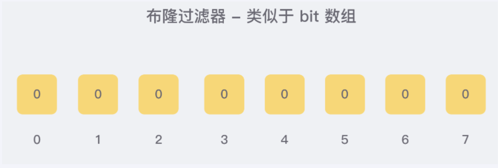


## 03、能干嘛-特点考点

- 高效地插入和查询，占用空间少，返回的结果是不确定性+不够完美。


| 目的  | 减少内存占用                       |
| --- | ---------------------------- |
| 方式  | 不保存数据信息，只是在内存中做一个是否存在的标记flag |

- 重点

一个元素如果判断结果：存在时，元素不一定存在，但是判断结果为不存在时，则一定不存在。

- 布隆过滤器可以添加元素，但是不能删除元素，由于涉及hashcode判断依据，删除元素会导致误判率增加。
- 小总结
  1. 有，是可能有
  2. 无，是肯定无

可以保证的是，如果布隆过滤器判断一个元素不在一个集合中，那这个元素一定不在集合中

## 04、布隆过滤器原理

>   布隆过滤器实现原理和数据结构

- 原理

布隆过滤器原理

布隆过滤器(Bloom Filter) 是一种专门用来解决去重问题的高级数据结构。

实质就是一个大型***位数组\***和几个不同的无偏hash函数(无偏表示分布均匀)。由一个初值都为零的bit数组和多个个哈希函数构成，用来快速判断某个数据是否存在。但是跟 HyperLogLog 一样，它也一样有那么一点点不精确，也存在一定的误判概率


- 添加key、查询key


添加key时

使用多个hash函数对key进行hash运算得到一个整数索引值，对位数组长度进行取模运算得到一个位置，

每个hash函数都会得到一个不同的位置，将这几个位置都置1就完成了add操作。

查询key时

只要有其中一位是零就表示这个key不存在，但如果都是1，则不一定存在对应的key。

**结论：有，是可能有           无，是肯定无**

- hash冲突导致数据不准确

当有变量被加入集合时，通过N个映射函数将这个变量映射成位图中的N个点，

把它们置为 1（假定有两个变量都通过 3 个映射函数）。

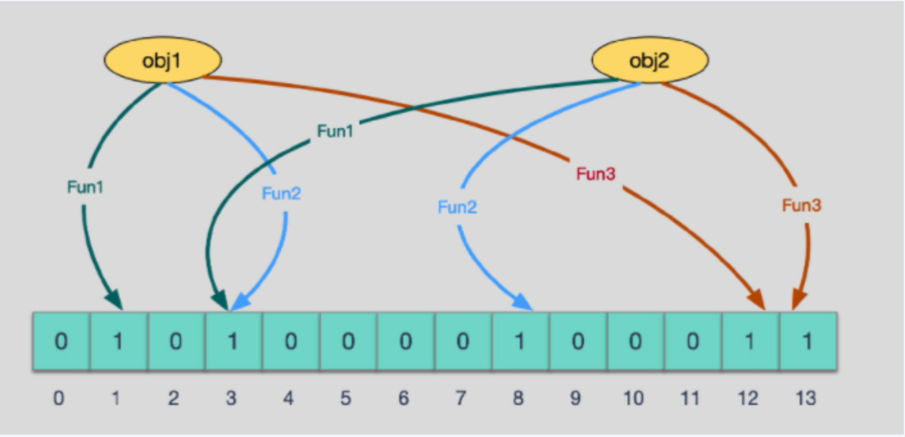

```text
查询某个变量的时候我们只要看看这些点是不是都是 1， 就可以大概率知道集合中有没有它了

如果这些点，有任何一个为零则被查询变量一定不在，
如果都是 1，则被查询变量很可能存在，
为什么说是可能存在，而不是一定存在呢？那是因为映射函数本身就是散列函数，散列函数是会有碰撞的。（见上图3号坑两个对象都1）
```

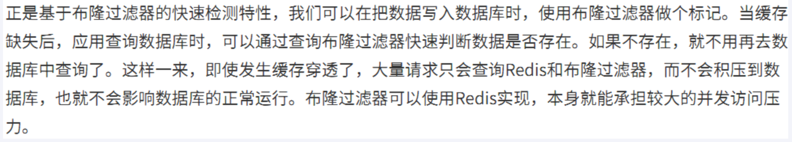

- hash冲突导致数据不准确2

**哈希函数**

哈希函数的概念是：将任意大小的输入数据转换成特定大小的输出数据的函数，转换后的数据称为哈希值或哈希编码，也叫散列值

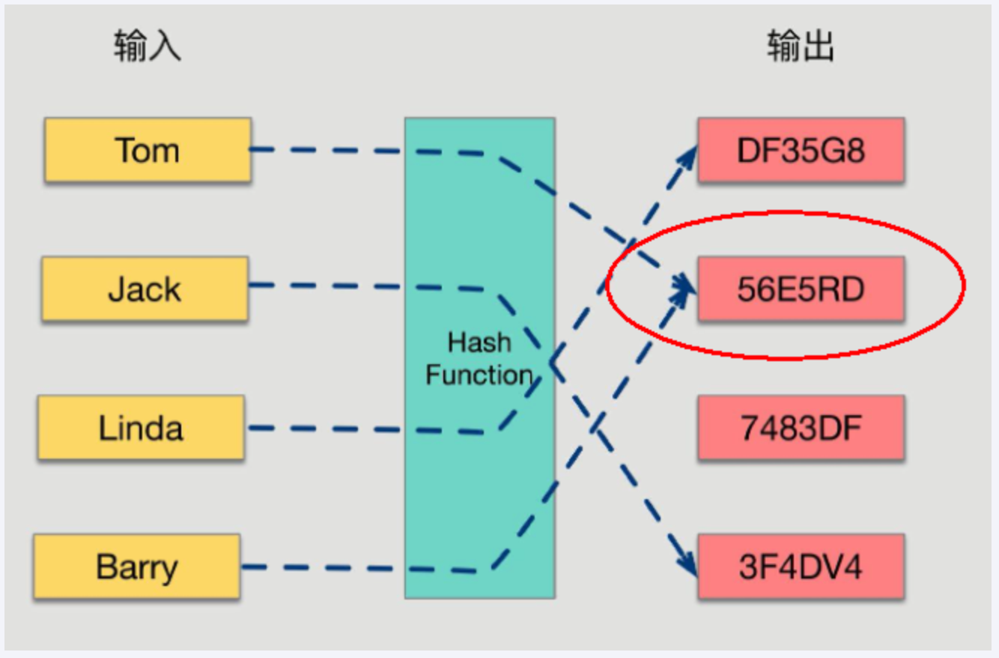

如果两个散列值是不相同的（根据同一函数）那么这两个散列值的原始输入也是不相同的。

这个特性是散列函数具有确定性的结果，具有这种性质的散列函数称为单向散列函数。

散列函数的输入和输出不是唯一对应关系的，**如果两个散列值相同，两个输入值很可能是相同的，但也可能不同，**这种情况称为“散列碰撞（collision）”。

用 hash表存储大数据量时，空间效率还是很低，当只有一个 hash 函数时，还很容易发生哈希碰撞。

**Java中hash冲突java案例**

```java
public class HashCodeConflictDemo
{
    public static void main(String[] args)
    {
        Set<Integer> hashCodeSet = new HashSet<>();

        for (int i = 0; i <200000; i++) {
            int hashCode = new Object().hashCode();
            if(hashCodeSet.contains(hashCode)) {
                System.out.println("出现了重复的hashcode: "+hashCode+"\t 运行到"+i);
                break;
            }
            hashCodeSet.add(hashCode);
        }


System.out.println("Aa".hashCode());
System.out.println("BB".hashCode());
System.out.println("柳柴".hashCode());
System.out.println("柴柕".hashCode());


    }
}
```

>   使用3步骤

1. 初始化bitmap

布隆过滤器 本质上 是由长度为 m 的位向量或位列表（仅包含 0 或 1 位值的列表）组成，最初所有的值均设置为 0

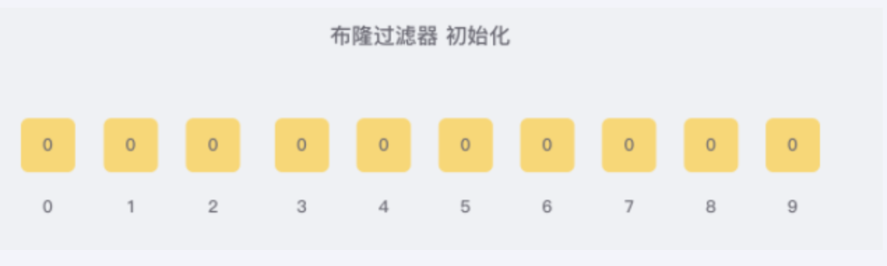

2. 添加占坑位

当我们向布隆过滤器中添加数据时，为了尽量地址不冲突，**会使用多个 hash 函数对 key 进行运算**，算得一个下标索引值，然后对位数组长度进行**取模运算**得到一个位置，每个 hash 函数都会算得一个不同的位置。再把位数组的这几个位置都置为 1 就完成了 add 操作。

例如，我们添加一个字符串wmyskxz，对字符串进行多次hash(key) → 取模运行→ 得到坑位

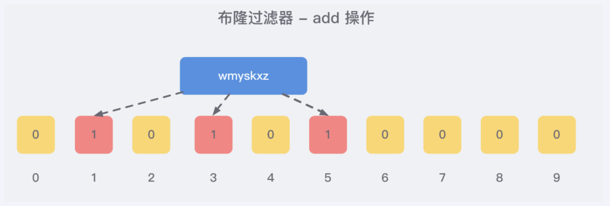

3. 判断是否存在

向布隆过滤器查询某个key是否存在时，先把这个 key 通过相同的**多个 hash 函数进行运算**，查看对应的位置是否都为 1，

**只要有一个位为零，那么说明布隆过滤器中这个 key 不存在；**

**如果这几个位置全都是 1，那么说明极有可能存在；**

因为这些位置的 1 可能是因为其他的 key 存在导致的，也就是前面说过的hash冲突。。。。。

就比如我们在 add 了字符串wmyskxz数据之后，很明显下面1/3/5 这几个位置的 1 是因为第一次添加的 wmyskxz 而导致的；

此时我们查询一个没添加过的不存在的字符串inexistent-key，它有可能计算后坑位也是1/3/5 ，这就是误判了......笔记见最下面

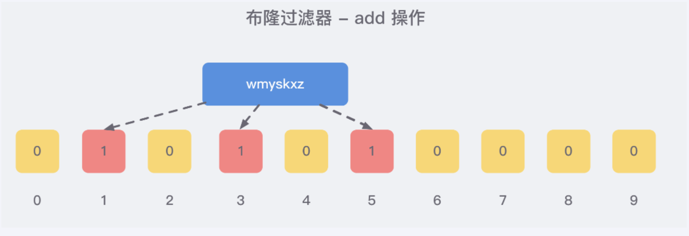

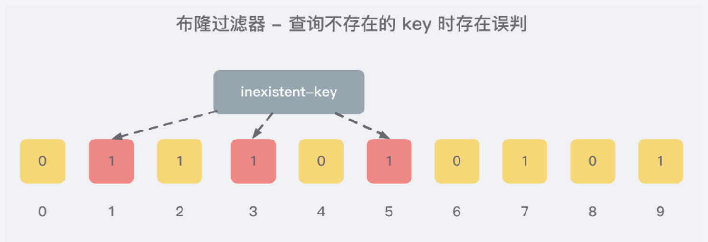

>   布隆过滤器误判率，为什么不要删除

布隆过滤器的误判是指多个输入经过哈希之后在相同的bit位置1了，这样就无法判断究竟是哪个输入产生的，

因此误判的根源在于相同的 bit 位被多次映射且置 1。

这种情况也造成了布隆过滤器的删除问题，因为布隆过滤器的每一个 bit 并不是独占的，很有可能多个元素`共享了某一位`。

如果我们直接删除这一位的话，会影响其他的元素

**特性** 

布隆过滤器可以添加元素，但是不能删除元素。因为删掉元素会导致误判率增加。

>   小总结

- 是否存在
  1. 有，是很可能有
  2. 无，是肯定无，100%无
- 使用时最好不要让实际元素数量远大于初始化数量，一次给够避免扩容
- 当实际元素数量超过初始化数量时，应该对布隆过滤器进行重建，重新分配一个size更大的过滤器，再将所有的历史元素批量add进行

## 05、布隆过滤器的使用场景

- 解决缓存穿透的问题，和redis结果bitmap使用

>    *缓存穿透是什么*

一般情况下，先查询缓存redis是否有该条数据，缓存中没有时，再查询数据库。

当数据库也不存在该条数据时，每次查询都要访问数据库，这就是缓存穿透。

缓存透带来的问题是，当有大量请求查询数据库不存在的数据时，就会给数据库带来压力，甚至会拖垮数据库。

>   **可以使用布隆过滤器解决缓存穿透的问题**

把已存在数据的key存在布隆过滤器中，相当于redis前面挡着一个布隆过滤器。

当有新的请求时，先到布隆过滤器中查询是否存在：

如果布隆过滤器中不存在该条数据则直接返回；

如果布隆过滤器中已存在，才去查询缓存redis，如果redis里没查询到则再查询Mysql数据库

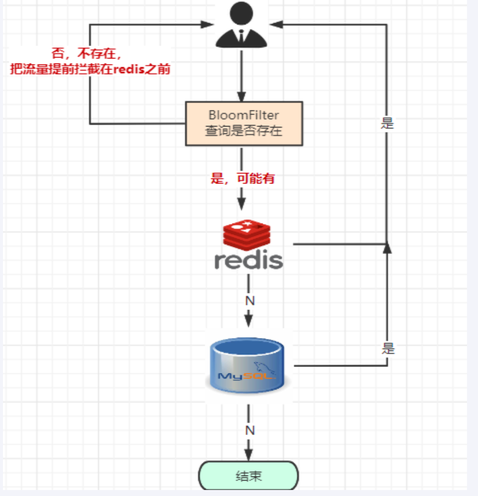

- 黑名单校验，识别垃圾邮箱

发现存在黑名单中的，就执行特定操作。比如：识别垃圾邮件，只要是邮箱在黑名单中的邮件，就识别为垃圾邮件。

假设黑名单的数量是数以亿计的，存放起来就是非常耗费存储空间的，布隆过滤器则是一个较好的解决方案。

把所有黑名单都放在布隆过滤器中，在收到邮件时，判断邮件地址是否在布隆过滤器中即可。

- 安全连接网址，全球上10亿的网址进行判断
- ……

## 06、尝试手写布隆过滤器，结合bitmap自研一下体会思想

>   结合bitmap类型手写一个简单的布隆过滤器，体会设计思想

>   整体架构

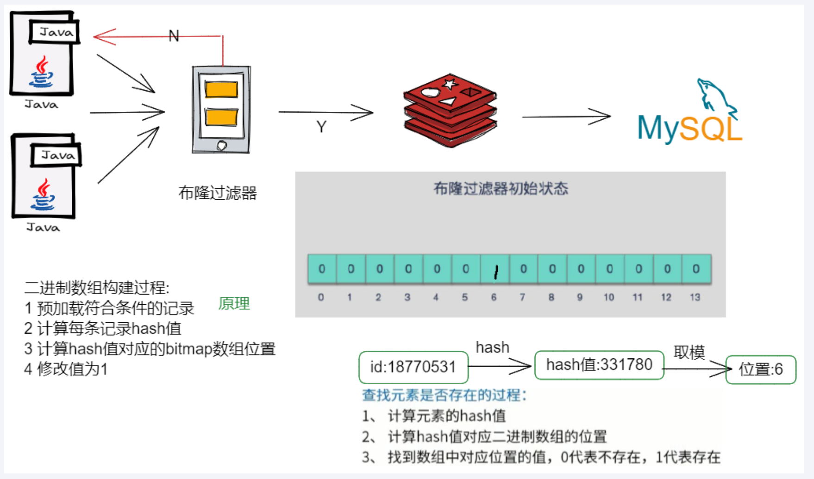

>   步骤设计

**redis的setbit/getbit**

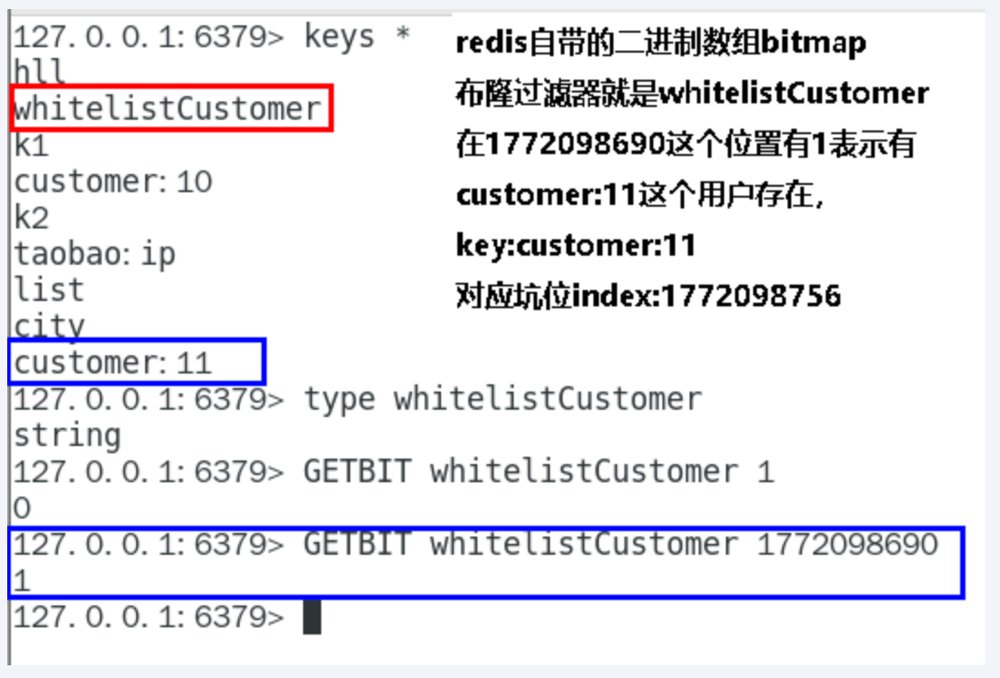

**setBit的构建过程**

- @PostContruct初始化白名单数据
- 计算元素的hash值
- 通过上一步hash值算出对应的二进制数组的坑位
- 将对应坑位的值的修改为数字1，表示存在

**getBit查询是否存在**

- 计算元素的hash值
- 通过上一步hash值算出对应的二进制数组的坑位
- 返回对应坑位的值，零表示无，1表示存在

>   springboot+redis+mybatis案例基础与一键编码环境整合
> 
> - Mybatis通用Mapper4

[mybatis-generator](http://mybatis.org/generator)

[Mybatis通用Mapper4官网](https://github.com/abel533/Mapper)

----

**一键生成**

1.t_customer用户表SQL

```sql
CREATE TABLE `t_customer` (

  `id` int(20) NOT NULL AUTO_INCREMENT,

  `cname` varchar(50) NOT NULL,

  `age` int(10) NOT NULL,

  `phone` varchar(20) NOT NULL,

  `sex` tinyint(4) NOT NULL,

  `birth` timestamp NOT NULL DEFAULT CURRENT_TIMESTAMP ON UPDATE CURRENT_TIMESTAMP,

  PRIMARY KEY (`id`),

  KEY `idx_cname` (`cname`)

) ENGINE=InnoDB AUTO_INCREMENT=10 DEFAULT CHARSET=utf8mb4;
```

2.建springboot的Module：mybatis_generator

3.改POM

```xml
<?xml version="1.0" encoding="UTF-8"?>
<project xmlns="http://maven.apache.org/POM/4.0.0"
         xmlns:xsi="http://www.w3.org/2001/XMLSchema-instance"
         xsi:schemaLocation="http://maven.apache.org/POM/4.0.0 http://maven.apache.org/xsd/maven-4.0.0.xsd">
    <modelVersion>4.0.0</modelVersion>

    <groupId>com.atguigu.redis7</groupId>
    <artifactId>mybatis_generator</artifactId>
    <version>1.0-SNAPSHOT</version>

    <parent>
        <groupId>org.springframework.boot</groupId>
        <artifactId>spring-boot-starter-parent</artifactId>
        <version>2.6.10</version>
        <relativePath/>
    </parent>


    <properties>
        <!--  依赖版本号 -->
        <project.build.sourceEncoding>UTF-8</project.build.sourceEncoding>
        <maven.compiler.source>1.8</maven.compiler.source>
        <maven.compiler.target>1.8</maven.compiler.target>
        <java.version>1.8</java.version>
        <hutool.version>5.5.8</hutool.version>
        <druid.version>1.1.18</druid.version>
        <mapper.version>4.1.5</mapper.version>
        <pagehelper.version>5.1.4</pagehelper.version>
        <mysql.version>5.1.39</mysql.version>
        <swagger2.version>2.9.2</swagger2.version>
        <swagger-ui.version>2.9.2</swagger-ui.version>
        <mybatis.spring.version>2.1.3</mybatis.spring.version>
    </properties>


    <dependencies>
        <dependency>
            <groupId>org.springframework.boot</groupId>
            <artifactId>spring-boot-starter-web</artifactId>
        </dependency>

        <!--Mybatis 通用mapper tk单独使用，自己带着版本号-->
        <dependency>
            <groupId>org.mybatis</groupId>
            <artifactId>mybatis</artifactId>
            <version>3.4.6</version>
        </dependency>
        <!--mybatis-spring-->
        <dependency>
            <groupId>org.mybatis.spring.boot</groupId>
            <artifactId>mybatis-spring-boot-starter</artifactId>
            <version>${mybatis.spring.version}</version>
        </dependency>
        <!-- Mybatis Generator -->
        <dependency>
            <groupId>org.mybatis.generator</groupId>
            <artifactId>mybatis-generator-core</artifactId>
            <version>1.4.0</version>
            <scope>compile</scope>
            <optional>true</optional>
        </dependency>
        <!--通用Mapper-->
        <dependency>
            <groupId>tk.mybatis</groupId>
            <artifactId>mapper</artifactId>
            <version>${mapper.version}</version>
        </dependency>
        <!--persistence-->
        <dependency>
            <groupId>javax.persistence</groupId>
            <artifactId>persistence-api</artifactId>
            <version>1.0.2</version>
        </dependency>

        <dependency>
            <groupId>org.projectlombok</groupId>
            <artifactId>lombok</artifactId>
            <optional>true</optional>
        </dependency>
        <dependency>
            <groupId>org.springframework.boot</groupId>
            <artifactId>spring-boot-starter-test</artifactId>
            <scope>test</scope>
            <exclusions>
                <exclusion>
                    <groupId>org.junit.vintage</groupId>
                    <artifactId>junit-vintage-engine</artifactId>
                </exclusion>
            </exclusions>
        </dependency>
    </dependencies>

    <build>
        <resources>
            <resource>
                <directory>${basedir}/src/main/java</directory>
                <includes>
                    <include>**/*.xml</include>
                </includes>
            </resource>
            <resource>
                <directory>${basedir}/src/main/resources</directory>
            </resource>
        </resources>
        <plugins>
            <plugin>
                <groupId>org.springframework.boot</groupId>
                <artifactId>spring-boot-maven-plugin</artifactId>
                <configuration>
                    <excludes>
                        <exclude>
                            <groupId>org.projectlombok</groupId>
                            <artifactId>lombok</artifactId>
                        </exclude>
                    </excludes>
                </configuration>
            </plugin>
            <plugin>
                <groupId>org.mybatis.generator</groupId>
                <artifactId>mybatis-generator-maven-plugin</artifactId>
                <version>1.3.6</version>
                <configuration>
                    <configurationFile>${basedir}/src/main/resources/generatorConfig.xml</configurationFile>
                    <overwrite>true</overwrite>
                    <verbose>true</verbose>
                </configuration>
                <dependencies>
                    <dependency>
                        <groupId>mysql</groupId>
                        <artifactId>mysql-connector-java</artifactId>
                        <version>${mysql.version}</version>
                    </dependency>
                    <dependency>
                        <groupId>tk.mybatis</groupId>
                        <artifactId>mapper</artifactId>
                        <version>${mapper.version}</version>
                    </dependency>
                </dependencies>
            </plugin>
        </plugins>
    </build>
</project>
```

4.写YML

此处无需编写

5.mgb配置相关src/main/resources路径下新建

config.properties

```properties
#t_customer表包名
package.name=com.atguigu.redis7

jdbc.driverClass = com.mysql.jdbc.Driver
jdbc.url = jdbc:mysql://localhost:3306/bigdata
jdbc.user = root
jdbc.password =123456
```

generatorConfig.xml

```xml
<?xml version="1.0" encoding="UTF-8"?>
<!DOCTYPE generatorConfiguration
        PUBLIC "-//mybatis.org//DTD MyBatis Generator Configuration 1.0//EN"
        "http://mybatis.org/dtd/mybatis-generator-config_1_0.dtd">

<generatorConfiguration>
    <properties resource="config.properties"/>

    <context id="Mysql" targetRuntime="MyBatis3Simple" defaultModelType="flat">
        <property name="beginningDelimiter" value="`"/>
        <property name="endingDelimiter" value="`"/>

        <plugin type="tk.mybatis.mapper.generator.MapperPlugin">
            <property name="mappers" value="tk.mybatis.mapper.common.Mapper"/>
            <property name="caseSensitive" value="true"/>
        </plugin>

        <jdbcConnection driverClass="${jdbc.driverClass}"
                        connectionURL="${jdbc.url}"
                        userId="${jdbc.user}"
                        password="${jdbc.password}">
        </jdbcConnection>

        <javaModelGenerator targetPackage="${package.name}.entities" targetProject="src/main/java"/>

        <sqlMapGenerator targetPackage="${package.name}.mapper" targetProject="src/main/java"/>

        <javaClientGenerator targetPackage="${package.name}.mapper" targetProject="src/main/java" type="XMLMAPPER"/>

        <table tableName="t_customer" domainObjectName="Customer">
            <generatedKey column="id" sqlStatement="JDBC"/>
        </table>
    </context>
</generatorConfiguration>
```

6.一键生成

双击插件mybatis-generator:gererate，一键生成

生成entity+mapper接口+xml实现SQL

---

> - SpringBoot+mybatis+Redis缓存实战编码

1.键Module

改造我们的redis7_study工程

2.POM

```xml
<?xml version="1.0" encoding="UTF-8"?>
<project xmlns="http://maven.apache.org/POM/4.0.0"
         xmlns:xsi="http://www.w3.org/2001/XMLSchema-instance"
         xsi:schemaLocation="http://maven.apache.org/POM/4.0.0 http://maven.apache.org/xsd/maven-4.0.0.xsd">
    <modelVersion>4.0.0</modelVersion>

    <groupId>com.atguigu.redis7</groupId>
    <artifactId>redis7_study</artifactId>
    <version>1.0-SNAPSHOT</version>

    <parent>
        <groupId>org.springframework.boot</groupId>
        <artifactId>spring-boot-starter-parent</artifactId>
        <version>2.6.10</version>
        <relativePath/>
    </parent>

    <properties>
        <project.build.sourceEncoding>UTF-8</project.build.sourceEncoding>
        <maven.compiler.source>1.8</maven.compiler.source>
        <maven.compiler.target>1.8</maven.compiler.target>
        <junit.version>4.12</junit.version>
        <log4j.version>1.2.17</log4j.version>
        <lombok.version>1.16.18</lombok.version>
    </properties>

    <dependencies>
        <!--SpringBoot通用依赖模块-->
        <dependency>
            <groupId>org.springframework.boot</groupId>
            <artifactId>spring-boot-starter-web</artifactId>
        </dependency>
        <!--jedis-->
        <dependency>
            <groupId>redis.clients</groupId>
            <artifactId>jedis</artifactId>
            <version>4.3.1</version>
        </dependency>
        <!--lettuce-->
        <!--<dependency>
            <groupId>io.lettuce</groupId>
            <artifactId>lettuce-core</artifactId>
            <version>6.2.1.RELEASE</version>
        </dependency>-->
        <!--SpringBoot与Redis整合依赖-->
        <dependency>
            <groupId>org.springframework.boot</groupId>
            <artifactId>spring-boot-starter-data-redis</artifactId>
        </dependency>
        <dependency>
            <groupId>org.apache.commons</groupId>
            <artifactId>commons-pool2</artifactId>
        </dependency>
        <!--swagger2-->
        <dependency>
            <groupId>io.springfox</groupId>
            <artifactId>springfox-swagger2</artifactId>
            <version>2.9.2</version>
        </dependency>
        <dependency>
            <groupId>io.springfox</groupId>
            <artifactId>springfox-swagger-ui</artifactId>
            <version>2.9.2</version>
        </dependency>
        <!--Mysql数据库驱动-->
        <dependency>
            <groupId>mysql</groupId>
            <artifactId>mysql-connector-java</artifactId>
            <version>5.1.47</version>
        </dependency>
        <!--SpringBoot集成druid连接池-->
        <dependency>
            <groupId>com.alibaba</groupId>
            <artifactId>druid-spring-boot-starter</artifactId>
            <version>1.1.10</version>
        </dependency>
        <dependency>
            <groupId>com.alibaba</groupId>
            <artifactId>druid</artifactId>
            <version>1.1.16</version>
        </dependency>
        <!--mybatis和springboot整合-->
        <dependency>
            <groupId>org.mybatis.spring.boot</groupId>
            <artifactId>mybatis-spring-boot-starter</artifactId>
            <version>1.3.0</version>
        </dependency>
        <!--hutool-->
        <dependency>
            <groupId>cn.hutool</groupId>
            <artifactId>hutool-all</artifactId>
            <version>5.2.3</version>
        </dependency>
        <!--persistence-->
        <dependency>
            <groupId>javax.persistence</groupId>
            <artifactId>persistence-api</artifactId>
            <version>1.0.2</version>
        </dependency>
        <!--通用Mapper-->
        <dependency>
            <groupId>tk.mybatis</groupId>
            <artifactId>mapper</artifactId>
            <version>4.1.5</version>
        </dependency>
        <dependency>
            <groupId>org.springframework.boot</groupId>
            <artifactId>spring-boot-autoconfigure</artifactId>
        </dependency>
        <!--通用基础配置junit/devtools/test/log4j/lombok/-->
        <dependency>
            <groupId>junit</groupId>
            <artifactId>junit</artifactId>
            <version>${junit.version}</version>
        </dependency>
        <dependency>
            <groupId>org.springframework.boot</groupId>
            <artifactId>spring-boot-starter-test</artifactId>
            <scope>test</scope>
        </dependency>
        <dependency>
            <groupId>log4j</groupId>
            <artifactId>log4j</artifactId>
            <version>${log4j.version}</version>
        </dependency>
        <dependency>
            <groupId>org.projectlombok</groupId>
            <artifactId>lombok</artifactId>
            <version>${lombok.version}</version>
            <optional>true</optional>
        </dependency>
    </dependencies>

    <build>
        <plugins>
            <plugin>
                <groupId>org.springframework.boot</groupId>
                <artifactId>spring-boot-maven-plugin</artifactId>
            </plugin>
        </plugins>
    </build>

</project>
```

3.YML

```yml
server.port=7777

spring.application.name=redis7_study

# ========================logging=====================
logging.level.root=info
logging.level.com.atguigu.redis7=info
logging.pattern.console=%d{yyyy-MM-dd HH:mm:ss.SSS} [%thread] %-5level %logger- %msg%n 

logging.file.name=D:/mylogs2023/redis7_study.log
logging.pattern.file=%d{yyyy-MM-dd HH:mm:ss.SSS} [%thread] %-5level %logger- %msg%n

# ========================swagger=====================
spring.swagger2.enabled=true
#在springboot2.6.X结合swagger2.9.X会提示documentationPluginsBootstrapper空指针异常，
#原因是在springboot2.6.X中将SpringMVC默认路径匹配策略从AntPathMatcher更改为PathPatternParser，
# 导致出错，解决办法是matching-strategy切换回之前ant_path_matcher
spring.mvc.pathmatch.matching-strategy=ant_path_matcher

# ========================redis单机=====================
spring.redis.database=0
# 修改为自己真实IP
spring.redis.host=192.168.111.185
spring.redis.port=6379
spring.redis.password=111111
spring.redis.lettuce.pool.max-active=8
spring.redis.lettuce.pool.max-wait=-1ms
spring.redis.lettuce.pool.max-idle=8
spring.redis.lettuce.pool.min-idle=0

# ========================alibaba.druid=====================
spring.datasource.type=com.alibaba.druid.pool.DruidDataSource
spring.datasource.driver-class-name=com.mysql.jdbc.Driver
spring.datasource.url=jdbc:mysql://localhost:3306/bigdata?useUnicode=true&characterEncoding=utf-8&useSSL=false
spring.datasource.username=root
spring.datasource.password=123456
spring.datasource.druid.test-while-idle=false

# ========================mybatis===================
mybatis.mapper-locations=classpath:mapper/*.xml
mybatis.type-aliases-package=com.atguigu.redis7.entities

# ========================redis集群=====================
#spring.redis.password=111111
## 获取失败 最大重定向次数
#spring.redis.cluster.max-redirects=3
#spring.redis.lettuce.pool.max-active=8
#spring.redis.lettuce.pool.max-wait=-1ms
#spring.redis.lettuce.pool.max-idle=8
#spring.redis.lettuce.pool.min-idle=0
##支持集群拓扑动态感应刷新,自适应拓扑刷新是否使用所有可用的更新，默认false关闭
#spring.redis.lettuce.cluster.refresh.adaptive=true
##定时刷新
#spring.redis.lettuce.cluster.refresh.period=2000
#spring.redis.cluster.nodes=192.168.111.185:6381,192.168.111.185:6382,192.168.111.172:6383,192.168.111.172:6384,192.168.111.184:6385,192.168.111.184:6386
```

>   注意点：
> 
>   src/main/resources/目录下新建mapper文件夹并拷贝CustomerMapper.xml

4.主启动

```java
import org.springframework.boot.SpringApplication;
import org.springframework.boot.autoconfigure.SpringBootApplication;
import tk.mybatis.spring.annotation.MapperScan;

/**
 * @auther zzyy
 * @create 2022-12-10 23:39
 */
@SpringBootApplication
@MapperScan("com.atguigu.redis7.mapper") //import tk.mybatis.spring.annotation.MapperScan;
public class Redis7Study7777
{
    public static void main(String[] args)
    {
        SpringApplication.run(Redis7Study7777.class,args);
    }
}
```

5.业务类

5.1 数据库t_customer是否OK

5.2 entity 上一步自动生成的拷贝过来

```java
import javax.persistence.GeneratedValue;
import javax.persistence.Id;
import javax.persistence.Table;
import java.io.Serializable;
import java.util.Date;

@Table(name = "t_customer")
public class Customer implements Serializable
{
    @Id
    @GeneratedValue(generator = "JDBC")
    private Integer id;

    private String cname;

    private Integer age;

    private String phone;

    private Byte sex;

    private Date birth;

    public Customer()
    {
    }

    public Customer(Integer id, String cname)
    {
        this.id = id;
        this.cname = cname;
    }

    /**
     * @return id
     */
    public Integer getId() {
        return id;
    }

    /**
     * @param id
     */
    public void setId(Integer id) {
        this.id = id;
    }

    /**
     * @return cname
     */
    public String getCname() {
        return cname;
    }

    /**
     * @param cname
     */
    public void setCname(String cname) {
        this.cname = cname;
    }

    /**
     * @return age
     */
    public Integer getAge() {
        return age;
    }

    /**
     * @param age
     */
    public void setAge(Integer age) {
        this.age = age;
    }

    /**
     * @return phone
     */
    public String getPhone() {
        return phone;
    }

    /**
     * @param phone
     */
    public void setPhone(String phone) {
        this.phone = phone;
    }

    /**
     * @return sex
     */
    public Byte getSex() {
        return sex;
    }

    /**
     * @param sex
     */
    public void setSex(Byte sex) {
        this.sex = sex;
    }

    /**
     * @return birth
     */
    public Date getBirth() {
        return birth;
    }

    /**
     * @param birth
     */
    public void setBirth(Date birth) {
        this.birth = birth;
    }

    @Override
    public String toString()
    {
        return "Customer{" +
                "id=" + id +
                ", cname='" + cname + '\'' +
                ", age=" + age +
                ", phone='" + phone + '\'' +
                ", sex=" + sex +
                ", birth=" + birth +
                '}';
    }
}
```

5.3 mapper接口

```java
package com.atguigu.redis7.mapper;

import com.atguigu.redis7.entities.Customer;
import tk.mybatis.mapper.common.Mapper;

public interface CustomerMapper extends Mapper<Customer> {
}
```

5.4 mapper SQL文件 

```xml
<?xml version="1.0" encoding="UTF-8"?>
<!DOCTYPE mapper PUBLIC "-//mybatis.org//DTD Mapper 3.0//EN" "http://mybatis.org/dtd/mybatis-3-mapper.dtd">
<mapper namespace="com.atguigu.redis7.mapper.CustomerMapper">
  <resultMap id="BaseResultMap" type="com.atguigu.redis7.entities.Customer">
    <!--
      WARNING - @mbg.generated
    -->
    <id column="id" jdbcType="INTEGER" property="id" />
    <result column="cname" jdbcType="VARCHAR" property="cname" />
    <result column="age" jdbcType="INTEGER" property="age" />
    <result column="phone" jdbcType="VARCHAR" property="phone" />
    <result column="sex" jdbcType="TINYINT" property="sex" />
    <result column="birth" jdbcType="TIMESTAMP" property="birth" />
  </resultMap>
</mapper>
```

5.5 service类

```java
package com.atguigu.redis7.service;

import com.atguigu.redis7.entities.Customer;
import com.atguigu.redis7.mapper.CustomerMapper;
import com.atguigu.redis7.utils.CheckUtils;
import lombok.extern.slf4j.Slf4j;
import org.springframework.data.redis.core.RedisTemplate;
import org.springframework.stereotype.Service;

import javax.annotation.PostConstruct;
import javax.annotation.Resource;
import java.util.concurrent.*;
import java.util.concurrent.atomic.AtomicInteger;

/**
 * @auther zzyy
 * @create 2022-07-23 13:55
 */
@Service
@Slf4j
public class CustomerSerivce
{
    public static final String CACHE_KEY_CUSTOMER = "customer:";

    @Resource
    private CustomerMapper customerMapper;
    @Resource
    private RedisTemplate redisTemplate;

    public void addCustomer(Customer customer){
        int i = customerMapper.insertSelective(customer);

        if(i > 0)
        {
            //到数据库里面，重新捞出新数据出来，做缓存
            customer=customerMapper.selectByPrimaryKey(customer.getId());
            //缓存key
            String key=CACHE_KEY_CUSTOMER+customer.getId();
            //往mysql里面插入成功随后再从mysql查询出来，再插入redis
            redisTemplate.opsForValue().set(key,customer);
        }
    }

    public Customer findCustomerById(Integer customerId){
        Customer customer = null;
        //缓存key的名称
        String key=CACHE_KEY_CUSTOMER+customerId;
        //1 查询redis
        customer = (Customer) redisTemplate.opsForValue().get(key);
        //redis无，进一步查询mysql
        if(customer==null){
            //2 从mysql查出来customer
            customer=customerMapper.selectByPrimaryKey(customerId);
            // mysql有，redis无
            if (customer != null) {
                //3 把mysql捞到的数据写入redis，方便下次查询能redis命中。
                redisTemplate.opsForValue().set(key,customer);
            }
        }
        return customer;
    }

}
```

5.6 controller

```java
package com.atguigu.redis7.controller;

import com.atguigu.redis7.entities.Customer;
import com.atguigu.redis7.service.CustomerSerivce;
import io.swagger.annotations.Api;
import io.swagger.annotations.ApiOperation;
import lombok.extern.slf4j.Slf4j;
import org.springframework.web.bind.annotation.PathVariable;
import org.springframework.web.bind.annotation.RequestMapping;
import org.springframework.web.bind.annotation.RequestMethod;
import org.springframework.web.bind.annotation.RestController;

import javax.annotation.Resource;
import java.time.LocalDateTime;
import java.time.ZoneId;
import java.util.Random;
import java.util.Date;
import java.util.concurrent.ExecutionException;

/**
 * @auther zzyy
 * @create 2022-07-23 13:55
 */
@Api(tags = "客户Customer接口+布隆过滤器讲解")
@RestController
@Slf4j
public class CustomerController{
    @Resource private CustomerSerivce customerSerivce;

    @ApiOperation("数据库初始化2条Customer数据")
    @RequestMapping(value = "/customer/add", method = RequestMethod.POST)
    public void addCustomer() {
        for (int i = 0; i < 2; i++) {
            Customer customer = new Customer();
            customer.setCname("customer"+i);
            customer.setAge(new Random().nextInt(30)+1);
            customer.setPhone("1381111xxxx");
            customer.setSex((byte) new Random().nextInt(2));
            customer.setBirth(Date.from(LocalDateTime.now().atZone(ZoneId.systemDefault()).toInstant()));
            customerSerivce.addCustomer(customer);
        }
    }
    @ApiOperation("单个用户查询，按customerid查用户信息")
    @RequestMapping(value = "/customer/{id}", method = RequestMethod.GET)
    public Customer findCustomerById(@PathVariable int id) {
        return customerSerivce.findCustomerById(id);
    }
}
```

补充：java将数据存入redis中的时候会出现乱码问题，这个问题是出现在序列化上，但是这个问题很好解决，晚上的方法也很多。

因为 redis 是将数据存储在内存中的，在存入数据的时候需要对数据进行序列化的操作，问题就是出现在这里。

我们修改它的序列化方式就可以解决了。


```java
@Configuration
public class RedisTemplateConfig
{
    @Resource
    private RedisTemplate<String, String> redisTemplate;

    @Bean
    public RedisTemplate<String, String> redisTemplateInit() {
        // 设置序列化 Key 的实例对象
        redisTemplate.setKeySerializer(new StringRedisSerializer());
        // 设置序列化 value 的实例对象
        redisTemplate.setValueSerializer(new GenericJackson2JsonRedisSerializer());
        return redisTemplate;
    }
}
```

为其制定好序列化方式即可解决。


6.启动测试Swagger是否OK

>   http://localhost:你的微服务端口/swagger-ui.html#/
> 
>   http://localhost:7777/swagger-ui.html

---

>   新增布隆过滤器案例

**code**

- BloomFilterlnit（白名单）

```java
package com.atguigu.redis7.filter;

import lombok.extern.slf4j.Slf4j;
import org.springframework.data.redis.core.RedisTemplate;
import org.springframework.stereotype.Component;

import javax.annotation.PostConstruct;
import javax.annotation.Resource;

/**
 * @auther zzyy
 * @create 2022-12-27 14:55
 * 布隆过滤器白名单初始化工具类，一开始就设置一部分数据为白名单所有，
 * 白名单业务默认规定：布隆过滤器有，redis也有。
 */
@Component
@Slf4j
public class BloomFilterInit
{
    @Resource
    private RedisTemplate redisTemplate;

    @PostConstruct//初始化白名单数据，故意差异化数据演示效果......
    public void init()
    {
        //白名单客户预加载到布隆过滤器
        String uid = "customer:12";
        //1 计算hashcode，由于可能有负数，直接取绝对值
        int hashValue = Math.abs(uid.hashCode());
        //2 通过hashValue和2的32次方取余后，获得对应的下标坑位
        long index = (long) (hashValue % Math.pow(2, 32));
        log.info(uid+" 对应------坑位index:{}",index);
        //3 设置redis里面bitmap对应坑位，该有值设置为1
        redisTemplate.opsForValue().setBit("whitelistCustomer",index,true);
    }
}
```

>   @PostConstruct初始化白名单数据，故意差异化数据演示效果……

- CheckUtils

```java
package com.atguigu.redis7.utils;

import lombok.extern.slf4j.Slf4j;
import org.springframework.data.redis.core.RedisTemplate;
import org.springframework.stereotype.Component;

import javax.annotation.Resource;

/**
 * @auther zzyy
 * @create 2022-12-27 14:56
 */
@Component
@Slf4j
public class CheckUtils
{
    @Resource
    private RedisTemplate redisTemplate;

    public boolean checkWithBloomFilter(String checkItem,String key)
    {
        int hashValue = Math.abs(key.hashCode());
        long index = (long) (hashValue % Math.pow(2, 32));
        boolean existOK = redisTemplate.opsForValue().getBit(checkItem, index);
        log.info("----->key:"+key+"\t对应坑位index:"+index+"\t是否存在:"+existOK);
        return existOK;
    }
}
```

- CustomerService

```java
package com.atguigu.redis7.service;

import com.atguigu.redis7.entities.Customer;
import com.atguigu.redis7.mapper.CustomerMapper;
import com.atguigu.redis7.utils.CheckUtils;
import lombok.extern.slf4j.Slf4j;
import org.springframework.data.redis.core.RedisTemplate;
import org.springframework.stereotype.Service;

import javax.annotation.PostConstruct;
import javax.annotation.Resource;
import java.util.concurrent.*;
import java.util.concurrent.atomic.AtomicInteger;

/**
 * @auther zzyy
 * @create 2022-07-23 13:55
 */
@Service
@Slf4j
public class CustomerService
{
    public static final String CACHE_KEY_CUSTOMER = "customer:";

    @Resource
    private CustomerMapper customerMapper;
    @Resource
    private RedisTemplate redisTemplate;

    @Resource
    private CheckUtils checkUtils;

    public void addCustomer(Customer customer){
        int i = customerMapper.insertSelective(customer);

        if(i > 0)
        {
            //到数据库里面，重新捞出新数据出来，做缓存
            customer=customerMapper.selectByPrimaryKey(customer.getId());
            //缓存key
            String key=CACHE_KEY_CUSTOMER+customer.getId();
            //往mysql里面插入成功随后再从mysql查询出来，再插入redis
            redisTemplate.opsForValue().set(key,customer);
        }
    }

    public Customer findCustomerById(Integer customerId){
        Customer customer = null;

        //缓存key的名称
        String key=CACHE_KEY_CUSTOMER+customerId;

        //1 查询redis
        customer = (Customer) redisTemplate.opsForValue().get(key);

        //redis无，进一步查询mysql
        if(customer==null)
        {
            //2 从mysql查出来customer
            customer=customerMapper.selectByPrimaryKey(customerId);
            // mysql有，redis无
            if (customer != null) {
                //3 把mysql捞到的数据写入redis，方便下次查询能redis命中。
                redisTemplate.opsForValue().set(key,customer);
            }
        }
        return customer;
    }

    /**
     * BloomFilter → redis → mysql
     * 白名单：whitelistCustomer
     * @param customerId
     * @return
     */

    @Resource
    private CheckUtils checkUtils;
    public Customer findCustomerByIdWithBloomFilter (Integer customerId)
    {
        Customer customer = null;

        //缓存key的名称
        String key = CACHE_KEY_CUSTOMER + customerId;

        //布隆过滤器check，无是绝对无，有是可能有
        //===============================================
        if(!checkUtils.checkWithBloomFilter("whitelistCustomer",key))
        {
            log.info("白名单无此顾客信息:{}",key);
            return null;
        }
        //===============================================

        //1 查询redis
        customer = (Customer) redisTemplate.opsForValue().get(key);
        //redis无，进一步查询mysql
        if (customer == null) {
            //2 从mysql查出来customer
            customer = customerMapper.selectByPrimaryKey(customerId);
            // mysql有，redis无
            if (customer != null) {
                //3 把mysql捞到的数据写入redis，方便下次查询能redis命中。
                redisTemplate.opsForValue().set(key, customer);
            }
        }
        return customer;
    }
}
```

- CustomerController

```java
package com.atguigu.redis7.controller;

import com.atguigu.redis7.entities.Customer;
import com.atguigu.redis7.service.CustomerService;
import io.swagger.annotations.Api;
import io.swagger.annotations.ApiOperation;
import lombok.extern.slf4j.Slf4j;
import org.springframework.web.bind.annotation.PathVariable;
import org.springframework.web.bind.annotation.RequestMapping;
import org.springframework.web.bind.annotation.RequestMethod;
import org.springframework.web.bind.annotation.RestController;

import javax.annotation.Resource;
import java.time.LocalDateTime;
import java.time.ZoneId;
import java.util.Random;
import java.util.Date;
import java.util.concurrent.ExecutionException;

/**
 * @auther zzyy
 * @create 2022-07-23 13:55
 */
@Api(tags = "客户Customer接口+布隆过滤器讲解")
@RestController
@Slf4j
public class CustomerController
{
    @Resource private CustomerService customerService;

    @ApiOperation("数据库初始化2条Customer数据")
    @RequestMapping(value = "/customer/add", method = RequestMethod.POST)
    public void addCustomer() {
        for (int i = 0; i < 2; i++) {
            Customer customer = new Customer();

            customer.setCname("customer"+i);
            customer.setAge(new Random().nextInt(30)+1);
            customer.setPhone("1381111xxxx");
            customer.setSex((byte) new Random().nextInt(2));
            customer.setBirth(Date.from(LocalDateTime.now().atZone(ZoneId.systemDefault()).toInstant()));

            customerService.addCustomer(customer);
        }
    }

    @ApiOperation("单个用户查询，按customerid查用户信息")
    @RequestMapping(value = "/customer/{id}", method = RequestMethod.GET)
    public Customer findCustomerById(@PathVariable int id) {
        return customerService.findCustomerById(id);
    }

    @ApiOperation("BloomFilter案例讲解")
    @RequestMapping(value = "/customerbloomfilter/{id}", method = RequestMethod.GET)
    public Customer findCustomerByIdWithBloomFilter(@PathVariable int id) throws ExecutionException, InterruptedException
    {
        return customerService.findCustomerByIdWithBloomFilter(id);
    }
}
```

**测试说明**

- 布隆过滤器有，redis有
- 布隆过滤器有，redis无
- 布隆过滤器无，直接返回，不在继续走下去

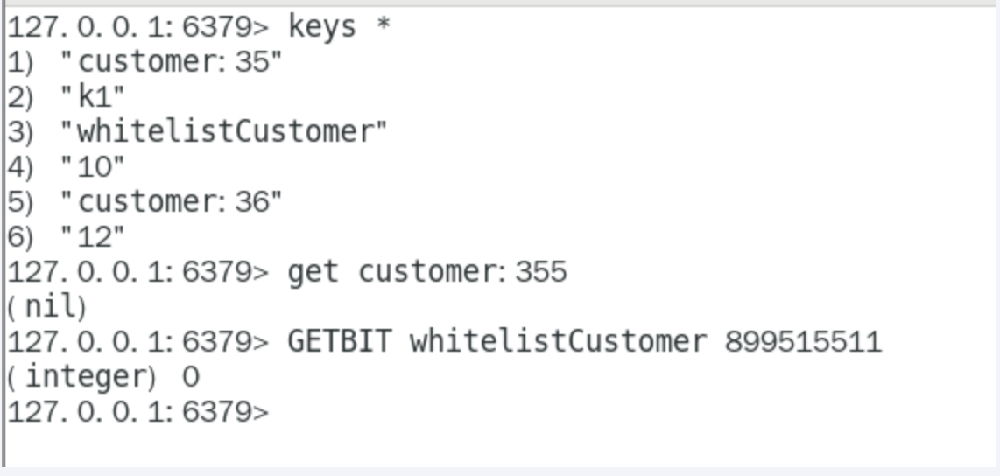

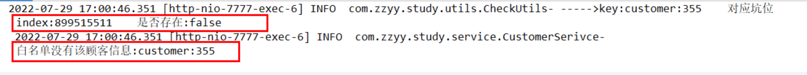

## 07、布隆过滤器优缺点

优点

- 高效地插入和查询，内存占用bit空间少

缺点

1. 不能删除元素。
2. 因为删除元素会导致误判率增加，因为hash冲突同一个位置可能存的东西十多个共有的，你删除一个元素的同时可能把其他的删除了
3. 存在误判，不能准确过滤
   1. 有，是很可能有
   2. 无，是肯定无

## 08、布谷鸟过滤器（了解）

为了解决布隆过滤器不能删除元素的问题，布谷鸟过滤器横空出世。

论文《Cuckoo Filter：Better Than Bloom》

https://www.cs.cmu.edu/~binfan/papers/conext14_cuckoofilter.pdf#:~:text=Cuckoo%20%EF%AC%81lters%20support%20adding%20and%20removing%20items%20dynamically,have%20lower%20space%20overhead%20than%20space-optimized%20Bloom%20%EF%AC%81lters.

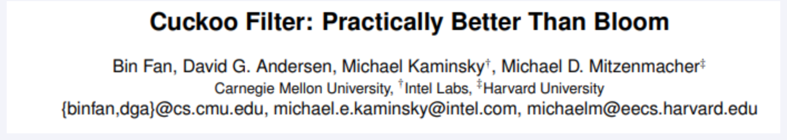

作者将布谷鸟过滤器和布隆过滤器进行了深入的对比，有兴趣的同学可以自己看看。不过，

按照阳哥企业调研，目前用的比较多比较成熟的就是布隆过滤器，

企业暂时没有升级换代的需求，考虑到上课时间有限，在此不再展开。