---
# 当前页面内容标题
title: 七、缓存预热+缓存雪崩+缓存击穿+缓存穿透
# 分类
category:
  - redis
# 标签
tag: 
  - redis
  - NOSQL
  - K,V缓存数据库
  - 非关系型数据库
sticky: false
# 是否收藏在博客主题的文章列表中，当填入数字时，数字越大，排名越靠前。
star: false
# 是否将该文章添加至文章列表中
article: true
# 是否将该文章添加至时间线中
timeline: true
---

## 01、先看看大厂真实需求+面试题反馈

- 缓存预热、雪崩、穿透、击穿分别是什么？你遇到哪几种情况？
- 缓存预热你是怎么做的？
- 如何避免或者减少雪崩？
- 穿透和击穿有什么区别？他两是一个意思还是截然不同？
- 穿透和击穿你有什么解决方案？如何避免？
- 加入出现了缓存不一致，你有那些补休方案？
- ……

## 02、缓存预热

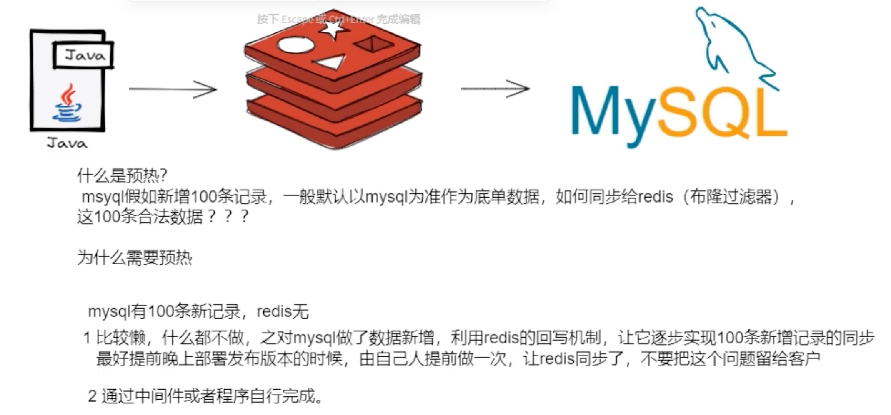

@PostContruct初始化白名单数据

## 03、缓存雪崩

**发生**

- redis主机挂了，Redis全盘崩溃，偏硬件运维
- redis中有大量key同时过期大面积失效，篇软件开发

**预防+解决**

- redis中key设置为永不过期 or 过期时间错开

- redis中缓存集群高可用
  
  1. 主从+集群
  2. Redis Cluster
  3. 开启Redis持久化机制aof/rdb，尽量回复缓存集群

- 多缓存结合预防预热
  
  - ehcache本地缓存+redis缓存

- 服务降级
  
  - Hystrix或者阿里sentinel限流&降级

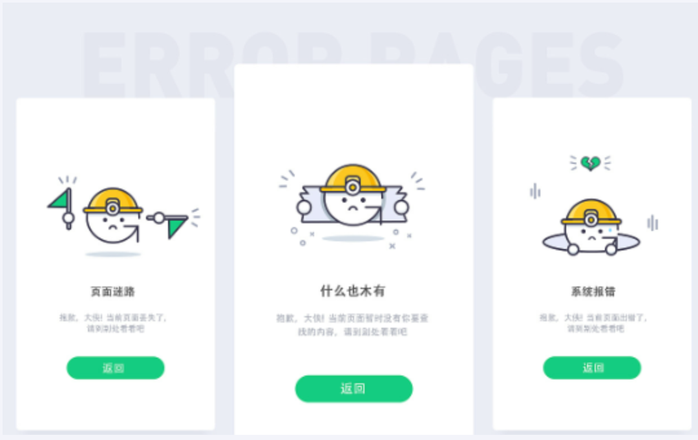

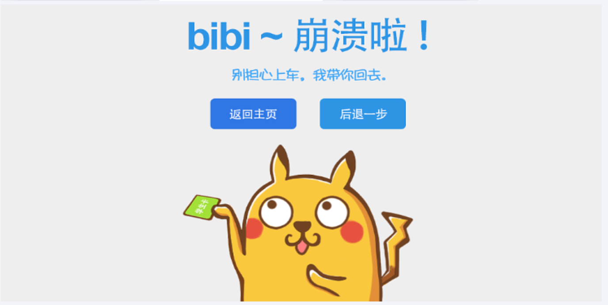

- **人民币玩家**
  - [阿里云-云数据库Redis版](https://www.aliyun.com/product/kvstore?spm=5176.54432.J_3207526240.15.2a3818a5iG19IE)

## 04、缓存穿透

>    是什么？

请求去查询一条记录，先查redis无，再查mysql无，都查不到该条记录，但是请求每次都会达到数据库上面去，导致后台数据库压力暴增，这种现象我们称为缓存穿透，这个redis变成了一个摆设。

简单说就是

本来无一物，两库都没有。

既不在Redis数据库，也不再mysql，数据库存在被多次暴击风险

>   解决


- 一图

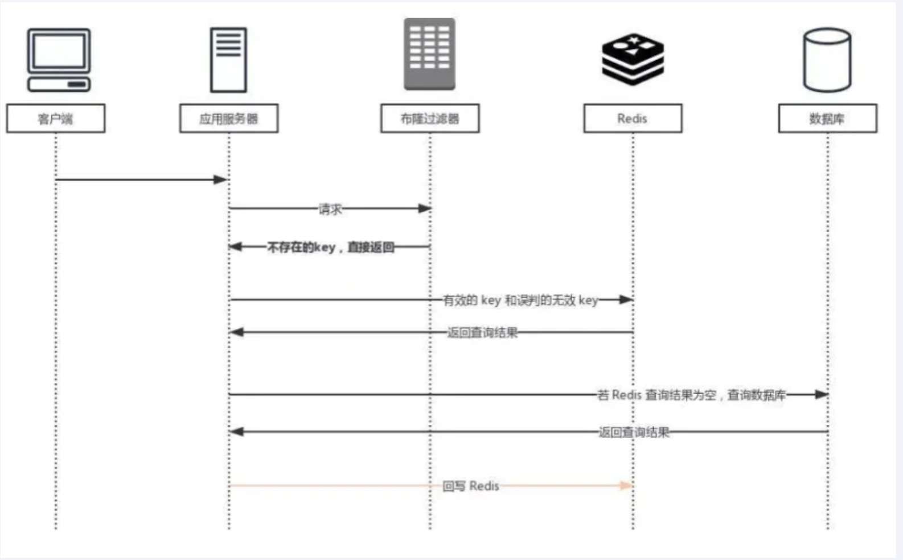

>    方案1：空对象缓存或者缺省值

**一般OK**

**第一种解决方案，回写增强**

如果发生了缓存穿透，我们可以针对要查询的数据，在Redis里存一个和业务部门商量后确定的缺省值(比如，零、负数、defaultNull等)。

比如，键uid:abcdxxx，值defaultNull作为案例的key和value

先去redis查键uid:abcdxxx没有，再去mysql查没有获得 ，这就发生了一次穿透现象。

 but，可以增强回写机制

mysql也查不到的话也让redis存入刚刚查不到的key并保护mysql。

第一次来查询uid:abcdxxx，redis和mysql都没有，返回null给调用者，但是增强回写后第二次来查uid:abcdxxx，此时redis就有值了。

可以直接从Redis中读取default缺省值返回给业务应用程序，避免了把大量请求发送给mysql处理，打爆mysql。

`但是，此方法架不住黑客的恶意攻击，有缺陷......，只能解决key相同的情况`

---

**But** 

黑客或者恶意攻击

- 黑客会对你的系统进行攻击，拿一个不存在的id去查数据，会产生大量的请求到数据库去查询。可能会导致你的数据库由于压力过大而宕掉

- key相同打你系统
  
  - 第一次打到mysql，空对象缓存后第二次就返回defaultNull缺省值，避免mysql被攻击，不用再到数据库中去走一遍了

- key不同打你系统
  
  - 由于存在空对象或缓存回写（看自己业务不限死），redis中的无关紧要的key也会越写越多（记得设置redis过期时间）

>   方案2：Google布隆过滤器Guava解决缓存穿透

- Guava中布隆过滤器的视线算是比较权威的，所以实际业务中我们可以直接使用Guava布隆过滤器

- Guava ‘s BloomFilter源码出处
  
  - https://github.com/google/guava/blob/master/guava/src/com/google/common/hash/BloomFilter.java

- 案例：白名单过滤器

**白名单架构说明**

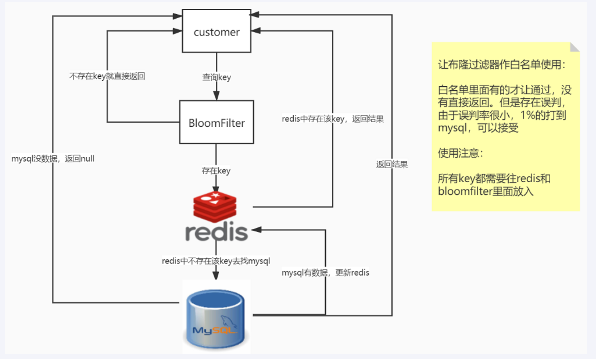

**误判问题，但是概率小可以接受，不能从布隆过滤器删除**

**全部合法的key都需要放入Guava版布隆过滤器+redis里面，不然数据就是返回null**

---

**Coding实战**

1.建Module

修改redis7_study

2.改POM

```xml
<?xml version="1.0" encoding="UTF-8"?>
<project xmlns="http://maven.apache.org/POM/4.0.0"
         xmlns:xsi="http://www.w3.org/2001/XMLSchema-instance"
         xsi:schemaLocation="http://maven.apache.org/POM/4.0.0 http://maven.apache.org/xsd/maven-4.0.0.xsd">
    <modelVersion>4.0.0</modelVersion>

    <groupId>com.atguigu.redis7</groupId>
    <artifactId>redis7_study</artifactId>
    <version>1.0-SNAPSHOT</version>

    <parent>
        <groupId>org.springframework.boot</groupId>
        <artifactId>spring-boot-starter-parent</artifactId>
        <version>2.6.10</version>
        <relativePath/>
    </parent>

    <properties>
        <project.build.sourceEncoding>UTF-8</project.build.sourceEncoding>
        <maven.compiler.source>1.8</maven.compiler.source>
        <maven.compiler.target>1.8</maven.compiler.target>
        <junit.version>4.12</junit.version>
        <log4j.version>1.2.17</log4j.version>
        <lombok.version>1.16.18</lombok.version>
    </properties>

    <dependencies>
        <!--guava Google 开源的 Guava 中自带的布隆过滤器-->
        <dependency>
            <groupId>com.google.guava</groupId>
            <artifactId>guava</artifactId>
            <version>23.0</version>
        </dependency>
        <!--SpringBoot通用依赖模块-->
        <dependency>
            <groupId>org.springframework.boot</groupId>
            <artifactId>spring-boot-starter-web</artifactId>
        </dependency>
        <!--jedis-->
        <dependency>
            <groupId>redis.clients</groupId>
            <artifactId>jedis</artifactId>
            <version>4.3.1</version>
        </dependency>
        <!--lettuce-->
        <!--<dependency>
            <groupId>io.lettuce</groupId>
            <artifactId>lettuce-core</artifactId>
            <version>6.2.1.RELEASE</version>
        </dependency>-->
        <!--SpringBoot与Redis整合依赖-->
        <dependency>
            <groupId>org.springframework.boot</groupId>
            <artifactId>spring-boot-starter-data-redis</artifactId>
        </dependency>
        <dependency>
            <groupId>org.apache.commons</groupId>
            <artifactId>commons-pool2</artifactId>
        </dependency>
        <!--swagger2-->
        <dependency>
            <groupId>io.springfox</groupId>
            <artifactId>springfox-swagger2</artifactId>
            <version>2.9.2</version>
        </dependency>
        <dependency>
            <groupId>io.springfox</groupId>
            <artifactId>springfox-swagger-ui</artifactId>
            <version>2.9.2</version>
        </dependency>
        <!--Mysql数据库驱动-->
        <dependency>
            <groupId>mysql</groupId>
            <artifactId>mysql-connector-java</artifactId>
            <version>5.1.47</version>
        </dependency>
        <!--SpringBoot集成druid连接池-->
        <dependency>
            <groupId>com.alibaba</groupId>
            <artifactId>druid-spring-boot-starter</artifactId>
            <version>1.1.10</version>
        </dependency>
        <dependency>
            <groupId>com.alibaba</groupId>
            <artifactId>druid</artifactId>
            <version>1.1.16</version>
        </dependency>
        <!--mybatis和springboot整合-->
        <dependency>
            <groupId>org.mybatis.spring.boot</groupId>
            <artifactId>mybatis-spring-boot-starter</artifactId>
            <version>1.3.0</version>
        </dependency>
        <!--hutool-->
        <dependency>
            <groupId>cn.hutool</groupId>
            <artifactId>hutool-all</artifactId>
            <version>5.2.3</version>
        </dependency>
        <!--persistence-->
        <dependency>
            <groupId>javax.persistence</groupId>
            <artifactId>persistence-api</artifactId>
            <version>1.0.2</version>
        </dependency>
        <!--通用Mapper-->
        <dependency>
            <groupId>tk.mybatis</groupId>
            <artifactId>mapper</artifactId>
            <version>4.1.5</version>
        </dependency>
        <dependency>
            <groupId>org.springframework.boot</groupId>
            <artifactId>spring-boot-autoconfigure</artifactId>
        </dependency>
        <!--通用基础配置junit/devtools/test/log4j/lombok/-->
        <dependency>
            <groupId>junit</groupId>
            <artifactId>junit</artifactId>
            <version>${junit.version}</version>
        </dependency>
        <dependency>
            <groupId>org.springframework.boot</groupId>
            <artifactId>spring-boot-starter-test</artifactId>
            <scope>test</scope>
        </dependency>
        <dependency>
            <groupId>log4j</groupId>
            <artifactId>log4j</artifactId>
            <version>${log4j.version}</version>
        </dependency>
        <dependency>
            <groupId>org.projectlombok</groupId>
            <artifactId>lombok</artifactId>
            <version>${lombok.version}</version>
            <optional>true</optional>
        </dependency>
    </dependencies>

    <build>
        <plugins>
            <plugin>
                <groupId>org.springframework.boot</groupId>
                <artifactId>spring-boot-maven-plugin</artifactId>
            </plugin>
        </plugins>
    </build>

</project>
```

3.YML

```yml
server.port=7777

spring.application.name=redis7_study

# ========================logging=====================
logging.level.root=info
logging.level.com.atguigu.redis7=info
logging.pattern.console=%d{yyyy-MM-dd HH:mm:ss.SSS} [%thread] %-5level %logger- %msg%n 

logging.file.name=D:/mylogs2023/redis7_study.log
logging.pattern.file=%d{yyyy-MM-dd HH:mm:ss.SSS} [%thread] %-5level %logger- %msg%n

# ========================swagger=====================
spring.swagger2.enabled=true
#在springboot2.6.X结合swagger2.9.X会提示documentationPluginsBootstrapper空指针异常，
#原因是在springboot2.6.X中将SpringMVC默认路径匹配策略从AntPathMatcher更改为PathPatternParser，
# 导致出错，解决办法是matching-strategy切换回之前ant_path_matcher
spring.mvc.pathmatch.matching-strategy=ant_path_matcher

# ========================redis单机=====================
spring.redis.database=0
# 修改为自己真实IP
spring.redis.host=192.168.111.185
spring.redis.port=6379
spring.redis.password=111111
spring.redis.lettuce.pool.max-active=8
spring.redis.lettuce.pool.max-wait=-1ms
spring.redis.lettuce.pool.max-idle=8
spring.redis.lettuce.pool.min-idle=0

# ========================alibaba.druid=====================
spring.datasource.type=com.alibaba.druid.pool.DruidDataSource
spring.datasource.driver-class-name=com.mysql.jdbc.Driver
spring.datasource.url=jdbc:mysql://localhost:3306/bigdata?useUnicode=true&characterEncoding=utf-8&useSSL=false
spring.datasource.username=root
spring.datasource.password=123456
spring.datasource.druid.test-while-idle=false

# ========================mybatis===================
mybatis.mapper-locations=classpath:mapper/*.xml
mybatis.type-aliases-package=com.atguigu.redis7.entities

# ========================redis集群=====================
#spring.redis.password=111111
## 获取失败 最大重定向次数
#spring.redis.cluster.max-redirects=3
#spring.redis.lettuce.pool.max-active=8
#spring.redis.lettuce.pool.max-wait=-1ms
#spring.redis.lettuce.pool.max-idle=8
#spring.redis.lettuce.pool.min-idle=0
##支持集群拓扑动态感应刷新,自适应拓扑刷新是否使用所有可用的更新，默认false关闭
#spring.redis.lettuce.cluster.refresh.adaptive=true
##定时刷新
#spring.redis.lettuce.cluster.refresh.period=2000
#spring.redis.cluster.nodes=192.168.111.185:6381,192.168.111.185:6382,192.168.111.172:6383,192.168.111.172:6384,192.168.111.184:6385,192.168.111.184:6386
```

4.主启动

```java
import org.springframework.boot.SpringApplication;
import org.springframework.boot.autoconfigure.SpringBootApplication;
import tk.mybatis.spring.annotation.MapperScan;

/**
 * @auther zzyy
 * @create 2022-12-10 23:39
 */
@SpringBootApplication
@MapperScan("com.atguigu.redis7.mapper") //import tk.mybatis.spring.annotation.MapperScan;
public class Redis7Study7777
{
    public static void main(String[] args)
    {
        SpringApplication.run(Redis7Study7777.class,args);
    }
}
```

5.业务类

**Case01**

新建测试案例，hello入门

```java
 @Test
    public void testGuavaWithBloomFilter()
    {
// 创建布隆过滤器对象
        BloomFilter<Integer> filter = BloomFilter.create(Funnels.integerFunnel(), 100);
// 判断指定元素是否存在
        System.out.println(filter.mightContain(1));
        System.out.println(filter.mightContain(2));
// 将元素添加进布隆过滤器
        filter.put(1);
        filter.put(2);
        System.out.println(filter.mightContain(1));
        System.out.println(filter.mightContain(2));
    }
```

**Case02**

GuavaBloomFilterController

```java
import com.atguigu.redis7.service.GuavaBloomFilterService;
import io.swagger.annotations.Api;
import io.swagger.annotations.ApiOperation;
import lombok.extern.slf4j.Slf4j;
import org.springframework.web.bind.annotation.PathVariable;
import org.springframework.web.bind.annotation.RequestMapping;
import org.springframework.web.bind.annotation.RequestMethod;
import org.springframework.web.bind.annotation.RestController;

import javax.annotation.Resource;

/**
 * @auther zzyy
 * @create 2022-12-30 16:50
 */
@Api(tags = "google工具Guava处理布隆过滤器")
@RestController
@Slf4j
public class GuavaBloomFilterController
{
    @Resource
    private GuavaBloomFilterService guavaBloomFilterService;

    @ApiOperation("guava布隆过滤器插入100万样本数据并额外10W测试是否存在")
    @RequestMapping(value = "/guavafilter",method = RequestMethod.GET)
    public void guavaBloomFilter()
    {
        guavaBloomFilterService.guavaBloomFilter();
    }
}
```

GuavaBloomFilterService

```java
import com.google.common.hash.BloomFilter;
import com.google.common.hash.Funnels;
import lombok.extern.slf4j.Slf4j;
import org.springframework.stereotype.Service;

import java.util.ArrayList;
import java.util.List;

/**
 * @auther zzyy
 * @create 2022-12-30 16:50
 */
@Service
@Slf4j
public class GuavaBloomFilterService{
    public static final int _1W = 10000;
    //布隆过滤器里预计要插入多少数据
    public static int size = 100 * _1W;
    //误判率,它越小误判的个数也就越少(思考，是不是可以设置的无限小，没有误判岂不更好)
    //fpp the desired false positive probability
    public static double fpp = 0.03;
    // 构建布隆过滤器
    private static BloomFilter<Integer> bloomFilter = BloomFilter.create(Funnels.integerFunnel(), size,fpp);
    public void guavaBloomFilter(){
        //1 先往布隆过滤器里面插入100万的样本数据
        for (int i = 1; i <=size; i++) {
            bloomFilter.put(i);
        }
        //故意取10万个不在过滤器里的值，看看有多少个会被认为在过滤器里
        List<Integer> list = new ArrayList<>(10 * _1W);
        for (int i = size+1; i <= size + (10 *_1W); i++) {
            if (bloomFilter.mightContain(i)) {
                log.info("被误判了:{}",i);
                list.add(i);
            }
        }
        log.info("误判的总数量：:{}",list.size());
    }
}
```

取样本100W数据，查查不在100W范围内，其他10W数据是否存在

上一步结论；

现在总共有10万数据是不存在的，误判了3033次，

原始样本：100W

不存在数据:1000001W---1100000W   

`我们计算下误判率:===========》` 

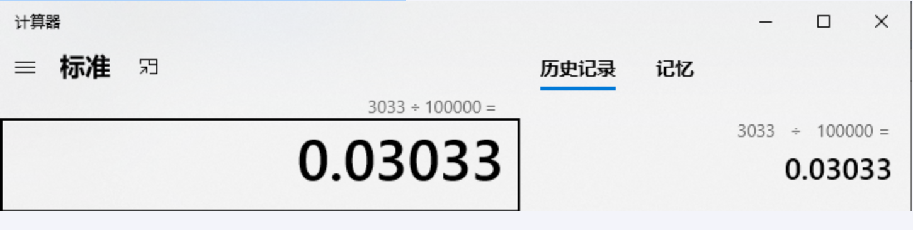

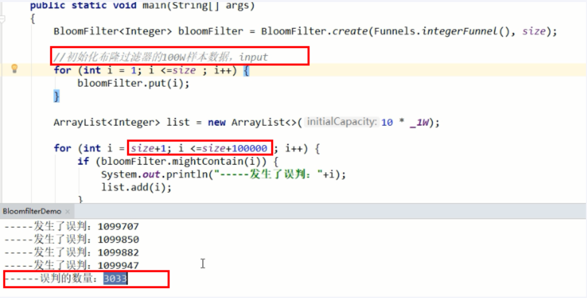

6.debug源码分析下，看看hash函数

7.布隆过滤器说明

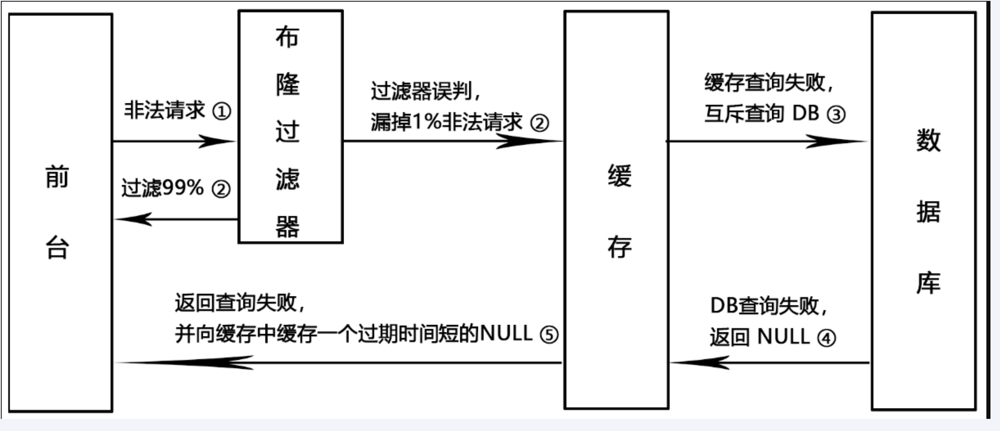

---

- 家庭作业思考题：黑名单使用

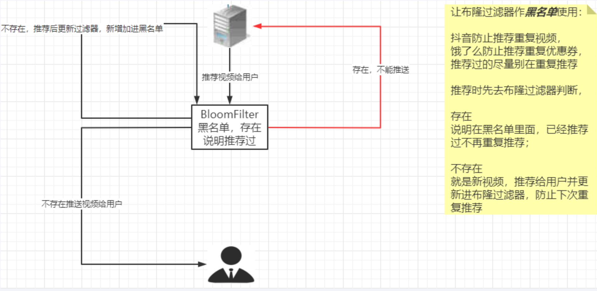

## 05、缓存击穿

>   是什么？

大量的请求同时查询一个key时，此时这个key正好消失了，就会导致大量的请求都打到数据库上面去

简单来说就是热点key突然失效了，暴打mysql

备注：击穿和穿透，截然不同

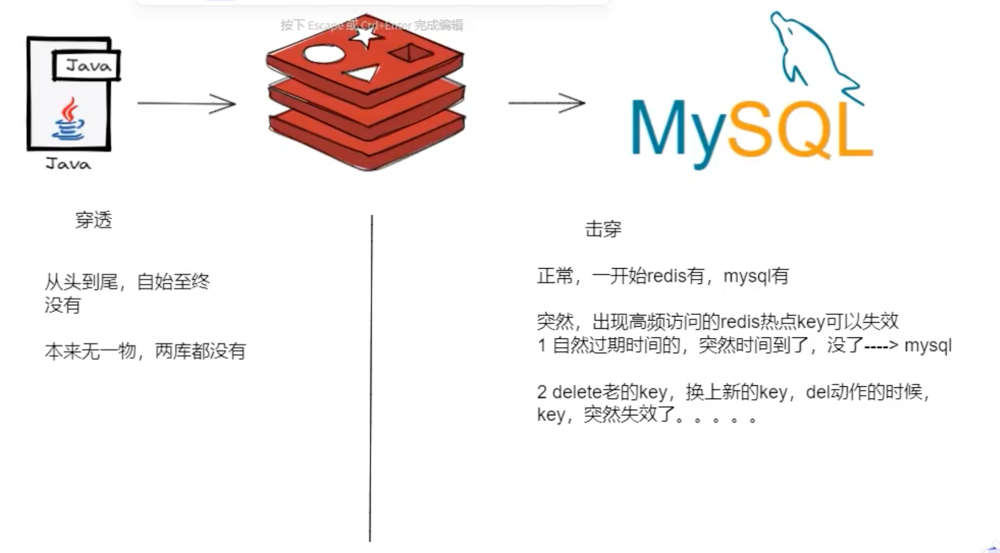

>   危害

会造成某一时刻数据库请求量过大，压力暴增

一般技术部门需要知道`热点key是哪些个`？做到心里有数防止击穿

>   解决


**热点key失效**

- 时间到了自然消除但还未被访问到
- delete掉的key，刚巧又被访问

`方案1：差异失效时间，对于访问频繁的热点key，干脆不设置过期时间`

`方案2：互斥跟新，采用双检加锁策略`

多个线程同时去查询数据库的这条数据，那么我们可以在第一个查询数据的请求上`使用一个 互斥锁来锁住它`。

其他的线程走到这一步拿不到锁就等着，等第一个线程查询到了数据，然后做缓存。后面的线程进来发现已经有缓存了，就直接走缓存。

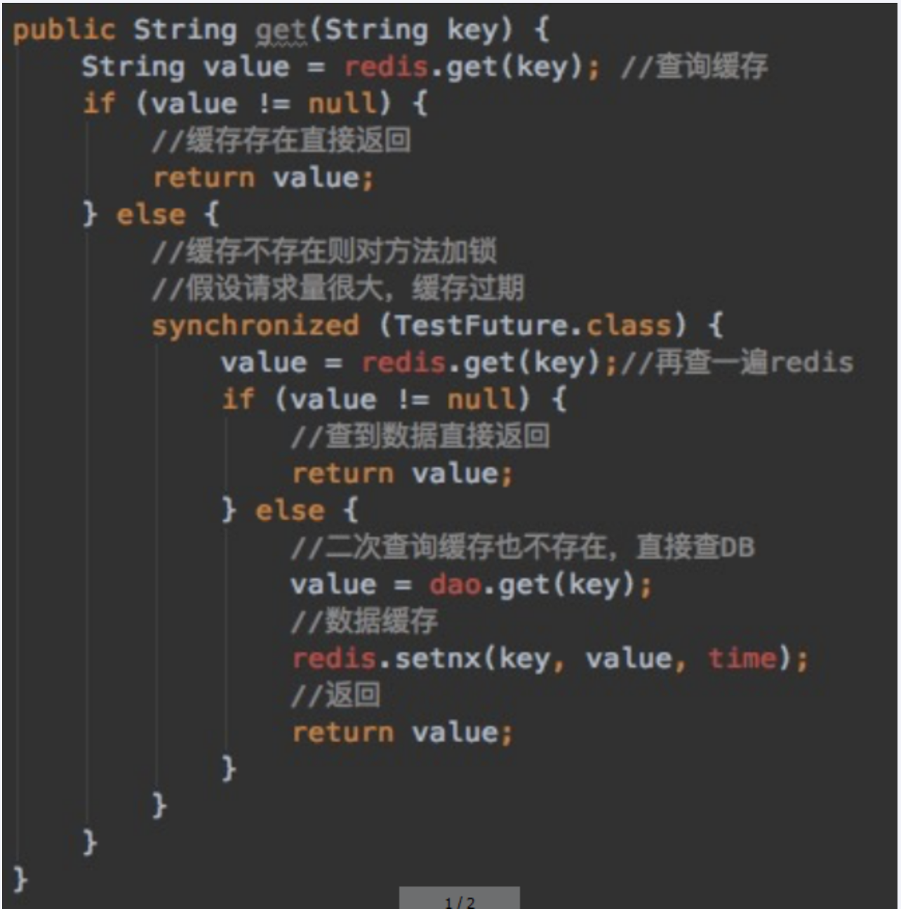

>   案例

**天猫聚划算功能实现+防止缓存击穿**

---

**模拟高并发的天猫聚划算案例code**

**是什么**

生产案例网址：www.taobao.com

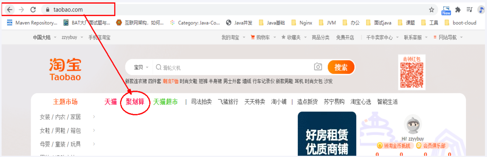


**问题，热点key突然失效导致了缓存击穿**

---

**技术方面实现**

分析过程

| 步骤  | 说明                                               |
| --- | ------------------------------------------------ |
| 1   | 100%高并发，绝对不可以用mysql实现                            |
| 2   | 先把mysql里面参加活动的数据抽取进redis，一般采用定时器扫描来决定上线活动还是下线取消。 |
| 3   | 支持分页功能，一页20条记录                                   |
|     | 请大家思考，redis里面什么样子的数据类型支持上述功能？                    |

高并发+定时任务+分页显示。。。。

redis数据类型选型

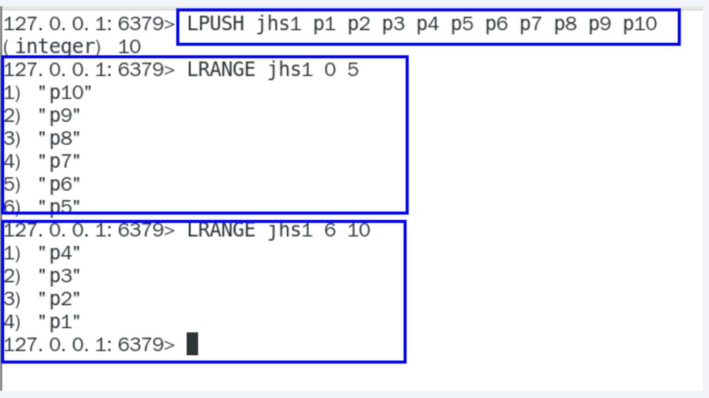

**springboot+redis实现高并发的聚划算业务V2**

1.建Module

修改redis7_study

2.改POM：无

3.写YML：无

4.主启动：无

5.业务类

entity

```java
import io.swagger.annotations.ApiModel;
import lombok.AllArgsConstructor;
import lombok.Data;
import lombok.NoArgsConstructor;

/**
 * @auther zzyy
 * @create 2022-12-31 14:24
 */
@Data
@AllArgsConstructor
@NoArgsConstructor
@ApiModel(value = "聚划算活动producet信息")
public class Product
{
    //产品ID
    private Long id;
    //产品名称
    private String name;
    //产品价格
    private Integer price;
    //产品详情
    private String detail;
}
```

JHSTaskService

```java
import cn.hutool.core.date.DateUtil;
import com.atguigu.redis7.entities.Product;
import lombok.extern.slf4j.Slf4j;
import org.springframework.beans.factory.annotation.Autowired;
import org.springframework.data.redis.core.RedisTemplate;
import org.springframework.stereotype.Service;

import javax.annotation.PostConstruct;
import java.util.ArrayList;
import java.util.List;
import java.util.Random;
import java.util.concurrent.TimeUnit;

/**
 * @auther zzyy
 * @create 2022-12-31 14:26
 */
@Service
@Slf4j
public class JHSTaskService
{
    public  static final String JHS_KEY="jhs";
    public  static final String JHS_KEY_A="jhs:a";
    public  static final String JHS_KEY_B="jhs:b";

    @Autowired
    private RedisTemplate redisTemplate;

    /**
     * 偷个懒不加mybatis了，模拟从数据库读取100件特价商品，用于加载到聚划算的页面中
     * @return
     */
    private List<Product> getProductsFromMysql() {
        List<Product> list=new ArrayList<>();
        for (int i = 1; i <=20; i++) {
            Random rand = new Random();
            int id= rand.nextInt(10000);
            Product obj=new Product((long) id,"product"+i,i,"detail");
            list.add(obj);
        }
        return list;
    }

    @PostConstruct
    public void initJHS(){
        log.info("启动定时器淘宝聚划算功能模拟.........."+ DateUtil.now());
        new Thread(() -> {
            //模拟定时器一个后台任务，定时把数据库的特价商品，刷新到redis中
            while (true){
                //模拟从数据库读取100件特价商品，用于加载到聚划算的页面中
                List<Product> list=this.getProductsFromMysql();
                //采用redis list数据结构的lpush来实现存储
                this.redisTemplate.delete(JHS_KEY);
                //lpush命令
                this.redisTemplate.opsForList().leftPushAll(JHS_KEY,list);
                //间隔一分钟 执行一遍，模拟聚划算每3天刷新一批次参加活动
                try { TimeUnit.MINUTES.sleep(1); } catch (InterruptedException e) { e.printStackTrace(); }

                log.info("runJhs定时刷新..............");
            }
        },"t1").start();
    }
}
```

采用定时器将参与聚划算活动的特价商品新增入redis中

JHSProductController

```java
import com.atguigu.redis7.entities.Product;
import io.swagger.annotations.Api;
import io.swagger.annotations.ApiOperation;
import lombok.extern.slf4j.Slf4j;
import org.springframework.beans.factory.annotation.Autowired;
import org.springframework.data.redis.core.RedisTemplate;
import org.springframework.util.CollectionUtils;
import org.springframework.web.bind.annotation.RequestMapping;
import org.springframework.web.bind.annotation.RequestMethod;
import org.springframework.web.bind.annotation.RestController;

import java.util.List;

/**
 * @auther zzyy
 * @create 2022-12-31 14:29
 */
@RestController
@Slf4j
@Api(tags = "聚划算商品列表接口")
public class JHSProductController
{
    public  static final String JHS_KEY="jhs";
    public  static final String JHS_KEY_A="jhs:a";
    public  static final String JHS_KEY_B="jhs:b";

    @Autowired
    private RedisTemplate redisTemplate;

    /**
     * 分页查询：在高并发的情况下，只能走redis查询，走db的话必定会把db打垮
     * @param page
     * @param size
     * @return
     */
    @RequestMapping(value = "/pruduct/find",method = RequestMethod.GET)
    @ApiOperation("按照分页和每页显示容量，点击查看")
    public List<Product> find(int page, int size) {
        List<Product> list=null;

        long start = (page - 1) * size;
        long end = start + size - 1;

        try {
            //采用redis list数据结构的lrange命令实现分页查询
            list = this.redisTemplate.opsForList().range(JHS_KEY, start, end);
            if (CollectionUtils.isEmpty(list)) {
                //TODO 走DB查询
            }
            log.info("查询结果：{}", list);
        } catch (Exception ex) {
            //这里的异常，一般是redis瘫痪 ，或 redis网络timeout
            log.error("exception:", ex);
            //TODO 走DB查询
        }

        return list;
    }
}
```

6.备注

至此步骤，上述聚划算的功能算是完成，请思考在高并发下有什么经典问题？

7.Bug和隐患说明

- 热点key突然失效导致可拍的缓存击穿

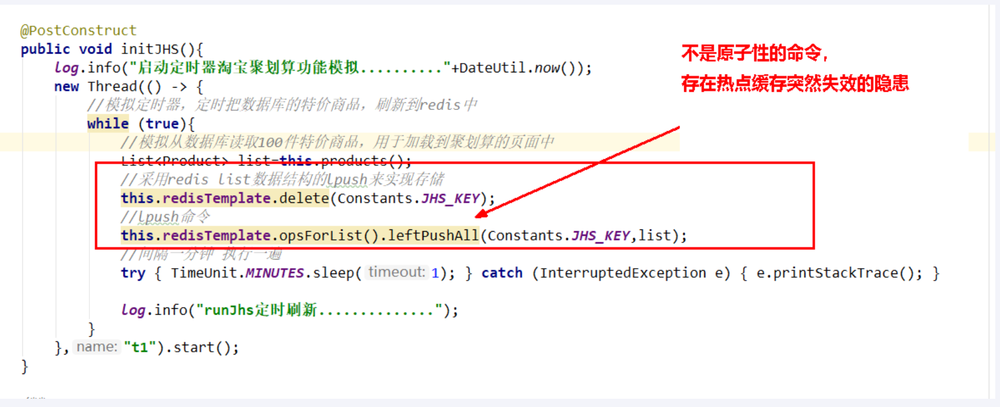

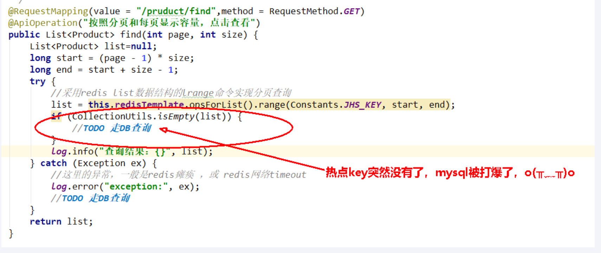

delete命令执行的一瞬间有间隙，其他请求线程继续找redis为null

打到了mysql，暴击……

- 复习again

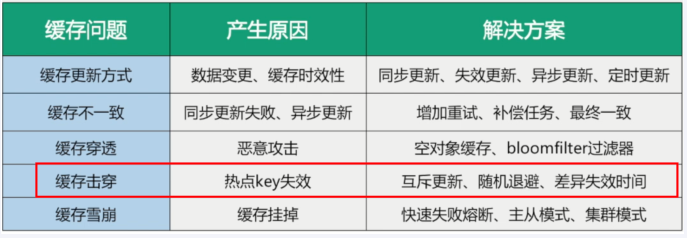

- 最终目的：2条命令原子性还是其次，主要是防止热key突然失效暴击mysql打爆系统，^ _ ^

8.进一步升级加固案例

- 复习，互斥更新，采用双检加锁策略

多个线程同时去查询数据库的这条数据，那么我们可以在第一个查询数据的请求上`使用一个 互斥锁来锁住它`。

其他的线程走到这一步拿不到锁就等着，等第一个线程查询到了数据，然后做缓存。后面的线程进来发现已经有缓存了，就直接走缓存。

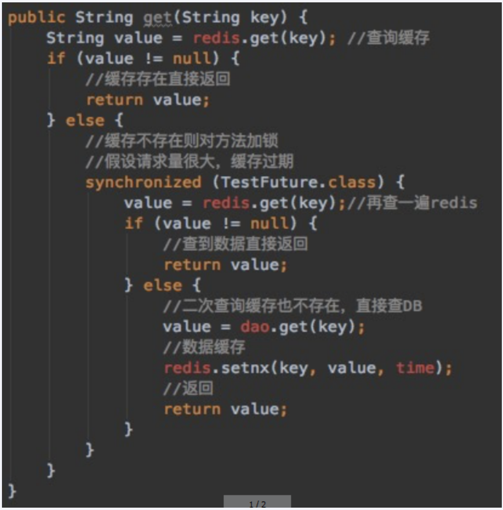

- 差异失效时间

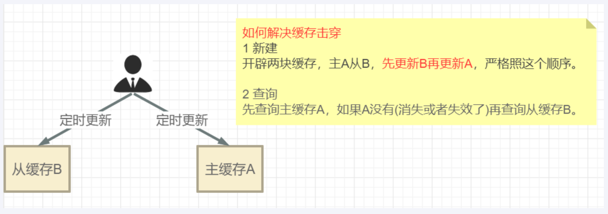

JHStackService

```java
import cn.hutool.core.date.DateUtil;
import com.atguigu.redis7.entities.Product;
import lombok.extern.slf4j.Slf4j;
import org.springframework.beans.factory.annotation.Autowired;
import org.springframework.data.redis.core.RedisTemplate;
import org.springframework.stereotype.Service;

import javax.annotation.PostConstruct;
import java.util.ArrayList;
import java.util.List;
import java.util.Random;
import java.util.concurrent.TimeUnit;

/**
 * @auther zzyy
 * @create 2022-12-31 14:26
 */
@Service
@Slf4j
public class JHSTaskService
{
    public  static final String JHS_KEY="jhs";
    public  static final String JHS_KEY_A="jhs:a";
    public  static final String JHS_KEY_B="jhs:b";

    @Autowired
    private RedisTemplate redisTemplate;

    /**
     * 偷个懒不加mybatis了，模拟从数据库读取100件特价商品，用于加载到聚划算的页面中
     * @return
     */
    private List<Product> getProductsFromMysql() {
        List<Product> list=new ArrayList<>();
        for (int i = 1; i <=20; i++) {
            Random rand = new Random();
            int id= rand.nextInt(10000);
            Product obj=new Product((long) id,"product"+i,i,"detail");
            list.add(obj);
        }
        return list;
    }

    //@PostConstruct
    public void initJHS(){
        log.info("启动定时器淘宝聚划算功能模拟.........."+ DateUtil.now());
        new Thread(() -> {
            //模拟定时器，定时把数据库的特价商品，刷新到redis中
            while (true){
                //模拟从数据库读取100件特价商品，用于加载到聚划算的页面中
                List<Product> list=this.getProductsFromMysql();
                //采用redis list数据结构的lpush来实现存储
                this.redisTemplate.delete(JHS_KEY);
                //lpush命令
                this.redisTemplate.opsForList().leftPushAll(JHS_KEY,list);
                //间隔一分钟 执行一遍
                try { TimeUnit.MINUTES.sleep(1); } catch (InterruptedException e) { e.printStackTrace(); }

                log.info("runJhs定时刷新..............");
            }
        },"t1").start();
    }

    @PostConstruct
    public void initJHSAB(){
        log.info("启动AB定时器计划任务淘宝聚划算功能模拟.........."+DateUtil.now());
        new Thread(() -> {
            //模拟定时器，定时把数据库的特价商品，刷新到redis中
            while (true){
                //模拟从数据库读取100件特价商品，用于加载到聚划算的页面中
                List<Product> list=this.getProductsFromMysql();
                //先更新B缓存
                this.redisTemplate.delete(JHS_KEY_B);
                this.redisTemplate.opsForList().leftPushAll(JHS_KEY_B,list);
                this.redisTemplate.expire(JHS_KEY_B,20L,TimeUnit.DAYS);
                //再更新A缓存
                this.redisTemplate.delete(JHS_KEY_A);
                this.redisTemplate.opsForList().leftPushAll(JHS_KEY_A,list);
                this.redisTemplate.expire(JHS_KEY_A,15L,TimeUnit.DAYS);
                //间隔一分钟 执行一遍
                try { TimeUnit.MINUTES.sleep(1); } catch (InterruptedException e) { e.printStackTrace(); }

                log.info("runJhs定时刷新双缓存AB两层..............");
            }
        },"t1").start();
    }
}
```

JHSProductController

```java
import com.atguigu.redis7.entities.Product;
import io.swagger.annotations.Api;
import io.swagger.annotations.ApiOperation;
import lombok.extern.slf4j.Slf4j;
import org.springframework.beans.factory.annotation.Autowired;
import org.springframework.data.redis.core.RedisTemplate;
import org.springframework.util.CollectionUtils;
import org.springframework.web.bind.annotation.RequestMapping;
import org.springframework.web.bind.annotation.RequestMethod;
import org.springframework.web.bind.annotation.RestController;

import java.util.List;

/**
 * @auther zzyy
 * @create 2022-12-31 14:29
 */
@RestController
@Slf4j
@Api(tags = "聚划算商品列表接口")
public class JHSProductController
{
    public  static final String JHS_KEY="jhs";
    public  static final String JHS_KEY_A="jhs:a";
    public  static final String JHS_KEY_B="jhs:b";

    @Autowired
    private RedisTemplate redisTemplate;

    /**
     * 分页查询：在高并发的情况下，只能走redis查询，走db的话必定会把db打垮
     * @param page
     * @param size
     * @return
     */
    @RequestMapping(value = "/pruduct/find",method = RequestMethod.GET)
    @ApiOperation("按照分页和每页显示容量，点击查看")
    public List<Product> find(int page, int size) {
        List<Product> list=null;

        long start = (page - 1) * size;
        long end = start + size - 1;

        try {
            //采用redis list数据结构的lrange命令实现分页查询
            list = this.redisTemplate.opsForList().range(JHS_KEY, start, end);
            if (CollectionUtils.isEmpty(list)) {
                //TODO 走DB查询
            }
            log.info("查询结果：{}", list);
        } catch (Exception ex) {
            //这里的异常，一般是redis瘫痪 ，或 redis网络timeout
            log.error("exception:", ex);
            //TODO 走DB查询
        }

        return list;
    }

    @RequestMapping(value = "/pruduct/findab",method = RequestMethod.GET)
    @ApiOperation("防止热点key突然失效，AB双缓存架构")
    public List<Product> findAB(int page, int size) {
        List<Product> list=null;
        long start = (page - 1) * size;
        long end = start + size - 1;
        try {
            //采用redis list数据结构的lrange命令实现分页查询
            list = this.redisTemplate.opsForList().range(JHS_KEY_A, start, end);
            if (CollectionUtils.isEmpty(list)) {
                log.info("=========A缓存已经失效了，记得人工修补，B缓存自动延续5天");
                //用户先查询缓存A(上面的代码)，如果缓存A查询不到（例如，更新缓存的时候删除了），再查询缓存B
                this.redisTemplate.opsForList().range(JHS_KEY_B, start, end);
                //TODO 走DB查询
            }
            log.info("查询结果：{}", list);
        } catch (Exception ex) {
            //这里的异常，一般是redis瘫痪 ，或 redis网络timeout
            log.error("exception:", ex);
            //TODO 走DB查询
        }
        return list;
    }
}
```

## 06、总结

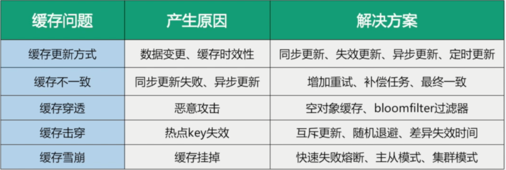