---
# 当前页面内容标题
title: 八、手写Redis分布式锁
# 分类
category:
  - redis
# 标签
tag: 
  - redis
  - NOSQL
  - K,V缓存数据库
  - 非关系型数据库
sticky: false
# 是否收藏在博客主题的文章列表中，当填入数字时，数字越大，排名越靠前。
star: false
# 是否将该文章添加至文章列表中
article: true
# 是否将该文章添加至时间线中
timeline: true
---

## 01、反馈回来的题目

> - Redis处理拿来做缓存，你还见过基于Redis的什么用法？
>   
>   1. 数据和共享，分布式Session
>   2. 分布式锁
>   3. 计数器、点赞
>   4. 全局ID
>   5. 位统计
>   6. 购物车
>   7. 轻量级消息队列
>      - list
>      - stream
>   8. 抽奖
>   9. 点赞、签到、打卡
>   10. 差集交集并集，用户关注、可能认识的人，推荐模型
>   11. 热点新闻、热搜排行榜
> 
> - Redis做分布式锁的时候需要注意的问题？
> 
> - 你们公司实现的分布式锁是否用的setnx命令实现？这个是最合适的嘛？你如何考虑分布式锁的可重入问题？
> 
> - 如果Redis是单点部署的，会带来什么问题？——那你准备怎么解决单点问题？
> 
> - Redis集群模式下，比如主次模型，CAP方面有没有什么问题？
> 
> - 那你简单介绍一下 Redlock吧？你简历上写 redisson ，你谈谈
> 
> - Redis分布式锁如何续期？看门狗知道嘛？
> 
> - ……

## 02、锁的种类

**单击版同一个JVM虚拟机内，`synchronized或者Lock接口`**

**分布式多个不同JVM虚拟机，单机的线程锁机制不再起作用，资源类在不同的服务器之间共享了。**

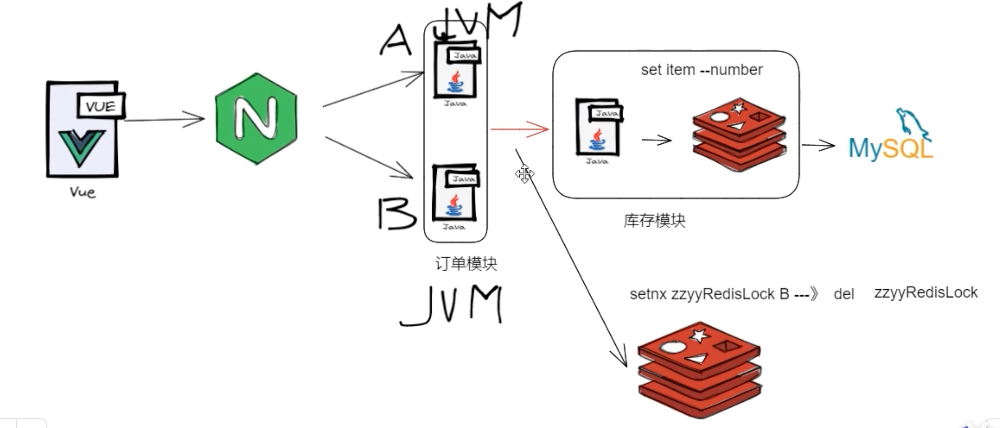

## 03、一个靠谱分布式锁需要具备的条件与刚需

- 独占性
  - OnlyOne，任何时刻只能有且仅有一个线程持有
- 高可用
  - 在Redis集群环境下，不能因为某一个节点挂了而出现获取锁和释放锁失败的情况
  - 高并发请求下，性能依旧OK好使
- 防死锁
  - 杜绝死锁，必须有超时控制机制或者撤销操作，有个兜底终止跳出方案
- 不乱抢
  - 防止张冠李戴，不能私下unlock别人的锁，只能自己加锁自己释放，自己约的锁含着泪也要自己解
- 重入性
  - 同一个节点的同一个线程如果获得所之后，它也可以再次获取这个锁。

## 04、分布式锁

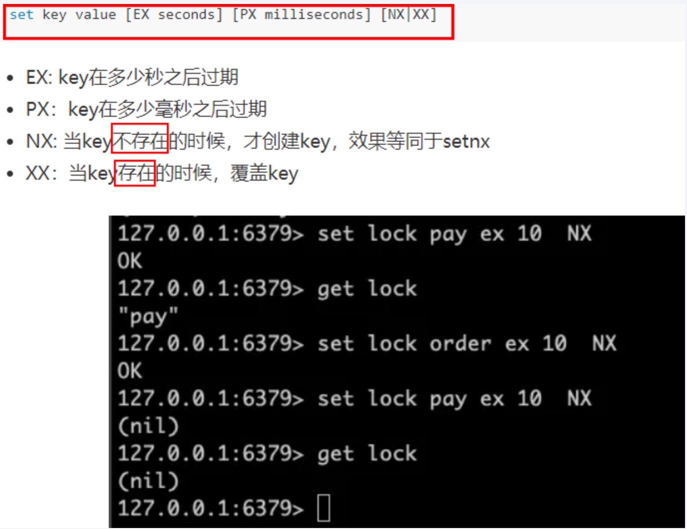

- setnx key value

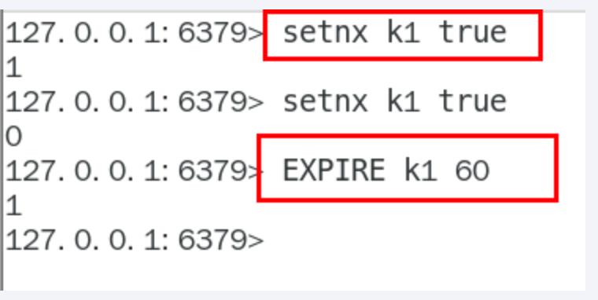

差评，setnx+expire不安全，两条命令非原子性的

- set key value [EX seconds] [PX milliseconds] [NX|XX]

## 05、重点

>   JUC中AQS锁的规范落地参考+可重入锁考虑+Lua脚本+Redis命令一步步实现分布式锁

## 06、Base案例（boot+redis）

1.使用场景

多个服务间保证同一时刻同一时间段内同一个用户只能有一个请求（防止关键业务出现并发攻击）

2.建Module

redis_distributed_lock2

redis_distributed_lock3

3.改POM

```xml
<?xml version="1.0" encoding="UTF-8"?>
<project xmlns="http://maven.apache.org/POM/4.0.0"
         xmlns:xsi="http://www.w3.org/2001/XMLSchema-instance"
         xsi:schemaLocation="http://maven.apache.org/POM/4.0.0 http://maven.apache.org/xsd/maven-4.0.0.xsd">
    <modelVersion>4.0.0</modelVersion>

    <groupId>com.atguigu.redislock</groupId>
    <artifactId>redis_distributed_lock2</artifactId>
    <version>1.0-SNAPSHOT</version>


    <parent>
        <groupId>org.springframework.boot</groupId>
        <artifactId>spring-boot-starter-parent</artifactId>
        <version>2.6.12</version>
        <relativePath/> <!-- lookup parent from repository -->
    </parent>


    <properties>
        <project.build.sourceEncoding>UTF-8</project.build.sourceEncoding>
        <maven.compiler.source>8</maven.compiler.source>
        <maven.compiler.target>8</maven.compiler.target>
        <lombok.version>1.16.18</lombok.version>
    </properties>


    <dependencies>
        <!--SpringBoot通用依赖模块-->
        <dependency>
            <groupId>org.springframework.boot</groupId>
            <artifactId>spring-boot-starter-web</artifactId>
        </dependency>
        <!--SpringBoot与Redis整合依赖-->
        <dependency>
            <groupId>org.springframework.boot</groupId>
            <artifactId>spring-boot-starter-data-redis</artifactId>
        </dependency>
        <dependency>
            <groupId>org.apache.commons</groupId>
            <artifactId>commons-pool2</artifactId>
        </dependency>
        <!--swagger2-->
        <dependency>
            <groupId>io.springfox</groupId>
            <artifactId>springfox-swagger2</artifactId>
            <version>2.9.2</version>
        </dependency>
        <dependency>
            <groupId>io.springfox</groupId>
            <artifactId>springfox-swagger-ui</artifactId>
            <version>2.9.2</version>
        </dependency>
        <!--通用基础配置boottest/lombok/hutool-->
        <dependency>
            <groupId>org.springframework.boot</groupId>
            <artifactId>spring-boot-starter-test</artifactId>
            <scope>test</scope>
        </dependency>
        <dependency>
            <groupId>org.projectlombok</groupId>
            <artifactId>lombok</artifactId>
            <version>${lombok.version}</version>
            <optional>true</optional>
        </dependency>
        <dependency>
            <groupId>cn.hutool</groupId>
            <artifactId>hutool-all</artifactId>
            <version>5.8.8</version>
        </dependency>
    </dependencies>

    <build>
        <plugins>
            <plugin>
                <groupId>org.springframework.boot</groupId>
                <artifactId>spring-boot-maven-plugin</artifactId>
            </plugin>
        </plugins>
    </build>

</project>
```

4.YML

```yml
server.port=7777

spring.application.name=redis_distributed_lock
# ========================swagger2=====================
# http://localhost:7777/swagger-ui.html
swagger2.enabled=true
spring.mvc.pathmatch.matching-strategy=ant_path_matcher

# ========================redis单机=====================
spring.redis.database=0
spring.redis.host=192.168.111.185
spring.redis.port=6379
spring.redis.password=111111
spring.redis.lettuce.pool.max-active=8
spring.redis.lettuce.pool.max-wait=-1ms
spring.redis.lettuce.pool.max-idle=8
spring.redis.lettuce.pool.min-idle=0
```

5.主启动

```java
import org.springframework.boot.SpringApplication;
import org.springframework.boot.autoconfigure.SpringBootApplication;

/**
 * @auther zzyy
 * @create 2022-10-12 22:20
 */
@SpringBootApplication
public class RedisDistributedLockApp7777
{
    public static void main(String[] args)
    {
        SpringApplication.run(RedisDistributedLockApp7777.class,args);
    }
}
```

6.业务类

Swagger2Config

```java
package com.atguigu.redislock.config;

import org.springframework.beans.BeansException;
import org.springframework.beans.factory.annotation.Value;
import org.springframework.beans.factory.config.BeanPostProcessor;
import org.springframework.context.annotation.Bean;
import org.springframework.context.annotation.Configuration;
import org.springframework.web.servlet.mvc.method.RequestMappingInfoHandlerMapping;
import springfox.documentation.builders.ApiInfoBuilder;
import springfox.documentation.builders.PathSelectors;
import springfox.documentation.builders.RequestHandlerSelectors;
import springfox.documentation.service.ApiInfo;
import springfox.documentation.spi.DocumentationType;
import springfox.documentation.spring.web.plugins.Docket;
import springfox.documentation.spring.web.plugins.WebMvcRequestHandlerProvider;
import springfox.documentation.swagger2.annotations.EnableSwagger2;

import java.time.LocalDateTime;
import java.time.format.DateTimeFormatter;
import java.util.List;
import java.util.stream.Collectors;

/**
 * @auther zzyy
 * @create 2022-10-12 21:55
 */
@Configuration
@EnableSwagger2
public class Swagger2Config
{
    @Value("${swagger2.enabled}")
    private Boolean enabled;

    @Bean
    public Docket createRestApi() {
        return new Docket(DocumentationType.SWAGGER_2)
                .apiInfo(apiInfo())
                .enable(enabled)
                .select()
                .apis(RequestHandlerSelectors.basePackage("com.atguigu.redislock")) //你自己的package
                .paths(PathSelectors.any())
                .build();
    }
    private ApiInfo apiInfo() {
        return new ApiInfoBuilder()
                .title("springboot利用swagger2构建api接口文档 "+"\t"+ DateTimeFormatter.ofPattern("yyyy-MM-dd").format(LocalDateTime.now()))
                .description("springboot+redis整合")
                .version("1.0")
                .termsOfServiceUrl("https://www.baidu.com/")
                .build();
    }

}
```

RedisConfig

```java
package com.atguigu.redislock.config;

import org.springframework.context.annotation.Bean;
import org.springframework.context.annotation.Configuration;
import org.springframework.data.redis.connection.lettuce.LettuceConnectionFactory;
import org.springframework.data.redis.core.RedisTemplate;
import org.springframework.data.redis.serializer.GenericJackson2JsonRedisSerializer;
import org.springframework.data.redis.serializer.StringRedisSerializer;

/**
 * @auther zzyy
 * @create 2022-07-02 11:25
 */
@Configuration
public class RedisConfig
{
    @Bean
    public RedisTemplate<String, Object> redisTemplate(LettuceConnectionFactory lettuceConnectionFactory)
    {
        RedisTemplate<String,Object> redisTemplate = new RedisTemplate<>();
        redisTemplate.setConnectionFactory(lettuceConnectionFactory);
        //设置key序列化方式string
        redisTemplate.setKeySerializer(new StringRedisSerializer());
        //设置value的序列化方式json
        redisTemplate.setValueSerializer(new GenericJackson2JsonRedisSerializer());

        redisTemplate.setHashKeySerializer(new StringRedisSerializer());
        redisTemplate.setHashValueSerializer(new GenericJackson2JsonRedisSerializer());

        redisTemplate.afterPropertiesSet();

        return redisTemplate;
    }
}
```

InventoryService

```java
package com.atguigu.redislock.service;

import cn.hutool.core.util.IdUtil;
import lombok.extern.slf4j.Slf4j;
import org.springframework.beans.factory.annotation.Autowired;
import org.springframework.beans.factory.annotation.Value;
import org.springframework.data.redis.core.StringRedisTemplate;
import org.springframework.stereotype.Service;

import java.util.concurrent.locks.Lock;
import java.util.concurrent.locks.ReentrantLock;

/**
 * @auther zzyy
 * @create 2022-10-22 15:14
 */
@Service
@Slf4j
public class InventoryService
{
    @Autowired
    private StringRedisTemplate stringRedisTemplate;
    @Value("${server.port}")
    private String port;

    private Lock lock = new ReentrantLock();

    public String sale()
    {
        String retMessage = "";
        lock.lock();
        try
        {
            //1 查询库存信息
            String result = stringRedisTemplate.opsForValue().get("inventory001");
            //2 判断库存是否足够
            Integer inventoryNumber = result == null ? 0 : Integer.parseInt(result);
            //3 扣减库存
            if(inventoryNumber > 0) {
                stringRedisTemplate.opsForValue().set("inventory001",String.valueOf(--inventoryNumber));
                retMessage = "成功卖出一个商品，库存剩余: "+inventoryNumber;
                System.out.println(retMessage);
            }else{
                retMessage = "商品卖完了，o(╥﹏╥)o";
            }
        }finally {
            lock.unlock();
        }
        return retMessage+"\t"+"服务端口号："+port;
    }
}
```

InventoryController

```java
package com.atguigu.redislock.controller;

import cn.hutool.core.util.IdUtil;
import com.atguigu.redislock.service.InventoryService;
import io.swagger.annotations.Api;
import io.swagger.annotations.ApiOperation;
import lombok.Getter;
import org.springframework.beans.factory.annotation.Autowired;
import org.springframework.web.bind.annotation.GetMapping;
import org.springframework.web.bind.annotation.ResponseStatus;
import org.springframework.web.bind.annotation.RestController;

import java.util.concurrent.atomic.AtomicInteger;

/**
 * @auther zzyy
 * @create 2022-10-12 17:05
 */
@RestController
@Api(tags = "redis分布式锁测试")
public class InventoryController
{
    @Autowired
    private InventoryService inventoryService;

    @ApiOperation("扣减库存，一次卖一个")
    @GetMapping(value = "/inventory/sale")
    public String sale()
    {
        return inventoryService.sale();
    }
}
```

7.Swagger

http://localhost:7777/swagger-ui.html#/

## 07、手写分布式锁思路分析2023

**大家来找茬**

>   上面测试通过求吐槽

### 1.初始化版本简单添加

业务类

InventoryService

```java
package com.atguigu.redislock.service;

import cn.hutool.core.util.IdUtil;
import lombok.extern.slf4j.Slf4j;
import org.springframework.beans.factory.annotation.Autowired;
import org.springframework.beans.factory.annotation.Value;
import org.springframework.data.redis.core.StringRedisTemplate;
import org.springframework.stereotype.Service;

import java.util.concurrent.locks.Lock;
import java.util.concurrent.locks.ReentrantLock;

/**
 * @auther zzyy
 * @create 2022-10-22 15:14
 */
@Service
@Slf4j
public class InventoryService
{
    @Autowired
    private StringRedisTemplate stringRedisTemplate;
    @Value("${server.port}")
    private String port;

    private Lock lock = new ReentrantLock();

    public String sale()
    {
        String retMessage = "";
        lock.lock();
        try
        {
            //1 查询库存信息
            String result = stringRedisTemplate.opsForValue().get("inventory001");
            //2 判断库存是否足够
            Integer inventoryNumber = result == null ? 0 : Integer.parseInt(result);
            //3 扣减库存
            if(inventoryNumber > 0) {
                stringRedisTemplate.opsForValue().set("inventory001",String.valueOf(--inventoryNumber));
                retMessage = "成功卖出一个商品，库存剩余: "+inventoryNumber;
                System.out.println(retMessage);
            }else{
                retMessage = "商品卖完了，o(╥﹏╥)o";
            }
        }finally {
            lock.unlock();
        }
        return retMessage+"\t"+"服务端口号："+port;
    }
}
```

请将7777的业务逻辑代码原样拷贝到8888

加了**Synchronized或者Lock**

---

### 2.nginx分布式微服务架构

>   一、**问题**

- V2.0版本代码分布式部署后，单机还是出现超卖现象，需要分布式锁

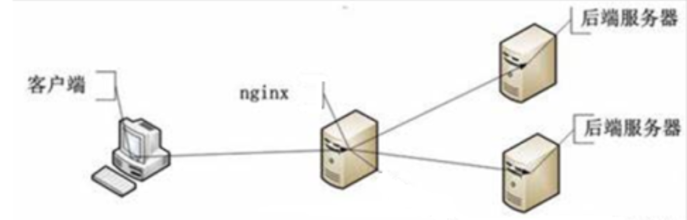

- NGINX配置负载均衡

>   命令地址+配置地址

命令地址：/usr/local/nginx/sbin

配置地址：/usr/local/nginx/conf

>   启动

/usr/local/nginx/sbin  — > ./nginx

启动NGINX并通过测试，浏览器看到nginx欢迎welcome页面

---

/usr/local/nginx/conf目录下修改配置文件nginx.conf新增反向代理和负载均衡配置

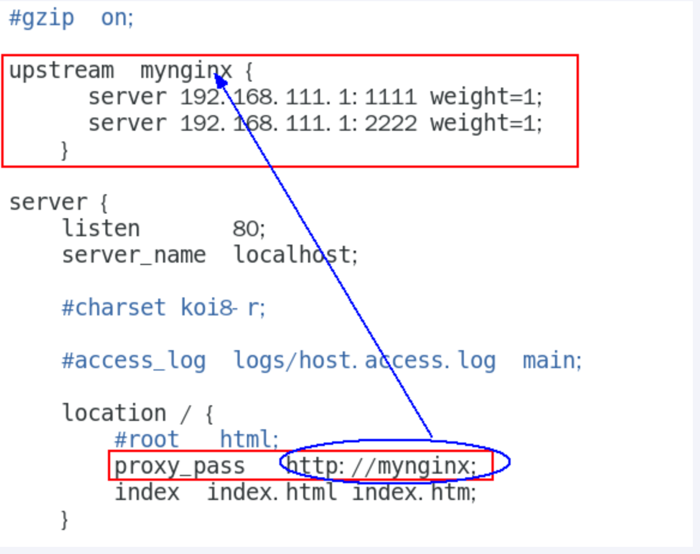

>   关闭

/usr/local/nginx/sbin — >  ./nginx -s stop

>   指定配置启动

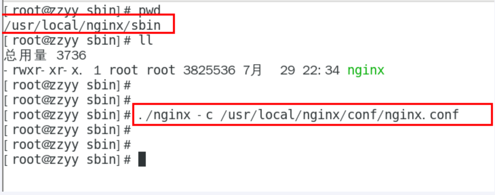

在/usr/local/nginx/sbin路径下执行下面的命令

```sh
./nginx -c /usr/local/nginx/conf/nginx.conf
```

>   重启

/usr/local/nginx/sbin — > ./nginx -s reload

---

- V2.0版本代码修改+启动两个微服务

>   7777 ：InventoryService

```java
package com.atguigu.redislock.service;

import cn.hutool.core.util.IdUtil;
import lombok.extern.slf4j.Slf4j;
import org.springframework.beans.factory.annotation.Autowired;
import org.springframework.beans.factory.annotation.Value;
import org.springframework.data.redis.core.StringRedisTemplate;
import org.springframework.stereotype.Service;

import java.util.concurrent.locks.Lock;
import java.util.concurrent.locks.ReentrantLock;

/**
 * @auther zzyy
 * @create 2022-10-22 15:14
 */
@Service
@Slf4j
public class InventoryService
{
    @Autowired
    private StringRedisTemplate stringRedisTemplate;
    @Value("${server.port}")
    private String port;

    private Lock lock = new ReentrantLock();

    public String sale()
    {
        String retMessage = "";
        lock.lock();
        try
        {
            //1 查询库存信息
            String result = stringRedisTemplate.opsForValue().get("inventory001");
            //2 判断库存是否足够
            Integer inventoryNumber = result == null ? 0 : Integer.parseInt(result);
            //3 扣减库存
            if(inventoryNumber > 0) {
                stringRedisTemplate.opsForValue().set("inventory001",String.valueOf(--inventoryNumber));
                retMessage = "成功卖出一个商品，库存剩余: "+inventoryNumber;
                System.out.println(retMessage);
            }else{
                retMessage = "商品卖完了，o(╥﹏╥)o";
            }
        }finally {
            lock.unlock();
        }
        return retMessage+"\t"+"服务端口号："+port;
    }
}
```

>   8888：InventoryService

```java
package com.atguigu.redislock.service;

import cn.hutool.core.util.IdUtil;
import lombok.extern.slf4j.Slf4j;
import org.springframework.beans.factory.annotation.Autowired;
import org.springframework.beans.factory.annotation.Value;
import org.springframework.data.redis.core.StringRedisTemplate;
import org.springframework.stereotype.Service;

import java.util.concurrent.locks.Lock;
import java.util.concurrent.locks.ReentrantLock;

/**
 * @auther zzyy
 * @create 2022-10-22 15:14
 */
@Service
@Slf4j
public class InventoryService
{
    @Autowired
    private StringRedisTemplate stringRedisTemplate;
    @Value("${server.port}")
    private String port;

    private Lock lock = new ReentrantLock();

    public String sale()
    {
        String retMessage = "";
        lock.lock();
        try
        {
            //1 查询库存信息
            String result = stringRedisTemplate.opsForValue().get("inventory001");
            //2 判断库存是否足够
            Integer inventoryNumber = result == null ? 0 : Integer.parseInt(result);
            //3 扣减库存
            if(inventoryNumber > 0) {
                stringRedisTemplate.opsForValue().set("inventory001",String.valueOf(--inventoryNumber));
                retMessage = "成功卖出一个商品，库存剩余: "+inventoryNumber;
                System.out.println(retMessage);
            }else{
                retMessage = "商品卖完了，o(╥﹏╥)o";
            }
        }finally {
            lock.unlock();
        }
        return retMessage+"\t"+"服务端口号："+port;
    }
}
```

>   通过Nginx访问，你的Linux服务器地址IP，反向代理+负载均衡
> 
> - 可以点击看到效果，一边一个，默认轮训
> - http://192.168.111.185/inventory/sale

---

- 上面纯手点验证OK，下面高并发模拟

2.1 jmetter测试

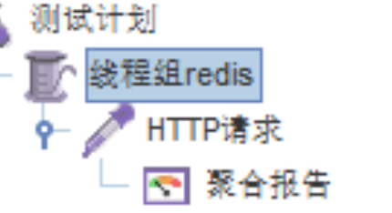

2.2 线程组redis

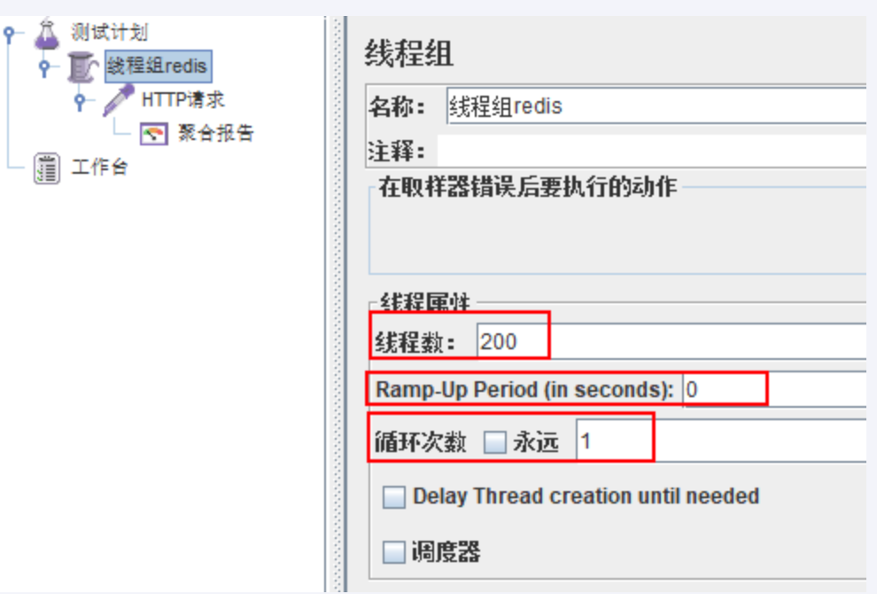

100个商品足够了

2.3 http请求

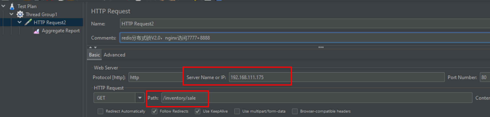

2.4 jmeter压测

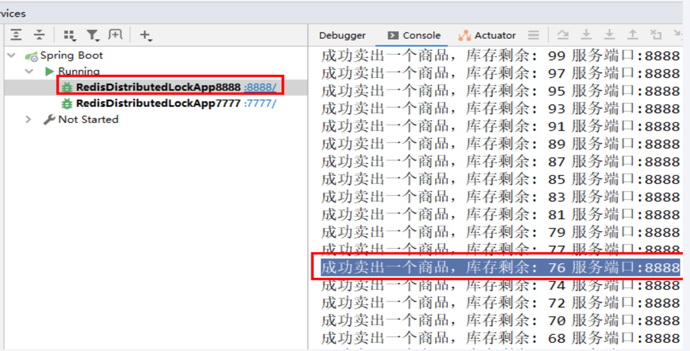

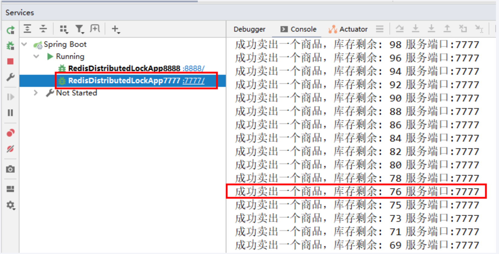

2.5 76号商品被卖出2次，出现超卖故障现象

---

- bug-why

为什么加了synchronized或者Lock还是没有控制住？

**解释**

**在单机环境下**，可以使用synchronized或Lock来实现。

但是在分布式系统中，因为竞争的线程可能不在同一个节点上（同一个jvm中），

所以需要一个让所有进程都能访问到的锁来实现**(比如redis或者zookeeper来构建)**

不同进程jvm层面的锁就不管用了，那么可以利用第三方的一个组件，来获取锁，未获取到锁，则阻塞当前想要运行的线程

---

- 分布式锁出现

**能干嘛**

- 跨进程+跨服务
- 解决超卖
- 防止缓存穿透

---

>   二、**解决**

上redis分布式锁setnx

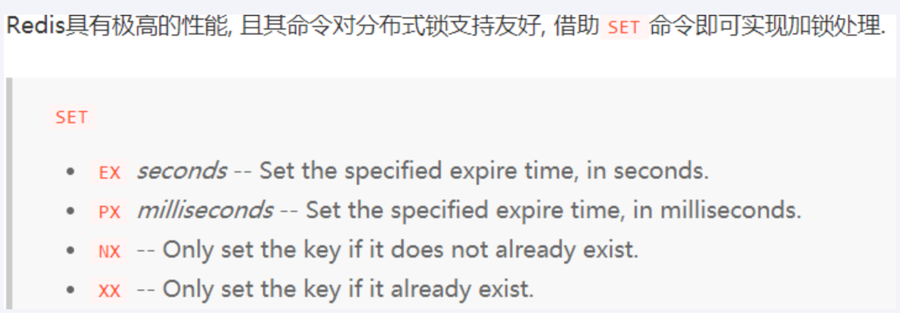

官网：https://redis.io/commands/set

---

### 3.redis分布式锁

>   修改为3.1版

```java
package com.atguigu.redislock.service;

import cn.hutool.core.util.IdUtil;
import lombok.extern.slf4j.Slf4j;
import org.springframework.beans.factory.annotation.Autowired;
import org.springframework.beans.factory.annotation.Value;
import org.springframework.data.redis.core.StringRedisTemplate;
import org.springframework.stereotype.Service;

import java.util.concurrent.TimeUnit;
import java.util.concurrent.locks.Lock;
import java.util.concurrent.locks.ReentrantLock;

/**
 * @auther zzyy
 * @create 2022-10-22 15:14
 */
@Service
@Slf4j
public class InventoryService
{
    @Autowired
    private StringRedisTemplate stringRedisTemplate;
    @Value("${server.port}")
    private String port;

    private Lock lock = new ReentrantLock();

    public String sale()
    {
        String retMessage = "";
        String key = "zzyyRedisLock";
        String uuidValue = IdUtil.simpleUUID()+":"+Thread.currentThread().getId();

        Boolean flag = stringRedisTemplate.opsForValue().setIfAbsent(key, uuidValue);
        if(!flag){
            //暂停20毫秒后递归调用
            try { TimeUnit.MILLISECONDS.sleep(20); } catch (InterruptedException e) { e.printStackTrace(); }
            sale();
        }else{
            try{
                //1 查询库存信息
                String result = stringRedisTemplate.opsForValue().get("inventory001");
                //2 判断库存是否足够
                Integer inventoryNumber = result == null ? 0 : Integer.parseInt(result);
                //3 扣减库存
                if(inventoryNumber > 0) {
                    stringRedisTemplate.opsForValue().set("inventory001",String.valueOf(--inventoryNumber));
                    retMessage = "成功卖出一个商品，库存剩余: "+inventoryNumber;
                    System.out.println(retMessage);
                }else{
                    retMessage = "商品卖完了，o(╥﹏╥)o";
                }
            }finally {
                stringRedisTemplate.delete(key);
            }
        }
        return retMessage+"\t"+"服务端口号："+port;
    }
}
```

- 通过递归重试的方式

- 问题
  
  - 测试手工OK，测试Jmeter压测5000OK
  - 递归是一种思想没错，但是容易StackOverflowError，不太推荐，进一步完善

>   修改为3.2版

```java
package com.atguigu.redislock.service;

import cn.hutool.core.util.IdUtil;
import lombok.extern.slf4j.Slf4j;
import org.springframework.beans.factory.annotation.Autowired;
import org.springframework.beans.factory.annotation.Value;
import org.springframework.data.redis.core.StringRedisTemplate;
import org.springframework.stereotype.Service;

import java.util.concurrent.TimeUnit;
import java.util.concurrent.locks.Lock;
import java.util.concurrent.locks.ReentrantLock;

/**
 * @auther zzyy
 * @create 2022-10-22 15:14
 */
@Service
@Slf4j
public class InventoryService
{
    @Autowired
    private StringRedisTemplate stringRedisTemplate;
    @Value("${server.port}")
    private String port;

    private Lock lock = new ReentrantLock();

    public String sale()
    {
        String retMessage = "";
        String key = "zzyyRedisLock";
        String uuidValue = IdUtil.simpleUUID()+":"+Thread.currentThread().getId();
        while(!stringRedisTemplate.opsForValue().setIfAbsent(key, uuidValue)){
            //暂停20毫秒，类似CAS自旋
            try { TimeUnit.MILLISECONDS.sleep(20); } catch (InterruptedException e) { e.printStackTrace(); }
        }
        try
        {
            //1 查询库存信息
            String result = stringRedisTemplate.opsForValue().get("inventory001");
            //2 判断库存是否足够
            Integer inventoryNumber = result == null ? 0 : Integer.parseInt(result);
            //3 扣减库存
            if(inventoryNumber > 0) {
                stringRedisTemplate.opsForValue().set("inventory001",String.valueOf(--inventoryNumber));
                retMessage = "成功卖出一个商品，库存剩余: "+inventoryNumber;
                System.out.println(retMessage);
            }else{
                retMessage = "商品卖完了，o(╥﹏╥)o";
            }
        }finally {
            stringRedisTemplate.delete(key);
        }
        return retMessage+"\t"+"服务端口号："+port;
    }
}
```

- 多线程判断详细JUC里面说过的虚假唤醒，用while替代if
- 用自旋锁替代递归重试

---

### 4.宕机与过期+防止死锁

>   当前代码3.2版接上一步

>   问题：
> 
>   部署了微服务的Java程序机器挂了，代码层面根本没有走到finally这块，没办法保证解锁(无过期时间该key一直存在)，这个key没有被删除，需要加入一个过期时间限定key

>   解决

修改为4.1版

```java
while(!stringRedisTemplate.opsForValue().setIfAbsent(key, uuidValue))
{
    //暂停20毫秒，进行递归重试.....
    try { TimeUnit.MILLISECONDS.sleep(20); } catch (InterruptedException e) { e.printStackTrace(); }
}

stringRedisTemplate.expire(key,30L,TimeUnit.SECONDS);
```

请大家思考可以这么操作吗?

---

⚠️4.1版本结论

设置key+过期时间分开了，必须要合并成一行具备原子性


---

修改为4.2版

```java
package com.atguigu.redislock.service;

import cn.hutool.core.util.IdUtil;
import lombok.extern.slf4j.Slf4j;
import org.springframework.beans.factory.annotation.Autowired;
import org.springframework.beans.factory.annotation.Value;
import org.springframework.data.redis.core.StringRedisTemplate;
import org.springframework.stereotype.Service;

import java.util.concurrent.TimeUnit;
import java.util.concurrent.locks.Lock;
import java.util.concurrent.locks.ReentrantLock;

/**
 * @auther zzyy
 * @create 2022-10-22 15:14
 */
@Service
@Slf4j
public class InventoryService
{
    @Autowired
    private StringRedisTemplate stringRedisTemplate;
    @Value("${server.port}")
    private String port;

    private Lock lock = new ReentrantLock();

    public String sale()
    {
        String retMessage = "";
        String key = "zzyyRedisLock";
        String uuidValue = IdUtil.simpleUUID()+":"+Thread.currentThread().getId();

        while(!stringRedisTemplate.opsForValue().setIfAbsent(key, uuidValue,30L,TimeUnit.SECONDS))
        {
            //暂停毫秒
            try { TimeUnit.MILLISECONDS.sleep(20); } catch (InterruptedException e) { e.printStackTrace(); }
        }

        try
        {
            //1 查询库存信息
            String result = stringRedisTemplate.opsForValue().get("inventory001");
            //2 判断库存是否足够
            Integer inventoryNumber = result == null ? 0 : Integer.parseInt(result);
            //3 扣减库存
            if(inventoryNumber > 0) {
                stringRedisTemplate.opsForValue().set("inventory001",String.valueOf(--inventoryNumber));
                retMessage = "成功卖出一个商品，库存剩余: "+inventoryNumber;
                System.out.println(retMessage);
            }else{
                retMessage = "商品卖完了，o(╥﹏╥)o";
            }
        }finally {
            stringRedisTemplate.delete(key);
        }
        return retMessage+"\t"+"服务端口号："+port;
    }
}
```

Jmeter压测OK

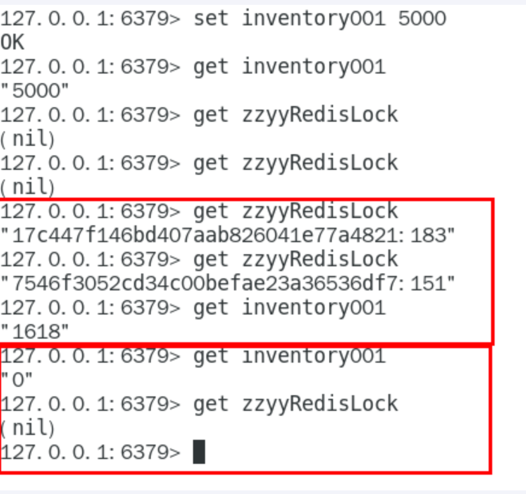

---

⚠️4.2版本结论

`加锁和过期时间设置必须同一行，保证原子性`

---

### 5.防止误删key的问题

当前代码为4.2版接近上一步

问题

- 实际业务处理时间如果超过了默认设置key的过期时间？？尴尬￣□￣｜｜
- 张冠李戴，删除了别人的锁

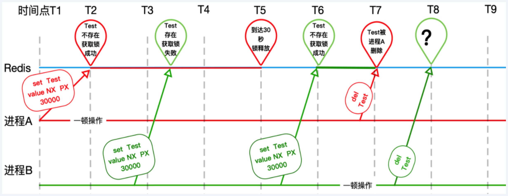

**解决**

只能自己删除自己的，不许动别人的

修改为5.0版

```java
package com.atguigu.redislock.service;

import cn.hutool.core.util.IdUtil;
import lombok.extern.slf4j.Slf4j;
import org.springframework.beans.factory.annotation.Autowired;
import org.springframework.beans.factory.annotation.Value;
import org.springframework.data.redis.core.StringRedisTemplate;
import org.springframework.stereotype.Service;

import java.util.concurrent.TimeUnit;
import java.util.concurrent.locks.Lock;
import java.util.concurrent.locks.ReentrantLock;

/**
 * @auther zzyy
 * @create 2022-10-22 15:14
 */
@Service
@Slf4j
public class InventoryService
{
    @Autowired
    private StringRedisTemplate stringRedisTemplate;
    @Value("${server.port}")
    private String port;

    private Lock lock = new ReentrantLock();

    public String sale()
    {
        String retMessage = "";
        String key = "zzyyRedisLock";
        String uuidValue = IdUtil.simpleUUID()+":"+Thread.currentThread().getId();

        while(!stringRedisTemplate.opsForValue().setIfAbsent(key, uuidValue,30L,TimeUnit.SECONDS))
        {
            //暂停毫秒
            try { TimeUnit.MILLISECONDS.sleep(20); } catch (InterruptedException e) { e.printStackTrace(); }
        }
        try
        {
            //1 查询库存信息
            String result = stringRedisTemplate.opsForValue().get("inventory001");
            //2 判断库存是否足够
            Integer inventoryNumber = result == null ? 0 : Integer.parseInt(result);
            //3 扣减库存
            if(inventoryNumber > 0) {
                stringRedisTemplate.opsForValue().set("inventory001",String.valueOf(--inventoryNumber));
                retMessage = "成功卖出一个商品，库存剩余: "+inventoryNumber+"\t"+uuidValue;
                System.out.println(retMessage);
            }else{
                retMessage = "商品卖完了，o(╥﹏╥)o";
            }
        }finally {
            // v5.0判断加锁与解锁是不是同一个客户端，同一个才行，自己只能删除自己的锁，不误删他人的
            if(stringRedisTemplate.opsForValue().get(key).equalsIgnoreCase(uuidValue)){
                stringRedisTemplate.delete(key);
            }
        }
        return retMessage+"\t"+"服务端口号："+port;
    }
}
```

---

### 6.Lua保证原子性

>   当前代码为5.0版接上一步

```java
package com.atguigu.redislock.service;

import cn.hutool.core.util.IdUtil;
import lombok.extern.slf4j.Slf4j;
import org.springframework.beans.factory.annotation.Autowired;
import org.springframework.beans.factory.annotation.Value;
import org.springframework.data.redis.core.StringRedisTemplate;
import org.springframework.stereotype.Service;

import java.util.concurrent.TimeUnit;
import java.util.concurrent.locks.Lock;
import java.util.concurrent.locks.ReentrantLock;

/**
 * @auther zzyy
 * @create 2022-10-22 15:14
 */
@Service
@Slf4j
public class InventoryService
{
    @Autowired
    private StringRedisTemplate stringRedisTemplate;
    @Value("${server.port}")
    private String port;

    private Lock lock = new ReentrantLock();

    public String sale()
    {
        String retMessage = "";
        String key = "zzyyRedisLock";
        String uuidValue = IdUtil.simpleUUID()+":"+Thread.currentThread().getId();

        while(!stringRedisTemplate.opsForValue().setIfAbsent(key, uuidValue,30L,TimeUnit.SECONDS))
        {
            //暂停毫秒
            try { TimeUnit.MILLISECONDS.sleep(20); } catch (InterruptedException e) { e.printStackTrace(); }
        }

        try
        {
            //1 查询库存信息
            String result = stringRedisTemplate.opsForValue().get("inventory001");
            //2 判断库存是否足够
            Integer inventoryNumber = result == null ? 0 : Integer.parseInt(result);
            //3 扣减库存
            if(inventoryNumber > 0) {
                stringRedisTemplate.opsForValue().set("inventory001",String.valueOf(--inventoryNumber));
                retMessage = "成功卖出一个商品，库存剩余: "+inventoryNumber+"\t"+uuidValue;
                System.out.println(retMessage);
            }else{
                retMessage = "商品卖完了，o(╥﹏╥)o";
            }
        }finally {
            // v5.0判断加锁与解锁是不是同一个客户端，同一个才行，自己只能删除自己的锁，不误删他人的
            if(stringRedisTemplate.opsForValue().get(key).equalsIgnoreCase(uuidValue))
            {
                stringRedisTemplate.delete(key);
            }
        }
        return retMessage+"\t"+"服务端口号："+port;
    }
}
```

>   问题：
> 
>   finally块的判断+del删除操作不是原子性的

>   启动lua脚本编写redis分布式锁判断+删除判断代码

**lua脚本**

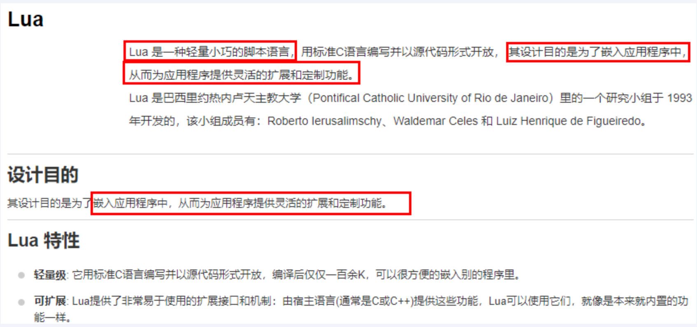

**[官网](https://redis.io/docs/reference/patterns/distributed-locks/)**

[官方脚本](https://redis.io/docs/reference/patterns/distributed-locks/)

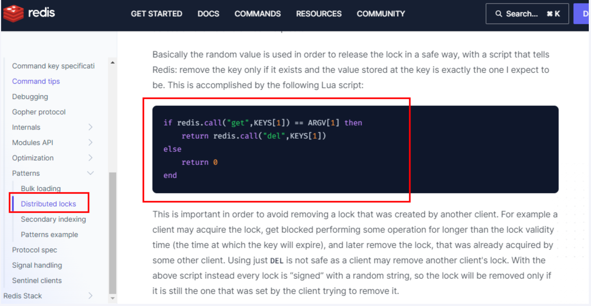

>   Lua脚本浅谈

`Lua脚本初始`

- Redis调用Lua及哦啊本通过eval命令保证代码执行的原子性，直接用return返回脚本执行后的结果集

- eval luascript numkeys [key [key…]] [arg [arg…]]

- helloword入门
  
  1. 1-hello lua
     
     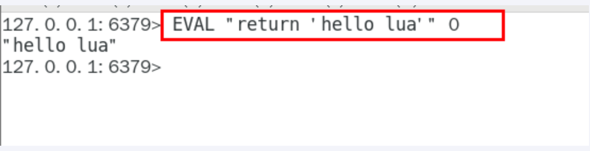
  
  2. 2-set k1 v1 get k1
     
     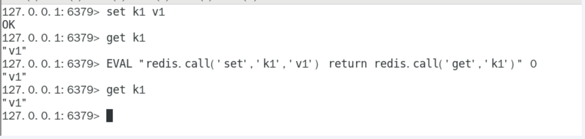
  
  3. 3-mset
     
     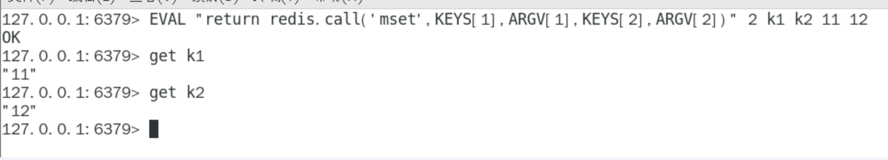

`Lua脚本更近一步`

- Redis分布式锁lua脚本官网练习

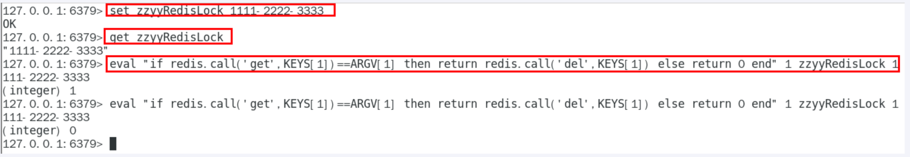

```sh
eval "if redis.call('get',KEYS[1])==ARGV[1] then return redis.call('del',KEYS[1]) else return 0 end" 1 zzyyRedisLock 1111-2222-3333
```

- 条件判断语法

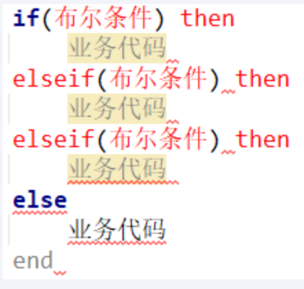

- 条件判断案例

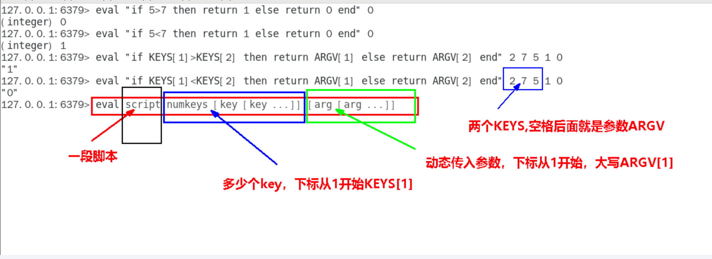

---

>   解决

修改为6.0版code

```java
package com.atguigu.redislock.service;

import cn.hutool.core.util.IdUtil;
import lombok.extern.slf4j.Slf4j;
import org.springframework.beans.factory.annotation.Autowired;
import org.springframework.beans.factory.annotation.Value;
import org.springframework.data.redis.core.StringRedisTemplate;
import org.springframework.data.redis.core.script.DefaultRedisScript;
import org.springframework.stereotype.Service;

import java.util.Arrays;
import java.util.concurrent.TimeUnit;
import java.util.concurrent.locks.Lock;
import java.util.concurrent.locks.ReentrantLock;

/**
 * @auther zzyy
 * @create 2022-10-22 15:14
 */
@Service
@Slf4j
public class InventoryService
{
    @Autowired
    private StringRedisTemplate stringRedisTemplate;
    @Value("${server.port}")
    private String port;

    private Lock lock = new ReentrantLock();

    public String sale()
    {
        String retMessage = "";
        String key = "zzyyRedisLock";
        String uuidValue = IdUtil.simpleUUID()+":"+Thread.currentThread().getId();

        while(!stringRedisTemplate.opsForValue().setIfAbsent(key, uuidValue,30L,TimeUnit.SECONDS))
        {
            //暂停毫秒
                     try { TimeUnit.MILLISECONDS.sleep(20); } catch (InterruptedException e) { e.printStackTrace(); }
        }

        try
        {
            //1 查询库存信息
            String result = stringRedisTemplate.opsForValue().get("inventory001");
            //2 判断库存是否足够
            Integer inventoryNumber = result == null ? 0 : Integer.parseInt(result);
            //3 扣减库存
            if(inventoryNumber > 0) {
                stringRedisTemplate.opsForValue().set("inventory001",String.valueOf(--inventoryNumber));
                retMessage = "成功卖出一个商品，库存剩余: "+inventoryNumber+"\t"+uuidValue;
                System.out.println(retMessage);
            }else{
                retMessage = "商品卖完了，o(╥﹏╥)o";
            }
        }finally {
            //V6.0 将判断+删除自己的合并为lua脚本保证原子性
            String luaScript =
                    "if (redis.call('get',KEYS[1]) == ARGV[1]) then " +
                        "return redis.call('del',KEYS[1]) " +
                    "else " +
                        "return 0 " +
                    "end";
            stringRedisTemplate.execute(new DefaultRedisScript<>(luaScript, Boolean.class), Arrays.asList(key), uuidValue);
        }
        return retMessage+"\t"+"服务端口号："+port;
    }
}
```

bug说明

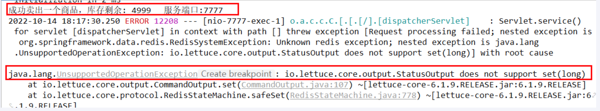

| **stringRedisTemplate**.execute(**new** DefaultRedisScript<>(script), Arrays.*asList*(key),value);                               |
| -------------------------------------------------------------------------------------------------------------------------------- |
| **stringRedisTemplate**.execute(**new** DefaultRedisScript<>(script,Long.**class**), Arrays.*asList*(key),value); //使用该构造方法，不然报错 |

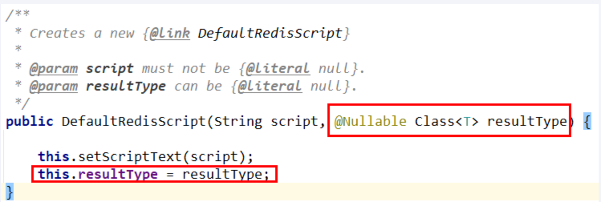

---

### 7.可重入锁+设计模式

>   当前代码为6.0版接上一步

- while判断并自旋重试获取锁+setnx含自然过期时间+Lua脚本官网删除锁命令
- 问题
  - 如果兼顾锁的可重入性问题？
  - 如果兼顾锁的可重入性问题？
  - 如果兼顾锁的可重入性问题？
- 复习写好一个锁的条件和归约


---

>   可重入锁（又名递归锁）

- 说明

**可重入锁又名递归锁**

是指在同一个线程在外层方法获取锁的时候，再进入该线程的内层方法会自动获取锁(前提，锁对象得是同一个对象)，不会因为之前已经获取过还没释放而阻塞。

如果是1个有 synchronized 修饰的递归调用方法，`程序第2次进入被自己阻塞了岂不是天大的笑话，出现了作茧自缚。`

`所以Java中ReentrantLock和synchronized都是可重入锁，可重入锁的一个优点是可一定程度避免死锁。`

- “可重入锁”这四个字分开来解释：
  
  - 可：可以。
  - 重：再次。
  - 入：进入。
  - 锁：同步锁。
  - 进入什么：进入同步域（即同步代码块/方法或显示锁锁定的代码）
  - 一句话
    - 一个线程中的多个流程可以获取到同一把锁，持有这把同步锁可以再次进入。
    - 自己可以获取自己的内部锁

- JUC只是复习，可重入锁bug会如何影响程序

- 可重入锁种类
  
  - 隐式锁（即synchronized关键字使用的锁）默认是可重入锁
    
    指的是可重复可递归调用的锁，在外层使用锁之后，在内层仍然可以使用，并且不发生死锁，这样的锁就叫做可重入锁。
    
    简单的来说就是：`在一个synchronized修饰的方法或代码块的内部调用本类的其他synchronized修饰的方法或代码块时，是永远可以得到锁的`
    
    与可重入锁相反，不可重入锁不可递归调用，递归调用就发生死锁。
    
    - 同步块
      
      ```java
      package com.atguigu.juc.senior.prepare;
      
      /**
       * @auther zzyy
       * @create 2020-05-14 11:59
       */
      public class ReEntryLockDemo
      {
          public static void main(String[] args)
          {
              final Object objectLockA = new Object();
      
              new Thread(() -> {
                  synchronized (objectLockA)
                  {
                      System.out.println("-----外层调用");
                      synchronized (objectLockA)
                      {
                          System.out.println("-----中层调用");
                          synchronized (objectLockA)
                          {
                              System.out.println("-----内层调用");
                          }
                      }
                  }
              },"a").start();
          }
      }
      ```
    
    - 同步方法
      
      ```java
      package com.atguigu.juc.senior.prepare;
      
      /**
       * @auther zzyy
       * @create 2020-05-14 11:59
       * 在一个Synchronized修饰的方法或代码块的内部调用本类的其他Synchronized修饰的方法或代码块时，是永远可以得到锁的
       */
      public class ReEntryLockDemo
      {
          public synchronized void m1()
          {
              System.out.println("-----m1");
              m2();
          }
          public synchronized void m2()
          {
              System.out.println("-----m2");
              m3();
          }
          public synchronized void m3()
          {
              System.out.println("-----m3");
          }
      
          public static void main(String[] args)
          {
              ReEntryLockDemo reEntryLockDemo = new ReEntryLockDemo();
      
              reEntryLockDemo.m1();
          }
      }
      ```
  
  - Synchronized的重入的实现机理
    
    **每个锁对象拥有一个锁计数器和一个指向持有该锁的线程的指针。**
    
    当执行monitorenter时，如果目标锁对象的计数器为零，那么说明它没有被其他线程所持有，Java虚拟机会将该锁对象的持有线程设置为当前线程，并且将其计数器加1。
    
    在目标锁对象的计数器不为零的情况下，如果锁对象的持有线程是当前线程，那么 Java 虚拟机可以将其计数器加1，否则需要等待，直至持有线程释放该锁。
    
    当执行monitorexit时，Java虚拟机则需将锁对象的计数器减1。计数器为零代表锁已被释放。
  
  - 显示锁（即lock）也有ReentrantLock这样的可重入锁。
    
    ```java
    package com.atguigu.juc.senior.prepare;
    
    import java.util.concurrent.locks.Lock;
    import java.util.concurrent.locks.ReentrantLock;
    
    /**
     * @auther zzyy
     * @create 2020-05-14 11:59
     * 在一个Synchronized修饰的方法或代码块的内部调用本类的其他Synchronized修饰的方法或代码块时，是永远可以得到锁的
     */
    public class ReEntryLockDemo
    {
        static Lock lock = new ReentrantLock();
    
        public static void main(String[] args)
        {
            new Thread(() -> {
                lock.lock();
                try
                {
                    System.out.println("----外层调用lock");
                    lock.lock();
                    try
                    {
                        System.out.println("----内层调用lock");
                    }finally {
                        // 这里故意注释，实现加锁次数和释放次数不一样
                        // 由于加锁次数和释放次数不一样，第二个线程始终无法获取到锁，导致一直在等待。
                        lock.unlock(); // 正常情况，加锁几次就要解锁几次
                    }
                }finally {
                    lock.unlock();
                }
            },"a").start();
    
            new Thread(() -> {
                lock.lock();
                try
                {
                    System.out.println("b thread----外层调用lock");
                }finally {
                    lock.unlock();
                }
            },"b").start();
    
        }
    }
    ```

---

>   lock/unlock配合可重入锁进行AQS源码分析讲解
> 
>   **切记，一般而言，你lock了几次就要unlock几次**

---

>   思考，上述可重入锁技术问题，redis中的哪个数据类型可以代替

1. K，K，V

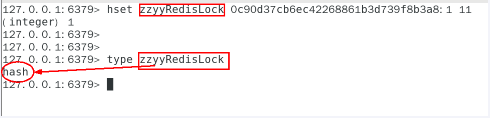

```sh
hset  zzyyRedisLock 29f0ee01ac77414fb8b0861271902a94:1
```

2. Map< String,Map< Object,Object > >

3. 案例命令

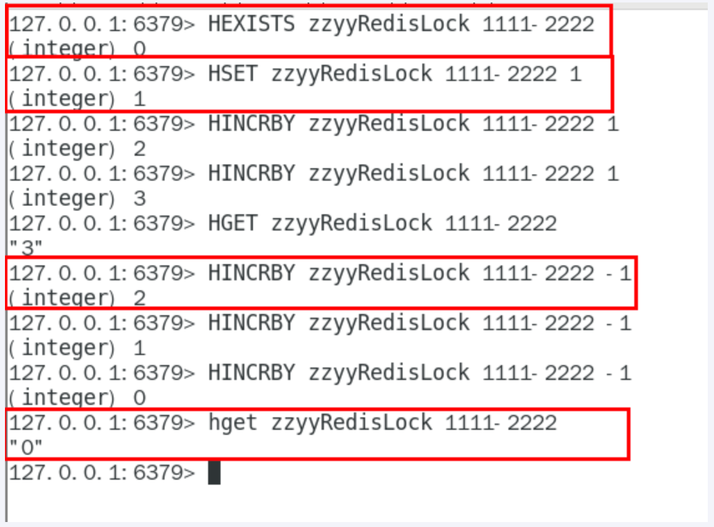

| hset key field value                                    |
| ------------------------------------------------------- |
| hset redis锁名字(zzyyRedisLock) 某个请求线程的UUID+ThreadID 加锁的次数 |

4. 小总结
   1. setnx，只能解决有无得问题：够用但是不完美
   2. hset，不但解决有无，还解决可重入问题

---

>   思考+设计重点（一横一纵）

目前有2条支线，目的是保证同一个时候只能有一个现成持有锁进去redis做扣减库存的操作

2个分支

- 1：保证加锁/解锁，lock/unlock

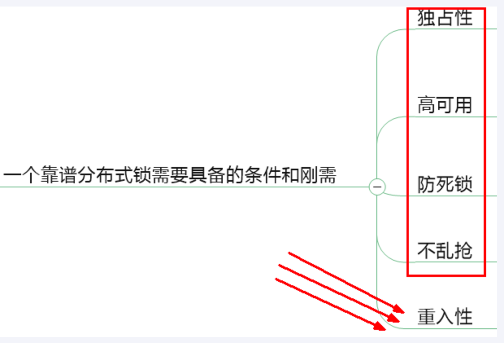

- 2：扣减库存redis命令的原子性

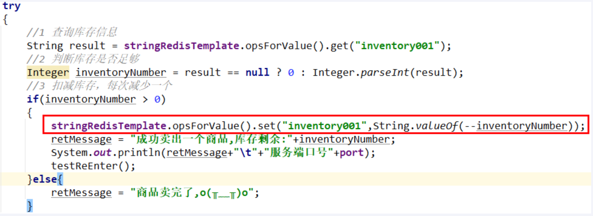

>   lua脚本

- redis命令过程分析
  
  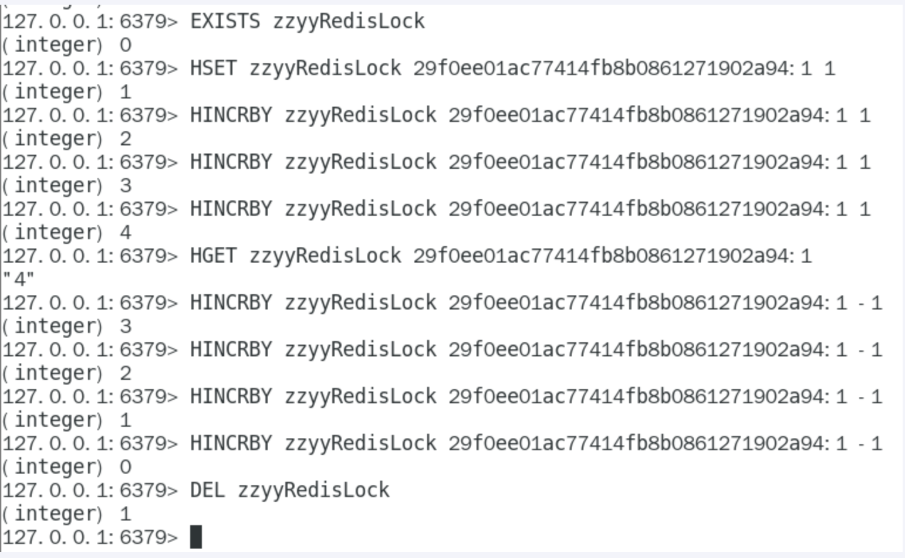

- 加锁lua脚本lock
  
  - 先判断redis分布式锁着key是否存在
    
    1.返回零表示不存在，hset新建当前线程属于自己的锁BY UUID:ThreadID
    
    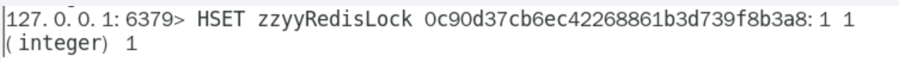
    
    ```sh
    HSET zzyyRedisLock 0c90d37cb6ec42268861b3d739f8b3a8:1      1
    ```
    
    命令    key         value = UUID:ThreadID                 次数
    
    2.返回一说明已经有锁，需进一步判断是不是当前线程自己的
    
    HEXISTS key uuid:ThreadID
    
    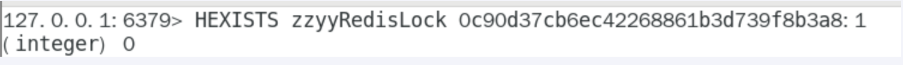
    
    ```sh
    HEXISTS zzyyRedisLock 0c90d37cb6ec42268861b3d739f8b3a8:1
    ```
    
    - 返回零说明不是自己的
    
    - 返回一表示是自己的锁，自增1次表示重入
      
      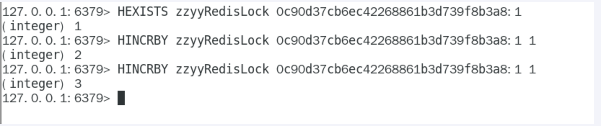
      
      ```sh
      HINCRBY key field increment
      
      HINCRBY zzyyRedisLock 0c90d37cb6ec42268861b3d739f8b3a8:1 1
      ```
  
  - 上述设计修改为Lua脚本
    
    - V1
      
      ```LUA
      if redis.call('exists','key') == 0 then
      
        redis.call('hset','key','uuid:threadid',1)
      
        redis.call('expire','key',30)
      
        return 1
      
      elseif redis.call('hexists','key','uuid:threadid') == 1 then
      
        redis.call('hincrby','key','uuid:threadid',1)
      
        redis.call('expire','key',30)
      
        return 1
      
      else
      
        return 0
      
      end
      ```
      
      >   相同部分是否可以替换处理？？？
      > 
      >   hincrby命令可否替代hset命令
    
    - V2
      
      ```LUA
      if redis.call('exists','key') == 0 or redis.call('hexists','key','uuid:threadid') == 1 then
      
        redis.call('hincrby','key','uuid:threadid',1)
      
        redis.call('expire','key',30)
      
        return 1
      
      else
      
        return 0
      
      end
      ```
    
    - V3
      
      | key   | KEYS[1] | zzyyRedisLock                      |
      | ----- | ------- | ---------------------------------- |
      | value | ARGV[1] | 2f586ae740a94736894ab9d51880ed9d:1 |
      | 过期时间值 | ARGV[2] | 30  秒                              |
      
      ```lua
      if redis.call('exists',KEYS[1]) == 0 or redis.call('hexists',KEYS[1],ARGV[1]) == 1 then 
      
        redis.call('hincrby',KEYS[1],ARGV[1],1) 
      
        redis.call('expire',KEYS[1],ARGV[2]) 
      
        return 1 
      
      else
      
        return 0
      
      end
      ```
  
  - 测试
    
    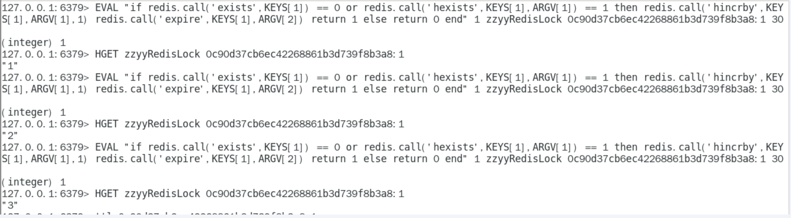
    
    | EVAL "if redis.call('exists',KEYS[1]) == 0 or redis.call('hexists',KEYS[1],ARGV[1]) == 1 then redis.call('hincrby',KEYS[1],ARGV[1],1) redis.call('expire',KEYS[1],ARGV[2]) return 1 else return 0 end" 1 zzyyRedisLock 0c90d37cb6ec42268861b3d739f8b3a8:1 30 |
    | ------------------------------------------------------------------------------------------------------------------------------------------------------------------------------------------------------------------------------------------------------------ |
    | HGET zzyyRedisLock 0c90d37cb6ec42268861b3d739f8b3a8:1                                                                                                                                                                                                        |

- 解锁lua脚本unlock
  
  - 设计思路：有锁且还是自己的锁
    
    HEXISTS key uuid:ThreadID
    
    - 返回零，说明根本没有锁，程序块返回null
    
    - 不是零，说明有锁且是自己的锁，直接调用HINCRBY 负一表示每次减个一，解锁一次。直到它变为零表示可以删除该锁key，del锁key
    
    - 全套流程
      
      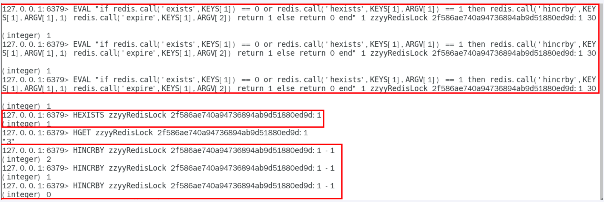
      
      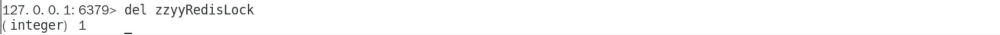
  
  - 上述设计修改为Lua脚本
    
    - V1
      
      ```lua
      if redis.call('HEXISTS',lock,uuid:threadID) == 0 then
      
       return nil
      
      elseif redis.call('HINCRBY',lock,uuid:threadID,-1) == 0 then
      
       return redis.call('del',lock)
      
      else 
      
       return 0
      
      end
      ```
    
    - V2
      
      ```lua
      if redis.call('HEXISTS',KEYS[1],ARGV[1]) == 0 then
      
       return nil
      
      elseif redis.call('HINCRBY',KEYS[1],ARGV[1],-1) == 0 then
      
       return redis.call('del',KEYS[1])
      
      else
      
       return 0
      
      end
      ```
      
      | eval "if redis.call('HEXISTS',KEYS[1],ARGV[1]) == 0 then return nil elseif redis.call('HINCRBY',KEYS[1],ARGV[1],-1) == 0 then return redis.call('del',KEYS[1]) else return 0 end" 1 zzyyRedisLock 2f586ae740a94736894ab9d51880ed9d:1 |
      | ------------------------------------------------------------------------------------------------------------------------------------------------------------------------------------------------------------------------------------ |
  
  - 测试全套流程
    
    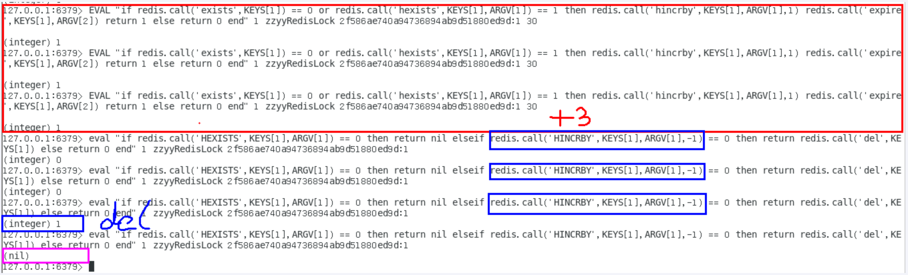

>   将上述lua脚本织呢隔阂到微服务Java程序

复原程序为初始无锁版

```java
package com.atguigu.redislock.service;

import lombok.extern.slf4j.Slf4j;
import org.springframework.beans.factory.annotation.Autowired;
import org.springframework.beans.factory.annotation.Value;
import org.springframework.data.redis.core.StringRedisTemplate;
import org.springframework.stereotype.Service;

/**
 * @auther zzyy
 * @create 2022-10-22 15:14
 */
@Service
@Slf4j
public class InventoryService
{
    @Autowired
    private StringRedisTemplate stringRedisTemplate;
    @Value("${server.port}")
    private String port;

    public String sale()
    {
        String retMessage = "";
        //1 查询库存信息
        String result = stringRedisTemplate.opsForValue().get("inventory001");
        //2 判断库存是否足够
        Integer inventoryNumber = result == null ? 0 : Integer.parseInt(result);
        //3 扣减库存
        if(inventoryNumber > 0) {
            stringRedisTemplate.opsForValue().set("inventory001",String.valueOf(--inventoryNumber));
            retMessage = "成功卖出一个商品，库存剩余: "+inventoryNumber+"\t";
            System.out.println(retMessage);
        }else{
            retMessage = "商品卖完了，o(╥﹏╥)o";
        }
        return retMessage+"\t"+"服务端口号："+port;
    }
}
```

新建RedisDistributedLock类并实现JUC里面的Lock接口

满足JUC里面AQS对Lock锁的接口规范定义来进行实现落地代码

结合设计模式开发属于自己的Redis分布式锁工具类

- lock方法的全盘通用讲解

- lua脚本
  
  - 加锁lock
    
    ```lua
    if redis.call('exists',KEYS[1]) == 0 or redis.call('hexists',KEYS[1],ARGV[1]) == 1 then 
    
      redis.call('hincrby',KEYS[1],ARGV[1],1) 
    
      redis.call('expire',KEYS[1],ARGV[2]) 
    
      return 1 
    
    else
    
      return 0
    
    end
    ```
  
  - 解锁unlock
    
    ```lua
    if redis.call('HEXISTS',KEYS[1],ARGV[1]) == 0 then 
    
      return nil 
    
    elseif redis.call('HINCRBY',KEYS[1],ARGV[1],-1) == 0 then 
    
      return redis.call('del',KEYS[1]) 
    
    else 
    
      return 0
    
    end
    ```

- 工厂设计模式引入
  
  1. 通过实现JUC里面的Lock接口，实现RedisDistributedLock
     
     ```java
     package com.atguigu.redislock.mylock;
     
     import cn.hutool.core.util.IdUtil;
     import org.springframework.beans.factory.annotation.Autowired;
     import org.springframework.data.redis.core.StringRedisTemplate;
     import org.springframework.data.redis.core.script.DefaultRedisScript;
     import org.springframework.data.redis.support.collections.DefaultRedisList;
     import org.springframework.stereotype.Component;
     
     import java.util.Arrays;
     import java.util.concurrent.TimeUnit;
     import java.util.concurrent.locks.Condition;
     import java.util.concurrent.locks.Lock;
     
     /**
      * @auther zzyy
      * @create 2022-10-18 18:32
      */
     //@Component 引入DistributedLockFactory工厂模式，从工厂获得而不再从spring拿到
     public class RedisDistributedLock implements Lock
     {
         private StringRedisTemplate stringRedisTemplate;
     
         private String lockName;//KEYS[1]
         private String uuidValue;//ARGV[1]
         private long   expireTime;//ARGV[2]
         public RedisDistributedLock(StringRedisTemplate stringRedisTemplate, String lockName)
         {
             this.stringRedisTemplate = stringRedisTemplate;
             this.lockName = lockName;
             this.uuidValue = IdUtil.simpleUUID()+":"+Thread.currentThread().getId();//UUID:ThreadID
             this.expireTime = 30L;
         }
         @Override
         public void lock()
         {
             tryLock();
         }
         @Override
         public boolean tryLock()
         {
             try {tryLock(-1L,TimeUnit.SECONDS);} catch (InterruptedException e) {e.printStackTrace();}
             return false;
         }
     
         /**
          * 干活的，实现加锁功能，实现这一个干活的就OK，全盘通用
          * @param time
          * @param unit
          * @return
          * @throws InterruptedException
          */
         @Override
         public boolean tryLock(long time, TimeUnit unit) throws InterruptedException{
             if(time != -1L){
                 this.expireTime = unit.toSeconds(time);
             }
             String script =
                     "if redis.call('exists',KEYS[1]) == 0 or redis.call('hexists',KEYS[1],ARGV[1]) == 1 then " +
                             "redis.call('hincrby',KEYS[1],ARGV[1],1) " +
                             "redis.call('expire',KEYS[1],ARGV[2]) " +
                             "return 1 " +
                     "else " +
                             "return 0 " +
                     "end";
     
             System.out.println("script: "+script);
             System.out.println("lockName: "+lockName);
             System.out.println("uuidValue: "+uuidValue);
             System.out.println("expireTime: "+expireTime);
     
             while (!stringRedisTemplate.execute(new DefaultRedisScript<>(script,Boolean.class), Arrays.asList(lockName),uuidValue,String.valueOf(expireTime))) {
                 TimeUnit.MILLISECONDS.sleep(50);
             }
             return true;
         }
     
         /**
          *干活的，实现解锁功能
          */
         @Override
         public void unlock()
         {
             String script =
                     "if redis.call('HEXISTS',KEYS[1],ARGV[1]) == 0 then " +
                     "   return nil " +
                     "elseif redis.call('HINCRBY',KEYS[1],ARGV[1],-1) == 0 then " +
                     "   return redis.call('del',KEYS[1]) " +
                     "else " +
                     "   return 0 " +
                     "end";
             // nil = false 1 = true 0 = false
             System.out.println("lockName: "+lockName);
             System.out.println("uuidValue: "+uuidValue);
             System.out.println("expireTime: "+expireTime);
             Long flag = stringRedisTemplate.execute(new DefaultRedisScript<>(script, Long.class), Arrays.asList(lockName),uuidValue,String.valueOf(expireTime));
             if(flag == null)
             {
                 throw new RuntimeException("This lock doesn't EXIST");
             }
     
         }
     
         //===下面的redis分布式锁暂时用不到=======================================
         //===下面的redis分布式锁暂时用不到=======================================
         //===下面的redis分布式锁暂时用不到=======================================
         @Override
         public void lockInterruptibly() throws InterruptedException
         {
     
         }
     
         @Override
         public Condition newCondition()
         {
             return null;
         }
     }
     ```
  
  2. InventoryService直接使用上面的代码设计，有什么问题？
     
     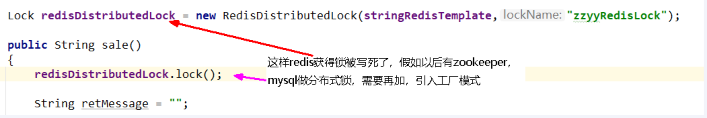
  
  3. 考虑拓展，本次是redis实现分布式锁，以后zookeeper，mysql实现那？？
  
  4. 引入工厂模式改造7.1版code
     
     DistributedLockFactory
     
     ```java
     package com.atguigu.redislock.mylock;
     
     import org.springframework.beans.factory.annotation.Autowired;
     import org.springframework.data.redis.core.StringRedisTemplate;
     import org.springframework.stereotype.Component;
     
     import java.util.concurrent.locks.Lock;
     
     /**
      * @auther zzyy
      * @create 2022-10-18 18:53
      */
     @Component
     public class DistributedLockFactory
     {
         @Autowired
         private StringRedisTemplate stringRedisTemplate;
         private String lockName;
     
         public Lock getDistributedLock(String lockType)
         {
             if(lockType == null) return null;
     
             if(lockType.equalsIgnoreCase("REDIS")){
                 lockName = "zzyyRedisLock";
                 return new RedisDistributedLock(stringRedisTemplate,lockName);
             } else if(lockType.equalsIgnoreCase("ZOOKEEPER")){
                 //TODO zookeeper版本的分布式锁实现
                 return new ZookeeperDistributedLock();
             } else if(lockType.equalsIgnoreCase("MYSQL")){
                 //TODO mysql版本的分布式锁实现
                 return null;
             }
     
             return null;
         }
     }
     ```
     
     RedisDistributedLock
     
     ```java
     package com.atguigu.redislock.mylock;
     
     import cn.hutool.core.util.IdUtil;
     import org.springframework.beans.factory.annotation.Autowired;
     import org.springframework.data.redis.core.StringRedisTemplate;
     import org.springframework.data.redis.core.script.DefaultRedisScript;
     import org.springframework.data.redis.support.collections.DefaultRedisList;
     import org.springframework.stereotype.Component;
     
     import java.util.Arrays;
     import java.util.concurrent.TimeUnit;
     import java.util.concurrent.locks.Condition;
     import java.util.concurrent.locks.Lock;
     
     /**
      * @auther zzyy
      * @create 2022-10-18 18:32
      */
     //@Component 引入DistributedLockFactory工厂模式，从工厂获得而不再从spring拿到
     public class RedisDistributedLock implements Lock
     {
         private StringRedisTemplate stringRedisTemplate;
     
         private String lockName;//KEYS[1]
         private String uuidValue;//ARGV[1]
         private long   expireTime;//ARGV[2]
     
         public RedisDistributedLock(StringRedisTemplate stringRedisTemplate, String lockName){
             this.stringRedisTemplate = stringRedisTemplate;
             this.lockName = lockName;
             this.uuidValue = IdUtil.simpleUUID()+":"+Thread.currentThread().getId();//UUID:ThreadID
             this.expireTime = 30L;
         }
         @Override
         public void lock(){
             tryLock();
         }
         @Override
         public boolean tryLock(){
             try {tryLock(-1L,TimeUnit.SECONDS);} catch (InterruptedException e) {e.printStackTrace();}
             return false;
         }
     
         /**
          * 干活的，实现加锁功能，实现这一个干活的就OK，全盘通用
          * @param time
          * @param unit
          * @return
          * @throws InterruptedException
          */
         @Override
         public boolean tryLock(long time, TimeUnit unit) throws InterruptedException{
             if(time != -1L){
                 this.expireTime = unit.toSeconds(time);
             }
             String script =
                     "if redis.call('exists',KEYS[1]) == 0 or redis.call('hexists',KEYS[1],ARGV[1]) == 1 then " +
                             "redis.call('hincrby',KEYS[1],ARGV[1],1) " +
                             "redis.call('expire',KEYS[1],ARGV[2]) " +
                             "return 1 " +
                     "else " +
                             "return 0 " +
                     "end";
             System.out.println("script: "+script);
             System.out.println("lockName: "+lockName);
             System.out.println("uuidValue: "+uuidValue);
             System.out.println("expireTime: "+expireTime);
             while (!stringRedisTemplate.execute(new DefaultRedisScript<>(script,Boolean.class), Arrays.asList(lockName),uuidValue,String.valueOf(expireTime))) {
                 TimeUnit.MILLISECONDS.sleep(50);
             }
             return true;
         }
     
         /**
          *干活的，实现解锁功能
          */
         @Override
         public void unlock()
         {
             String script =
                     "if redis.call('HEXISTS',KEYS[1],ARGV[1]) == 0 then " +
                     "   return nil " +
                     "elseif redis.call('HINCRBY',KEYS[1],ARGV[1],-1) == 0 then " +
                     "   return redis.call('del',KEYS[1]) " +
                     "else " +
                     "   return 0 " +
                     "end";
             // nil = false 1 = true 0 = false
             System.out.println("lockName: "+lockName);
             System.out.println("uuidValue: "+uuidValue);
             System.out.println("expireTime: "+expireTime);
             Long flag = stringRedisTemplate.execute(new DefaultRedisScript<>(script, Long.class), Arrays.asList(lockName),uuidValue,String.valueOf(expireTime));
             if(flag == null)
             {
                 throw new RuntimeException("This lock doesn't EXIST");
             }
     
         }
     
         //===下面的redis分布式锁暂时用不到=======================================
         //===下面的redis分布式锁暂时用不到=======================================
         //===下面的redis分布式锁暂时用不到=======================================
         @Override
         public void lockInterruptibly() throws InterruptedException
         {
     
         }
     
         @Override
         public Condition newCondition()
         {
             return null;
         }
     }
     ```
     
     InventoryService使用工厂模式版
     
     ```java
     package com.atguigu.redislock.service;
     
     import ch.qos.logback.core.joran.conditional.ThenAction;
     import cn.hutool.core.util.IdUtil;
     import cn.hutool.core.util.StrUtil;
     import com.atguigu.redislock.mylock.DistributedLockFactory;
     import com.atguigu.redislock.mylock.RedisDistributedLock;
     import lombok.extern.slf4j.Slf4j;
     import org.omg.IOP.TAG_RMI_CUSTOM_MAX_STREAM_FORMAT;
     import org.springframework.beans.factory.annotation.Autowired;
     import org.springframework.beans.factory.annotation.Value;
     import org.springframework.data.redis.core.RedisTemplate;
     import org.springframework.data.redis.core.StringRedisTemplate;
     import org.springframework.data.redis.core.script.DefaultRedisScript;
     import org.springframework.stereotype.Service;
     
     import java.util.Arrays;
     import java.util.concurrent.TimeUnit;
     import java.util.concurrent.atomic.AtomicInteger;
     import java.util.concurrent.locks.Lock;
     import java.util.concurrent.locks.ReentrantLock;
     
     /**
      * @auther zzyy
      * @create 2022-10-12 17:04
      */
     @Service
     @Slf4j
     public class InventoryService
     {
         @Autowired
         private StringRedisTemplate stringRedisTemplate;
         @Value("${server.port}")
         private String port;
         @Autowired
         private DistributedLockFactory distributedLockFactory;
     
         public String sale()
         {
     
             String retMessage = "";
     
             Lock redisLock = distributedLockFactory.getDistributedLock("redis");
             redisLock.lock();
             try
             {
                 //1 查询库存信息
                 String result = stringRedisTemplate.opsForValue().get("inventory001");
                 //2 判断库存是否足够
                 Integer inventoryNumber = result == null ? 0 : Integer.parseInt(result);
                 //3 扣减库存
                 if(inventoryNumber > 0)
                 {
                     inventoryNumber = inventoryNumber - 1;
                     stringRedisTemplate.opsForValue().set("inventory001",String.valueOf(inventoryNumber));
                     retMessage = "成功卖出一个商品，库存剩余: "+inventoryNumber+"\t服务端口:" +port;
                     System.out.println(retMessage);
                     return retMessage;
                 }
                 retMessage = "商品卖完了，o(╥﹏╥)o"+"\t服务端口:" +port;
             }catch (Exception e){
                 e.printStackTrace();
             }finally {
                 redisLock.unlock();
             }
             return retMessage;
         }
     }
     ```
  
  5. 单机+并发测试通过：http://localhost:7777/inventory/sale

>   可重入性测试重点

- 可重入测试？？？
  
  InventoryService类新增可重入测试方法
  
  ```java
  package com.atguigu.redislock.service;
  
  import com.atguigu.redislock.mylock.DistributedLockFactory;
  import lombok.extern.slf4j.Slf4j;
  import org.springframework.beans.factory.annotation.Autowired;
  import org.springframework.beans.factory.annotation.Value;
  import org.springframework.data.redis.core.StringRedisTemplate;
  import org.springframework.stereotype.Service;
  
  import javax.annotation.Resource;
  import java.util.concurrent.locks.Lock;
  
  /**
   * @auther zzyy
   * @create 2022-10-30 12:28
   */
  @Service
  @Slf4j
  public class InventoryService
  {
      @Autowired
      private StringRedisTemplate stringRedisTemplate;
      @Value("${server.port}")
      private String port;
      @Autowired
      private DistributedLockFactory distributedLockFactory;
  
      public String sale()
      {
          String retMessage = "";
          Lock redisLock = distributedLockFactory.getDistributedLock("redis");
          redisLock.lock();
          try
          {
              //1 查询库存信息
              String result = stringRedisTemplate.opsForValue().get("inventory001");
              //2 判断库存是否足够
              Integer inventoryNumber = result == null ? 0 : Integer.parseInt(result);
              //3 扣减库存
              if(inventoryNumber > 0) {
                  stringRedisTemplate.opsForValue().set("inventory001",String.valueOf(--inventoryNumber));
                  retMessage = "成功卖出一个商品，库存剩余: "+inventoryNumber+"\t";
                  System.out.println(retMessage);
                  testReEnter();
              }else{
                  retMessage = "商品卖完了，o(╥﹏╥)o";
              }
          }catch (Exception e){
              e.printStackTrace();
          }finally {
              redisLock.unlock();
          }
          return retMessage+"\t"+"服务端口号："+port;
      }
  
      private void testReEnter()
      {
          Lock redisLock = distributedLockFactory.getDistributedLock("redis");
          redisLock.lock();
          try
          {
              System.out.println("################测试可重入锁#######");
          }finally {
              redisLock.unlock();
          }
      }
  }
  
  /**
  
   //1 查询库存信息
   String result = stringRedisTemplate.opsForValue().get("inventory001");
   //2 判断库存是否足够
   Integer inventoryNumber = result == null ? 0 : Integer.parseInt(result);
   //3 扣减库存
   if(inventoryNumber > 0) {
   stringRedisTemplate.opsForValue().set("inventory001",String.valueOf(--inventoryNumber));
   retMessage = "成功卖出一个商品，库存剩余: "+inventoryNumber+"\t";
   System.out.println(retMessage);
   }else{
   retMessage = "商品卖完了，o(╥﹏╥)o";
   }
   */
  ```
  
  http://localhost:7777/inventory/sale
  
  ❌结果
  
  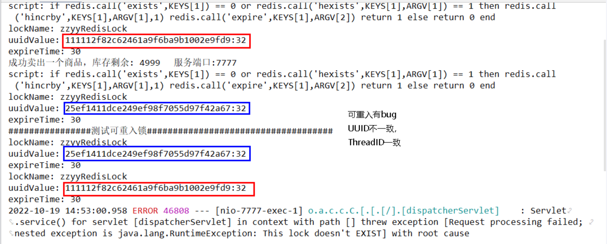
  
  ThreadID一直了但是UUID不OK，o(╥﹏╥)o

- 引入工厂模式改造7.2版code
  
  - DistributedLockFactory
    
    ```java
    package com.atguigu.redislock.mylock;
    
    import cn.hutool.core.util.IdUtil;
    import org.springframework.beans.factory.annotation.Autowired;
    import org.springframework.data.redis.core.StringRedisTemplate;
    import org.springframework.stereotype.Component;
    
    import java.util.concurrent.locks.Lock;
    
    /**
     * @auther zzyy
     * @create 2022-10-23 22:40
     */
    @Component
    public class DistributedLockFactory
    {
        @Autowired
        private StringRedisTemplate stringRedisTemplate;
        private String lockName;
        private String uuidValue;
    
        public DistributedLockFactory()
        {
            this.uuidValue = IdUtil.simpleUUID();//UUID
        }
    
        public Lock getDistributedLock(String lockType)
        {
            if(lockType == null) return null;
    
            if(lockType.equalsIgnoreCase("REDIS")){
                lockName = "zzyyRedisLock";
                return new RedisDistributedLock(stringRedisTemplate,lockName,uuidValue);
            } else if(lockType.equalsIgnoreCase("ZOOKEEPER")){
                //TODO zookeeper版本的分布式锁实现
                return new ZookeeperDistributedLock();
            } else if(lockType.equalsIgnoreCase("MYSQL")){
                //TODO mysql版本的分布式锁实现
                return null;
            }
            return null;
        }
    }
    ```
  
  - RedisDistributedLock
    
    ```java
    package com.atguigu.redislock.mylock;
    
    import cn.hutool.core.util.IdUtil;
    import lombok.SneakyThrows;
    import org.springframework.data.redis.core.StringRedisTemplate;
    import org.springframework.data.redis.core.script.DefaultRedisScript;
    
    import java.util.Arrays;
    import java.util.Timer;
    import java.util.TimerTask;
    import java.util.concurrent.TimeUnit;
    import java.util.concurrent.locks.Condition;
    import java.util.concurrent.locks.Lock;
    
    /**
     * @auther zzyy
     * @create 2022-10-23 22:36
     */
    public class RedisDistributedLock implements Lock
    {
        private StringRedisTemplate stringRedisTemplate;
        private String lockName;
        private String uuidValue;
        private long   expireTime;
    
        public RedisDistributedLock(StringRedisTemplate stringRedisTemplate, String lockName,String uuidValue)
        {
            this.stringRedisTemplate = stringRedisTemplate;
            this.lockName = lockName;
            this.uuidValue = uuidValue+":"+Thread.currentThread().getId();
            this.expireTime = 30L;
        }
    
        @Override
        public void lock()
        {
            this.tryLock();
        }
        @Override
        public boolean tryLock()
        {
            try
            {
                return this.tryLock(-1L,TimeUnit.SECONDS);
            } catch (InterruptedException e) {
                e.printStackTrace();
            }
            return false;
        }
    
        @Override
        public boolean tryLock(long time, TimeUnit unit) throws InterruptedException
        {
            if(time != -1L)
            {
                expireTime = unit.toSeconds(time);
            }
    
            String script =
                    "if redis.call('exists',KEYS[1]) == 0 or redis.call('hexists',KEYS[1],ARGV[1]) == 1 then " +
                        "redis.call('hincrby',KEYS[1],ARGV[1],1) " +
                        "redis.call('expire',KEYS[1],ARGV[2]) " +
                        "return 1 " +
                    "else " +
                        "return 0 " +
                    "end";
            System.out.println("lockName: "+lockName+"\t"+"uuidValue: "+uuidValue);
    
            while (!stringRedisTemplate.execute(new DefaultRedisScript<>(script, Boolean.class), Arrays.asList(lockName), uuidValue, String.valueOf(expireTime)))
            {
                try { TimeUnit.MILLISECONDS.sleep(60); } catch (InterruptedException e) { e.printStackTrace(); }
            }
    
            return true;
        }
    
        @Override
        public void unlock()
        {
            String script =
                    "if redis.call('HEXISTS',KEYS[1],ARGV[1]) == 0 then " +
                        "return nil " +
                    "elseif redis.call('HINCRBY',KEYS[1],ARGV[1],-1) == 0 then " +
                        "return redis.call('del',KEYS[1]) " +
                    "else " +
                            "return 0 " +
                    "end";
            System.out.println("lockName: "+lockName+"\t"+"uuidValue: "+uuidValue);
            Long flag = stringRedisTemplate.execute(new DefaultRedisScript<>(script, Long.class), Arrays.asList(lockName), uuidValue, String.valueOf(expireTime));
            if(flag == null)
            {
                throw new RuntimeException("没有这个锁，HEXISTS查询无");
            }
        }
    
        //=========================================================
        @Override
        public void lockInterruptibly() throws InterruptedException
        {
    
        }
        @Override
        public Condition newCondition()
        {
            return null;
        }
    }
    ```
  
  - InventoryService类新增可重入测试方法
    
    ```java
    package com.atguigu.redislock.service;
    
    import cn.hutool.core.util.IdUtil;
    import com.atguigu.redislock.mylock.DistributedLockFactory;
    import lombok.extern.slf4j.Slf4j;
    import org.springframework.beans.factory.annotation.Autowired;
    import org.springframework.beans.factory.annotation.Value;
    import org.springframework.data.redis.core.StringRedisTemplate;
    import org.springframework.data.redis.core.script.DefaultRedisScript;
    import org.springframework.stereotype.Service;
    
    import java.util.Arrays;
    import java.util.concurrent.TimeUnit;
    import java.util.concurrent.locks.Lock;
    import java.util.concurrent.locks.ReentrantLock;
    
    /**
     * @auther zzyy
     * @create 2022-10-22 15:14
     */
    @Service
    @Slf4j
    public class InventoryService
    {
        @Autowired
        private StringRedisTemplate stringRedisTemplate;
        @Value("${server.port}")
        private String port;
        @Autowired
        private DistributedLockFactory distributedLockFactory;
    
        public String sale()
        {
            String retMessage = "";
            Lock redisLock = distributedLockFactory.getDistributedLock("redis");
            redisLock.lock();
            try
            {
                //1 查询库存信息
                String result = stringRedisTemplate.opsForValue().get("inventory001");
                //2 判断库存是否足够
                Integer inventoryNumber = result == null ? 0 : Integer.parseInt(result);
                //3 扣减库存
                if(inventoryNumber > 0) {
                    stringRedisTemplate.opsForValue().set("inventory001",String.valueOf(--inventoryNumber));
                    retMessage = "成功卖出一个商品，库存剩余: "+inventoryNumber;
                    System.out.println(retMessage);
                    this.testReEnter();
                }else{
                    retMessage = "商品卖完了，o(╥﹏╥)o";
                }
            }catch (Exception e){
                e.printStackTrace();
            }finally {
                redisLock.unlock();
            }
            return retMessage+"\t"+"服务端口号："+port;
        }
    ```
    
            private void testReEnter()
            {
                Lock redisLock = distributedLockFactory.getDistributedLock("redis");
                redisLock.lock();
                try
                {
                    System.out.println("################测试可重入锁####################################");
                }finally {
                    redisLock.unlock();
                }
            }
        }
        ```
    
    - 单机+并发+可重入性，测试通过

### 8.自动续签

>   确保redisLock过期时间大于业务执行时间的问题

Redis分布式如何续签？

>   CAP

- Redis集群是AP

AP：`redis异步复制造成的锁丢失`，比如主节点没来的及把刚刚set进来这条数据给从节点，master就挂了，从机上位但从机上无该数据

- Zookeeper集群是CP

CP

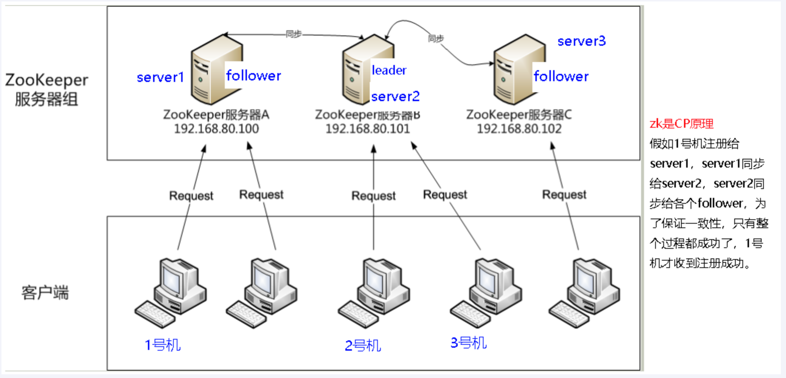

故障

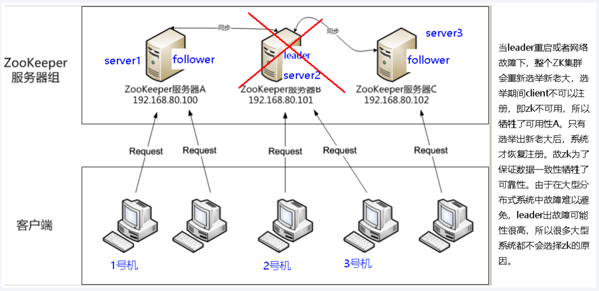

顺便复习Eureka集群是AP

AP

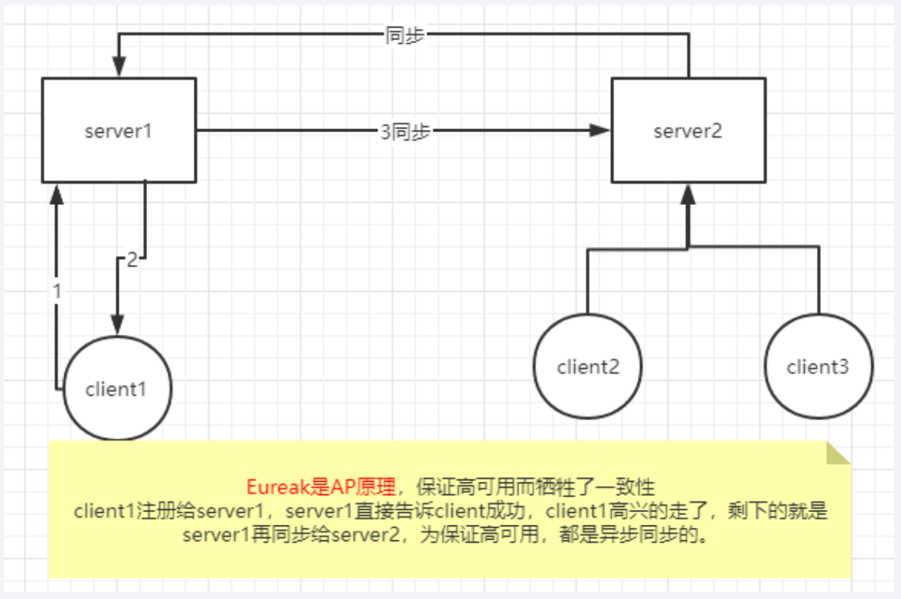

顺便复习Nacos集群是AP

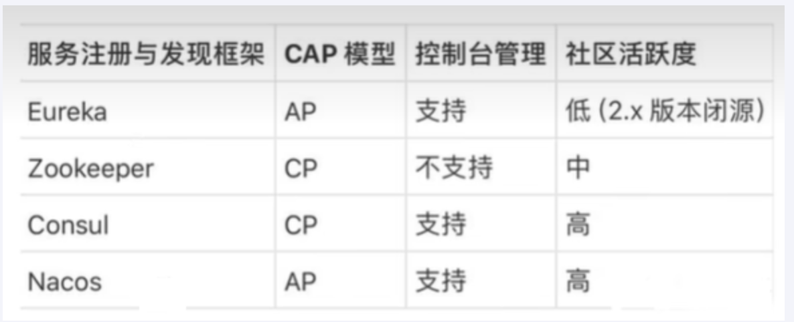

>   加个钟，lua脚本

| hset zzyyRedisLock 111122223333:11 3                                                                                                                       |
| ---------------------------------------------------------------------------------------------------------------------------------------------------------- |
| EXPIRE zzyyRedisLock 30                                                                                                                                    |
| ttl zzyyRedisLock                                                                                                                                          |
| 。。。。。                                                                                                                                                      |
| eval "if redis.call('HEXISTS',KEYS[1],ARGV[1]) == 1 then return redis.call('expire',KEYS[1],ARGV[2]) else return 0 end" 1 zzyyRedisLock 111122223333:11 30 |
| ttl zzyyRedisLock                                                                                                                                          |

```lua
//==============自动续期
if redis.call('HEXISTS',KEYS[1],ARGV[1]) == 1 then
    return redis.call('expire',KEYS[1],ARGV[2])
else 
    return 0
end
```

>   8.0新增自动续签的功能

修改为V8.0版程序

del掉之前的lockName zzyyRedisLock

RedisDistributedLock

```java
package com.atguigu.redislock.mylock;

import cn.hutool.core.util.IdUtil;
import org.springframework.beans.factory.annotation.Autowired;
import org.springframework.data.redis.core.StringRedisTemplate;
import org.springframework.data.redis.core.script.DefaultRedisScript;
import org.springframework.data.redis.support.collections.DefaultRedisList;
import org.springframework.stereotype.Component;

import java.util.Arrays;
import java.util.Timer;
import java.util.TimerTask;
import java.util.concurrent.TimeUnit;
import java.util.concurrent.locks.Condition;
import java.util.concurrent.locks.Lock;

/**
 * @auther zzyy
 * @create 2022-10-18 18:32
 */
public class RedisDistributedLock implements Lock
{
    private StringRedisTemplate stringRedisTemplate;

    private String lockName;//KEYS[1]
    private String uuidValue;//ARGV[1]
    private long   expireTime;//ARGV[2]

    public RedisDistributedLock(StringRedisTemplate stringRedisTemplate,String lockName,String uuidValue)
    {
        this.stringRedisTemplate = stringRedisTemplate;
        this.lockName = lockName;
        this.uuidValue = uuidValue+":"+Thread.currentThread().getId();
        this.expireTime = 30L;
    }
    @Override
    public void lock()
    {
        tryLock();
    }

    @Override
    public boolean tryLock()
    {
        try {tryLock(-1L,TimeUnit.SECONDS);} catch (InterruptedException e) {e.printStackTrace();}
        return false;
    }

    /**
     * 干活的，实现加锁功能，实现这一个干活的就OK，全盘通用
     * @param time
     * @param unit
     * @return
     * @throws InterruptedException
     */
    @Override
    public boolean tryLock(long time, TimeUnit unit) throws InterruptedException
    {
        if(time != -1L)
        {
            this.expireTime = unit.toSeconds(time);
        }

        String script =
                "if redis.call('exists',KEYS[1]) == 0 or redis.call('hexists',KEYS[1],ARGV[1]) == 1 then " +
                        "redis.call('hincrby',KEYS[1],ARGV[1],1) " +
                        "redis.call('expire',KEYS[1],ARGV[2]) " +
                        "return 1 " +
                        "else " +
                        "return 0 " +
                        "end";

        System.out.println("script: "+script);
        System.out.println("lockName: "+lockName);
        System.out.println("uuidValue: "+uuidValue);
        System.out.println("expireTime: "+expireTime);

        while (!stringRedisTemplate.execute(new DefaultRedisScript<>(script,Boolean.class), Arrays.asList(lockName),uuidValue,String.valueOf(expireTime))) {
            TimeUnit.MILLISECONDS.sleep(50);
        }
        this.renewExpire();
        return true;
    }

    /**
     *干活的，实现解锁功能
     */
    @Override
    public void unlock()
    {
        String script =
                "if redis.call('HEXISTS',KEYS[1],ARGV[1]) == 0 then " +
                        "   return nil " +
                        "elseif redis.call('HINCRBY',KEYS[1],ARGV[1],-1) == 0 then " +
                        "   return redis.call('del',KEYS[1]) " +
                        "else " +
                        "   return 0 " +
                        "end";
        // nil = false 1 = true 0 = false
        System.out.println("lockName: "+lockName);
        System.out.println("uuidValue: "+uuidValue);
        System.out.println("expireTime: "+expireTime);
        Long flag = stringRedisTemplate.execute(new DefaultRedisScript<>(script, Long.class), Arrays.asList(lockName),uuidValue,String.valueOf(expireTime));
        if(flag == null)
        {
            throw new RuntimeException("This lock doesn't EXIST");
        }
    }

    private void renewExpire()
    {
        String script =
                "if redis.call('HEXISTS',KEYS[1],ARGV[1]) == 1 then " +
                        "return redis.call('expire',KEYS[1],ARGV[2]) " +
                        "else " +
                        "return 0 " +
                        "end";

        new Timer().schedule(new TimerTask()
        {
            @Override
            public void run()
            {
                if (stringRedisTemplate.execute(new DefaultRedisScript<>(script, Boolean.class), Arrays.asList(lockName),uuidValue,String.valueOf(expireTime))) {
                    renewExpire();
                }
            }
        },(this.expireTime * 1000)/3);
    }

    //===下面的redis分布式锁暂时用不到=======================================
    //===下面的redis分布式锁暂时用不到=======================================
    //===下面的redis分布式锁暂时用不到=======================================
    @Override
    public void lockInterruptibly() throws InterruptedException
    {

    }

    @Override
    public Condition newCondition()
    {
        return null;
    }
}
```

InventoryService

```java
package com.atguigu.redislock.service;

import cn.hutool.core.util.IdUtil;
import com.atguigu.redislock.mylock.DistributedLockFactory;
import lombok.extern.slf4j.Slf4j;
import org.springframework.beans.factory.annotation.Autowired;
import org.springframework.beans.factory.annotation.Value;
import org.springframework.data.redis.core.StringRedisTemplate;
import org.springframework.data.redis.core.script.DefaultRedisScript;
import org.springframework.stereotype.Service;

import java.util.Arrays;
import java.util.concurrent.TimeUnit;
import java.util.concurrent.locks.Lock;
import java.util.concurrent.locks.ReentrantLock;

/**
 * @auther zzyy
 * @create 2022-10-22 15:14
 */
@Service
@Slf4j
public class InventoryService
{
    @Autowired
    private StringRedisTemplate stringRedisTemplate;
    @Value("${server.port}")
    private String port;
    @Autowired
    private DistributedLockFactory distributedLockFactory;

    public String sale()
    {
        String retMessage = "";
        Lock redisLock = distributedLockFactory.getDistributedLock("redis");
        redisLock.lock();
        try
        {
            //1 查询库存信息
            String result = stringRedisTemplate.opsForValue().get("inventory001");
            //2 判断库存是否足够
            Integer inventoryNumber = result == null ? 0 : Integer.parseInt(result);
            //3 扣减库存
            if(inventoryNumber > 0) {
                stringRedisTemplate.opsForValue().set("inventory001",String.valueOf(--inventoryNumber));
                retMessage = "成功卖出一个商品，库存剩余: "+inventoryNumber;
                System.out.println(retMessage);
                //暂停几秒钟线程,为了测试自动续期
                try { TimeUnit.SECONDS.sleep(120); } catch (InterruptedException e) { e.printStackTrace(); }
            }else{
                retMessage = "商品卖完了，o(╥﹏╥)o";
            }
        }catch (Exception e){
            e.printStackTrace();
        }finally {
            redisLock.unlock();
        }
        return retMessage+"\t"+"服务端口号："+port;
    }


    private void testReEnter()
    {
        Lock redisLock = distributedLockFactory.getDistributedLock("redis");
        redisLock.lock();
        try
        {
            System.out.println("################测试可重入锁####################################");
        }finally {
            redisLock.unlock();
        }
    }
}
```

- 记得去掉可重入锁测试testReEnter()
- InventoryService业务逻辑里面故意sleep一段时间测试自动续期

### 9.总结

synchronized单机版OK，上分布式死翘翘

nginx分布式微服务（单机锁不行o(╥﹏╥)o）

取消单机锁，上redis分布式锁setnx

- 只要加了锁，没有释放锁，出异常的话，可能无法释放锁，必须在代码里面finally释放锁
- 宕机了，部署了微服务代码层面根本没有走到finally这块，没办法保证解锁，这个key没有被删除，需要有lockKey的过期时间设定
- 为redis的分布式锁key，增加过期此外，还必须要setnx+过期时间必须是同一行
  - 必须规定自己删除自己的锁，你不能删除别人的锁，防止张冠李戴，1删2,2删3
  - unlock变为Lua脚本保证
  - 锁重入，hset替代setnx+lock变为Lua脚本保证
  - 自动续签
