---
# 当前页面内容标题
title: 二、Dockerfile解析
# 分类
category:
  - docker
# 标签
tag: 
  - docker
  - 云原生开发
  - Devops
sticky: false
# 是否收藏在博客主题的文章列表中，当填入数字时，数字越大，排名越靠前。
star: false
# 是否将该文章添加至文章列表中
article: true
# 是否将该文章添加至时间线中
timeline: true
---

## 一、是什么

DockerFile是用来构建Docker镜像的文本文件，是由一条条构建镜像所需的指令和参数构成的脚本。

**概述**

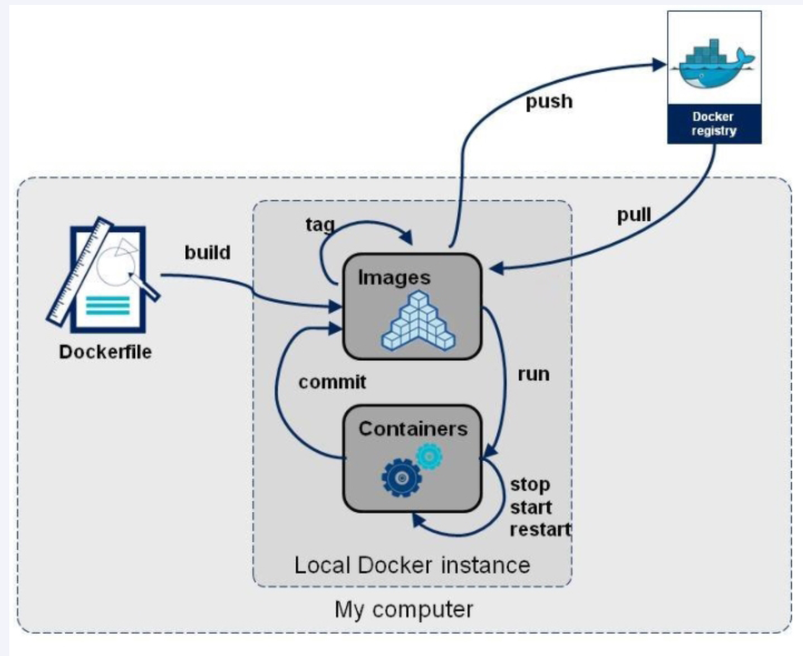

**[官网](https://docs.docker.com/engine/reference/builder/)**

**构建三步骤**

1.   编写Dockerfile文件
2.   docker builde命令构建镜像
3.   docker run依镜像运行容器示例

## 二、DockerFile构建过程解析

>   Docker内容基础知识

1：每条保留字指令都`必须为大写字母`且后面要跟随最少一个参数

2：指令按照从上到下，顺序执行

3：#表示注释

4：每条指令都会创建一个新的镜像层并对镜像进行提交

>   Docker执行的Dockerfile的大致流程

（1）docker从基础镜像运行一个容器

（2）执行一条指令并对容器作出修改

（3）执行类似docker commit的操作提交一个新的镜像层

（4）docker 再基于刚提交的镜像运行一个新容器

（5）执行dockerfile中的下一条指令直到所有指令都执行完成

>   小总结

从应用软件的角度来看，Dockerfile、Docker镜像与Docker容器分别代表软件的三个不同阶段，

*   Dockerfile是软件的原材料

*   Docker镜像是软件的交付品

*   Docker容器则可以认为是软件镜像的运行态，也即依照镜像运行的容器实例

Dockerfile面向开发，Docker镜像成为交付标准，Docker容器则涉及部署与运维，三者缺一不可，合力充当Docker体系的基石。

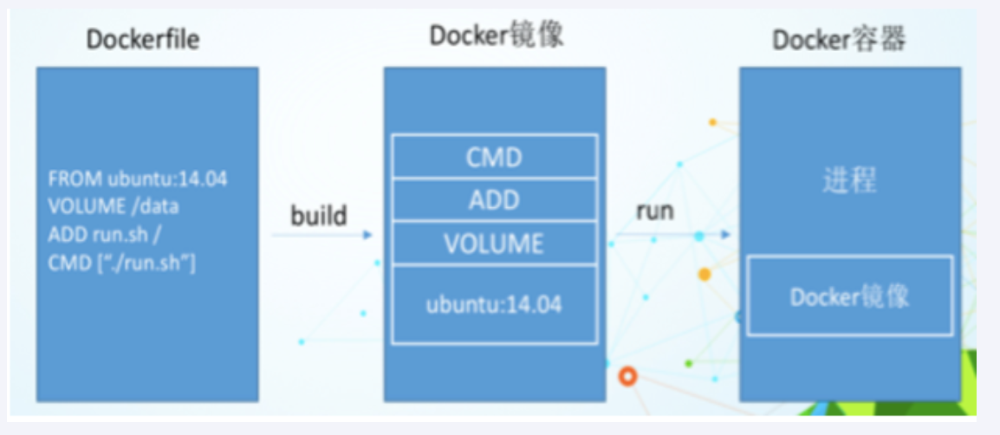


1 Dockerfile，需要定义一个Dockerfile，Dockerfile定义了进程需要的一切东西。Dockerfile涉及的内容包括执行代码或者是文件、环境变量、依赖包、运行时环境、动态链接库、操作系统的发行版、服务进程和内核进程(当应用进程需要和系统服务和内核进程打交道，这时需要考虑如何设计namespace的权限控制)等等;

 2 Docker镜像，在用Dockerfile定义一个文件之后，docker build时会产生一个Docker镜像，当运行 Docker镜像时会真正开始提供服务;

 3 Docker容器，容器是直接提供服务的。

## 三、DockerFile常用保留字指令

[参考tomcat8的dockerfile入门](https://github.com/docker-library/tomcat)

-   FROM

基础镜像，当前镜像是基于哪个镜像的，指定一个已经存在的镜像作为模版，第一条必须是from

-   MAINTAINER

镜像维护者的姓名和邮箱地址

-   RUN

容器构建时需要运行的命令

>   两种格式：
>
>   -   shell格式
>
>   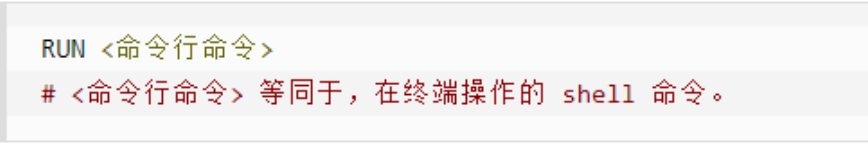
>
>   ```shell
>   RUN yum -y install vim
>   ```
>
>   -   exec格式
>
>   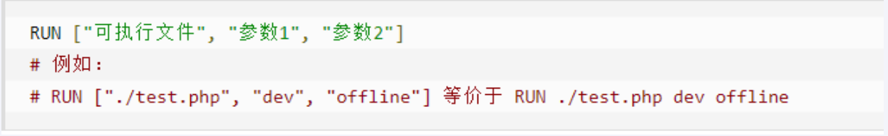

RUN是在docker build时运行

-   EXPOSE

当前容器对外暴漏出的端口

-   WORKDIR

指定在创建容器后，终端默认登录的进来工作目录，一个落脚点

-   USER

指定该镜像以什么样的用户去执行，如果不指定，默认是root

-   ENV

用来构建镜像过程中设置环境变量

ENV MY_PATH /usr/mytest

这个环境变量可以在后续的任何RUN指令中使用，这就如同在命令前面指定了环境变量前缀一样；

也可以在其它指令中直接使用这些环境变量，比如：WORKDIR $MY_PATH

-   ADD

将宿主机目录下的文件拷贝进镜像且会自动处理URL和解压tar压缩包

-   COPY

类似ADD，拷贝文件和目录到镜像中。

将从构建上下文目录中，< 源路径 >的文件/目录复制到新的一层的镜像内的< 目标路径 >位置

>   -   COPY src dest
>   -   COPY [“src”,”dest”]
>   -   < src源路径 >：源文件或者源目录
>   -   < dest目标路径 >：容器内的指定路径，该路径不用事先建好，路径不存在的话，会自动创建

-   VOLUME

容器数据卷，用于数据保存和持久化工作

-   CMD

指定容器启动时要干的事情

>   注意：
>
>   DockerFile中可以有多个CMD指令，但只有最后一个生效，CMD会被docker run之后的参数替换
>
>   参考官网Tomcat的dockerfile演示案例
>
>   官网最后一行命令
>
>   
>
>   我们演示自己的覆盖操作
>
>   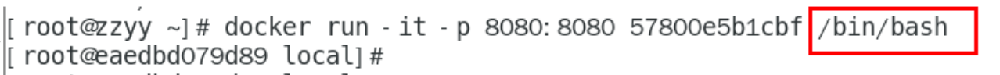
>
>   它和前面RUN命令的区别
>
>   -   CMD是在docker run时运行。
>   -   RUN是在docker build时运行。

-   ENTRYPOINT

也是用来指定一个容器启动时要运行的命令

类似于CMD指令，`但是ENTRYPOINT不会被docker run后面的命令覆盖，而且这些命令行参数会被当做参数送给ENTRYPOINT指令指定的程序`

命令格式和案例说明

命令格式：

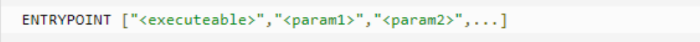

ENTRYPOINT可以和CMD一起用，一般是变参才会使用 CMD ，这里的 CMD 等于是在给 ENTRYPOINT 传参。

当指定了ENTRYPOINT后，CMD的含义就发生了变化，不再是直接运行其命令而是将CMD的内容作为参数传递给ENTRYPOINT指令，他两个组合会变成

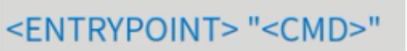

案例如下：假设已通过 Dockerfile 构建了 nginx:test 镜像：

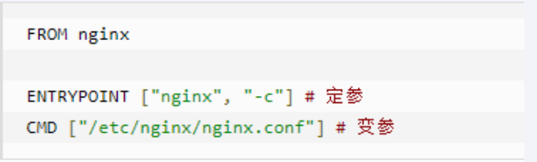

| 是否传参         | 按照dockerfile编写执行         | 传参运行                                     |
| ---------------- | ------------------------------ | -------------------------------------------- |
| Docker命令       | docker run nginx:test          | docker run nginx:test -c /etc/nginx/new.conf |
| 衍生出的实际命令 | nginx -c /etc/nginx/nginx.conf | nginx -c /etc/nginx/new.conf                 |

>   优点：在执行docker run的时候可以指定 ENTRYPOINT运行所需要的参数。
>
>   注意：如果dockerfile中如果存在多个ENTRYPOINT指令，仅最后一个生效。

-   小总结

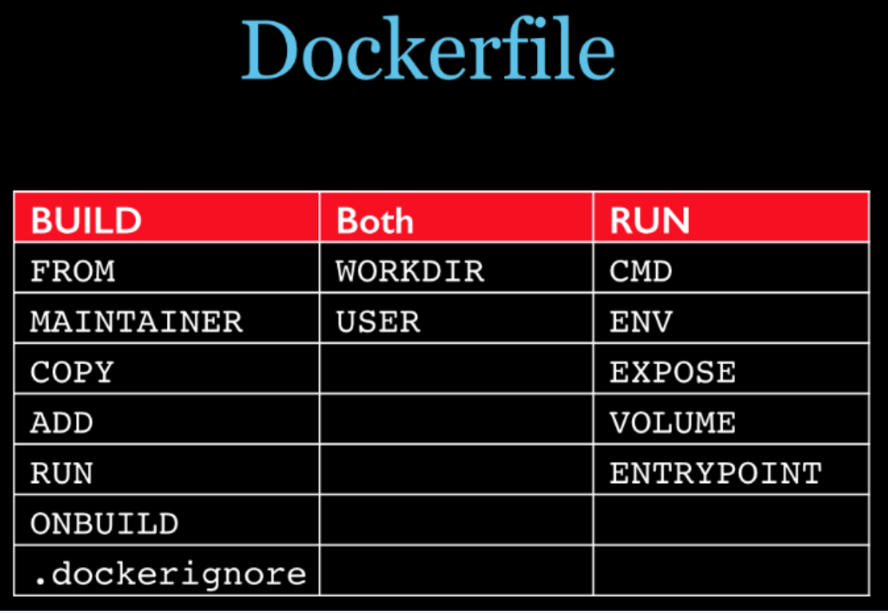

## 四、案例

### 自定义镜像mycentosjava8

1.要求

CentOS7镜像具备vim+ifconfig+jdk8

**JDK的下载地址**

[官网](https://www.oracle.com/java/technologies/downloads/#java8)

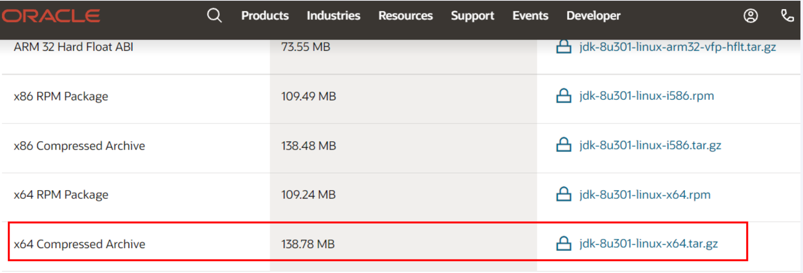

[加速镜像网站](https://mirrors.yangxingzhen.com/jdk)

2.编写

准备编写Dockerfile文件（大写字母D）

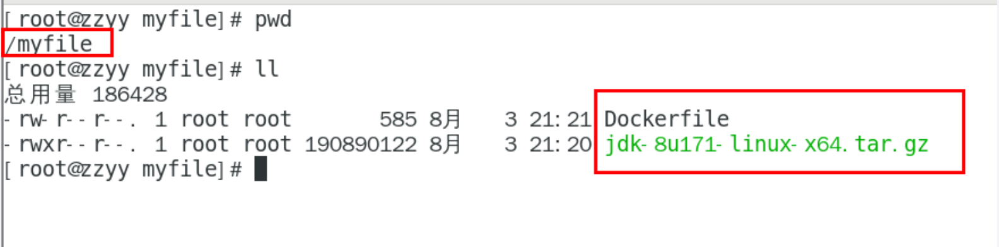

```shell
# 指定centos版本 centos:7
FROM centos:7
# FROM centos
MAINTAINER zzyy<zzyybs@126.com>
 
ENV MYPATH /usr/local
WORKDIR $MYPATH
 
#安装vim编辑器
RUN yum -y install vim
#安装ifconfig命令查看网络IP
RUN yum -y install net-tools
#安装java8及lib库
RUN yum -y install glibc.i686
RUN mkdir /usr/local/java
#ADD 是相对路径jar,把jdk-8u171-linux-x64.tar.gz添加到容器中,安装包必须要和Dockerfile文件在同一位置
ADD jdk-8u171-linux-x64.tar.gz /usr/local/java/
#配置java环境变量
ENV JAVA_HOME /usr/local/java/jdk1.8.0_171
ENV JRE_HOME $JAVA_HOME/jre
ENV CLASSPATH $JAVA_HOME/lib/dt.jar:$JAVA_HOME/lib/tools.jar:$JRE_HOME/lib:$CLASSPATH
ENV PATH $JAVA_HOME/bin:$PATH
 
EXPOSE 80
 
CMD echo $MYPATH
CMD echo "success--------------ok"
CMD /bin/bash
```

3.构建

```shell
docker build -t 新镜像名字:TAG

docker build -t centosjava8:1.5 .
```

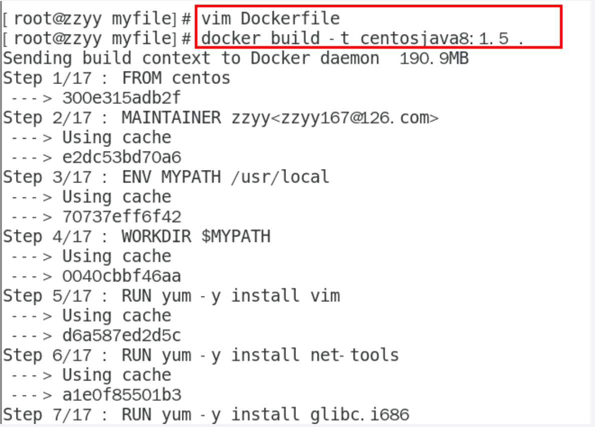

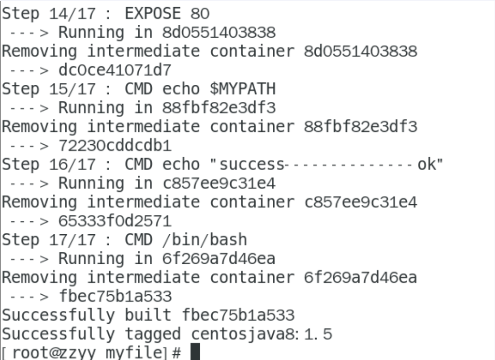

>   注意，上面TAG后米娜有个空格，有个点
>
>   **注意点**：注意一下，这边阳哥的centos是7版本的，现在的最新版已经改为8版本了，pull拉取镜像的时候记得标明centos:7，不然8版本无论怎么改都是没办法下载的，FROM参数也要改成centos:7
>
>   FROM centos:7 无用的话加一个参数 docker build --network host -t centosjava8:1.5 .
>
>   如果改成：7还不行，是网络问题的话就restart docker
>
>   参考文章：[Dockerfile中 RUN yum -y install vim失败Cannot prepare internal mirrorlist: No URLs in mirrorlist - 简书 (jianshu.com)](https://www.jianshu.com/p/ebd80c7402ea)


4.运行

```SHELL
docker run -it 新镜像名字:TAG

docker run -it centosjava8:1.5 /bin/bash
```

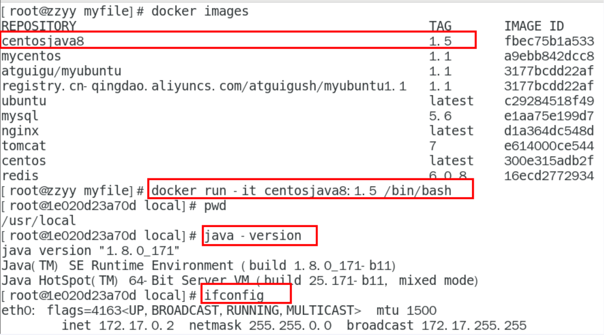

5.再体会下UnionFS（联合文件系统）

UnionFS（联合文件系统）：Union文件系统（UnionFS）是一种分层、轻量级并且高性能的文件系统，它支持**对文件系统的修改作为一次提交来一层层的叠加**，同时可以将不同目录挂载到同一个虚拟文件系统下(unite several directories into a single virtual filesystem)。Union 文件系统是 Docker 镜像的基础。`镜像可以通过分层来进行继承`，基于基础镜像（没有父镜像），可以制作各种具体的应用镜像。


特性：一次同时加载多个文件系统，但从外面看起来，只能看到一个文件系统，联合加载会把各层文件系统叠加起来，这样最终的文件系统会包含所有底层的文件和目录

### 虚悬镜像

>   是什么

仓库名、标签都是< none >的镜像，俗称dangling image

Dockerfile写一个

1 vim Dockerfile

```shell
from ubuntu
CMD echo 'action is success'
```

2 docker build .

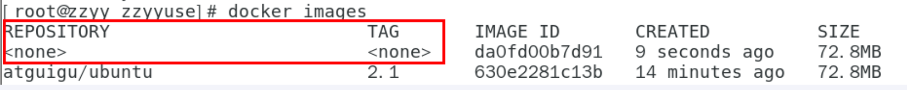

>   查看

```shell
docker image ls -f dangling=true
```

命令结果

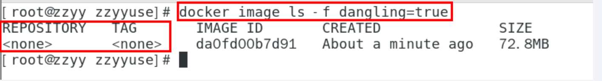

>   删除

```shell
docker image purne
```

虚悬镜像已经失去存在价值，可以删除

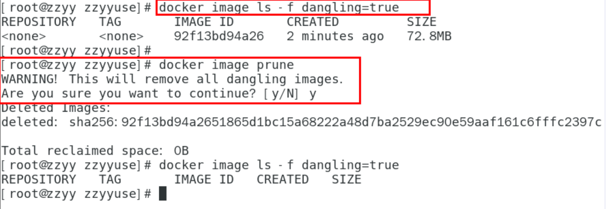

### 家庭作业–自定义镜像myubuntu

>   编写编写Dockerfile文件
>
>   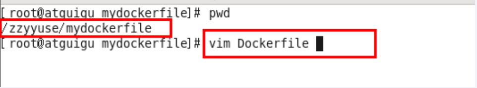
>
>   ```shell
>   FROM ubuntu
>   MAINTAINER zzyy<zzyybs@126.com>
>    
>   ENV MYPATH /usr/local
>   WORKDIR $MYPATH
>    
>   RUN apt-get update
>   RUN apt-get install net-tools
>   #RUN apt-get install -y iproute2
>   #RUN apt-get install -y inetutils-ping
>    
>   EXPOSE 80
>    
>   CMD echo $MYPATH
>   CMD echo "install inconfig cmd into ubuntu success--------------ok"
>   CMD /bin/bash
>   ```

```shell
docker build -t 新镜像名字:TAG .
```

```SHELL
docker run -it 新镜像名字:TAG
```


## 五、小总结

