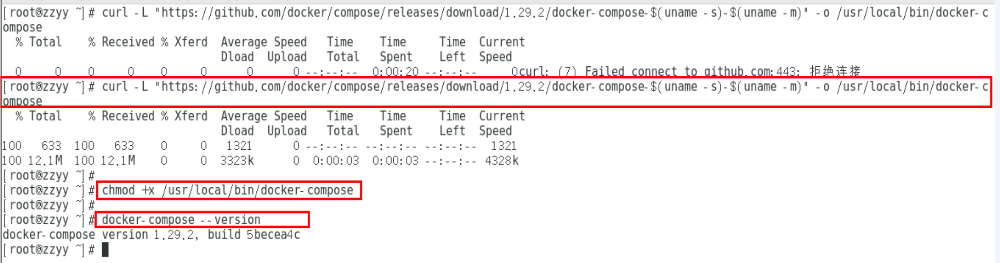
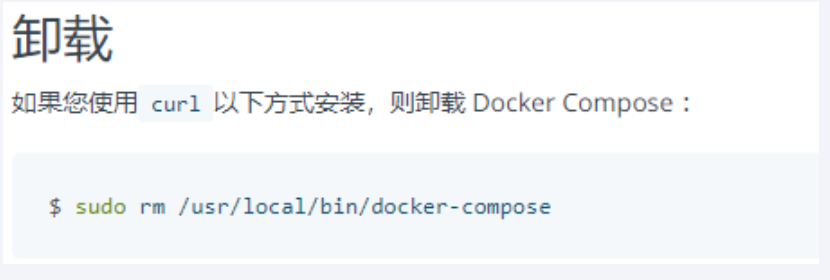
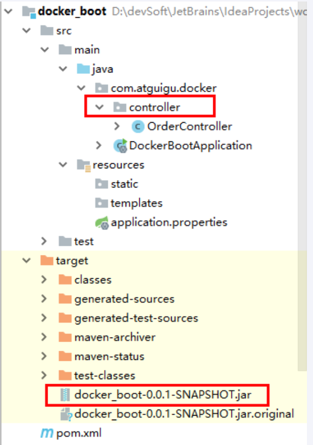
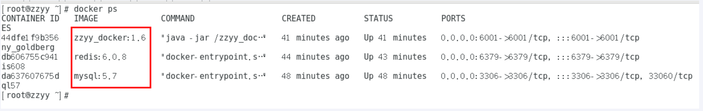
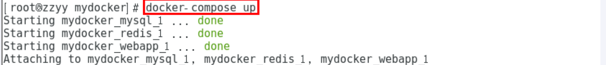
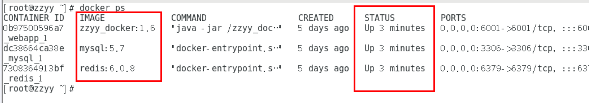
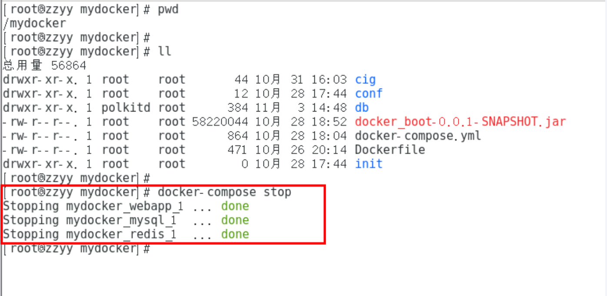

---
# 当前页面内容标题
title: 五、Docker-Compose容器编排
# 分类
category:
  - docker
# 标签
tag: 
  - docker
  - 云原生开发
  - Devops
sticky: false
# 是否收藏在博客主题的文章列表中，当填入数字时，数字越大，排名越靠前。
star: false
# 是否将该文章添加至文章列表中
article: true
# 是否将该文章添加至时间线中
timeline: true
---

## 一、是什么

Compose 是 Docker 公司推出的一个工具软件，可以管理多个 Docker 容器组成一个应用。你需要定义一个 YAML 格式的配置文件docker-compose.yml，`写好多个容器之间的调用关系`。然后，只要一个命令，就能同时启动/关闭这些容器

Docker-Compose是Docker官方开源项目，负责实现对Docker容器集群的快速编排。

## 二、能干嘛

 docker建议我们每一个容器中只运行一个服务,因为docker容器本身占用资源极少,所以最好是将每个服务单独的分割开来但是这样我们又面临了一个问题？

如果我需要同时部署好多个服务,难道要每个服务单独写Dockerfile然后在构建镜像,构建容器,这样累都累死了,所以docker官方给我们提供了docker-compose多服务部署的工具

例如要实现一个Web微服务项目，除了Web服务容器本身，往往还需要再加上后端的数据库mysql服务容器，redis服务器，注册中心eureka，甚至还包括负载均衡容器等等。。。。。。

Compose允许用户通过一个单独的**docker-compose.yml模板文件**（YAML 格式）`来定义一组相关联的应用容器为一个项目（project）。`

可以很容易地用一个配置文件定义一个多容器的应用，然后使用一条指令安装这个应用的所有依赖，完成构建。Docker-Compose 解决了容器与容器之间如何管理编排的问题。

## 三、去哪下

[官网](https://docs.docker.com/compose/compose-file/compose-file-v3)

[官网下载](https://docs.docker.com/compose/install/)

>   安装步骤

```shell
curl -L "https://github.com/docker/compose/releases/download/1.29.2/docker-compose-$(uname -s)-$(uname -m)" -o /usr/local/bin/docker-compose

chmod +x /usr/local/bin/docker-compose

docker-compose --version
```



>   卸载步骤



```shell
sudo rm /usr/local/bin/docker-compose
```

## 四、Compose核心概念

>   一文件

`docker-compose.yml`

>   两要素

-   服务（service）

一个个应用容器实例，比如订单微服务、库存微服务、mysql容器、nginx容器或者redis容器

-   工程（project）

由一组关联的应用容器组成的一个`完整业务单元`，在docker-compose.yml文件中定义。

## 五、Compose使用的三个步骤

1.  编写Dockerfile定义各个微服务应用并构建出对应的镜像文件。
2.  使用docker-compose.yml定义一个完整业务单元，安排好整体应用中的各个容器服务。
3.  最后，执行docker-compose up命令来启动并运行整个应用程序，完成一键部署上线。

## 六、Compose常用命令

```shell
# Compose常用命令

docker-compose -h                           # 查看帮助
docker-compose up                           # 启动所有docker-compose服务
docker-compose up -d                        # 启动所有docker-compose服务并后台运行
docker-compose down                         # 停止并删除容器、网络、卷、镜像。
docker-compose exec  yml里面的服务id                 # 进入容器实例内部  docker-compose exec docker-compose.yml文件中写的服务id /bin/bash
docker-compose ps                      # 展示当前docker-compose编排过的运行的所有容器
docker-compose top                     # 展示当前docker-compose编排过的容器进程

docker-compose logs  yml里面的服务id     # 查看容器输出日志
docker-compose config     # 检查配置
docker-compose config -q  # 检查配置，有问题才有输出
docker-compose restart   # 重启服务
docker-compose start     # 启动服务
docker-compose stop      # 停止服务
```

## 七、Docker Compose配置常用字段

| **字段**       | **描述**                                                     |
| -------------- | ------------------------------------------------------------ |
| build          | 指定Dockerfile文件名（要指定的Dockerfile文件需要在build标签的子级标签中用dockerfile标签指定） |
| dockerfile     | 构建镜像上下文路径                                           |
| context        | 可以是dockerfile路径，或者是执行git 仓库的url地址            |
| image          | 指定镜像（已存在）                                           |
| command        | 执行命令，会覆盖容器启动后默认执行的命令（会覆盖Dockerfile的CMD指令） |
| container_name | 指定容器名称，由于容器名称是唯一的，如果指定自定义名称，则无法scale指定容器数量 |
| deploy         | 指定部署和运行服务相关配置，只能在Swarm模式使用              |
| environment    | 添加环境变量                                                 |
| networks       | 加入网络，引用顶级networks下条目                             |
| network-mode   | 设置容器的网络模式                                           |
| ports          | 暴露容器端口，与-p 相同，但是端口不能低于60                  |
| volumes        | 挂载一个宿主机目录或命令卷到容器，命名卷要在顶级volumes 定义卷名称 |
| volumes_from   | 从另一个服务或容器挂载卷，可选参数 :ro 和 :rw，（仅版本‘2’支持） |
| hostname       | 在容器内设置内核参数                                         |
| links          | 连接到另一个容器，- 服务名称[ : ]                            |
| privileged     | 用来给容器root权限，注意是不安全的，true                     |
| restart        | 重启策略，定义是否重启容器；1.no，默认策略，在容器退出时不重启容器。2.on-failure，在容器非正常退出时（退出状态非0），才会重启容器。3.on-failure：3，在容器非正常退出时重启容器，最多重启3次。4.always，在容器退出时总是重启容器。5.unless-stopped，在容器退出时总是重启容器，但是不考虑在Docker守护进程启动时就已经停止了的容器。 |
| depends_on     | 此标签用于解决容器的依赖，启动先后问题。如启动应用容器，需要先启动数据库容器php:depends_on:- apache- mysql |


## 八、Compose编排微服务

### 1.改造升级微服务工程docker_boot

01、以前的基础版



02、SQL建库建表

```sql
CREATE TABLE `t_user` (
  `id` int(10) unsigned NOT NULL AUTO_INCREMENT,
  `username` varchar(50) NOT NULL DEFAULT '' COMMENT '用户名',
  `password` varchar(50) NOT NULL DEFAULT '' COMMENT '密码',
  `sex` tinyint(4) NOT NULL DEFAULT '0' COMMENT '性别 0=女 1=男 ',
  `deleted` tinyint(4) unsigned NOT NULL DEFAULT '0' COMMENT '删除标志，默认0不删除，1删除',
  `update_time` timestamp NOT NULL DEFAULT CURRENT_TIMESTAMP ON UPDATE CURRENT_TIMESTAMP COMMENT '更新时间',
  `create_time` timestamp NOT NULL DEFAULT CURRENT_TIMESTAMP COMMENT '创建时间',
  PRIMARY KEY (`id`)
) ENGINE=InnoDB AUTO_INCREMENT=1 DEFAULT CHARSET=utf8 COMMENT='用户表';
```

03、一键生成说明

04、改POM

```xml
<?xml version="1.0" encoding="UTF-8"?>
<project xmlns="http://maven.apache.org/POM/4.0.0" xmlns:xsi="http://www.w3.org/2001/XMLSchema-instance"
         xsi:schemaLocation="http://maven.apache.org/POM/4.0.0 https://maven.apache.org/xsd/maven-4.0.0.xsd">
    <modelVersion>4.0.0</modelVersion>
    <parent>
        <groupId>org.springframework.boot</groupId>
        <artifactId>spring-boot-starter-parent</artifactId>
        <version>2.5.6</version>
        <!--<version>2.3.10.RELEASE</version>-->
        <relativePath/> <!-- lookup parent from repository -->
    </parent>

    <groupId>com.atguigu.docker</groupId>
    <artifactId>docker_boot</artifactId>
    <version>0.0.1-SNAPSHOT</version>

    <properties>
        <project.build.sourceEncoding>UTF-8</project.build.sourceEncoding>
        <maven.compiler.source>1.8</maven.compiler.source>
        <maven.compiler.target>1.8</maven.compiler.target>
        <junit.version>4.12</junit.version>
        <log4j.version>1.2.17</log4j.version>
        <lombok.version>1.16.18</lombok.version>
        <mysql.version>5.1.47</mysql.version>
        <druid.version>1.1.16</druid.version>
        <mapper.version>4.1.5</mapper.version>
        <mybatis.spring.boot.version>1.3.0</mybatis.spring.boot.version>
    </properties>

    <dependencies>
        <!--guava Google 开源的 Guava 中自带的布隆过滤器-->
        <dependency>
            <groupId>com.google.guava</groupId>
            <artifactId>guava</artifactId>
            <version>23.0</version>
        </dependency>
        <!-- redisson -->
        <dependency>
            <groupId>org.redisson</groupId>
            <artifactId>redisson</artifactId>
            <version>3.13.4</version>
        </dependency>
        <!--SpringBoot通用依赖模块-->
        <dependency>
            <groupId>org.springframework.boot</groupId>
            <artifactId>spring-boot-starter-web</artifactId>
        </dependency>
        <dependency>
            <groupId>org.springframework.boot</groupId>
            <artifactId>spring-boot-starter-actuator</artifactId>
        </dependency>
        <!--swagger2-->
        <dependency>
            <groupId>io.springfox</groupId>
            <artifactId>springfox-swagger2</artifactId>
            <version>2.9.2</version>
        </dependency>
        <dependency>
            <groupId>io.springfox</groupId>
            <artifactId>springfox-swagger-ui</artifactId>
            <version>2.9.2</version>
        </dependency>
        <!--SpringBoot与Redis整合依赖-->
        <dependency>
            <groupId>org.springframework.boot</groupId>
            <artifactId>spring-boot-starter-data-redis</artifactId>
        </dependency>
        <!--springCache-->
        <dependency>
            <groupId>org.springframework.boot</groupId>
            <artifactId>spring-boot-starter-cache</artifactId>
        </dependency>
        <!--springCache连接池依赖包-->
        <dependency>
            <groupId>org.apache.commons</groupId>
            <artifactId>commons-pool2</artifactId>
        </dependency>
        <!-- jedis -->
        <dependency>
            <groupId>redis.clients</groupId>
            <artifactId>jedis</artifactId>
            <version>3.1.0</version>
        </dependency>
        <!--Mysql数据库驱动-->
        <dependency>
            <groupId>mysql</groupId>
            <artifactId>mysql-connector-java</artifactId>
            <version>5.1.47</version>
        </dependency>
        <!--SpringBoot集成druid连接池-->
        <dependency>
            <groupId>com.alibaba</groupId>
            <artifactId>druid-spring-boot-starter</artifactId>
            <version>1.1.10</version>
        </dependency>
        <dependency>
            <groupId>com.alibaba</groupId>
            <artifactId>druid</artifactId>
            <version>${druid.version}</version>
        </dependency>
        <!--mybatis和springboot整合-->
        <dependency>
            <groupId>org.mybatis.spring.boot</groupId>
            <artifactId>mybatis-spring-boot-starter</artifactId>
            <version>${mybatis.spring.boot.version}</version>
        </dependency>
        <!-- 添加springboot对amqp的支持 -->
        <dependency>
            <groupId>org.springframework.boot</groupId>
            <artifactId>spring-boot-starter-amqp</artifactId>
        </dependency>
        <dependency>
            <groupId>commons-codec</groupId>
            <artifactId>commons-codec</artifactId>
            <version>1.10</version>
        </dependency>
        <!--通用基础配置junit/devtools/test/log4j/lombok/hutool-->
        <!--hutool-->
        <dependency>
            <groupId>cn.hutool</groupId>
            <artifactId>hutool-all</artifactId>
            <version>5.2.3</version>
        </dependency>
        <dependency>
            <groupId>junit</groupId>
            <artifactId>junit</artifactId>
            <version>${junit.version}</version>
        </dependency>
        <dependency>
            <groupId>org.springframework.boot</groupId>
            <artifactId>spring-boot-devtools</artifactId>
            <scope>runtime</scope>
            <optional>true</optional>
        </dependency>
        <dependency>
            <groupId>org.springframework.boot</groupId>
            <artifactId>spring-boot-starter-test</artifactId>
            <scope>test</scope>
        </dependency>
        <dependency>
            <groupId>log4j</groupId>
            <artifactId>log4j</artifactId>
            <version>${log4j.version}</version>
        </dependency>
        <dependency>
            <groupId>org.projectlombok</groupId>
            <artifactId>lombok</artifactId>
            <version>${lombok.version}</version>
            <optional>true</optional>
        </dependency>
        <!--persistence-->
        <dependency>
            <groupId>javax.persistence</groupId>
            <artifactId>persistence-api</artifactId>
            <version>1.0.2</version>
        </dependency>
        <!--通用Mapper-->
        <dependency>
            <groupId>tk.mybatis</groupId>
            <artifactId>mapper</artifactId>
            <version>${mapper.version}</version>
        </dependency>
    </dependencies>

    <build>
        <plugins>
            <plugin>
                <groupId>org.springframework.boot</groupId>
                <artifactId>spring-boot-maven-plugin</artifactId>
            </plugin>
            <plugin>
                <groupId>org.apache.maven.plugins</groupId>
                <artifactId>maven-resources-plugin</artifactId>
                <version>3.1.0</version>
            </plugin>
        </plugins>
    </build>

</project>
```

05、写YML

```properties
server.port=6001
# ========================alibaba.druid相关配置=====================
spring.datasource.type=com.alibaba.druid.pool.DruidDataSource
spring.datasource.driver-class-name=com.mysql.jdbc.Driver
spring.datasource.url=jdbc:mysql://192.168.111.169:3306/db2021?useUnicode=true&characterEncoding=utf-8&useSSL=false
spring.datasource.username=root
spring.datasource.password=123456
spring.datasource.druid.test-while-idle=false
# ========================redis相关配置=====================
spring.redis.database=0
spring.redis.host=192.168.111.169
spring.redis.port=6379
spring.redis.password=
spring.redis.lettuce.pool.max-active=8
spring.redis.lettuce.pool.max-wait=-1ms
spring.redis.lettuce.pool.max-idle=8
spring.redis.lettuce.pool.min-idle=0
# ========================mybatis相关配置===================
mybatis.mapper-locations=classpath:mapper/*.xml
mybatis.type-aliases-package=com.atguigu.docker.entities
# ========================swagger=====================
spring.swagger2.enabled=true
```

06、主启动

```java
package com.atguigu.docker;

import org.springframework.boot.SpringApplication;
import org.springframework.boot.autoconfigure.SpringBootApplication;
import tk.mybatis.spring.annotation.MapperScan;

@SpringBootApplication
@MapperScan("com.atguigu.docker.mapper") //import tk.mybatis.spring.annotation.MapperScan;
public class DockerBootApplication
{
    public static void main(String[] args)
    {
        SpringApplication.run(DockerBootApplication.class, args);
    }
}
```

07、业务类

>   config配置类

RedisConfig

```java
package com.atguigu.docker.config;

import lombok.extern.slf4j.Slf4j;
import org.springframework.context.annotation.Bean;
import org.springframework.context.annotation.Configuration;
import org.springframework.data.redis.connection.lettuce.LettuceConnectionFactory;
import org.springframework.data.redis.core.RedisTemplate;
import org.springframework.data.redis.serializer.GenericJackson2JsonRedisSerializer;
import org.springframework.data.redis.serializer.StringRedisSerializer;

import java.io.Serializable;

/**
 * @auther zzyy
 * @create 2021-10-27 17:19
 */

@Configuration
@Slf4j
public class RedisConfig
{
    /**
     * @param lettuceConnectionFactory
     * @return
     *
     * redis序列化的工具配置类，下面这个请一定开启配置
     * 127.0.0.1:6379> keys *
     * 1) "ord:102"  序列化过
     * 2) "\xac\xed\x00\x05t\x00\aord:102"   野生，没有序列化过
     */
    @Bean
    public RedisTemplate<String,Serializable> redisTemplate(LettuceConnectionFactory lettuceConnectionFactory)
    {
        RedisTemplate<String,Serializable> redisTemplate = new RedisTemplate<>();

        redisTemplate.setConnectionFactory(lettuceConnectionFactory);
        //设置key序列化方式string
        redisTemplate.setKeySerializer(new StringRedisSerializer());
        //设置value的序列化方式json
        redisTemplate.setValueSerializer(new GenericJackson2JsonRedisSerializer());

        redisTemplate.setHashKeySerializer(new StringRedisSerializer());
        redisTemplate.setHashValueSerializer(new GenericJackson2JsonRedisSerializer());

        redisTemplate.afterPropertiesSet();

        return redisTemplate;
    }
}
```

SwaggerConfig

```java
package com.atguigu.docker.config;

import org.springframework.beans.factory.annotation.Value;
import org.springframework.context.annotation.Bean;
import org.springframework.context.annotation.Configuration;
import springfox.documentation.builders.ApiInfoBuilder;
import springfox.documentation.builders.PathSelectors;
import springfox.documentation.builders.RequestHandlerSelectors;
import springfox.documentation.service.ApiInfo;
import springfox.documentation.spi.DocumentationType;
import springfox.documentation.spring.web.plugins.Docket;
import springfox.documentation.swagger2.annotations.EnableSwagger2;

import java.text.SimpleDateFormat;
import java.util.Date;

/**
 * @auther zzyy
 * @create 2021-05-01 16:18
 */
@Configuration
@EnableSwagger2
public class SwaggerConfig
{
    @Value("${spring.swagger2.enabled}")
    private Boolean enabled;

    @Bean
    public Docket createRestApi() {
        return new Docket(DocumentationType.SWAGGER_2)
                .apiInfo(apiInfo())
                .enable(enabled)
                .select()
                .apis(RequestHandlerSelectors.basePackage("com.atguigu.docker")) //你自己的package
                .paths(PathSelectors.any())
                .build();
    }

    public ApiInfo apiInfo() {
        return new ApiInfoBuilder()
                .title("尚硅谷Java大厂技术"+"\t"+new SimpleDateFormat("yyyy-MM-dd").format(new Date()))
                .description("docker-compose")
                .version("1.0")
                .termsOfServiceUrl("https://www.atguigu.com/")
                .build();
    }
}
```

>   新建entity

User

```java
package com.atguigu.docker.entities;

import javax.persistence.Column;
import javax.persistence.GeneratedValue;
import javax.persistence.Id;
import javax.persistence.Table;
import java.util.Date;

@Table(name = "t_user")
public class User
{
    @Id
    @GeneratedValue(generator = "JDBC")
    private Integer id;

    /**
     * 用户名
     */
    private String username;

    /**
     * 密码
     */
    private String password;

    /**
     * 性别 0=女 1=男 
     */
    private Byte sex;

    /**
     * 删除标志，默认0不删除，1删除
     */
    private Byte deleted;

    /**
     * 更新时间
     */
    @Column(name = "update_time")
    private Date updateTime;

    /**
     * 创建时间
     */
    @Column(name = "create_time")
    private Date createTime;

    /**
     * @return id
     */
    public Integer getId() {
        return id;
    }

    /**
     * @param id
     */
    public void setId(Integer id) {
        this.id = id;
    }

    /**
     * 获取用户名
     *
     * @return username - 用户名
     */
    public String getUsername() {
        return username;
    }

    /**
     * 设置用户名
     *
     * @param username 用户名
     */
    public void setUsername(String username) {
        this.username = username;
    }

    /**
     * 获取密码
     *
     * @return password - 密码
     */
    public String getPassword() {
        return password;
    }

    /**
     * 设置密码
     *
     * @param password 密码
     */
    public void setPassword(String password) {
        this.password = password;
    }

    /**
     * 获取性别 0=女 1=男 
     *
     * @return sex - 性别 0=女 1=男 
     */
    public Byte getSex() {
        return sex;
    }

    /**
     * 设置性别 0=女 1=男 
     *
     * @param sex 性别 0=女 1=男 
     */
    public void setSex(Byte sex) {
        this.sex = sex;
    }

    /**
     * 获取删除标志，默认0不删除，1删除
     *
     * @return deleted - 删除标志，默认0不删除，1删除
     */
    public Byte getDeleted() {
        return deleted;
    }

    /**
     * 设置删除标志，默认0不删除，1删除
     *
     * @param deleted 删除标志，默认0不删除，1删除
     */
    public void setDeleted(Byte deleted) {
        this.deleted = deleted;
    }

    /**
     * 获取更新时间
     *
     * @return update_time - 更新时间
     */
    public Date getUpdateTime() {
        return updateTime;
    }

    /**
     * 设置更新时间
     *
     * @param updateTime 更新时间
     */
    public void setUpdateTime(Date updateTime) {
        this.updateTime = updateTime;
    }

    /**
     * 获取创建时间
     *
     * @return create_time - 创建时间
     */
    public Date getCreateTime() {
        return createTime;
    }

    /**
     * 设置创建时间
     *
     * @param createTime 创建时间
     */
    public void setCreateTime(Date createTime) {
        this.createTime = createTime;
    }
}
```

UserDTO

```java
package com.atguigu.docker.entities;

import io.swagger.annotations.ApiModel;
import io.swagger.annotations.ApiModelProperty;
import lombok.AllArgsConstructor;
import lombok.Data;
import lombok.NoArgsConstructor;

import java.io.Serializable;
import java.util.Date;

@NoArgsConstructor
@AllArgsConstructor
@Data
@ApiModel(value = "用户信息")
public class UserDTO implements Serializable
{
    @ApiModelProperty(value = "用户ID")
    private Integer id;

    @ApiModelProperty(value = "用户名")
    private String username;

    @ApiModelProperty(value = "密码")
    private String password;

    @ApiModelProperty(value = "性别 0=女 1=男 ")
    private Byte sex;

    @ApiModelProperty(value = "删除标志，默认0不删除，1删除")
    private Byte deleted;

    @ApiModelProperty(value = "更新时间")
    private Date updateTime;

    @ApiModelProperty(value = "创建时间")
    private Date createTime;

    /**
     * @return id
     */
    public Integer getId() {
        return id;
    }

    /**
     * @param id
     */
    public void setId(Integer id) {
        this.id = id;
    }

    /**
     * 获取用户名
     *
     * @return username - 用户名
     */
    public String getUsername() {
        return username;
    }

    /**
     * 设置用户名
     *
     * @param username 用户名
     */
    public void setUsername(String username) {
        this.username = username;
    }

    /**
     * 获取密码
     *
     * @return password - 密码
     */
    public String getPassword() {
        return password;
    }

    /**
     * 设置密码
     *
     * @param password 密码
     */
    public void setPassword(String password) {
        this.password = password;
    }

    /**
     * 获取性别 0=女 1=男 
     *
     * @return sex - 性别 0=女 1=男 
     */
    public Byte getSex() {
        return sex;
    }

    /**
     * 设置性别 0=女 1=男 
     *
     * @param sex 性别 0=女 1=男 
     */
    public void setSex(Byte sex) {
        this.sex = sex;
    }

    /**
     * 获取删除标志，默认0不删除，1删除
     *
     * @return deleted - 删除标志，默认0不删除，1删除
     */
    public Byte getDeleted() {
        return deleted;
    }

    /**
     * 设置删除标志，默认0不删除，1删除
     *
     * @param deleted 删除标志，默认0不删除，1删除
     */
    public void setDeleted(Byte deleted) {
        this.deleted = deleted;
    }

    /**
     * 获取更新时间
     *
     * @return update_time - 更新时间
     */
    public Date getUpdateTime() {
        return updateTime;
    }

    /**
     * 设置更新时间
     *
     * @param updateTime 更新时间
     */
    public void setUpdateTime(Date updateTime) {
        this.updateTime = updateTime;
    }

    /**
     * 获取创建时间
     *
     * @return create_time - 创建时间
     */
    public Date getCreateTime() {
        return createTime;
    }

    /**
     * 设置创建时间
     *
     * @param createTime 创建时间
     */
    public void setCreateTime(Date createTime) {
        this.createTime = createTime;
    }

    @Override
    public String toString() {
        return "User{" +
                "id=" + id +
                ", username='" + username + '\'' +
                ", password='" + password + '\'' +
                ", sex=" + sex +
                '}';
    }
}
```

>   新建mapper

新建接口UserMapper

```java
package com.atguigu.docker.mapper;

import com.atguigu.docker.entities.User;
import tk.mybatis.mapper.common.Mapper;

public interface UserMapper extends Mapper<User> {
}
```

src/main/resources路径下新建mapper文件夹并新增UserMapper.xml

```xml
<?xml version="1.0" encoding="UTF-8"?>
<!DOCTYPE mapper PUBLIC "-//mybatis.org//DTD Mapper 3.0//EN" "http://mybatis.org/dtd/mybatis-3-mapper.dtd">
<mapper namespace="com.atguigu.docker.mapper.UserMapper">
  <resultMap id="BaseResultMap" type="com.atguigu.docker.entities.User">
    <!--
      WARNING - @mbg.generated
    -->
    <id column="id" jdbcType="INTEGER" property="id" />
    <result column="username" jdbcType="VARCHAR" property="username" />
    <result column="password" jdbcType="VARCHAR" property="password" />
    <result column="sex" jdbcType="TINYINT" property="sex" />
    <result column="deleted" jdbcType="TINYINT" property="deleted" />
    <result column="update_time" jdbcType="TIMESTAMP" property="updateTime" />
    <result column="create_time" jdbcType="TIMESTAMP" property="createTime" />
  </resultMap>
</mapper>
```

>   新建Service

```java
package com.atguigu.docker.service;

import com.atguigu.docker.entities.User;
import com.atguigu.docker.mapper.UserMapper;
import lombok.extern.slf4j.Slf4j;
import org.slf4j.Logger;
import org.slf4j.LoggerFactory;
import org.springframework.beans.factory.annotation.Autowired;
import org.springframework.data.redis.core.RedisTemplate;
import org.springframework.data.redis.core.ValueOperations;
import org.springframework.stereotype.Service;
import org.springframework.web.bind.annotation.PathVariable;

import javax.annotation.Resource;
import java.util.concurrent.TimeUnit;

/**
 * @auther zzyy
 * @create 2021-05-01 14:58
 */
@Service
@Slf4j
public class UserService {

    public static final String CACHE_KEY_USER = "user:";

    @Resource
    private UserMapper userMapper;
    @Resource
    private RedisTemplate redisTemplate;

    /**
     * addUser
     * @param user
     */
    public void addUser(User user)
    {
        //1 先插入mysql并成功
        int i = userMapper.insertSelective(user);

        if(i > 0)
        {
            //2 需要再次查询一下mysql将数据捞回来并ok
            user = userMapper.selectByPrimaryKey(user.getId());
            //3 将捞出来的user存进redis，完成新增功能的数据一致性。
            String key = CACHE_KEY_USER+user.getId();
            redisTemplate.opsForValue().set(key,user);
        }
    }

    /**
     * findUserById
     * @param id
     * @return
     */
    public User findUserById(Integer id)
    {
        User user = null;
        String key = CACHE_KEY_USER+id;

        //1 先从redis里面查询，如果有直接返回结果，如果没有再去查询mysql
        user = (User) redisTemplate.opsForValue().get(key);

        if(user == null)
        {
            //2 redis里面无，继续查询mysql
            user = userMapper.selectByPrimaryKey(id);
            if(user == null)
            {
                //3.1 redis+mysql 都无数据
                //你具体细化，防止多次穿透，我们规定，记录下导致穿透的这个key回写redis
                return user;
            }else{
                //3.2 mysql有，需要将数据写回redis，保证下一次的缓存命中率
                redisTemplate.opsForValue().set(key,user);
            }
        }
        return user;
    }
}
```

>   新建Controller

```java
package com.atguigu.docker.controller;

import cn.hutool.core.util.IdUtil;
import cn.hutool.core.util.ReferenceUtil;
import com.atguigu.docker.entities.User;
import com.atguigu.docker.entities.UserDTO;
import com.atguigu.docker.service.UserService;
import io.swagger.annotations.Api;
import io.swagger.annotations.ApiOperation;
import io.swagger.models.auth.In;
import lombok.extern.slf4j.Slf4j;
import org.springframework.beans.BeanUtils;
import org.springframework.beans.factory.annotation.Autowired;
import org.springframework.web.bind.annotation.*;

import javax.annotation.Resource;
import java.util.Random;

/**
 * @auther zzyy
 * @create 2021-05-01 15:02
 */
@Api(description = "用户User接口")
@RestController
@Slf4j
public class UserController
{
    @Resource
    private UserService userService;

    @ApiOperation("数据库新增3条记录")
    @RequestMapping(value = "/user/add",method = RequestMethod.POST)
    public void addUser()
    {
        for (int i = 1; i <=3; i++) {
            User user = new User();

            user.setUsername("zzyy"+i);
            user.setPassword(IdUtil.simpleUUID().substring(0,6));
            user.setSex((byte) new Random().nextInt(2));

            userService.addUser(user);
        }
    }

    @ApiOperation("删除1条记录")
    @RequestMapping(value = "/user/delete/{id}",method = RequestMethod.POST)
    public void deleteUser(@PathVariable Integer id)
    {
        userService.deleteUser(id);
    }

    @ApiOperation("修改1条记录")
    @RequestMapping(value = "/user/update",method = RequestMethod.POST)
    public void updateUser(@RequestBody UserDTO userDTO)
    {
        User user = new User();
        BeanUtils.copyProperties(userDTO,user);
        userService.updateUser(user);
    }

    @ApiOperation("查询1条记录")
    @RequestMapping(value = "/user/find/{id}",method = RequestMethod.GET)
    public User findUserById(@PathVariable Integer id)
    {
        return userService.findUserById2(id);
    }
}
```

08、mvn package 命令将微服务形成新的jar包，并上传带Linux服务器/mydocker目录下

09、编写Dockerfile

```dockerfile
# 基础镜像使用java
FROM java:8
# 作者
MAINTAINER zzyy
# VOLUME 指定临时文件目录为/tmp，在主机/var/lib/docker目录下创建了一个临时文件并链接到容器的/tmp
VOLUME /tmp
# 将jar包添加到容器中并更名为zzyy_docker.jar
ADD docker_boot-0.0.1-SNAPSHOT.jar zzyy_docker.jar
# 运行jar包
RUN bash -c 'touch /zzyy_docker.jar'
ENTRYPOINT ["java","-jar","/zzyy_docker.jar"]
#暴露6001端口作为微服务
EXPOSE 6001
```

10、构建镜像

```shell
docker build -t zzyy_docker:1.6 .
```

### 2.不用Compose❌

>   单独的mysql容器实例

新建mysql容器实例

```shell
docker run -p 3306:3306 --name mysql57 --privileged=true -v /zzyyuse/mysql/conf:/etc/mysql/conf.d -v /zzyyuse/mysql/logs:/logs -v /zzyyuse/mysql/data:/var/lib/mysql -e MYSQL_ROOT_PASSWORD=123456 -d mysql:5.7
```

进入mysl容器实例并新建库db2021+新建表t_user

```shell
docker exec -it mysql57 /bin/bash
```

```sql
mysql -uroot -p123456

create database db2021;

use db2021;

CREATE TABLE `t_user` (
  `id` INT(10) UNSIGNED NOT NULL AUTO_INCREMENT,
  `username` VARCHAR(50) NOT NULL DEFAULT '' COMMENT '用户名',
  `password` VARCHAR(50) NOT NULL DEFAULT '' COMMENT '密码',
  `sex` TINYINT(4) NOT NULL DEFAULT '0' COMMENT '性别 0=女 1=男 ',
  `deleted` TINYINT(4) UNSIGNED NOT NULL DEFAULT '0' COMMENT '删除标志，默认0不删除，1删除',
  `update_time` TIMESTAMP NOT NULL DEFAULT CURRENT_TIMESTAMP ON UPDATE CURRENT_TIMESTAMP COMMENT '更新时间',
  `create_time` TIMESTAMP NOT NULL DEFAULT CURRENT_TIMESTAMP COMMENT '创建时间',
  PRIMARY KEY (`id`)
) ENGINE=INNODB AUTO_INCREMENT=1 DEFAULT CHARSET=utf8mb4 COMMENT='用户表';
```

>   单独的redis容器实例

```shell
docker run  -p 6379:6379 --name redis608 --privileged=true -v /app/redis/redis.conf:/etc/redis/redis.conf -v /app/redis/data:/data -d redis:6.0.8 redis-server /etc/redis/redis.conf
```

>   微服务工程

```shell
 docker run -d -p 6001:6001 zzyy_docker:1.6
```

>   上面三个容器实例依次启动成功



### 3.swagger测试

```http
http://localhost:你的微服务端口/swagger-ui.html#/
```

### 4.上面成功了，有哪些问题？

1.  先后顺序要求固定，先mysql+redis才能微服务访问成功
2.  多个run命令……
3.  容器间的启停或者宕机，有可能导致IP地址对应的容器实例变化，映射出错，要么生产IP写死（虽然可以但是不推荐），要么通过服务调用

### 5.使用Compose

1.  服务编排，一套带走，安排
2.  编写docker-compose.yml文件

```yml
version: "3"

services:
  microService:
    image: zzyy_docker:1.6
    container_name: ms01
    ports:
      - "6001:6001"
    volumes:
      - /app/microService:/data
    networks:
      - atguigu_net 
    depends_on: 
      - redis
      - mysql

  redis:
    image: redis:6.0.8
    ports:
      - "6379:6379"
    volumes:
      - /app/redis/redis.conf:/etc/redis/redis.conf
      - /app/redis/data:/data
    networks: 
      - atguigu_net
    command: redis-server /etc/redis/redis.conf

  mysql:
    image: mysql:5.7
    environment:
      MYSQL_ROOT_PASSWORD: '123456'
      MYSQL_ALLOW_EMPTY_PASSWORD: 'no'
      MYSQL_DATABASE: 'db2021'
      MYSQL_USER: 'zzyy'
      MYSQL_PASSWORD: 'zzyy123'
    ports:
       - "3306:3306"
    volumes:
       - /app/mysql/db:/var/lib/mysql
       - /app/mysql/conf/my.cnf:/etc/my.cnf
       - /app/mysql/init:/docker-entrypoint-initdb.d
    networks:
      - atguigu_net
    command: --default-authentication-plugin=mysql_native_password #解决外部无法访问
 
networks: 
   atguigu_net: 
```

3.   第二次修改微服务工程docker_boot

写YML

```properties
server.port=6001

# ========================alibaba.druid相关配置=====================
spring.datasource.type=com.alibaba.druid.pool.DruidDataSource
spring.datasource.driver-class-name=com.mysql.jdbc.Driver
#spring.datasource.url=jdbc:mysql://192.168.111.169:3306/db2021?useUnicode=true&characterEncoding=utf-8&useSSL=false
spring.datasource.url=jdbc:mysql://mysql:3306/db2021?useUnicode=true&characterEncoding=utf-8&useSSL=false
spring.datasource.username=root
spring.datasource.password=123456
spring.datasource.druid.test-while-idle=false

# ========================redis相关配置=====================
spring.redis.database=0
#spring.redis.host=192.168.111.169
spring.redis.host=redis
spring.redis.port=6379
spring.redis.password=
spring.redis.lettuce.pool.max-active=8
spring.redis.lettuce.pool.max-wait=-1ms
spring.redis.lettuce.pool.max-idle=8
spring.redis.lettuce.pool.min-idle=0

# ========================mybatis相关配置===================
mybatis.mapper-locations=classpath:mapper/*.xml
mybatis.type-aliases-package=com.atguigu.docker.entities

# ========================swagger=====================
spring.swagger2.enabled=true
```

通过服务名访问，IP无关

mvn package命令晶微服务形成新的jar包，并上传到Linux服务器/mydocker目录下

编写Dockerfile

```dockerfile
# 基础镜像使用java
FROM java:8
# 作者
MAINTAINER zzyy
# VOLUME 指定临时文件目录为/tmp，在主机/var/lib/docker目录下创建了一个临时文件并链接到容器的/tmp
VOLUME /tmp
# 将jar包添加到容器中并更名为zzyy_docker.jar
ADD docker_boot-0.0.1-SNAPSHOT.jar zzyy_docker.jar
# 运行jar包
RUN bash -c 'touch /zzyy_docker.jar'
ENTRYPOINT ["java","-jar","/zzyy_docker.jar"]
#暴露6001端口作为微服务
EXPOSE 6001
```

构建镜像

```shell
docker build -t zzyy_boot:1.6 .
```

4.   执行docker-compose up或者docker-compose up -d

```shell
# 两个选择一个执行即可！
docker-compose up
docker-compose up -d
```





5.   进入mysql容器实例并新建库db2021+新建表t_user

```shell
docker exec -it 容器实例id /bin/bash
```

```sql
mysql -uroot -p123456

create database db2021;

use db2021;

CREATE TABLE `t_user` (
  `id` INT(10) UNSIGNED NOT NULL AUTO_INCREMENT,
  `username` VARCHAR(50) NOT NULL DEFAULT '' COMMENT '用户名',
  `password` VARCHAR(50) NOT NULL DEFAULT '' COMMENT '密码',
  `sex` TINYINT(4) NOT NULL DEFAULT '0' COMMENT '性别 0=女 1=男 ',
  `deleted` TINYINT(4) UNSIGNED NOT NULL DEFAULT '0' COMMENT '删除标志，默认0不删除，1删除',
  `update_time` TIMESTAMP NOT NULL DEFAULT CURRENT_TIMESTAMP ON UPDATE CURRENT_TIMESTAMP COMMENT '更新时间',
  `create_time` TIMESTAMP NOT NULL DEFAULT CURRENT_TIMESTAMP COMMENT '创建时间',
  PRIMARY KEY (`id`)
) ENGINE=INNODB AUTO_INCREMENT=1 DEFAULT CHARSET=utf8mb4 COMMENT='用户表';
```

6.   测试通过

7.   Compose常用命令

```shell
# Compose常用命令
docker-compose -h                           # 查看帮助
docker-compose up                           # 启动所有docker-compose服务
docker-compose up -d                        # 启动所有docker-compose服务并后台运行
docker-compose down                         # 停止并删除容器、网络、卷、镜像。
docker-compose exec  yml里面的服务id                 # 进入容器实例内部  docker-compose exec docker-compose.yml文件中写的服务id /bin/bash
docker-compose ps                      # 展示当前docker-compose编排过的运行的所有容器
docker-compose top                     # 展示当前docker-compose编排过的容器进程

docker-compose logs  yml里面的服务id     # 查看容器输出日志
dokcer-compose config     # 检查配置
dokcer-compose config -q  # 检查配置，有问题才有输出
docker-compose restart   # 重启服务
docker-compose start     # 启动服务
docker-compose stop      # 停止服务
```

8.   关停

```shell
docker-compose stop
```



>   📚拓展知识点：
>
>   [docker、docker-compose搭建redis哨兵，集群。](https://blog.csdn.net/qq_49059667/article/details/123987075)

