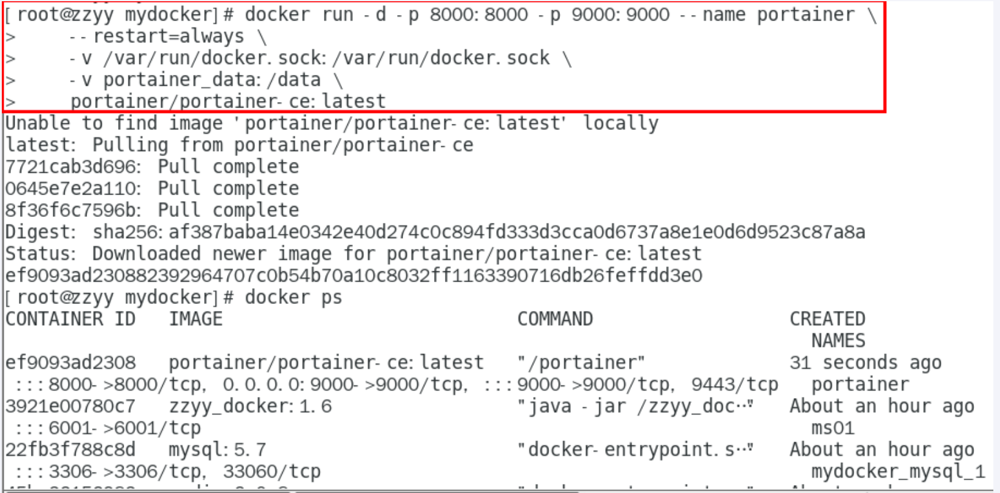
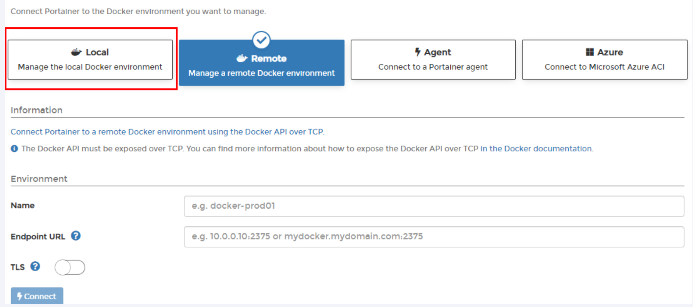
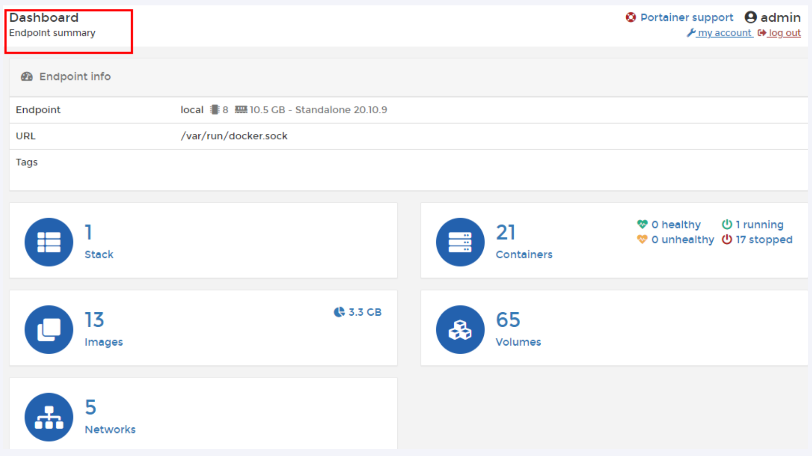
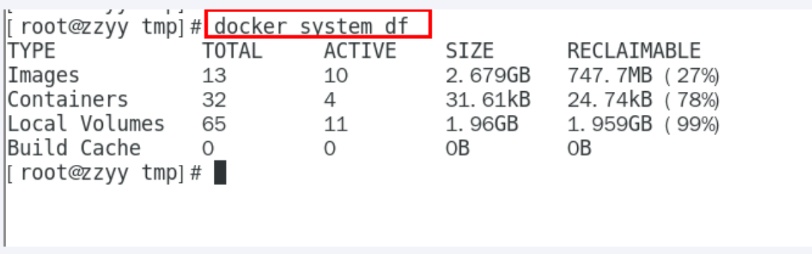

---
# 当前页面内容标题
title: 六、Docker轻量级可视化工具Portainer
# 分类
category:
  - docker
# 标签
tag: 
  - docker
  - 云原生开发
  - Devops
sticky: false
# 是否收藏在博客主题的文章列表中，当填入数字时，数字越大，排名越靠前。
star: false
# 是否将该文章添加至文章列表中
article: true
# 是否将该文章添加至时间线中
timeline: true
---

## 一、是什么

Portainer 是一款轻量级的应用，它提供了图形化界面，用于方便地管理Docker环境，包括单机环境和集群环境。

## 二、安装

[官网](https://www.portainer.io/)

[Portainer文档]([Welcome - Portainer Documentation](https://docs.portainer.io/))

[Install Portainer CE with Docker on Linux - Portainer Documentation](https://docs.portainer.io/start/install-ce/server/docker/linux)

---

步骤

1.docker命令安装

```shell
docker run -d -p 8000:8000 -p 9000:9000 --name portainer     --restart=always     -v /var/run/docker.sock:/var/run/docker.sock     -v portainer_data:/data     portainer/portainer
```



2.第一次登录需要创建admin，访问地址：xxx.xxx.xxx.xxx:9090

| 用户名，直接用默认admin |
| ----------------------- |
| 密码记得8位，随便你写   |


3.设置admin用户和密码后首次登录



4.选择local选项卡后本地docker详细信息展示



5.上一步的图像展示，能想得起对应命令吗？



## 三、登录并演示介绍常用case

略。。。。。。