---
# 当前页面内容标题
title: 七、Docker容器监控之CAdvisor+InfluxDB+Granfana
# 分类
category:
  - docker
# 标签
tag: 
  - docker
  - 云原生开发
  - Devops
sticky: false
# 是否收藏在博客主题的文章列表中，当填入数字时，数字越大，排名越靠前。
star: false
# 是否将该文章添加至文章列表中
article: true
# 是否将该文章添加至时间线中
timeline: true
---

## 一、原生命令

>   **操作**

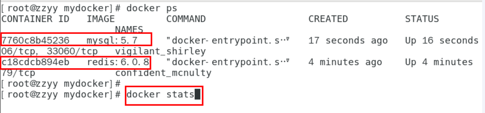

**docker stats命令的结果**

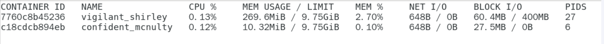

>   **问题**

通过docker stats命令可以很方便的看到当前宿主机上所有容器的CPU,内存以及网络流量等数据，**一般小公司够用了。。。。**

 但是，docker stats统计结果只能是当前宿主机的全部容器，数据资料是实时的，没有地方存储、没有健康指标过线预警等功能

## 二、是什么

**容器监控三剑客**

一句话：CAdvisor监控收集+InfluxDB存储数据+Granfana展示图标


**CAdvisor**


**InfluxDB**

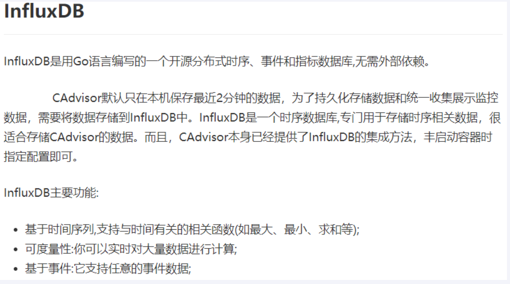

**Granfana**

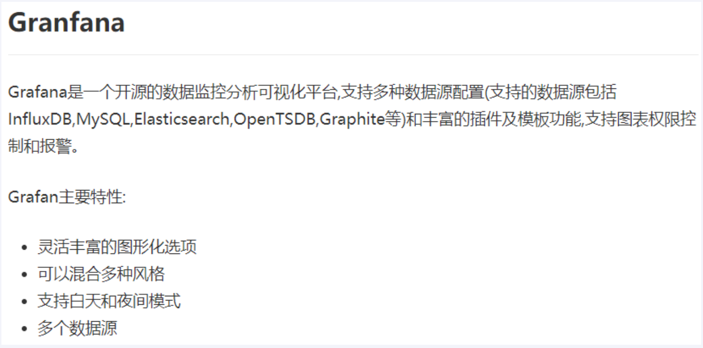

**总结**


## 三、compose容器编排，一套带走

1.新建目录

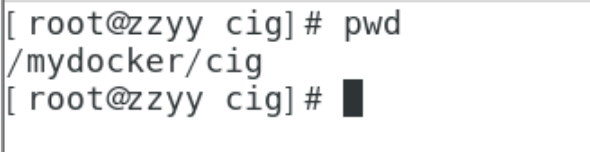

2.新建3件套组合的docker-compose.yml文件

```yml
version: '3.1'
 
volumes:
  grafana_data: {}

services:
 influxdb:
  image: tutum/influxdb:0.9
  restart: always
  environment:
    - PRE_CREATE_DB=cadvisor

  ports:
    - "8083:8083"
    - "8086:8086"

  volumes:
    - ./data/influxdb:/data

 cadvisor:
  image: google/cadvisor
  links:
    - influxdb:influxsrv
  command: -storage_driver=influxdb -storage_driver_db=cadvisor -storage_driver_host=influxsrv:8086
  restart: always
  ports:
    - "8080:8080"
  volumes:
    - /:/rootfs:ro
    - /var/run:/var/run:rw
    - /sys:/sys:ro
    - /var/lib/docker/:/var/lib/docker:ro

 grafana:
  user: "104"
  image: grafana/grafana
  user: "104"
  restart: always
  links:
    - influxdb:influxsrv
  ports:
    - "3000:3000"
  volumes:
    - grafana_data:/var/lib/grafana
  environment:
    - HTTP_USER=admin
    - HTTP_PASS=admin
    - INFLUXDB_HOST=influxsrv
    - INFLUXDB_PORT=8086
    - INFLUXDB_NAME=cadvisor
    - INFLUXDB_USER=root
    - INFLUXDB_PASS=root
```

3.启动docker-compose文件

```shell
docker-compose up
```

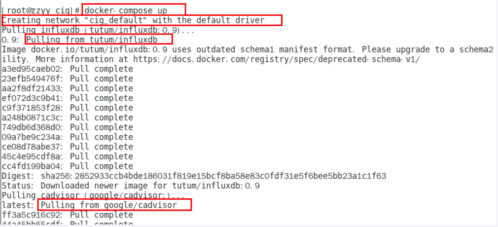

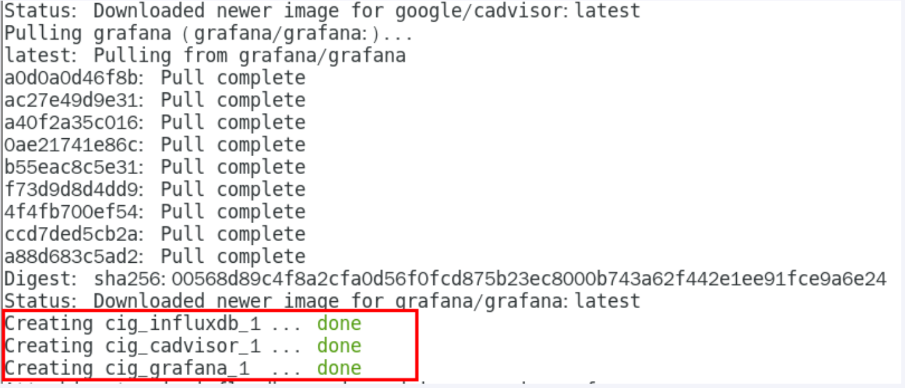

4.查看三个服务容器是否启动

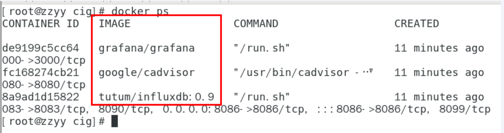

5.测试

>   浏览CAdvisor`收集`服务，http://ip:8080/

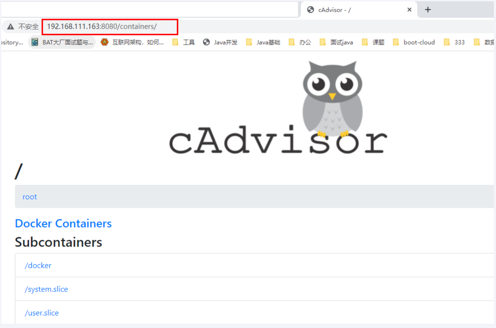

-   第一次访问慢，请稍等
-   cadvisor也有基础的图行展示功能，这里主要用它来做数据采集

>   浏览Influxdb`存储`功能，http://ip:8083/

>   浏览grafana`展现`功能，http://ip:3000

ip+3000端口的方式访问，默认账户密码（admin/admin）

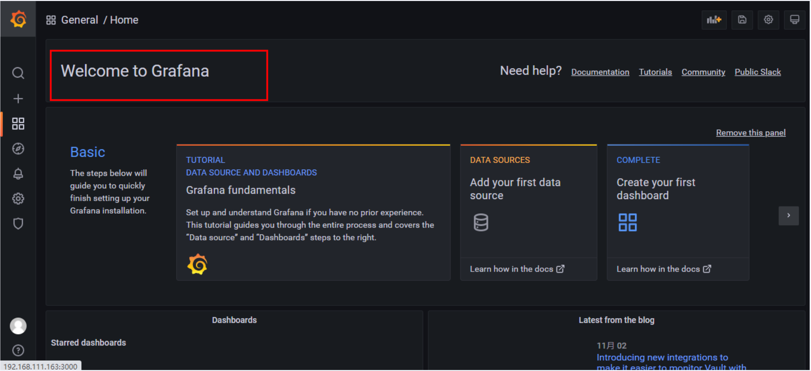

**配置步骤**

1.   配置数据源

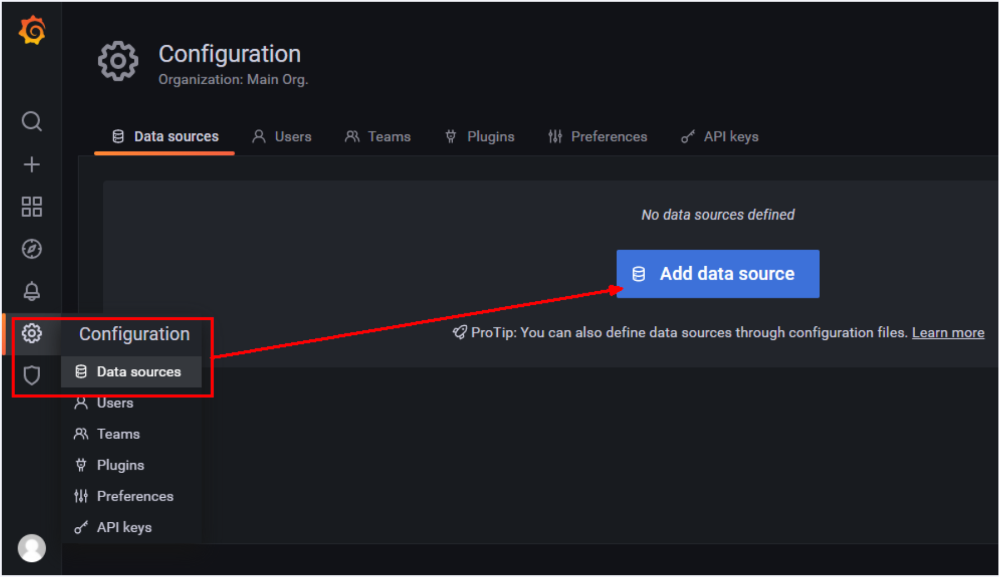

2.   选择Influxdb数据源

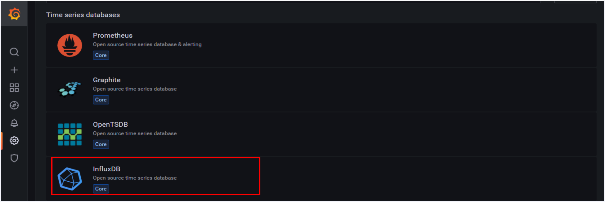

3.   配置细节

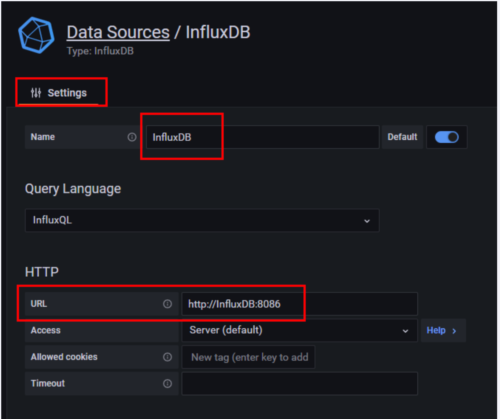

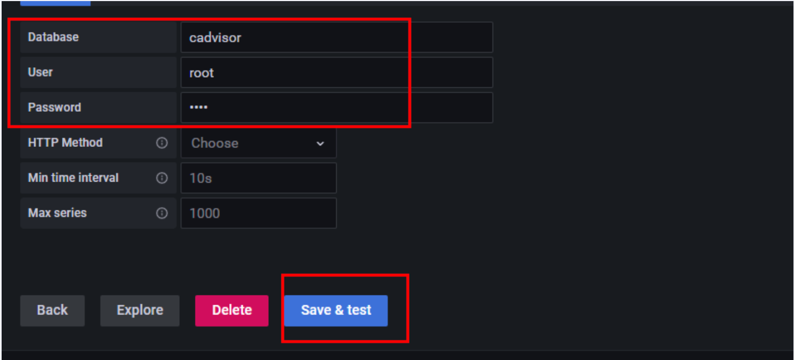

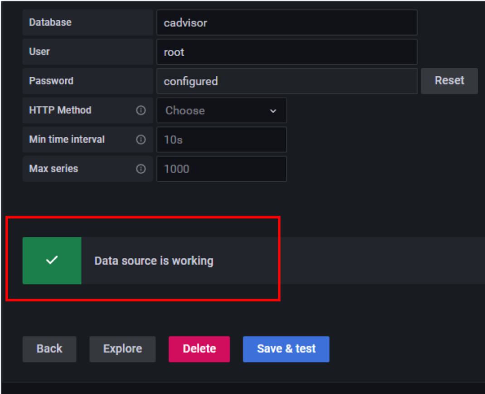

4.   配置面板panel

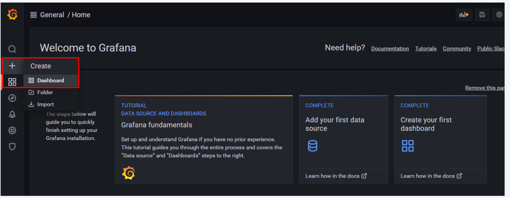

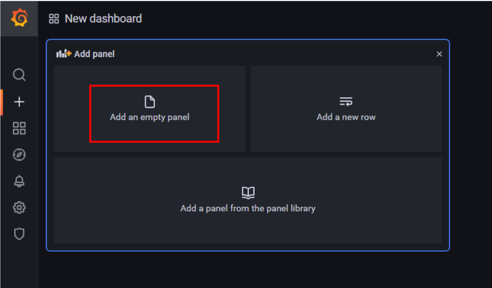

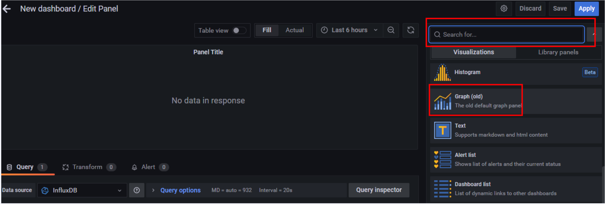

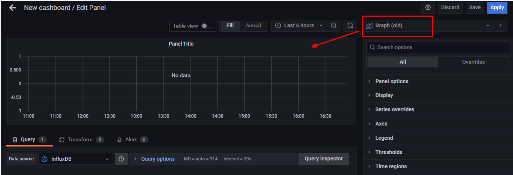

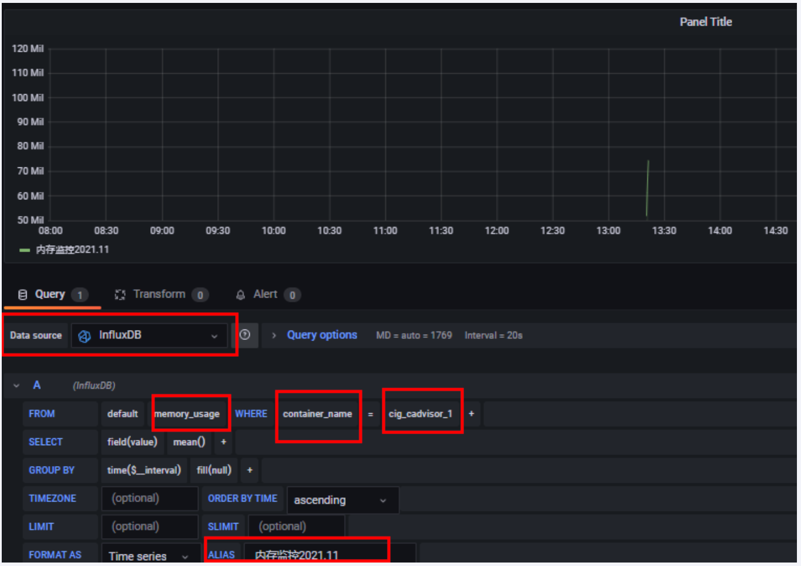

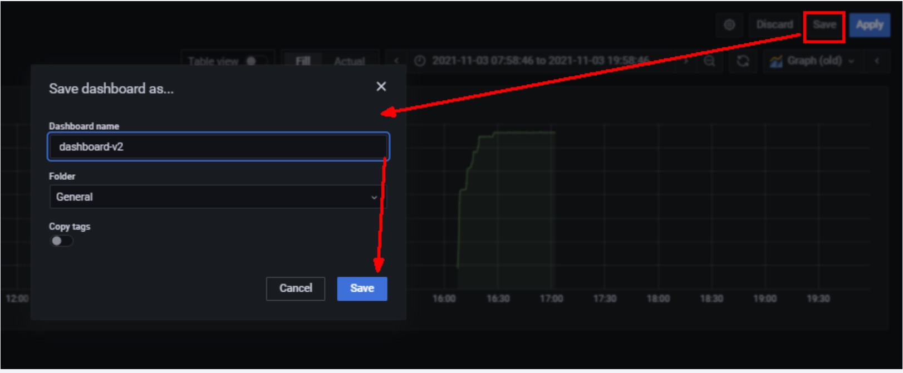

到这里CAdvisor+Influxdb+Grafana容器监控系统部署完成了