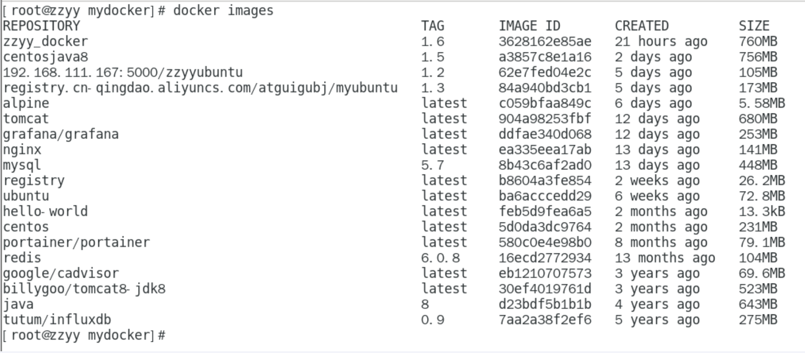
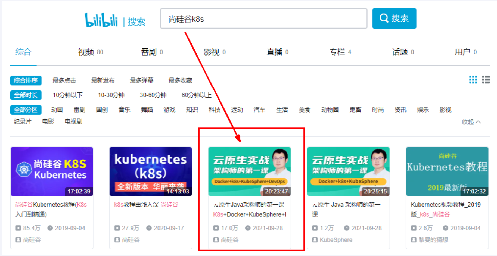

---
# 当前页面内容标题
title: 八、终章の总结
# 分类
category:
  - docker
# 标签
tag: 
  - docker
  - 云原生开发
  - Devops
sticky: false
# 是否收藏在博客主题的文章列表中，当填入数字时，数字越大，排名越靠前。
star: false
# 是否将该文章添加至文章列表中
article: true
# 是否将该文章添加至时间线中
timeline: true
---

## 一、知识回顾简单串讲和总结

## 二、进阶篇：雷丰阳老师的K8S

