---
# 当前页面内容标题
title: 三、Docker常用命令
# 分类
category:
  - docker
# 标签
tag: 
  - docker
  - 云原生开发
  - Devops
sticky: false
# 是否收藏在博客主题的文章列表中，当填入数字时，数字越大，排名越靠前。
star: false
# 是否将该文章添加至文章列表中
article: true
# 是否将该文章添加至时间线中
timeline: true
---

## 一、帮助启动类命令

```shell
# 启动docker
systemctl start docker
# 停止docker
systemctl stop docker
# 重启docker
systemctl restart docker
# 查看docker状态
systemctl status docker
# 开机启动
systemctl enable docker
# 查看docker概要信息
docker info
# 查看docker总体帮助文档
docker --help
# 查看doker命令帮助文档
docker 具体命令 --help
```

## 二、Docker镜像命令

```shell
# 列出本地主机上的镜像
docker ./images 
```

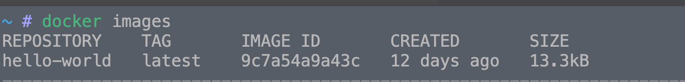

各个选项说明:

- REPOSITORY：表示镜像的仓库源

- TAG：镜像的标签版本号

- IMAGE ID：镜像ID

- CREATED：镜像创建时间

- SIZE：镜像大小

 同一仓库源可以有多个 TAG版本，代表这个仓库源的不同个版本，我们使用 REPOSITORY:TAG 来定义不同的镜像。

如果你不指定一个镜像的版本标签，例如你只使用 ubuntu，docker 将默认使用 ubuntu:latest 镜像

> OPTIONS说明：
---
# 当前页面内容标题
title: 
# 分类
category:
  - docker
# 标签
tag: 
  - docker
  - 云原生开发
  - Devops
sticky: false
# 是否收藏在博客主题的文章列表中，当填入数字时，数字越大，排名越靠前。
star: false
# 是否将该文章添加至文章列表中
article: true
# 是否将该文章添加至时间线中
timeline: true
---

> 
> -a：列出本地所有的镜像（含历史映像层）
> 
> -q：只显示镜像ID

----

```shell
# 搜索镜像
docker search 某个XXX镜像名字
```

[网站](https://hub.docker.com)

**命令**

```shell
docker search [OPTIONS] 镜像名字
```

案例

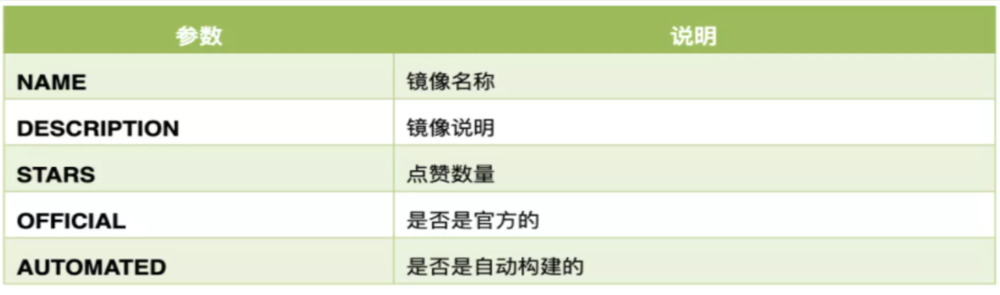

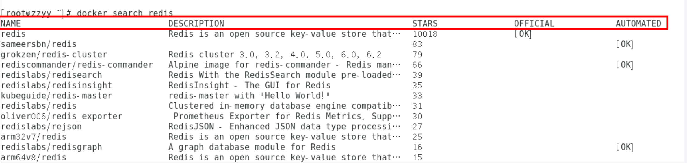

> OPTIONS说明：
> 
> --limit：只列出N个镜像，默认25个
> 
> docker search --limit 5 redis

---

```shell
# 下载镜像
docker pull 某个XXX镜像名字

# 下载指定版本的镜像
docker pull 镜像名字[:TAG]
```

```shell
docker pull 镜像名字
```

没有TAG就是最新版<===>等价于 

```shell
docker pull 镜像名字:latest
```

示例：

`docker pull ubuntu`

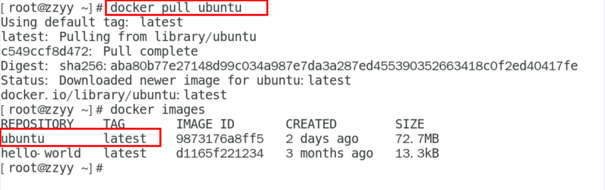

---

```shell
# 查看镜像/容器/数据卷所占的空间
docker system df
```

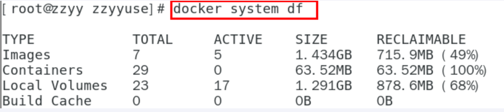

---

```shell
# 删除镜像
docker rmi 某个XXX镜像名字ID
```

```shell
# 删除单个
docker rmi -f 镜像ID
# 删除多个
docker rmi -f 镜像名1:TAG 镜像名2:TAG
# 删除多个
docker rmi -f $(docker ./images -qa)
```

----

> 面试题：谈谈docker虚悬镜像是什么？

**是什么？**

仓库名、标签都是< none >的镜像，俗称虚悬镜像dangling image

**长什么样？**

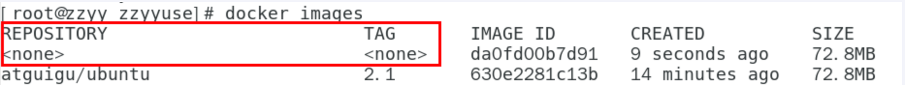

后续DockerFile章节进行介绍……

----

❓**思考**

结合我们Git的学习心得，大家猜猜是否会有docker commit / docker push？？

## 三、容器命令

### 有镜像才能创建容器，这是根本前提（下载一个CentOS或者ubuntu镜像演示）

**说明**

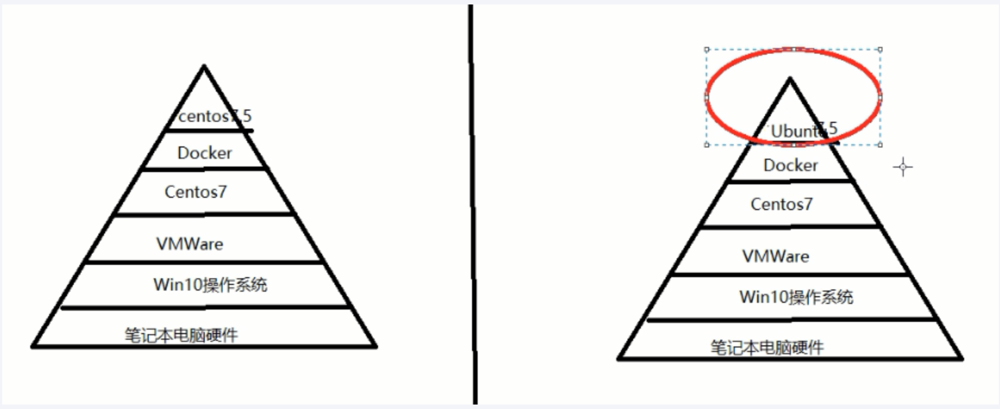

```shell
# 选择自己感兴趣的
docker pull centos
docker pull ubuntu
```

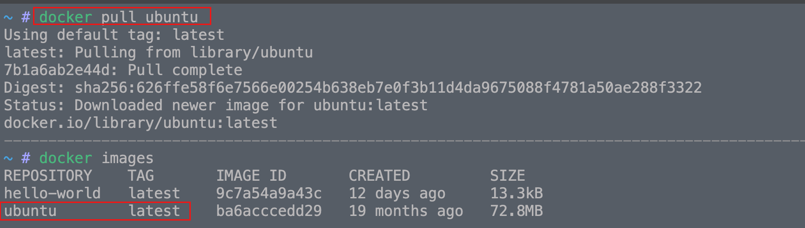

这里使用ubuntu做演示！

### 新建+启动容器

```shell
docker run [OPTIONS] IMAGE [COMMAND] [ARG...]
```

> OPTIONS说明：
> 
> OPTIONS说明（常用）：有些是一个减号，有些是两个减号
> 
> --name="容器新名字"       为容器指定一个名称；
> 
> -d: 后台运行容器并返回容器ID，也即启动守护式容器(后台运行)；
> 
> `-i：以交互模式运行容器，通常与 -t 同时使用；`
> 
> `-t：为容器重新分配一个伪输入终端，通常与 -i 同时使用；`
> 
> 也即`启动交互式容器(前台有伪终端，等待交互)；`
> 
> -P: 随机端口映射，大写P
> 
> -p: 指定端口映射，小写p

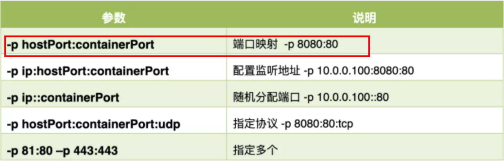

> 启动交互式容器（前台命令行）

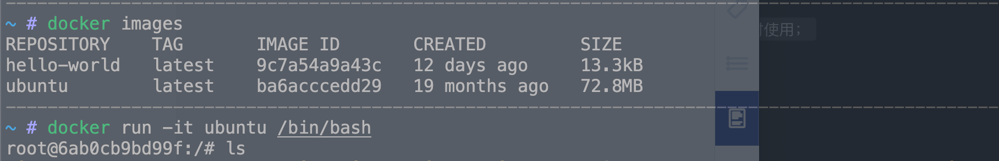

```shell
#使用镜像centos:latest以交互模式启动一个容器,在容器内执行/bin/bash命令。

docker run -it centos /bin/bash
```

> 参数说明：
> 
> -i: 交互式操作。
> 
> -t: 终端。
> 
> centos : centos 镜像。
> 
> /bin/bash：放在镜像名后的是命令，这里我们希望有个交互式 Shell，因此用的是 /bin/bash。
> 
> 要退出终端，直接输入 exit:

### 列出当前所有`正在运行`的容器

```shell
docker ps [OPTIONS]
```

> OPTIONS说明（常用）：
> 
> -a :列出当前所有正在运行的容器+历史上运行过的
> 
> -l :显示最近创建的容器。
> 
> -n：显示最近n个创建的容器。
> 
> -q :静默模式，只显示容器编号。

### 退出容器

两种退出方式

- `exit`：run进去容器，exit退出，容器停止

- `ctrl+p+q`：run进去容器，`ctrl+p+q`退出，容器不停止

### 启动已停止运行的容器

```shell
docker start 容器ID或者容器名
```

### 重启容器

```shell
docker restart 容器ID或者容器名
```

### 停止容器

```shell
docker stop 容器ID或者容器名
```

### 强制停止容器

```shell
docker kill 容器ID或者容器名
```

### 删除已停止的容器

```shell
# 删除已停止的容器
docker rm 容器ID

#一次性删除多个容器示例
docker rm -f $(docker ps -a -q)
docker ps -a -q |xargs docker rm
```

### **⭐️重要**

1.有镜像才能创建容器，这是根本前提（下载一个Redis6.0.8镜像演示）

2.启动守护式容器（后台服务器）

> 在大部分的场景下，我们希望docker的服务是在后台运行的，我们可以通过 `-d`指定容器的后台运行模式。

```shell
docker run -d 容器名

#使用镜像centos:latest以后台模式启动一个容器
docker run -d centos
```

问题：然后`docker ps -a `进行查看, 会发现容器已经退出

很重要的要说明的一点: `Docker容器后台运行,就必须有一个前台进程`.

容器运行的命令如果不是那些`一直挂起的命令`（比如运行top，tail），就是会自动退出的。

这个是docker的机制问题,比如你的web容器,我们以nginx为例，正常情况下,我们配置启动服务只需要启动响应的service即可。例如`service nginx start`

但是,这样做,nginx为后台进程模式运行,就导致docker前台没有运行的应用,这样的容器后台启动后,会立即自杀因为他觉得他没事可做了.

所以，最佳的解决方案是,`将你要运行的程序以前台进程的形式运行，常见就是命令行模式，表示我还有交互操作，别中断，O(∩_∩)O哈哈~`

> redis前后台启动演示case

```shell
# 前台交互式启动
docker run -it redis:6.0.8

# 后台守护式启动
docker run -d redis:6.0.8
```

3.查看容器日志

```shell
docker logs 容器ID
```

4.查看容器内运行的进程

```shell
docker top 容器ID
```

5.查看容器内部细节

```shell
docker inspect 容器ID
```

6.进入正在运行的容器并以命令行交互

```shell
docker exec -it 容器ID bashShell
```

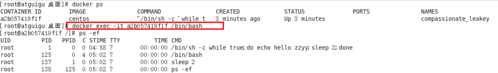

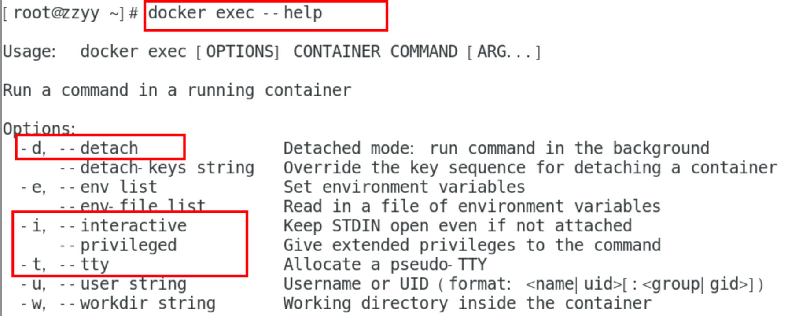

重新进入`docker attach 容器ID`

案例演示，用centos或者ubuntu都可以

上述两个区别

- `attach`直接进入容器启动命令的终端，不会启动新的进程，用`exit`退出，会导致容器的停止

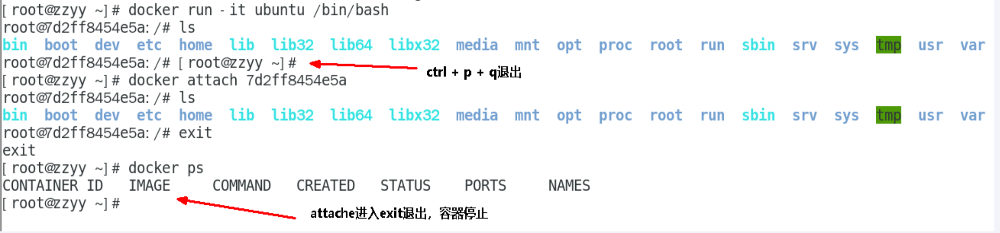

- `exec`是在容器内打开新的终端，并且可以启动新的进程，用`exit`退出，不会导致容器的停止。

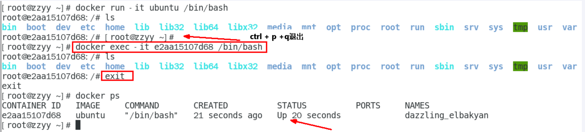

推荐大家使用docker exec命令，因为退出容器终端，不会导致容器的停止。

用之前的redis容器示例进入试试，进入redis

```shell
docker exec -it 容器ID /bin/bash
docker exec -it 容器ID redis-cli
```

一般用`-d`后台启动的程序，再用`exec`进入对应容器示例

7.从容器内拷贝文件到主机上

```shell
# 容器--->主机
docker cp 容器ID:容器内路径 目的主机路径
```

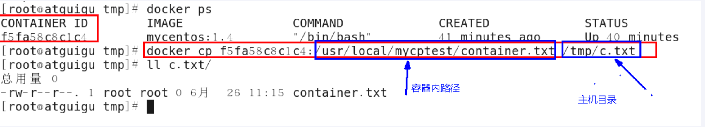

公式：docker cp  容器ID:容器内路径 目的主机路径

8.导入和导出容器

- export 导出容器的内容作为一个tar归档文件[对应import命令]

- import 从tar包中的内容创建一个新的文件系统再导入为镜像【对应export】

- 案例

```shell
docker export 容器ID > 文件名.tar
```

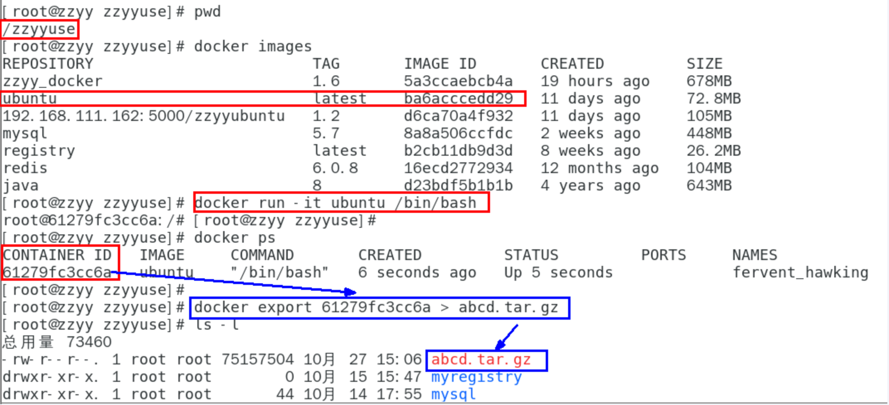

```shell
cat 文件名.tar | docker import -镜像用户/镜像名:镜像版本号
```

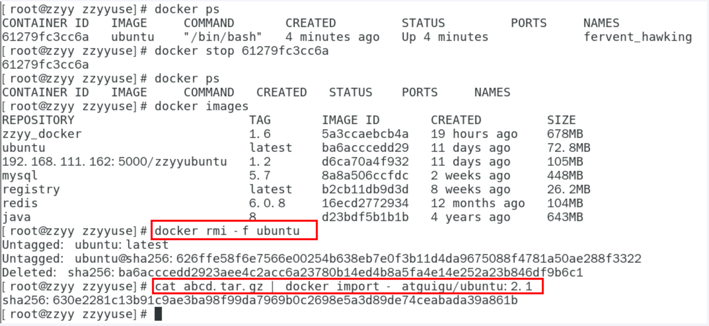

## 四、小总结

`常用命令`

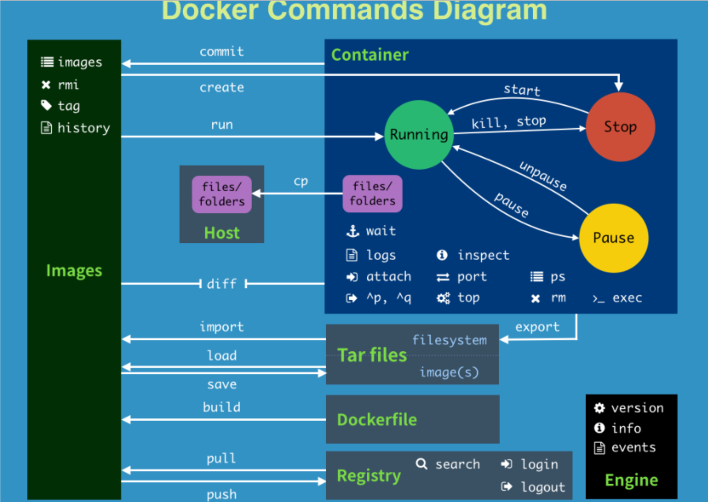

```shell
attach    Attach to a running container                 # 当前 shell 下 attach 连接指定运行镜像

build     Build an image from a Dockerfile              # 通过 Dockerfile 定制镜像

commit    Create a new image from a container changes   # 提交当前容器为新的镜像

cp        Copy files/folders from the containers filesystem to the host path   #从容器中拷贝指定文件或者目录到宿主机中

create    Create a new container                        # 创建一个新的容器，同 run，但不启动容器

diff      Inspect changes on a container's filesystem   # 查看 docker 容器变化

events    Get real time events from the server          # 从 docker 服务获取容器实时事件

exec      Run a command in an existing container        # 在已存在的容器上运行命令

export    Stream the contents of a container as a tar archive   # 导出容器的内容流作为一个 tar 归档文件[对应 import ]

history   Show the history of an image                  # 展示一个镜像形成历史

./images    List ./images                                   # 列出系统当前镜像

import    Create a new filesystem image from the contents of a tarball # 从tar包中的内容创建一个新的文件系统映像[对应export]

info      Display system-wide information               # 显示系统相关信息

inspect   Return low-level information on a container   # 查看容器详细信息

kill      Kill a running container                      # kill 指定 docker 容器

load      Load an image from a tar archive              # 从一个 tar 包中加载一个镜像[对应 save]

login     Register or Login to the docker registry server    # 注册或者登陆一个 docker 源服务器

logout    Log out from a Docker registry server          # 从当前 Docker registry 退出

logs      Fetch the logs of a container                 # 输出当前容器日志信息

port      Lookup the public-facing port which is NAT-ed to PRIVATE_PORT    # 查看映射端口对应的容器内部源端口

pause     Pause all processes within a container        # 暂停容器

ps        List containers                               # 列出容器列表

pull      Pull an image or a repository from the docker registry server   # 从docker镜像源服务器拉取指定镜像或者库镜像

push      Push an image or a repository to the docker registry server    # 推送指定镜像或者库镜像至docker源服务器

restart   Restart a running container                   # 重启运行的容器

rm        Remove one or more containers                 # 移除一个或者多个容器

rmi       Remove one or more ./images       # 移除一个或多个镜像[无容器使用该镜像才可删除，否则需删除相关容器才可继续或 -f 强制删除]

run       Run a command in a new container              # 创建一个新的容器并运行一个命令

save      Save an image to a tar archive                # 保存一个镜像为一个 tar 包[对应 load]

search    Search for an image on the Docker Hub         # 在 docker hub 中搜索镜像

start     Start a stopped containers                    # 启动容器

stop      Stop a running containers                     # 停止容器

tag       Tag an image into a repository                # 给源中镜像打标签

top       Lookup the running processes of a container   # 查看容器中运行的进程信息

unpause   Unpause a paused container                    # 取消暂停容器

version   Show the docker version information           # 查看 docker 版本号

wait      Block until a container stops, then print its exit code   # 截取容器停止时的退出状态值
```
