---
# 当前页面内容标题
title: 五、本地镜像发布到阿里云
# 分类
category:
  - docker
# 标签
tag: 
  - docker
  - 云原生开发
  - Devops
sticky: false
# 是否收藏在博客主题的文章列表中，当填入数字时，数字越大，排名越靠前。
star: false
# 是否将该文章添加至文章列表中
article: true
# 是否将该文章添加至时间线中
timeline: true
---

## 一、本地镜像发布到阿里云流程

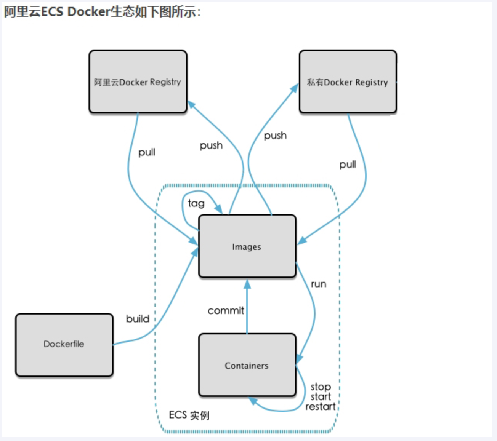

## 二、镜像的生成方法

上一讲已经介绍过

基于当前容器创建一个新的镜像，新功能增强

```shell
docker commit [OPTIONS] 容器ID [REPOSITORY[:TAG]]
```

> OPTIONS说明：
> 
> -a :提交的镜像作者；
> 
> -m :提交时的说明文字；
> 
> 本次案例centos+ubuntu两个，当堂讲解一个，家庭作业一个，请大家务必动手，亲自实操。

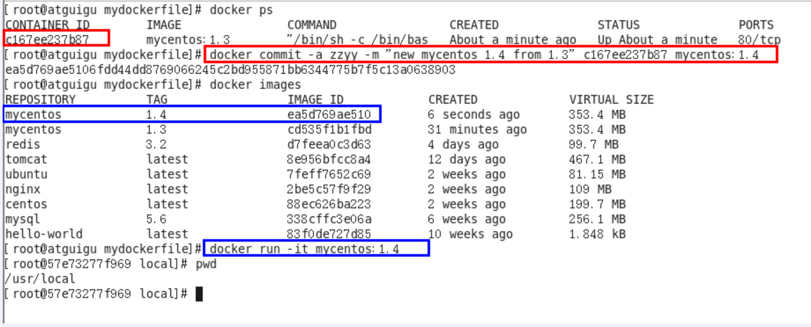

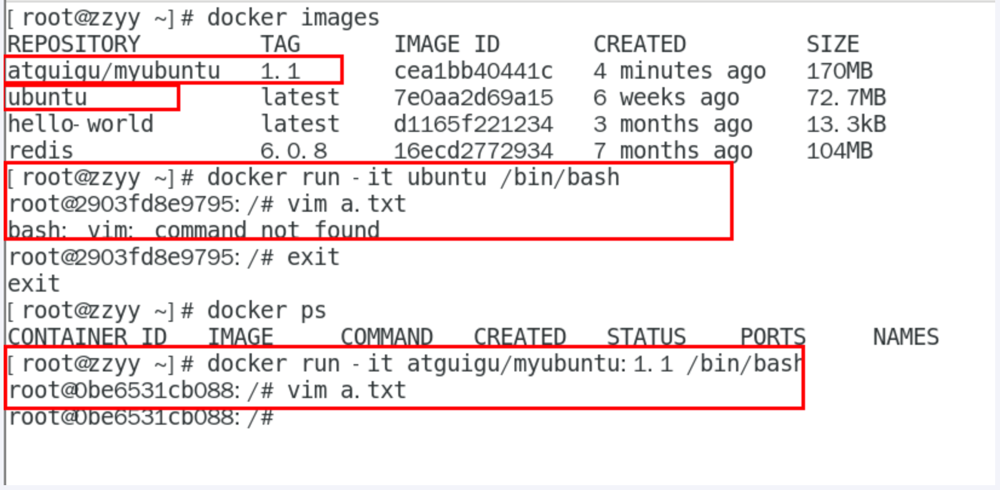

后面DockerFile章节，还有第二种方法！

## 三、将本地镜像推送到阿里云

> 本地镜像素材原型

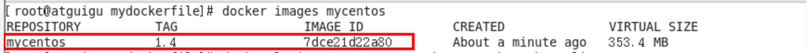


> 阿里云开发者平台

[开放云原生应用-云原生（Cloud Native）-云原生介绍 - 阿里云 (aliyun.com)](https://promotion.aliyun.com/ntms/act/kubernetes.html)

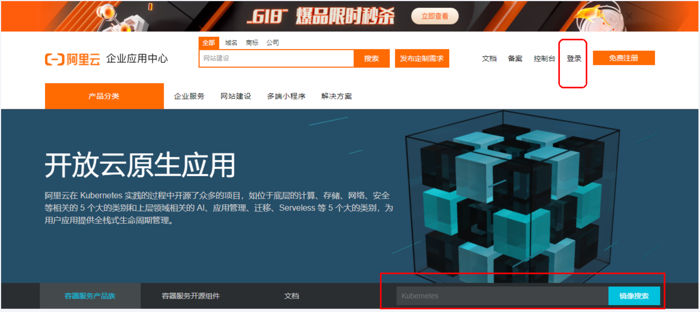

> 创建仓库镜像

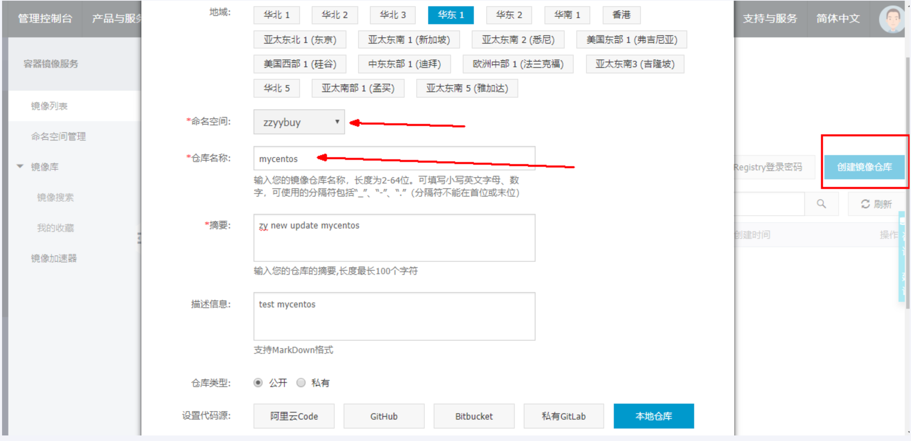

1.选择控制台，进入容器镜像服务

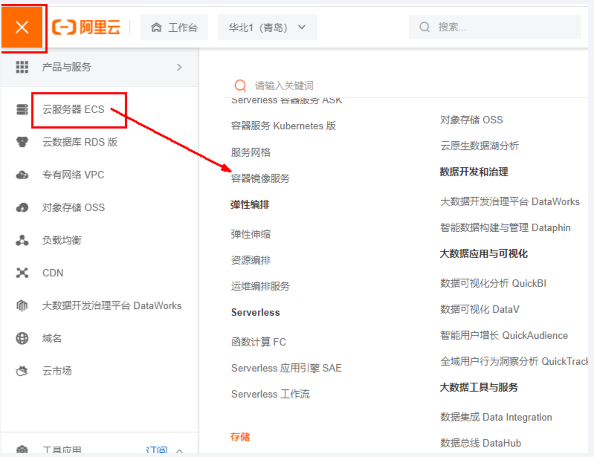

2.选择个人实例

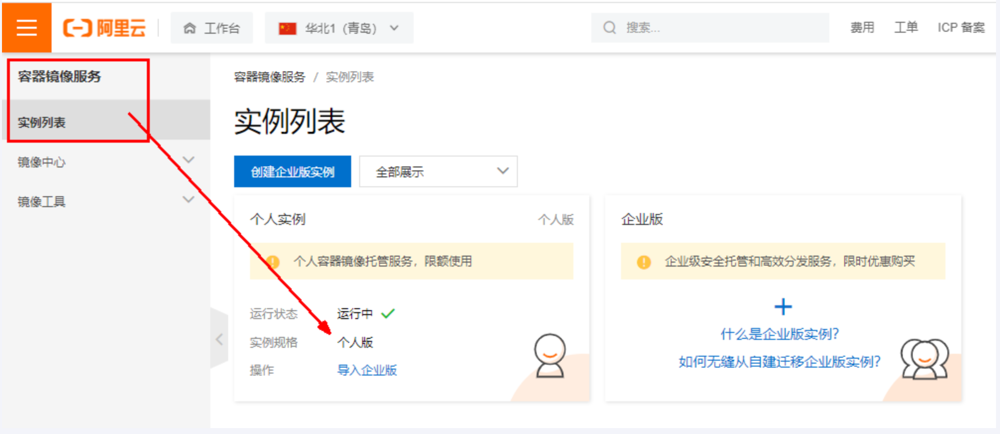

3.命名空间

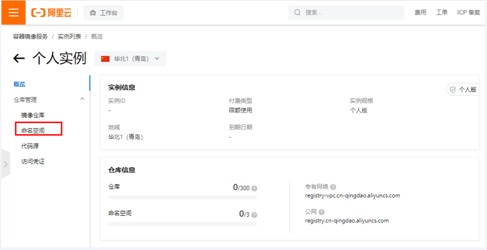

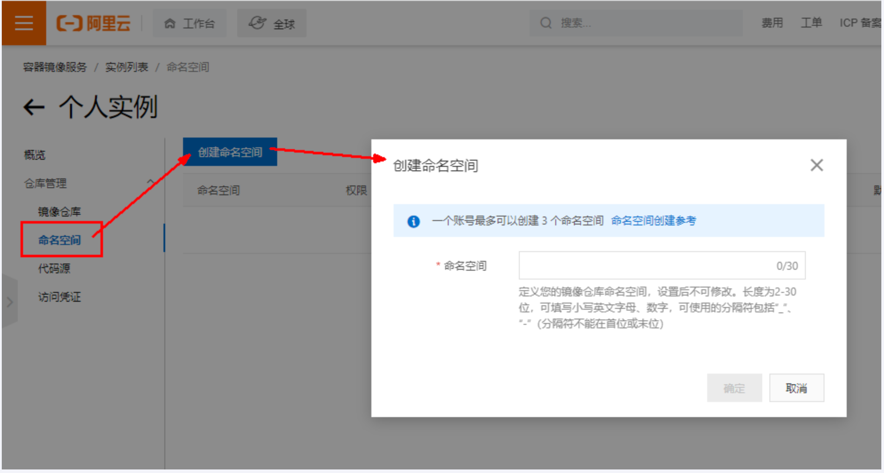

4.仓库名称

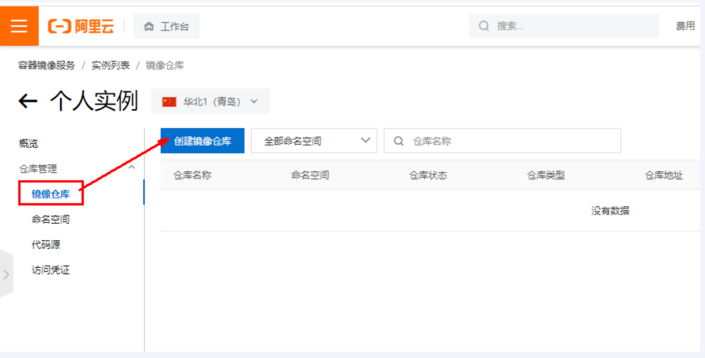

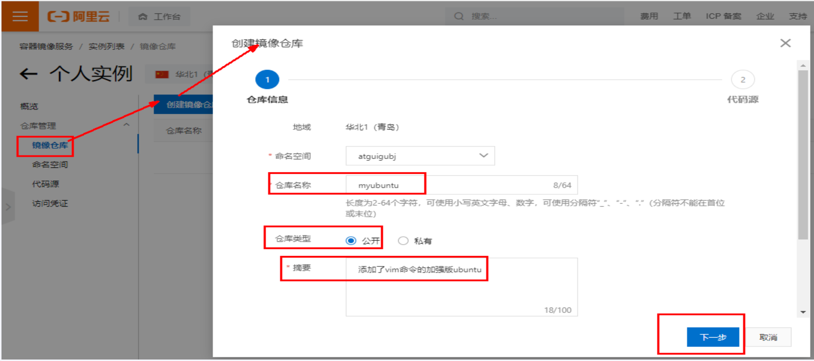

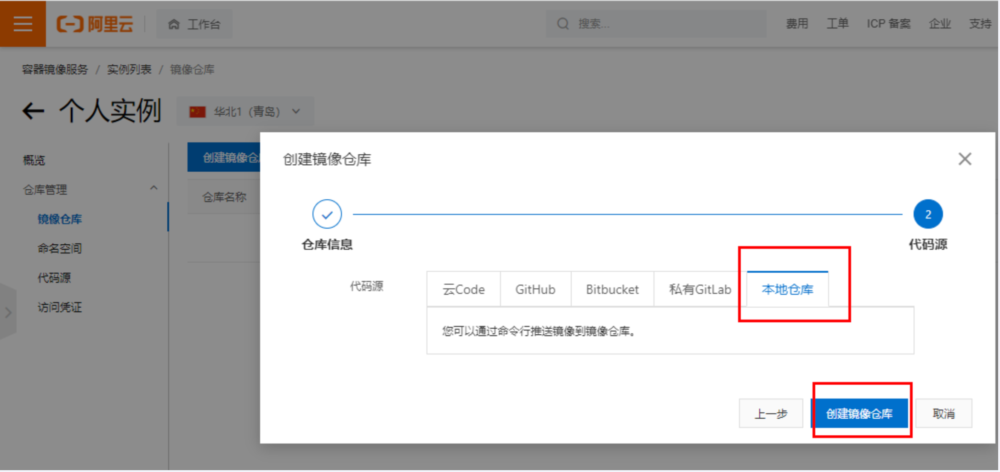

5.进入管理界面获取脚本

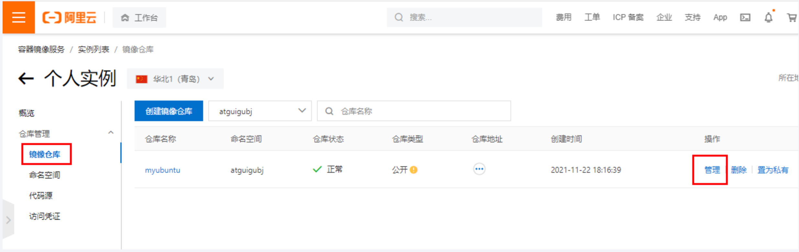

> 将镜像推送到阿里云

将镜像推送到阿里云register

- 管理界面脚本

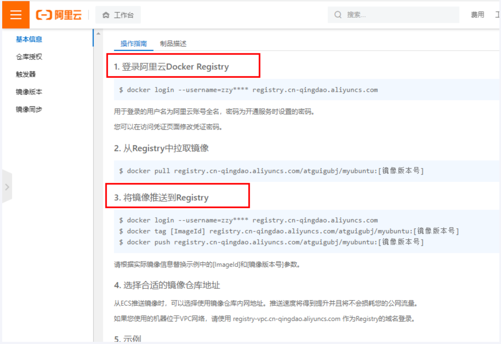

- 脚本实例

| docker login --username=zzyybuy registry.cn-hangzhou.aliyuncs.com                |
| -------------------------------------------------------------------------------- |
| docker tag cea1bb40441c registry.cn-hangzhou.aliyuncs.com/atguiguwh/myubuntu:1.1 |
| docker push registry.cn-hangzhou.aliyuncs.com/atguiguwh/myubuntu:1.1             |
| 上面命令是阳哥自己本地的，你自己酌情处理，不要粘贴我的。                                                     |

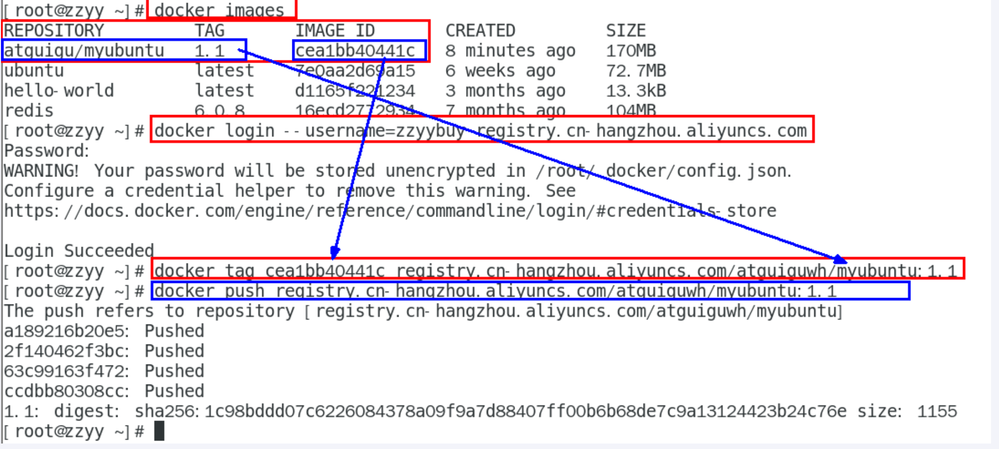

## 四、将阿里云上的镜像下载到本地

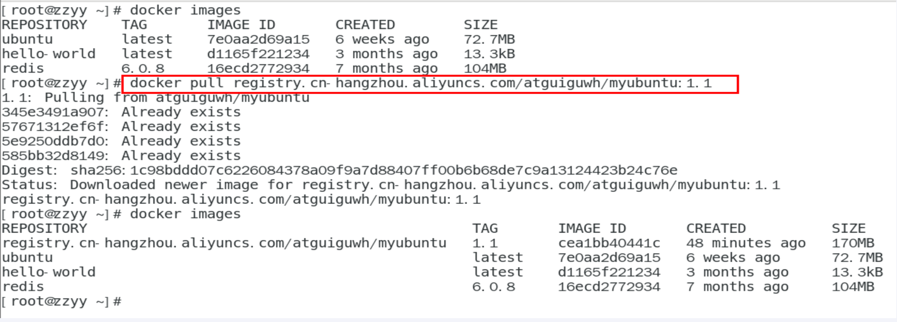

```shell
docker pull registry.cn-hangzhou.aliyuncs.com/atguiguwh/myubuntu:1.1
```


