---
# 当前页面内容标题
title: 六、本地镜像发布到私有库
# 分类
category:
  - docker
# 标签
tag: 
  - docker
  - 云原生开发
  - Devops
sticky: false
# 是否收藏在博客主题的文章列表中，当填入数字时，数字越大，排名越靠前。
star: false
# 是否将该文章添加至文章列表中
article: true
# 是否将该文章添加至时间线中
timeline: true
---

## 一、本地镜像发布到私有库流程

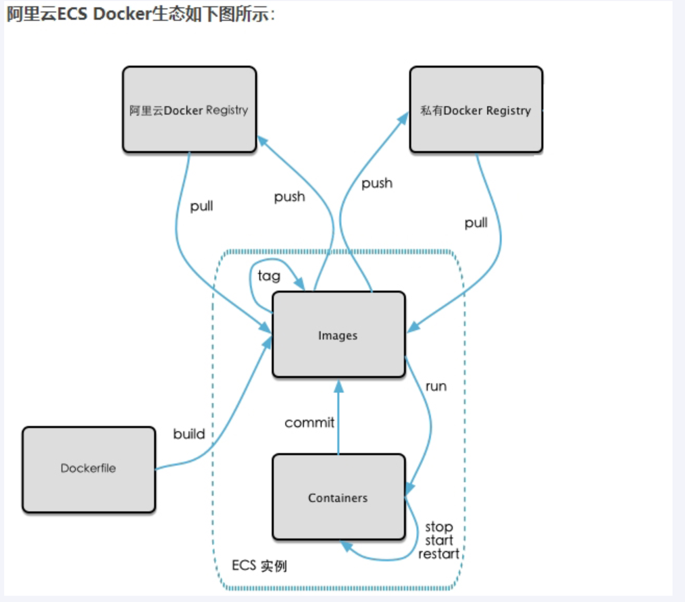

## 二、是什么

> Docker Registry

1 官方Docker Hub地址：https://hub.docker.com/，中国大陆访问太慢了且准备被阿里云取代的趋势，不太主流。

2 Dockerhub、阿里云这样的公共镜像仓库可能不太方便，涉及机密的公司不可能提供镜像给公网，所以需要创建一个本地私人仓库供给团队使用，基于公司内部项目构建镜像。

    Docker Registry是官方提供的工具，可以用于构建私有镜像仓库

## 三、将本地镜像推送到私有库

1. 下载镜像Docker Registry

```shell
docker pull registry 
```

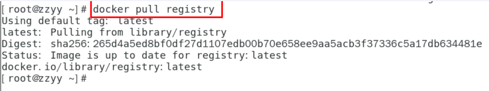

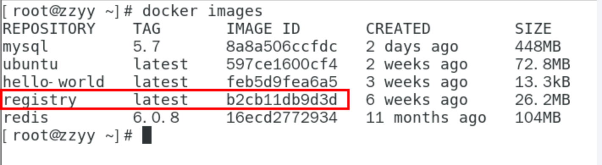

2. 运行私有库Registry，相当与本地有个私有Docker Hub

```shell
docker run -d -p 5000:5000 -v /zzyyuse/myregistry/:/tmp/registry --privileged=true registry
```

默认情况，仓库被创建在容器的/var/lib/registry目录下，建议自行用容器卷映射，方便于宿主机联调

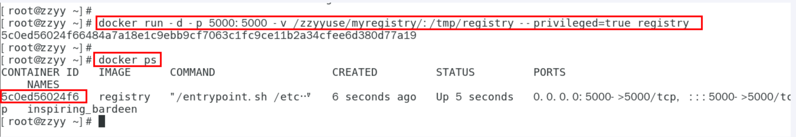

3. 案例演示创建一个新镜像，ubuntu安装ifconfig命令

从Hub上下载ubuntu镜像到本地并成功运行

原始的Ubuntu镜像是不带着ifconfig命令的

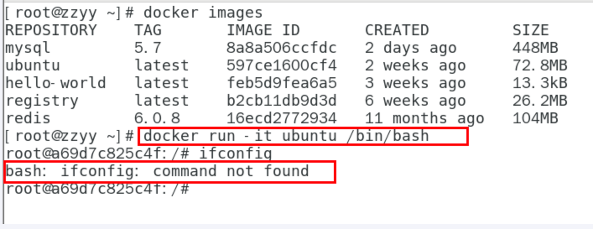

```shell
docker run -it ubuntu /bin/bash
ifconfig
```

外网连通的情况下，安装ifconfig命令并测试通过

```shell
# docker容器内执行上述两条命令：

apt-get update

apt-get install net-tools
```

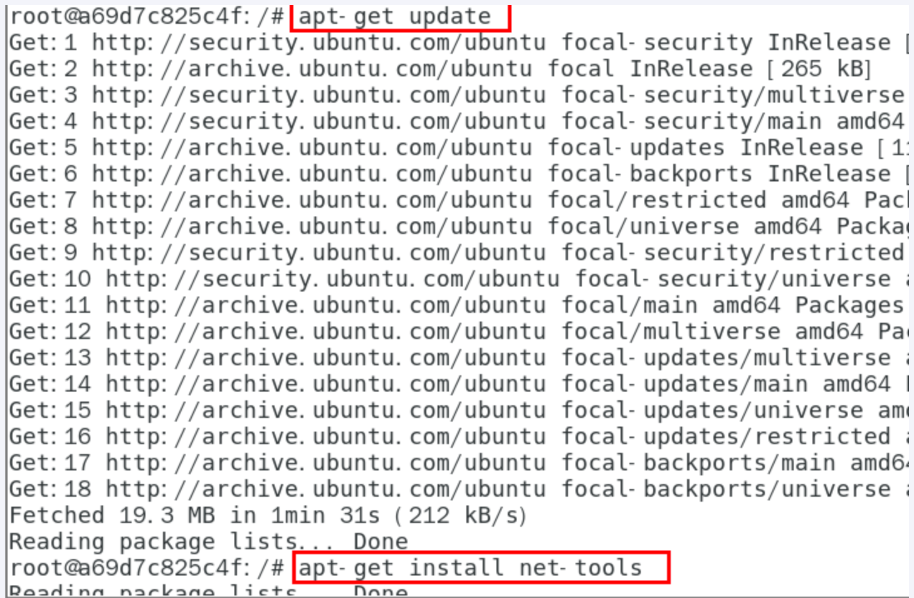

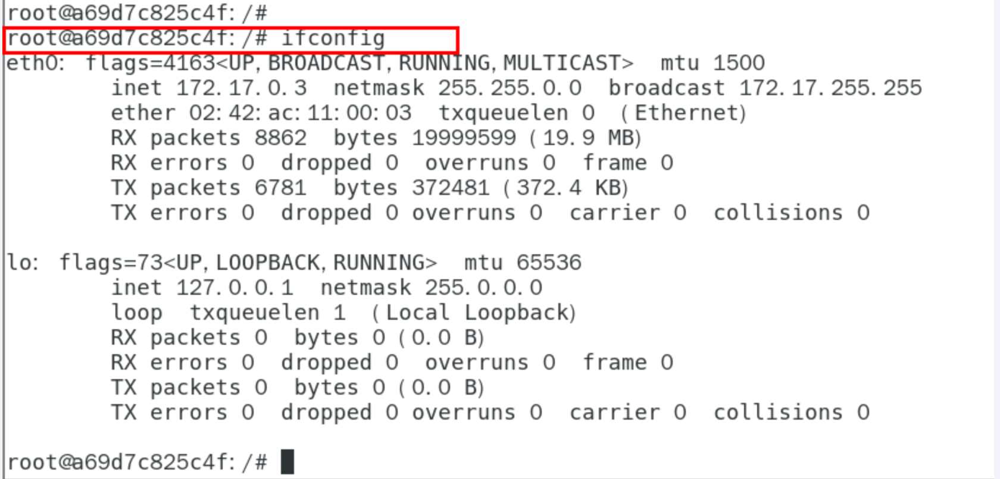


安装完成后，commit我们自己的新镜像

```shell
公式：

docker commit -m="提交的描述信息" -a="作者" 容器ID 要创建的目标镜像名:[标签名]

命令：在容器外执行，记得

docker commit -m="ifconfig cmd add" -a="zzyy" a69d7c825c4f zzyyubuntu:1.2
```

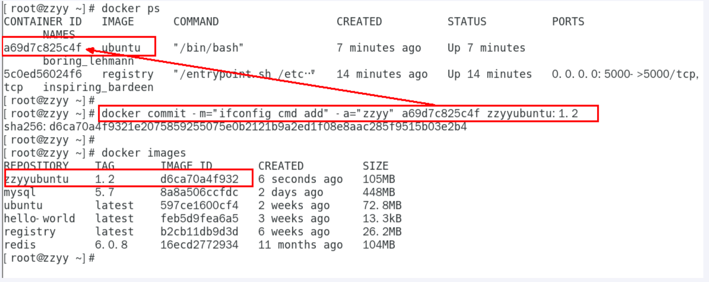

启动我们的新镜像并和原来的对比

1 官网是默认下载的Ubuntu没有ifconfig命令

2我们自己commit构建的新镜像，新增加了ifconfig功能，可以成功使用。

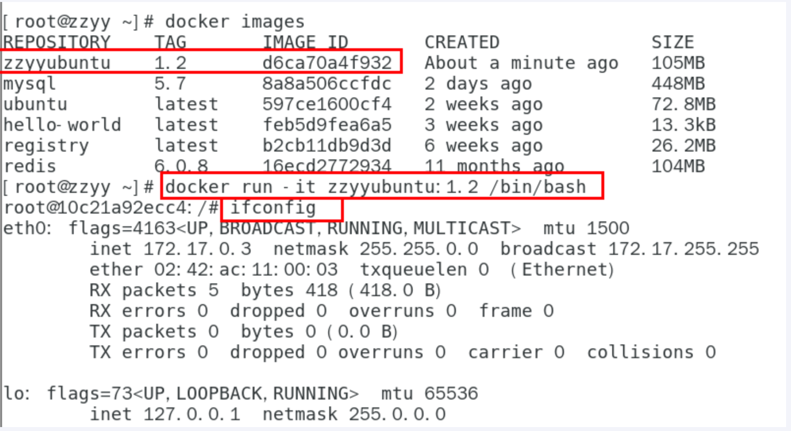

4. curl验证私服库上有什么镜像

```shell
curl -XGET http://192.168.111.162:5000/v2/_catalog
```

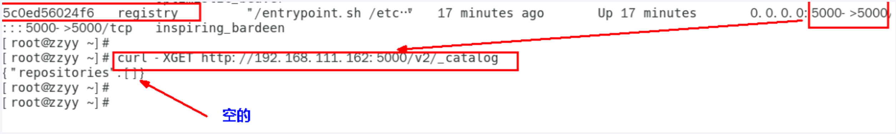

5. 将新镜像zzyyubuntu:1.2修改符合私服规范的Tag

按照公式： docker   tag   镜像:Tag   Host:Port/Repository:Tag

自己host主机IP地址，填写同学你们自己的，不要粘贴错误，O(∩_∩)O

使用命令 docker tag 将zzyyubuntu:1.2 这个镜像修改为192.168.111.162:5000/zzyyubuntu:1.2

```shell
docker tag  zzyyubuntu:1.2  192.168.111.162:5000/zzyyubuntu:1.2
```

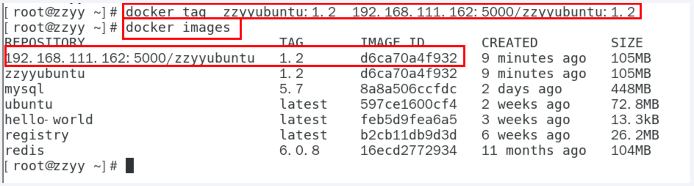

6. 修改配置文件使之支持http

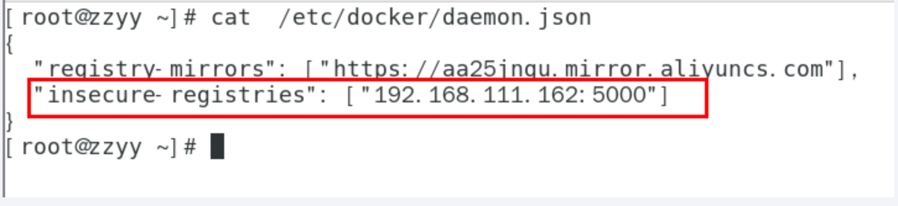

```
别无脑照着复制，registry-mirrors 配置的是国内阿里提供的镜像加速地址，不用加速的话访问官网的会很慢。
2个配置中间有个逗号 ','别漏了，这个配置是json格式的。
2个配置中间有个逗号 ','别漏了，这个配置是json格式的。
2个配置中间有个逗号 ','别漏了，这个配置是json格式的。
```

vim命令新增如下红色内容：vim /etc/docker/daemon.json

```json
{
  "registry-mirrors": ["https://aa25jngu.mirror.aliyuncs.com"],
  "insecure-registries": ["192.168.111.162:5000"]
}
```

上述理由：docker默认不允许http方式推送镜像，通过配置选项来取消这个限制。====> 修改完后如果不生效，建议重启docker

7. push推送到私服库

```shell
docker push 192.168.111.162:5000/zzyyubuntu:1.2
```

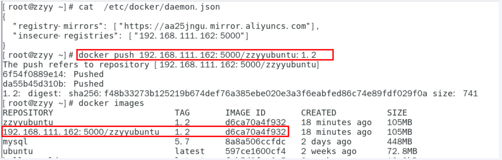

8. curl验证私服库上有什么镜像2

```shell
curl -XGET http://192.168.111.162:5000/v2/_catalog
```

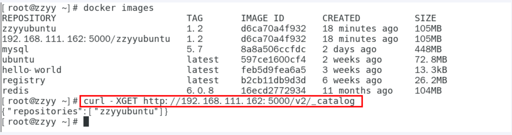

9. pull到本地并运行

```shell
docker pull 192.168.111.162:5000/zzyyubuntu:1.2
```

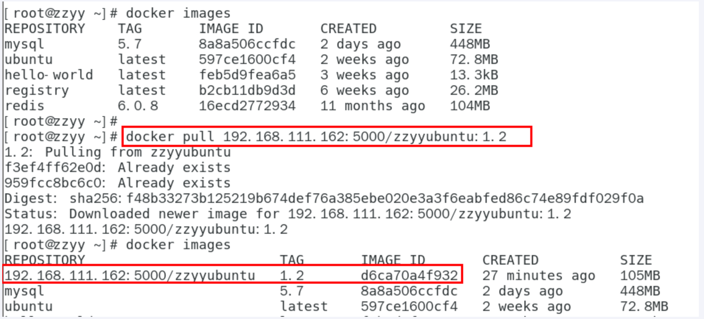

```shell
docker run -it 镜像ID /bin/bash
```

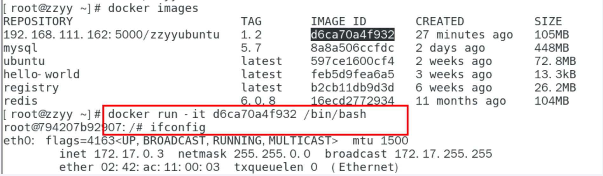
