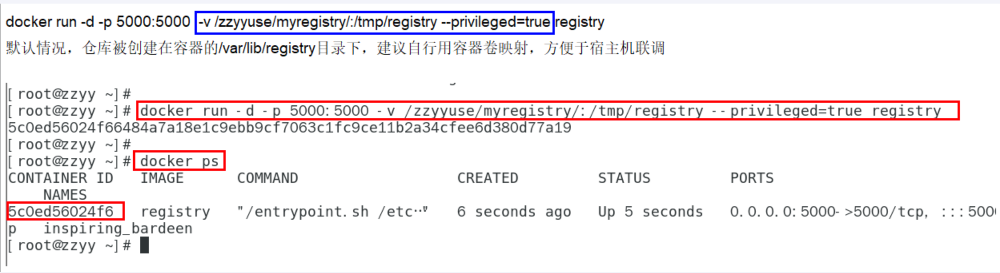
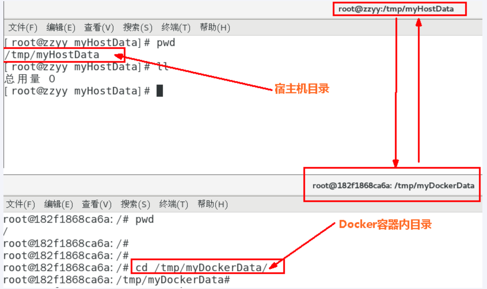
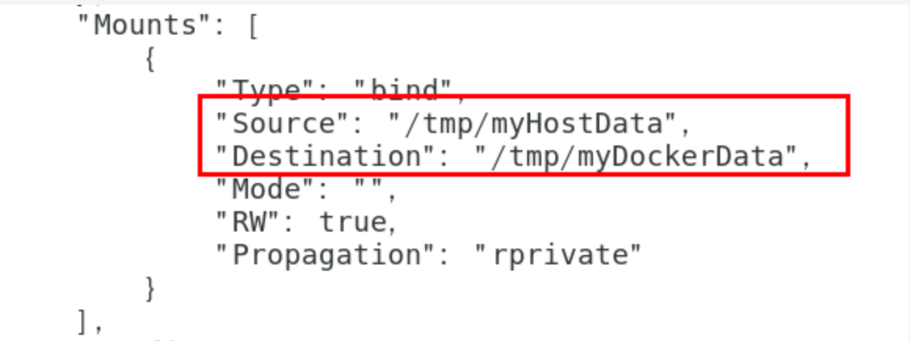
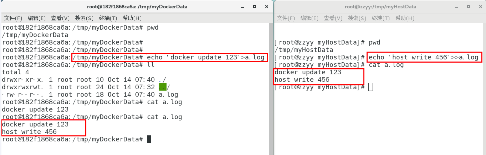
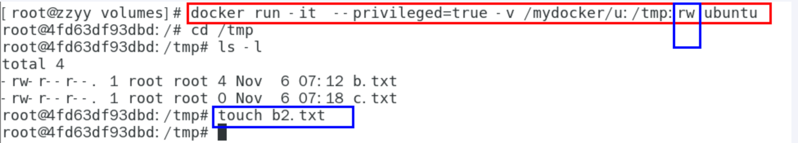
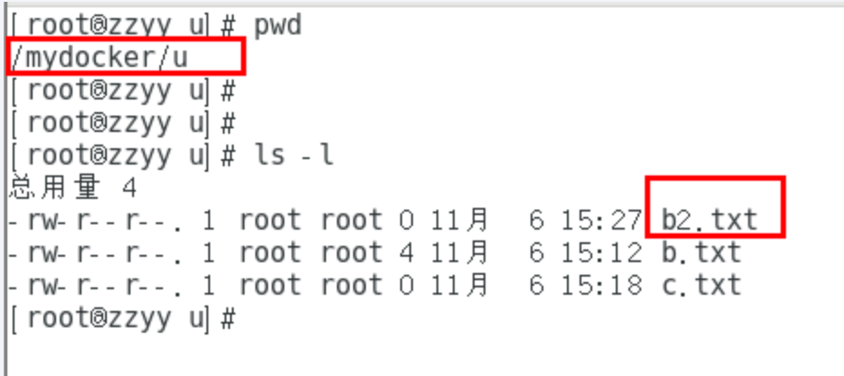
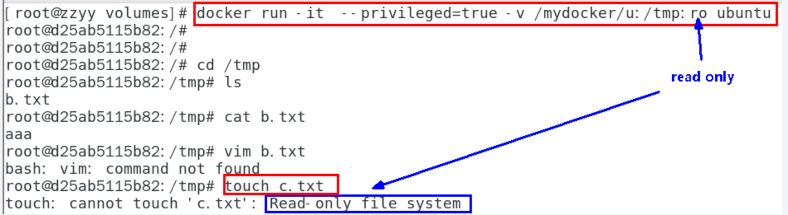
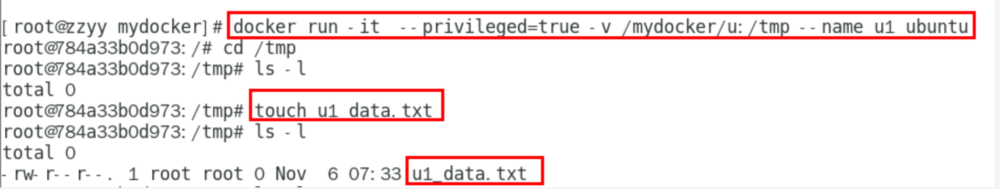
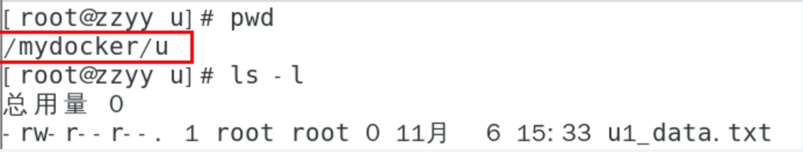
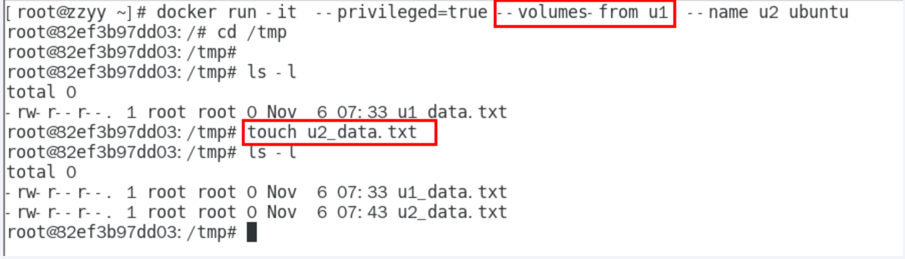

---
# 当前页面内容标题
title: 七、Docker容器数据卷
# 分类
category:
  - docker
# 标签
tag: 
  - docker
  - 云原生开发
  - Devops
sticky: false
# 是否收藏在博客主题的文章列表中，当填入数字时，数字越大，排名越靠前。
star: false
# 是否将该文章添加至文章列表中
article: true
# 是否将该文章添加至时间线中
timeline: true
---

## 一、❌坑：容器卷记得加入

```shell
--privileged=true
```

> why

Docker挂载主机目录访问**如果出现cannot open directory .: Permission denied**

解决办法：在挂载目录后多加一个--privileged=true参数即可

如果是CentOS7安全模块会比之前系统版本加强，不安全的会先禁止，所以目录挂载的情况被默认为不安全的行为，

在SELinux里面挂载目录被禁止掉了额，如果要开启，我们一般使用--privileged=true命令，扩大容器的权限解决挂载目录没有权限的问题，也即

使用该参数，container内的root拥有真正的root权限，否则，container内的root只是外部的一个普通用户权限。

## 二、回顾下上一讲的知识点，参数V

**还记得蓝色框框中的内容吗？**



## 三、是什么

卷就是目录或文件，存在于一个或多个容器中，由docker挂载到容器，但不属于联合文件系统，因此能够绕过Union File System提供一些用于持续存储或共享数据的特性：

卷的设计目的就是`数据的持久化`，完全独立于容器的生存周期，因此Docker不会在容器删除时删除其挂载的数据卷

----

一句话：有点类似我们Redis李米娜的rdb和aof文件，将docker容器内的数据保存进宿主机的磁盘中，运行一个带有容器卷存储功能的容器示例。

```shell
docker run -it --privileged -v /宿主机绝对路径目录:/容器内目录 镜像名
```

## 四、能干嘛

*  将运用与运行的环境打包镜像，run后形成容器实例运行 ，但是我们对数据的要求希望是`持久化的`

Docker容器产生的数据，如果不备份，那么当容器实例删除后，容器内的数据自然也就没有了。

为了能保存数据在docker中我们使用卷。

特点：

1：数据卷可在容器之间共享或重用数据

2：卷中的更改可以直接实时生效，爽

3：数据卷中的更改不会包含在镜像的更新中

4：数据卷的生命周期一直持续到没有容器使用它为止

## 五、数据卷案例

1.宿主vs容器之间映射添加容器卷

> 命令

公式：docker run -it -v /宿主机目录:/容器内目录 ubuntu /bin/bash

```shell
docker run -it --name myu3 --privileged=true -v /tmp/myHostData:/tmp/myDockerData ubuntu /bin/bash
```



```shell
docker run -it --privileged -v /宿主机绝对路径目录:/容器内目录 镜像名
```

> 查看数据卷是否挂载成功

```shell
docker inspect 容器ID
```



> 容器和宿主机之间数据共享

1  docker修改，主机同步获得 

2 主机修改，docker同步获得

3 docker容器stop，主机修改，docker容器重启看数据是否同步。



2.读写规则映射添加说明

> 默认（读写）



 rw = read + write



```shell
docker run -it --privileged -v /宿主机绝对路径目录:/容器内目录 镜像名
```

默认同上案例，默认就是rw

> 只读

容器内部被限制，只能读取不能写



 /容器目录:ro 镜像名               就能完成功能，此时容器自己只能读取不能写  

ro = read only

此时如果宿主机写入内容，可以同步给容器内，容器可以读取到。

```shell
docker run -it --privileged -v /宿主机绝对路径目录:/容器内目录:ro 镜像名
```

3.卷的继承和共享

> 容器1完成和宿主机的映射

```shell
docker run -it  --privileged=true -v /mydocker/u:/tmp --name u1 ubuntu    
```





> 容器2继承容器1的卷规则



```shell
docker run -it --privileged=true --volumes-from 父类 --name u2 ubuntu
```


