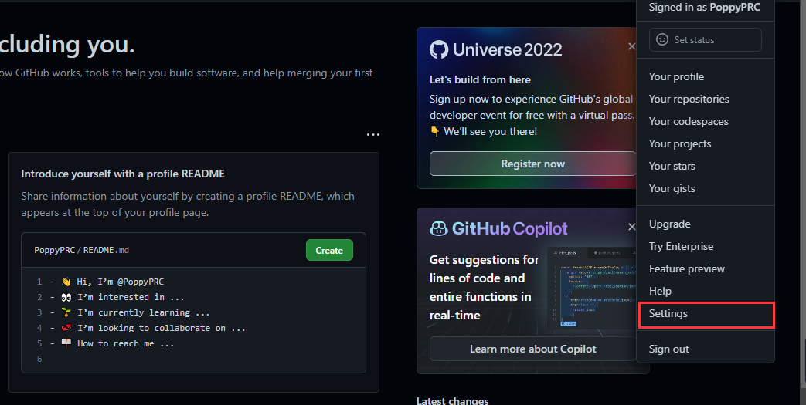
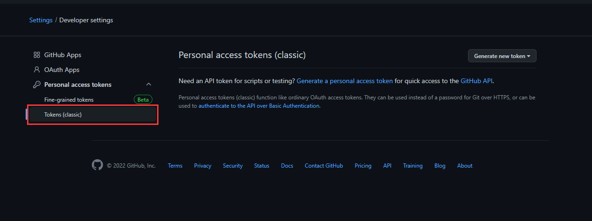
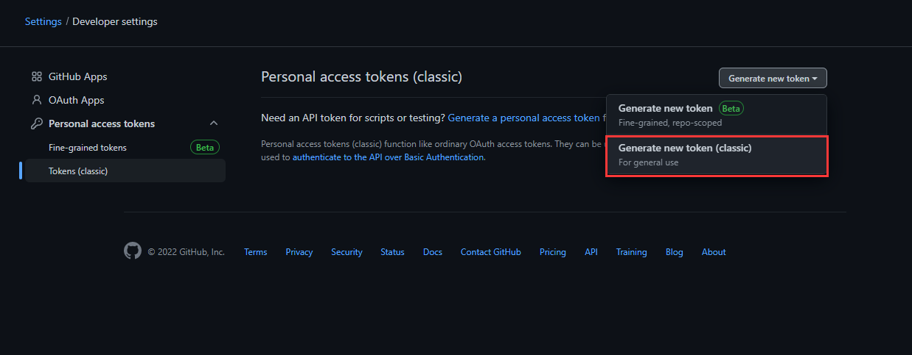
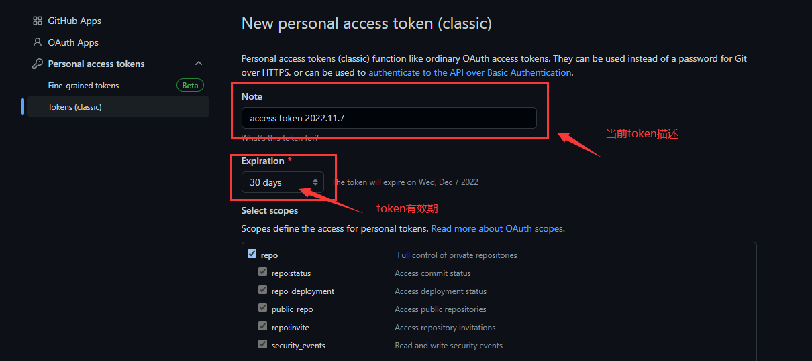
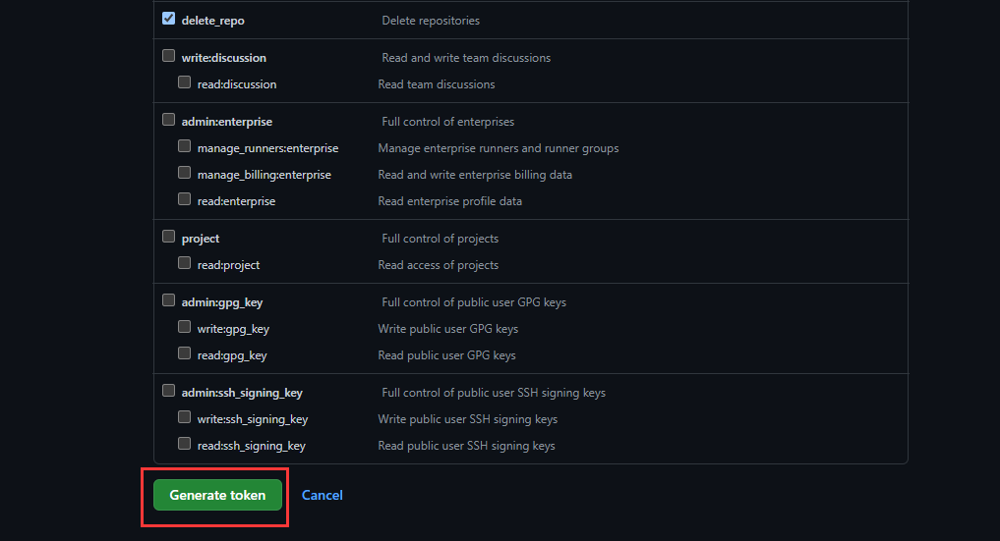
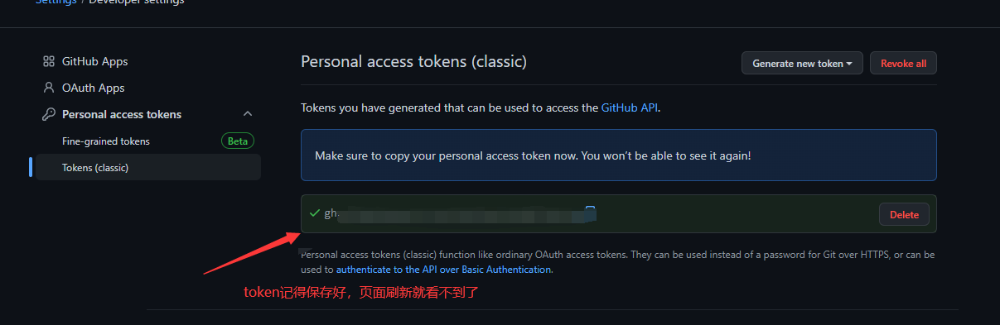
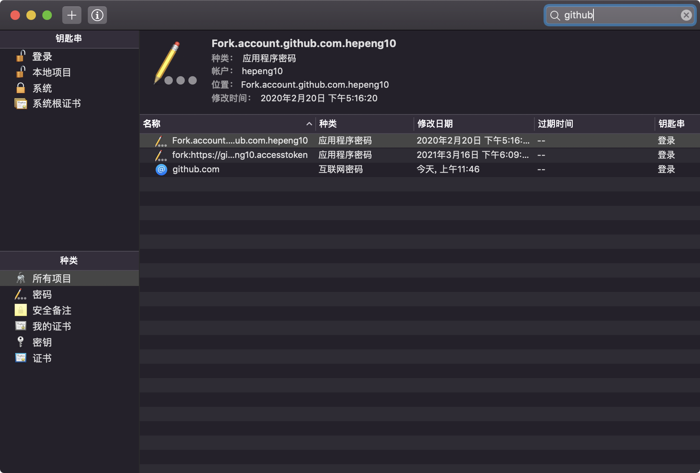
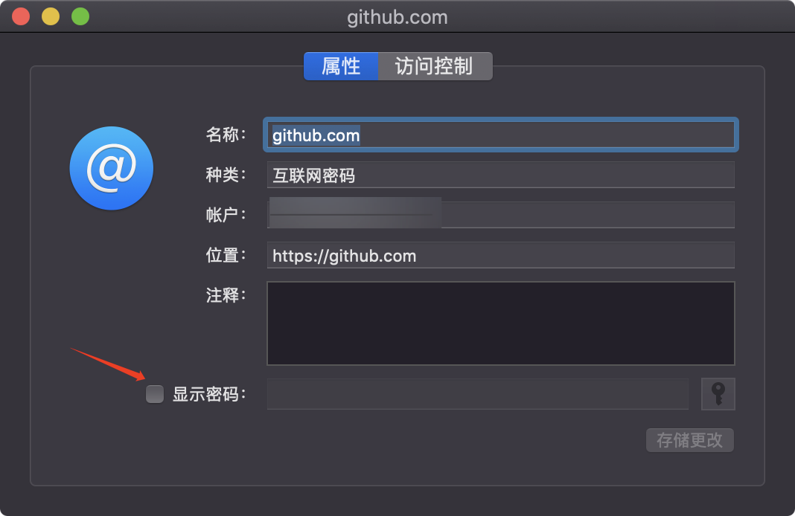

---
# 当前页面内容标题
title: Git系列——github 配置使用 token 认证
# 分类
category:
  - git
# 标签
tag: 
  - git
  - 开发工具
sticky: false
# 是否收藏在博客主题的文章列表中，当填入数字时，数字越大，排名越靠前。
star: false
# 是否将该文章添加至文章列表中
article: true
# 是否将该文章添加至时间线中
timeline: true
---

##  Git系列——github 配置使用 token 认证

官方日志：从 2021 年 8 月 13 日开始，我们将在对 Git 操作进行身份验证时不再接受帐户密码，并将要求使用基于令牌（token）的身份验证。

官方日志网址：https://github.blog/2020-12-15-token-authentication-requirements-for-git-operations/

由此，我们需要设置token身份验证

**获取Token步骤**

1、在个人设置页面，找到Setting



2、滑动到页面最下面，点击：Developer settings 


3、点击：Personal access tokens，展开选择：Tokens (classic)



4、点击：Generate new token（classic），新增token时需要输入gitHub账户的密码校验



5、设置token的有效期，访问权限等

token的范围看情况选择：

1. 如果要使用token从命令行访问仓库，选择repo。
2. 如果要使用token从命令行删除仓库，选择delete_repo
3. 其他根据需要进行勾选(将下面的全部勾选，就可以跟账号密码权限一样)



6、点击：Generate token



 7、展示已生成的token，记得保存好

　　**注意：保存好这个token！！**



**使用Token**

1、在推送代码时，使用生成的token登录，把上面生成的token粘贴到输入密码的位置，然后即可成功push代码

2、关联远程仓库时，项目地址上需拼接上刚才生成token

```shell
git remote add origin [你的项目地址（包含token）]

# 示例：
git remote add origin https://github.com/nakanomay/git-demo.git
# 然后会提示输入用户名密码（这里的用户名【就是你的github用户名】、密码【就是token】）
```


---

也可以设置一下MACOS 修改个人令牌

网上有教程说生成后在 push 的时候就会提示输入用户名密码，密码处填写个人令牌即可。可是我生成后 push 还和之前一样。查看了 GitHub 官方说明后，MacOS 需要修改钥匙串访问。
我们的 GitHub 提交账号密码保存在 MacOS 自带的钥匙串访问中，我们找到 GitHub：



然后点击显示密码，将里面的密码修改成我们上面拷贝的个人令牌即可。

