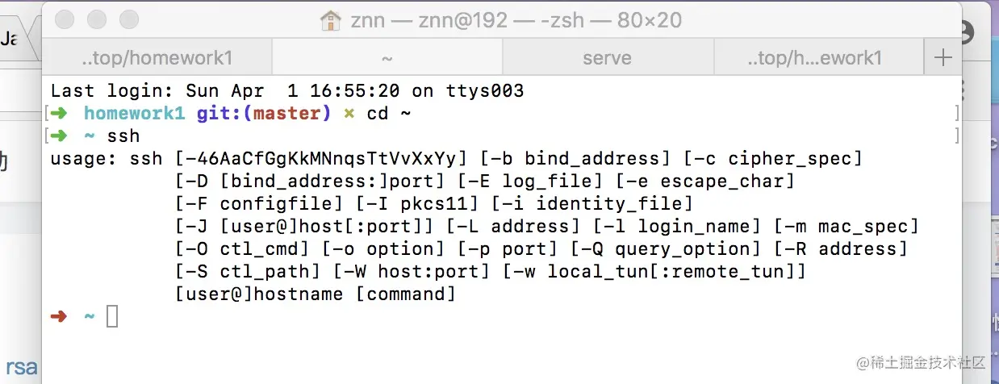
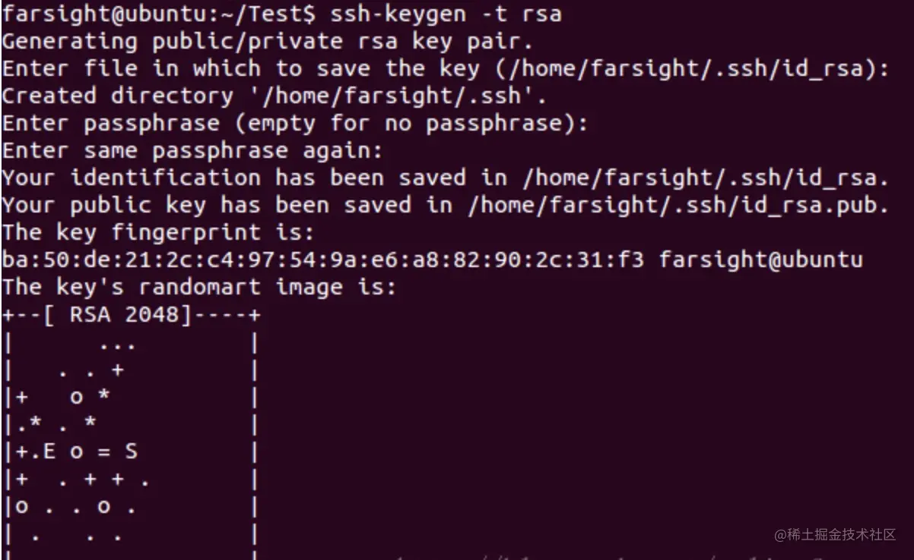
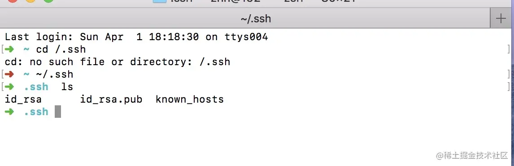
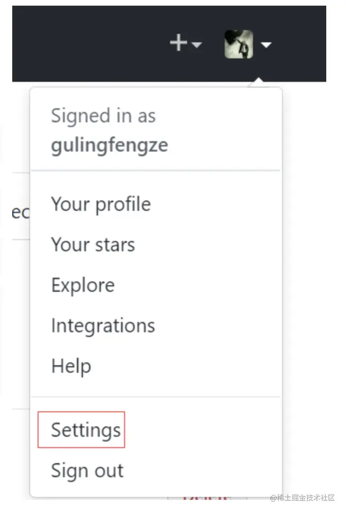
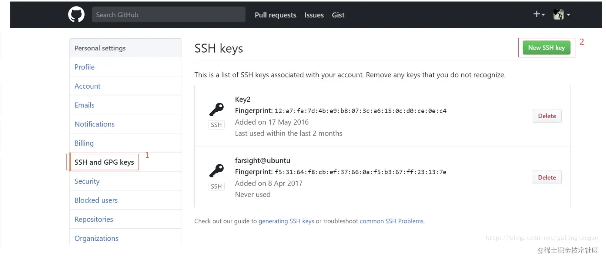
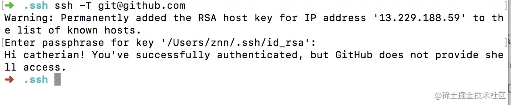

---
# 当前页面内容标题
title: Mac配置SSH Key到GitHub
# 分类
category:
  - git
# 标签
tag: 
  - git
  - 开发工具
sticky: false
# 是否收藏在博客主题的文章列表中，当填入数字时，数字越大，排名越靠前。
star: false
# 是否将该文章添加至文章列表中
article: true
# 是否将该文章添加至时间线中
timeline: true
---

## Mac配置SSH Key到GitHub

### 1.生成SSH Key

在Linux和Mac系统中都自动安装了SSH，Windows系统需要安装Git Bash。 首先检查下本机是否已经安装了SSH，在终端输入ssh即可：



接下来就是生成ssh key了，输入`ssh-keygen -t rsa`，然后连续按回车键三次（如果输入密码，每次登陆都需要密码）。



> 出现上面内容就说明成功生成`id_rsa`和`id_rsa.pub`两个文件，`id_rsa.pub`为公钥，`id_rsa`为私钥，它们都是隐藏文件。这里说明下生成的公钥和私钥所在位置，Linux和Mac系统在 下面，`Windows系统在C盘Documents and Settings/username/.ssh下面`。 那么如何查看它们的内容呢？只需要继续执行以下两条命令即可。

> MAC查看位置
>
> ```sh
> # 打开方式
> open ./.ssh
> cat id_rsa.pub
> 
> # 查看方式
> cat ./.ssh/id_rsa.pub
> ```



可以看到，执行完ls命令后，可以看到公钥和私钥。继续执行以下命令（此处为Linux和Mac系统下获取公钥内容，下面会用到公钥）即可得到公钥的内容：

```shell
cat id_rsa.pub
```

Windows系统查看公钥可以使用Sublime或者其他编辑器。


### 2.添加SSH Key到GitHub上

这里需要将公钥id_rsa.pub添加到GitHub上，登陆GitHub进入设置界面，如图所示：



接着执行下面操作：



点击New SSH Key按钮后进行Key的填写操作，完成SSH Key的添加。添加SSH Key成功之后，继续输入命令进行测试。

```shell
ssh -T git@github.com
```



出现以上截图，说明配置成功！