---
# 当前页面内容标题
title: 七、SSM整合伪分布式案例
# 分类
category:
  - maven
# 标签
tag: 
  - maven
  - ssm
  - 开发工具
sticky: false
# 是否收藏在博客主题的文章列表中，当填入数字时，数字越大，排名越靠前。
star: false
# 是否将该文章添加至文章列表中
article: true
# 是否将该文章添加至时间线中
timeline: true
---

## 第一节 创建工程，引入依赖

### 1、创建工程

#### ①工程清单

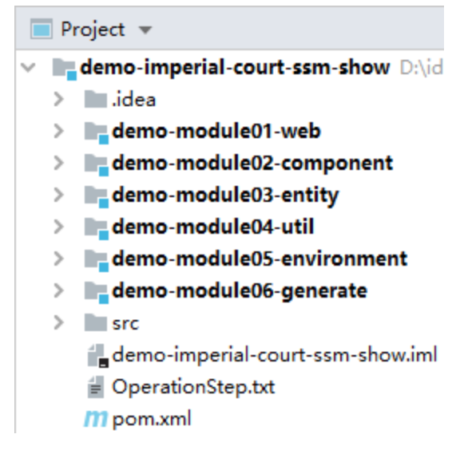

| 工程名                       | 地位   | 说明                 |
| ---------------------------- | ------ | -------------------- |
| demo-imperial-court-ssm-show | 父工程 | 总体管理各个子工程   |
| demo-module01-web            | 子工程 | 唯一的 war 包工程    |
| demo-module02-component      | 子工程 | 管理项目中的各种组件 |
| demo-module03-entity         | 子工程 | 管理项目中的实体类   |
| demo-module04-util           | 子工程 | 管理项目中的工具类   |
| demo-module05-environment    | 子工程 | 框架环境所需依赖     |
| demo-module06-generate       | 子工程 | Mybatis 逆向工程     |

#### ②工程间关系

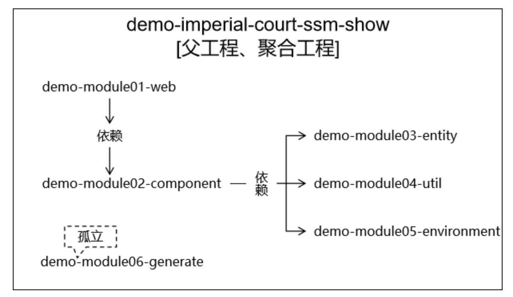

### 2、各工程 POM 配置

#### ①父工程

POM 位置如下：

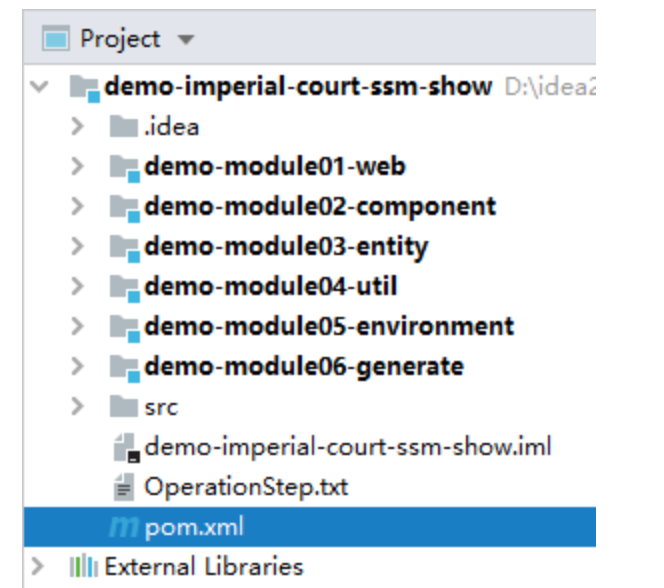

各子工程创建好之后就会有下面配置，不需要手动编辑：

```xml
<groupId>com.atguigu</groupId>
<artifactId>demo-imperial-court-ssm-show</artifactId>
<packaging>pom</packaging>
<version>1.0-SNAPSHOT</version>
<modules>
    <module>demo-module01-web</module>
    <module>demo-module02-component</module>
    <module>demo-module03-entity</module>
    <module>demo-module04-util</module>
    <module>demo-module05-environment</module>
    <module>demo-module06-generate</module>
</modules>
```

#### ②Mybatis 逆向工程

POM 位置如下：

```xml
<!-- 依赖MyBatis核心包 -->
<dependencies>
    <dependency>
        <groupId>org.mybatis</groupId>
        <artifactId>mybatis</artifactId>
        <version>3.5.7</version>
    </dependency>
</dependencies>

<!-- 控制Maven在构建过程中相关配置 -->
<build>

    <!-- 构建过程中用到的插件 -->
    <plugins>

        <!-- 具体插件，逆向工程的操作是以构建过程中插件形式出现的 -->
        <plugin>
            <groupId>org.mybatis.generator</groupId>
            <artifactId>mybatis-generator-maven-plugin</artifactId>
            <version>1.3.0</version>

            <!-- 插件的依赖 -->
            <dependencies>

                <!-- 逆向工程的核心依赖 -->
                <dependency>
                    <groupId>org.mybatis.generator</groupId>
                    <artifactId>mybatis-generator-core</artifactId>
                    <version>1.3.2</version>
                </dependency>

                <!-- 数据库连接池 -->
                <dependency>
                    <groupId>com.mchange</groupId>
                    <artifactId>c3p0</artifactId>
                    <version>0.9.2</version>
                </dependency>

                <!-- MySQL驱动 -->
                <dependency>
                    <groupId>mysql</groupId>
                    <artifactId>mysql-connector-java</artifactId>
                    <version>5.1.8</version>
                </dependency>
            </dependencies>
        </plugin>
    </plugins>
</build>
```

#### ③环境依赖工程

POM 位置如下：

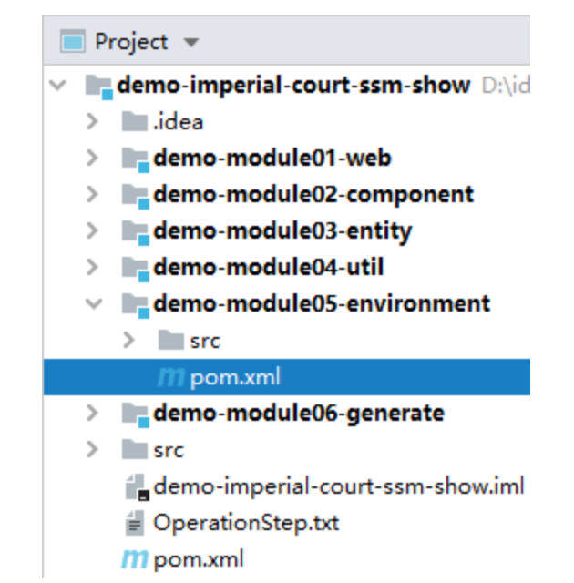

```xml
<!-- SpringMVC -->
<dependency>
    <groupId>org.springframework</groupId>
    <artifactId>spring-webmvc</artifactId>
    <version>5.3.1</version>
</dependency>

<!-- Spring 持久化层所需依赖 -->
<dependency>
    <groupId>org.springframework</groupId>
    <artifactId>spring-orm</artifactId>
    <version>5.3.1</version>
</dependency>

<!-- 日志 -->
<dependency>
    <groupId>ch.qos.logback</groupId>
    <artifactId>logback-classic</artifactId>
    <version>1.2.3</version>
</dependency>

<!-- Spring5和Thymeleaf整合包 -->
<dependency>
    <groupId>org.thymeleaf</groupId>
    <artifactId>thymeleaf-spring5</artifactId>
    <version>3.0.12.RELEASE</version>
</dependency>

<!-- Mybatis 和 Spring 的整合包 -->
<dependency>
    <groupId>org.mybatis</groupId>
    <artifactId>mybatis-spring</artifactId>
    <version>2.0.6</version>
</dependency>

<!-- Mybatis核心 -->
<dependency>
    <groupId>org.mybatis</groupId>
    <artifactId>mybatis</artifactId>
    <version>3.5.7</version>
</dependency>

<!-- MySQL驱动 -->
<dependency>
    <groupId>mysql</groupId>
    <artifactId>mysql-connector-java</artifactId>
    <version>5.1.3</version>
</dependency>

<!-- 数据源 -->
<dependency>
    <groupId>com.alibaba</groupId>
    <artifactId>druid</artifactId>
    <version>1.0.31</version>
</dependency>
```

#### ④工具类工程

无配置。

#### ⑤实体类工程

无配置。

#### ⑥组件工程

POM 位置如下：

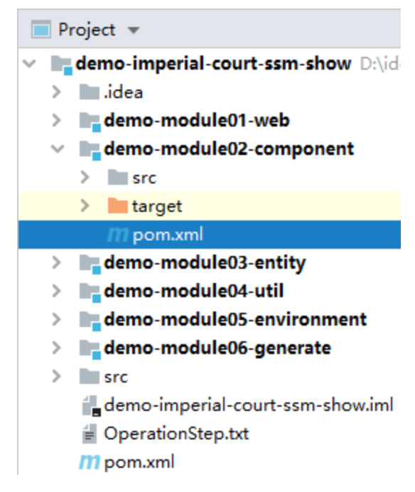

```xml
<dependency>
    <groupId>com.atguigu</groupId>
    <artifactId>demo-module03-entity</artifactId>
    <version>1.0-SNAPSHOT</version>
</dependency>
<dependency>
    <groupId>com.atguigu</groupId>
    <artifactId>demo-module04-util</artifactId>
    <version>1.0-SNAPSHOT</version>
</dependency>
<dependency>
    <groupId>com.atguigu</groupId>
    <artifactId>demo-module05-environment</artifactId>
    <version>1.0-SNAPSHOT</version>
</dependency>

<!-- ServletAPI -->
<dependency>
    <groupId>javax.servlet</groupId>
    <artifactId>javax.servlet-api</artifactId>
    <version>3.1.0</version>
    <scope>provided</scope>
</dependency>
```

#### ⑦Web 工程

POM 位置如下：

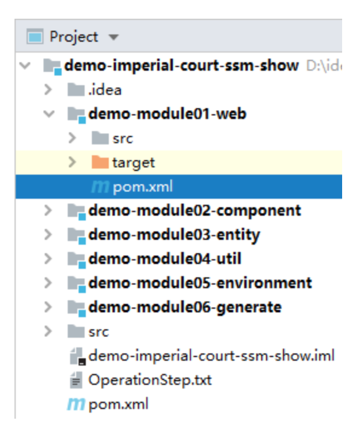

```xml
<dependency>
    <groupId>com.atguigu</groupId>
    <artifactId>demo-module02-component</artifactId>
    <version>1.0-SNAPSHOT</version>
</dependency>

<!-- junit5 -->
<dependency>
    <groupId>org.junit.jupiter</groupId>
    <artifactId>junit-jupiter-api</artifactId>
    <version>5.7.0</version>
    <scope>test</scope>
</dependency>

<!-- Spring 的测试功能 -->
<dependency>
    <groupId>org.springframework</groupId>
    <artifactId>spring-test</artifactId>
    <version>5.3.1</version>
    <scope>test</scope>
</dependency>
```

## 第二节 搭建环境：持久化层

### 1、物理建模

我们仍然继续使用《第六章 单一架构案例》中创建的数据库和表。

### 2、Mybatis 逆向工程

#### ①generatorConfig.xml

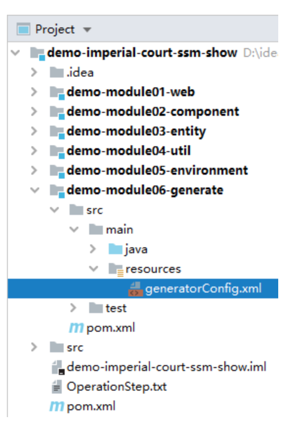

```xml
<?xml version="1.0" encoding="UTF-8"?>
<!DOCTYPE generatorConfiguration
        PUBLIC "-//mybatis.org//DTD MyBatis Generator Configuration 1.0//EN"
        "http://mybatis.org/dtd/mybatis-generator-config_1_0.dtd">
<generatorConfiguration>
    <!--
            targetRuntime: 执行生成的逆向工程的版本
                    MyBatis3Simple: 生成基本的CRUD（清新简洁版）
                    MyBatis3: 生成带条件的CRUD（奢华尊享版）
     -->
    <context id="DB2Tables" targetRuntime="MyBatis3">
        <!-- 数据库的连接信息 -->
        <jdbcConnection driverClass="com.mysql.jdbc.Driver"
                        connectionURL="jdbc:mysql://192.168.198.100:3306/db_imperial_court"
                        userId="root"
                        password="atguigu">
        </jdbcConnection>
        <!-- javaBean的生成策略-->
        <javaModelGenerator targetPackage="com.atguigu.imperial.court.entity" targetProject=".\src\main\java">
            <property name="enableSubPackages" value="true" />
            <property name="trimStrings" value="true" />
        </javaModelGenerator>
        <!-- SQL映射文件的生成策略 -->
        <sqlMapGenerator targetPackage="com.atguigu.imperial.court.mapper"  targetProject=".\src\main\java">
            <property name="enableSubPackages" value="true" />
        </sqlMapGenerator>
        <!-- Mapper接口的生成策略 -->
        <javaClientGenerator type="XMLMAPPER" targetPackage="com.atguigu.imperial.court.mapper"  targetProject=".\src\main\java">
            <property name="enableSubPackages" value="true" />
        </javaClientGenerator>
        <!-- 逆向分析的表 -->
        <!-- tableName设置为*号，可以对应所有表，此时不写domainObjectName -->
        <!-- domainObjectName属性指定生成出来的实体类的类名 -->
        <table tableName="t_emp" domainObjectName="Emp"/>
        <table tableName="t_memorials" domainObjectName="Memorials"/>
    </context>
</generatorConfiguration>
```

#### ②执行逆向生成

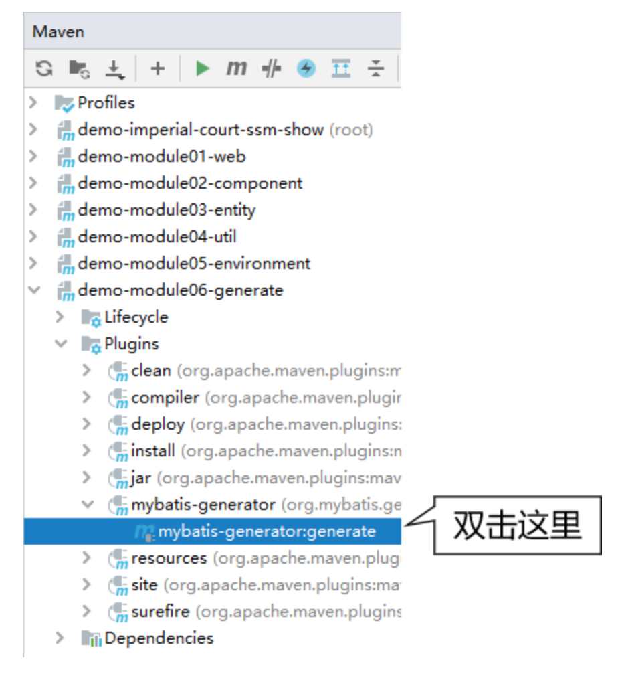

#### ③资源归位

下面罗列各种资源应该存放的位置，排名不分先后：

##### [1]Mapper 配置文件

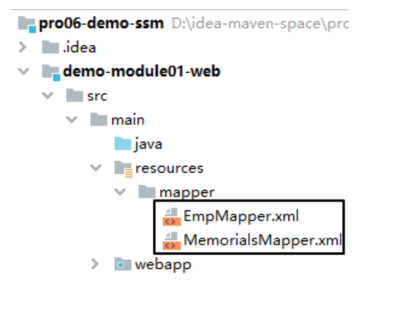

##### [2]Mapper 接口

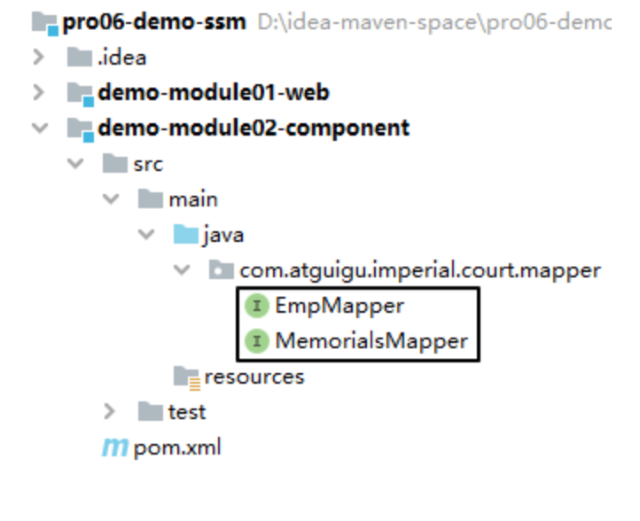

##### [3]实体类

Mybatis 逆向工程生成的实体类只有字段和 get、set 方法，我们可以自己添加无参构造器、有参构造器、toString() 方法。

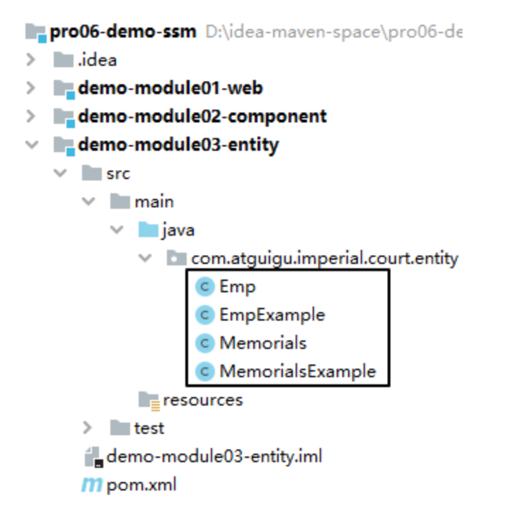

### 3、建立数据库连接

#### ①数据库连接信息

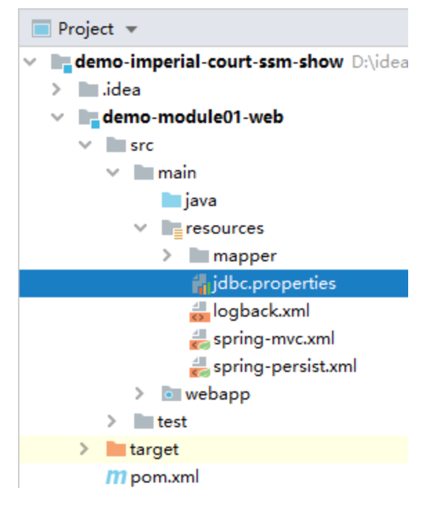

```properties
dev.driverClassName=com.mysql.jdbc.Driver
dev.url=jdbc:mysql://192.168.198.100:3306/db_imperial_court
dev.username=root
dev.password=atguigu
dev.initialSize=10
dev.maxActive=20
dev.maxWait=10000
```

#### ②配置数据源

```xml
<context:property-placeholder location="classpath:jdbc.properties"/>

<bean id="druidDataSource" class="com.alibaba.druid.pool.DruidDataSource">
    <property name="username" value="${dev.username}"/>
    <property name="password" value="${dev.password}"/>
    <property name="url" value="${dev.url}"/>
    <property name="driverClassName" value="${dev.driverClassName}"/>
    <property name="initialSize" value="${dev.initialSize}"/>
    <property name="maxActive" value="${dev.maxActive}"/>
    <property name="maxWait" value="${dev.maxWait}"/>
</bean>
```

#### ③测试

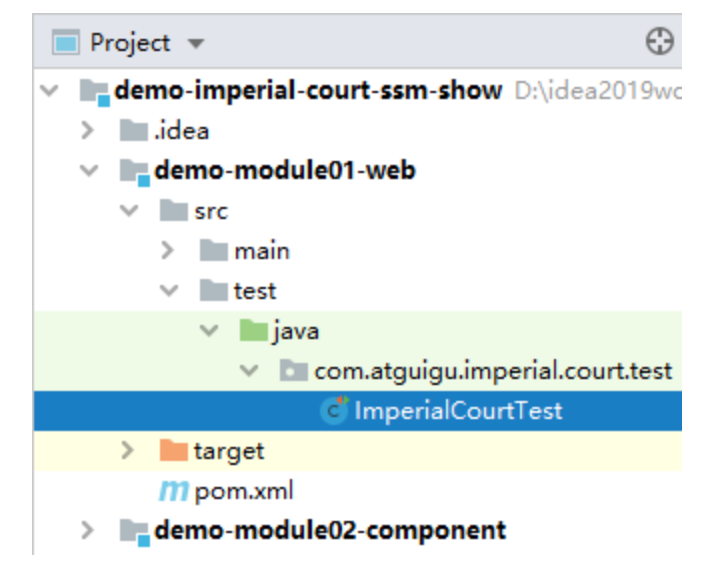

```java
@ExtendWith(SpringExtension.class)
@ContextConfiguration(value = {"classpath:spring-persist.xml"})
public class ImperialCourtTest {

    @Autowired
    private DataSource dataSource;

    private Logger logger = LoggerFactory.getLogger(ImperialCourtTest.class);

    @Test
    public void testConnection() throws SQLException {
        Connection connection = dataSource.getConnection();
        logger.debug(connection.toString());
    }

}
```

> TIP
>
> 配置文件为什么要放到 Web 工程里面？
>
> - Web 工程将来生成 war 包。
> - war 包直接部署到 Tomcat 运行。
> - Tomcat 从 war 包（解压目录）查找配置文件最直接。
> - 如果不是把配置文件放在 Web 工程，而是放在 Java 工程，那就等于将配置文件放在了 war 包内的 jar 包中。
> - 配置文件在 jar 包中读取相对困难。

### 4、Spring 整合 Mybatis

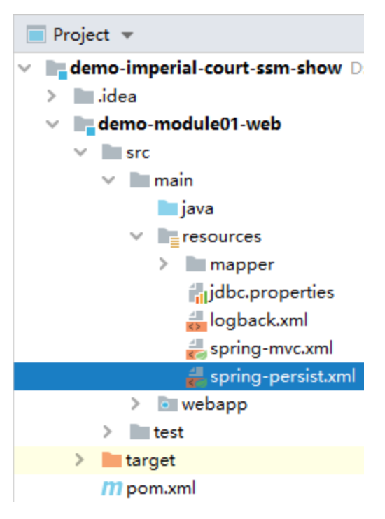

#### ①配置 SqlSessionFactoryBean

**目的**1：装配数据源

**目的**2：指定 Mapper 配置文件的位置

```xml
<!-- 配置 SqlSessionFactoryBean -->
<bean id="sqlSessionFactory" class="org.mybatis.spring.SqlSessionFactoryBean">

    <!-- 装配数据源 -->
    <property name="dataSource" ref="druidDataSource"/>

    <!-- 指定 Mapper 配置文件的位置 -->
    <property name="mapperLocations" value="classpath:mapper/*Mapper.xml"/>
</bean>
```

#### ②扫描 Mapper 接口

```xml
<mybatis:scan base-package="com.atguigu.imperial.court.mapper"/>
```

#### ③测试

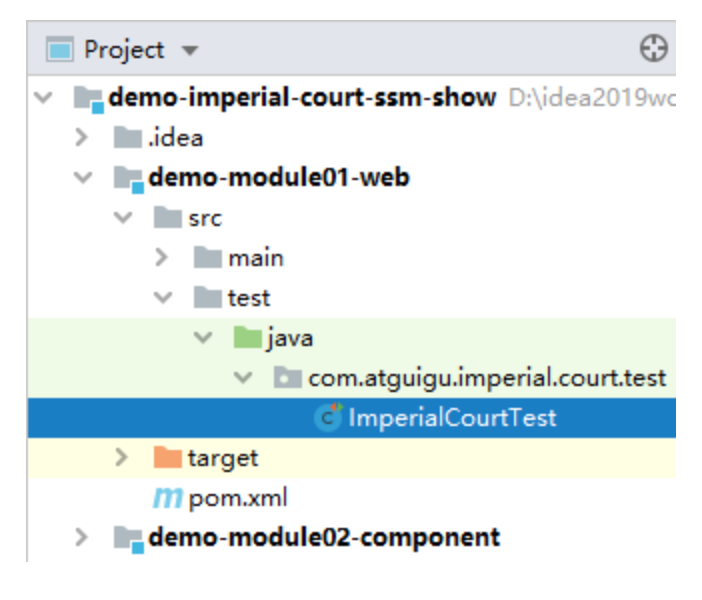

```java
@Autowired
private EmpMapper empMapper;

@Test
public void testEmpMapper() {
    List<Emp> empList = empMapper.selectByExample(new EmpExample());
    for (Emp emp : empList) {
        System.out.println("emp = " + emp);
    }
}
```

## 第三节 搭建环境：事务控制

### 1、声明式事务配置

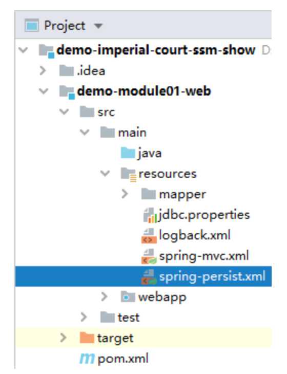

```xml
<!-- 配置事务管理器 -->
<bean id="transactionManager" class="org.springframework.jdbc.datasource.DataSourceTransactionManager">
    <!-- 装配数据源 -->
    <property name="dataSource" ref="dataSource"/>
</bean>

<!-- 配置事务的注解驱动，开启基于注解的声明式事务功能 -->
<tx:annotation-driven transaction-manager="transactionManager"/>

<!-- 配置对 Service 所在包的自动扫描 -->
<context:component-scan base-package="com.atguigu.imperial.court.service"/>
```

### 2、注解写法

#### ①查询操作

```java
@Transactional(readOnly = true)
```

#### ②增删改操作

```java
@Transactional(propagation = Propagation.REQUIRES_NEW, readOnly = false)
```

> TIP
>
> 在具体代码开发中可能会将相同设置的 @Transactional 注解提取到 Service 类上。


## 第四节 搭建环境：表述层

### 1、设定 Web 工程

### 2、web.xml 配置

#### ①配置 ContextLoaderListener

```xml
<!-- 第一部分：加载 spring-persist.xml 配置文件 -->
<context-param>
    <param-name>contextConfigLocation</param-name>
    <param-value>classpath:spring-persist.xml</param-value>
</context-param>
<listener>
    <listener-class>org.springframework.web.context.ContextLoaderListener</listener-class>
</listener>
```

#### ②配置 DispatcherServlet

```xml
<!-- 第二部分：加载 spring-mvc.xml 配置文件 -->
<servlet>
    <servlet-name>dispatcherServlet</servlet-name>
    <servlet-class>org.springframework.web.servlet.DispatcherServlet</servlet-class>
    <init-param>
        <param-name>contextConfigLocation</param-name>
        <param-value>classpath:spring-mvc.xml</param-value>
    </init-param>
    <load-on-startup>1</load-on-startup>
</servlet>
<servlet-mapping>
    <servlet-name>dispatcherServlet</servlet-name>
    <url-pattern>/</url-pattern>
</servlet-mapping>
```

#### ③配置 CharacterEncodingFilter

```xml
<!-- 第三部分：设置字符集的 Filter -->
<filter>
    <filter-name>characterEncodingFilter</filter-name>
    <filter-class>org.springframework.web.filter.CharacterEncodingFilter</filter-class>
    <init-param>
        <param-name>encoding</param-name>
        <param-value>UTF-8</param-value>
    </init-param>
    <init-param>
        <param-name>forceRequestEncoding</param-name>
        <param-value>true</param-value>
    </init-param>
    <init-param>
        <param-name>forceResponseEncoding</param-name>
        <param-value>true</param-value>
    </init-param>
</filter>
<filter-mapping>
    <filter-name>characterEncodingFilter</filter-name>
    <url-pattern>/*</url-pattern>
</filter-mapping>
```

#### ④配置 HiddenHttpMethodFilter

```xml
<!-- 第四部分：按照 RESTFul 风格负责转换请求方式的 Filter -->
<filter>
    <filter-name>hiddenHttpMethodFilter</filter-name>
    <filter-class>org.springframework.web.filter.HiddenHttpMethodFilter</filter-class>
</filter>
<filter-mapping>
    <filter-name>hiddenHttpMethodFilter</filter-name>
    <url-pattern>/*</url-pattern>
</filter-mapping>
```

### 3、显示首页

#### ①配置 SpringMVC

##### [1]标配

```xml
<!-- 开启 SpringMVC 的注解驱动功能 -->
<mvn:annotation-driven />

<!-- 让 SpringMVC 对没有 @RequestMapping 的请求直接放行 -->
<mvc:default-servlet-handler />
```

##### [2]配置视图解析相关

```xml
<!-- 配置视图解析器 -->
<bean id="thymeleafViewResolver" class="org.thymeleaf.spring5.view.ThymeleafViewResolver">
	<property name="order" value="1"/>
	<property name="characterEncoding" value="UTF-8"/>
	<property name="templateEngine">
		<bean class="org.thymeleaf.spring5.SpringTemplateEngine">
			<property name="templateResolver">
				<bean class="org.thymeleaf.spring5.templateresolver.SpringResourceTemplateResolver">
					<property name="prefix" value="/WEB-INF/templates/"/>
					<property name="suffix" value=".html"/>
					<property name="characterEncoding" value="UTF-8"/>
					<property name="templateMode" value="HTML5"/>
				</bean>
			</property>
		</bean>
	</property>
</bean>
```

**注意**：需要我们自己手动创建 templates 目录。

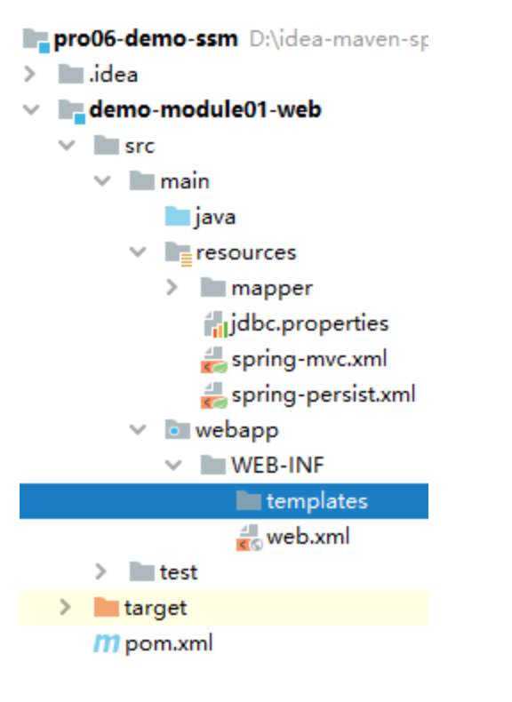

##### [3]配置自动扫描的包

```xml
<!-- 配置自动扫描的包 -->
<context:component-scan base-package="com.atguigu.imperial.court.controller"/>
```

#### ②配置 view-controller 访问首页

```xml
<!-- 配置 view-controller -->
<mvc:view-controller path="/" view-name="index" />
```

#### ③创建首页模板文件

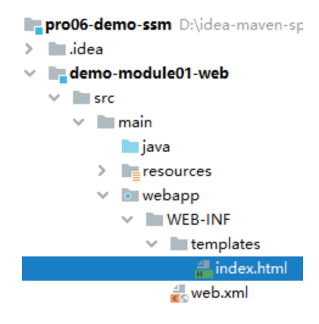

```html
<!DOCTYPE html>
<html lang="en" xml:th="http://www.thymeleaf.org">
<head>
    <meta charset="UTF-8">
    <title>首页</title>
</head>
<body>

<!-- @{/auth} 解析后：/demo/auth -->
<form th:action="@{/auth/login}" method="post">

    <!-- th:text 解析表达式后会替换标签体 -->
    <!-- ${attrName} 从请求域获取属性名为 attrName 的属性值 -->
    <p style="color: red;font-weight: bold;" th:text="${message}"></p>
    <p style="color: red;font-weight: bold;" th:text="${systemMessage}"></p>

    账号：<input type="text" name="loginAccount"/><br/>
    密码：<input type="password" name="loginPassword"><br/>
    <button type="submit">进宫</button>
</form>

</body>
</html>
```


## 第五节 搭建环境：辅助功能

### 1、登录失败异常

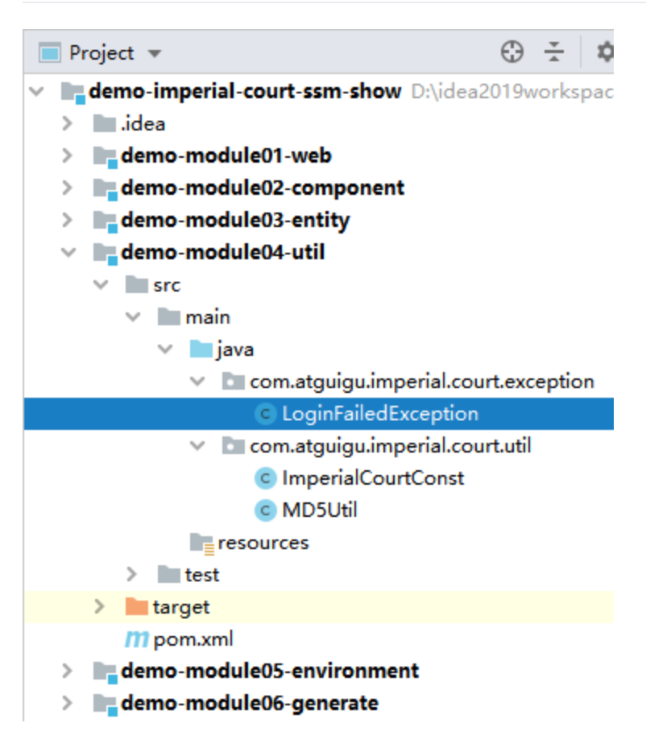

```java
public class LoginFailedException extends RuntimeException {

    public LoginFailedException() {
    }

    public LoginFailedException(String message) {
        super(message);
    }

    public LoginFailedException(String message, Throwable cause) {
        super(message, cause);
    }

    public LoginFailedException(Throwable cause) {
        super(cause);
    }

    public LoginFailedException(String message, Throwable cause, boolean enableSuppression, boolean writableStackTrace) {
        super(message, cause, enableSuppression, writableStackTrace);
    }
}
```

### 2、常量类

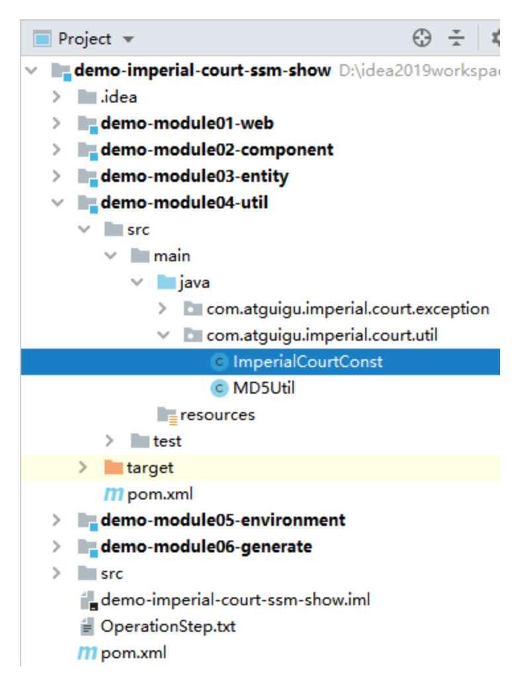

```java
public class ImperialCourtConst {

    public static final String LOGIN_FAILED_MESSAGE = "账号、密码错误，不可进宫！";
    public static final String ACCESS_DENIED_MESSAGE = "宫闱禁地，不得擅入！";
    public static final String LOGIN_EMP_ATTR_NAME = "loginInfo";

}
```

### 3、MD5 工具

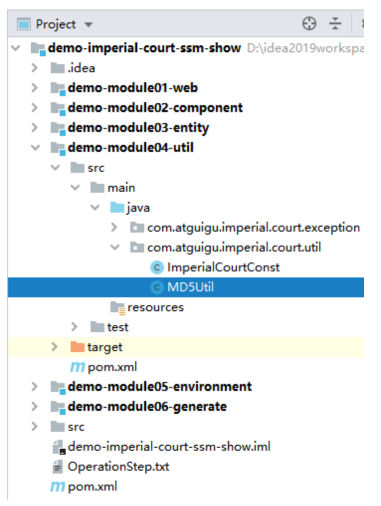

```java
public class MD5Util {

    /**
     * 针对明文字符串执行MD5加密
     * @param source
     * @return
     */
    public static String encode(String source) {

        // 1.判断明文字符串是否有效
        if (source == null || "".equals(source)) {
            throw new RuntimeException("用于加密的明文不可为空");
        }

        // 2.声明算法名称
        String algorithm = "md5";

        // 3.获取MessageDigest对象
        MessageDigest messageDigest = null;
        try {
            messageDigest = MessageDigest.getInstance(algorithm);
        } catch (NoSuchAlgorithmException e) {
            e.printStackTrace();
        }

        // 4.获取明文字符串对应的字节数组
        byte[] input = source.getBytes();

        // 5.执行加密
        byte[] output = messageDigest.digest(input);

        // 6.创建BigInteger对象
        int signum = 1;
        BigInteger bigInteger = new BigInteger(signum, output);

        // 7.按照16进制将bigInteger的值转换为字符串
        int radix = 16;
        String encoded = bigInteger.toString(radix).toUpperCase();

        return encoded;
    }

}
```

### 4、日志配置文件

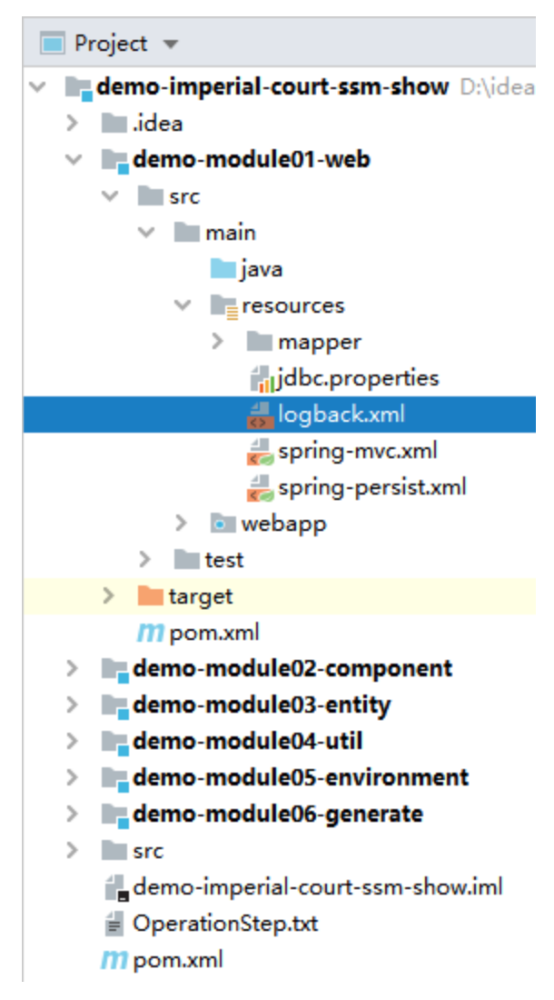

```xml
<?xml version="1.0" encoding="UTF-8"?>
<configuration debug="true">
    <!-- 指定日志输出的位置 -->
    <appender name="STDOUT"
              class="ch.qos.logback.core.ConsoleAppender">
        <encoder>
            <!-- 日志输出的格式 -->
            <!-- 按照顺序分别是：时间、日志级别、线程名称、打印日志的类、日志主体内容、换行 -->
            <pattern>[%d{HH:mm:ss.SSS}] [%-5level] [%thread] [%logger] [%msg]%n</pattern>
            <charset>UTF-8</charset>
        </encoder>
    </appender>

    <!-- 设置全局日志级别。日志级别按顺序分别是：DEBUG、INFO、WARN、ERROR -->
    <!-- 指定任何一个日志级别都只打印当前级别和后面级别的日志。 -->
    <root level="INFO">
        <!-- 指定打印日志的appender，这里通过“STDOUT”引用了前面配置的appender -->
        <appender-ref ref="STDOUT" />
    </root>

    <!-- 专门给某一个包指定日志级别 -->
    <logger name="com.atguigu" level="DEBUG" additivity="false">
        <appender-ref ref="STDOUT" />
    </logger>

</configuration>
```

## 第六节 业务功能：登录

### 1、AuthController

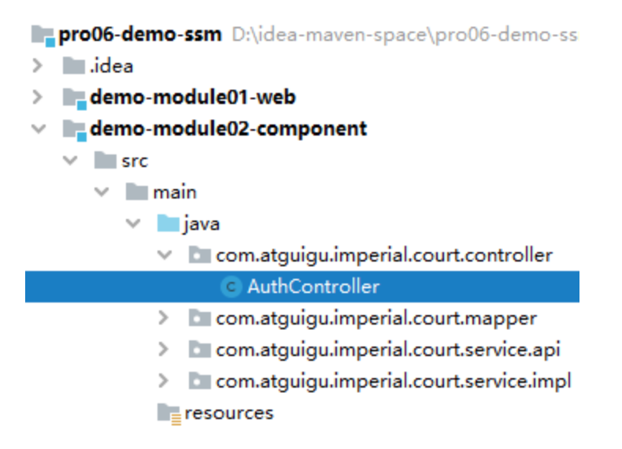

```java
@Controller
public class AuthController {

    @Autowired
    private EmpService empService;

    @RequestMapping("/auth/login")
    public String doLogin(
            @RequestParam("loginAccount") String loginAccount,
            @RequestParam("loginPassword") String loginPassword,
            HttpSession session,
            Model model
    ) {

        // 1、尝试查询登录信息
        Emp emp = empService.getEmpByLogin(loginAccount, loginPassword);

        // 2、判断登录是否成功
        if (emp == null) {

            // 3、如果登录失败则回到登录页面显示提示消息
            model.addAttribute("message", ImperialCourtConst.LOGIN_FAILED_MESSAGE);

            return "index";

        } else {

            // 4、如果登录成功则将登录信息存入 Session 域
            session.setAttribute("loginInfo", emp);

            return "target";
        }
    }

}
```

### 2、EmpService

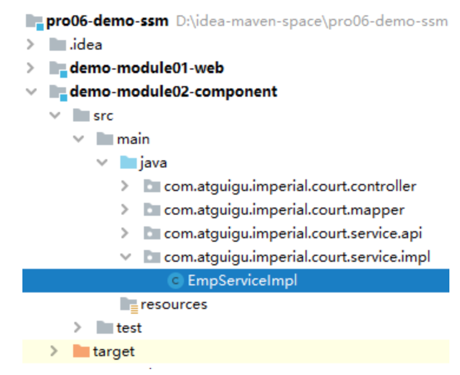

```java
@Service
@Transactional(readOnly = true)
public class EmpServiceImpl implements EmpService {

    @Autowired
    private EmpMapper empMapper;


    @Override
    public Emp getEmpByLogin(String loginAccount, String loginPassword) {

        // 1、密码加密
        String encodedLoginPassword = MD5Util.encode(loginPassword);

        // 2、通过 QBC 查询方式封装查询条件
        EmpExample example = new EmpExample();

        EmpExample.Criteria criteria = example.createCriteria();

        criteria.andLoginAccountEqualTo(loginAccount).andLoginPasswordEqualTo(encodedLoginPassword);

        List<Emp> empList = empMapper.selectByExample(example);

        if (empList != null && empList.size() > 0) {

            // 3、返回查询结果
            return empList.get(0);
        }

        return null;
    }
}
```

### 3、target.html

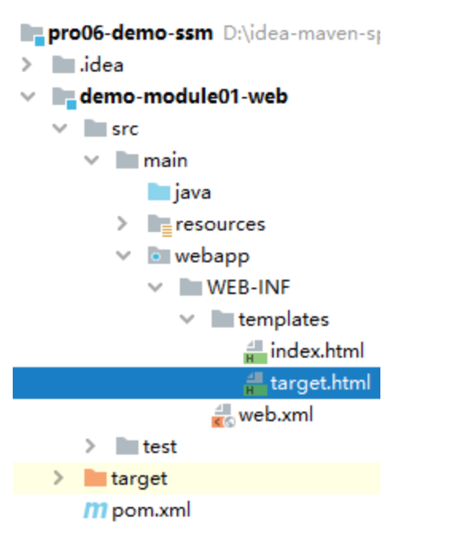

```html
<!DOCTYPE html>
<html lang="en" xml:th="http://www.thymeleaf.org">
<head>
    <meta charset="UTF-8">
    <title>Title</title>
</head>
<body>

    <p th:text="${session.loginInfo}"></p>

</body>
</html>
```

