---
# 当前页面内容标题
title: 九、POM深入与强化
# 分类
category:
  - maven
# 标签
tag: 
  - maven
  - 开发工具
sticky: false
# 是否收藏在博客主题的文章列表中，当填入数字时，数字越大，排名越靠前。
star: false
# 是否将该文章添加至文章列表中
article: true
# 是否将该文章添加至时间线中
timeline: true
---

## 第一节 重新认识Maven

### 1、Maven 的完整功能

在入门的时候我们介绍说 Maven 是一款『**构建**管理』和『**依赖**管理』的工具。但事实上这只是 Maven 的一部分功能。Maven 本身的产品定位是一款『**项目**管理工具』。

### 2、项目管理功能的具体体现

下面是 spring-boot-starter 的 POM 文件，可以看到：除了我们熟悉的坐标标签、dependencies 标签，还有 description、url、organization、licenses、developers、scm、issueManagement 等这些描述项目信息的标签。

```xml
<?xml version="1.0" encoding="UTF-8"?>
<project xsi:schemaLocation="http://maven.apache.org/POM/4.0.0 http://maven.apache.org/xsd/maven-4.0.0.xsd" xmlns="http://maven.apache.org/POM/4.0.0"
    xmlns:xsi="http://www.w3.org/2001/XMLSchema-instance">
  <!-- This module was also published with a richer model, Gradle metadata,  -->
  <!-- which should be used instead. Do not delete the following line which  -->
  <!-- is to indicate to Gradle or any Gradle module metadata file consumer  -->
  <!-- that they should prefer consuming it instead. -->
  <!-- do_not_remove: published-with-gradle-metadata -->
  <modelVersion>4.0.0</modelVersion>
  <groupId>org.springframework.boot</groupId>
  <artifactId>spring-boot-starter</artifactId>
  <version>2.5.6</version>
  <name>spring-boot-starter</name>
  <description>Core starter, including auto-configuration support, logging and YAML</description>
  <url>https://spring.io/projects/spring-boot</url>
  <organization>
    <name>Pivotal Software, Inc.</name>
    <url>https://spring.io</url>
  </organization>
  <licenses>
    <license>
      <name>Apache License, Version 2.0</name>
      <url>https://www.apache.org/licenses/LICENSE-2.0</url>
    </license>
  </licenses>
  <developers>
    <developer>
      <name>Pivotal</name>
      <email>info@pivotal.io</email>
      <organization>Pivotal Software, Inc.</organization>
      <organizationUrl>https://www.spring.io</organizationUrl>
    </developer>
  </developers>
  <scm>
    <connection>scm:git:git://github.com/spring-projects/spring-boot.git</connection>
    <developerConnection>scm:git:ssh://git@github.com/spring-projects/spring-boot.git</developerConnection>
    <url>https://github.com/spring-projects/spring-boot</url>
  </scm>
  <issueManagement>
    <system>GitHub</system>
    <url>https://github.com/spring-projects/spring-boot/issues</url>
  </issueManagement>

  <dependencies>
    <dependency>
      ……
    </dependency>
  </dependencies>
</project>
```

所以从『项目管理』的角度来看，Maven 提供了如下这些功能：

- 项目对象模型（POM）：将整个项目本身抽象、封装为应用程序中的一个对象，以便于管理和操作。
- 全局性构建逻辑重用：Maven 对整个构建过程进行封装之后，程序员只需要指定配置信息即可完成构建。让构建过程从 Ant 的『编程式』升级到了 Maven 的『声明式』。
- 构件的标准集合：在 Maven 提供的标准框架体系内，所有的构件都可以按照统一的规范生成和使用。
- 构件关系定义：Maven 定义了构件之间的三种基本关系，让大型应用系统可以使用 Maven 来进行管理
  - 继承关系：通过从上到下的继承关系，将各个子构件中的重复信息提取到父构件中统一管理
  - 聚合关系：将多个构件聚合为一个整体，便于统一操作
  - 依赖关系：Maven 定义了依赖的范围、依赖的传递、依赖的排除、版本仲裁机制等一系列规范和标准，让大型项目可以有序容纳数百甚至更多依赖
- 插件目标系统：Maven 核心程序定义抽象的生命周期，然后将插件的目标绑定到生命周期中的特定阶段，实现了标准和具体实现解耦合，让 Maven 程序极具扩展性
- 项目描述信息的维护：我们不仅可以在 POM 中声明项目描述信息，更可以将整个项目相关信息收集起来生成 HTML 页面组成的一个可以直接访问的站点。这些项目描述信息包括：
  - 公司或组织信息
  - 项目许可证
  - 开发成员信息
  - issue 管理信息
  - SCM 信息

## 第二节 POM 的四个层次

### 1、超级 POM

经过我们前面的学习，我们看到 Maven 在构建过程中有很多默认的设定。例如：源文件存放的目录、测试源文件存放的目录、构建输出的目录……等等。但是其实这些要素也都是被 Maven 定义过的。定义的位置就是：**超级 POM**。

关于超级 POM，Maven 官网是这样介绍的：

> The Super POM is Maven's default POM. All POMs extend the Super POM unless explicitly set, meaning the configuration specified in the Super POM is inherited by the POMs you created for your projects.
>
> 译文：Super POM 是 Maven 的默认 POM。除非明确设置，否则所有 POM 都扩展 Super POM，这意味着 Super POM 中指定的配置由您为项目创建的 POM 继承。

所以我们自己的 POM 即使没有明确指定一个父工程（父 POM），其实也默认继承了超级 POM。就好比一个 Java 类默认继承了 Object 类。

那么超级 POM 中定义了哪些东西呢？如下所示：

```xml
<project>
  <modelVersion>4.0.0</modelVersion>
 
  <repositories>
    <repository>
      <id>central</id>
      <name>Central Repository</name>
      <url>https://repo.maven.apache.org/maven2</url>
      <layout>default</layout>
      <snapshots>
        <enabled>false</enabled>
      </snapshots>
    </repository>
  </repositories>
 
  <pluginRepositories>
    <pluginRepository>
      <id>central</id>
      <name>Central Repository</name>
      <url>https://repo.maven.apache.org/maven2</url>
      <layout>default</layout>
      <snapshots>
        <enabled>false</enabled>
      </snapshots>
      <releases>
        <updatePolicy>never</updatePolicy>
      </releases>
    </pluginRepository>
  </pluginRepositories>
 
  <build>
    <directory>${project.basedir}/target</directory>
    <outputDirectory>${project.build.directory}/classes</outputDirectory>
    <finalName>${project.artifactId}-${project.version}</finalName>
    <testOutputDirectory>${project.build.directory}/test-classes</testOutputDirectory>
    <sourceDirectory>${project.basedir}/src/main/java</sourceDirectory>
    <scriptSourceDirectory>${project.basedir}/src/main/scripts</scriptSourceDirectory>
    <testSourceDirectory>${project.basedir}/src/test/java</testSourceDirectory>
    <resources>
      <resource>
        <directory>${project.basedir}/src/main/resources</directory>
      </resource>
    </resources>
    <testResources>
      <testResource>
        <directory>${project.basedir}/src/test/resources</directory>
      </testResource>
    </testResources>
    <pluginManagement>
      <!-- NOTE: These plugins will be removed from future versions of the super POM -->
      <!-- They are kept for the moment as they are very unlikely to conflict with lifecycle mappings (MNG-4453) -->
      <plugins>
        <plugin>
          <artifactId>maven-antrun-plugin</artifactId>
          <version>1.3</version>
        </plugin>
        <plugin>
          <artifactId>maven-assembly-plugin</artifactId>
          <version>2.2-beta-5</version>
        </plugin>
        <plugin>
          <artifactId>maven-dependency-plugin</artifactId>
          <version>2.8</version>
        </plugin>
        <plugin>
          <artifactId>maven-release-plugin</artifactId>
          <version>2.5.3</version>
        </plugin>
      </plugins>
    </pluginManagement>
  </build>
 
  <reporting>
    <outputDirectory>${project.build.directory}/site</outputDirectory>
  </reporting>
 
  <profiles>
    <!-- NOTE: The release profile will be removed from future versions of the super POM -->
    <profile>
      <id>release-profile</id>
 
      <activation>
        <property>
          <name>performRelease</name>
          <value>true</value>
        </property>
      </activation>
 
      <build>
        <plugins>
          <plugin>
            <inherited>true</inherited>
            <artifactId>maven-source-plugin</artifactId>
            <executions>
              <execution>
                <id>attach-sources</id>
                <goals>
                  <goal>jar-no-fork</goal>
                </goals>
              </execution>
            </executions>
          </plugin>
          <plugin>
            <inherited>true</inherited>
            <artifactId>maven-javadoc-plugin</artifactId>
            <executions>
              <execution>
                <id>attach-javadocs</id>
                <goals>
                  <goal>jar</goal>
                </goals>
              </execution>
            </executions>
          </plugin>
          <plugin>
            <inherited>true</inherited>
            <artifactId>maven-deploy-plugin</artifactId>
            <configuration>
              <updateReleaseInfo>true</updateReleaseInfo>
            </configuration>
          </plugin>
        </plugins>
      </build>
    </profile>
  </profiles>
 
</project>
```

### 2、父 POM

和 Java 类一样，POM 之间其实也是**单继承**的。如果我们给一个 POM 指定了父 POM，那么继承关系如下图所示：

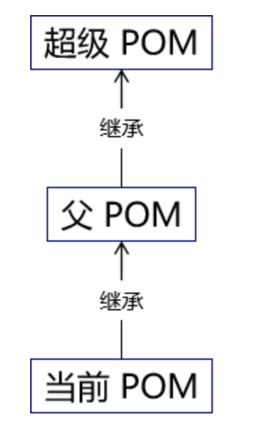

### 3、有效 POM

#### ①概念

有效 POM 英文翻译为 effective POM，它的概念是这样的——在 POM 的继承关系中，子 POM 可以覆盖父 POM 中的配置；如果子 POM 没有覆盖，那么父 POM 中的配置将会被继承。按照这个规则，继承关系中的所有 POM 叠加到一起，就得到了一个最终生效的 POM。显然 Maven 实际运行过程中，执行构建操作就是按照这个最终生效的 POM 来运行的。这个最终生效的 POM 就是**有效 POM**，英文叫**effective POM**。

#### ②查看有效 POM

> mvn help:effective-pom

运行效果，如下：

> D:\idea2019workspace\atguigu-maven-210422-new\pro34-ssm-integration>mvn help:effective-pom [INFO] Scanning for projects... [INFO] [INFO] -----------------< org.example:pro34-ssm-integration >------------------ [INFO] Building pro34-ssm-integration 1.0-SNAPSHOT [INFO] --------------------------------[ war ]--------------------------------- [INFO] [INFO] --- maven-help-plugin:3.2.0:effective-pom (default-cli) @ pro34-ssm-integration --- [INFO] Effective POMs, after inheritance, interpolation, and profiles are applied:
>
> < ?xml version="1.0" encoding="GBK"?> 4.0.0 org.example atguigu-maven-210422-new 1.0-SNAPSHOT org.example pro34-ssm-integration 1.0-SNAPSHOT war 1.8 1.8 1.8 org.springframework spring-webmvc 5.3.1 compile org.springframework spring-orm 5.3.1 compile ch.qos.logback logback-classic 1.2.3 compile javax.servlet javax.servlet-api 3.1.0 provided org.thymeleaf thymeleaf-spring5 3.0.12.RELEASE compile org.mybatis mybatis-spring 2.0.6 compile org.mybatis mybatis 3.5.7 compile com.github.pagehelper pagehelper 5.2.0 compile mysql mysql-connector-java 5.1.3 compile com.alibaba druid 1.0.31 compile org.junit.jupiter junit-jupiter-api 5.7.0 test org.springframework spring-test 5.3.1 compile false central Central Repository https://repo.maven.apache.org/maven2 never false central Central Repository https://repo.maven.apache.org/maven2 D:\idea2019workspace\atguigu-maven-210422-new\pro34-ssm-integration\src\main\java D:\idea2019workspace\atguigu-maven-210422-new\pro34-ssm-integration\src\main\scripts D:\idea2019workspace\atguigu-maven-210422-new\pro34-ssm-integration\src\test\java D:\idea2019workspace\atguigu-maven-210422-new\pro34-ssm-integration\target\classes D:\idea2019workspace\atguigu-maven-210422-new\pro34-ssm-integration\target\test-classes D:\idea2019workspace\atguigu-maven-210422-new\pro34-ssm-integration\src\main\resources D:\idea2019workspace\atguigu-maven-210422-new\pro34-ssm-integration\src\test\resources D:\idea2019workspace\atguigu-maven-210422-new\pro34-ssm-integration\target pro34-ssm-integration-1.0-SNAPSHOT maven-antrun-plugin 1.3 maven-assembly-plugin 2.2-beta-5 maven-dependency-plugin 2.8 maven-release-plugin 2.5.3 maven-clean-plugin 2.5 default-clean clean clean maven-resources-plugin 2.6 default-testResources process-test-resources testResources default-resources process-resources resources maven-war-plugin 2.2 default-war package war maven-compiler-plugin 3.1 default-compile compile compile default-testCompile test-compile testCompile maven-surefire-plugin 2.12.4 default-test test test maven-install-plugin 2.4 default-install install install maven-deploy-plugin 2.7 default-deploy deploy deploy maven-site-plugin 3.3 default-site site site D:\idea2019workspace\atguigu-maven-210422-new\pro34-ssm-integration\target\site org.apache.maven.plugins maven-project-info-reports-plugin default-deploy site-deploy deploy D:\idea2019workspace\atguigu-maven-210422-new\pro34-ssm-integration\target\site org.apache.maven.plugins maven-project-info-reports-plugin D:\idea2019workspace\atguigu-maven-210422-new\pro34-ssm-integration\target\site org.apache.maven.plugins maven-project-info-reports-plugin D:\idea2019workspace\atguigu-maven-210422-new\pro34-ssm-integration\target\site
> [INFO] ------------------------------------------------------------------------ [INFO] BUILD SUCCESS [INFO] ------------------------------------------------------------------------ [INFO] Total time: 1.802 s [INFO] Finished at: 2021-12-13T16:51:49+08:00 [INFO] ------------------------------------------------------------------------

### 4、小结

综上所述，平时我们使用和配置的 POM 其实大致是由四个层次组成的：

- 超级 POM：所有 POM 默认继承，只是有直接和间接之分。
- 父 POM：这一层可能没有，可能有一层，也可能有很多层。
- 当前 pom.xml 配置的 POM：我们最多关注和最多使用的一层。
- 有效 POM：隐含的一层，但是实际上真正生效的一层。

## 第三节 属性的声明与引用

### 1、help 插件的各个目标

官网说明地址：https://maven.apache.org/plugins/maven-help-plugin

| 目标                    | 说明                                              |
| ----------------------- | ------------------------------------------------- |
| help:active-profiles    | 列出当前已激活的 profile                          |
| help:all-profiles       | 列出当前工程所有可用 profile                      |
| help:describe           | 描述一个插件和/或 Mojo 的属性                     |
| help:effective-pom      | 以 XML 格式展示有效 POM                           |
| help:effective-settings | 为当前工程以 XML 格式展示计算得到的 settings 配置 |
| **help:evaluate**       | 计算用户在交互模式下给出的 Maven 表达式           |
| help:system             | 显示平台详细信息列表，如系统属性和环境变量        |

### 2、使用 help:evaluate 查看属性值

#### ①定义属性

```xml
<properties>
    <com.atguigu.hello>good morning maven</com.atguigu.hello>
</properties>
```

#### ②运行命令

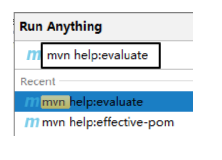

#### ③运行结果

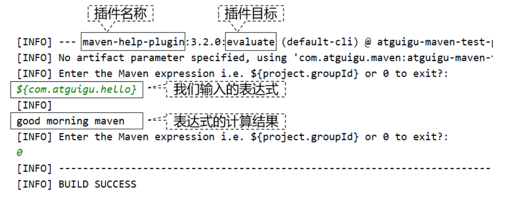

### 3、通过 Maven 访问系统属性

#### ① Java 系统属性一览

##### [1] Java 代码

```java
Properties properties = System.getProperties();
Set<Object> propNameSet = properties.keySet();
for (Object propName : propNameSet) {
    String propValue = properties.getProperty((String) propName);
    System.out.println(propName + " = " + propValue);
}
```

##### [2]运行结果

> java.runtime.name = Java(TM) SE Runtime Environment
> sun.boot.library.path = D:\software\Java\jre\bin
> java.vm.version = 25.141-b15
> java.vm.vendor = Oracle Corporation
> java.vendor.url = http://java.oracle.com/
> path.separator = ;
> java.vm.name = Java HotSpot(TM) 64-Bit Server VM
> file.encoding.pkg = sun.io
> user.country = CN
> user.script =
> sun.java.launcher = SUN_STANDARD
> sun.os.patch.level =
> java.vm.specification.name = Java Virtual Machine Specification
> user.dir = D:\idea2019workspace\atguigu-maven-test-prepare
> java.runtime.version = 1.8.0_141-b15
> java.awt.graphicsenv = sun.awt.Win32GraphicsEnvironment
> java.endorsed.dirs = D:\software\Java\jre\lib\endorsed
> os.arch = amd64
> java.io.tmpdir = C:\Users\ADMINI~1\AppData\Local\Temp\
> line.separator =
> java.vm.specification.vendor = Oracle Corporation
> user.variant =
> os.name = Windows 10
> sun.jnu.encoding = GBK
> java.library.path = D:\software\Java\bin;C:\WINDOWS\Sun\Java\bin;C:\WIN……
> java.specification.name = Java Platform API Specification
> java.class.version = 52.0
> sun.management.compiler = HotSpot 64-Bit Tiered Compilers
> os.version = 10.0
> user.home = C:\Users\Administrator
> user.timezone =
> java.awt.printerjob = sun.awt.windows.WPrinterJob
> file.encoding = UTF-8
> java.specification.version = 1.8
> java.class.path = D:\software\Java\jre\lib\charsets.jar;D:\softw……
> user.name = Administrator
> java.vm.specification.version = 1.8
> sun.java.command = com.atguigu.maven.MyTest
> java.home = D:\software\Java\jre
> sun.arch.data.model = 64
> user.language = zh
> java.specification.vendor = Oracle Corporation
> awt.toolkit = sun.awt.windows.WToolkit
> java.vm.info = mixed mode
> java.version = 1.8.0_141
> java.ext.dirs = D:\software\Java\jre\lib\ext;C:\WINDOWS\Sun\Java\lib\ext
> sun.boot.class.path = D:\software\Java\jre\lib\resources.jar;D:\sof……
> java.vendor = Oracle Corporation
> file.separator = \
> java.vendor.url.bug = http://bugreport.sun.com/bugreport/
> sun.io.unicode.encoding = UnicodeLittle
> sun.cpu.endian = little
> sun.desktop = windows
> sun.cpu.isalist = amd64

#### ②使用 Maven 访问系统属性

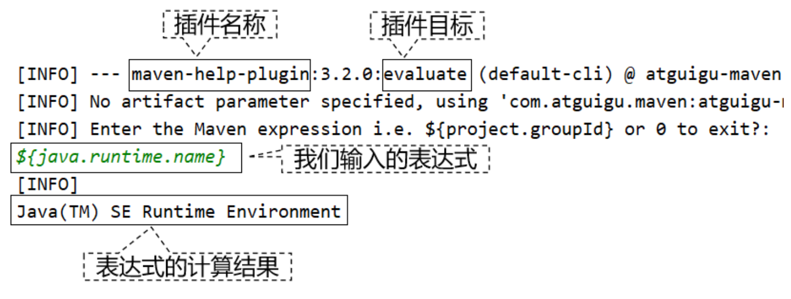

### 4、访问系统环境变量

${env.系统环境变量名}

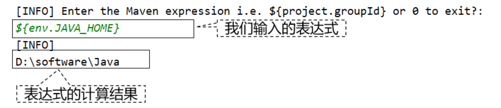

### 5、访问 project 属性

#### ①含义

使用表达式 ${project.xxx} 可以访问当前 POM 中的元素值。

#### ②访问一级标签

${ project.标签名 }

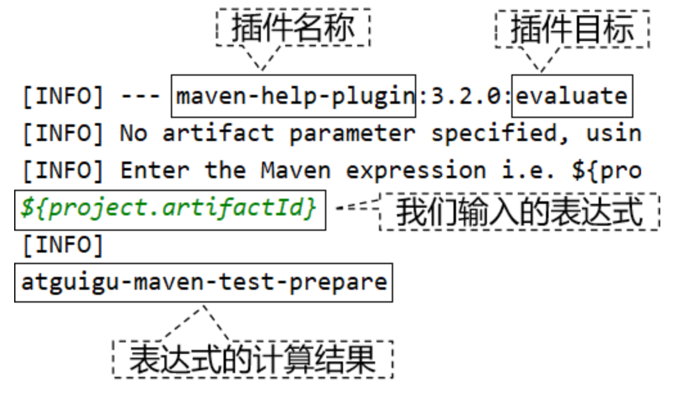

#### ③访问子标签

${ project.标签名.子标签名 }

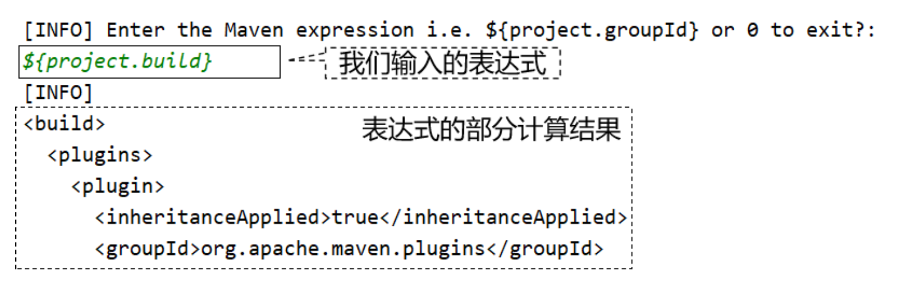

#### ④访问列表标签

> `${project.标签名[下标]}`


### 6、访问 settings 全局配置

${settings.标签名} 可以访问 settings.xml 中配置的元素值。


### 7、用途

- 在当前 pom.xml 文件中引用属性
- 资源过滤功能：在非 Maven 配置文件中引用属性，由 Maven 在处理资源时将引用属性的表达式替换为属性值

## 第四节 build 标签详解

### 1、一睹真容

在实际使用 Maven 的过程中，我们会发现 build 标签有时候有，有时候没，这是怎么回事呢？其实通过有效 POM 我们能够看到，build 标签的相关配置其实一直都在，只是在我们需要定制构建过程的时候才会通过配置 build 标签覆盖默认值或补充配置。这一点我们可以通过打印有效 POM 来看到。

> 从有效POM中提取的完整 build 标签

```xml
<build>
    <sourceDirectory>D:\idea2019workspace\atguigu-maven-test-prepare\src\main\java</sourceDirectory>
    <scriptSourceDirectory>D:\idea2019workspace\atguigu-maven-test-prepare\src\main\scripts</scriptSourceDirectory>
    <testSourceDirectory>D:\idea2019workspace\atguigu-maven-test-prepare\src\test\java</testSourceDirectory>
    <outputDirectory>D:\idea2019workspace\atguigu-maven-test-prepare\target\classes</outputDirectory>
    <testOutputDirectory>D:\idea2019workspace\atguigu-maven-test-prepare\target\test-classes</testOutputDirectory>
    <resources>
        <resource>
            <directory>D:\idea2019workspace\atguigu-maven-test-prepare\src\main\resources</directory>
        </resource>
    </resources>
    <testResources>
        <testResource>
            <directory>D:\idea2019workspace\atguigu-maven-test-prepare\src\test\resources</directory>
        </testResource>
    </testResources>
    <directory>D:\idea2019workspace\atguigu-maven-test-prepare\target</directory>
    <finalName>atguigu-maven-test-prepare-1.0-SNAPSHOT</finalName>
    <pluginManagement>
        <plugins>
            <plugin>
                <artifactId>maven-antrun-plugin</artifactId>
                <version>1.3</version>
            </plugin>
            <plugin>
                <artifactId>maven-assembly-plugin</artifactId>
                <version>2.2-beta-5</version>
            </plugin>
            <plugin>
                <artifactId>maven-dependency-plugin</artifactId>
                <version>2.8</version>
            </plugin>
            <plugin>
                <artifactId>maven-release-plugin</artifactId>
                <version>2.5.3</version>
            </plugin>
        </plugins>
    </pluginManagement>
    <plugins>
        <plugin>
            <artifactId>maven-clean-plugin</artifactId>
            <version>2.5</version>
            <executions>
                <execution>
                    <id>default-clean</id>
                    <phase>clean</phase>
                    <goals>
                        <goal>clean</goal>
                    </goals>
                </execution>
            </executions>
        </plugin>
        <plugin>
            <artifactId>maven-resources-plugin</artifactId>
            <version>2.6</version>
            <executions>
                <execution>
                    <id>default-testResources</id>
                    <phase>process-test-resources</phase>
                    <goals>
                        <goal>testResources</goal>
                    </goals>
                </execution>
                <execution>
                    <id>default-resources</id>
                    <phase>process-resources</phase>
                    <goals>
                        <goal>resources</goal>
                    </goals>
                </execution>
            </executions>
        </plugin>
        <plugin>
            <artifactId>maven-jar-plugin</artifactId>
            <version>2.4</version>
            <executions>
                <execution>
                    <id>default-jar</id>
                    <phase>package</phase>
                    <goals>
                        <goal>jar</goal>
                    </goals>
                </execution>
            </executions>
        </plugin>
        <plugin>
            <artifactId>maven-compiler-plugin</artifactId>
            <version>3.1</version>
            <executions>
                <execution>
                    <id>default-compile</id>
                    <phase>compile</phase>
                    <goals>
                        <goal>compile</goal>
                    </goals>
                </execution>
                <execution>
                    <id>default-testCompile</id>
                    <phase>test-compile</phase>
                    <goals>
                        <goal>testCompile</goal>
                    </goals>
                </execution>
            </executions>
        </plugin>
        <plugin>
            <artifactId>maven-surefire-plugin</artifactId>
            <version>2.12.4</version>
            <executions>
                <execution>
                    <id>default-test</id>
                    <phase>test</phase>
                    <goals>
                        <goal>test</goal>
                    </goals>
                </execution>
            </executions>
        </plugin>
        <plugin>
            <artifactId>maven-install-plugin</artifactId>
            <version>2.4</version>
            <executions>
                <execution>
                    <id>default-install</id>
                    <phase>install</phase>
                    <goals>
                        <goal>install</goal>
                    </goals>
                </execution>
            </executions>
        </plugin>
        <plugin>
            <artifactId>maven-deploy-plugin</artifactId>
            <version>2.7</version>
            <executions>
                <execution>
                    <id>default-deploy</id>
                    <phase>deploy</phase>
                    <goals>
                        <goal>deploy</goal>
                    </goals>
                </execution>
            </executions>
        </plugin>
        <plugin>
            <artifactId>maven-site-plugin</artifactId>
            <version>3.3</version>
            <executions>
                <execution>
                    <id>default-site</id>
                    <phase>site</phase>
                    <goals>
                        <goal>site</goal>
                    </goals>
                    <configuration>
                        <outputDirectory>D:\idea2019workspace\atguigu-maven-test-prepare\target\site</outputDirectory>
                        <reportPlugins>
                            <reportPlugin>
                                <groupId>org.apache.maven.plugins</groupId>
                                <artifactId>maven-project-info-reports-plugin</artifactId>
                            </reportPlugin>
                        </reportPlugins>
                    </configuration>
                </execution>
                <execution>
                    <id>default-deploy</id>
                    <phase>site-deploy</phase>
                    <goals>
                        <goal>deploy</goal>
                    </goals>
                    <configuration>
                        <outputDirectory>D:\idea2019workspace\atguigu-maven-test-prepare\target\site</outputDirectory>
                        <reportPlugins>
                            <reportPlugin>
                                <groupId>org.apache.maven.plugins</groupId>
                                <artifactId>maven-project-info-reports-plugin</artifactId>
                            </reportPlugin>
                        </reportPlugins>
                    </configuration>
                </execution>
            </executions>
            <configuration>
                <outputDirectory>D:\idea2019workspace\atguigu-maven-test-prepare\target\site</outputDirectory>
                <reportPlugins>
                    <reportPlugin>
                        <groupId>org.apache.maven.plugins</groupId>
                        <artifactId>maven-project-info-reports-plugin</artifactId>
                    </reportPlugin>
                </reportPlugins>
            </configuration>
        </plugin>
    </plugins>
</build>
```

所以**本质**上来说：我们配置的 build 标签都是对**超级 POM 配置**的**叠加**。那我们又为什么要在默认配置的基础上叠加呢？很简单，在默认配置无法满足需求的时候**定制构建过程**。

### 2、build 标签组成

从完整示例中我们能够看到，build 标签的子标签大致包含三个主体部分：

#### ①定义约定的目录结构

参考示例中的如下部分：

```xml
<sourceDirectory>D:\idea2019workspace\atguigu-maven-test-prepare\src\main\java</sourceDirectory>
<scriptSourceDirectory>D:\idea2019workspace\atguigu-maven-test-prepare\src\main\scripts</scriptSourceDirectory>
<testSourceDirectory>D:\idea2019workspace\atguigu-maven-test-prepare\src\test\java</testSourceDirectory>
<outputDirectory>D:\idea2019workspace\atguigu-maven-test-prepare\target\classes</outputDirectory>
<testOutputDirectory>D:\idea2019workspace\atguigu-maven-test-prepare\target\test-classes</testOutputDirectory>
<resources>
    <resource>
        <directory>D:\idea2019workspace\atguigu-maven-test-prepare\src\main\resources</directory>
    </resource>
</resources>
<testResources>
    <testResource>
        <directory>D:\idea2019workspace\atguigu-maven-test-prepare\src\test\resources</directory>
    </testResource>
</testResources>
<directory>D:\idea2019workspace\atguigu-maven-test-prepare\target</directory>
```

我们能看到各个目录的作用如下：

|        目录名         |            作用            |
| :-------------------: | :------------------------: |
|    sourceDirectory    |     主体源程序存放目录     |
| scriptSourceDirectory |     脚本源程序存放目录     |
|  testSourceDirectory  |     测试源程序存放目录     |
|    outputDirectory    | 主体源程序编译结果输出目录 |
|  testOutputDirectory  | 测试源程序编译结果输出目录 |
|       resources       |    主体资源文件存放目录    |
|     testResources     |    测试资源文件存放目录    |
|       directory       |      构建结果输出目录      |

#### ②备用插件管理

pluginManagement 标签存放着几个极少用到的插件：

- maven-antrun-plugin
- maven-assembly-plugin
- maven-dependency-plugin
- maven-release-plugin

通过 pluginManagement 标签管理起来的插件就像 dependencyManagement 一样，子工程使用时可以省略版本号，起到在父工程中统一管理版本的效果。情看下面例子：

- 被 spring-boot-dependencies 管理的插件信息：

```xml
<plugin>
	<groupId>org.springframework.boot</groupId>
	<artifactId>spring-boot-maven-plugin</artifactId>
	<version>2.6.2</version>
</plugin>
```

- 子工程使用的插件信息：

```xml
<build>
    <plugins>
        <plugin>
            <groupId>org.springframework.boot</groupId>
            <artifactId>spring-boot-maven-plugin</artifactId>
        </plugin>
    </plugins>
</build>
```

#### ③生命周期插件

plugins 标签存放的是默认生命周期中实际会用到的插件，这些插件想必大家都不陌生，所以抛开插件本身不谈，我们来看看 plugin 标签的结构：

```xml
<plugin>
    <artifactId>maven-compiler-plugin</artifactId>
    <version>3.1</version>
    <executions>
        <execution>
            <id>default-compile</id>
            <phase>compile</phase>
            <goals>
                <goal>compile</goal>
            </goals>
        </execution>
        <execution>
            <id>default-testCompile</id>
            <phase>test-compile</phase>
            <goals>
                <goal>testCompile</goal>
            </goals>
        </execution>
    </executions>
</plugin>
```

##### [1]坐标部分

artifactId 和 version 标签定义了插件的坐标，作为 Maven 的自带插件这里省略了 groupId。

##### [2]执行部分

executions 标签内可以配置多个 execution 标签，execution 标签内：

- id：指定唯一标识
- phase：关联的生命周期阶段
- goals/goal：关联指定生命周期的目标
  - goals 标签中可以配置多个 goal 标签，表示一个生命周期环节可以对应当前插件的多个目标。

另外，插件目标的执行过程可以进行配置，例如 maven-site-plugin 插件的 site 目标：

```xml
<execution>
    <id>default-site</id>
    <phase>site</phase>
    <goals>
        <goal>site</goal>
    </goals>
    <configuration>
        <outputDirectory>D:\idea2019workspace\atguigu-maven-test-prepare\target\site</outputDirectory>
        <reportPlugins>
            <reportPlugin>
                <groupId>org.apache.maven.plugins</groupId>
                <artifactId>maven-project-info-reports-plugin</artifactId>
            </reportPlugin>
        </reportPlugins>
    </configuration>
</execution>
```

configuration 标签内进行配置时使用的标签是插件本身定义的。就以 maven-site-plugin 插件为例，它的核心类是 org.apache.maven.plugins.site.render.SiteMojo，在这个类中我们看到了 outputDirectory 属性：

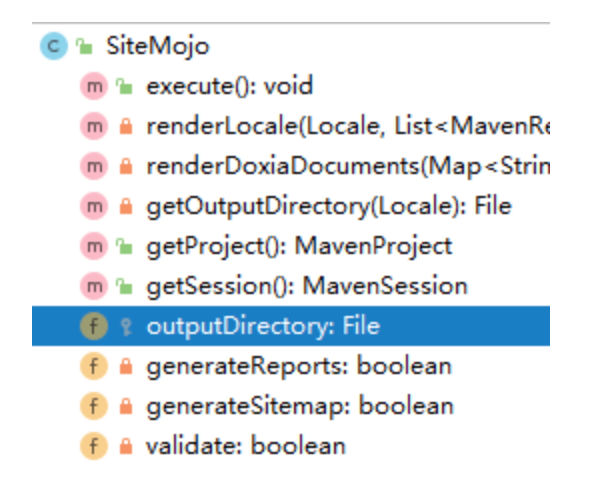

SiteMojo 的父类是：AbstractSiteRenderingMojo，在父类中我们看到 reportPlugins 属性：

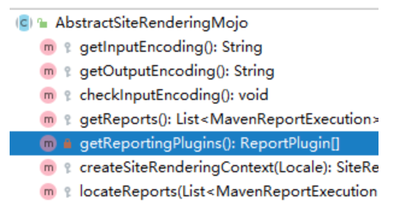

**结论**：每个插件能够做哪些设置都是各个插件自己规定的，无法一概而论。

### 3、典型应用：指定 JDK 版本

#### ①提出问题

前面我们在 settings.xml 中配置了 JDK 版本，那么将来把 Maven 工程部署都服务器上，脱离了 settings.xml 配置，如何保证程序正常运行呢？思路就是我们直接把 JDK 版本信息告诉负责编译操作的 maven-compiler-plugin 插件，让它在构建过程中，按照我们指定的信息工作。

#### ②暂时取消 settings.xml 配置

为了测试对 maven-compiler-plugin 插件进行配置的效果，我们暂时取消 settings.xml 中的 profile 配置。

```xml
<!-- 配置Maven工程的默认JDK版本 -->
<!-- <profile>
  <id>jdk-1.8</id>
  <activation>
	<activeByDefault>true</activeByDefault>
	<jdk>1.8</jdk>
  </activation>
  <properties>
	<maven.compiler.source>1.8</maven.compiler.source>
	<maven.compiler.target>1.8</maven.compiler.target>
	<maven.compiler.compilerVersion>1.8</maven.compiler.compilerVersion>
  </properties>
</profile> -->
```

#### ③编写源文件代码

很明显这里用到了 Lambda 表达式，这是 JDK 1.8 才支持的语法。

```java
package com.atguigu.maven;

public class Hello {

    public void hello() {
        new Thread(()->{
            System.out.println("thread ...");
        }).start();
    }

}
```

此时我们执行编译命令：

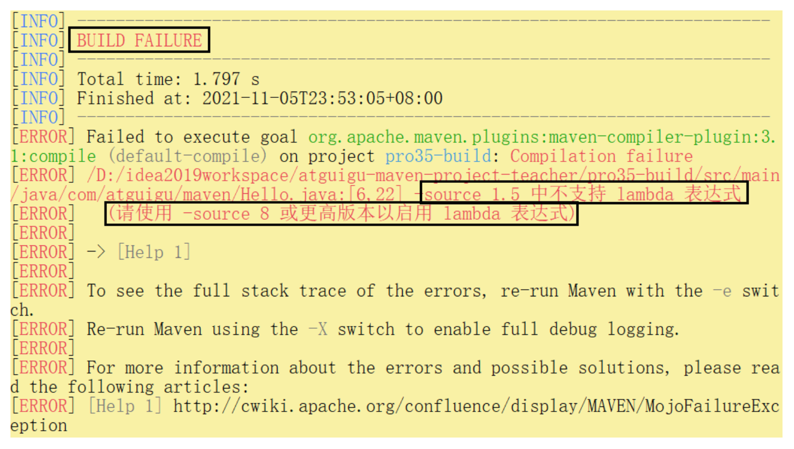

#### ④配置构建过程

```xml
<!-- build 标签：意思是告诉 Maven，你的构建行为，我要开始定制了！ -->
<build>
    <!-- plugins 标签：Maven 你给我听好了，你给我构建的时候要用到这些插件！ -->
    <plugins>
        <!-- plugin 标签：这是我要指定的一个具体的插件 -->
        <plugin>
            <!-- 插件的坐标。此处引用的 maven-compiler-plugin 插件不是第三方的，是一个 Maven 自带的插件。 -->
            <groupId>org.apache.maven.plugins</groupId>
            <artifactId>maven-compiler-plugin</artifactId>
            <version>3.1</version>
            
            <!-- configuration 标签：配置 maven-compiler-plugin 插件 -->
            <configuration>
                <!-- 具体配置信息会因为插件不同、需求不同而有所差异 -->
                <source>1.8</source>
                <target>1.8</target>
                <encoding>UTF-8</encoding>
            </configuration>
        </plugin>
    </plugins>
</build>
```

#### ⑤再次执行编译命令

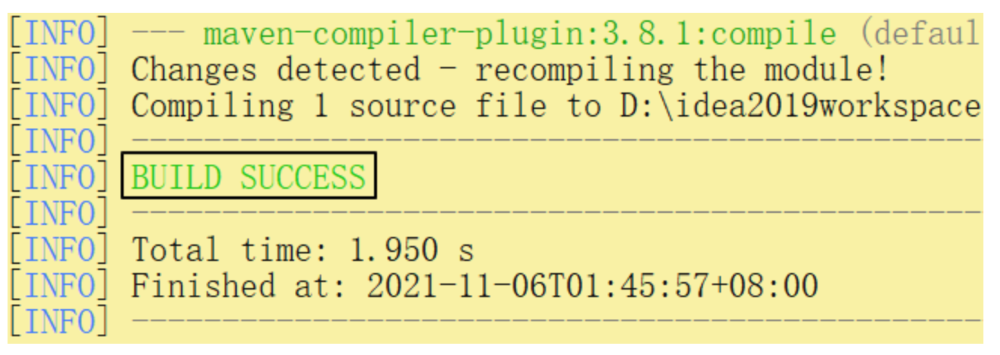

#### ⑥两种配置方式比较

- settings.xml 中配置：仅在本地生效，如果脱离当前 settings.xml 能够覆盖的范围，则无法生效。
- 在当前 Maven 工程 pom.xml 中配置：无论在哪个环境执行编译等构建操作都有效。

#### ⑦补充说明

##### [1]source 标签含义

查看 [Maven 官网页面 (opens new window)](http://maven.apache.org/plugins/maven-compiler-plugin/compile-mojo.html)，我们找到 source 标签的介绍：

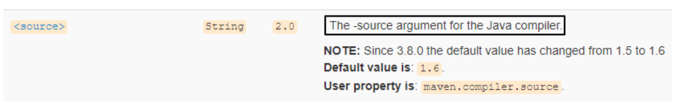

翻译过来就是：调用 Java 编译器命令时传入的 -source 参数。那对编译器来说，-source 参数是啥意思呢？

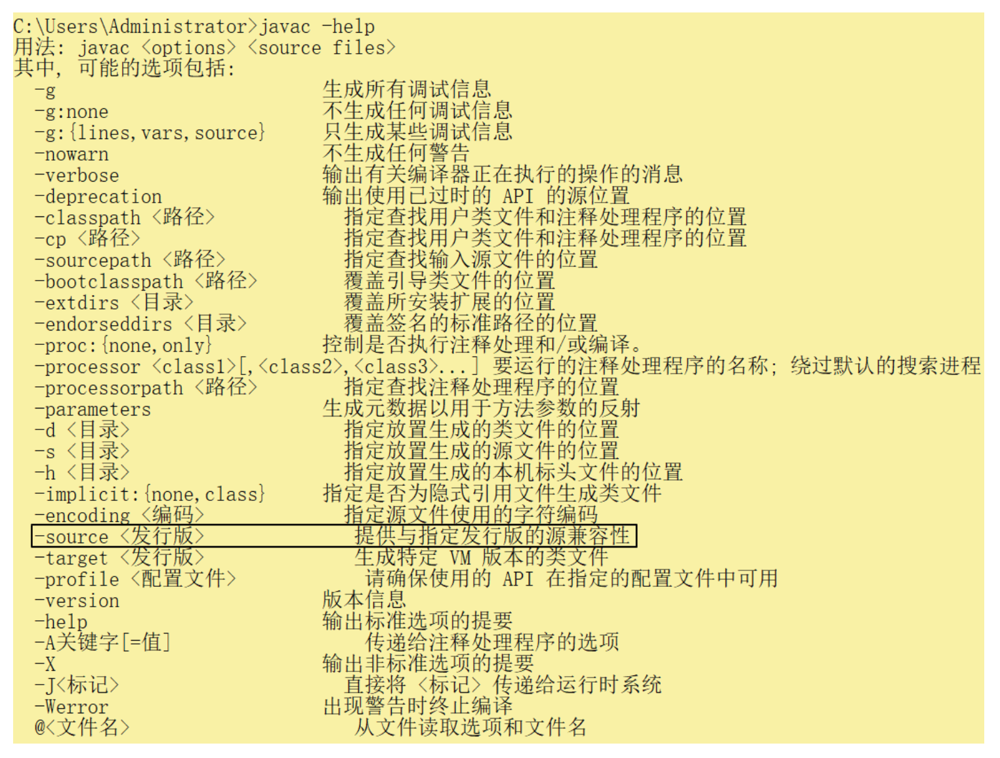

『提供与指定发行版的源兼容性』这句话我的理解是：

- 我们写代码是按 JDK 1.8 写的——这就是『源兼容性』里的『源』。
- 指定发行版就是我们指定的 JDK 1.8。
- 『兼容性』是谁和谁兼容呢？现在源代码是既定的，所以就是要求编译器使用指定的 JDK 版本来兼容我们的源代码。


另外我们还看到：

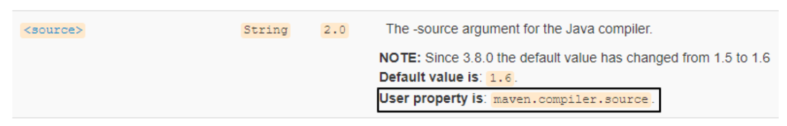

这个功能还可以通过在 properties 标签中配置 maven.compiler.source 属性来实现。所以我们也经常会看到类似这样的配置：

```xml
<properties>
    <maven.compiler.source>1.8</maven.compiler.source>
    <maven.compiler.target>1.8</maven.compiler.target>
    <project.build.sourceEncoding>UTF-8</project.build.sourceEncoding>
</properties>
```

##### [2]target 标签含义

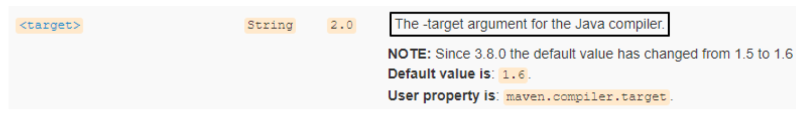

翻译过来就是：调用 Java 编译器命令时传入的 -target 参数。那对编译器来说，-target 参数是啥意思呢？


『生成特定 VM 版本的类文件』这句话我的理解是：

- VM 指 JVM
- 类文件指 *.class 字节码文件
- 整体意思就是源文件编译后，生成的 *.class 字节码文件要符合指定的 JVM 版本

### 4、典型应用：SpringBoot 定制化打包

#### ①需求

很显然 spring-boot-maven-plugin 并不是 Maven 自带的插件，而是 SpringBoot 提供的，用来改变 Maven 默认的构建行为。具体来说是改变打包的行为。默认情况下 Maven 调用 maven-jar-plugin 插件的 jar 目标，生成普通的 jar 包。

普通 jar 包没法使用 java -jar xxx.jar 这样的命令来启动、运行，但是 SpringBoot 的设计理念就是每一个『微服务』导出为一个 jar 包，这个 jar 包可以使用 java -jar xxx.jar 这样的命令直接启动运行。

这样一来，打包的方式肯定要进行调整。所以 SpringBoot 提供了 spring-boot-maven-plugin 这个插件来定制打包行为。

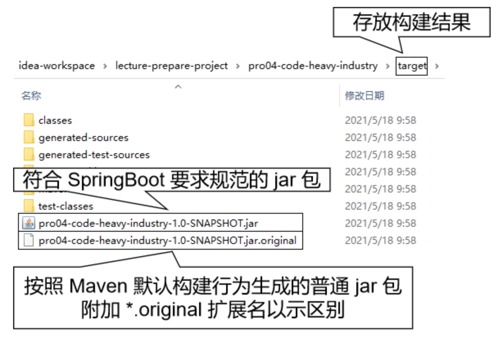

#### ②示例代码

所有的一切已经都被 SpringBoot 封装好了，所以配置非常简单，提供插件坐标即可。

```xml
<build>
	<plugins>
		<plugin>
			<groupId>org.springframework.boot</groupId>
			<artifactId>spring-boot-maven-plugin</artifactId>
			<version>2.5.5</version>
		</plugin>
	</plugins>
</build>
```

#### ③插件的七个目标

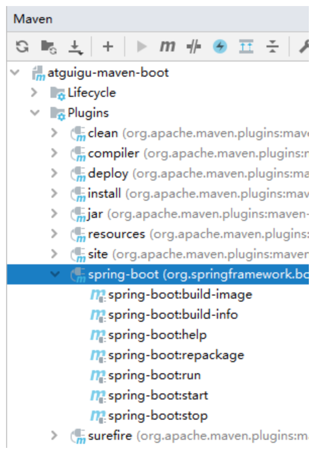

| 目标名称                | 作用                                                         |
| ----------------------- | ------------------------------------------------------------ |
| spring-boot:build-image | Package an application into a OCI image using a buildpack.   |
| spring-boot:build-info  | Generate a build-info.properties file based on the content of the current MavenProject. |
| spring-boot:help        | Display help information on spring-boot-maven-plugin. Call mvn spring-boot:help -Ddetail=true -Dgoal=< goal-name > to display parameter details. |
| spring-boot:repackage   | Repackage existing JAR and WAR archives so that they can be executed from the command line using java -jar. With layout=NONE can also be used simply to package a JAR with nested dependencies (and no main class, so not executable). |
| spring-boot:run         | Run an application in place.                                 |
| spring-boot:start       | Start a spring application. Contrary to the run goal, this does not block and allows other goals to operate on the application. This goal is typically used in integration test scenario where the application is started before a test suite and stopped after. |
| spring-boot:stop        | Stop an application that has been started by the 'start' goal. Typically invoked once a test suite has completed. |

### 5、典型应用：Mybatis 逆向工程

使用 Mybatis 的逆向工程需要使用如下配置，MBG 插件的特点是需要提供插件所需的依赖：

```xml
<!-- 控制 Maven 在构建过程中相关配置 -->
<build>
		
	<!-- 构建过程中用到的插件 -->
	<plugins>
		
		<!-- 具体插件，逆向工程的操作是以构建过程中插件形式出现的 -->
		<plugin>
			<groupId>org.mybatis.generator</groupId>
			<artifactId>mybatis-generator-maven-plugin</artifactId>
			<version>1.3.0</version>
	
			<!-- 插件的依赖 -->
			<dependencies>
				
				<!-- 逆向工程的核心依赖 -->
				<dependency>
					<groupId>org.mybatis.generator</groupId>
					<artifactId>mybatis-generator-core</artifactId>
					<version>1.3.2</version>
				</dependency>
					
				<!-- 数据库连接池 -->
				<dependency>
					<groupId>com.mchange</groupId>
					<artifactId>c3p0</artifactId>
					<version>0.9.2</version>
				</dependency>
					
				<!-- MySQL驱动 -->
				<dependency>
					<groupId>mysql</groupId>
					<artifactId>mysql-connector-java</artifactId>
					<version>5.1.8</version>
				</dependency>
			</dependencies>
		</plugin>
	</plugins>
</build>
```

### 6、小结

不知大家有没有发现，通常需要用到 build 标签的时候底层都会帮我们封装好，需要我们配置的地方不多。即使有些地方需要我们配置，也不会真的我们自己去写，把现成的案例复制过来就行。

所以对 build 标签来说，我们的掌握要求就是：**能大致看懂**就行。


## 第五节 依赖配置补充

> TIP
>
> [Maven 官网介绍依赖机制](https://maven.apache.org/guides/introduction/introduction-to-dependency-mechanism.html)

### 1、依赖范围

#### ①import

管理依赖最基本的办法是继承父工程，但是和 Java 类一样，Maven 也是单继承的。如果不同体系的依赖信息封装在不同 POM 中了，没办法继承多个父工程怎么办？这时就可以使用 import 依赖范围。

典型案例当然是在项目中引入 SpringBoot、SpringCloud 依赖：

```xml
<dependencyManagement>
    <dependencies>

        <!-- SpringCloud 依赖导入 -->
        <dependency>
            <groupId>org.springframework.cloud</groupId>
            <artifactId>spring-cloud-dependencies</artifactId>
            <version>Hoxton.SR9</version>
            <type>pom</type>
            <scope>import</scope>
        </dependency>

        <!-- SpringCloud Alibaba 依赖导入 -->
        <dependency>
            <groupId>com.alibaba.cloud</groupId>
            <artifactId>spring-cloud-alibaba-dependencies</artifactId>
            <version>2.2.6.RELEASE</version>
            <type>pom</type>
            <scope>import</scope>
        </dependency>

        <!-- SpringBoot 依赖导入 -->
        <dependency>
            <groupId>org.springframework.boot</groupId>
            <artifactId>spring-boot-dependencies</artifactId>
            <version>2.3.6.RELEASE</version>
            <type>pom</type>
            <scope>import</scope>
        </dependency>
    </dependencies>
</dependencyManagement>
```

import 依赖范围使用要求：

- 打包类型必须是 pom
- 必须放在 dependencyManagement 中

> 官网说明如下：
>
> This scope is only supported on a dependency of type `pom` in the `<dependencyManagement>` section. It indicates the dependency is to be replaced with the effective list of dependencies in the specified POM's `<dependencyManagement>` section. Since they are replaced, dependencies with a scope of `import` do not actually participate in limiting the transitivity of a dependency.

#### ②system

以 Windows 系统环境下开发为例，假设现在 D:\tempare\atguigu-maven-test-aaa-1.0-SNAPSHOT.jar 想要引入到我们的项目中，此时我们就可以将依赖配置为 system 范围：

```xml
<dependency>
    <groupId>com.atguigu.maven</groupId>
    <artifactId>atguigu-maven-test-aaa</artifactId>
    <version>1.0-SNAPSHOT</version>
    <systemPath>D:\tempare\atguigu-maven-test-aaa-1.0-SNAPSHOT.jar</systemPath>
    <scope>system</scope>
</dependency>
```

但是很明显：这样引入依赖完全不具有可移植性，所以**不要使用**。如果需要引入体系外 jar 包我们后面会讲专门的办法。

#### ③runtime

专门用于编译时不需要，但是运行时需要的 jar 包。比如：编译时我们根据接口调用方法，但是实际运行时需要的是接口的实现类。典型案例是：

```xml
<!--热部署 -->
<dependency>
    <groupId>org.springframework.boot</groupId>
    <artifactId>spring-boot-devtools</artifactId>
    <scope>runtime</scope>
    <optional>true</optional>
</dependency>
```

### 2、可选依赖

#### ①配置举例

```xml
<!--热部署 -->
<dependency>
    <groupId>org.springframework.boot</groupId>
    <artifactId>spring-boot-devtools</artifactId>
    <scope>runtime</scope>
    <optional>true</optional>
</dependency>
```

#### ②本质含义

可选其实就是『可有可无』。官网的解释是：

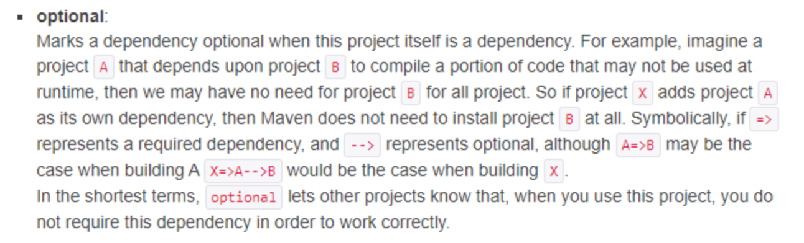

其核心含义是：Project X 依赖 Project A，A 中一部分 X 用不到的代码依赖了 B，那么对 X 来说 B 就是『可有可无』的。

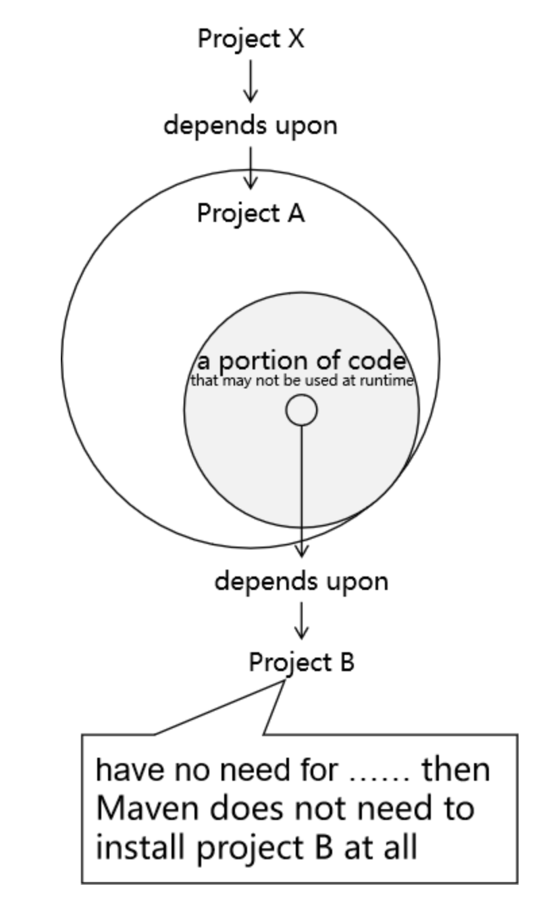

### 3、版本仲裁

#### ①最短路径优先

在下图的例子中，对模块 pro25-module-a 来说，Maven 会采纳 1.2.12 版本。


#### ②路径相同时先声明者优先

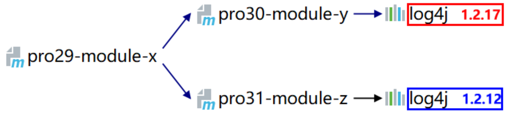

此时 Maven 采纳哪个版本，取决于在 pro29-module-x 中，对 pro30-module-y 和 pro31-module-z 两个模块的依赖哪一个先声明。

#### ③小结

其实 Maven 的版本仲裁机制只是在没有人为干预的情况下，自主决定 jar 包版本的一个办法。而实际上我们要使用具体的哪一个版本，还要取决于项目中的实际情况。所以在项目正常运行的情况下，jar 包版本可以由 Maven 仲裁，不必我们操心；而发生冲突时 Maven 仲裁决定的版本无法满足要求，此时就应该由程序员明确指定 jar 包版本。


## 第六节 Maven 自定义插件

### 1、本节定位

其实实际开发中几乎没有什么场景需要我们开发自定义 Maven 插件，所以本节只是通过这个角度帮助我们更好的理解插件的目标和生命周期阶段之间的关系。

### 2、插件开发

####  ①创建工程

[略]

#### ②设定打包方式

```xml
<packaging>maven-plugin</packaging>
```

#### ③引入依赖

下面两种方式二选一：

##### [1]将来在文档注释中使用注解

```xml
<dependency>
    <groupId>org.apache.maven</groupId>
    <artifactId>maven-plugin-api</artifactId>
    <version>3.5.2</version>
</dependency>
```

##### [2]将来直接使用注解

```xml
<dependency>
    <groupId>org.apache.maven.plugin-tools</groupId>
    <artifactId>maven-plugin-annotations</artifactId>
    <version>3.5.2</version>
</dependency>
```

#### ④创建 Mojo 类

Mojo 类是一个 Maven 插件的核心类。

Mojo 这个单词的意思是：Maven Old Java Object，其实 mojo 这个单词本身包含魔力;符咒(袋);护身符;(人的)魅力的含义，Maven 用 Mojo 是因为它是对 POJO 开的一个小玩笑。

##### [1] Mojo 接口

每一个 Mojo 都需要实现 org.apache.maven.plugin.Mojo 接口。

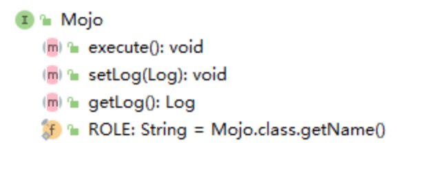

##### [2] AbstractMojo 抽象类

我们实现 Mojo 接口比较困难，幸好可以继承 AbstractMojo，此时我们只要实现 execute() 这一个方法即可。

```java
public class MyHelloPlugin extends AbstractMojo {
    @Override
    public void execute() throws MojoExecutionException, MojoFailureException {
        getLog().info("---> This is my first maven plugin. <---");
    }
}
```

### 3、插件配置

#### ①Mojo 类中的配置

##### [1]文档注释中用注解

对应的 pom.xml 中的依赖： maven-plugin-api

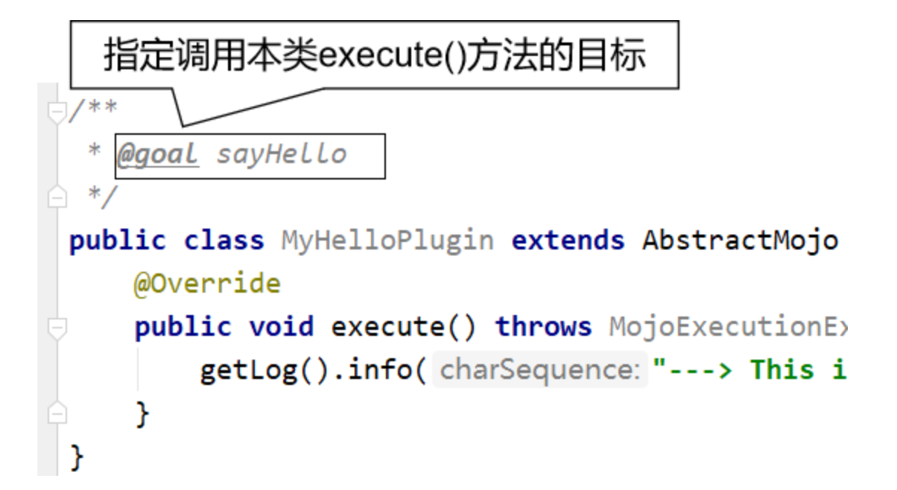

##### [2]直接在类上标记注解

对应 pom.xml 中的依赖：maven-plugin-annotations

```java
// name 属性：指定目标名称
@Mojo(name = "firstBlood")
public class MyPluginOfFistBlood extends AbstractMojo {
    @Override
    public void execute() throws MojoExecutionException, MojoFailureException {
        getLog().info("---> first blood <---");
    }
}
```

#### ②安装插件

要在后续使用插件，就必须至少将插件安装到本地仓库。

#### ③注册插件

我们需要将插件坐标中的 groupId 部分注册到 **settings.xml** 中。

```xml
<pluginGroups>
	<!-- pluginGroup
	 | Specifies a further group identifier to use for plugin lookup.
	<pluginGroup>com.your.plugins</pluginGroup>
	-->
	<pluginGroup>com.atguigu.maven</pluginGroup>
</pluginGroups>
```

### 4、使用插件

#### ①识别插件前缀

Maven 根据插件的 artifactId 来识别插件前缀。例如下面两种情况：

##### [1]前置匹配

- 匹配规则：${prefix}-maven-plugin
- artifactId：hello-maven-plugin
- 前缀：hello

##### [2]中间匹配

- 匹配规则：maven-${prefix}-plugin
- artifactId：maven-good-plugin
- 前缀：good

#### ②在命令行直接用

- 命令：

```sh
mvn hello:sayHello
```

- 效果：

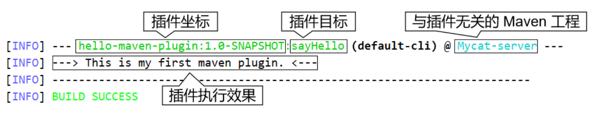

#### ③配置到 build 标签里

这里找一个和插件无关的 Maven 工程配置才有说服力。

##### [1]配置

```xml
<build>
	<plugins>
		<plugin>
			<groupId>com.atguigu.maven</groupId>
			<artifactId>hello-maven-plugin</artifactId>
			<version>1.0-SNAPSHOT</version>
			<executions>
				<execution>
                    <id>hello</id>
                    <!-- 指定和目标关联的生命周期阶段 -->
					<phase>clean</phase>
					<goals>
						<goal>sayHello</goal>
					</goals>
				</execution>
                <execution>
                    <id>blood</id>
                    <phase>validate</phase>
                    <goals>
                        <goal>firstBlood</goal>
                    </goals>
                </execution>
			</executions>
		</plugin>
	</plugins>
</build>
```

##### [2]效果

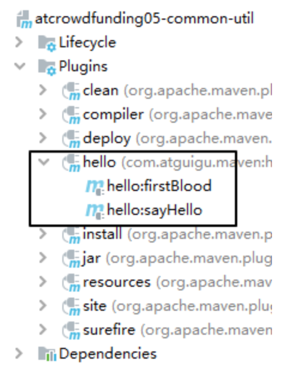

##### [3]图形化界面使用

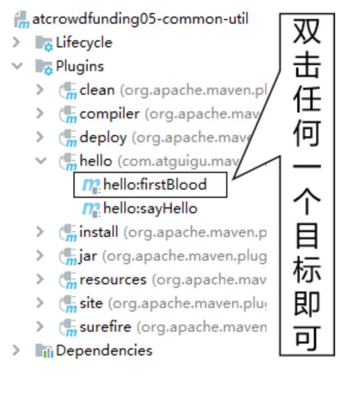

##### [4]命令行使用

执行已和插件目标绑定的生命周期：

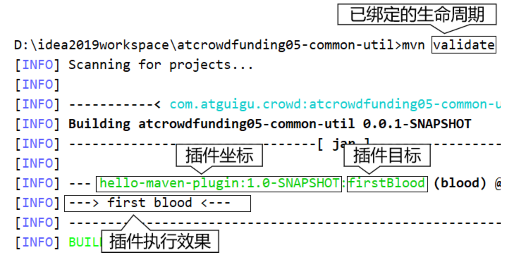

## 第七节 profile 详解

### 1、profile 概述

#### ①单词释义

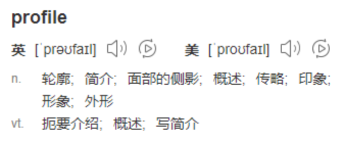

这里我们可以对接 profile 这个单词中『侧面』这个含义：项目的每一个运行环境，相当于是项目整体的一个侧面。


#### ②项目的不同运行环境

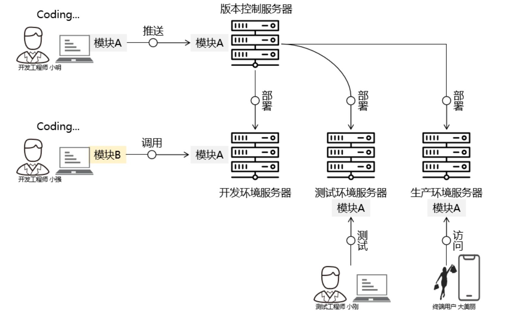

通常情况下，我们至少有三种运行环境：

- 开发环境：供不同开发工程师开发的各个模块之间互相调用、访问；内部使用
- 测试环境：供测试工程师对项目的各个模块进行功能测试；内部使用
- 生产环境：供最终用户访问——所以这是正式的运行环境，对外提供服务

而我们这里的『环境』仍然只是一个笼统的说法，实际工作中一整套运行环境会包含很多种不同服务器：

- MySQL
- Redis
- ElasticSearch
- RabbitMQ
- FastDFS
- Nginx
- Tomcat
- ……

就拿其中的 MySQL 来说，不同环境下的访问参数肯定完全不同：

| 开发环境                                                     | 测试环境                                                     | 生产环境                                                     |
| ------------------------------------------------------------ | ------------------------------------------------------------ | ------------------------------------------------------------ |
| dev.driver=com.mysql.jdbc.Driver dev.url=jdbc:mysql://124.71.36.17:3306/db-sys dev.username=root dev.password=atguigu | test.driver=com.mysql.jdbc.Driver test.url=jdbc:mysql://124.71.36.89:3306/db-sys test.username=dev-team test.password=atguigu | product.driver=com.mysql.jdbc.Driver product.url=jdbc:mysql://39.107.88.164:3306/prod-db-sys product.username=root product.password=atguigu |

可是代码只有一套。如果在 jdbc.properties 里面来回改，那就太麻烦了，而且很容易遗漏或写错，增加调试的难度和工作量。所以最好的办法就是把适用于各种不同环境的配置信息分别准备好，部署哪个环境就激活哪个配置。

在 Maven 中，使用 profile 机制来管理不同环境下的配置信息。但是解决同类问题的类似机制在其他框架中也有，而且从模块划分的角度来说，持久化层的信息放在构建工具中配置也违反了『高内聚，低耦合』的原则。

所以 Maven 的 profile 我们了解一下即可，不必深究。

#### ③profile 声明和使用的基本逻辑

- 首先为每一个环境声明一个 profile
  - 环境 A：profile A
  - 环境 B：profile B
  - 环境 C：profile C
  - ……
- 然后激活某一个 profile

#### ④默认 profile

其实即使我们在 pom.xml 中不配置 profile 标签，也已经用到 profile了。为什么呢？因为根标签 project 下所有标签相当于都是在设定默认的 profile。这样一来我们也就很容易理解下面这句话：project 标签下除了 modelVersion 和坐标标签之外，其它标签都可以配置到 profile 中。

### 2、profile 配置

#### ①外部视角：配置文件

从外部视角来看，profile 可以在下面两种配置文件中配置：

- settings.xml：全局生效。其中我们最熟悉的就是配置 JDK 1.8。
- pom.xml：当前 POM 生效

#### ②内部实现：具体标签

从内部视角来看，配置 profile 有如下语法要求：

##### [1] profiles/profile 标签

- 由于 profile 天然代表众多可选配置中的一个所以由复数形式的 profiles 标签统一管理。
- 由于 profile 标签覆盖了 pom.xml 中的默认配置，所以 profiles 标签通常是 pom.xml 中的最后一个标签。

##### [2]id 标签

每个 profile 都必须有一个 id 标签，指定该 profile 的唯一标识。这个 id 标签的值会在命令行调用 profile 时被用到。这个命令格式是：-D< profile id >。

##### [3]其它允许出现的标签

一个 profile 可以覆盖项目的最终名称、项目依赖、插件配置等各个方面以影响构建行为。

- build
  - defaultGoal
  - finalName
  - resources
  - testResources
  - plugins
- reporting
- modules
- dependencies
- dependencyManagement
- repositories
- pluginRepositories
- properties

### 3、激活 profile

#### ①默认配置默认被激活

前面提到了，POM 中没有在 profile 标签里的就是默认的 profile，当然默认被激活。

#### ②基于环境信息激活

环境信息包含：JDK 版本、操作系统参数、文件、属性等各个方面。一个 profile 一旦被激活，那么它定义的所有配置都会覆盖原来 POM 中对应层次的元素。大家可以参考下面的标签结构：

```xml
<profile>
	<id>dev</id>
    <activation>
        <!-- 配置是否默认激活 -->
    	<activeByDefault>false</activeByDefault>
        <jdk>1.5</jdk>
        <os>
        	<name>Windows XP</name>
            <family>Windows</family>
            <arch>x86</arch>
            <version>5.1.2600</version>
        </os>
        <property>
        	<name>mavenVersion</name>
            <value>2.0.5</value>
        </property>
        <file>
        	<exists>file2.properties</exists>
            <missing>file1.properties</missing>
        </file>
    </activation>
</profile>
```

这里有个问题是：多个激活条件之间是什么关系呢？

- Maven **3.2.2 之前**：遇到第一个满足的条件即可激活——**或**的关系。
- Maven **3.2.2 开始**：各条件均需满足——**且**的关系。

下面我们来看一个具体例子。假设有如下 profile 配置，在 JDK 版本为 1.6 时被激活：

```xml
<profiles>
	<profile>
    	<id>JDK1.6</id>
        <activation>
            <!-- 指定激活条件为：JDK 1.6 -->
        	<jdk>1.6</jdk>
        </activation>
        ……
    </profile>
</profiles>
```

这里需要指出的是：Maven 会自动检测当前环境安装的 JDK 版本，只要 JDK 版本是以 1.6 开头都算符合条件。下面几个例子都符合：

- 1.6.0_03
- 1.6.0_02
- ……

#### ③命令行激活

##### [1]列出活动的 profile

```sh
# 列出所有激活的 profile，以及它们在哪里定义
mvn help:active-profiles
```

##### [2]指定某个具体 profile

```xml
mvn compile -P<profile id>
```

### 4、操作举例

#### ①编写 Lambda 表达式代码

Lambda 表达式代码要求 JDK 版本必须是 1.8，我们可以以此来判断某个指定更低 JDK 版本的 profile 是否被激活生效。

```java
@Test
public void test() {
    new Thread(()->{
        System.out.println(Thread.currentThread().getName() + " is working");
    }).start();
}
```

以目前配置运行这个测试方法：

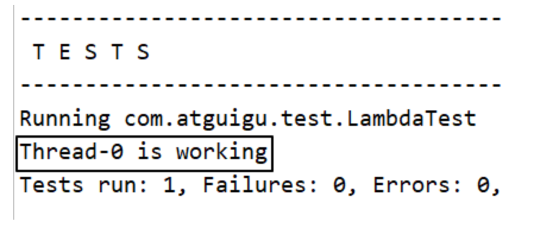

#### ②配置 profile

```xml
<profiles>
    <profile>
        <id>myJDKProfile</id>
        <!-- build 标签：意思是告诉 Maven，你的构建行为，我要开始定制了！ -->
        <build>
            <!-- plugins 标签：Maven 你给我听好了，你给我构建的时候要用到这些插件！ -->
            <plugins>
                <!-- plugin 标签：这是我要指定的一个具体的插件 -->
                <plugin>
                    <!-- 插件的坐标。此处引用的 maven-compiler-plugin 插件不是第三方的，是一个 Maven 自带的插件。 -->
                    <groupId>org.apache.maven.plugins</groupId>
                    <artifactId>maven-compiler-plugin</artifactId>
                    <version>3.1</version>

                    <!-- configuration 标签：配置 maven-compiler-plugin 插件 -->
                    <configuration>
                        <!-- 具体配置信息会因为插件不同、需求不同而有所差异 -->
                        <source>1.6</source>
                        <target>1.6</target>
                        <encoding>UTF-8</encoding>
                    </configuration>
                </plugin>
            </plugins>
        </build>
    </profile>
</profiles>
```

#### ③执行构建命令

```sh
mvn clean test -PmyJDKProfile
```


### 5、资源属性过滤

#### ①简介

Maven 为了能够通过 profile 实现各不同运行环境切换，提供了一种『资源属性过滤』的机制。通过属性替换实现不同环境使用不同的参数。

#### ②操作演示

##### [1]配置 profile

```xml
<profiles>
    <profile>
        <id>devJDBCProfile</id>
        <properties>
            <dev.jdbc.user>root</dev.jdbc.user>
            <dev.jdbc.password>atguigu</dev.jdbc.password>
            <dev.jdbc.url>http://localhost:3306/db_good</dev.jdbc.url>
            <dev.jdbc.driver>com.mysql.jdbc.Driver</dev.jdbc.driver>
        </properties>
        <build>
            <resources>
                <resource>
                    <!-- 表示为这里指定的目录开启资源过滤功能 -->
                    <directory>src/main/resources</directory>

                    <!-- 将资源过滤功能打开 -->
                    <filtering>true</filtering>
                </resource>
            </resources>
        </build>
    </profile>
</profiles>
```

##### [2]创建待处理的资源文件

```properties
dev.user=${dev.jdbc.user}
dev.password=${dev.jdbc.password}
dev.url=${dev.jdbc.url}
dev.driver=${dev.jdbc.driver}
```

##### [3]执行处理资源命令

```sh
mvn clean resources:resources -PdevJDBCProfile
```

##### [4]找到处理得到的资源文件

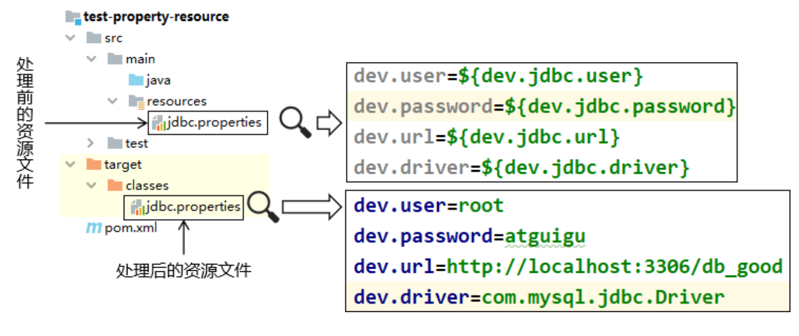

##### [5]延伸

我们时不时会在 resource 标签下看到 includes 和 excludes 标签。它们的作用是：

- includes：指定执行 resource 阶段时要包含到目标位置的资源
- excludes：指定执行 resource 阶段时要排除的资源

情看下面的例子：

```xml
<build>
    <resources>
        <resource>
            <!-- 表示为这里指定的目录开启资源过滤功能 -->
            <directory>src/main/resources</directory>

            <!-- 将资源过滤功能打开 -->
            <filtering>true</filtering>

            <includes>
                <include>*.properties</include>
            </includes>

            <excludes>
                <exclude>happy.properties</exclude>
            </excludes>
        </resource>
    </resources>
</build>
```

执行处理资源命令：

```sh
mvn clean resources:resources -PdevJDBCProfile
```

执行效果如下：

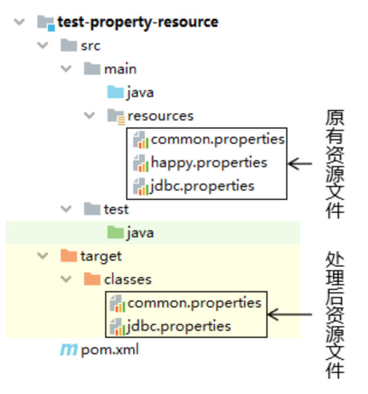

当然我们这里只是以 properties 文件为例，并不是只能处理 properties 文件。