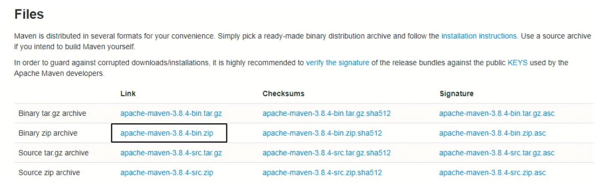
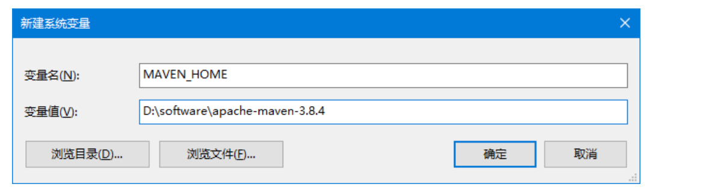
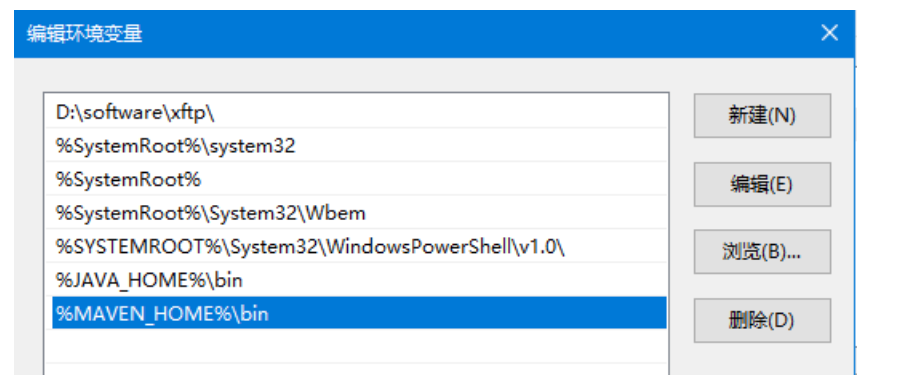
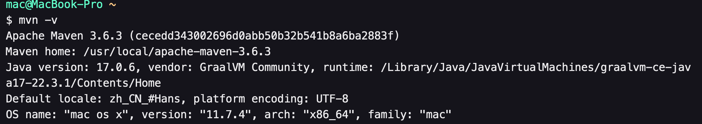

---
# 当前页面内容标题
title: 二、Maven 核心程序解压与配置
# 分类
category:
  - maven
# 标签
tag: 
  - maven
  - 开发工具
sticky: false
# 是否收藏在博客主题的文章列表中，当填入数字时，数字越大，排名越靠前。
star: false
# 是否将该文章添加至文章列表中
article: true
# 是否将该文章添加至时间线中
timeline: true
---

## 第一节 Maven核心程序解压与配置

### 1、Maven 官网地址

首页：

[Maven – Welcome to Apache Maven(opens new window)](https://maven.apache.org/)

下载页面：

[Maven – Download Apache Maven(opens new window)](https://maven.apache.org/download.cgi)

下载链接：



具体下载地址：https://dlcdn.apache.org/maven/maven-3/3.8.4/binaries/apache-maven-3.8.4-bin.zip

### 2、解压Maven核心程序

核心程序压缩包：apache-maven-3.8.4-bin.zip，解压到**非中文、没有空格**的目录。例如：


在解压目录中，我们需要着重关注 Maven 的核心配置文件：**conf/settings.xml**

### 3、指定本地仓库

本地仓库默认值：用户家目录/.m2/repository。由于本地仓库的默认位置是在用户的家目录下，而家目录往往是在 C 盘，也就是系统盘。将来 Maven 仓库中 jar 包越来越多，仓库体积越来越大，可能会拖慢 C 盘运行速度，影响系统性能。所以建议将 Maven 的本地仓库放在其他盘符下。配置方式如下：

```xml
<!-- localRepository
| The path to the local repository maven will use to store artifacts.
|
| Default: ${user.home}/.m2/repository
<localRepository>/path/to/local/repo</localRepository>
-->
<localRepository>D:\maven-repository</localRepository>
```

本地仓库这个目录，我们手动创建一个空的目录即可。

**记住**：一定要把 localRepository 标签**从注释中拿出来**。

**注意**：本地仓库本身也需要使用一个**非中文、没有空格**的目录。

### 4、配置阿里云提供的镜像仓库

Maven 下载 jar 包默认访问境外的中央仓库，而国外网站速度很慢。改成阿里云提供的镜像仓库，**访问国内网站**，可以让 Maven 下载 jar 包的时候速度更快。配置的方式是：

#### ①将原有的例子配置注释掉

```xml
<!-- <mirror>
  <id>maven-default-http-blocker</id>
  <mirrorOf>external:http:*</mirrorOf>
  <name>Pseudo repository to mirror external repositories initially using HTTP.</name>
  <url>http://0.0.0.0/</url>
  <blocked>true</blocked>
</mirror> -->
```

#### ②加入我们的配置

将下面 mirror 标签整体复制到 settings.xml 文件的 mirrors 标签的内部。

```xml
	<mirror>
		<id>nexus-aliyun</id>
		<mirrorOf>central</mirrorOf>
		<name>Nexus aliyun</name>
		<url>http://maven.aliyun.com/nexus/content/groups/public</url>
	</mirror>
```

### 5、配置 Maven 工程的基础 JDK 版本

如果按照默认配置运行，Java 工程使用的默认 JDK 版本是 1.5，而我们熟悉和常用的是 JDK 1.8 版本。修改配置的方式是：将 profile 标签整个复制到 settings.xml 文件的 profiles 标签内。

```xml
	<profile>
	  <id>jdk-1.8</id>
	  <activation>
		<activeByDefault>true</activeByDefault>
		<jdk>1.8</jdk>
	  </activation>
	  <properties>
		<maven.compiler.source>1.8</maven.compiler.source>
		<maven.compiler.target>1.8</maven.compiler.target>
		<maven.compiler.compilerVersion>1.8</maven.compiler.compilerVersion>
	  </properties>
	</profile>
```


## 第二节 配置环境变量

### 1、检查 JAVA_HOME 配置是否正确

Maven 是一个用 Java 语言开发的程序，它必须基于 JDK 来运行，需要通过 JAVA_HOME 来找到 JDK 的安装位置。

可以使用下面的命令验证：

```sh
C:\Users\Administrator>echo %JAVA_HOME%
D:\software\Java

C:\Users\Administrator>java -version
java version "1.8.0_141"
Java(TM) SE Runtime Environment (build 1.8.0_141-b15)
Java HotSpot(TM) 64-Bit Server VM (build 25.141-b15, mixed mode)
```

### 2、配置 MAVEN_HOME



> TIP
>
> 配置环境变量的规律：
>
> XXX_HOME 通常指向的是 bin 目录的上一级
>
> PATH 指向的是 bin 目录

### 3、配置PATH



### 4、验证

```bash
C:\Users\Administrator>mvn -v
Apache Maven 3.8.4 (9b656c72d54e5bacbed989b64718c159fe39b537)
Maven home: D:\software\apache-maven-3.8.4
Java version: 1.8.0_141, vendor: Oracle Corporation, runtime: D:\software\Java\jre
Default locale: zh_CN, platform encoding: GBK
OS name: "windows 10", version: "10.0", arch: "amd64", family: "windows"
```

----

### Mac配置环境

#### 1、点击启动台找到终端，输入

```bash
% vim ~/.zshrc
```

打开后按下i键进行修改，在文件最后面插入如下代码：

```bash
# maven
export MAVEN_HOME=/usr/local/apache-maven-3.6.3
export PATH=$PATH:$MAVEN_HOME/bin
```

按下 `esc`键退出`Insert`模式，然后在英文输入法下输入

```bash
:wq
```

保存并退出文件，然后在终端通过如下代码执行此配置文件。

```bash
% source ~/.zshrc
```

执行完成后，再次执行如下命令

```
% mvn -v
```

如果出现下图所示的Maven基本信息，配置完成。

