---
# 当前页面内容标题
title: 八、微服务架构案例
# 分类
category:
  - maven
# 标签
tag: 
  - maven
  - springcloud
  - 开发工具
sticky: false
# 是否收藏在博客主题的文章列表中，当填入数字时，数字越大，排名越靠前。
star: false
# 是否将该文章添加至文章列表中
article: true
# 是否将该文章添加至时间线中
timeline: true
---

## 第一节 创建工程

### 1、创建工程

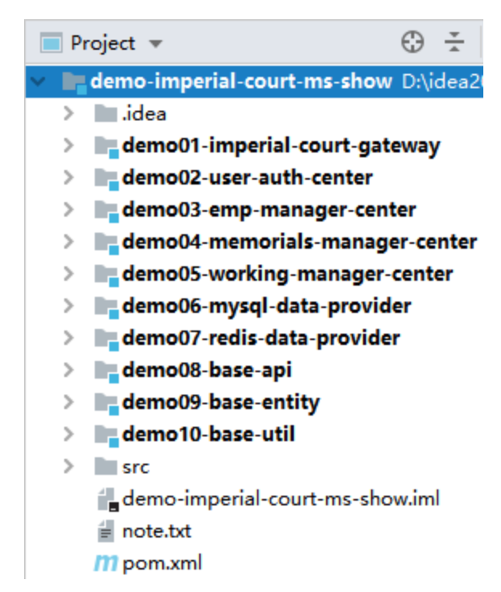

| 工程名                          | 地位   | 说明               |
| ------------------------------- | ------ | ------------------ |
| **demo-imperial-court-ms-show** | 父工程 | 总体管理各个子工程 |
| demo01-imperial-court-gateway   | 子工程 | 网关               |
| **demo02-user-auth-center**     | 子工程 | 用户中心           |
| demo03-emp-manager-center       | 子工程 | 员工数据维护中心   |
| demo04-memorials-manager-center | 子工程 | 奏折数据维护中心   |
| demo05-working-manager-center   | 子工程 | 批阅奏折工作中心   |
| **demo06-mysql-data-provider**  | 子工程 | MySQL 数据提供者   |
| demo07-redis-data-provider      | 子工程 | Redis 数据提供者   |
| **demo08-base-api**             | 子工程 | 声明 Feign 接口    |
| **demo09-base-entity**          | 子工程 | 实体类             |
| **demo10-base-util**            | 子工程 | 工具类             |

### 2、建立工程间依赖关系

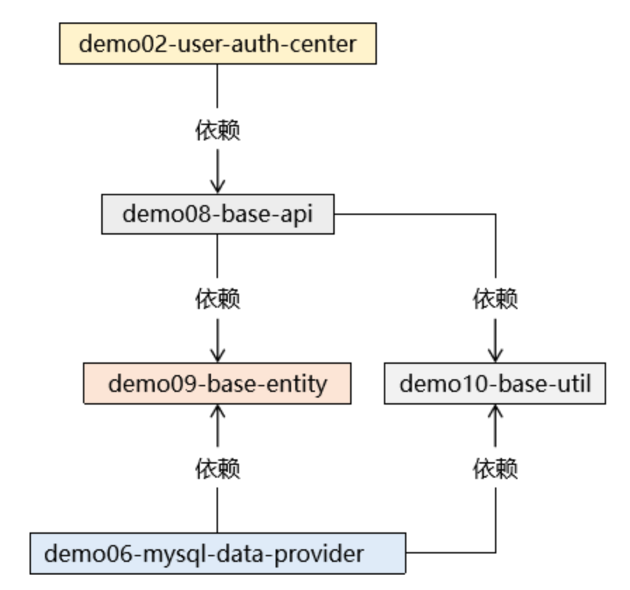

## 第二节 父工程管理依赖

```xml
<dependencyManagement>
    <dependencies>

        <!-- SpringCloud 依赖导入 -->
        <dependency>
            <groupId>org.springframework.cloud</groupId>
            <artifactId>spring-cloud-dependencies</artifactId>
            <version>Hoxton.SR9</version>
            <type>pom</type>
            <scope>import</scope>
        </dependency>

        <!-- SpringCloud Alibaba 依赖导入 -->
        <dependency>
            <groupId>com.alibaba.cloud</groupId>
            <artifactId>spring-cloud-alibaba-dependencies</artifactId>
            <version>2.2.6.RELEASE</version>
            <type>pom</type>
            <scope>import</scope>
        </dependency>

        <!-- SpringBoot 依赖导入 -->
        <dependency>
            <groupId>org.springframework.boot</groupId>
            <artifactId>spring-boot-dependencies</artifactId>
            <version>2.3.6.RELEASE</version>
            <type>pom</type>
            <scope>import</scope>
        </dependency>

        <!-- 通用 Mapper 依赖 -->
        <dependency>
            <groupId>tk.mybatis</groupId>
            <artifactId>mapper-spring-boot-starter</artifactId>
            <version>2.1.5</version>
        </dependency>

        <!-- Druid 数据源依赖 -->
        <dependency>
            <groupId>com.alibaba</groupId>
            <artifactId>druid-spring-boot-starter</artifactId>
            <version>1.1.10</version>
        </dependency>

        <!-- JPA 依赖 -->
        <dependency>
            <groupId>javax.persistence</groupId>
            <artifactId>persistence-api</artifactId>
            <version>1.0</version>
        </dependency>
    </dependencies>
</dependencyManagement>
```

## 第三节 打基础

### 1、demo10-base-util

#### ①ImperialCourtConst 常量类

```java
public class ImperialCourtConst {

    public static final String LOGIN_FAILED_MESSAGE = "账号、密码错误，不可进宫！";
    public static final String ACCESS_DENIED_MESSAGE = "宫闱禁地，不得擅入！";

}
```

#### ②字符串加密工具类

```java
public class MD5Util {

    /**
     * 针对明文字符串执行MD5加密
     * @param source
     * @return
     */
    public static String encode(String source) {

        // 1.判断明文字符串是否有效
        if (source == null || "".equals(source)) {
            throw new RuntimeException("用于加密的明文不可为空");
        }

        // 2.声明算法名称
        String algorithm = "md5";

        // 3.获取MessageDigest对象
        MessageDigest messageDigest = null;
        try {
            messageDigest = MessageDigest.getInstance(algorithm);
        } catch (NoSuchAlgorithmException e) {
            e.printStackTrace();
        }

        // 4.获取明文字符串对应的字节数组
        byte[] input = source.getBytes();

        // 5.执行加密
        byte[] output = messageDigest.digest(input);

        // 6.创建BigInteger对象
        int signum = 1;
        BigInteger bigInteger = new BigInteger(signum, output);

        // 7.按照16进制将bigInteger的值转换为字符串
        int radix = 16;
        String encoded = bigInteger.toString(radix).toUpperCase();

        return encoded;
    }

}
```

#### ③登录失败异常

```java
public class LoginFailedException extends RuntimeException {

    public LoginFailedException() {
    }

    public LoginFailedException(String message) {
        super(message);
    }

    public LoginFailedException(String message, Throwable cause) {
        super(message, cause);
    }

    public LoginFailedException(Throwable cause) {
        super(cause);
    }

    public LoginFailedException(String message, Throwable cause, boolean enableSuppression, boolean writableStackTrace) {
        super(message, cause, enableSuppression, writableStackTrace);
    }
}
```

#### ④远程方法调用统一返回结果

```java
/**
 * 统一整个项目中远程方法调用返回的结果
 * @author Lenovo
 *
 * @param <T>
 */
public class ResultEntity<T> {
	
	public static final String SUCCESS = "SUCCESS";
	public static final String FAILED = "FAILED";
	
	// 用来封装当前请求处理的结果是成功还是失败
	private String result;
	
	// 请求处理失败时返回的错误消息
	private String message;
	
	// 要返回的数据
	private T data;
	
	/**
	 * 请求处理成功且不需要返回数据时使用的工具方法
	 * @return
	 */
	public static <Type> ResultEntity<Type> successWithoutData() {
		return new ResultEntity<Type>(SUCCESS, null, null);
	}
	
	/**
	 * 请求处理成功且需要返回数据时使用的工具方法
	 * @param data 要返回的数据
	 * @return
	 */
	public static <Type> ResultEntity<Type> successWithData(Type data) {
		return new ResultEntity<Type>(SUCCESS, null, data);
	}
	
	/**
	 * 请求处理失败后使用的工具方法
	 * @param message 失败的错误消息
	 * @return
	 */
	public static <Type> ResultEntity<Type> failed(String message) {
		return new ResultEntity<Type>(FAILED, message, null);
	}
	
	public ResultEntity() {
		
	}

	public ResultEntity(String result, String message, T data) {
		super();
		this.result = result;
		this.message = message;
		this.data = data;
	}

	@Override
	public String toString() {
		return "ResultEntity [result=" + result + ", message=" + message + ", data=" + data + "]";
	}

	public String getResult() {
		return result;
	}

	public void setResult(String result) {
		this.result = result;
	}

	public String getMessage() {
		return message;
	}

	public void setMessage(String message) {
		this.message = message;
	}

	public T getData() {
		return data;
	}

	public void setData(T data) {
		this.data = data;
	}

}
```

### 2、demo09-base-entity

#### ①引入依赖

```xml
<dependency>
    <groupId>javax.persistence</groupId>
    <artifactId>persistence-api</artifactId>
</dependency>
```

#### ②创建实体类

在 MySQL 数据提供服务中用到的通用 Mapper 技术需要借助 **@Table 注解**将实体类和数据库表关联起来。

```java
@Table(name = "t_emp")
public class Emp implements Serializable {

    private Integer empId;

    private String empName;

    private String empPosition;

    private String loginAccount;

    private String loginPassword;

    public Integer getEmpId() {
        return empId;
    }

    public void setEmpId(Integer empId) {
        this.empId = empId;
    }

    public String getEmpName() {
        return empName;
    }

    public void setEmpName(String empName) {
        this.empName = empName == null ? null : empName.trim();
    }

    public String getEmpPosition() {
        return empPosition;
    }

    public void setEmpPosition(String empPosition) {
        this.empPosition = empPosition == null ? null : empPosition.trim();
    }

    public String getLoginAccount() {
        return loginAccount;
    }

    public void setLoginAccount(String loginAccount) {
        this.loginAccount = loginAccount == null ? null : loginAccount.trim();
    }

    public String getLoginPassword() {
        return loginPassword;
    }

    public void setLoginPassword(String loginPassword) {
        this.loginPassword = loginPassword == null ? null : loginPassword.trim();
    }
}
```

## 第四节 用户登录认证服务：提供端

### 1、总体分析

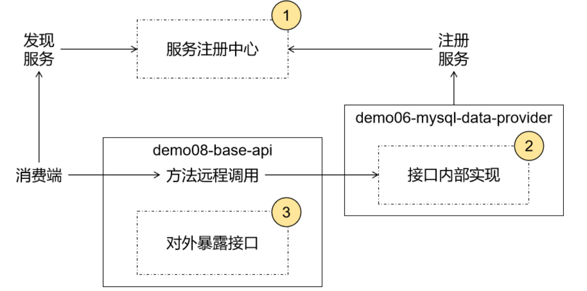

### 2、注册中心

在本地启动 Nacos 注册中心：

```sh
d:\software\nacos\bin>startup.cmd -m standalone
```

### 3、声明接口，暴露服务

#### ①接口文档

[点击查看接口文档]([用户登录验证接口 | 代码重工 (gitee.io)](https://heavy_code_industry.gitee.io/code_heavy_industry/pro002-maven/chapter08/api.html))

#### ② Feign 接口代码

##### [1]接口位置

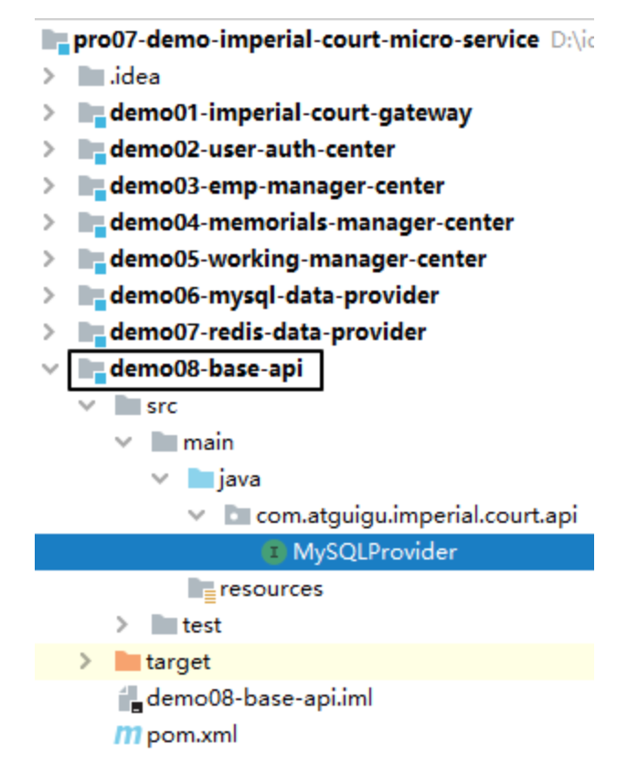

##### [2]引入依赖

```xml
<!-- OpenFeign 专用依赖 -->
<dependency>
    <groupId>org.springframework.cloud</groupId>
    <artifactId>spring-cloud-starter-openfeign</artifactId>
</dependency>

<!-- 提供 Emp 实体类使用 -->
<dependency>
    <groupId>com.atguigu.demo</groupId>
    <artifactId>demo09-base-entity</artifactId>
    <version>1.0-SNAPSHOT</version>
</dependency>

<!-- 提供 ResultEntity 工具类使用 -->
<dependency>
    <groupId>com.atguigu.demo</groupId>
    <artifactId>demo10-base-util</artifactId>
    <version>1.0-SNAPSHOT</version>
</dependency>
```

##### [3]接口代码

**注意**：@FeignClient 注解中指定的是提供服务的微服务名称，要和注册中心注册的一致

```java
// @FeignClient 注解将当前接口标记为服务暴露接口
// name 属性：指定被暴露服务的微服务名称
@FeignClient(name = "demo06-mysql-data-provider")
public interface MySQLProvider {

    @RequestMapping("/remote/get/emp/by/login/info")
    ResultEntity<Emp> getEmpByLoginInfo(

            // @RequestParam 无论如何不能省略
            @RequestParam("loginAccount") String loginAccount,
            @RequestParam("loginPassword") String loginPassword);
}
```

### 4、实现接口

#### ①所在工程

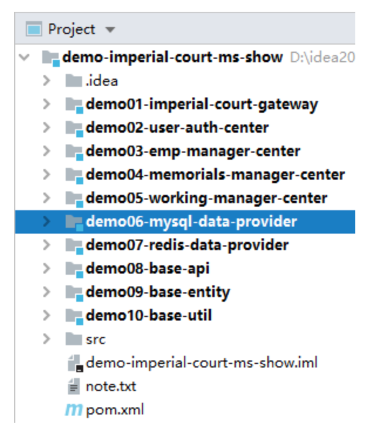

#### ②引入依赖

```xml
<!-- Nacos 服务注册发现启动器 -->
<dependency>
    <groupId>com.alibaba.cloud</groupId>
    <artifactId>spring-cloud-starter-alibaba-nacos-discovery</artifactId>
</dependency>

<!--通用mapper启动器依赖-->
<dependency>
    <groupId>tk.mybatis</groupId>
    <artifactId>mapper-spring-boot-starter</artifactId>
</dependency>

<!--mysql驱动-->
<dependency>
    <groupId>mysql</groupId>
    <artifactId>mysql-connector-java</artifactId>
</dependency>

<!--druid启动器依赖-->
<dependency>
    <groupId>com.alibaba</groupId>
    <artifactId>druid-spring-boot-starter</artifactId>
</dependency>

<!--web启动器依赖-->
<dependency>
    <groupId>org.springframework.boot</groupId>
    <artifactId>spring-boot-starter-web</artifactId>
</dependency>

<!--编码工具包-->
<dependency>
    <groupId>org.apache.commons</groupId>
    <artifactId>commons-lang3</artifactId>
</dependency>

<!--单元测试启动器-->
<dependency>
    <groupId>org.springframework.boot</groupId>
    <artifactId>spring-boot-starter-test</artifactId>
    <scope>test</scope>
</dependency>

<!--热部署 -->
<dependency>
    <groupId>org.springframework.boot</groupId>
    <artifactId>spring-boot-devtools</artifactId>
    <scope>runtime</scope>
    <optional>true</optional>
</dependency>
<dependency>
    <groupId>com.atguigu.demo</groupId>
    <artifactId>demo09-base-entity</artifactId>
    <version>1.0-SNAPSHOT</version>
</dependency>

<dependency>
    <groupId>com.atguigu.demo</groupId>
    <artifactId>demo10-base-util</artifactId>
    <version>1.0-SNAPSHOT</version>
</dependency>
```

#### ③Java 代码

##### [1]总体结构

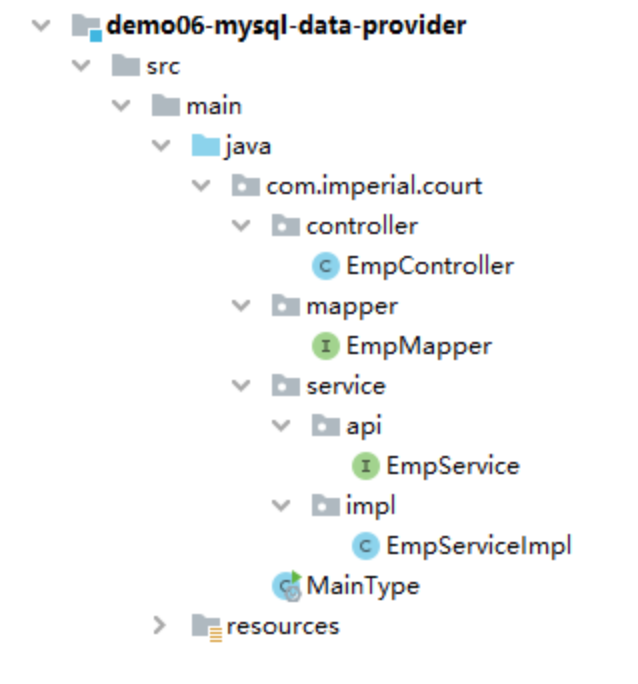

##### [2]EmpMapper

继承 tk.mybatis.mapper.common.Mapper 后就可以使用通用 Mapper 提供的常规代码实现。除非有非常规需求，否则我们自己什么都不用写。

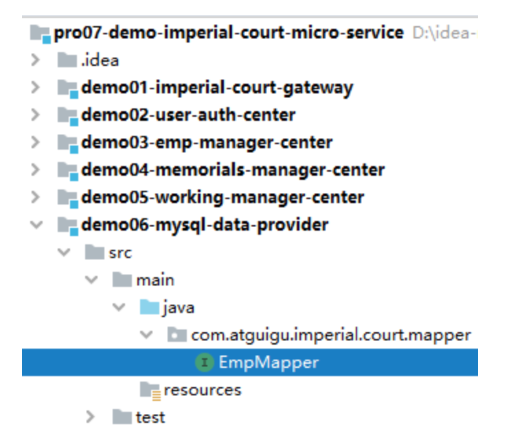

```java
public interface EmpMapper extends Mapper<Emp> {
}
```

##### [3]Service 接口

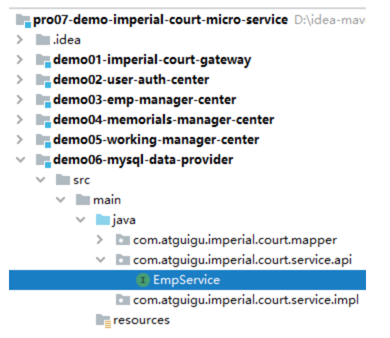

```java
public interface EmpService {
    Emp getEmpByLoginInfo(String loginAccount, String loginPassword);
}
```

##### [4]Service 实现

```java
@Service
@Transactional(propagation = Propagation.REQUIRES_NEW, readOnly = true)
public class EmpServiceImpl implements EmpService {

    @Autowired
    private EmpMapper empMapper;

    @Override
    public Emp getEmpByLoginInfo(String loginAccount, String loginPassword) {

        String encodedLoginPassword = MD5Util.encode(loginPassword);

        Example example = new Example(Emp.class);

        example
                .createCriteria()
                .andEqualTo("loginAccount", loginAccount)
                .andEqualTo("loginPassword", encodedLoginPassword);

        List<Emp> empList = empMapper.selectByExample(example);

        if (empList == null || empList.size() == 0) {
            throw new LoginFailedException(ImperialCourtConst.LOGIN_FAILED_MESSAGE);
        }

        return empList.get(0);
    }
}
```

##### [5]EmpController

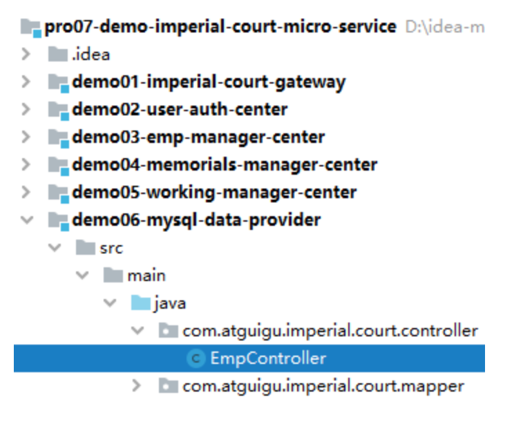

```java
@RestController
public class EmpController {

    @Autowired
    private EmpService empService;

    @RequestMapping("remote/get/emp/by/login/info")
    ResultEntity<Emp> getEmpByLoginInfo(
            @RequestParam("loginAccount") String loginAccount,
            @RequestParam("loginPassword") String loginPassword) {

        try {
            Emp emp = empService.getEmpByLoginInfo(loginAccount, loginPassword);

            return ResultEntity.successWithData(emp);

        } catch (Exception e) {
            e.printStackTrace();
            String message = e.getMessage();
            return ResultEntity.failed(message);
        }

    }

}
```

##### [6]主启动类

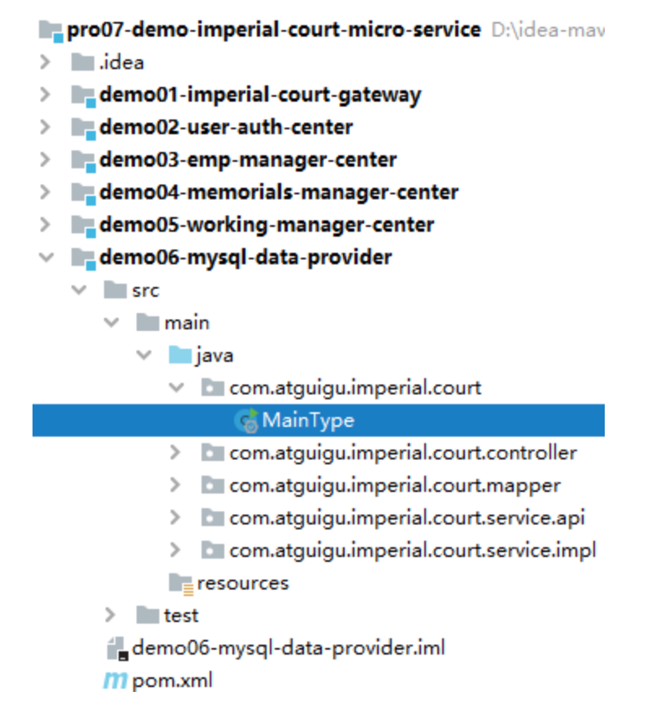

```java
// 为了让当前微服务对接（注册或发现服务）注册中心
@EnableDiscoveryClient

// SpringBoot 标配注解
@SpringBootApplication

// 扫描通用 Mapper 的 Mapper 接口所在包
// 这个注解全类名：tk.mybatis.spring.annotation.MapperScan
// basePackage 属性：指定要扫描的 Mapper 接口所在的包
@MapperScan(basePackages = "com.atguigu.imperial.court.mapper")
public class MainType {

    public static void main(String[] args) {
        SpringApplication.run(MainType.class, args);
    }

}
```

#### ④YAML 配置文件

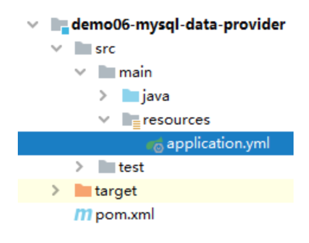

```yaml
server:
  port: 10001
spring:
  datasource:
    driver-class-name: com.mysql.jdbc.Driver
    url: jdbc:mysql://192.168.198.100:3306/db_imperial_court
    username: root
    password: atguigu
    type: com.alibaba.druid.pool.DruidDataSource
  application:
    name: demo06-mysql-data-provider
  cloud:
    nacos:
      discovery:
        server-addr: localhost:8848
```

## 第五节 用户登录认证服务：消费端

### 1、所在工程

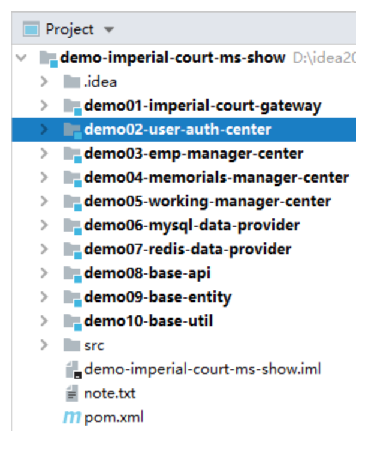

### 2、引入依赖

```xml
<!-- Nacos 服务注册发现启动器 -->
<dependency>
    <groupId>com.alibaba.cloud</groupId>
    <artifactId>spring-cloud-starter-alibaba-nacos-discovery</artifactId>
</dependency>

<!-- web启动器依赖 -->
<dependency>
    <groupId>org.springframework.boot</groupId>
    <artifactId>spring-boot-starter-web</artifactId>
</dependency>

<!-- 视图模板技术 thymeleaf -->
<dependency>
    <groupId>org.springframework.boot</groupId>
    <artifactId>spring-boot-starter-thymeleaf</artifactId>
</dependency>

<dependency>
    <groupId>com.atguigu.demo</groupId>
    <artifactId>demo08-base-api</artifactId>
    <version>1.0-SNAPSHOT</version>
</dependency>
```

### 3、YAML 配置文件

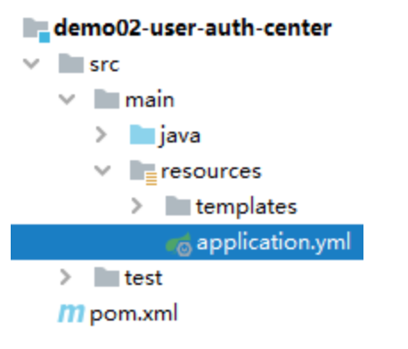

```yaml
server:
  port: 10002
spring:
  application:
    name: demo02-user-auth-center
  cloud:
    nacos:
      discovery:
        server-addr: localhost:8848
```

> TIP
>
> 就 Thymeleaf 而言，有两个常用属性，但我们全部都使用的是默认值，所以可以省略。

### 4、显示首页

#### ①配置 view-controller

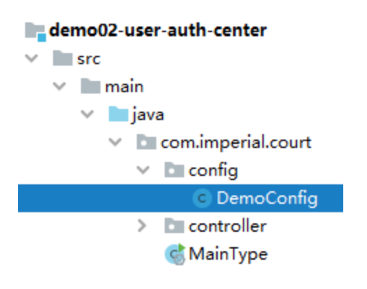

```java
@SpringBootConfiguration
public class DemoConfig implements WebMvcConfigurer {

    @Override
    public void addViewControllers(ViewControllerRegistry registry) {
        registry.addViewController("/").setViewName("portal");
    }
}
```

#### ②Thymeleaf 视图模板页面

```html
<!DOCTYPE html>
<html lang="en" xml:th="http://www.thymeleaf.org">
<head>
    <meta charset="UTF-8">
    <title>首页</title>
</head>
<body>

<form th:action="@{/consumer/do/login}" method="post">
    <p style="color: red;font-weight: bold;" th:if="${not #strings.isEmpty(authMessage)}" th:text="${authMessage}">
        这里根据条件显示登录失败消息</p>
    <p style="color: red;font-weight: bold;" th:if="${not #strings.isEmpty(systemMessage)}" th:text="${systemMessage}">
        这里根据条件显示系统消息</p>
    账号：<input type="text" name="loginAccount"/><br/>
    密码：<input type="password" name="loginPassword"><br/>
    <button type="submit">进宫</button>
</form>
</body>
</html>
```

### 5、登录验证

#### ①流程图

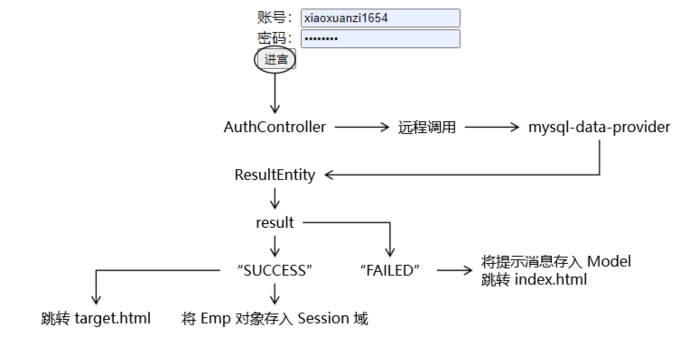

#### ②主启动类

**注意**：一定要标记 @EnableFeignClients 注解。

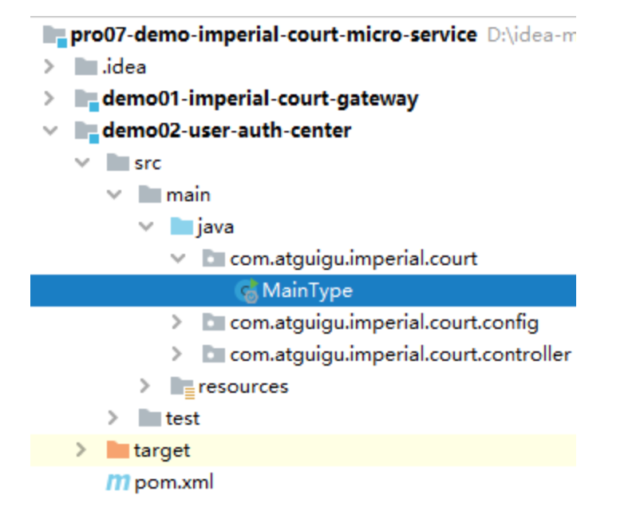

```java
@EnableFeignClients
@EnableDiscoveryClient
@SpringBootApplication
public class MainType {

    public static void main(String[] args) {
        SpringApplication.run(MainType.class, args);
    }

}
```

#### ③AuthController

##### [1]装配远程接口分析


```java
@Controller
public class AuthController {

    // 1、本地使用 @Autowired 注解装配远程接口类型即可实现方法的远程调用，
    // 看起来就像是调用本地方法一样，我们管这种特性叫方法的声明式远程调用。
    // 2、凭啥通过 @Autowired 注解就能够导入远程接口对应的 bean
    //      ①当前环境包含 Feign 相关 jar 包。
    //      ②当前微服务的主启动类上标记 @EnableFeignClients
    //      ③符合 SpringBoot 自动扫描包的约定规则：默认情况下主启动类所在的包、以及主启动类所在包的子包都会被自动扫描
    //          主启动类所在包：     com.atguigu.imperial.court
    //          被扫描的接口所在的包：com.atguigu.imperial.court.api
    @Autowired
    private MySQLProvider mySQLProvider;

}
```

##### [2]执行登录验证的方法

```java
@RequestMapping("/consumer/do/login")
public String doLogin(@RequestParam("loginAccount") String loginAccount,
                      @RequestParam("loginPassword") String loginPassword, HttpSession session, Model model) {

    // 1、调用远程接口根据登录账号、密码查询 Emp 对象
    ResultEntity<Emp> resultEntity = mySQLProvider.getEmpByLoginInfo(loginAccount, loginPassword);

    // 2、验证远程接口调用是否成功
    String result = resultEntity.getResult();
    
    if ("SUCCESS".equals(result)) {

        // 3、从 ResultEntity 中获取查询得到的 Emp 对象
        Emp emp = resultEntity.getData();
        
        // 4、将 Emp 对象存入 Session 域
        session.setAttribute("loginInfo", emp);

        // 5、前往 target 页面
        return "target";
    } else {
        
        // 6、获取失败消息
        String message = resultEntity.getMessage();
        
        // 7、将失败消息存入模型
        model.addAttribute("message", message);
        
        // 8、回到登录页面
        return "index";

    }
}
```

## 第六节 部署运行

### 1、最终目标

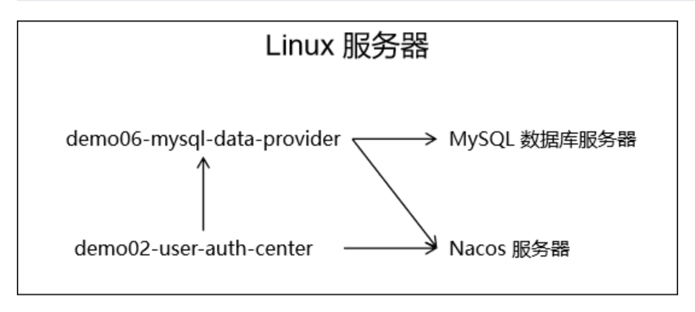

### 2、微服务打包

#### ①修改 MySQL 连接信息

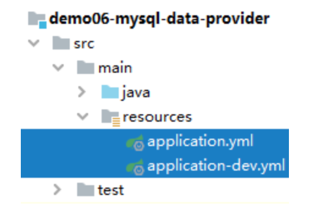

```yaml
server:
  port: 10001
spring:
  datasource:
    driver-class-name: com.mysql.jdbc.Driver
    
    # 当前微服务和 MySQL 位于同一个服务器上，需要把访问地址改成 localhost
    url: jdbc:mysql://localhost:3306/db_imperial_court
    username: root
    password: atguigu
    type: com.alibaba.druid.pool.DruidDataSource
  application:
    name: demo06-mysql-data-provider
  cloud:
    nacos:
      discovery:
        server-addr: localhost:8848
```

#### ②在父工程执行 install 命令

##### [1]Why parent？工程间关系梳理

正确的安装顺序：

- ①父工程：pro07-demo-imperial-court-micro-service
- ②被依赖的 module：demo10-base-util 或 demo09-base-entity
- ③当前 module：demo06-mysql-data-provider

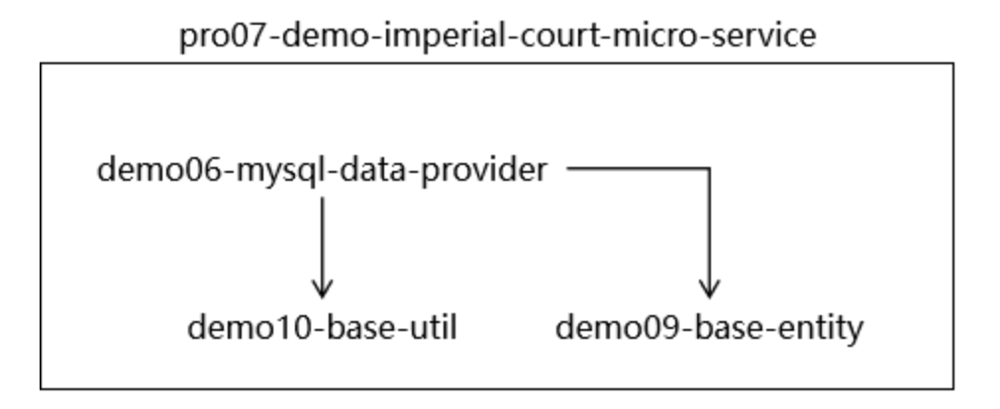

##### [2]执行命令

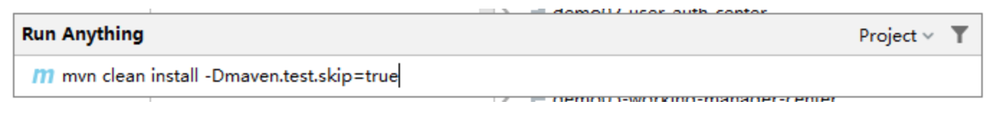

#### ③生成微服务可运行 jar 包

##### [1]应用微服务打包插件

可以以 SpringBoot 微服务形式直接运行的 jar 包包括：

- 当前微服务本身代码
- 当前微服务所依赖的 jar 包
- 内置 Tomcat（Servlet 容器）
- 与 jar 包可以通过 java -jar 方式直接启动相关的配置

要加入额外的资源、相关配置等等，仅靠 Maven 自身的构建能力是不够的，所以要通过 build 标签引入下面的插件。

```xml
<!-- build 标签：用来配置对构建过程的定制 -->
<build>
    <!-- plugins 标签：定制化构建过程中所使用到的插件 -->
	<plugins>
        <!-- plugin 标签：一个具体插件 -->
		<plugin>
			<groupId>org.springframework.boot</groupId>
			<artifactId>spring-boot-maven-plugin</artifactId>
		</plugin>
	</plugins>
</build>
```

加入这个插件后的效果：

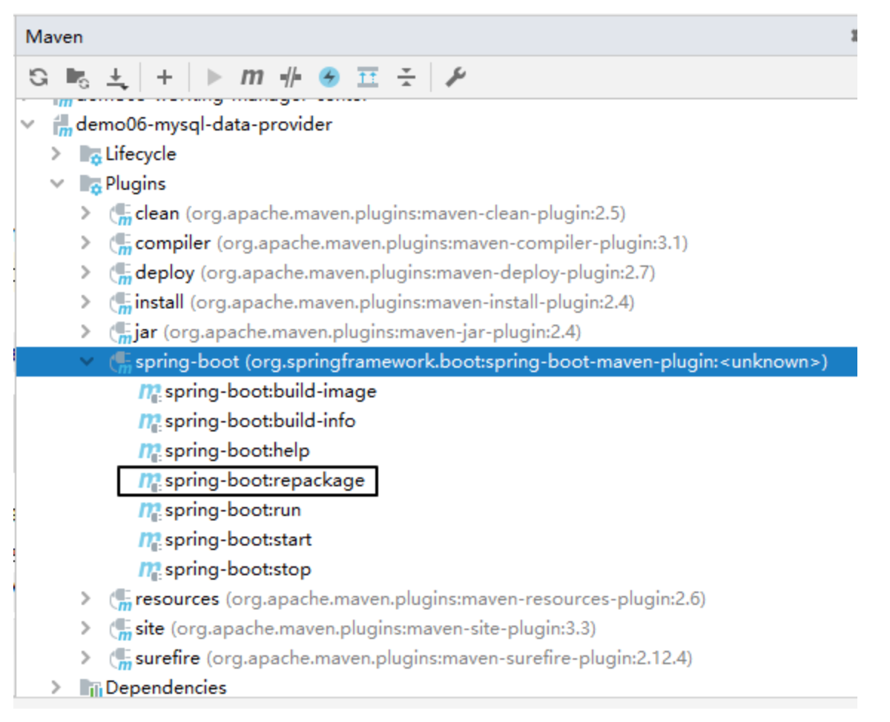

提示：IDEA 对于我们这里 build 标签里加入的 plugin 的配置没有能够很好的识别到插件的版本。如果我们能够保证其它操作都正常执行完成，准备工作都准备好了，那么这里我们判定是 IDEA 识别能力不足导致。一切以实际执行的结果为准：**运行结果是最高权威**

请对 demo02-user-auth-center 和 demo06-mysql-data-provider 都添加上面的 build 配置。

##### [2]执行插件目标

请对 demo02-user-auth-center 和 demo06-mysql-data-provider 都执行下面的命令：

- clean 子命令：清理之前构建的结果
- package 子命令：我们真正要调用的 spring-boot:repackage 要求必须将当前微服务本身的 jar 包提前准备好，所以必须在它之前执行 package 子命令。
- spring-boot:repackage 子命令：调用 spring-boot 插件的 repackage 目标
- -Dmaven.test.skip=true 参数：跳过测试

```sh
mvn clean package spring-boot:repackage -Dmaven.test.skip=true
```

### 3、执行部署

#### ①启动 Nacos

```sh
sh /opt/nacos/bin/startup.sh -m standalone
```

#### ②上传微服务 jar 包


#### ②启动微服务

```sh
nohup java -jar demo06-mysql-data-provider-1.0-SNAPSHOT.jar>demo06.log 2>&1 &
nohup java -jar demo02-user-auth-center-1.0-SNAPSHOT.jar>demo02.log 2>&1 &
```