---
# 当前页面内容标题
title: 十、生产实践
# 分类
category:
  - maven
# 标签
tag: 
  - maven
  - nexus
  - 私服仓库
  - 开发工具
sticky: false
# 是否收藏在博客主题的文章列表中，当填入数字时，数字越大，排名越靠前。
star: false
# 是否将该文章添加至文章列表中
article: true
# 是否将该文章添加至时间线中
timeline: true
---

## 第一节 搭建 Maven 私服：Nexus

### 1、Nexus 安装

#### ①下载地址

小诀窍：使用迅雷下载比直接用浏览器下载快很多

https://download.sonatype.com/nexus/3/latest-unix.tar.gz

#### ②上传、解压

上传到 Linux 系统，解压后即可使用，不需要安装。但是需要**注意**：必须提前安装 JDK。

> [root@x nexus-3.37.0-01]# ll
>
> 总用量 96
>
> drwxr-xr-x. 3 root root 4096 2月 13 17:33 bin
>
> drwxr-xr-x. 2 root root 4096 2月 13 17:33 deploy
>
> drwxr-xr-x. 7 root root 4096 2月 13 17:33 etc
>
> drwxr-xr-x. 5 root root 4096 2月 13 17:33 lib
>
> -rw-r--r--. 1 root root 651 11月 20 01:40 NOTICE.txt
>
> -rw-r--r--. 1 root root 17321 11月 20 01:40 OSS-LICENSE.txt
>
> -rw-r--r--. 1 root root 41954 11月 20 01:40 PRO-LICENSE.txt
>
> drwxr-xr-x. 3 root root 4096 2月 13 17:33 public
>
> drwxr-xr-x. 3 root root 4096 2月 13 17:33 replicator
>
> drwxr-xr-x. 23 root root 4096 2月 13 17:33 system

#### ③启动 Nexus

> [root@x ~]# /opt/nexus-3.37.0-01/bin/**nexus start**
>
> WARNING: ************************************************************
>
> WARNING: Detected execution as "root" user. This is NOT recommended!
>
> WARNING: ************************************************************
>
> Starting nexus
>
> [root@x ~]# /opt/nexus-3.37.0-01/bin/**nexus status**
>
> WARNING: ************************************************************
>
> WARNING: Detected execution as "root" user. This is NOT recommended!
>
> WARNING: ************************************************************
>
> nexus is running.

#### ④查看端口占用情况

> [root@x ~]# netstat -anp | grep java
>
> tcp 0 0 127.0.0.1:**45614** 0.0.0.0:* LISTEN 9872/java
>
> tcp 0 0 0.0.0.0:**8081** 0.0.0.0:* LISTEN 9872/java

上面 45614 这个每次都不一样，不用管它。我们要访问的是 8081 这个端口。但是需要**注意**：8081 端口的这个进程要在启动 /opt/nexus-3.37.0-01/bin/nexus 这个主体程序**一、两分钟**后才会启动，请耐心等待。

#### ⑤访问 Nexus 首页

首页地址：http://[Linux 服务器地址]:8081/

初始化界面还是很酷的：

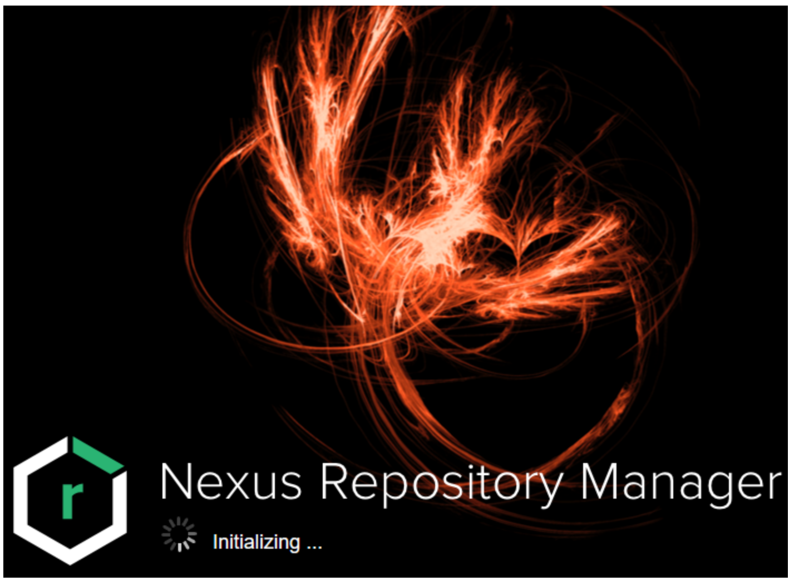

### 2、初始设置

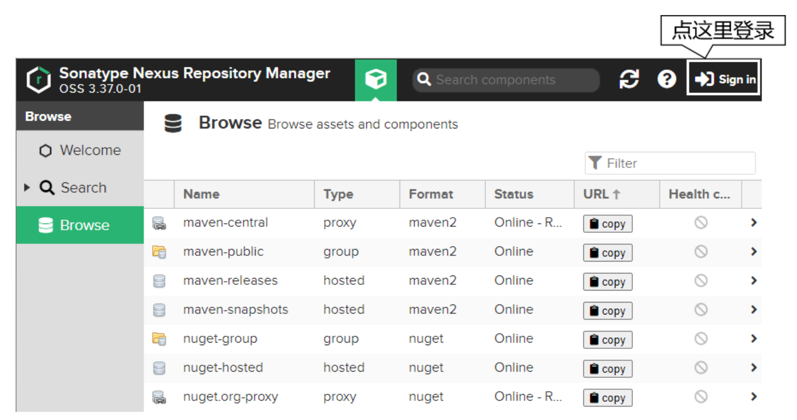

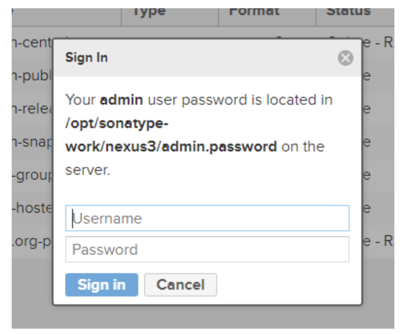

这里参考提示：

- 用户名：admin
- 密码：查看 /opt/sonatype-work/nexus3/admin.password 文件

> [root@hello ~]# cat /opt/sonatype-work/nexus3/admin.password
>
> ed5e96a8-67aa-4dca-9ee8-1930b1dd5415

所以登录信息输入如下：

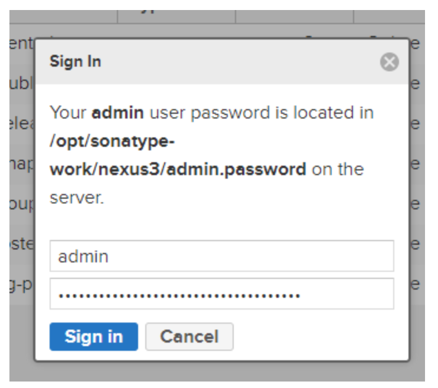

继续执行初始化：

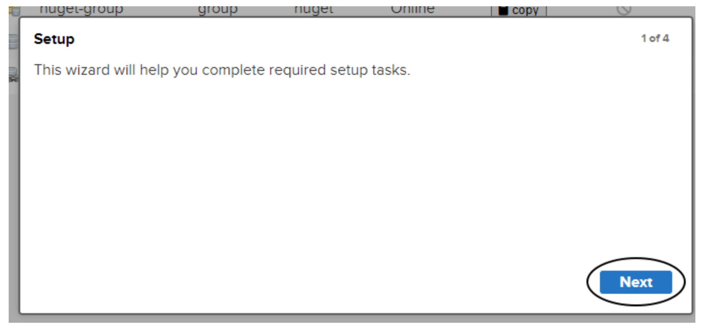

给 admin 用户指定新密码：

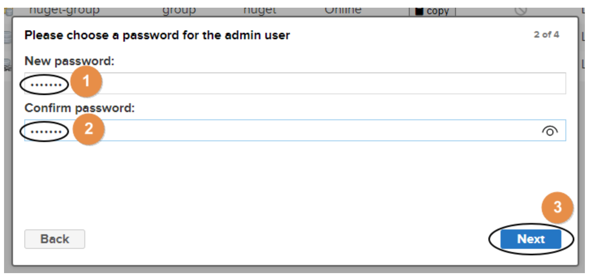

匿名登录，启用还是禁用？由于启用匿名登录后，后续操作比较简单，这里我们演示禁用匿名登录的操作方式：

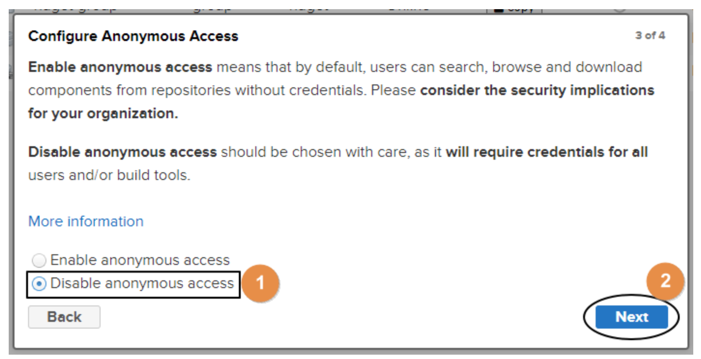

完成：

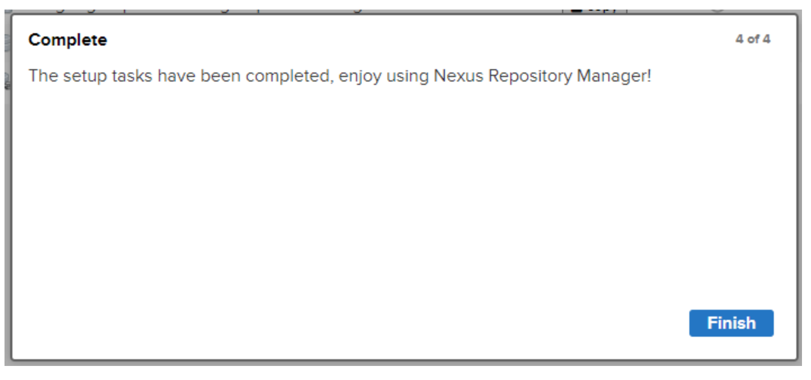

### 3、对接 Nexus

#### ①通过 Nexus 下载 jar 包

##### [1]了解 Nexus 上的各种仓库

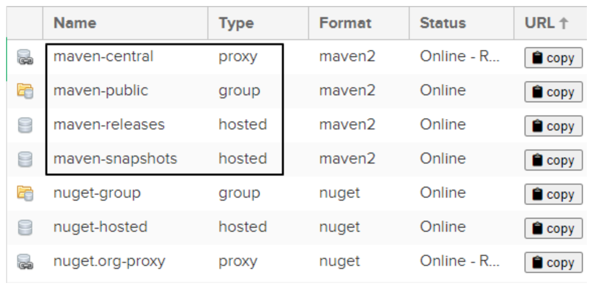

| 仓库类型 | 说明                                           |
| -------- | ---------------------------------------------- |
| proxy    | 某个远程仓库的代理                             |
| group    | 存放：通过 Nexus 获取的第三方 jar 包           |
| hosted   | 存放：本团队其他开发人员部署到 Nexus 的 jar 包 |

| 仓库名称        | 说明                                                         |
| --------------- | ------------------------------------------------------------ |
| maven-central   | Nexus 对 Maven 中央仓库的代理                                |
| maven-public    | Nexus 默认创建，供开发人员下载使用的组仓库                   |
| maven-releasse  | Nexus 默认创建，供开发人员部署自己 jar 包的宿主仓库 要求 releasse 版本 |
| maven-snapshots | Nexus 默认创建，供开发人员部署自己 jar 包的宿主仓库 要求 snapshots 版本 |

初始状态下，这几个仓库都没有内容：

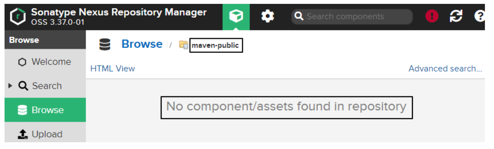

##### [2]使用空的本地仓库

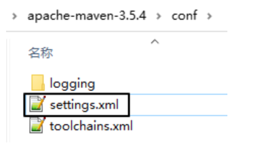

```xml
  <!-- 配置一个新的 Maven 本地仓库 -->
  <localRepository>D:/maven-repository-new</localRepository>
```

##### [3]指定 Nexus 服务器地址

把我们原来配置阿里云仓库地址的 mirror 标签改成下面这样：

```xml
<mirror>
	<id>nexus-mine</id>
	<mirrorOf>central</mirrorOf>
	<name>Nexus mine</name>
	<url>http://192.168.198.100:8081/repository/maven-public/</url>
</mirror>
```

这里的 url 标签是这么来的：

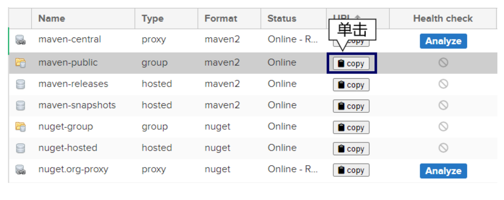

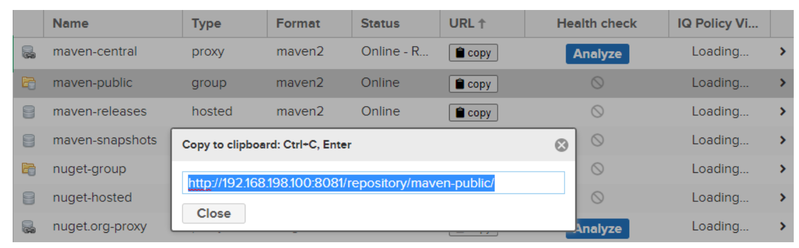

把上图中看到的地址复制出来即可。如果我们在前面允许了匿名访问，到这里就够了。但如果我们禁用了匿名访问，那么接下来我们还要继续配置 settings.xml：

```xml
<server>
  <id>nexus-mine</id>
  <username>admin</username>
  <password>atguigu</password>
</server>
```

这里需要**格外注意**：server 标签内的 id 标签值必须和 mirror 标签中的 id 值一样。

##### [4]效果

找一个用到框架的 Maven 工程，执行命令：

```sh
mvn clean compile
```

下载过程日志：

> Downloading from nexus-mine: http://192.168.198.100:8081/repository/maven-public/com/jayway/jsonpath/json-path/2.4.0/json-path-2.4.0.pom
>
> Downloaded from nexus-mine: http://192.168.198.100:8081/repository/maven-public/com/jayway/jsonpath/json-path/2.4.0/json-path-2.4.0.pom (2.6 kB at 110 kB/s)
>
> Downloading from nexus-mine: http://192.168.198.100:8081/repository/maven-public/net/minidev/json-smart/2.3/json-smart-2.3.pom
>
> Downloaded from nexus-mine: http://192.168.198.100:8081/repository/maven-public/net/minidev/json-smart/2.3/json-smart-2.3.pom (9.0 kB at 376 kB/s)
>
> Downloading from nexus-mine: http://192.168.198.100:8081/repository/maven-public/net/minidev/minidev-parent/2.3/minidev-parent-2.3.pom
>
> Downloaded from nexus-mine: http://192.168.198.100:8081/repository/maven-public/net/minidev/minidev-parent/2.3/minidev-parent-2.3.pom (8.5 kB at 404 kB/s)
>
> Downloading from nexus-mine: http://192.168.198.100:8081/repository/maven-public/net/minidev/accessors-smart/1.2/accessors-smart-1.2.pom
>
> Downloaded from nexus-mine: http://192.168.198.100:8081/repository/maven-public/net/minidev/accessors-smart/1.2/accessors-smart-1.2.pom (12 kB at 463 kB/s)

下载后，Nexus 服务器上就有了 jar 包：

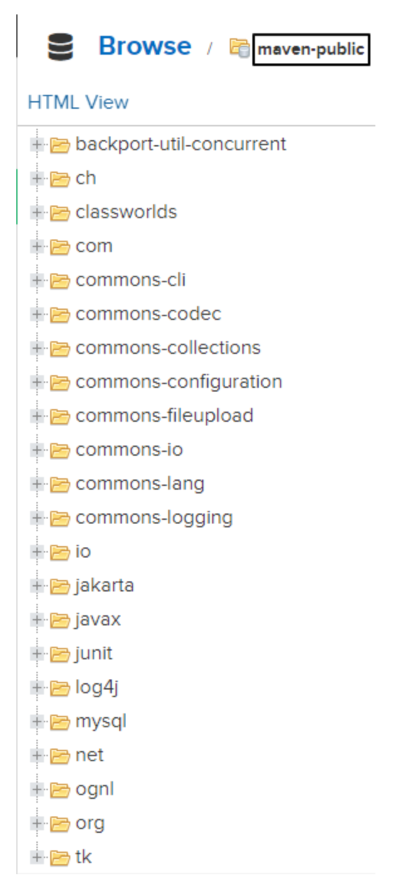

#### ②将 jar 包部署到 Nexus

##### [1]配置 Maven 工程

```xml
<distributionManagement>
    <snapshotRepository>
        <id>nexus-mine</id>
        <name>Nexus Snapshot</name>
        <url>http://192.168.198.100:8081/repository/maven-snapshots/</url>
    </snapshotRepository>
</distributionManagement>
```

这里 snapshotRepository 的 id 标签也必须和 settings.xml 中指定的 mirror 标签的 id 属性一致。

##### [2]执行部署命令

```sh
mvn deploy
```

> Uploading to nexus-mine: http://192.168.198.100:8081/repository/maven-snapshots/com/atguigu/demo/demo07-redis-data-provider/1.0-SNAPSHOT/maven-metadata.xml
>
> Uploaded to nexus-mine: http://192.168.198.100:8081/repository/maven-snapshots/com/atguigu/demo/demo07-redis-data-provider/1.0-SNAPSHOT/maven-metadata.xml (786 B at 19 kB/s)
>
> Uploading to nexus-mine: http://192.168.198.100:8081/repository/maven-snapshots/com/atguigu/demo/demo07-redis-data-provider/maven-metadata.xml
>
> Uploaded to nexus-mine: http://192.168.198.100:8081/repository/maven-snapshots/com/atguigu/demo/demo07-redis-data-provider/maven-metadata.xml (300 B at 6.5 kB/s)
>
> [INFO] ------------------------------------------------------------------------
>
> [INFO] Reactor Summary:
>
> [INFO]
>
> [INFO] demo-imperial-court-ms-show 1.0-SNAPSHOT ........... SUCCESS [ 1.875 s]
>
> [INFO] demo09-base-entity ................................. SUCCESS [ 21.883 s]
>
> [INFO] demo10-base-util ................................... SUCCESS [ 0.324 s]
>
> [INFO] demo08-base-api .................................... SUCCESS [ 1.171 s]
>
> [INFO] demo01-imperial-court-gateway ...................... SUCCESS [ 0.403 s]
>
> [INFO] demo02-user-auth-center ............................ SUCCESS [ 2.932 s]
>
> [INFO] demo03-emp-manager-center .......................... SUCCESS [ 0.312 s]
>
> [INFO] demo04-memorials-manager-center .................... SUCCESS [ 0.362 s]
>
> [INFO] demo05-working-manager-center ...................... SUCCESS [ 0.371 s]
>
> [INFO] demo06-mysql-data-provider ......................... SUCCESS [ 6.779 s]
>
> [INFO] demo07-redis-data-provider 1.0-SNAPSHOT ............ SUCCESS [ 0.273 s]

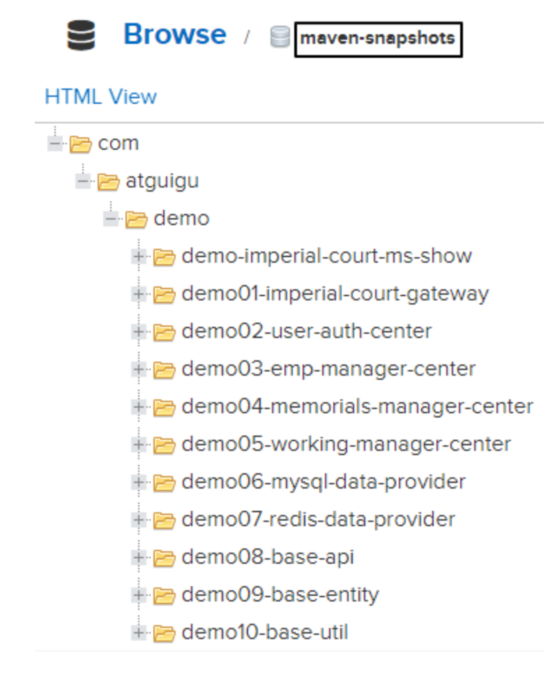

#### ③引用别人部署的 jar 包

##### [1]提出问题

- 默认访问的 Nexus 仓库：maven-public
- 存放别人部署 jar 包的仓库：maven-snapshots

##### [2]配置 Maven 工程

```xml
<repositories>
    <repository>
        <id>nexus-mine</id>
        <name>nexus-mine</name>
        <url>http://192.168.198.100:8081/repository/maven-snapshots/</url>
        <snapshots>
            <enabled>true</enabled>
        </snapshots>
        <releases>
            <enabled>true</enabled>
        </releases>
    </repository>
</repositories>
```

### 4、修改仓库配置

举例：修改 maven-central 仓库代理的远程库地址

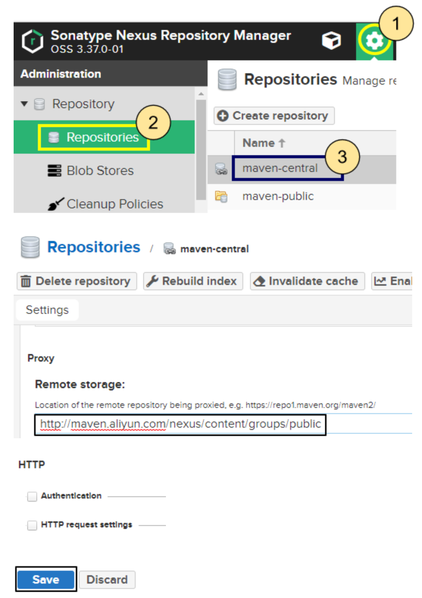

## 第二节 jar包冲突问题

### 1、谁需要面对 jar 包冲突？

先给结论：编订依赖列表的程序员。初次设定一组依赖，因为尚未经过验证，所以确实有可能存在各种问题，需要做有针对性的调整。那么谁来做这件事呢？我们最不希望看到的就是：团队中每个程序员都需要自己去找依赖，即使是做同一个项目，每个模块也各加各的依赖，没有统一管理。那前人踩过的坑，后人还要再踩一遍。而且大家用的依赖有很多细节都不一样，版本更是五花八门，这就让事情变得更加复杂。

所以虽然初期需要根据项目开发和实际运行情况对依赖配置不断调整，最终确定一个各方面都 OK 的版本。但是一旦确定下来，放在父工程中做依赖管理，各个子模块各取所需，这样基本上就能很好的避免问题的扩散。

即使开发中遇到了新问题，也可以回到源头检查、调整 dependencyManagement 配置的列表——而不是每个模块都要改。所以学完这一节你应该就会对前面讲过的『继承』有了更深的理解。

### 2、表现形式

由于实际开发时我们往往都会整合使用很多大型框架，所以一个项目中哪怕只是一个模块也会涉及到大量 jar 包。数以百计的 jar 包要彼此协调、精密配合才能保证程序正常运行。而规模如此庞大的 jar 包组合在一起难免会有磕磕碰碰。最关键的是由于 jar 包冲突所导致的问题非常诡异，这里我们只能罗列较为典型的问题，而没法保证穷举。

但是我们仍然能够指出一点：一般来说，由于我们自己编写代码、配置文件写错所导致的问题通常能够在异常信息中看到我们自己类的全类名或配置文件的所在路径。如果整个错误信息中完全没有我们负责的部分，全部是框架、第三方工具包里面的类报错，这往往就是 jar 包的问题所引起的。

而具体的表现形式中，主要体现为找不到类或找不到方法。

#### ①抛异常：找不到类

此时抛出的常见的异常类型：

- java.lang.**ClassNotFoundException**：编译过程中找不到类
- java.lang.**NoClassDefFoundError**：运行过程中找不到类
- java.lang.**LinkageError**：不同类加载器分别加载的多个类有相同的全限定名

我们来举个例子：

```xml
<dependency>
    <groupId>org.apache.httpcomponents</groupId>
    <artifactId>httpclient</artifactId>
    <version>4.x.x</version>
</dependency>
```

httpclient 这个 jar 包中有一个类：org.apache.http.conn.ssl.NoopHostnameVerifier。这个类在较低版本中没有，但在较高版本存在。比如：

| jar 包版本 | 是否存在 |
| :--------: | :------: |
|   4.3.6    |    否    |
|    4.4     |    是    |

那当我们确实需要用到 NoopHostnameVerifier 这个类，我们看到 Maven 通过依赖传递机制引入了这个 jar 包，所以没有明确地显式声明对这个 jar 包的依赖。可是 Maven 传递过来的 jar 包是 4.3.6 版本，里面没有包含我们需要的类，就会抛出异常。

而『冲突』体现在：4.3.6 和 4.4 这两个版本的 jar 包都被框架所依赖的 jar 包给传递进来了，但是假设 Maven 根据**『版本仲裁』**规则实际采纳的是 4.3.6。

#### ②抛异常：找不到方法

程序找不到符合预期的方法。这种情况多见于通过反射调用方法，所以经常会导致：java.lang.NoSuchMethodError。比如 antlr:antlr:x.x.x 这个包中有一个接口：antlr.collections.AST

| 版本  | getLine()方法 |
| :---: | :-----------: |
| 2.7.2 |      无       |
| 2.7.6 |      有       |

#### ③没报错但结果不对

发生这种情况比较典型的原因是：两个 jar 包中的类分别实现了同一个接口，这本来是很正常的。但是问题在于：由于没有注意命名规范，两个不同实现类恰巧是同一个名字。

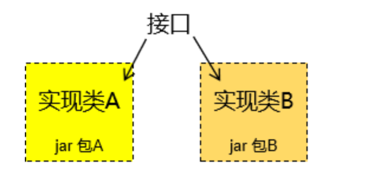

具体例子是有的同学在实际工作中遇到过：项目中部分模块使用 log4j 打印日志；其它模块使用 logback，编译运行都不会冲突，但是会引起日志服务降级，让你的 log 配置文件失效。比如：你指定了 error 级别输出，但是冲突就会导致 info、debug 都在输出。

### 3、本质

以上表现形式归根到底是**两种基本情况**导致的：

#### ①同一jar包的不同版本

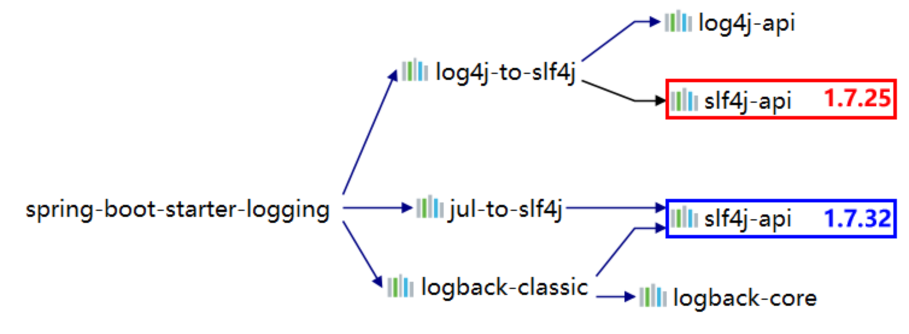

#### ③不同jar包中包含同名类

这里我们拿 netty 来举个例子，netty 是一个类似 Tomcat 的 Servlet 容器。通常我们不会直接依赖它，所以基本上都是框架传递进来的。那么当我们用到的框架很多时，就会有不同的框架用不同的坐标导入 netty。大家可以参照下表对比一下两组坐标：

| 截止到3.2.10.Final版本以前的坐标形式：                       | 从3.3.0.Final版本开始以后的坐标形式：                        |
| ------------------------------------------------------------ | ------------------------------------------------------------ |
| <dependency>    <groupId>**org.jboss.netty**</groupId> <artifactId>**netty**</artifactId> <version>**3.2.10.Final**</version> </dependency> | <dependency> <groupId>**io.netty**</groupId> <artifactId>**netty**</artifactId> <version>**3.9.2.Final**</version> </dependency> |

但是偏偏这两个**『不同的包』**里面又有很多**『全限定名相同』**的类。例如：

> org.jboss.netty.channel.socket.ServerSocketChannelConfig.class 
>
> org.jboss.netty.channel.socket.nio.NioSocketChannelConfig.class 
>
> org.jboss.netty.util.internal.jzlib.Deflate.class 
>
> org.jboss.netty.handler.codec.serialization.ObjectDecoder.class 
>
> org.jboss.netty.util.internal.ConcurrentHashMap$HashIterator.class org.jboss.netty.util.internal.jzlib.Tree.class org.jboss.netty.util.internal.ConcurrentIdentityWeakKeyHashMap$Segment.class org.jboss.netty.handler.logging.LoggingHandler.class 
>
> org.jboss.netty.channel.ChannelHandlerLifeCycleException.class 
>
> org.jboss.netty.util.internal.ConcurrentIdentityHashMap$ValueIterator.class org.jboss.netty.util.internal.ConcurrentIdentityWeakKeyHashMap$Values.class org.jboss.netty.util.internal.UnterminatableExecutor.class 
>
> org.jboss.netty.handler.codec.compression.ZlibDecoder.class 
>
> org.jboss.netty.handler.codec.rtsp.RtspHeaders$Values.class 
>
> org.jboss.netty.handler.codec.replay.ReplayError.class 
>
> org.jboss.netty.buffer.HeapChannelBufferFactory.class
>
> ……

其实还有很多，这里列出的只是冰山一角。

当然，如果全限定名相同，类中的代码也完全相同，那么用着也行。问题是如果**『全限定名相同』**，但是**『代码不同』**，那可太坑了。我们随便找一个来看看：

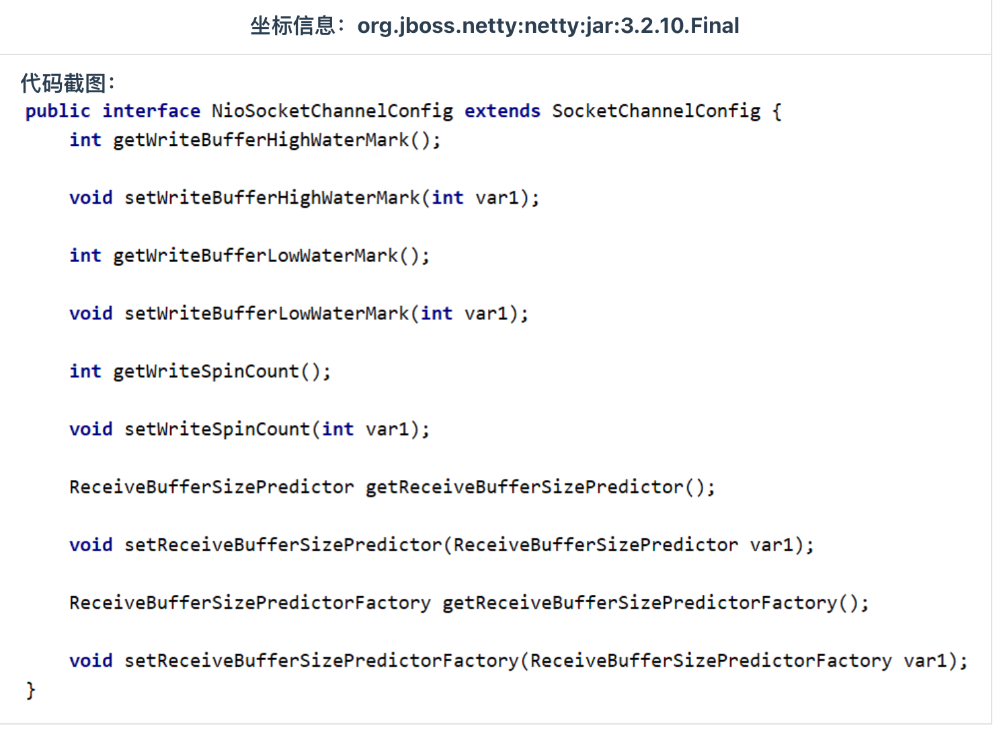

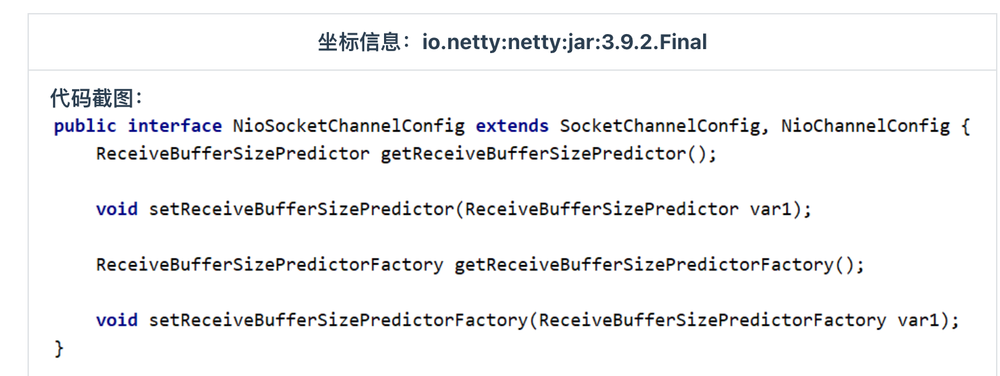

### 4、解决办法

#### ①概述

很多情况下常用框架之间的整合容易出现的冲突问题都有人总结过了，拿抛出的异常搜索一下基本上就可以直接找到对应的 jar 包。我们接下来要说的是通用方法。

不管具体使用的是什么工具，基本思路无非是这么两步：

- 第一步：把彼此冲突的 jar 包找到
- 第二步：在冲突的 jar 包中选定一个。具体做法无非是通过 exclusions 排除依赖，或是明确声明依赖。

#### ②IDEA 的 Maven Helper 插件

这个插件是 IDEA 中安装的插件，不是 Maven 插件。它能够给我们罗列出来同一个 jar 包的不同版本，以及它们的来源。但是对不同 jar 包中同名的类没有办法。

> 在IDEA中安装 Maven Helper 插件

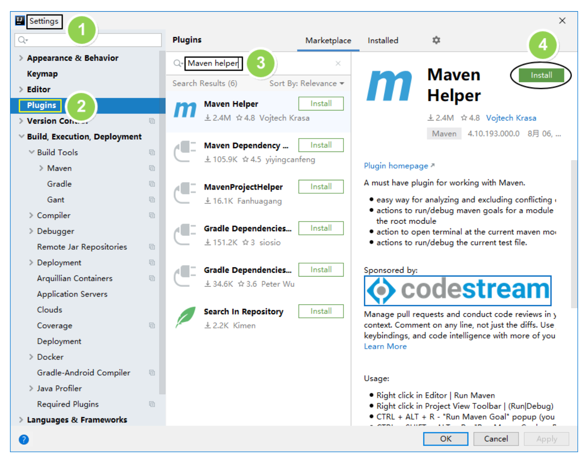

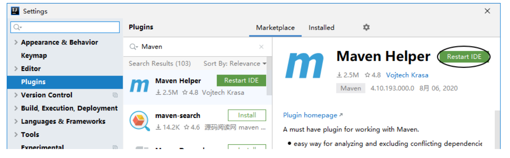

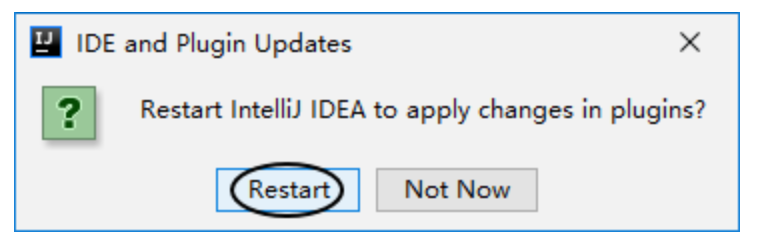

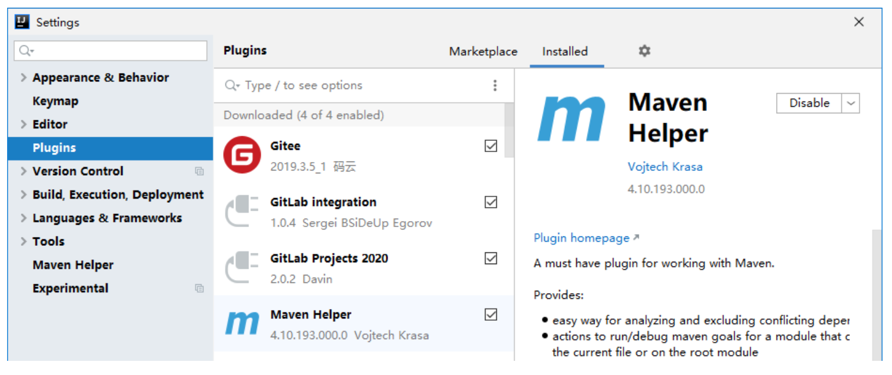

> 基于pom.xml 的依赖冲突分析。

1、打开依赖分析界面

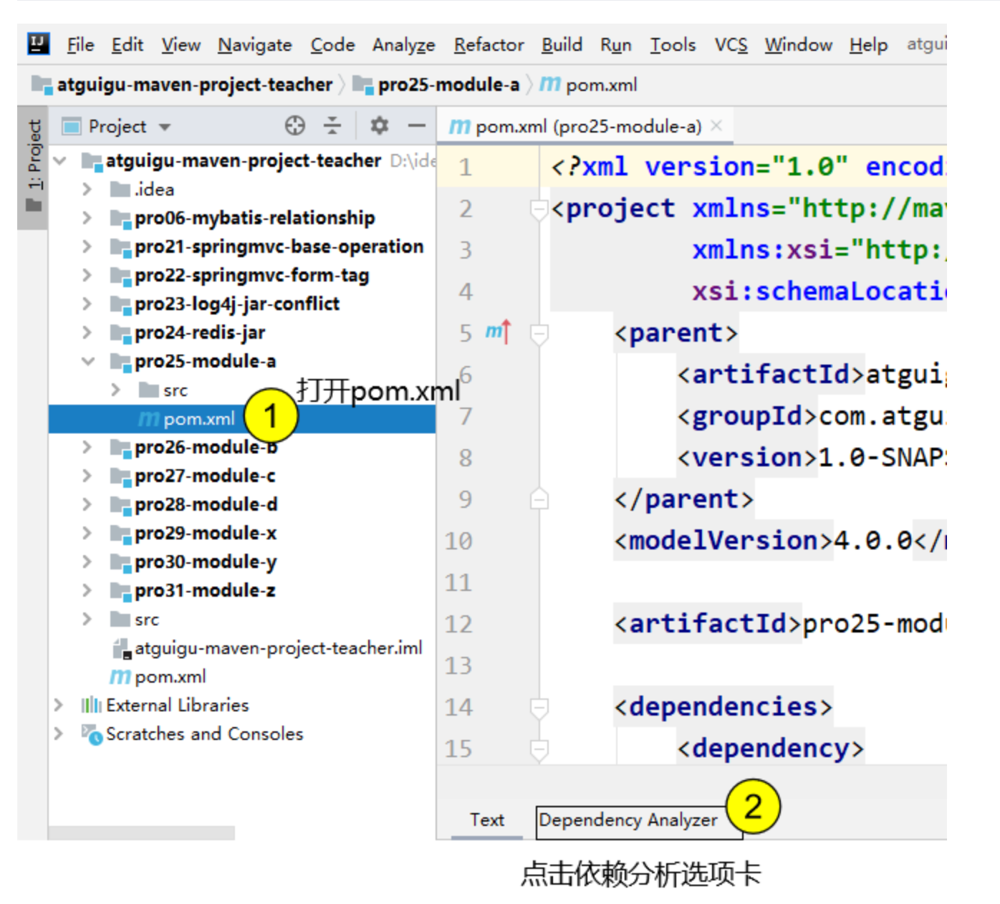

注意：这个功能需要安装了 IDEA 的 Maven helper 插件才有。

2、查看冲突分析结果

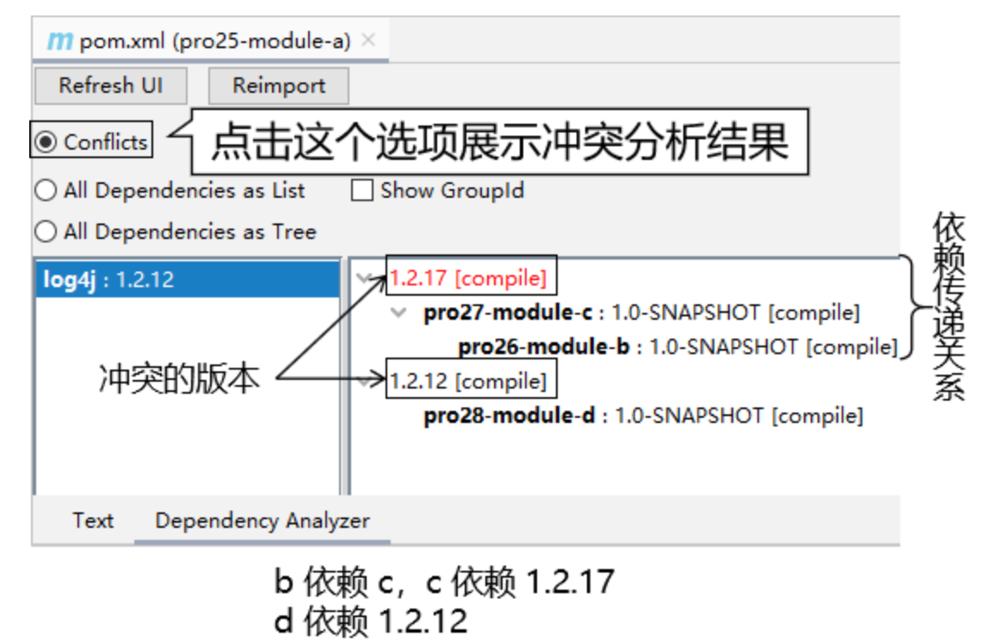

#### ③Maven 的 enforcer 插件

使用 Maven 的 enforcer 插件既可以检测同一个 jar 包的不同版本，又可以检测不同 jar 包中同名的类。

##### [1]引入 netty 依赖

这里我们引入两个对 netty 的依赖，展示不同 jar 包中有同名类的情况。

```xml
<dependencies>
    <dependency>
        <groupId>org.jboss.netty</groupId>
        <artifactId>netty</artifactId>
        <version>3.2.10.Final</version>
    </dependency>

    <dependency>
        <groupId>io.netty</groupId>
        <artifactId>netty</artifactId>
        <version>3.9.2.Final</version>
    </dependency>
</dependencies>
```

##### [2]配置 enforcer 插件

```xml
<build>
    <pluginManagement>
        <plugins>
            <plugin>
                <groupId>org.apache.maven.plugins</groupId>
                <artifactId>maven-enforcer-plugin</artifactId>
                <version>1.4.1</version>
                <executions>
                    <execution>
                        <id>enforce-dependencies</id>
                        <phase>validate</phase>
                        <goals>
                            <goal>display-info</goal>
                            <goal>enforce</goal>
                        </goals>
                    </execution>
                </executions>
                <dependencies>
                    <dependency>
                        <groupId>org.codehaus.mojo</groupId>
                        <artifactId>extra-enforcer-rules</artifactId>
                        <version>1.0-beta-4</version>
                    </dependency>
                </dependencies>
                <configuration>
                    <rules>
                        <banDuplicateClasses>
                            <findAllDuplicates>true</findAllDuplicates>
                        </banDuplicateClasses>
                    </rules>
                </configuration>
            </plugin>
        </plugins>
    </pluginManagement>
</build>
```

##### [3]测试

执行如下 Maven 命令：

```sh
mvn clean package enforcer:enforce
```

部分运行结果：

> [INFO] --- maven-enforcer-plugin:1.4.1:enforce (default-cli) @ pro32-duplicate-class ---
>
> [WARNING] Rule 0: org.apache.maven.plugins.enforcer.BanDuplicateClasses failed with message:
>
> Duplicate classes found:
>
> Found in:
>
> io.netty:netty:jar:3.9.2.Final:compile
>
> org.jboss.netty:netty:jar:3.2.10.Final:compile
>
> Duplicate classes:
>
> org/jboss/netty/channel/socket/ServerSocketChannelConfig.class
>
> org/jboss/netty/channel/socket/nio/NioSocketChannelConfig.class
>
> org/jboss/netty/util/internal/jzlib/Deflate.class
>
> org/jboss/netty/handler/codec/serialization/ObjectDecoder.class
>
> org/jboss/netty/util/internal/ConcurrentHashMap$HashIterator.class
>
> ……

> TIP
>
> 最后，问你一个问题：解决 jar 包冲突问题这么麻烦，是不是不该用 Maven？

## 第三节 体系外 jar 包引入

### 1、提出问题

『体系外 jar 包』这个名字是我起的，来源是这样——目前来说我们在 Maven 工程中用到的 jar 包都是通过 Maven 本身的机制导入进来的。

而实际开发中确实有可能用到一些 jar 包并非是用 Maven 的方式发布，那自然也没法通过 Maven 导入。

此时如果我们能够拿到该 jar 包的源码那还可以自己建一个 Maven 工程，自己打包。可是如果连源码都没有呢？

这方面的例子包括一些人脸识别用的 jar 包、海康视频监控 jar 包等等。

### 2、解决办法

#### ①准备一个体系外 jar 包

我们通过学 Maven 以前的方式创建一个 Java 工程，然后导出 jar 包即可用来测试。

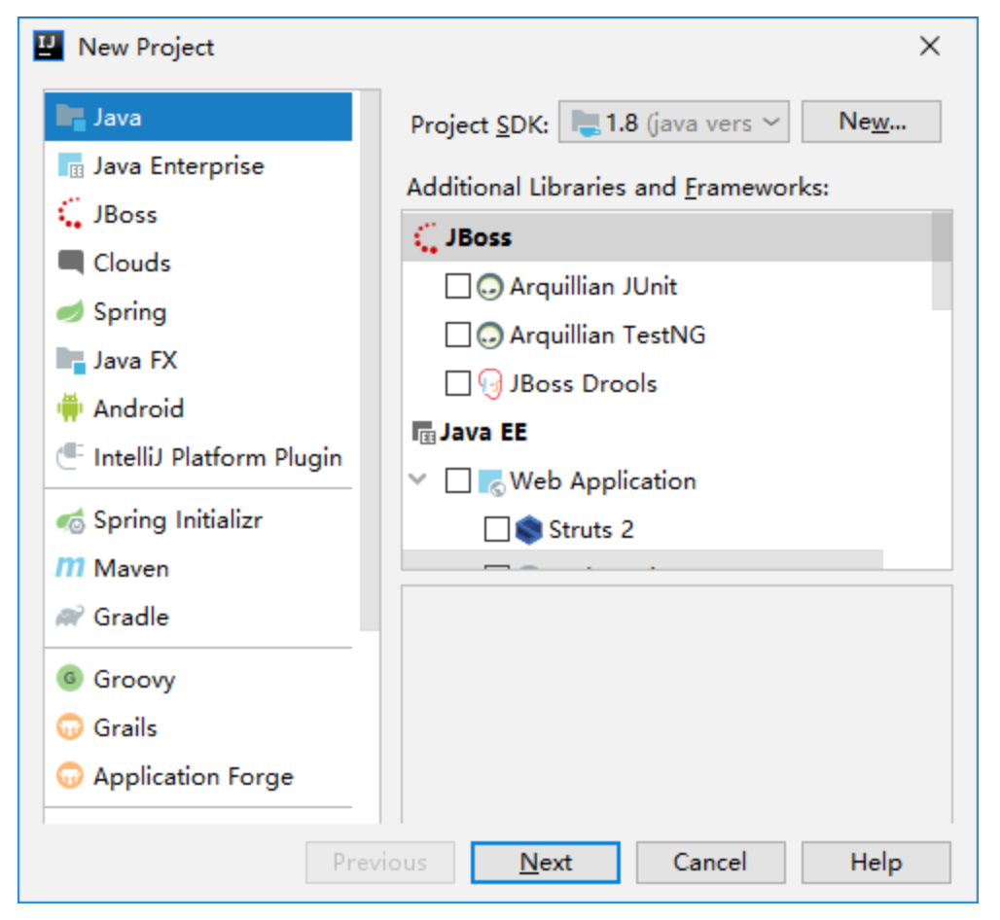

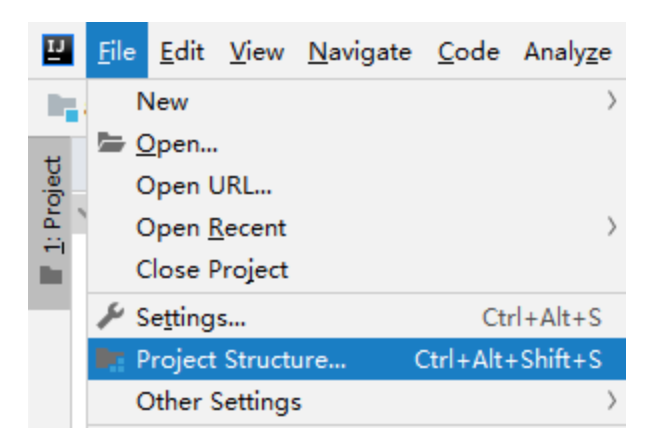

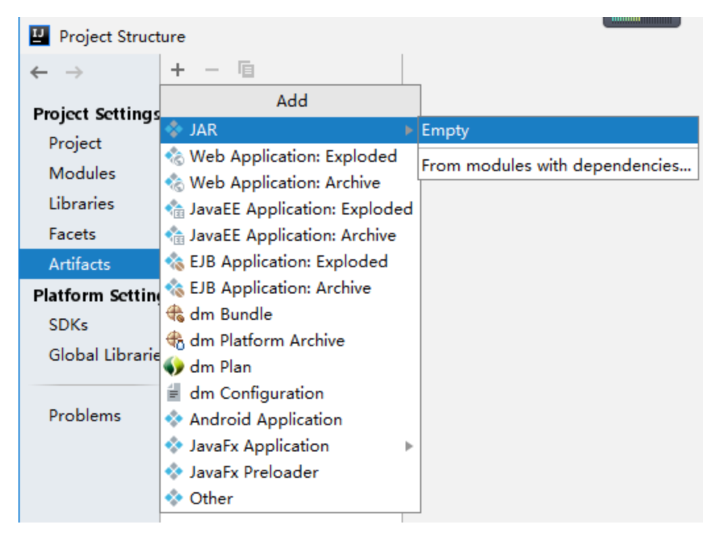

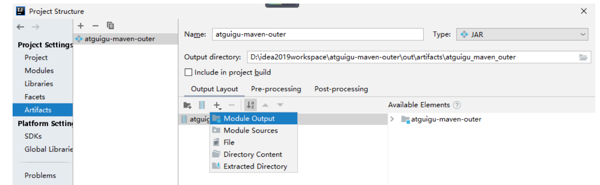

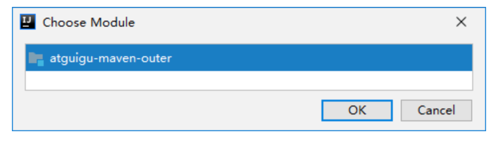

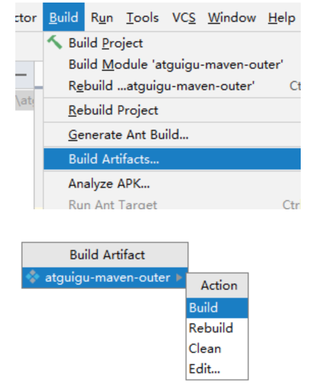

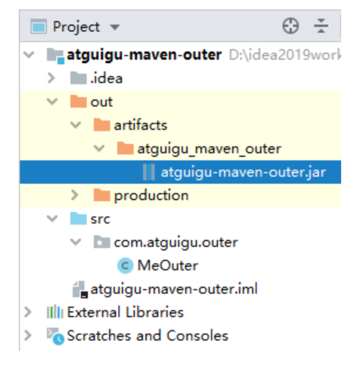

#### ②将该 jar 包安装到 Maven 仓库

这里我们使用 install 插件的 install-file 目标：

```sh
mvn install:install-file -Dfile=[体系外 jar 包路径] \
-DgroupId=[给体系外 jar 包强行设定坐标] \
-DartifactId=[给体系外 jar 包强行设定坐标] \
-Dversion=1 \
-Dpackage=jar
```

例如（Windows 系统下使用 ^ 符号换行；Linux 系统用 \）：

```sh
mvn install:install-file -Dfile=D:\idea2019workspace\atguigu-maven-outer\out\artifacts\atguigu_maven_outer\atguigu-maven-outer.jar ^
-DgroupId=com.atguigu.maven ^
-DartifactId=atguigu-maven-outer ^
-Dversion=1 ^
-Dpackaging=jar
```

执行结果：

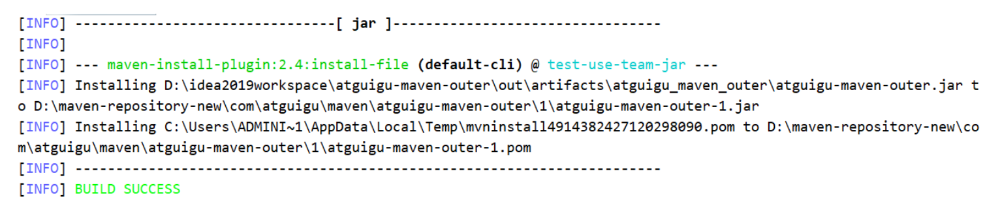

再看本地仓库中确实有：

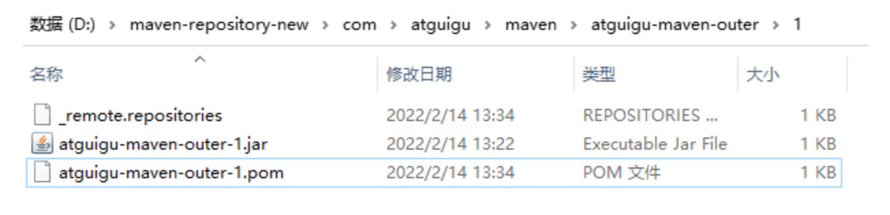

我们打开 POM 文件看看：

```xml
<?xml version="1.0" encoding="UTF-8"?>
<project xsi:schemaLocation="http://maven.apache.org/POM/4.0.0 http://maven.apache.org/xsd/maven-4.0.0.xsd" xmlns="http://maven.apache.org/POM/4.0.0"
    xmlns:xsi="http://www.w3.org/2001/XMLSchema-instance">
  <modelVersion>4.0.0</modelVersion>
  <groupId>com.atguigu.maven</groupId>
  <artifactId>atguigu-maven-outer</artifactId>
  <version>1</version>
  <description>POM was created from install:install-file</description>
</project>
```

#### ③测试

在其它地方依赖这个 jar 包：

```xml
<dependency>
    <groupId>com.atguigu.maven</groupId>
    <artifactId>atguigu-maven-outer</artifactId>
    <version>1</version>
</dependency>
```

创建对象、调用方法：

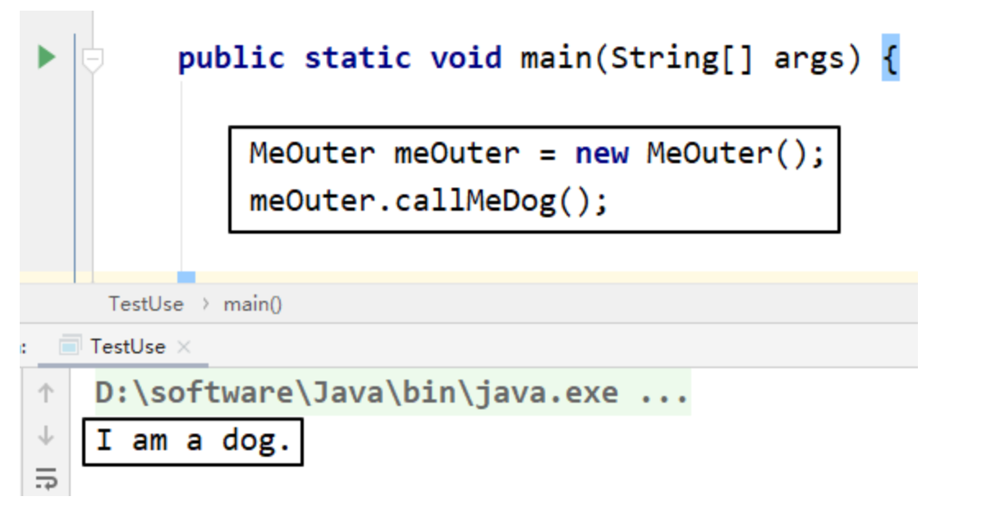