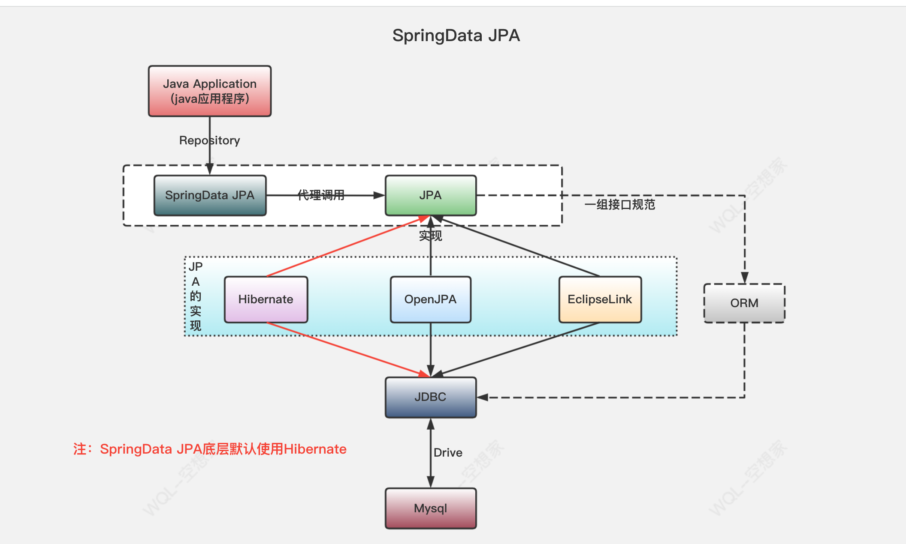
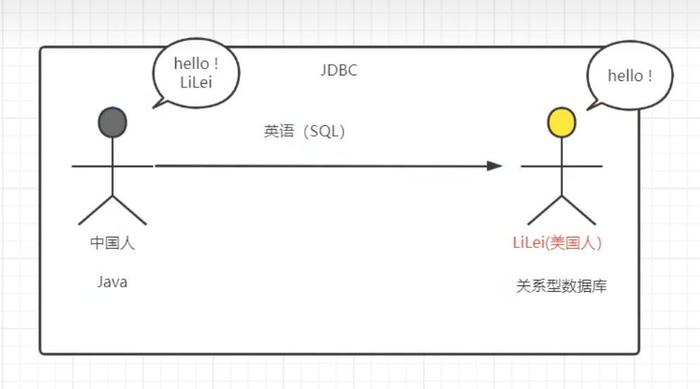
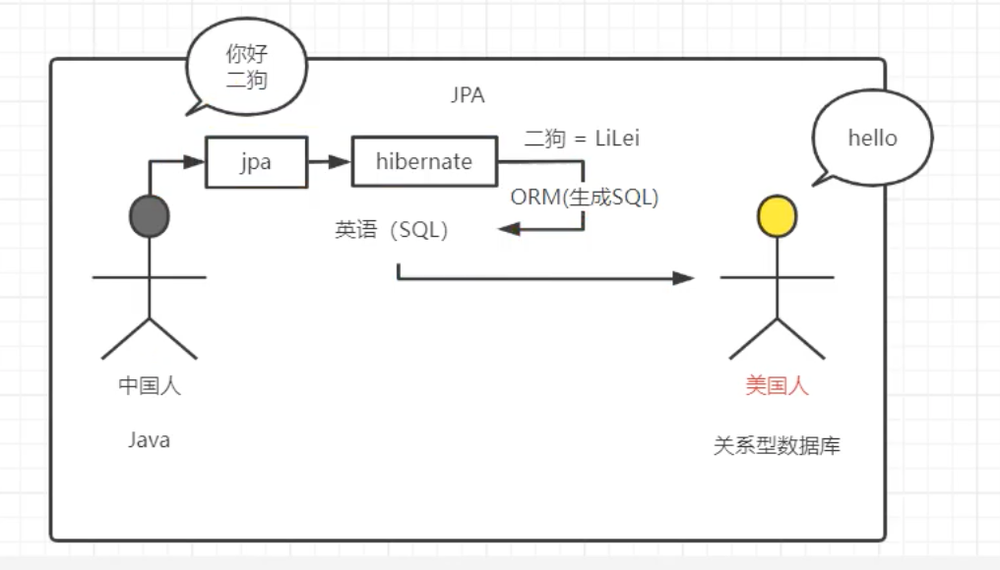
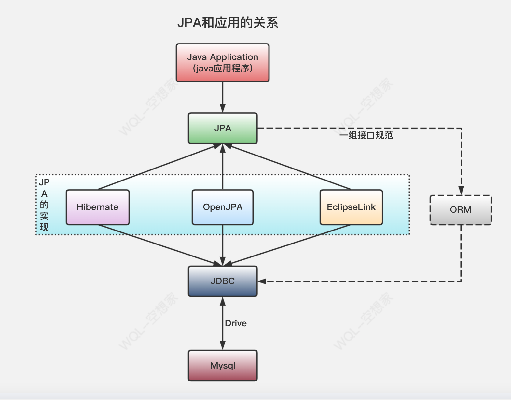

---
# 当前页面内容标题
title: 02、Spring Data JPA简介
# 分类
category:
  - springdata
# 标签
tag: 
  - spring
  - springdata
  - java
sticky: false
# 是否收藏在博客主题的文章列表中，当填入数字时，数字越大，排名越靠前。
star: false
# 是否将该文章添加至文章列表中
article: true
# 是否将该文章添加至时间线中
timeline: true
---

02、Spring Data JPA简介
---

### 2.1、什么是JPA？

JPA 即Java Persistence API。

JPA 是一个**基于O/R映射的标准规范**（目前最新版本是JPA 2.2 ）。所谓规范即只定义标准规则（如注解、接口），不提供实现，软件提供商可以按照标准规范来实现，而使用者只需按照规范中定义的方式来使用，而不用和软件提供商的实现打交道。

JPA的出现有两个原因：

简化现有Java EE和Java SE应用的对象持久化的开发工作；

Sun希望整合对ORM技术，实现持久化领域的统一。

JPA 的主要实现有Hibernate、EclipseLink 和OpenJPA 等，这也意味着我们只要使用JPA 来开发，无论是哪一个开发方式都是一样的。

操作步骤：

```
jpa操作的操作步骤
		1.加载配置文件创建实体管理器工厂
			Persisitence：静态方法（根据持久化单元名称创建实体管理器工厂）
				createEntityMnagerFactory（持久化单元名称）
			作用：创建实体管理器工厂
			
		2.根据实体管理器工厂，创建实体管理器
			EntityManagerFactory ：获取EntityManager对象
			方法：createEntityManager
			* 内部维护的很多的内容
				内部维护了数据库信息，
				维护了缓存信息
				维护了所有的实体管理器对象
				再创建EntityManagerFactory的过程中会根据配置创建数据库表
			* EntityManagerFactory的创建过程比较浪费资源
			特点：线程安全的对象
				多个线程访问同一个EntityManagerFactory不会有线程安全问题
			* 如何解决EntityManagerFactory的创建过程浪费资源（耗时）的问题？
			思路：创建一个公共的EntityManagerFactory的对象
			* 静态代码块的形式创建EntityManagerFactory
			
		3.创建事务对象，开启事务
			EntityManager对象：实体类管理器
				getTransaction : 创建事务对象
				presist ： 保存
				merge  ： 更新
				remove ： 删除
				find/getReference ： 根据id查询
				
			Transaction 对象 ： 事务
				begin：开启事务
				commit：提交事务
				rollback：回滚
		4.增删改查操作
		5.提交事务
		6.释放资源
	
	i.搭建环境的过程
		1.创建maven工程导入坐标
		2.需要配置jpa的核心配置文件
			*位置：配置到类路径下的一个叫做 META-INF 的文件夹下
			*命名：persistence.xml
		3.编写客户的实体类
		4.配置实体类和表，类中属性和表中字段的映射关系
		5.保存客户到数据库中
	ii.完成基本CRUD案例
		persist ： 保存
		merge ： 更新
		remove ： 删除
		find/getRefrence ： 根据id查询
		
	iii.jpql查询
		sql：查询的是表和表中的字段
		jpql：查询的是实体类和类中的属性
		* jpql和sql语句的语法相似
		
		1.查询全部
		2.分页查询
		3.统计查询
		4.条件查询
		5.排序
```


### 2.2、JPA与JDBC关系

相同处：

1. 都跟数据库操作有关，JPA是 JDBC 的升华，升级版。
2. JDBC 和 JPA都是一组规范接口
3. 都是由SUN官方推出的

不同处：

1. JDBC是由各个关系型数据库实现的，JPA是由ORM框架实现。
2. JDBC 使用 SQL 语句和数据库通信。JPA用面向对象方式，通过ORM框架来生成SQL，进行操作。
3. JPA 在 JDBC 之上的，JPA也要依赖 JDBC 才能操作数据库。



图示对比：





JDBC 是我们最熟悉的用力啊操作数据库的技术，但是随之而来带来了一些问题：

1. 需要面向SQL语句来操作数据库，开发人员学习成本更高。
2. 数据库的移植性不高，不同数据库的SQL语句无法通用。
3. Java对象和数据库类型映射是个麻烦事。


### 2.3、JPA 规范

但是Sun公司在JDK1.5提出了JPA：

JPA 全称 Java Persistence API（2019年重命名为 Jakarta Persistence API），是Sun官方提出的一种ORM规范。O：Object、R：Relational、M：mapping

**作用**：

1、简化持久化操作的开发工作：让开发者从繁琐的 JDBC 和 SQL 代码中解脱出来，直接面向对象持久化操作。

2、Sun希望持久化技术能够统一，实现天下归一：如果你是基于 JPA 进行持久化你可以随意切换数据库。


该规范为我们提供了：

1. **ORM映射元数据**：JPA支持XML和注解两种元数据的形式，元数据描述对象和表之间的映射关系，框架据此将实体对象持久化到数据库表中。

如：@Entity、@Table、@Id、@Column等注解！

2. **JPA 的 API**：用来操作实体对象，执行CRUD操作，框架在后台替我们完成所有的事情，开发者从繁琐的 JDBC 和 SQL代码中解脱出来。

如：entityManager.merge(T t);

3. **JPQL查询语言**：通过面向对象而非面向数据库的查询语言查询数据，避免程序的SQL语句紧密耦合。

如：from Student s where s.name = ?


所以：JPA仅仅是一种规范，也就是说 JPA 仅仅定义了一些接口，而接口是需要实现才能工作的。


### 2.4、Hibernate与JPA：

所以底层需要魔种实现，而Hibernate就是实现了 JPA 接口的ORM框架。

也就是说：JPA是一套ORM规范，Hibernate实现了JPA规范！



### 2.5、Mybatis与Hibernate

Mybatis：小巧、方便、高效、简单、直接、半自动！

Hibernate：强大、方便、高效、复杂、绕弯子、全自动！

Hibernate的优点：

1、Hibernate是全自动，hibernate完全可以通过对象关系模型实现对数据库的操作，拥有完整的JavaBean对象与数据库的映射结构来自动生成sql。

2、功能强大，数据库无关性好，O/R映射能力强，需要写的代码很少，开发速度很快。

3、有更好的二级缓存机制，可以使用第三方缓存。

4、数据库移植性良好。

5、hibernate拥有完整的日志系统，hibernate日志系统非常健全，涉及广泛，包括sql记录、关系异常、优化警告、缓存提示、脏数据警告等

Hibernate的缺点：

1、学习门槛高，精通门槛更高，程序员如何设计O/R映射，在性能和对象模型之间如何取得平衡，以及怎样用好Hibernate方面需要的经验和能力都很强才行

2、hibernate的sql很多都是自动生成的，无法直接维护sql；虽然有hql查询，但功能还是不及sql强大，见到报表等变态需求时，hql查询要虚，也就是说hql查询是有局限的；hibernate虽然也支持原生sql查询，但开发模式上却与orm不同，需要转换思维，因此使用上有些不方便。总之写sql的灵活度上hibernate不及mybatis。

场景：首先hibernate在国外更加流行，在业务相对简单的系统进行使用，随着微服务的流行spring data jpa也流行起来了。

Mybatis的优点：

1、易于上手和掌握，提供了数据库查询的自动对象绑定功能，而且延续了很好的SQL使用经验，对于没有那么高的对象模型要求的项目来说，相当完美。

2、sql写在xml里，便于统一管理和优化， 解除sql与程序代码的耦合。

3、提供映射标签，支持对象与数据库的orm字段关系映射

4、 提供对象关系映射标签，支持对象关系组建维护

5、提供xml标签，支持编写动态sql。

6、速度相对于Hibernate的速度较快

Mybatis的缺点：

1、关联表多时，字段多的时候，sql工作量很大。

2、sql依赖于数据库，导致数据库移植性差。

3、由于xml里标签id必须唯一，导致DAO中方法不支持方法重载。

4、对象关系映射标签和字段映射标签仅仅是对映射关系的描述，具体实现仍然依赖于sql。

5、DAO层过于简单，对象组装的工作量较大。

6、不支持级联更新、级联删除。

7、Mybatis的日志除了基本记录功能外，其它功能薄弱很多。

8、编写动态sql时,不方便调试，尤其逻辑复杂时。

9、提供的写动态sql的xml标签功能简单，编写动态sql仍然受限，且可读性低。

场景：在国内更加流行，在业务比较复杂的情况下进行使用。小巧灵活！


### 2.6、JPA注解

| 注解               | 解释                                                         |
| ------------------ | ------------------------------------------------------------ |
| @Entity            | 声明类为实体或表。                                           |
| @Table             | 声明表名。                                                   |
| @Basic             | 指定非约束明确的各个字段。                                   |
| @Embedded          | 指定类或它的值是一个可嵌入的类的实例的实体的属性。           |
| @Id                | 指定的类的属性，用于识别（一个表中的主键）。                 |
| @GeneratedValue    | 指定如何标识属性可以被初始化，例如自动、手动、或从序列表中获得的值。 |
| @Transient         | 指定的属性，它是不持久的，即：该值永远不会存储在数据库中。   |
| @Column            | 指定持久属性栏属性。                                         |
| @SequenceGenerator | 指定在@GeneratedValue注解中指定的属性的值。它创建了一个序列。 |
| @TableGenerator    | 指定在@GeneratedValue批注指定属性的值发生器。它创造了的值生成的表。 |
| @AccessType        | 这种类型的注释用于设置访问类型。如果设置@AccessType（FIELD），则可以直接访问变量并且不需要getter和setter，但必须为public。如果设置@AccessType（PROPERTY），通过getter和setter方法访问Entity的变量。 |
| @JoinColumn        | 指定一个实体组织或实体的集合。这是用在多对一和一对多关联。   |
| @UniqueConstraint  | 指定的字段和用于主要或辅助表的唯一约束。                     |
| @ColumnResult      | 参考使用select子句的SQL查询中的列名。                        |
| @ManyToMany        | 定义了连接表之间的多对多一对多的关系。                       |
| @ManyToOne         | 定义了连接表之间的多对一的关系。                             |
| @OneToMany         | 定义了连接表之间存在一个一对多的关系。                       |
| @OneToOne          | 定义了连接表之间有一个一对一的关系。                         |
| @NamedQueries      | 指定命名查询的列表。                                         |
| @NamedQuery        | 指定使用静态名称的查询。                                     |

