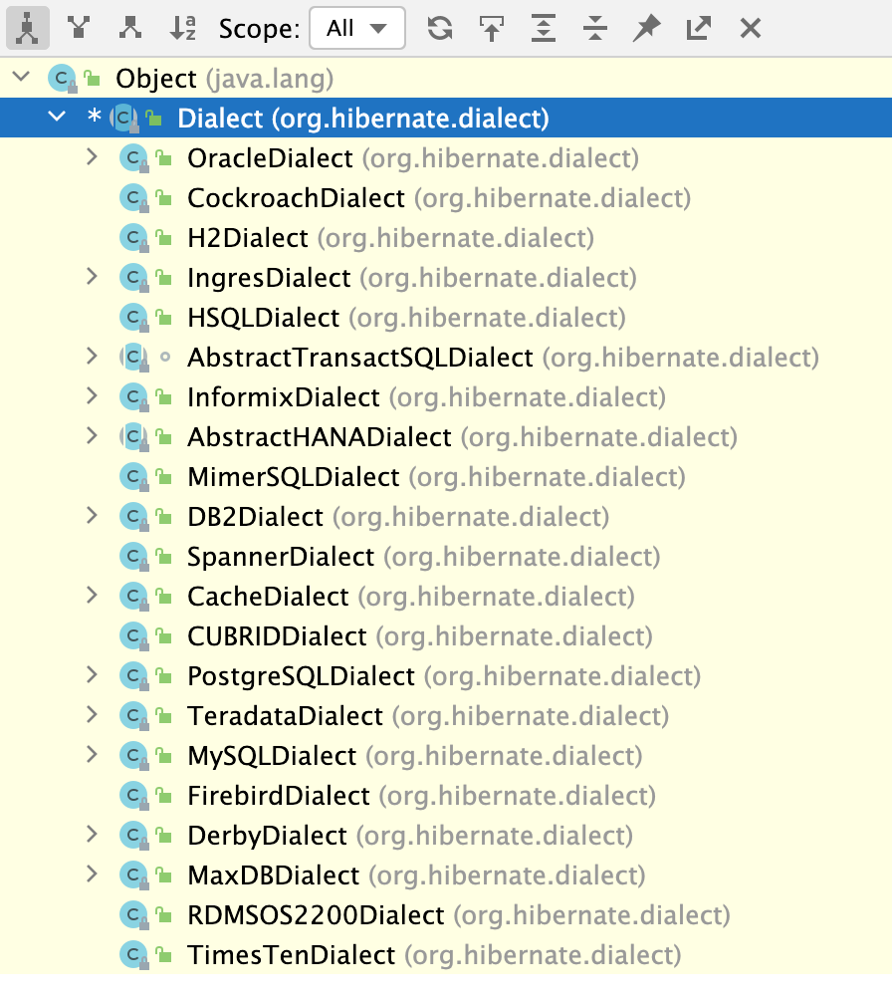

---
# 当前页面内容标题
title: 03、Hibernate快速搭建JPA
# 分类
category:
  - springdata
# 标签
tag: 
  - spring
  - springdata
  - java
sticky: false
# 是否收藏在博客主题的文章列表中，当填入数字时，数字越大，排名越靠前。
star: false
# 是否将该文章添加至文章列表中
article: true
# 是否将该文章添加至时间线中
timeline: true
---

03、Hibernate快速搭建JPA
---

### Hibernate示例

我们来实现一个Hibernate来实例感受一下：

01-springdata-jpa-hibernate

#### 1、pom.xml

```xml
<dependencies>
    <!--junit-->
    <dependency>
        <groupId>junit</groupId>
        <artifactId>junit</artifactId>
        <version>4.12</version>
    </dependency>
    <!--hibernate对jpa的支持包！-->
    <dependency>
        <groupId>org.hibernate</groupId>
        <artifactId>hibernate-entitymanager</artifactId>
        <version>5.6.0.Final</version>
        <type>pom</type>
    </dependency>
    <!--mysql and MariaDB-->
    <dependency>
        <groupId>mysql</groupId>
        <artifactId>mysql-connector-java</artifactId>
        <version>8.0.27</version>
    </dependency>
    <!-- log日志 -->
    <dependency>
        <groupId>log4j</groupId>
        <artifactId>log4j</artifactId>
        <version>1.2.17</version>
    </dependency>
</dependencies>
```

==对于这里有一个注意点，那就是我们的hibernate-entitymanager如果你使用了6.0.0.Alpha7或者更高的版本，可能会有很多改变，所以我推荐使用5.6.0.Final！==

#### 2、创建实体类！

```java
package com.yykk.pojo;

import javax.persistence.*;

/**
 * @author yykk
 */
@Entity // 作为 hibernate实体类
@Table(name = "tb_Customer") // 配置数据库表的名称,实体类中属性和表中字段的映射关系!
public class Customer {

    /**
     * @Id：声明主键的配置
     * @GeneratedValue:配置主键的生成策略 strategy
     * GenerationType.IDENTITY ：自增，mysql
     * * 底层数据库必须支持自动增长（底层数据库支持的自动增长方式，对id自增）
     * GenerationType.SEQUENCE : 序列，oracle
     * * 底层数据库必须支持序列
     * GenerationType.TABLE : jpa提供的一种机制，通过一张数据库表的形式帮助我们完成主键自增
     * GenerationType.AUTO ： 由程序自动的帮助我们选择主键生成策略
     * @Column:配置属性和字段的映射关系 name：数据库表中字段的名称
     */
    @Id
    @GeneratedValue(strategy = GenerationType.IDENTITY)
    private Long id;

    @Column(name = "cust_name")
    private String custName;//客户名称

    @Column(name = "cust_source")
    private String custSource;//客户来源

    @Column(name = "cust_level")
    private String custLevel;//客户级别

    @Column(name = "cust_industry")
    private String custIndustry;//客户所属行业

    @Column(name = "cust_phone")
    private String custPhone;//客户的联系方式

    @Column(name = "cust_address")
    private String custAddress;//客户地址


    public Long getId() {
        return id;
    }

    public void setId(Long id) {
        this.id = id;
    }

    public String getCustName() {
        return custName;
    }

    public void setCustName(String custName) {
        this.custName = custName;
    }

    public String getCustSource() {
        return custSource;
    }

    public void setCustSource(String custSource) {
        this.custSource = custSource;
    }

    public String getCustLevel() {
        return custLevel;
    }

    public void setCustLevel(String custLevel) {
        this.custLevel = custLevel;
    }

    public String getCustIndustry() {
        return custIndustry;
    }

    public void setCustIndustry(String custIndustry) {
        this.custIndustry = custIndustry;
    }

    public String getCustPhone() {
        return custPhone;
    }

    public void setCustPhone(String custPhone) {
        this.custPhone = custPhone;
    }

    public String getCustAddress() {
        return custAddress;
    }

    public void setCustAddress(String custAddress) {
        this.custAddress = custAddress;
    }

    @Override
    public String toString() {
        return "Customer{" +
                "id=" + id +
                ", custName='" + custName + '\'' +
                ", custSource='" + custSource + '\'' +
                ", custLevel='" + custLevel + '\'' +
                ", custIndustry='" + custIndustry + '\'' +
                ", custPhone='" + custPhone + '\'' +
                ", custAddress='" + custAddress + '\'' +
                '}';
    }
}
```

#### 3、配置配置文件！

hibernate.xml

```xml
<?xml version='1.0' encoding='utf-8'?>
<!DOCTYPE hibernate-configuration PUBLIC
        "-//Hibernate/Hibernate Configuration DTD//EN"
        "http://www.hibernate.org/dtd/hibernate-configuration-3.0.dtd">
<hibernate-configuration>
    <session-factory>
        <!--配置数据库的连接信息！-->
        <property name="connection.driver_class" >com.mysql.jdbc.Driver</property>
        <property name="connection.url">jdbc:mysql://localhost:3306/spring_data?characterEncoding=UTF-8;useSSL=false;useUnicode=true;serverTImezone=UTC</property>
        <property name="hibernate.connection.username">root</property>
        <property name="hibernate.connection.password">123456</property>
        <!-- 指定连接数据库的编码 -->
        <property name="connection.characterEncoding">utf8</property>
        <!-- 指定数据库方言 -->
        <property name="hibernate.dialect">org.hibernate.dialect.MySQLDialect</property>
        <!-- 显示Hibernate持久化操作所生成的SQL,默认为false -->
        <property name="show_sql">true</property>
        <!-- 将SQL脚本进行格式化后再输出，默认为false -->
        <property name="format_sql">true</property>
        <!-- 指定自动生成数据表的策略
                 默认为none 不自动生成
                 update  如果没有表会自动创建，有会自动检查更新
                 create  不管有没有这个表，每一次都会创建一次！
        -->
        <property name="hbm2ddl.auto">update</property>
        <!--配置方言：数据库连接类型！-->
        <property name="dialect">org.hibernate.dialect.MySQLDialect</property>
        <!-- DB schema will be updated if needed -->
        <!-- 指定pojo，进行表的ORM映射 -->
        <mapping class="com.yykk.pojo.Customer"/>
    </session-factory>

</hibernate-configuration>
```

对于我们的数据库选型，这里可以自由指定，打开Dialog方言类，按 ctrl + H 即可查看所有的选型！

如下所示：



#### 4、测试类测试！

```java
package com.Test;

import com.yykk.pojo.Customer;
import org.hibernate.HibernateException;
import org.hibernate.Session;
import org.hibernate.SessionFactory;
import org.hibernate.Transaction;
import org.hibernate.boot.MetadataSources;
import org.hibernate.boot.registry.StandardServiceRegistry;
import org.hibernate.boot.registry.StandardServiceRegistryBuilder;
import org.junit.Before;
import org.junit.Test;

import java.util.List;

public class HibernateTest {

    // session 工厂 Session：数据库会话，代码持久化操作数据库的一种桥梁！
    private SessionFactory sessionFactory;

    @Before
    public void init() {
        StandardServiceRegistry registry = new StandardServiceRegistryBuilder().configure("hibernate.xml").build();

        // 2、根据服务注册类创建一个元数据资源集，同时构建元数据并生成应用一般唯一的session工厂
        sessionFactory = new MetadataSources(registry).buildMetadata().buildSessionFactory();
    }

    /**
     * 新增数据
     */
    @Test
    public void testInsert() {
        // 进行持久化操作！
        try {
            Session session = sessionFactory.openSession();
            Transaction transaction = session.beginTransaction();

            Customer customer = new Customer();
            customer.setCustName("yykk");
            customer.setCustPhone("123456");
            session.save(customer);
            transaction.commit();
        } catch (HibernateException e) {
            e.printStackTrace();
        } finally {
            sessionFactory.close();
        }
    }

    /**
     * 查询数据
     */
    @Test
    public void testQuery() {
        // 进行持久化操作！
        try {
            Session session = sessionFactory.openSession();
            Transaction transaction = session.beginTransaction();

            Customer customer = session.find(Customer.class, 1L);
            System.out.println(customer);
            transaction.commit();
        } catch (HibernateException e) {
            e.printStackTrace();
        } finally {
            sessionFactory.close();
        }
    }

    /**
     * lazy 查询数据
     */
    @Test
    public void testQuery_lazy() {
        // 进行持久化操作！
        try {
            Session session = sessionFactory.openSession();
            Transaction transaction = session.beginTransaction();

            Customer customer = session.load(Customer.class, 1L);
            System.out.println(customer);
            transaction.commit();
        } catch (HibernateException e) {
            e.printStackTrace();
        } finally {
            sessionFactory.close();
        }
    }

    /**
     * 更新数据
     */
    @Test
    public void testUpdate() {
        // 进行持久化操作！
        try {
            Session session = sessionFactory.openSession();
            Transaction transaction = session.beginTransaction();

            Customer customer = new Customer();
            customer.setCustLevel("level1");
            customer.setId(1L);
            session.saveOrUpdate(customer);  // 如果存在id就插入，不存在就更新！  或者使用save 、update！
            transaction.commit();
        } catch (HibernateException e) {
            e.printStackTrace();
        } finally {
            sessionFactory.close();
        }
    }

    /**
     * 删除数据
     */
    @Test
    public void testRemove() {
        // 进行持久化操作！
        try {
            Session session = sessionFactory.openSession();
            Transaction transaction = session.beginTransaction();

            Customer customer = new Customer();
            customer.setId(1L);
            session.remove(customer);
            transaction.commit();
        } catch (HibernateException e) {
            e.printStackTrace();
        } finally {
            sessionFactory.close();
        }
    }

    /**
     * HQL查询！
     */
    @Test
    public void testHQL() {
        // 进行持久化操作！
        try {
            Session session = sessionFactory.openSession();
            Transaction transaction = session.beginTransaction();

            //String hql = "from Customer";
            String hql = "from Customer where id = :id";  // 或者可以使用？进行传参！
            List<Customer> resultList = session.createQuery(hql, Customer.class)
                    .setParameter("id",1L)
                    .getResultList();
            System.out.println(resultList);
            transaction.commit();
        } catch (HibernateException e) {
            e.printStackTrace();
        } finally {
            sessionFactory.close();
        }
    }
}
```

### Jpa实例

#### 1、pom依赖、实体类都如上所示！

#### 2、配置文件

前提配置文件需要放在META-INF目录下：(如果是默认没有，就在resources目录下创建！resources/META-INF/persistence.xml)

META-INF/persistence.xml

```xml
<!--?xml version="1.0" encoding="UTF-8"?-->
<persistence xmlns="http://java.sun.com/xml/ns/persistence" version="2.0">
    <!--需要配置persistence-unit节点
        持久化单元：
            name：持久化单元名称
            transaction-type：事务管理的方式
                    JTA：分布式事务管理
                    RESOURCE_LOCAL：本地事务管理
    -->
    <persistence-unit name="hibernateJpa" transaction-type="RESOURCE_LOCAL">
        <!--jpa的实现方式 -->
        <provider>org.hibernate.jpa.HibernatePersistenceProvider</provider>
        <!-- 需要进行ORM映射的pojo类 -->
        <class>com.yykk.pojo.Customer</class>
        <!--可选配置：配置jpa实现方的配置信息-->
        <properties>
            <!-- 数据库信息
                用户名，javax.persistence.jdbc.user
                密码，  javax.persistence.jdbc.password
                驱动，  javax.persistence.jdbc.driver
                数据库地址   javax.persistence.jdbc.url
            -->
            <property name="javax.persistence.jdbc.user" value="root"/>
            <property name="javax.persistence.jdbc.password" value="123456"/>
            <property name="javax.persistence.jdbc.driver" value="com.mysql.jdbc.Driver"/>
            <property name="javax.persistence.jdbc.url" value="jdbc:mysql:///spring_data"/>

            <!--配置jpa实现方(hibernate)的配置信息
                显示sql           ：   false|true
                自动创建数据库表    ：  hibernate.hbm2ddl.auto
                        create      : 程序运行时创建数据库表（如果有表，先删除表再创建）
                        update      ：程序运行时创建表（如果有表，不会创建表）
                        none        ：不会创建表

            -->
            <property name="hibernate.show_sql" value="true"/>
            <property name="hibernate.hbm2ddl.auto" value="update"/>
            <property name="dialect" value="org.hibernate.dialect.MySQLDialect"/>
        </properties>
    </persistence-unit>

    <!-- openjpa实现，在这里使用需要引入依赖！ -->
    <persistence-unit name="openJpa" transaction-type="RESOURCE_LOCAL">
        <!--jpa的实现方式 -->
        <provider>org.apache.openjpa.persistence.PersistenceProviderImpl</provider>
        <!-- 需要进行ORM映射的pojo类 -->
        <class>com.yykk.pojo.Customer</class>
        <!--可选配置：配置jpa实现方的配置信息-->
        <properties>
            <!-- 数据库信息
                用户名，javax.persistence.jdbc.user
                密码，  javax.persistence.jdbc.password
                驱动，  javax.persistence.jdbc.driver
                数据库地址   javax.persistence.jdbc.url
            -->
            <property name="javax.persistence.jdbc.user" value="root"/>
            <property name="javax.persistence.jdbc.password" value="123456"/>
            <property name="javax.persistence.jdbc.driver" value="com.mysql.jdbc.Driver"/>
            <property name="javax.persistence.jdbc.url" value="jdbc:mysql:///spring_data"/>

            <!-- 配置jpa实现方(openjpa)的配置信息 -->
            <property name="openjpa.jdbc.SynchronizeMappings" value="buildSchema(ForeignKeys=true)"/>
        </properties>
    </persistence-unit>
</persistence>

```

openJpa依赖

```xml
<!--openjpa 实现-->
<dependency>
    <groupId>org.apache.openjpa</groupId>
    <artifactId>openjpa-all</artifactId>
    <version>3.2.1</version>
</dependency>
```

#### 3、测试！

```java
package com.Test;

import com.yykk.pojo.Customer;
import org.junit.Before;
import org.junit.Test;

import javax.persistence.EntityManager;
import javax.persistence.EntityManagerFactory;
import javax.persistence.EntityTransaction;
import javax.persistence.Persistence;

public class JpaTest {

    EntityManagerFactory factory;

    @Before
    public void before () {
        factory = Persistence.createEntityManagerFactory("hibernateJpa");
    }

    /**
     * 插入数据
     */
    @Test
    public void testInsert() {
        EntityManager entityManager = factory.createEntityManager();
        EntityTransaction transaction = entityManager.getTransaction();
        transaction.begin();

        Customer customer = new Customer();
        customer.setCustName("张三");

        entityManager.persist(customer);
        transaction.commit();
    }

    /**
     * 查询数据
     */
    @Test
    public void testQuery() {
        EntityManager entityManager = factory.createEntityManager();
        EntityTransaction transaction = entityManager.getTransaction();
        transaction.begin();

        Customer customer = entityManager.find(Customer.class, 3L);
        System.out.println(customer);
        transaction.commit();
    }

    /**
     * lazy查询
     */
    @Test
    public void testQuery_lazy() {
        EntityManager entityManager = factory.createEntityManager();
        EntityTransaction transaction = entityManager.getTransaction();
        transaction.begin();

        Customer customer = entityManager.getReference(Customer.class, 3L);
        System.out.println(customer);
        transaction.commit();
    }

    /**
     * 更新数据/插入
     */
    @Test
    public void testUpdate() {
        EntityManager entityManager = factory.createEntityManager();
        EntityTransaction transaction = entityManager.getTransaction();
        transaction.begin();

        Customer customer = new Customer();
        customer.setId(4L);
        customer.setCustName("李四");
        /**
         * merge()
         * 如果指定了主键：
         *      更新：先查询，看是否有变化！如果有更新，没有就不更新！
         * 如果没有指定主键：
         *      插入：或者是指定了不存在的主键！
         */
        entityManager.merge(customer);
        transaction.commit();
    }

    /**
     * JPQL更新数据
     */
    @Test
    public void testUpdate_JPQL() {
        EntityManager entityManager = factory.createEntityManager();
        EntityTransaction transaction = entityManager.getTransaction();
        transaction.begin();

        String jpql = "update Customer set custName=:name where id=:id";
        entityManager.createQuery(jpql)
                .setParameter("name","张三")
                .setParameter("id",4L)
                .executeUpdate();

        /**
         * 当然了，如果你的业务逻辑十分复杂，只能使用sql进行查询！示例如下：
         * update 数据库表名
         * createNativeQuery ：创建一个本地查询！
          */
        //String sql = "update tb_Customer set custName=:name where id=:id";
        //entityManager.createNativeQuery(sql)
        //        .setParameter("name","张三")
        //        .setParameter("id",4L)
        //        .executeUpdate();

        transaction.commit();
    }

    /**
     * 删除数据
     */
    @Test
    public void testRemove() {
        EntityManager entityManager = factory.createEntityManager();
        EntityTransaction transaction = entityManager.getTransaction();
        transaction.begin();

        Customer customer = entityManager.find(Customer.class,6L);

        entityManager.remove(customer); // 如果你直接进行删除，会报错：Removing a detached instance ，不可以删除已经持久化的数据！
        transaction.commit();
    }
}
```

