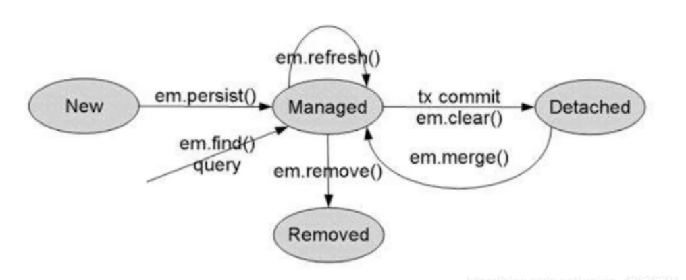

---
# 当前页面内容标题
title: 04、JPA四大状态
# 分类
category:
  - springdata
# 标签
tag: 
  - spring
  - springdata
  - java
sticky: false
# 是否收藏在博客主题的文章列表中，当填入数字时，数字越大，排名越靠前。
star: false
# 是否将该文章添加至文章列表中
article: true
# 是否将该文章添加至时间线中
timeline: true
---

04、JPA四大状态
---

> JPA的四种状态

- 临时状态：刚创建出来，没有与entityManager发生关系，没有被持久化，不处于entityManager中的对象。
- 持久状态：与entityManager发生关系，已经被持久化，您可以把持久化状态当做实实在在的数据库记录。
- 删除状态：执行remove方法，事务提交之前。
- 游离状态：游离状态就是提交到数据库后，事务commit后实体的状态，应为事务已经提交了，此时实体的属性任你如何改变，也不会同步到数据库，因为游离是没人管的孩子，不在持久化上下文中。

使用代码进行演示，帮助理解：

```java
/**
 * 游离状态
 */
@Test
public void testStatus() {
    EntityManager entityManager = factory.createEntityManager();
    EntityTransaction transaction = entityManager.getTransaction();
    transaction.begin();
    Customer customer = new Customer(); // 临时状态（瞬时状态）
    customer.setId(5l);  // 游离状态

    customer = entityManager.find(Customer.class,6L);  // 持久状态

    entityManager.remove(customer); // 删除状态（销毁状态）
    transaction.commit();
}
```

如图所示：



- **public void persist(Object entity)**
  - persist方法可以将实例转换为managed（托管）状态。在调用flush()方法或者提交事务之后，实例将会被插入到数据库中！

对不同状态下的实例A，persist会产生以下操作：

1. 如果A是一个new状态的实体，它会转为managed状态
2. 如果A是一个managed状态的实体，它的状态不会发生任何改变。但是系统仍会在数据库执行INSERT操作！
3. 如果A是一个removed（删除）状态的实体，他将会转换为受控状态！（就是不会再去执行了！）
4. 如果A是一个detached（分离）状态的实体，该方法会抛出IllegalArgumentException异常，具体异常根据不同的 JPA 实现有关！

- **public void merge(Object entity)**
  - merge方法的主要作用是将用户对一个detached状态实体的修改进行归档，归档后产生一个新的managed状态对象。

对不同状态下的实例A，merge会产生一下操作：

1. 如果A是个detached状态的实体， 该方法会将A的修改提交到数据库，并返回一个新的managed状态的实例A2:
2. **如果A是个new状态的实体， 该方法会产生个根据A广 生的managed状态实体A2;**
3. 如果A是个managed状态的实体， 它的状态不会发生任何改变。但是系统仍会在数据库执行UPDATE操作:
4. 如果A是个removed状态的实体， 该方法会 抛出IllegalArgumentException异常。

- **public void refresh(Object entity)**
  - refresh方法可以保证当前的实例与数据库中的实例的内容致。

对 不同状态下的实例A. refresh会产生以下操作:

1. 如果A是- 个new状态的实例，不会发生任何操作， 但有可能会抛出异常，具体情况根据不同JPA实现有关！
2. 如果A是一个managed状态的实例，它的属性将会和数据库中的数据同步。
3. 如果A是个removed状态的实例， 该方法将会抛出异常Entity not managed
4. 如果A是一个detached状态的实体，该方法会抛出异常。

- public void remove(Object entity)
  - remove方法可以将实体转换为removed状态，并且在调用flush()方法或提交事物后删除数据库中的数据。

对不同状态下的实例A. remove会产生以下操作:

1. 如果A是一个new状态的实例，A的状态不会发生任何改变，但系统仍会在数据库中执行DELETE语句;
2. 如果A是个managed状态的实例， 它的状态 会转换为removed;
3. 如果A是个removed状 态的实例，不会发生任何操作:

4. 如果A是个detached状态的实体， 该方法将会抛出异常。

> 缓存测试

```java
/**
 * 缓存测试
 */
@Test
public void testCache() {
    EntityManager entityManager = factory.createEntityManager();
    EntityTransaction transaction = entityManager.getTransaction();
    transaction.begin();

  	// 这里的缓存是一级缓存，只查询了一次！
    Customer customer = entityManager.find(Customer.class,3L);
    Customer customer2 = entityManager.find(Customer.class,3L);

    transaction.commit();
}
```

