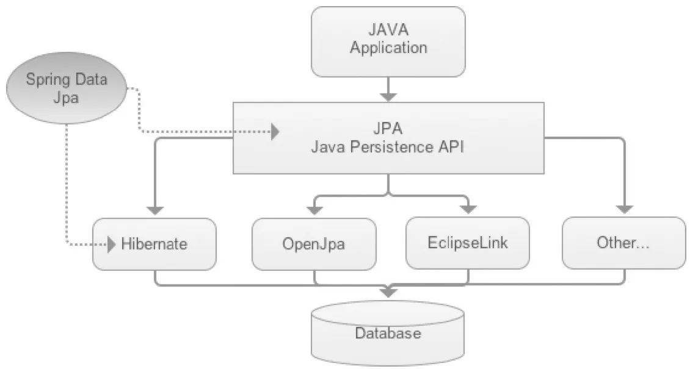

---
# 当前页面内容标题
title: 05、Spring data Jpa
# 分类
category:
  - springdata
# 标签
tag: 
  - spring
  - springdata
  - java
sticky: false
# 是否收藏在博客主题的文章列表中，当填入数字时，数字越大，排名越靠前。
star: false
# 是否将该文章添加至文章列表中
article: true
# 是否将该文章添加至时间线中
timeline: true
---

05、Spring data Jpa
---

### 5.1、什么是spring data jpa？

官网：https://docs.spring.io/spring-data/jpa/docs/current/reference/html/

> Spring Data JPA, part of the larger Spring Data family, makes it easy to easily implement JPA based repositories. This module deals with enhanced support for JPA based data access layers. It makes it easier to build Spring-powered applications that use data access technologies.
>
> Implementing a data access layer of an application has been cumbersome for quite a while. Too much boilerplate code has to be written to execute simple queries as well as perform pagination, and auditing. Spring Data JPA aims to significantly improve the implementation of data access layers by reducing the effort to the amount that’s actually needed. As a developer you write your repository interfaces, including custom finder methods, and Spring will provide the implementation automatically.
>
> 
>
> SpringDataJPA 是更大的 SpringData 系列的一部分，它使得基于 JPA 的存储库的实现更加容易。该模块处理对基于 JPA 的数据访问层(repositories)的增强支持。它使得构建使用数据访问技术的 Spring 驱动的应用程序变得更加容易。
>
> 实现应用程序的数据访问层已经很麻烦了。为了执行简单的查询以及执行分页和审计，必须编写太多的样板代码。Spring Data JPA 旨在通过将工作量减少到实际需要的数量来显著改进数据访问层的实现。作为开发人员，您编写存储库接口，包括自定义查找器(finder)方法，Spring 将自动提供实现。

简单理解：

spring data jpa是spring提供的一套简化 **JPA开发的框架** ，按照约定好的规则进行【方法命名】去写dao层接口，就可以在不写接口的情况下，实现对数据库的访问和操作。同时提供了很多除了CRUD之外的功能，如分页、排序、复杂查询等等！


Spring data Jpa 让我们解脱了DAO层的操作，基本上所有CRUD都可以依赖于它来实现，在实际的工作工程中，推荐使用Spring Data JPA + ORM （如：hibernate）完成操作，这样在切换不同的ORM框架时提供了极大的方便，同时也使数据库层操作更加简单，方便解耦！


### 5.2、特性（Features）

- Sophisticated support to build repositories based on Spring and JPA
- Support for [Querydsl](http://www.querydsl.com/) predicates and thus type-safe JPA queries
- Transparent auditing of domain class
- Pagination support, dynamic query execution, ability to integrate custom data access code
- Validation of `@Query` annotated queries at bootstrap time
- Support for XML based entity mapping
- JavaConfig based repository configuration by introducing `@EnableJpaRepositories`.


SpringData JPA 极大简化了数据库访问层代码。如何简化呢？使用springdataJpa，我们的dao层只需要写接口，就自动有了增删查改、分页查询等方法。



这里Java application通过dao层进行访问，其实就是拿到了Jdk的动态代理！


### 5.3、Spring Data JPA实例

我们来实现一个基于Spring Data JPA的示例感受一下和之前单独使用的区别：

pom.xml依赖

1、最好在父maven项目中设置spring data统一版本管理依赖：因为不同的spring data子项目发布时间版本不一致，你自己维护很麻烦，这样不同的spring data子项目能保证是统一版本！

定义统一的springdata子项目的版本，在总的pom.xml进行添加！

```xml
    <!-- 统一管理SpringData子项目的版本！-->
    <dependencyManagement>
        <dependencies>
            <dependency>
                <groupId>org.springframework.data</groupId>
                <artifactId>spring-data-bom</artifactId>
                <version>2021.1.3</version>
                <type>pom</type>
                <scope>import</scope>
            </dependency>
        </dependencies>
    </dependencyManagement>
```

2、然后在我们的子项目中进行导入使用！

pom.xml

```xml
<dependencies>
    <dependency>
        <groupId>org.springframework.data</groupId>
        <artifactId>spring-data-jpa</artifactId>
    </dependency>
    <!--junit-->
    <dependency>
        <groupId>junit</groupId>
        <artifactId>junit</artifactId>
        <version>4.12</version>
    </dependency>
    <!--hibernate对jpa的支持包！-->
    <dependency>
        <groupId>org.hibernate</groupId>
        <artifactId>hibernate-entitymanager</artifactId>
        <version>6.0.0.Alpha6</version>
    </dependency>
    <!--mysql and MariaDB-->
    <dependency>
        <groupId>mysql</groupId>
        <artifactId>mysql-connector-java</artifactId>
        <version>8.0.27</version>
    </dependency>
    <!--连接池-->
    <dependency>
        <groupId>com.alibaba</groupId>
        <artifactId>druid</artifactId>
        <version>1.2.8</version>
    </dependency>
    <dependency>
        <groupId>org.springframework</groupId>
        <artifactId>spring-test</artifactId>
        <version>5.3.15</version>
    </dependency>
</dependencies>
```

在这里因为我们是创建的maven工程，所以有必要添加hibernate支持！如果是springboot项目的话，可以不去添加依赖！

02-springdata-jpa

3、创建实体类！

```java
package com.yykk.pojo;

import javax.persistence.*;

/**
 * @author yykk
 */
@Entity // 作为 hibernate实体类
@Table(name = "tb_Customer") // 配置数据库表的名称,实体类中属性和表中字段的映射关系!
public class Customer {

    /**
     * @Id：声明主键的配置
     * @GeneratedValue:配置主键的生成策略 strategy
     * GenerationType.IDENTITY ：自增，mysql
     * * 底层数据库必须支持自动增长（底层数据库支持的自动增长方式，对id自增）
     * GenerationType.SEQUENCE : 序列，oracle
     * * 底层数据库必须支持序列
     * GenerationType.TABLE : jpa提供的一种机制，通过一张数据库表的形式帮助我们完成主键自增
     * GenerationType.AUTO ： 由程序自动的帮助我们选择主键生成策略
     * @Column:配置属性和字段的映射关系 name：数据库表中字段的名称
     */
    @Id
    @GeneratedValue(strategy = GenerationType.IDENTITY)
    private Long id;

    @Column(name = "cust_name")
    private String custName;//客户名称

    @Column(name = "cust_source")
    private String custSource;//客户来源

    @Column(name = "cust_level")
    private String custLevel;//客户级别

    @Column(name = "cust_industry")
    private String custIndustry;//客户所属行业

    @Column(name = "cust_phone")
    private String custPhone;//客户的联系方式

    @Column(name = "cust_address")
    private String custAddress;//客户地址


    public Long getId() {
        return id;
    }

    public void setId(Long id) {
        this.id = id;
    }

    public String getCustName() {
        return custName;
    }

    public void setCustName(String custName) {
        this.custName = custName;
    }

    public String getCustSource() {
        return custSource;
    }

    public void setCustSource(String custSource) {
        this.custSource = custSource;
    }

    public String getCustLevel() {
        return custLevel;
    }

    public void setCustLevel(String custLevel) {
        this.custLevel = custLevel;
    }

    public String getCustIndustry() {
        return custIndustry;
    }

    public void setCustIndustry(String custIndustry) {
        this.custIndustry = custIndustry;
    }

    public String getCustPhone() {
        return custPhone;
    }

    public void setCustPhone(String custPhone) {
        this.custPhone = custPhone;
    }

    public String getCustAddress() {
        return custAddress;
    }

    public void setCustAddress(String custAddress) {
        this.custAddress = custAddress;
    }

    @Override
    public String toString() {
        return "Customer{" +
                "id=" + id +
                ", custName='" + custName + '\'' +
                ", custSource='" + custSource + '\'' +
                ", custLevel='" + custLevel + '\'' +
                ", custIndustry='" + custIndustry + '\'' +
                ", custPhone='" + custPhone + '\'' +
                ", custAddress='" + custAddress + '\'' +
                '}';
    }
}
```

4、配置xml，resources/springdata.xml，如下配置：

```xml
<?xml version="1.0" encoding="UTF-8"?>
<beans xmlns="http://www.springframework.org/schema/beans"
       xmlns:xsi="http://www.w3.org/2001/XMLSchema-instance"
       xmlns:jpa="http://www.springframework.org/schema/data/jpa"
       xmlns:tx="http://www.springframework.org/schema/tx"
       xsi:schemaLocation="http://www.springframework.org/schema/beans
       https://www.springframework.org/schema/beans/spring-beans.xsd
       http://www.springframework.org/schema/data/jpa
       https://www.springframework.org/schema/data/jpa/spring-jpa.xsd
       http://www.springframework.org/schema/tx
       https://www.springframework.org/schema/tx/spring-tx.xsd">

    <!--用户整合jpa @EnableJpaRepositories-->
    <jpa:repositories base-package="com.yykk.repositories"
                      entity-manager-factory-ref="entityManagerFactory"
                      transaction-manager-ref="transactionManager" />

    <!--EntityManagerFactory-->
    <bean name="entityManagerFactory" class="org.springframework.orm.jpa.LocalContainerEntityManagerFactoryBean">
        <property name="jpaVendorAdapter">
            <!--hibernate实现-->
            <bean class="org.springframework.orm.jpa.vendor.HibernateJpaVendorAdapter">
                <!--生成数据库表-->
                <property name="showSql" value="true"></property>
                <property name="generateDdl" value="true"></property>
            </bean>
        </property>
        <!--设置实体类的包-->
        <property name="packagesToScan" value="com.yykk.pojo"></property>
        <property name="dataSource" ref="dataSource"></property>
    </bean>

    <!--数据源-->
    <bean class="com.alibaba.druid.pool.DruidDataSource" name="dataSource">
        <property name="username" value="root"/>
        <property name="password" value="123456"/>
        <property name="url" value="jdbc:mysql://localhost:3306/spring_data?characterEncoding=UTF-8"/>  <!--这里要注意：在我配置了其他属性之后，就加载不出来了！-->
        <property name="driverClassName" value="com.mysql.jdbc.Driver"/>
    </bean>

    <!--声明式事务-->
    <bean class="org.springframework.orm.jpa.JpaTransactionManager" name="transactionManager">
        <property name="entityManagerFactory" ref="entityManagerFactory"></property>
    </bean>

    <!--启动注解方式的声明式事务-->
    <tx:annotation-driven transaction-manager="transactionManager"></tx:annotation-driven>

</beans>
```

5、创建repository/repositories 接口！

```java
package com.yykk.repositories;

import com.yykk.pojo.Customer;
import org.springframework.data.repository.CrudRepository;

public interface CustomerRepositories extends CrudRepository<Customer,Long> {
}
```

6、测试！

```java
import com.yykk.pojo.Customer;
import com.yykk.repositories.CustomerRepositories;
import org.junit.Test;
import org.junit.runner.RunWith;
import org.springframework.beans.factory.annotation.Autowired;
import org.springframework.test.context.ContextConfiguration;
import org.springframework.test.context.junit4.SpringJUnit4ClassRunner;

import java.util.Optional;

@ContextConfiguration("/springdata.xml")
@RunWith(SpringJUnit4ClassRunner.class)
public class SpringdataJpaTest {

    @Autowired
    CustomerRepositories repositories;

    @Test
    public void test_Query() {
        Optional<Customer> id = repositories.findById(3L);
        System.out.println(id.get());
    }

    @Test
    public void test_Insert() {
        Customer customer = new Customer();
        customer.setCustName("李四");
        customer.setCustAddress("南京");
        repositories.save(customer);
    }

    @Test
    public void test_Update() {
        Customer customer = new Customer();
        customer.setId(7L);
        customer.setCustName("王五");
        repositories.save(customer);
    }

    /**
     * 在这里delete方法，可以发现一个问题：
     *  1、底层会帮我们先进行查询一次，在进行删除！
     *  2、这样属性就不是游离状态，而是持久状态了！
     */
    @Test
    public void test_Delete() {
        Customer customer = new Customer();
        customer.setId(7L);
        customer.setCustName("王五");
        repositories.delete(customer);
    }
}
```

7、使用JavaConfig进行配置！

config/SpringDataJPAConfig

```java
package com.yykk.config;

import com.alibaba.druid.pool.DruidDataSource;
import org.springframework.context.annotation.Bean;
import org.springframework.context.annotation.Configuration;
import org.springframework.data.jpa.repository.config.EnableJpaRepositories;
import org.springframework.orm.jpa.JpaTransactionManager;
import org.springframework.orm.jpa.JpaVendorAdapter;
import org.springframework.orm.jpa.LocalContainerEntityManagerFactoryBean;
import org.springframework.orm.jpa.vendor.HibernateJpaVendorAdapter;
import org.springframework.transaction.annotation.EnableTransactionManagement;

import javax.persistence.EntityManagerFactory;
import javax.sql.DataSource;

@Configuration
@EnableJpaRepositories(basePackages = "com.yykk.repositories")
@EnableTransactionManagement
public class SpringDataJPAConfig {

    @Bean
    public DataSource dataSource() {
        DruidDataSource dataSource = new DruidDataSource();
        dataSource.setUsername("root");
        dataSource.setPassword("123456");
        dataSource.setDriverClassName("com.mysql.jdbc.Driver");
        dataSource.setUrl("jdbc:mysql://localhost:3306/spring_data?characterEncoding=UTF-8");
        return dataSource;
    }

    @Bean
    public JpaTransactionManager transactionManager(EntityManagerFactory emf) {
        return new JpaTransactionManager(emf);
    }

    @Bean
    public JpaVendorAdapter jpaVendorAdapter() {
        HibernateJpaVendorAdapter jpaVendorAdapter = new HibernateJpaVendorAdapter();
        //jpaVendorAdapter.setDatabase(Database.MYSQL);
        jpaVendorAdapter.setGenerateDdl(true);
        jpaVendorAdapter.setShowSql(true);
        return jpaVendorAdapter;
    }

    @Bean
    public LocalContainerEntityManagerFactoryBean entityManagerFactory() {
        LocalContainerEntityManagerFactoryBean lemfb = new LocalContainerEntityManagerFactoryBean();
        lemfb.setDataSource(dataSource());
        lemfb.setJpaVendorAdapter(jpaVendorAdapter());
        lemfb.setPackagesToScan("com.yykk.pojo");
        return lemfb;
    }
}
```

8、测试！


### 5.4、使用Spring Data Repositories

Spring Data Repositories 抽象的目标是显着减少各种持久化存储实现数据访问层所需的样板代码量！

**CrudRepository**

```
// 用力啊插入和修改 ，有主键就是修改，没有就是新增！
// 获得插入后自增id，获得返回值
<S extends T> S save(S entity);

// 通过集合保存多个实体
<S extends T> Iterable<S> saveAll(Iterable<S> entities);

// 通过主键查询实体
Optional<T> findById(ID id);

// 通过主键查询id，返回boolean
boolean existsById(ID id);

// 查询所有！
Iterable<T> findAll();

// 通过集合的主键、查询多个实体，返回集合！
Iterable<T> findAllById(Iterable<ID> ids

// 查询总数量
long count();

// 根据id进行删除
void deleteById(ID id);

// 根据实体进行删除
void delete(T entity);

// 删除多个
void deleteAllById(Iterable<? extends ID> ids);

// 删除多个，传入集合实体！
void deleteAll(Iterable<? extends T> entities);

// 删除全部！
void deleteAll();
```


### 5.5、实现分页与排序

1、首先我们需要更改的是我们的repository继承PagingAndSortingRepository，其他配置相同即可！

```java
package com.yykk.repositories;

import com.yykk.pojo.Customer;
import org.springframework.data.repository.PagingAndSortingRepository;

public interface CustomerRepositories extends PagingAndSortingRepository<Customer,Long> {
}
```

2、测试！

```java
import com.yykk.config.SpringDataJPAConfig;
import com.yykk.pojo.Customer;
import com.yykk.repositories.CustomerRepositories;
import org.junit.Test;
import org.junit.runner.RunWith;
import org.springframework.beans.factory.annotation.Autowired;
import org.springframework.data.domain.Page;
import org.springframework.data.domain.PageRequest;
import org.springframework.data.domain.Sort;
import org.springframework.test.context.ContextConfiguration;
import org.springframework.test.context.junit4.SpringJUnit4ClassRunner;

@ContextConfiguration(classes = SpringDataJPAConfig.class)
@RunWith(SpringJUnit4ClassRunner.class)
public class SpringDataJPAPagingAndSortTest {

    @Autowired
    CustomerRepositories repositories;

    @Test
    public void testPaging() {
        Page<Customer> all = repositories.findAll(PageRequest.of(0, 2));
        System.out.println(all.getTotalElements());
        System.out.println(all.getTotalPages());
        System.out.println(all.getContent());
    }

    @Test
    public void testSort() {
        Sort sort = Sort.by("id").descending();
        Iterable<Customer> all = repositories.findAll(sort);
        System.out.println(all);
    }

    @Test
    public void testSortTypeSafe() {
        Sort.TypedSort<Customer> sortType = Sort.sort(Customer.class);

        Sort sort = sortType.by(Customer::getId).ascending()
                .and(sortType.by(Customer::getCustName)).descending();

        Iterable<Customer> all = repositories.findAll(sort);
        System.out.println(all);
    }
}
```

