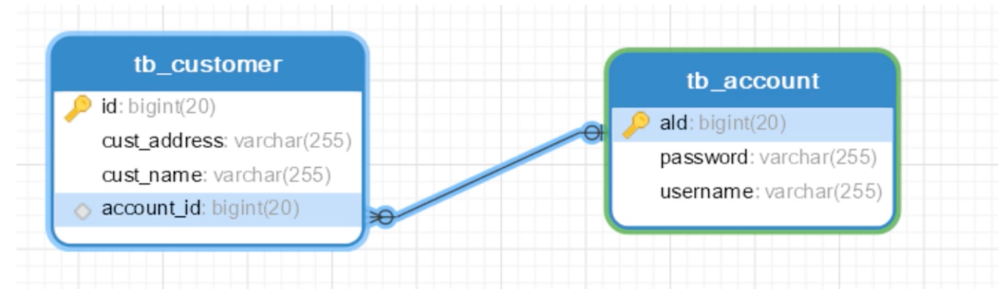
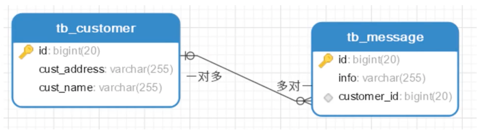
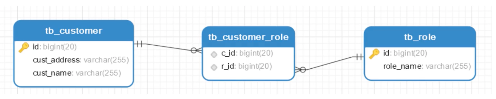
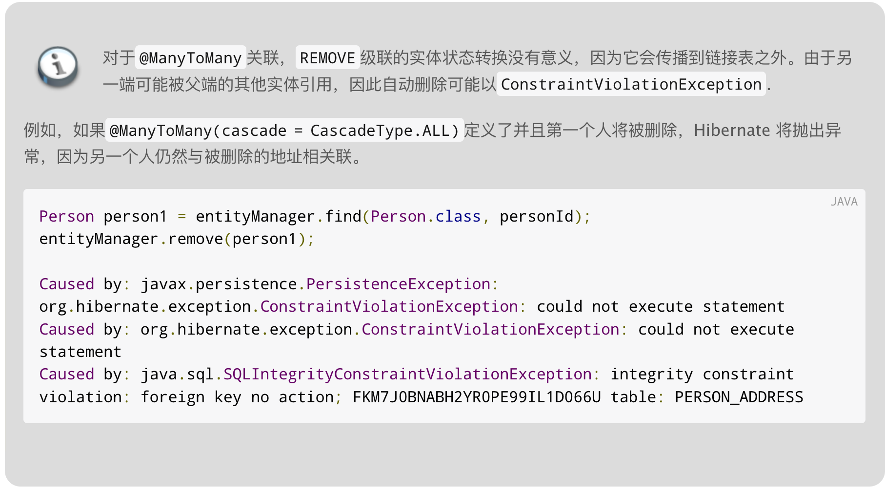

---
# 当前页面内容标题
title: 07、多表关联
# 分类
category:
  - springdata
# 标签
tag: 
  - spring
  - springdata
  - java
sticky: false
# 是否收藏在博客主题的文章列表中，当填入数字时，数字越大，排名越靠前。
star: false
# 是否将该文章添加至文章列表中
article: true
# 是否将该文章添加至时间线中
timeline: true
---

07、多表关联
---

### 7.1、多表关联操作

方便我们的开发，导入lombok！

```xml
<dependency>
    <groupId>org.projectlombok</groupId>
    <artifactId>lombok</artifactId>
    <version>1.18.22</version>
</dependency>
```

### 7.2、一对一

客户表——>账户表




实现：

1、配置关联关系！

```java
@OneToOne // 单向关联，一对一！
@JoinColumn(name = "account_id") // 设置外键的字段名
private Account account;
```

pojo/Customer.java

```java
package com.yykk.pojo;

import lombok.AllArgsConstructor;
import lombok.Data;
import lombok.NoArgsConstructor;

import javax.persistence.*;

/**
 * @author yykk
 */
@Entity // 作为 hibernate实体类
@Data
@AllArgsConstructor
@NoArgsConstructor
@Table(name = "tb_Customer") // 配置数据库表的名称,实体类中属性和表中字段的映射关系!
public class Customer {

    /**
     * @Id：声明主键的配置
     * @GeneratedValue:配置主键的生成策略 strategy
     * GenerationType.IDENTITY ：自增，mysql
     * * 底层数据库必须支持自动增长（底层数据库支持的自动增长方式，对id自增）
     * GenerationType.SEQUENCE : 序列，oracle
     * * 底层数据库必须支持序列
     * GenerationType.TABLE : jpa提供的一种机制，通过一张数据库表的形式帮助我们完成主键自增
     * GenerationType.AUTO ： 由程序自动的帮助我们选择主键生成策略
     * @Column:配置属性和字段的映射关系 name：数据库表中字段的名称
     */
    @Id
    @GeneratedValue(strategy = GenerationType.IDENTITY)
    private Long id;

    @Column(name = "cust_name")
    private String custName;//客户名称

    @Column(name = "cust_source")
    private String custSource;//客户来源

    @Column(name = "cust_level")
    private String custLevel;//客户级别

    @Column(name = "cust_industry")
    private String custIndustry;//客户所属行业

    @Column(name = "cust_phone")
    private String custPhone;//客户的联系方式

    @Column(name = "cust_address")
    private String custAddress;//客户地址

    // 单向关联，一对一！
    @OneToOne
    @JoinColumn(name = "account_id") // 设置外键的字段名
    private Account account;

}
```

2、配置关联操作！

pojo/Customer.java

```java
package com.yykk.pojo;

import lombok.AllArgsConstructor;
import lombok.Data;
import lombok.NoArgsConstructor;

import javax.persistence.*;

/**
 * @author yykk
 */
@Entity // 作为 hibernate实体类
@Data
@AllArgsConstructor
@NoArgsConstructor
@Table(name = "tb_Customer") // 配置数据库表的名称,实体类中属性和表中字段的映射关系!
public class Customer {

    /**
     * @Id：声明主键的配置
     * @GeneratedValue:配置主键的生成策略 strategy
     * GenerationType.IDENTITY ：自增，mysql
     * * 底层数据库必须支持自动增长（底层数据库支持的自动增长方式，对id自增）
     * GenerationType.SEQUENCE : 序列，oracle
     * * 底层数据库必须支持序列
     * GenerationType.TABLE : jpa提供的一种机制，通过一张数据库表的形式帮助我们完成主键自增
     * GenerationType.AUTO ： 由程序自动的帮助我们选择主键生成策略
     * @Column:配置属性和字段的映射关系 name：数据库表中字段的名称
     */
    @Id
    @GeneratedValue(strategy = GenerationType.IDENTITY)
    private Long id;

    @Column(name = "cust_name")
    private String custName;//客户名称

    @Column(name = "cust_source")
    private String custSource;//客户来源

    @Column(name = "cust_level")
    private String custLevel;//客户级别

    @Column(name = "cust_industry")
    private String custIndustry;//客户所属行业

    @Column(name = "cust_phone")
    private String custPhone;//客户的联系方式

    @Column(name = "cust_address")
    private String custAddress;//客户地址

    /**
     * 单向关联，一对一！
     * cascade 设置枚举值：关联操作！
     * ALL、PERSIST、MERGE、REMOVE、REFRESH、DETACH
     * fetch:是否设置为懒加载
     *      LAZY 懒加载(知道用到对象才会进行查询！因为不是所有的关联对象，都需要用到)
     *      EAGER 理解加载 (默认)
     *  orphanRemoval：关联移除（通常在修改的时候会用到）
     *      一旦把关联的数据设置为null，或者修改为其他的关联数据，如果想删除数据，就可以设置为true！
     *  optional：设置关联的对象不能为null，默认为true！false不能为null
     *  mappedBy：将外键约束指向另一方维护！(通常在双向关联关系中，会放弃一方的外键约束！)
     *      值 = 另一方的关联属性名！
     */
    @OneToOne(cascade = CascadeType.ALL,fetch = FetchType.LAZY,orphanRemoval = true,optional = false,mappedBy = "customer")
    @JoinColumn(name = "account_id") // 设置外键的字段名
    private Account account;

}
```

pojo/Account.java

```java
package com.yykk.pojo;

import lombok.AllArgsConstructor;
import lombok.Data;
import lombok.NoArgsConstructor;

import javax.persistence.*;

@Entity
@Table(name = "tb_account")
@Data
@AllArgsConstructor
@NoArgsConstructor
public class Account {

    @Id
    @GeneratedValue(strategy = GenerationType.IDENTITY)
    private Long id;
    private String username;
    private String password;

    @OneToOne
    @JoinColumn(name = "customer_id")
    private Customer customer;
}
```

3、测试！

```java
package com.yykk.test;

import com.yykk.config.SpringDataJPAConfig;
import com.yykk.pojo.Account;
import com.yykk.pojo.Customer;
import com.yykk.repositories.CustomerRepository;
import org.junit.Test;
import org.junit.runner.RunWith;
import org.springframework.beans.factory.annotation.Autowired;
import org.springframework.test.context.ContextConfiguration;
import org.springframework.test.context.junit4.SpringJUnit4ClassRunner;
import org.springframework.transaction.annotation.Transactional;

import java.util.Optional;

@ContextConfiguration(classes = SpringDataJPAConfig.class)
@RunWith(SpringJUnit4ClassRunner.class)
public class OneToOneTest {

    @Autowired
    CustomerRepository repository;

    @Test
    public void test_ins(){
        // 初始化数据
        Account account = new Account();
        account.setUsername("admin");

        Customer customer = new Customer();
        customer.setCustName("admin");
        customer.setAccount(account);
        account.setCustomer(customer);

        repository.save(customer);
    }

    /**
     *  为什么懒加载需要配置事务：
     *  当通过repository调用网查询方法，session就会立即关闭，一旦session关闭就不能查询！
     *  加了事务之后，就能让session直到事务结束完毕后才会关闭！
     */
    @Test
    @Transactional(readOnly = true)
    public void test_sel(){
        Optional<Customer> customer = repository.findById(16L); // 只查询出客户，session就关闭了！
        System.out.println("---------------------");
        System.out.println(customer.get());
    }

    @Test
    public void test_del(){
        repository.deleteById(1L);
    }

    @Test
    public void test_upd(){
        Customer customer = new Customer();
        customer.setId(17L);
        customer.setCustName("yykk");
        customer.setAccount(null);
        repository.save(customer);
    }
}
```

**差异**

这两个设置之间的却比在于对 断开关系，例如：当设置地址为null或另一个Address对象。

- 如果指定了 orphanRemoval = true，则会自动删除断开连接的Address实例，这对于清理很有用没有一个不应该存在的相关对象（例如地址）来自所有者对象（例如员工）的引用。
- 如果指定 cascade = CascadeType.REMOVE，则不会执行任何自动操作，因为断开关系不是删除操作


### 7.3、一对多

一个客户有多条信息



实现：

1、配置管理关系

@OneToMany

@JoinColumn(name = "customer_id") 

```java
// 一对多
@OneToMany(cascade = CascadeType.ALL)
@JoinColumn(name = "customer_id")
private List<Message> messages;
```

2、配置关联关系

pojo/Customer.java

```java
package com.yykk.pojo;

import lombok.AllArgsConstructor;
import lombok.Data;
import lombok.NoArgsConstructor;

import javax.persistence.*;
import java.util.List;

/**
 * @author yykk
 */
@Entity // 作为 hibernate实体类
@Data
@AllArgsConstructor
@NoArgsConstructor
@Table(name = "tb_Customer") // 配置数据库表的名称,实体类中属性和表中字段的映射关系!
public class Customer {

    /**
     * @Id：声明主键的配置
     * @GeneratedValue:配置主键的生成策略 strategy
     * GenerationType.IDENTITY ：自增，mysql
     * * 底层数据库必须支持自动增长（底层数据库支持的自动增长方式，对id自增）
     * GenerationType.SEQUENCE : 序列，oracle
     * * 底层数据库必须支持序列
     * GenerationType.TABLE : jpa提供的一种机制，通过一张数据库表的形式帮助我们完成主键自增
     * GenerationType.AUTO ： 由程序自动的帮助我们选择主键生成策略
     * @Column:配置属性和字段的映射关系 name：数据库表中字段的名称
     */
    @Id
    @GeneratedValue(strategy = GenerationType.IDENTITY)
    private Long id;

    @Column(name = "cust_name")
    private String custName;//客户名称

    @Column(name = "cust_source")
    private String custSource;//客户来源

    @Column(name = "cust_level")
    private String custLevel;//客户级别

    @Column(name = "cust_industry")
    private String custIndustry;//客户所属行业

    @Column(name = "cust_phone")
    private String custPhone;//客户的联系方式

    @Column(name = "cust_address")
    private String custAddress;//客户地址

    /**
     * 单向关联，一对一！
     * cascade 设置枚举值：关联操作！
     * ALL、PERSIST、MERGE、REMOVE、REFRESH、DETACH
     * fetch:是否设置为懒加载
     *      LAZY 懒加载(知道用到对象才会进行查询！因为不是所有的关联对象，都需要用到)
     *      EAGER 理解加载 (默认)
     *  orphanRemoval：关联移除（通常在修改的时候会用到）
     *      一旦把关联的数据设置为null，或者修改为其他的关联数据，如果想删除数据，就可以设置为true！
     *  optional：设置关联的对象不能为null，默认为true！false不能为null
     *  mappedBy：将外键约束指向另一方维护！(通常在双向关联关系中，会放弃一方的外键约束！)
     *      值 = 另一方的关联属性名！
     */
    @OneToOne(cascade = CascadeType.ALL,fetch = FetchType.LAZY,orphanRemoval = true,mappedBy = "customer")
    @JoinColumn(name = "account_id") // 设置外键的字段名
    private Account account;

    // 一对多
    @OneToMany(cascade = CascadeType.ALL)
    @JoinColumn(name = "customer_id")
    private List<Message> messages;

}
```

pojo/Message.java

```java
package com.yykk.pojo;

import lombok.Data;
import javax.persistence.*;

@Entity
@Table(name="tb_message")
@Data
public class Message {

    @Id
    @GeneratedValue(strategy = GenerationType.IDENTITY)
    private Long id;

    // 这里如果手动添加了有参构造，就一定要加无参，否则查询会有问题！
    private String info;

    public Message() {
    }

    public Message(String info) {
        this.info = info;
    }
}
```

3、代码测试！

```java
package com.yykk.test;

import com.yykk.config.SpringDataJPAConfig;
import com.yykk.pojo.Customer;
import com.yykk.pojo.Message;
import com.yykk.repositories.CustomerRepository;
import org.junit.Test;
import org.junit.runner.RunWith;
import org.springframework.beans.factory.annotation.Autowired;
import org.springframework.test.context.ContextConfiguration;
import org.springframework.test.context.junit4.SpringJUnit4ClassRunner;
import org.springframework.transaction.annotation.Transactional;

import java.util.ArrayList;
import java.util.List;
import java.util.Optional;

@ContextConfiguration(classes = SpringDataJPAConfig.class)
@RunWith(SpringJUnit4ClassRunner.class)
public class OneToManyTest {

    @Autowired
    CustomerRepository repository;

    @Test
    public void test_ins(){
        List<Message> messageList = new ArrayList<>();
        messageList.add(new Message("hello"));
        messageList.add(new Message("word"));

        Customer customer = new Customer();
        customer.setCustName("yykk");
        customer.setMessages(messageList);

        repository.save(customer);
    }

    /**
     * 一对多fetch默认就是LAZY！
     * LAZY过程：
     *  1、findById 指挥查询Customer和其他关联的立即加载！
     *  2、由于输出，会自动调用customer.toString()
     *  LAZY优点：提高查询性能！
     */
    @Test
    @Transactional(readOnly = true)
    public void test_upd(){
        Optional<Customer> id = repository.findById(2L);
        System.out.println("-------------------");
        System.out.println(id);
    }

    /**
     * 删除操作！设置cascade = CascadeType.ALL | REMOVE
     */
    @Test
    public void test_del(){
        repository.deleteById(4L);
    }

}
```


### 7.4、多对一

实现：

1、配置管理关系

@ManyToOne

@JoinColumn(name = "customer_id")

```java
// 多对一
@ManyToOne(cascade = {CascadeType.PERSIST,CascadeType.REMOVE})
@JoinColumn(name = "customer_id")
private Customer customer;
```

2、配置关联关系！

pojo/Customer.java

```java
package com.yykk.pojo;

import lombok.AllArgsConstructor;
import lombok.Data;
import lombok.NoArgsConstructor;

import javax.persistence.*;
import java.util.List;

/**
 * @author yykk
 */
@Entity // 作为 hibernate实体类
@Data
@AllArgsConstructor
@NoArgsConstructor
@Table(name = "tb_Customer") // 配置数据库表的名称,实体类中属性和表中字段的映射关系!
public class Customer {

    /**
     * @Id：声明主键的配置
     * @GeneratedValue:配置主键的生成策略 strategy
     * GenerationType.IDENTITY ：自增，mysql
     * * 底层数据库必须支持自动增长（底层数据库支持的自动增长方式，对id自增）
     * GenerationType.SEQUENCE : 序列，oracle
     * * 底层数据库必须支持序列
     * GenerationType.TABLE : jpa提供的一种机制，通过一张数据库表的形式帮助我们完成主键自增
     * GenerationType.AUTO ： 由程序自动的帮助我们选择主键生成策略
     * @Column:配置属性和字段的映射关系 name：数据库表中字段的名称
     */
    @Id
    @GeneratedValue(strategy = GenerationType.IDENTITY)
    private Long id;

    @Column(name = "cust_name")
    private String custName;//客户名称

    @Column(name = "cust_source")
    private String custSource;//客户来源

    @Column(name = "cust_level")
    private String custLevel;//客户级别

    @Column(name = "cust_industry")
    private String custIndustry;//客户所属行业

    @Column(name = "cust_phone")
    private String custPhone;//客户的联系方式

    @Column(name = "cust_address")
    private String custAddress;//客户地址

    /**
     * 单向关联，一对一！
     * cascade 设置枚举值：关联操作！
     * ALL、PERSIST、MERGE、REMOVE、REFRESH、DETACH
     * fetch:是否设置为懒加载
     *      LAZY 懒加载(知道用到对象才会进行查询！因为不是所有的关联对象，都需要用到)
     *      EAGER 理解加载 (默认)
     *  orphanRemoval：关联移除（通常在修改的时候会用到）
     *      一旦把关联的数据设置为null，或者修改为其他的关联数据，如果想删除数据，就可以设置为true！
     *  optional：设置关联的对象不能为null，默认为true！false不能为null
     *  mappedBy：将外键约束指向另一方维护！(通常在双向关联关系中，会放弃一方的外键约束！)
     *      值 = 另一方的关联属性名！
     */
    @OneToOne(cascade = CascadeType.ALL,fetch = FetchType.LAZY,orphanRemoval = true,mappedBy = "customer")
    @JoinColumn(name = "account_id") // 设置外键的字段名
    private Account account;

    // 一对多
    @OneToMany(cascade = CascadeType.ALL)
    @JoinColumn(name = "customer_id")
    private List<Message> messages;

}
```

pojo/Message.java

```java
package com.yykk.pojo;

import lombok.Data;
import javax.persistence.*;

@Entity
@Table(name="tb_message")
@Data
public class Message {

    @Id
    @GeneratedValue(strategy = GenerationType.IDENTITY)
    private Long id;

    // 这里如果手动添加了有参构造，就一定要加无参，否则查询会有问题！
    private String info;

    // 多对一
    @ManyToOne(cascade = {CascadeType.PERSIST,CascadeType.REMOVE})
    @JoinColumn(name = "customer_id")
    private Customer customer;

    public Message() {
    }

    public Message(String info, Customer customer) {
        this.info = info;
        this.customer = customer;
    }

    public Message(String info) {
        this.info = info;
    }

    @Override
    public String toString() {
        return "Message{" +
                "id=" + id +
                ", info='" + info + '\'' +
                ", customerId=" + customer.getId() +
                ", customerName=" + customer.getCustName() +
                '}';
    }
}
```

在这里如果你在其中一个里面设置了JoinColumn，那么在另一个中可以不设置，当然设置了也没有问题！

3、设置repository

repositories/MessageRepository

```java
package com.yykk.repositories;

import com.yykk.pojo.Customer;
import com.yykk.pojo.Message;
import org.springframework.data.repository.PagingAndSortingRepository;

import java.util.List;

public interface MessageRepository extends PagingAndSortingRepository<Message,Long> {

    /**
     * 根据客户id查询所有信息！
     * 通过规定方法名来实现查询，需要通过关联属性来进行匹配！
     * 但是只能通过id来进行匹配
     */
    List<Message> findByCustomer(Customer customer);
}
```

4、测试！

```java
package com.yykk.test;

import com.yykk.config.SpringDataJPAConfig;
import com.yykk.pojo.Customer;
import com.yykk.pojo.Message;
import com.yykk.repositories.MessageRepository;
import org.junit.Test;
import org.junit.runner.RunWith;
import org.springframework.beans.factory.annotation.Autowired;
import org.springframework.test.context.ContextConfiguration;
import org.springframework.test.context.junit4.SpringJUnit4ClassRunner;

import java.util.ArrayList;
import java.util.List;

@ContextConfiguration(classes = SpringDataJPAConfig.class)
@RunWith(SpringJUnit4ClassRunner.class)
public class ManyToOneTest {

    @Autowired
    MessageRepository repository;

    /**
     * 多对一插入：
     *     当插入多的数据的时候，使用多对一的关联关系是更加合适的！
     */
    @Test
    public void test_ins(){
        // 一
        Customer customer = new Customer();
        customer.setCustName("admin");

        // 多
        List<Message> list = new ArrayList<>();
        list.add(new Message("stay awake",customer));
        list.add(new Message("at all time",customer));

        repository.saveAll(list);
    }

    /**
     * 多对一：根据客户id查询对应的所有信息！
     * 这个在一对多实现更简单且合理 ，如果要在这里实现就需要在repository中自定义！
     * 在这里如果出现了栈溢出StackOverFlow，解决方案：
     *    1、在pojo类中对toString方法进行重写！
     */
    @Test
    public void test_query(){
        Customer customer = new Customer();
        customer.setId(1L);
        customer.setCustName("xxx"); // 在这里可以发现，不受其他条件的影响，只会根据id

        List<Message> messages = repository.findByCustomer(customer);
        // 这里会隐式调用toString()
        System.out.println(messages);
    }

    @Test
    public void test_delete(){
        Customer customer = new Customer();
        customer.setId(1L);

        List<Message> messages = repository.findByCustomer(customer);
        // 这里会隐式调用toString()
        repository.deleteAll(messages);
    }

}
```


### 7.5、多对多



1、配置管理关系

@ManyToMany

@JoinColumn(name=“customer_id”)

```java
/**
 *  单向多对多
 *  中间表需要设置@JoinTable来维护外键（不设置也会自动生成！）
 *  name：指定中间表的表名称
 *  joinColumns：设置本表的外键名称
 *  inverseJoinColumns：设置关联表的外键名称
 * */
@ManyToMany(cascade = CascadeType.ALL)
@JoinTable(
        name = "tb_customer_role",
        joinColumns = {@JoinColumn(name = "c_id")},
        inverseJoinColumns = {@JoinColumn(name = "r_id")}
)
private Set<Role> roles;
```

2、配置关联关系！

pojo/Customer.java

```java
package com.yykk.pojo;

import lombok.AllArgsConstructor;
import lombok.Data;
import lombok.NoArgsConstructor;

import javax.persistence.*;
import java.util.List;
import java.util.Set;

/**
 * @author yykk
 */
@Entity // 作为 hibernate实体类
@Data
@AllArgsConstructor
@NoArgsConstructor
@Table(name = "tb_Customer") // 配置数据库表的名称,实体类中属性和表中字段的映射关系!
public class Customer {

    /**
     * @Id：声明主键的配置
     * @GeneratedValue:配置主键的生成策略 strategy
     * GenerationType.IDENTITY ：自增，mysql
     * * 底层数据库必须支持自动增长（底层数据库支持的自动增长方式，对id自增）
     * GenerationType.SEQUENCE : 序列，oracle
     * * 底层数据库必须支持序列
     * GenerationType.TABLE : jpa提供的一种机制，通过一张数据库表的形式帮助我们完成主键自增
     * GenerationType.AUTO ： 由程序自动的帮助我们选择主键生成策略
     * @Column:配置属性和字段的映射关系 name：数据库表中字段的名称
     */
    @Id
    @GeneratedValue(strategy = GenerationType.IDENTITY)
    private Long id;

    @Column(name = "cust_name")
    private String custName;//客户名称

    @Column(name = "cust_source")
    private String custSource;//客户来源

    @Column(name = "cust_level")
    private String custLevel;//客户级别

    @Column(name = "cust_industry")
    private String custIndustry;//客户所属行业

    @Column(name = "cust_phone")
    private String custPhone;//客户的联系方式

    @Column(name = "cust_address")
    private String custAddress;//客户地址

    /**
     * 单向关联，一对一！
     * cascade 设置枚举值：关联操作！
     * ALL、PERSIST、MERGE、REMOVE、REFRESH、DETACH
     * fetch:是否设置为懒加载
     *      LAZY 懒加载(知道用到对象才会进行查询！因为不是所有的关联对象，都需要用到)
     *      EAGER 理解加载 (默认)
     *  orphanRemoval：关联移除（通常在修改的时候会用到）
     *      一旦把关联的数据设置为null，或者修改为其他的关联数据，如果想删除数据，就可以设置为true！
     *  optional：设置关联的对象不能为null，默认为true！false不能为null
     *  mappedBy：将外键约束指向另一方维护！(通常在双向关联关系中，会放弃一方的外键约束！)
     *      值 = 另一方的关联属性名！
     */
    @OneToOne(cascade = CascadeType.ALL,fetch = FetchType.LAZY,orphanRemoval = true,mappedBy = "customer")
    @JoinColumn(name = "account_id") // 设置外键的字段名
    private Account account;

    // 一对多
    @OneToMany(cascade = CascadeType.ALL)
    @JoinColumn(name = "customer_id")
    private List<Message> messages;

    /**
     *  单向多对多
     *  中间表需要设置@JoinTable来维护外键（不设置也会自动生成！）
     *  name：指定中间表的表名称
     *  joinColumns：设置本表的外键名称
     *  inverseJoinColumns：设置关联表的外键名称
     * */
    @ManyToMany(cascade = CascadeType.ALL)
    @JoinTable(
            name = "tb_customer_role",
            joinColumns = {@JoinColumn(name = "c_id")},
            inverseJoinColumns = {@JoinColumn(name = "r_id")}
    )
    private Set<Role> roles;

}
```

pojo/Role.java

```java
package com.yykk.pojo;

import javax.persistence.*;

@Entity
@Table(name = "tb_role")
public class Role {

    @Id
    @GeneratedValue(strategy = GenerationType.IDENTITY)
    private Long id;

    @Column(name = "role_name")
    private String rName;


    public Role(String rName) {
        this.rName = rName;
    }

    public Role(Long id, String rName) {
        this.id = id;
        this.rName = rName;
    }

    public Role() {
    }
}
```

3、创建repository！

```java
package com.yykk.repositories;

import com.yykk.pojo.Role;
import org.springframework.data.repository.PagingAndSortingRepository;

public interface RoleRepository extends PagingAndSortingRepository<Role,Long> {
}
```

4、测试！

```java
package com.yykk.test;

import com.yykk.config.SpringDataJPAConfig;
import com.yykk.pojo.Customer;
import com.yykk.pojo.Role;
import com.yykk.repositories.CustomerRepository;
import com.yykk.repositories.RoleRepository;
import org.junit.Test;
import org.junit.runner.RunWith;
import org.springframework.beans.factory.annotation.Autowired;
import org.springframework.test.annotation.Commit;
import org.springframework.test.context.ContextConfiguration;
import org.springframework.test.context.junit4.SpringJUnit4ClassRunner;
import org.springframework.transaction.annotation.Transactional;

import java.util.HashSet;
import java.util.Optional;
import java.util.Set;

@ContextConfiguration(classes = SpringDataJPAConfig.class)
@RunWith(SpringJUnit4ClassRunner.class)
public class ManyToManyTest {

    @Autowired
    CustomerRepository repository;

    @Autowired
    RoleRepository repositories;

    /**
     * 1、如果保存的数据，希望使用已有的，就需要从数据库中查出来！(持久状态)、否则报错：游离状态不能持久化！
     * 2、如果一个业务方法有多个持久化操作，记得加上@Transactional，否则不能共用一个session
     * 3、在单元测试中，如果用到了@Transactional，如果有增删改操作就需要加 @Commit
     * 4、单元测试会认为你的事务方法@Transactional，只是进行测试，不会提交事务，需要单独加上@Commit
     */
    @Test
    @Transactional
    @Commit
    public void test_INSERT() {
        Set<Role> roles = new HashSet<>();
        roles.add(repositories.findById(2L).get());
        roles.add(repositories.findById(3L).get());

        Customer customer = new Customer();
        customer.setRoles(roles); // 只要设置了role，就需要设置关联操作！
        customer.setCustName("yykk");

        repository.save(customer);
    }

    @Test
    @Transactional(readOnly = true)
    public void test_QUERY() {
        System.out.println(repository.findById(5L));
    }

    /**
     * 多对多其实并不适合删除，应为经常出现数据可能出现和当前这一端关联还在另一端进行关联！
     * 此时进行删除就会出现：ConstraintViolationException
     * 要进行删除，要保证没有额外的另一端数据关联
     */
    @Test
    @Transactional
    @Commit
    public void test_DELETE() {
        Optional<Customer> customer = repository.findById(5L);
        repository.delete(customer.get());
    }
}
```

多对多进行删除可能出现的问题！

可以参考官网文档：https://docs.jboss.org/hibernate/orm/5.6/userguide/html_single/Hibernate_User_Guide.html#associations-many-to-many



