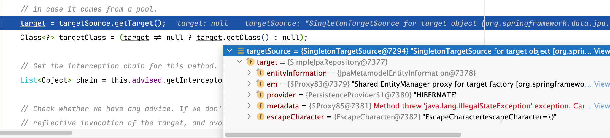
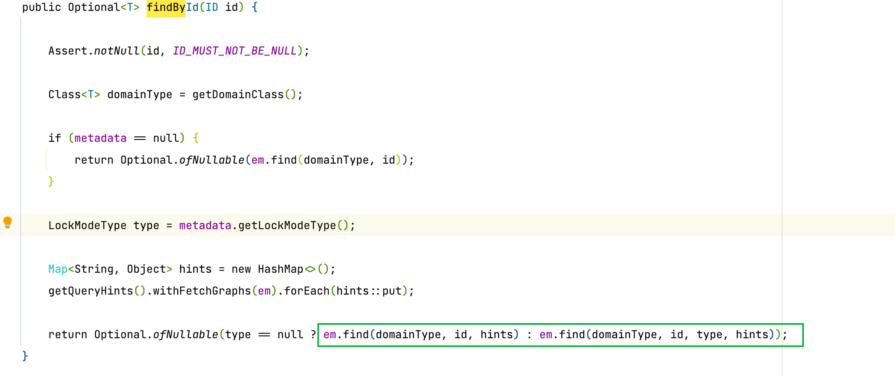
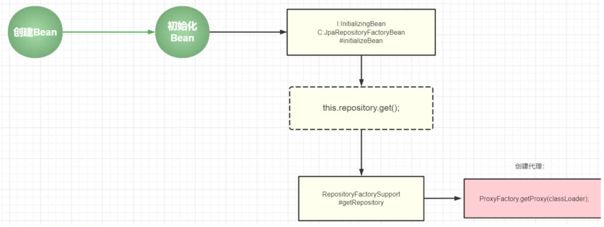

---
# 当前页面内容标题
title: 10、原理
# 分类
category:
  - springdata
# 标签
tag: 
  - spring
  - springdata
  - java
sticky: false
# 是否收藏在博客主题的文章列表中，当填入数字时，数字越大，排名越靠前。
star: false
# 是否将该文章添加至文章列表中
article: true
# 是否将该文章添加至时间线中
timeline: true
---

10、原理
---

### 10.1、Repository原理

核心机制：**动态代理**：

1. JdkDynamicAopProxy—invoke

- 调用 JPA的Repository统一实现

  - SimpleJpaRepository

  

  - 就是去通过JPA的API完成持久化操作



手写代码进行测试：

源码分析：

```java
package com.yykk.sourcecode;

import com.yykk.config.SpringDataJPAConfig;
import com.yykk.repositories.CustomerRepository;
import org.springframework.context.annotation.AnnotationConfigApplicationContext;
import org.springframework.orm.jpa.LocalContainerEntityManagerFactoryBean;

import javax.persistence.EntityManager;
import java.lang.reflect.ParameterizedType;
import java.lang.reflect.Proxy;
import java.lang.reflect.Type;

public class SourceCode {
    public static void main(String[] args) throws ClassNotFoundException {
        // spring上下文  spring容器 --- ioc加载过程：创建所有的bean，报错repository的Bean
        AnnotationConfigApplicationContext context = new AnnotationConfigApplicationContext(SpringDataJPAConfig.class);

        //CustomerRepository repository = context.getBean(CustomerRepository.class);

        //System.out.println(repository.getClass()); // jdk 动态代理

        //Optional<Customer> byId = repository.findById(7L);

        //System.out.println(byId.get());

        // 获得entityManager
        LocalContainerEntityManagerFactoryBean entityManagerFactoryBean = context.getBean(LocalContainerEntityManagerFactoryBean.class);
        EntityManager nativeEntityManager = entityManagerFactoryBean.createNativeEntityManager(null);

        // 获得当前接口的pojo类
        // getGenericInterfaces() 拿到当前接口的父接口 = PagingAndSortingRepository
        ParameterizedType parameterizedType = (ParameterizedType)CustomerRepository.class.getGenericInterfaces()[0];
        // 拿到接口的泛型 = <Customer,Long>
        Type type = parameterizedType.getActualTypeArguments()[0];
        Class clazz = Class.forName(type.getTypeName());

        CustomerRepository repository = (CustomerRepository) Proxy.newProxyInstance(
                CustomerRepository.class.getClassLoader(),
                new Class[]{CustomerRepository.class},
                new MyJpaRepository(nativeEntityManager,clazz)
        );
        repository.findById(7L);
    }
}
```

```java
package com.yykk.sourcecode;

import javax.persistence.EntityManager;
import java.lang.reflect.InvocationHandler;
import java.lang.reflect.Method;

public class MyJpaRepository implements InvocationHandler {

    EntityManager entityManager;
    Class pojoClass;

    public MyJpaRepository(EntityManager entityManager, Class pojoClass) {
        this.entityManager = entityManager;
        this.pojoClass = pojoClass;
    }

    // method 当前调用的方法
    // args 当前调用方法的参数
    @Override
    public Object invoke(Object proxy, Method method, Object[] args) throws Throwable {

        // jpa的统一实现类
        MyJpaProxy myJpaProxy = new MyJpaProxy(entityManager, pojoClass);
        Method targetMethod = myJpaProxy.getClass().getMethod(method.getName(), method.getParameterTypes());

        return targetMethod.invoke(myJpaProxy,args);
    }
}
```

```java
package com.yykk.sourcecode;

import org.springframework.data.domain.Page;
import org.springframework.data.domain.Pageable;
import org.springframework.data.domain.Sort;
import org.springframework.data.repository.PagingAndSortingRepository;

import javax.persistence.EntityManager;
import java.util.Optional;

public class MyJpaProxy implements PagingAndSortingRepository {

    EntityManager entityManager;
    Class pojoClass;

    public MyJpaProxy(EntityManager entityManager, Class pojoClass) {
        this.entityManager = entityManager;
        this.pojoClass = pojoClass;
    }

    @Override
    public Iterable findAll(Sort sort) {
        return null;
    }

    @Override
    public Page findAll(Pageable pageable) {
        return null;
    }

    @Override
    public Object save(Object entity) {
        return null;
    }

    @Override
    public Iterable saveAll(Iterable entities) {
        return null;
    }

    @Override
    public Optional findById(Object id) {
        // JPA
        return Optional.of(entityManager.find(pojoClass,id));
    }

    @Override
    public boolean existsById(Object o) {
        return false;
    }

    @Override
    public Iterable findAll() {
        return null;
    }

    @Override
    public Iterable findAllById(Iterable iterable) {
        return null;
    }

    @Override
    public long count() {
        return 0;
    }

    @Override
    public void deleteById(Object o) {

    }

    @Override
    public void delete(Object entity) {

    }

    @Override
    public void deleteAllById(Iterable iterable) {

    }

    @Override
    public void deleteAll(Iterable entities) {

    }

    @Override
    public void deleteAll() {

    }
}
```

```java
package com.yykk.sourcecode;

import com.yykk.config.SpringDataJPAConfig;
import com.yykk.pojo.Customer;
import com.yykk.repositories.CustomerRepository;
import org.junit.Test;
import org.junit.runner.RunWith;
import org.springframework.beans.factory.annotation.Autowired;
import org.springframework.data.jpa.repository.config.EnableJpaRepositories;
import org.springframework.test.context.ContextConfiguration;
import org.springframework.test.context.junit4.SpringJUnit4ClassRunner;

import java.util.Optional;

@EnableJpaRepositories(basePackages = "com.yykk.repositories")
@ContextConfiguration(classes = SpringDataJPAConfig.class)
@RunWith(SpringJUnit4ClassRunner.class)
public class SpringDataJpaSource {

    @Autowired
    CustomerRepository repository;

    @Test
    public void test_source() {
        Optional<Customer> id = repository.findById(7L);
        System.out.println(id.get());
    }
}
```



源码学习文章：

http://www.dewafer.com/2016/05/09/reading-src-of-spring-data-jpa/


### 10.2、spring整合JPA原理

1、spring怎么管理Repository（怎么创建的Repository的Bean）

1. @EnableJpaRepositories(basePackages = "com.yykk.repositories")
2. spring容器启动的时候ioc容器加载 ，根据 com.yykk.repositories 去创建bean

2、spring怎么将动态代理创建bean

```
Exceptioninthread"main"org.springframework.beans.factory.NoSuchBeanDefinitionException:No qualifying bean of type ' com.yykk.repositories.CustomerRepository' available
```

1. 没有找到bean，解决思路：
   - 应用层面：是不是配置不正确，配置正确，排除！
   - 底层层面：是不是spring底层扫描-排除。（Bean—>对象）

spring data JPA实现原理：https://zhuanlan.zhihu.com/p/85849213?ivk_sa=1024320u

