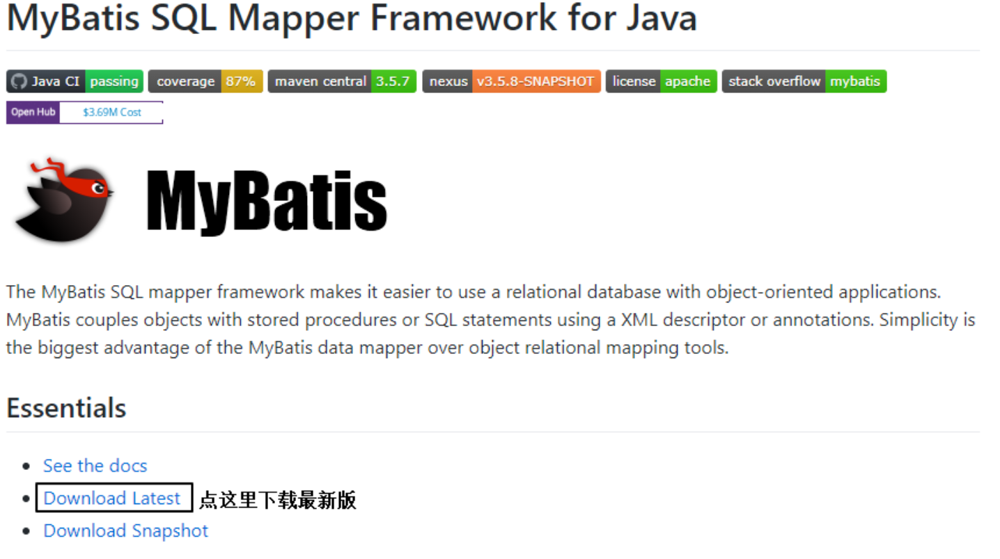
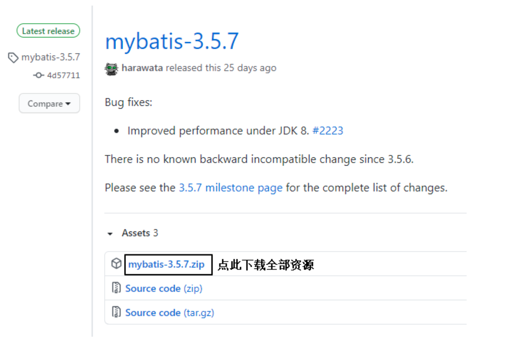

---
# 当前页面内容标题
title: 一、MyBatis简介
# 分类
category:
  - mybatis
# 标签
tag: 
  - mybatis
  - java
  - SSM框架
sticky: false
# 是否收藏在博客主题的文章列表中，当填入数字时，数字越大，排名越靠前。
star: false
# 是否将该文章添加至文章列表中
article: true
# 是否将该文章添加至时间线中
timeline: true
---

# 一、MyBatis简介

## 1、MyBatis历史

MyBatis最初是Apache的一个开源项目**iBatis**, 2010年6月这个项目由Apache Software Foundation迁 移到了Google Code。随着开发团队转投Google Code旗下， iBatis3.x正式更名为MyBatis。代码于 2013年11月迁移到Github。

iBatis一词来源于“internet”和“abatis”的组合，是一个基于Java的持久层框架。 iBatis提供的持久层框架 包括SQL Maps和Data Access Objects(DAO)。

> 中文地址：[MyBatis中文网](https://mybatis.net.cn/)
>
> 官网地址：[mybatis – MyBatis 3 | Introduction](https://mybatis.org/mybatis-3/)
>
> Github：[MyBatis (github.com)](https://github.com/mybatis)

## 2、MyBatis特性

1）MyBatis 是支持定制化 SQL、存储过程以及高级映射的优秀的持久层框架

2）MyBatis 避免了几乎所有的 JDBC 代码和手动设置参数以及获取结果集

3）MyBatis可以使用简单的XML或注解用于配置和原始映射，将接口和Java和POJO（Plain Old Java Objects， 普通的Java对象）映射成数据库中的记录

4）MyBatis 是一个半自动的 ORM（Object Relation Mapping） 框架

## 3、MyBatis下载

[MyBatis下载地址](https://github.com/mybatis/mybatis-3)

## 4、和其它持久层技术对比

- JDBC

  - SQL 夹杂在Java代码中耦合度高，导致硬编码内伤

  - 维护不易且实际开发需求中 SQL 有变化，频繁修改的情况多见

  - 代码冗长，开发效率低

- Hibernate 和 JPA

  - 操作简便，开发效率高

  - 程序中的长难复杂 SQL 需要绕过框架

  - 内部自动生产的 SQL，不容易做特殊优化 基于全映射的全自动框架，大量字段的 POJO 进行部分映射时比较困难。

  - 反射操作太多，导致数据库性能下降

- MyBatis

  - 轻量级，性能出色

  - SQL和Java编码分开，功能边界清晰。Java代码专注业务、SQL语句专注数据

  - 开发效率稍逊于Hlbernate，但是完成能够接受