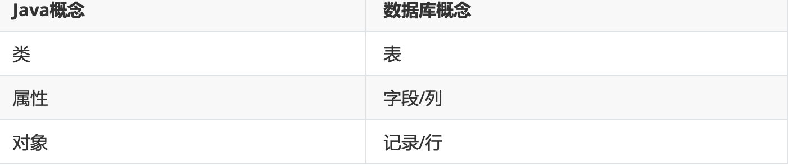

---
# 当前页面内容标题
title: 二、搭建MyBatis
# 分类
category:
  - mybatis
# 标签
tag: 
  - mybatis
  - java
  - SSM框架
sticky: false
# 是否收藏在博客主题的文章列表中，当填入数字时，数字越大，排名越靠前。
star: false
# 是否将该文章添加至文章列表中
article: true
# 是否将该文章添加至时间线中
timeline: true
---

# 二、搭建MyBatis

## 1、开发环境

IDE:idea 2021.3

构建工具:maven 3.8.4

MySQL版本:MySQL 8.0.27

MyBatis版本:MyBatis 3.5.7

## 2、创建maven工程

### a>打包方式

```
<packaging>jar</packaging>
```

### b>引入依赖

```xml
<dependencies>
      <dependency>
          <!--Mybatis核心-->
          <groupId>org.mybatis</groupId>
          <artifactId>mybatis</artifactId>
          <version>3.5.7</version>
      </dependency>

      <!--junit测试-->
      <dependency>
          <groupId>junit</groupId>
          <artifactId>junit</artifactId>
          <version>4.12</version>
          <scope>test</scope>
      </dependency>

      <!--mysql驱动-->
      <dependency>
          <groupId>mysql</groupId>
          <artifactId>mysql-connector-java</artifactId>
          <version>8.0.27</version>
      </dependency>

      <dependency>
          <groupId>org.projectlombok</groupId>
          <artifactId>lombok</artifactId>
          <version>1.18.22</version>
      </dependency>

      <dependency>
          <groupId>log4j</groupId>
          <artifactId>log4j</artifactId>
          <version>1.2.17</version>
      </dependency>
  </dependencies>
```

## 3、创建MyBatis的核心配置文件

> 习惯上命名为**mybatis-config.xml**，这个文件名仅仅只是建议，并非强制要求。将来整合Spring之后，这个配置文件可以省略，所以大家操作时可以直接复制、粘贴。 核心配置文件主要用于配置连接数据库的环境以及MyBatis的全局配置信息
>
> 核心配置文件存放的位置是**src/main/resources目录下**

```xml
<?xml version="1.0" encoding="UTF-8" ?>
<!DOCTYPE configuration
        PUBLIC "-//mybatis.org//DTD Config 3.0//EN"
        "http://mybatis.org/dtd/mybatis-3-config.dtd">
<configuration>
<!--设置连接数据库的环境--> <environments default="development">
        <environment id="development">
            <transactionManager type="JDBC"/>
            <dataSource type="POOLED">
                <property name="driver" value="com.mysql.jdbc.Driver"/>
                <property name="url"
value="jdbc:mysql://localhost:3306/MyBatis"/>
                <property name="username" value="root"/>
                <property name="password" value="123456"/>
            </dataSource>
        </environment>
    </environments>
<!--引入映射文件--> <mappers>
        <mapper resource="mappers/UserMapper.xml"/>
    </mappers>
</configuration>
```

## 4、创建mapper接口

**MyBatis中的Mapper接口相当于以前的dao**。但是区别于，mapper仅仅是接口，我们不需要写实现类

```java
public interface UserMapper {

    /**
     * Mybatis面向接口编程的两个一致
     * 1.映射文件的namespace要和mapper接口的全类名接口保持一致
     * 2.映射文件的id要和mapper接口中的方法保持一致
     *
     * 表 -- 实体类 -- mapper接口 -- 映射文件
     */

    /**
     * 添加用户信息
     */
    int insertUser(User user);

    /**
     * 修改用户信息
     */
    void updateUser();

    /**
     * 删除用户信息
     */
    void deleteUser();

    /**
     * 根据id查询用户信息
     */
    User getUserById();

    /**
     * 查询所有的用户信息
     */
    List<User> getAllUser();

}
```

## 5、创建MyBatis的映射文件

相关概念：**ORM（O**bject **R**elationship **M**apping**)**对象关系映射。

- 对象：Java的实体类对象
- 关系：关系型数据库
- 映射：二者之间的对应关系



> 1、映射文件的命名规则：
>
> **表所对应的实体的类名+Mapper.xml**
>
> 例如：表t_user，映射的实体类为User，所对应的映射文件为UserMapper.xml
>
> 因此一个映射文件用于编写SQL，访问以及操作表中的数据
>
> MyBaits映射文件用于编写SQL，访问以及操作表中的数据
>
> MyBatis映射文件存放的位置编写SQL，访问以及操作表中的数据
>
> 2、MyBatis中可以面向接口操作数据，要保存两个一致：
>
>     a>**mapper接口的全类名和映射文件的命名空间(namespace)保持一致**
>
>     b>**mapper接口中方法的方法名和映射文件中编写SQL的标签的id属性保持一致**

```xml
<?xml version="1.0" encoding="UTF-8" ?>
<!DOCTYPE mapper
        PUBLIC "-//mybatis.org//DTD Mapper 3.0//EN"
        "http://mybatis.org/dtd/mybatis-3-mapper.dtd">
<mapper namespace="com.atguigu.mybatis.mapper.UserMapper">
    <!--int insertUser();-->
<insert id="insertUser">
insert into t_user values(null,'张三','123',23,'女')
    </insert>
</mapper>
```

## 6、通过junit测试功能

```java
@Test
public void testMyBatis() throws IOException {
    // 加载核心配置文件
    InputStream is = Resources.getResourceAsStream("mybatis-config.xml");
    // 获取SqlSessionFactoryBuilder
    SqlSessionFactoryBuilder sqlSessionFactoryBuilder = new SqlSessionFactoryBuilder();
    // 获取SqlSessionFactory
    SqlSessionFactory sqlSessionFactory = sqlSessionFactoryBuilder.build(is);
    // 获取SqlSession
    SqlSession session = sqlSessionFactory.openSession(true);
    // 获取mapper接口对象
    UserMapper mapper = session.getMapper(UserMapper.class); // 底层会自动为我们创建好mapper接口的实现类
    // 测试功能
    int result = mapper.insertUser(new User(null, "小胡", "123456", 20, "男", "123@qq.com"));
    // 提交事务
    // session.commit();
    System.out.println("result = " + result);
    session.close();
}
```

> - SqlSession：代表java程序和数据库之间的会话。（HttpSession是java程序和浏览器之间的会话）
> - SqlSessionFactory：是生产SqlSession的工厂
> - 工厂模式：如果创建某个对象，使用的过程基本固定，那么我们就可以把创建这个对象的相关代码封装到一个”工厂类“中，以后都可以使用这个工厂类来”生产”我们需要的对象。

## 7、加入log4j日志功能

### a>加入依赖

```xml
<!-- log4j日志 --> <dependency>
    <groupId>log4j</groupId>
    <artifactId>log4j</artifactId>
    <version>1.2.17</version>
</dependency>
```

### b>加入log4j的配置文件

```xml
<?xml version="1.0" encoding="UTF-8" ?>
<!DOCTYPE log4j:configuration SYSTEM "log4j.dtd">
<log4j:configuration xmlns:log4j="http://jakarta.apache.org/log4j/">
    <appender name="STDOUT" class="org.apache.log4j.ConsoleAppender">
        <param name="Encoding" value="UTF-8" />
        <layout class="org.apache.log4j.PatternLayout">
            <param name="ConversionPattern" value="%-5p %d{MM-dd HH:mm:ss,SSS}
%m  (%F:%L) \n" />
        </layout>
    </appender>
    <logger name="java.sql">
        <level value="debug" />
    </logger>
    <logger name="org.apache.ibatis">
        <level value="info" />
    </logger>
    <root>
        <level value="debug" />
        <appender-ref ref="STDOUT" />
    </root>
</log4j:configuration>
```

> **日志的级别**
>
> FATAL(致命)>ERROR(错误)>WARN(警告)>INFO(信息)>DEBUG(调试) 从左到右打印的内容越来越详细