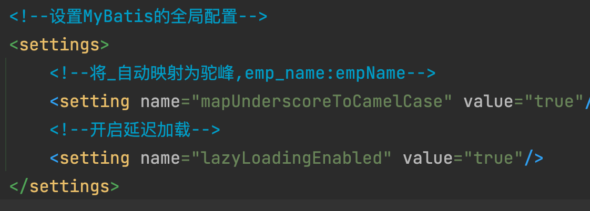

---
# 当前页面内容标题
title: 八、自定义映射resultMap
# 分类
category:
  - mybatis
# 标签
tag: 
  - mybatis
  - java
  - SSM框架
sticky: false
# 是否收藏在博客主题的文章列表中，当填入数字时，数字越大，排名越靠前。
star: false
# 是否将该文章添加至文章列表中
article: true
# 是否将该文章添加至时间线中
timeline: true
---

# 八、自定义映射resultMap

## 1、resultMap处理字段和属性的映射的关系

若字段名和实体列中的属性名不一致，则可以通过resultMap设置自定义映射

```xml
<!--
  resultMap：设置自定义映射关系
  id：唯一标识，不能重复
  type：设置映射关系中的实体类类型
  子标签：
  id：设置主键的映射关系
  result：设置普通字段的映射关系
      属性：
      property:设置映射关系中的属性名，必须是type属性所设置的实体类类型中的属性名
      column:设置映射关系中的字符名，必须是sql语句查询出的字段名
-->
<resultMap id="empResultMap" type="Emp">
  <id property="eid" column="eid" />
  <result property="empName" column="emp_name" />
  <result property="age" column="age" />
  <result property="sex" column="sex" />
  <result property="email" column="email" />
</resultMap>
<!--List<Emp> getAllEmp();-->
<select id="getAllEmp" resultMap="empResultMap">
    <!--select eid, emp_name empName, age, sex, email from t_emp-->
    select * from t_emp
</select>
```

> 若字段名和实体类中的属性名不一致，但是字段名符合数据库的规则(使用_)，实体类中的属性 名符合Java的规则(使用驼峰)
>
> 此时也可通过以下两种方式处理字段名和实体类中的属性的映射关系 a>可以通过为字段起别名的方式，保证和实体类中的属性名保持一致
>
> b>可以在MyBatis的核心配置文件中设置一个全局配置信息mapUnderscoreToCamelCase，可 以在查询表中数据时，自动将_类型的字段名转换为驼峰
>
> 例如:字段名user_name，设置了mapUnderscoreToCamelCase，此时字段名就会转换为 userName

## 2、多对一映射处理

```
# <association> 元素，通常可以配置一下属性

- propery:指定映射到实体类对象属性，与表字段一一对应
- column：指定表中对应的字段
- javaType：指定映射到实体对象属性的类型
- select：指定引入嵌套查询的子SQL语句，该属性用于关联映射中的嵌套查询
- fetchType：指定在关联查询时是否启用延迟加载。FetchType属性有lazy和eager两个属性值，默认值为lazy
  默认为lazy(默认关联映射延迟加载)
```

> 查询员工信息以及员工所对应的部门信息  

### a>级联方式处理映射关系

```
/**
* 查询员工股以及员工对应的部门信息
*/
Emp getEmpAndDept(@Param("eid") Integer eid);
```

```xml
<!--处理多对一的映射关系方式一：级联属性赋值-->
<resultMap id="empAndDeptResultMapOne" type="Emp">
    <id property="eid" column="eid" />
    <result property="empName" column="emp_name" />
    <result property="age" column="age" />
    <result property="sex" column="sex" />
    <result property="dept.did" column="did" />
    <result property="dept.deptName" column="dept_name" />
</resultMap>

<!--Emp getEmpAndDept(@Param("eid") Integer eid);-->
<select id="getEmpAndDept" resultMap="empAndDeptResultMapOne">
    select * from t_emp left join t_dept on t_emp.did = t_dept.did where t_emp.eid = #{eid}
</select>
```

### b>使用assocation处理映射关系

```xml
<!--处理多对一映射关系方式二：association-->
<resultMap id="empAndDeptResultMapTwo" type="Emp">
    <id property="eid" column="eid" />
    <result property="empName" column="emp_name" />
    <result property="age" column="age" />
    <result property="sex" column="sex" />
    <result property="email" column="email" />
    <!--
        association:处理多对一的映射关系
        property:需要处理的属性名
        javaType：该属性的类型
    -->
    <association property="dept" javaType="Dept">
        <id property="did" column="did" />
        <result property="deptName" column="dept_name" />
    </association>
</resultMap>

<!--Emp getEmpAndDept(@Param("eid") Integer eid);-->
<select id="getEmpAndDept" resultMap="empAndDeptResultMapTwo">
    select * from t_emp left join t_dept on t_emp.did = t_dept.did where t_emp.eid = #{eid}
</select>
```

### c>分布查询

1. 查询员工信息

```java
/**
* 通过分布查询查询员工以及员工所对应的部门信息
* 分布查询第一步：查询员工信息
*/
Emp getEmpAndDeptByStepOne(@Param("eid") Integer eid);
```

2. 根据员工所对应的部门di查询部门信息

```java
/**
 * 通过分布查询员工以及员工所对应的部门信息
 * 分布查询第二步：通过did查询员工对应的部门
 */
Dept getEmpAndDeptByStepTwo(@Param("did")Integer did);
```

```java
<resultMap id="empAndDeptByStepResultMap" type="Emp">
    <id property="eid" column="eid" />
    <result property="empName" column="emp_name" />
    <result property="age" column="age" />
    <result property="sex" column="sex" />
    <result property="email" column="email" />
    <!--
        select:设置分布查询的sql的唯一标识(namespace.SQLId或mapper接口的全类名.方法名)
        column:设置分布查询的条件
        fetchType:当开启了全局的延迟加载之后，可通过此属性手动控制延迟加载的效果
        fetchType:"lazy|eager":lazy表示延迟加载，eager表示立即加载
    -->
    <association property="dept"
                 select="com.atguigu.mybatis.mapper.DeptMapper.getEmpAndDeptByStepTwo"
                 column="did"
                 fetchType="eager"
    />
</resultMap>

<!--Dept getEmpAndDeptByStepOne(@Param("eid") Integer eid);-->
<select id="getEmpAndDeptByStepOne" resultMap="empAndDeptByStepResultMap" >
    select * from t_emp where eid = #{eid}
</select>
```

```xml
<!--Dept getEmpAndDeptByStepTwo(@Param("did")Integer did);-->
<select id="getEmpAndDeptByStepTwo" resultType="Dept">
    select * from t_dept where did = #{did}
</select>
```

## 3、一对多映射处理

```
# collection属性
# ofType：指完整Java类名或者别名,即集合所包含的类型
# property：指定映射数据库列的实体对象属性
# column：指定表中对应的字段
# select：指定引入嵌套查询的子SQL语句，该属性用于关联映射中的嵌套查询
```

### a>collection

```java
/**
* 获取部门以及部门中所有员工信息
* 一对多的关系
*/
Dept getDeptAndEmps(@Param("did") Integer did);
```

```xml
<resultMap id="deptAndEmpsResultMap" type="Dept">
    <id property="did" column="did" />
    <result property="deptName" column="dept_name" />
    <!--
        collection:处理一对多的映射关系
        ofType：表示该属性所对应的集合中存储数据的类型
    -->
    <collection property="emps" ofType="Emp">
        <id property="eid" column="eid" />
        <result property="empName" column="emp_name" />
        <result property="age" column="age" />
        <result property="sex" column="sex" />
        <result property="email" column="email" />
    </collection>
</resultMap>

<!--Dept getDeptAndEmps(@Param("did") Integer did);-->
<select id="getDeptAndEmps" resultMap="deptAndEmpsResultMap">
    select * from t_dept left join t_emp on t_dept.did = t_emp.did where t_dept.did = #{did}
</select>
```

### b>分布查询

1. 查询部门信息

```java
/**
 * 通过分布查询部门以及部门中所有的员工信息
 * 分布查询第一步：查询部门信息
 */
Dept getDeptAndEmpByStepOne(@Param("did")Integer did);
```

2. 根据部门id查询部门中所有的员工

```java
/**
 * 通过分布查询部门以及部门中所有的员工信息系
 * 分布查询第二步：根据did查询员工信息
 */
List<Emp> getDeptAndEmpByStepTwo(@Param("did") Integer did);
```

```xml
<resultMap id="deptAndEmpByStepResultMap" type="Dept">
    <id property="did" column="did" />
    <result property="deptName" column="dept_name" />
    <collection property="emps"
                select="com.atguigu.mybatis.mapper.EmpMapper.getDeptAndEmpByStepTwo"
                fetchType="eager"
                column="did"/>
</resultMap>

<!--Dept getDeptAndEmpByStepOne(@Param("did")Integer did);-->
<select id="getDeptAndEmpByStepOne" resultMap="deptAndEmpByStepResultMap">
    select * from t_dept where did = #{did}
</select>
```

```xml
<!--List<Emp> getDeptAndEmpByStepTwo(@Param("did") Integer did)-->
<select id="getDeptAndEmpByStepTwo" resultType="Emp">
    select * from t_emp where did = #{did}
</select>
```

> 分布查询的优点：可以实现延迟加载，但是必须在核心配置文件中设置全局配置信息
>
> - lazyLoadingEnabled：延迟加载的全局开关。当开启时，所有关联对象都会延迟加载
> - **aggressiveLazyLoading:当开启时，任何方法的调用都会加载该对象的所有属性。 否则，每个 属性会按需加载**
> - 此时就可以实现按需加载，获取的数据是什么，就只会执行相应的sql。此时可通过association和 collection中的**fetchType属性**设置当前的分步查询是否使用延迟加载，**fetchType="lazy(延迟加 载)|eager(立即加载)"**



> ** 解决字段名和属性名不一致的情况：  *
>
>  a>为字段起别名，保持和属性名的一致  
>
> *** b>设置全局配置，将_自动映射为驼峰  
>
> *****  <setting name="mapUnderscoreToCamelCase" value="true"/>  
>
> *** c>通过resultMap设置自定义的映射关系*

---

*测试类：*

```java
package com.atguigu.mybatis.test;

import com.atguigu.mybatis.mapper.DeptMapper;
import com.atguigu.mybatis.mapper.EmpMapper;
import com.atguigu.mybatis.pojo.Dept;
import com.atguigu.mybatis.pojo.Emp;
import com.atguigu.mybatis.utils.SqlSessionUtils;
import org.apache.ibatis.session.SqlSession;
import org.junit.Test;

import java.util.List;

public class ResultMapTest {

/**
 * 解决字段名和属性名不一致的情况：
 * a>为字段起别名，保持和属性名的一致
 * b>设置全局配置，将_自动映射为驼峰
 * <setting name="mapUnderscoreToCamelCase" value="true"/>
 * c>通过resultMap设置自定义的映射关系
 *
 * <resultMap id="empResultMap" type="Emp">
 *     <id property="eid" column="eid" />
 *     <result property="empName" column="emp_name" />
 *     <result property="age" column="age" />
 *     <result property="sex" column="sex" />
 *     <result property="email" column="email" />
 * </resultMap>
 *
 * 处理多对一的映射关系：
 * a>级联属性赋值
 * b>association
 *
 * 处理一对多的映射关系
 * a>collection
 * b>分布查询
 */


@Test
public void testGetAllEmp() {
    SqlSession session = SqlSessionUtils.getSqlSession();
    EmpMapper mapper = session.getMapper(EmpMapper.class);
    List<Emp> list = mapper.getAllEmp();
    list.forEach(emp -> System.out.println(emp));
}

@Test
public void testGetEmpAndDept() {
    SqlSession session = SqlSessionUtils.getSqlSession();
    EmpMapper mapper = session.getMapper(EmpMapper.class);
    Emp emp = mapper.getEmpAndDept(2);
    System.out.println(emp);
}

@Test
public void testGetEmpAndDeptByStep() {
    SqlSession session = SqlSessionUtils.getSqlSession();
    EmpMapper mapper = session.getMapper(EmpMapper.class);
    Emp emp = mapper.getEmpAndDeptByStepOne(3);
    System.out.println(emp.getEmpName());
    System.out.println("++++++++++++++++++++++++");
    System.out.println(emp.getDept());
}

@Test
public void testGetDeptAndEmps() {
    SqlSession session = SqlSessionUtils.getSqlSession();
    DeptMapper mapper = session.getMapper(DeptMapper.class);
    Dept dept = mapper.getDeptAndEmps(1);
    System.out.println("dept = " + dept);
    /*
        运行结果：
        dept = Dept(did=1, deptName=A, emps=[
        Emp(eid=1, empName=张三, age=23, sex=男, email=123@qq.com, dept=null),
        Emp(eid=4, empName=赵六, age=34, sex=男, email=123@qq.com, dept=null)
        ])
     */
}

@Test
public void testGetDeptAndEmpByStep() {
    SqlSession session = SqlSessionUtils.getSqlSession();
    DeptMapper mapper = session.getMapper(DeptMapper.class);
    Dept dept = mapper.getDeptAndEmpByStepOne(1);
    System.out.println(dept.getDeptName());
}

}
```

